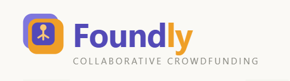

# Capítulo II: Requirements Elicitation & Analysis
## 2.1. Competidores
### 2.1.1. Análisis competitivo

En esta sección se realizará el análisis competitivo de los competidores identificados en la sección inicial con el objetivo de tener una idea más clara sobre nuestro producto frente a los competidores y aprender para mejorar nuestro producto.

<table>
<thead>
  <tr>
    <th colspan="6">Competitive Analysis Landscape</th>
  </tr>
</thead>
<tbody>
  <tr>
    <td colspan="2">¿Por qué llevar a cabo este análisis?</td>
    <td colspan="4">Este análisis se lleva a cabo para poder investigar, analizar y comparar el comportamiento de los competidores directos o indirectos en el mercado</td>
  </tr>
  <tr>
    <td colspan="2">
Nombre
</td>
    <td>
Foundly
</td>
    <td>
Kickstarter
</td>
    <td>
Indiegogo
</td>
    <td>
GoFundMe
</td>
  </tr>
  <tr>
    <td colspan="2">
Logo
</td>
    <td>

</td>
    <td>

</td>
    <td>

</td>
    <td>

</td>
  </tr>
  <tr>
    <td rowspan="2">Perfil</td>
    <td>Overview</td>
    <td>Foundly es una plataforma de crowdfunding colaborativo diseñada para que las personas puedan crear grupos o unirse a comunidades que buscan resolver problemas, desarrollar startups o impulsar proyectos sociales. Se enfoca en Perú y Latinoamérica, donde el crowdfunding aún tiene gran potencial de crecimiento. Además, incorpora un <strong>módulo de monitoreo de impacto ambiental con integración IoT</strong> que permite a proyectos con enfoque sostenible visualizar métricas en tiempo real como calidad del aire y humedad, diferenciándose de cualquier plataforma de crowdfunding existente en la región.</td>
    <td>Kickstarter es una de las plataformas de crowdfunding más grandes del mundo, fundada en 2009 en EE. UU. Su objetivo principal es ayudar a creadores, emprendedores y startups creativas a obtener financiamiento colectivo para lanzar proyectos innovadores en áreas como tecnología, arte, música, cine, diseño y videojuegos.</td>
    <td>Indiegogo es una plataforma de crowdfunding global fundada en 2008 en EE. UU., considerada la principal alternativa a Kickstarter. Se caracteriza por su flexibilidad en las campañas y por abarcar proyectos de tecnología, diseño, salud, causas sociales y estilo de vida.</td>
    <td>GoFundMe, fundada en 2010 en Estados Unidos, es una de las plataformas de crowdfunding personal y solidario más grandes del mundo. A diferencia de Kickstarter o Indiegogo, se centra en causas personales, sociales y humanitarias (salud, emergencias, educación, funerales, desastres naturales, etc.) en lugar de proyectos creativos o startups.</td>
  </tr>
  <tr>
    <td>Ventaja Competitiva ¿Qué valor ofrece a los clientes?</td>
    <td>
      <ul>
        <li><strong>Colaboración integral:</strong> No solo conecta a personas para aportar dinero, sino también para aportar ideas, habilidades y tiempo, creando equipos de trabajo alrededor de cada proyecto.</li>
        <li><strong>Módulo IoT de impacto ambiental:</strong> Única plataforma de crowdfunding colaborativo que integra monitoreo de métricas ambientales en tiempo real (calidad del aire, humedad, participación), permitiendo a proyectos sostenibles evidenciar su impacto de forma concreta.</li>
        <li><strong>Accesibilidad y bajo costo de entrada:</strong> Con el modelo freemium (5 proyectos gratuitos antes de pagar), cualquier persona puede iniciar sin necesidad de grandes recursos.</li>
        <li><strong>Plataforma enfocada en comunidad:</strong> Permite que los usuarios formen grupos organizados con roles, tareas y objetivos compartidos, fortaleciendo el sentido de pertenencia.</li>
        <li><strong>Impulso al emprendimiento local y social:</strong> Brinda un espacio para que tanto emprendedores como comunidades puedan impulsar ideas y proyectos de impacto sin depender de financiamiento tradicional.</li>
        <li><strong>Transparencia y confianza:</strong> Implementa procesos de verificación y seguimiento de proyectos para dar seguridad a los participantes y donantes.</li>
      </ul>
    </td>
    <td>
      <ul>
        <li>Exposición global: conecta a emprendedores con millones de potenciales patrocinadores en todo el mundo.</li>
        <li>Validación de mercado: los creadores pueden probar si su idea tiene interés real antes de invertir grandes sumas de dinero.</li>
        <li>Modelo claro de recompensas: los backers reciben beneficios tangibles (productos exclusivos, experiencias, versiones anticipadas).</li>
        <li>Confianza y marca reconocida: Kickstarter es sinónimo de crowdfunding creativo, lo que da credibilidad a los proyectos.</li>
        <li>Comunidad activa de innovación: los usuarios buscan activamente apoyar ideas novedosas, generando oportunidades de networking.</li>
      </ul>
    </td>
    <td>
      <ul>
        <li>Flexibilidad en el financiamiento: permite elegir entre campañas de "Todo o nada" o "Flexible Funding".</li>
        <li>Apoyo post-campaña: con el programa InDemand, los creadores pueden seguir recaudando fondos incluso después de que termine la campaña inicial.</li>
        <li>Enfoque en innovación temprana: permite a los emprendedores mostrar productos en etapas iniciales, atrayendo a "early adopters".</li>
        <li>Servicios adicionales: ofrece marketing, logística y distribución en alianza con empresas.</li>
        <li>Mayor diversidad de categorías: no solo tecnología y arte, también estilo de vida, salud y proyectos sociales.</li>
      </ul>
    </td>
    <td>
      <ul>
        <li>Acceso inmediato a financiamiento solidario: cualquier persona puede abrir una campaña en minutos, sin requisitos complejos ni planes de negocio.</li>
        <li>Enfoque en causas personales y sociales: ideal para emergencias médicas, desastres naturales, educación o apoyo comunitario.</li>
        <li>Alto nivel de confianza: es la plataforma de donaciones más reconocida a nivel mundial.</li>
        <li>Facilidad de uso y viralización: integración con redes sociales que permite compartir campañas y llegar a más donantes.</li>
        <li>Modelo sin tarifas de plataforma en muchos países: aumenta el monto que llega directamente al beneficiario.</li>
      </ul>
    </td>
  </tr>
  <tr>
    <td rowspan="2">Perfiles de Marketing</td>
    <td>Mercado Objetivo</td>
    <td>
      <ul>
        <li><strong>Emprendedores y startups en etapa temprana:</strong> estudiantes y jóvenes profesionales (18–35) en Perú con proyección a LATAM, que buscan validar y financiar ideas y armar equipo multidisciplinario.</li>
        <li><strong>Profesionales y estudiantes con habilidades:</strong> desarrolladores, diseñadores, marketers, PMs y financieros que desean aportar tiempo/talento a proyectos reales y fortalecer su portafolio.</li>
        <li><strong>Proyectos con enfoque sostenible:</strong> equipos o emprendedores que buscan medir y evidenciar el impacto ambiental de sus iniciativas mediante tecnología IoT.</li>
      </ul>
    </td>
    <td>
      <ul>
        <li>Creadores de proyectos creativos e innovadores: artistas, músicos, cineastas, diseñadores, escritores. Emprendedores tecnológicos que buscan validar gadgets, apps o hardware.</li>
        <li>Backers (aportantes o patrocinadores): personas con interés en apoyar la innovación y obtener recompensas exclusivas. Comunidades entusiastas (ej. gamers, cinéfilos, techies).</li>
      </ul>
    </td>
    <td>
      <ul>
        <li>Creadores y emprendedores: emprendedores de sectores como salud, bienestar, estilo de vida y sostenibilidad. Empresas en etapa temprana que buscan financiamiento y visibilidad internacional.</li>
        <li>Backers (aportantes / compradores anticipados): early adopters interesados en probar productos antes de que lleguen al mercado. Personas que buscan apoyar proyectos con impacto social o ambiental.</li>
      </ul>
    </td>
    <td>
      <ul>
        <li>Creadores de campañas (beneficiarios): personas que atraviesan emergencias médicas, familias afectadas por desastres naturales, comunidades y ONGs que buscan financiamiento para causas sociales.</li>
        <li>Donantes (aportantes solidarios): individuos que desean ayudar a personas en situaciones difíciles.</li>
      </ul>
    </td>
  </tr>
  <tr>
    <td>Estrategias de marketing</td>
    <td>
      <ul>
        <li><strong>Marketing Digital y Redes Sociales:</strong> campañas en Facebook, Instagram, TikTok y LinkedIn para captar tanto emprendedores como colaboradores.</li>
        <li><strong>Marketing de Contenidos:</strong> blog con artículos sobre emprendimiento, innovación y economía colaborativa.</li>
        <li><strong>Alianzas estratégicas:</strong> convenios con universidades para que estudiantes publiquen proyectos académicos o de investigación.</li>
      </ul>
    </td>
    <td>
      <ul>
        <li>Viralización digital con fuerte presencia en redes sociales (Facebook, Instagram, Twitter y Youtube).</li>
        <li>Alianzas con medios y sectores creativos para visibilidad.</li>
      </ul>
    </td>
    <td>
      <ul>
        <li>Flexibilidad en el financiamiento (todo o nada / flexible funding).</li>
        <li>Programa InDemand para seguir recaudando después de la campaña.</li>
        <li>Alianzas con aceleradoras, logística y distribución para apoyar la llegada al mercado.</li>
        <li>Promoción de casos de éxito tecnológicos como validación de la plataforma.</li>
      </ul>
    </td>
    <td>
      <ul>
        <li>Marketing emocional con imágenes, videos y testimonios de impacto.</li>
        <li>Colaboración con influencers y celebridades en campañas solidarias.</li>
        <li>Viralización masiva en redes sociales (Facebook, Twitter, Instagram).</li>
      </ul>
    </td>
  </tr>
  <tr>
    <td rowspan="3">Perfil de Producto</td>
    <td>Productos &amp; Servicios</td>
    <td>
      <ul>
        <li><strong>Productos:</strong> proyectos colaborativos creados por los usuarios.</li>
        <li><strong>Servicios:</strong> ecosistema digital seguro, accesible y colaborativo, con herramientas de financiamiento, creación de equipos y <strong>módulo IoT de monitoreo de impacto ambiental en tiempo real</strong>.</li>
      </ul>
    </td>
    <td>
      <ul>
        <li><strong>Productos:</strong> proyectos y recompensas que los creadores ofrecen a sus backers.</li>
        <li><strong>Servicios:</strong> plataforma digital confiable de financiamiento colectivo, con herramientas de gestión, visibilidad y comunidad.</li>
      </ul>
    </td>
    <td>
      <ul>
        <li><strong>Productos:</strong> innovaciones tecnológicas y de estilo de vida.</li>
        <li><strong>Servicios:</strong> acompañamiento post-campaña (InDemand), marketing y apoyo logístico.</li>
      </ul>
    </td>
    <td>
      <ul>
        <li><strong>Productos:</strong> campañas solidarias personales y comunitarias.</li>
        <li><strong>Servicios:</strong> plataforma segura, simple y viralizable para conectar donantes con causas sociales y personales en todo el mundo.</li>
      </ul>
    </td>
  </tr>
  <tr>
    <td>Precios y Costos</td>
    <td>
      <ul>
        <li><strong>Plan Freemium:</strong> hasta 5 proyectos creados/postulados.</li>
        <li><strong>Plan Premium (Mensual/Anual):</strong> proyectos ilimitados + mayor visibilidad en el buscador.</li>
      </ul>
    </td>
    <td>
      <ul>
        <li>Comisión fija del 5% + tarifas de procesamiento de pagos entre el 3% y el 5% dependiendo de la región, moneda e impuestos aplicables.</li>
        <li>Costos logísticos y de producción corren a cargo del creador.</li>
      </ul>
    </td>
    <td>
      <ul>
        <li>5% de comisión de plataforma sobre lo recaudado. 3% + tarifa fija por procesamiento de pagos.</li>
        <li>Tarifas de transferencia bancaria adicionales según ubicación.</li>
        <li>En campañas InDemand no originadas en Indiegogo, se aplican comisiones más altas (8% + 15%).</li>
      </ul>
    </td>
    <td>
      <ul>
        <li>No cobra tarifa de creación ni de gestión de campañas.</li>
        <li>Sistema de aportaciones voluntarias de los donantes a la plataforma ("tips"), nunca obligatorias.</li>
        <li>Comisión por cada donación: 2.9% + $0.30 USD.</li>
        <li>Para ONGs ofrece GoFundMe Pro, con precios personalizados y herramientas avanzadas.</li>
      </ul>
    </td>
  </tr>
  <tr>
    <td>Canales de Distribución (Web y/o Móvil)</td>
    <td>Web</td>
    <td>Web y App</td>
    <td>Web</td>
    <td>Web y App (solo para algunos países)</td>
  </tr>
  <tr>
    <td rowspan="4">Análisis SWOT</td>
    <td>Fortalezas</td>
    <td>
      <ul>
        <li>Los usuarios no solo aportan dinero, sino también habilidades, tiempo e ideas, formando equipos de trabajo.</li>
        <li>Con el modelo freemium (5 proyectos gratis), cualquier persona puede iniciar sin necesidad de gran capital.</li>
        <li>Llena un vacío de mercado en regiones donde las grandes plataformas globales no tienen presencia oficial.</li>
        <li>Sistema de verificación de usuarios y proyectos que reduce fraudes y genera mayor credibilidad.</li>
        <li>Único diferenciador tecnológico en el mercado regional: módulo IoT que permite a proyectos ambientales medir y evidenciar su impacto en tiempo real, algo que ningún competidor directo ofrece.</li>
      </ul>
    </td>
    <td>
      <ul>
        <li>Marca reconocida globalmente como referente en crowdfunding creativo.</li>
        <li>Seguridad en transacciones y prestigio cultural en sectores creativos.</li>
        <li>Modelo transparente que genera confianza en los aportantes.</li>
        <li>Gran base de usuarios y comunidad activa de backers en más de 200 países.</li>
      </ul>
    </td>
    <td>
      <ul>
        <li>Programa InDemand que permite seguir recaudando tras la campaña inicial.</li>
        <li>Amplia variedad de categorías (tecnología, salud, estilo de vida, causas sociales).</li>
        <li>Servicios adicionales de marketing, logística y distribución.</li>
        <li>Alianzas con aceleradoras y empresas para llevar productos al mercado.</li>
      </ul>
    </td>
    <td>
      <ul>
        <li>Plataforma líder en crowdfunding solidario y personal.</li>
        <li>Marca reconocida globalmente, asociada a confianza y solidaridad.</li>
        <li>Facilidad de uso: crear una campaña es rápido y sencillo.</li>
        <li>Red global de donantes y fuerte integración con redes sociales.</li>
      </ul>
    </td>
  </tr>
  <tr>
    <td>Debilidades</td>
    <td>
      <ul>
        <li>Al ser un proyecto nuevo, necesitará mucho esfuerzo en marketing para generar confianza frente a un público poco familiarizado con el crowdfunding.</li>
        <li>Aunque se implementen medidas de verificación, siempre existe el riesgo de que un proyecto no cumpla lo prometido, afectando la reputación.</li>
        <li>En Perú y gran parte de Latinoamérica, el concepto de crowdfunding aún no es masivo, por lo que será necesario invertir en educación y sensibilización del público.</li>
        <li>Sin integración con pasarelas de pago internacionales consolidadas, a diferencia de sus competidores globales.</li>
      </ul>
    </td>
    <td>
      <ul>
        <li>Limitado a países autorizados (no disponible en Perú ni gran parte de Sudamérica).</li>
        <li>Riesgo de incumplimiento de proyectos, afectando la confianza en la plataforma.</li>
        <li>Proceso de revisión de proyectos que retrasa los lanzamientos (1–3 días hábiles).</li>
        <li>Comisiones relativamente altas (5% + tarifas de pago).</li>
      </ul>
    </td>
    <td>
      <ul>
        <li>Menor visibilidad y tráfico que Kickstarter.</li>
        <li>Reputación afectada por proyectos fallidos o retrasados en entregas.</li>
        <li>Altas tarifas de procesamiento y transferencia en algunos países.</li>
        <li>Competencia con Amazon Launchpad y otros marketplaces post-campaña.</li>
      </ul>
    </td>
    <td>
      <ul>
        <li>Dependencia de la viralización en redes sociales para el éxito de las campañas.</li>
        <li>Riesgo de fraudes y campañas engañosas, que afectan su credibilidad.</li>
        <li>Limitada diversificación de servicios (no ofrece logística ni acompañamiento post-campaña).</li>
        <li>Menor atractivo para donantes en mercados emergentes con baja capacidad adquisitiva.</li>
      </ul>
    </td>
  </tr>
  <tr>
    <td>Oportunidades</td>
    <td>
      <ul>
        <li>Plataformas globales como Kickstarter no tienen presencia oficial en Perú ni en la mayoría de Sudamérica, lo que deja espacio para una propuesta local.</li>
        <li>Posibilidad de crear convenios institucionales para impulsar proyectos estudiantiles, comunitarios o de innovación social.</li>
        <li>Una vez consolidado en Perú, puede expandirse a otros países de Latinoamérica con características de mercado similares.</li>
        <li>Creciente interés global en sostenibilidad abre un nicho para proyectos que usen el módulo IoT como herramienta de transparencia ambiental.</li>
      </ul>
    </td>
    <td>
      <ul>
        <li>Expandirse a mercados emergentes como Latinoamérica, donde no tiene presencia.</li>
        <li>Alianzas con universidades, incubadoras y gobiernos para fomentar el emprendimiento.</li>
        <li>Colaboraciones con grandes marcas que validen productos vía crowdfunding.</li>
        <li>Aumento de cultura colaborativa post-pandemia que impulsa el financiamiento online.</li>
      </ul>
    </td>
    <td>
      <ul>
        <li>Expansión en mercados emergentes (Latinoamérica, África, Asia).</li>
        <li>Posicionarse como líder en innovación tecnológica temprana.</li>
        <li>Colaborar con grandes marcas tecnológicas como canal de validación de productos.</li>
      </ul>
    </td>
    <td>
      <ul>
        <li>Expansión en mercados emergentes (Latinoamérica, África, Asia).</li>
        <li>Alianzas con ONGs, fundaciones y gobiernos para campañas humanitarias.</li>
        <li>Mayor presencia en emergencias globales (desastres naturales, pandemias, guerras).</li>
        <li>Crecer con donaciones recurrentes y servicios premium para ONGs (GoFundMe Pro).</li>
      </ul>
    </td>
  </tr>
  <tr>
    <td>Amenazas</td>
    <td>
      <ul>
        <li>Plataformas como Kickstarter, Indiegogo y GoFundMe pueden expandirse a Latinoamérica y captar rápidamente usuarios gracias a su marca.</li>
        <li>Nuevas startups regionales podrían lanzar plataformas similares adaptadas cultural y económicamente al público local.</li>
        <li>Casos de fraude o incumplimiento de proyectos pueden afectar la reputación del crowdfunding en general, desincentivando a potenciales usuarios.</li>
        <li>La ausencia de leyes claras sobre crowdfunding en Perú y Latinoamérica puede derivar en futuras regulaciones estrictas que limiten su operación.</li>
      </ul>
    </td>
    <td>
      <ul>
        <li>Riesgo de fraudes y proyectos incumplidos que dañan la reputación.</li>
        <li>Cambios regulatorios que pueden limitar el crowdfunding en distintos países.</li>
        <li>La limitación geográfica actual deja espacio a plataformas locales en Sudamérica.</li>
      </ul>
    </td>
    <td>
      <ul>
        <li>Riesgo de pérdida de confianza por incumplimientos de proyectos.</li>
        <li>Regulaciones en crowdfunding que pueden restringir operaciones internacionales.</li>
        <li>Saturación del mercado de crowdfunding con nuevos competidores regionales.</li>
      </ul>
    </td>
    <td>
      <ul>
        <li>Desconfianza pública derivada de casos de fraude o uso indebido de fondos.</li>
        <li>Crisis económicas globales que reducen la disposición de donar.</li>
      </ul>
    </td>
  </tr>
</tbody>
</table>

### 2.1.2. Estrategias y tácticas frente a competidores

En esta sección se presentan las estrategias y tácticas preliminares que aplicará Foundly para afrontar las fortalezas de la competencia, aprovechar sus debilidades, capitalizar las oportunidades del entorno y mitigar las amenazas identificadas en el análisis FODA.

---

##### Estrategias para aprovechar las debilidades de los competidores

Los principales competidores identificados Kickstarter, Indiegogo y GoFundMe presentan debilidades concretas que Foundly puede explotar de manera directa:

- **Kickstarter e Indiegogo no tienen presencia oficial en Perú ni en gran parte de Sudamérica.** Foundly aprovechará este vacío posicionándose como la primera plataforma de crowdfunding colaborativo adaptada al contexto latinoamericano, con soporte en español, métodos de pago locales y una propuesta de valor orientada a las necesidades del emprendedor peruano.

- **Kickstarter aplica un proceso de revisión de proyectos de 1 a 3 días hábiles**, lo que retrasa el lanzamiento de campañas. Foundly ofrecerá publicación inmediata de proyectos, reduciendo la fricción de entrada y permitiendo que los emprendedores actúen con mayor agilidad.

- **Kickstarter e Indiegogo cobran comisiones de entre 5% y 8% más tarifas de procesamiento**, lo que encarece el crowdfunding para proyectos pequeños. El modelo freemium de Foundly con hasta 5 proyectos gratuitos representa una alternativa de menor costo de entrada, especialmente atractiva para emprendedores en etapas tempranas.

- **Ningún competidor integra formación de equipos multidisciplinarios ni monitoreo de impacto ambiental con IoT.** Foundly se diferencia al ofrecer ambas funcionalidades en un solo ecosistema, cubriendo necesidades que las plataformas globales ignoran por completo.

- **Táctica:** Campañas de comunicación directa destacando las ventajas comparativas frente a la competencia, usando mensajes como "sin listas de espera", "sin comisiones al inicio" y "el equipo también importa", dirigidas a emprendedores que ya conocen Kickstarter o Indiegogo pero no pueden acceder a ellas desde Perú.

---

##### Estrategias para afrontar las fortalezas de los competidores

Kickstarter, Indiegogo y GoFundMe cuentan con marcas globalmente reconocidas, grandes bases de usuarios y modelos consolidados de confianza. Para afrontar estas fortalezas:

- **Estrategia de Diferenciación:** Foundly no compite en el mismo terreno que los competidores globales, sino que construye una categoría propia: el crowdfunding colaborativo con formación de equipos. A diferencia de las plataformas tradicionales donde el usuario solo aporta dinero, Foundly permite aportar habilidades, tiempo e ideas, generando valor más allá del financiamiento económico.

- **Módulo IoT como diferenciador tecnológico único:** Foundly incorpora un módulo de monitoreo de impacto ambiental con integración IoT que permite a proyectos sostenibles visualizar métricas en tiempo real como calidad del aire, humedad y participación ciudadana. Ningún competidor directo ofrece esta funcionalidad, lo que refuerza la propuesta de valor frente a un mercado con creciente interés en la sostenibilidad.

- **Táctica:** Implementar un sistema de verificación de usuarios y proyectos, junto con seguimiento de hitos y un sistema de reputación, para construir confianza progresiva entre los usuarios y compensar la menor trayectoria de marca frente a competidores consolidados.

---

##### Estrategias para capitalizar las oportunidades del entorno

- **Estrategia de Entrada al Mercado Local (Perú – LATAM):** Foundly iniciará operaciones en Perú como mercado piloto, aprovechando la ausencia de competidores globales con presencia oficial en la región. Una vez validado el modelo, se escalará progresivamente hacia otros países de Latinoamérica con características de mercado similares.

- **Táctica:** En la fase inicial se ejecutará una campaña de educación y sensibilización sobre qué es el crowdfunding y cómo funciona, mediante talleres, webinars gratuitos y alianzas con universidades, incubadoras de negocios, coworkings y ONGs locales. El objetivo es posicionar a Foundly como pionera en financiamiento colaborativo adaptado al contexto latinoamericano antes de que los competidores globales decidan expandirse.

- **Estrategia de Marketing Digital Segmentado:** Se implementarán campañas diferenciadas en Facebook, Instagram, TikTok y LinkedIn, segmentadas por edad, intereses y afinidad con el emprendimiento o causas sociales, orientadas a los dos segmentos objetivos: emprendedores en etapa temprana y colaboradores profesionales.

- **Táctica:** Contenido visual y narrativo videos cortos, reels, historias y testimonios de usuarios reales que muestren casos de proyectos financiados exitosamente, tutoriales sobre cómo crear una campaña y el funcionamiento del módulo IoT para proyectos ambientales.

---

##### Estrategias para mitigar las amenazas del entorno

- **Amenaza: expansión de competidores globales a Latinoamérica.** Si Kickstarter o Indiegogo deciden ingresar a la región, Foundly ya contará con una base de usuarios establecida, alianzas institucionales y una propuesta de valor que va más allá del crowdfunding tradicional. La velocidad de entrada al mercado es la principal defensa.

  - **Táctica:** Acelerar la captación de usuarios y la generación de alianzas con universidades e incubadoras durante los primeros 12 meses, creando barreras de fidelización antes de que los competidores globales puedan reaccionar.

- **Amenaza: casos de fraude que afectan la reputación del crowdfunding en general.** El ecosistema de crowdfunding a nivel global enfrenta desconfianza derivada de proyectos incumplidos o campañas fraudulentas, lo que puede afectar a Foundly aunque no sea directamente responsable.

  - **Táctica:** Implementar desde el lanzamiento un sistema de verificación de identidad, validación de proyectos y seguimiento obligatorio de hitos con evidencias. El módulo de reputación permitirá que los usuarios evalúen proyectos y equipos, generando transparencia y disuadiendo comportamientos fraudulentos.

- **Amenaza: ausencia de regulación clara sobre crowdfunding en Perú.** La falta de un marco legal específico puede derivar en regulaciones futuras que limiten la operación de plataformas de financiamiento colectivo.

  - **Táctica:** Desde el inicio, Foundly operará bajo estándares de transparencia financiera y cumplimiento normativo general, documentando todos los flujos de fondos y manteniendo comunicación con asociaciones de emprendimiento y organismos regulatorios, de modo que la plataforma esté preparada para adaptarse a cualquier cambio regulatorio sin interrupciones.

## 2.2. Entrevistas
### 2.2.1. Diseño de entrevistas
### 2.2.2. Registro de entrevistas
### 2.2.3. Análisis de entrevistas
## 2.3. Needfinding
### 2.3.1. User Personas
### 2.3.2. User Task Matrix
### 2.3.3. User Journey Mapping
### 2.3.4. Empathy Mapping
## 2.4. Big Picture Event Storming

**Step 1 – Free Exploration**

En esta primera etapa, el equipo realizó una sesión de lluvia de ideas para capturar todos los eventos relevantes dentro del dominio, sin preocuparse por el orden o la jerarquía. El objetivo principal fue representar los acontecimientos reales del negocio, de manera independiente a cualquier función técnica o relacionada con un sistema.

**Step 2 – Structured Organization**

Después de listar los eventos, el equipo los organizó en flujos de negocio lógicos que reflejan las principales etapas en la creacion, colaboracion, gestion de los proyectos. Esta estructura ayudó a identificar los procesos clave y las áreas de mejora que posteriormente podrían abordarse mediante soluciones digitales o de gestión.

## 2.5. Ubiquitous Language

En esta sección se establece un glosario de términos clave del dominio de negocio, construido bajo el enfoque de Domain-Driven Design (DDD) propuesto por Eric Evans. El propósito de este glosario es garantizar un lenguaje común y compartido entre todos los miembros del equipo, evitando ambigüedades y facilitando una comunicación clara y consistente durante el desarrollo del proyecto.

| Termino | Definición |
|--------|-----------|
| Project (Proyecto) | Iniciativa colaborativa creada dentro de la plataforma con el objetivo de generar impacto ambiental o social. Incluye descripción, objetivos, actividades y métricas de impacto, y puede requerir colaboradores. |
| Entrepreneur (Organizador) | Usuario que crea y gestiona un proyecto dentro de la plataforma, coordinando actividades, atrayendo participantes y generando impacto medible. |
| Collaborator (Colaborador) | Usuario que se une a un proyecto existente aportando habilidades, conocimientos o tiempo para contribuir al cumplimiento de los objetivos. |
| Team (Equipo) | Grupo de usuarios (organizadores y colaboradores) que trabajan en un proyecto de manera estructurada, con roles definidos, responsabilidades y objetivos compartidos. |
| Contribution (Contribución) | Aporte realizado por los usuarios a un proyecto, que puede ser en forma de tiempo, trabajo, recursos o apoyo económico, permitiendo el avance del proyecto. |
| Reputation (Reputación) | Indicador del nivel de participación y confiabilidad de un usuario dentro de la plataforma, basado en su actividad, cumplimiento de tareas y contribuciones. |
| Metrics (Métricas) | Indicadores que muestran el progreso de un proyecto y el impacto generado, incluyendo participación, cumplimiento de tareas y datos ambientales. |
| Subscription (Subscripción) | Modelo de acceso a la plataforma mediante un pago recurrente que otorga beneficios adicionales y funcionalidades avanzadas. |
| Milestone (Hito) | Punto de control dentro de un proyecto que representa un objetivo grupal. Agrupa tareas individuales y permite medir el avance del proyecto. |
| Task (Tarea) | Actividad individual asignada a un usuario dentro de un hito, con estado, responsable y seguimiento de progreso. |
| Sensor Data (Datos de sensores) | Información capturada desde dispositivos IoT (simulados), como temperatura, humedad y calidad del aire, asociada a un proyecto o actividad. |
| Environmental Metric (Métrica ambiental) | Indicador que representa condiciones del entorno físico, como calidad del aire o humedad del suelo, utilizado para evaluar el impacto. |
| Impact Data (Datos de impacto) | Datos procesados a partir de la participación de usuarios y métricas ambientales, que permiten evidenciar el impacto de un proyecto. |
| Real-time Monitoring (Monitoreo en tiempo real) | Capacidad del sistema para visualizar datos ambientales de manera continua, permitiendo observar cambios en el entorno durante la ejecución de proyectos. |
