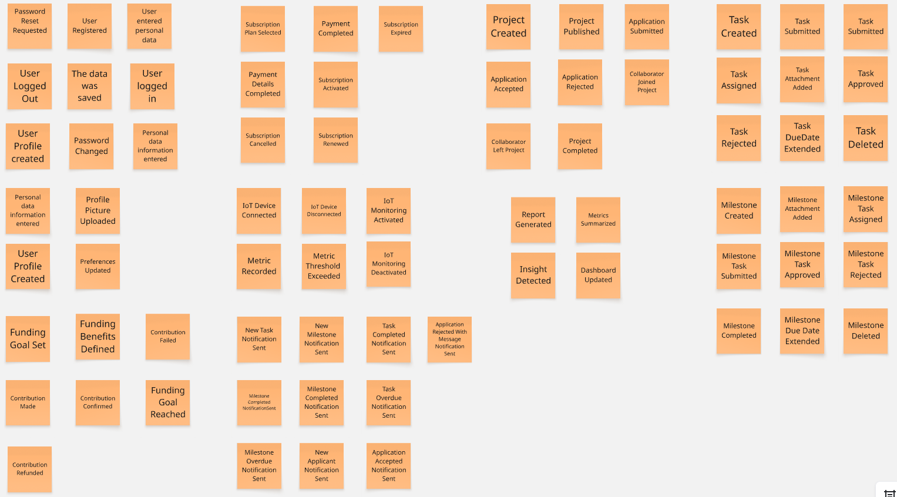
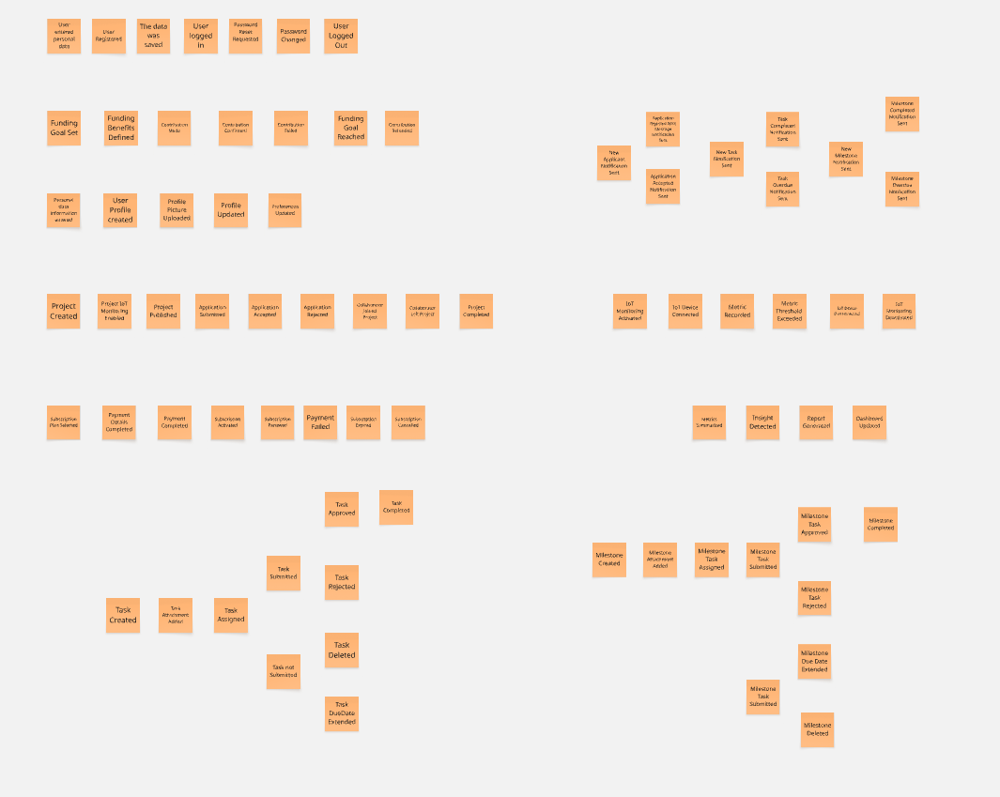

# Capítulo II: Requirements Elicitation & Analysis
## 2.1. Competidores
### 2.1.1. Análisis competitivo
### 2.1.2. Estrategias y tácticas frente a competidores
## 2.2. Entrevistas
### 2.2.1. Diseño de entrevistas
### 2.2.2. Registro de entrevistas
### 2.2.3. Análisis de entrevistas
## 2.3. Needfinding
### 2.3.1. User Personas
### 2.3.2. User Task Matrix
### 2.3.3. User Journey Mapping
### 2.3.4. Empathy Mapping
## 2.4. Big Picture Event Storming

**Step 1 – Free Exploration**

> En esta primera etapa, el equipo realizó una sesión de lluvia de ideas para capturar todos los eventos relevantes dentro del dominio, sin preocuparse por el orden o la jerarquía. El objetivo principal fue representar los acontecimientos reales del negocio, de manera independiente a cualquier función técnica o relacionada con un sistema.

**Step 2 – Structured Organization**

> Después de listar los eventos, el equipo los organizó en flujos de negocio lógicos que reflejan las principales etapas en la creacion, colaboracion, gestion de los proyectos. Esta estructura ayudó a identificar los procesos clave y las áreas de mejora que posteriormente podrían abordarse mediante soluciones digitales o de gestión.

## 2.5. Ubiquitous Language
