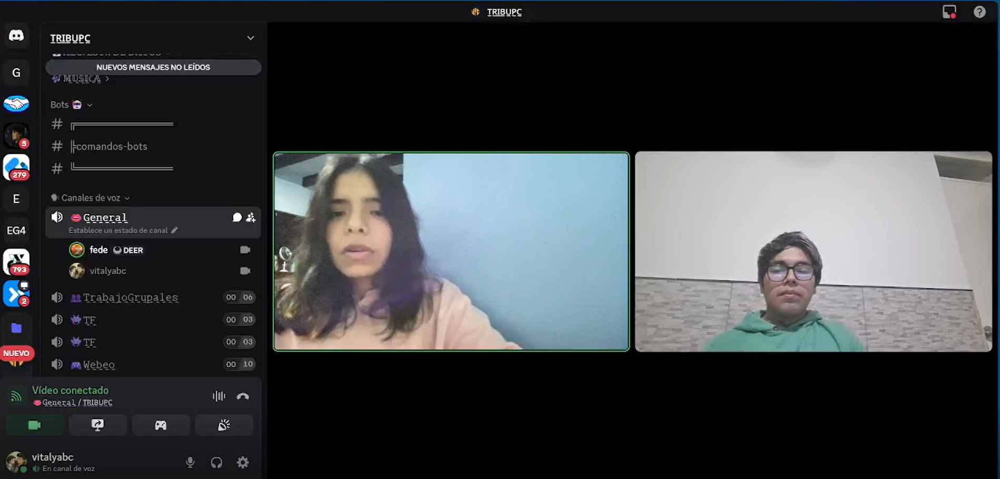
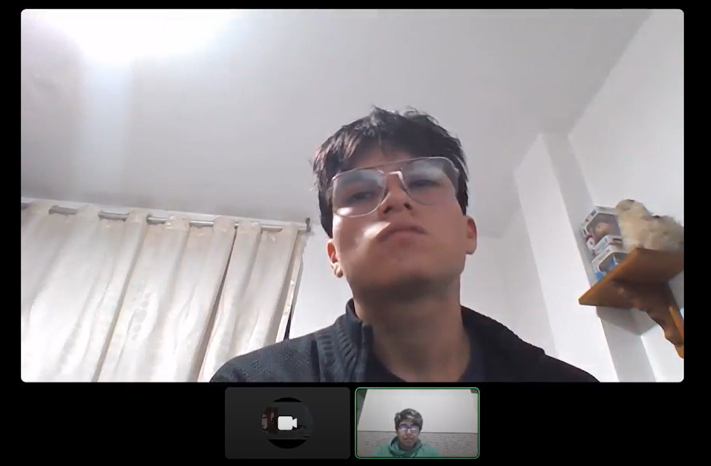
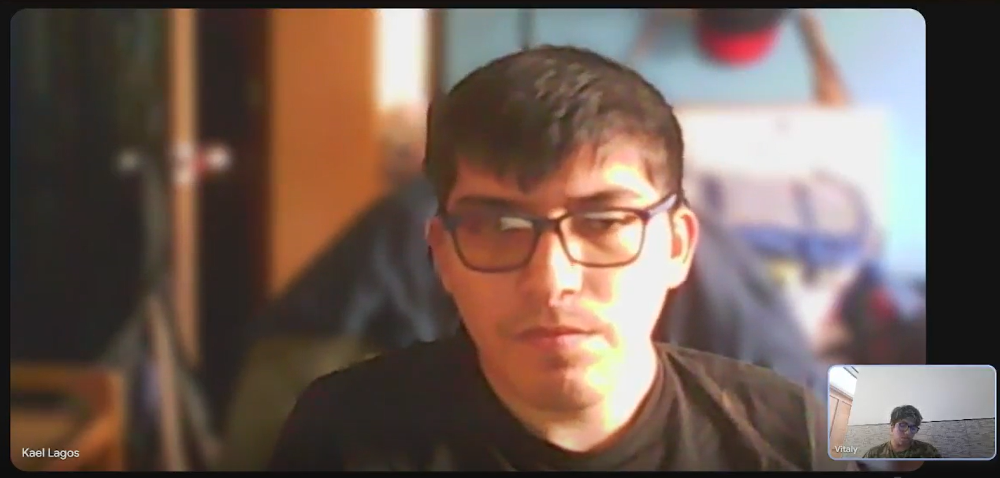
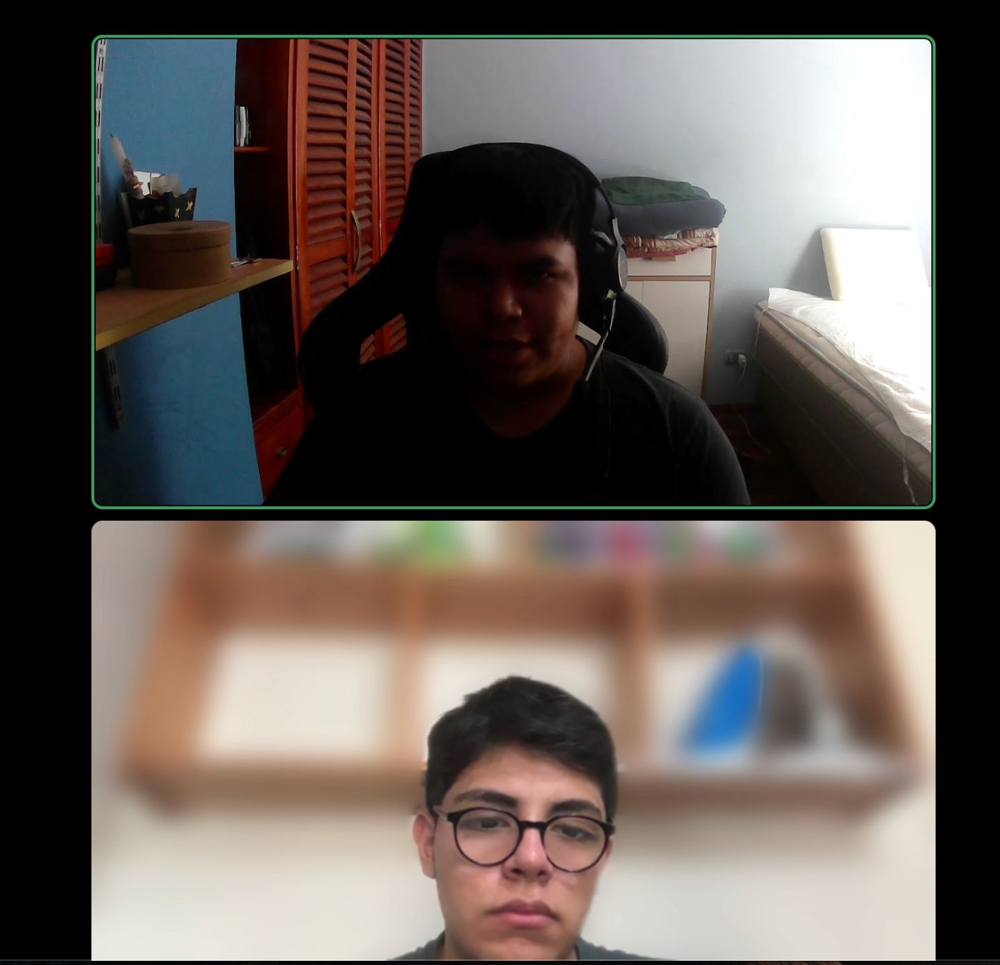

# Capítulo II: Requirements Elicitation & Analysis
## 2.1. Competidores
### 2.1.1. Análisis competitivo
### 2.1.2. Estrategias y tácticas frente a competidores
## 2.2. Entrevistas

En esta sección se abordará la investigación en base a la información que se obtendrá de los segmentos entrevistados con el objetivo de conocer mejor a nuestros segmentos objetivos y aprender de ellos y sus procesos.

### 2.2.1. Diseño de entrevistas
 
---
 
#### Segmento 1: Emprendedores y Startups en Etapa Temprana
 
**Introducción:**
Buenos días/tardes/noches, mi nombre es [Nombre del entrevistador]. Hoy tengo el agrado de conversar con [Nombre del entrevistado], emprendedor(a) que busca impulsar sus ideas o proyectos. El objetivo de esta entrevista es conocer su experiencia y expectativas para crear soluciones que realmente aporten al ecosistema emprendedor. Gracias por su tiempo y disposición.
 
1. ¿De qué forma suele financiar actualmente sus proyectos o ideas de negocio?
2. ¿Ha utilizado antes plataformas de crowdfunding u otras herramientas digitales para obtener financiamiento? ¿Cómo fue su experiencia?
3. ¿Qué dificultades ha enfrentado para conseguir colaboradores con habilidades diferentes a las suyas (ej. diseño, tecnología, marketing)?
4. ¿Cuáles son sus principales preocupaciones al buscar financiamiento en línea para un proyecto en etapa temprana?
5. ¿Qué características considera indispensables en una plataforma que combine formación de equipos con campañas de financiamiento?
6. ¿Qué mecanismos de transparencia le generarían más confianza al invertir tiempo y esfuerzo en una plataforma (ej. reportes de avance, hitos validados, reputación de equipos)?
7. ¿Cómo evaluaría si una plataforma realmente le ayuda a reducir riesgos de fracaso en su emprendimiento?
8. ¿Qué beneficios esperaría obtener al usar una plataforma como esta, en comparación con las formas tradicionales de buscar financiamiento o colaboradores?
9. ¿En qué momento siente que más necesita apoyo para su emprendimiento: al validar la idea, al formar el equipo o al buscar financiamiento?
10. ¿Ha dejado de usar alguna plataforma o herramienta porque no cumplió con sus expectativas? ¿Qué fue lo que más le molestó?
 
**Cierre:**
Muchas gracias por compartir su experiencia y perspectivas. Su opinión es muy valiosa para diseñar una herramienta que apoye de verdad a los emprendedores en etapa temprana.
 
---
 
#### Segmento 2: Estudiantes Universitarios y Profesionales Jóvenes
 
**Introducción:**
Buenos días/tardes/noches, mi nombre es [Nombre del entrevistador]. Hoy entrevisto a [Nombre del entrevistado], estudiante/profesional joven interesado en adquirir experiencia práctica y colaborar en proyectos innovadores. El objetivo es conocer sus motivaciones y expectativas al integrarse en equipos de emprendimiento. Gracias por su tiempo.
 
1. ¿Actualmente participa en proyectos fuera de sus estudios o trabajo formal? ¿De qué tipo?
2. ¿Ha usado alguna plataforma para colaborar en proyectos, voluntariados o equipos multidisciplinarios? ¿Cómo le fue?
3. ¿Qué lo motivaría a unirse a un proyecto de emprendimiento en línea (ej. experiencia, networking, posibles ingresos)?
4. ¿Qué dificultades ha tenido para encontrar oportunidades de colaboración relevantes a su perfil o intereses?
5. ¿Qué funciones considera más útiles en una plataforma que le permita unirse a equipos y aportar sus habilidades?
6. ¿Qué nivel de información le gustaría tener antes de decidir unirse a un proyecto (ej. objetivos, roles, nivel de compromiso requerido, métricas de avance)?
7. ¿Qué mecanismos le darían confianza de que su trabajo dentro del equipo será valorado y reconocido?
8. ¿Qué beneficios espera obtener al participar en una plataforma de este tipo (ej. experiencia práctica, portafolio, contactos, oportunidades laborales)?
9. ¿Cómo cree que esta plataforma podría ayudarle a crecer profesionalmente en comparación con actividades tradicionales (ej. prácticas, cursos, voluntariados)?
10. ¿Qué lo motivaría a recomendar esta herramienta a otros estudiantes o jóvenes profesionales?
 
**Cierre:**
Muchas gracias por su tiempo y comentarios. Su aporte nos ayudará a crear una plataforma más útil y atractiva para jóvenes con interés en colaborar y aprender de proyectos reales.

### 2.2.2. Registro de entrevistas
En esta sección presentamos los registros de las entrevistas que hicimos para cada segmento objetivo de nuestra aplicación.

**Segmento 1:**

<table>
<colgroup>
</colgroup>
<thead>
  <tr>
    <th colspan="2">Entrevista #1 </th>
  </tr>
</thead>
<tbody>
  <tr>
    <td>Nombre</td>
    <td>Diana Lucia</td>
  </tr>
  <tr>
    <td>Apellidos</td>
    <td>Briceño Huarcaya</td>
  </tr>
  <tr>
    <td>Edad</td>
    <td>20 años</td>
  </tr>
  <tr>
    <td>Distrito</td>
    <td>Barranco</td>
  </tr>
  <tr>
    <td>Aplicaciones Usadas</td>
    <td>Microsoft Stream</td>
  </tr>
  <tr>
    <td>Motivacion</td>
    <td>Conseguir colaboradores con habilidades complementarias.</td>
  </tr>
  <tr>
    <td>Frustracion</td>
    <td>Dificultad para encontrar colaboradores comprometidos y confiables.</td>
  </tr>
  <tr>
    <td>Evidencia</td>
    <td>
</td>
  </tr>
  <tr>
    <td>Link</td>
    <td>
<a target="_blank"  href="https://upcedupe-my.sharepoint.com/:v:/g/personal/u20231c426_upc_edu_pe/IQB-pW1mSnVFRrnYXrmZb_zqAYfSIXqhAS_soBgVYZph2FE?nav=eyJyZWZlcnJhbEluZm8iOnsicmVmZXJyYWxBcHAiOiJTdHJlYW1XZWJBcHAiLCJyZWZlcnJhbFZpZXciOiJTaGFyZURpYWxvZy1MaW5rIiwicmVmZXJyYWxBcHBQbGF0Zm9ybSI6IldlYiIsInJlZmVycmFsTW9kZSI6InZpZXcifX0%3D&e=8kAkXJ" title="Title">Microsoft Stream
</td>
  </tr>
  <tr>
    <td>Duracion </td>
    <td>0:00 min - 10:18 min</td>
  </tr>
  <tr>
    <td>Resumen</td>
    <td>
			En la entrevista con Diana Briceño, logramos conocer su opinión acerca de qué le pareció nuestra landing page y nuestra aplicación web. Indicó que le llamó la mucho la atención nuestra landing page, que le pareció muy bien organizada y fácil de comprender y leer, e incluso dijo que nuestra aplicación web le sorprendió buenamente, ya que le encantó lo tan detallada que está y su facilidad de usar, indicó que tal vez podríamos mejorar el tamaño de las letras pero que todo lo demás le había gustado y parecía excelente.
Finalmente indicó que sí estaría dispuesto a utilizar Foundly y a recomendársela a sus amigos y familiares.
</td>
  </tr>
</tbody>
</table>

<table>
<colgroup>
</colgroup>
<thead>
  <tr>
    <th colspan="2">Entrevista #2 </th>
  </tr>
</thead>
<tbody>
  <tr>
    <td>Nombre</td>
    <td>Didier Sebastian</td>
  </tr>
  <tr>
    <td>Apellidos</td>
    <td>Meza Solórzano</td>
  </tr>
  <tr>
    <td>Edad</td>
    <td>19 años</td>
  </tr>
  <tr>
    <td>Distrito</td>
    <td>Villa Maria del Triunfo</td>
  </tr>
  <tr>
    <td>Aplicaciones Usadas</td>
    <td>WhatsApp, Github, KickStarter</td>
  </tr>
  <tr>
    <td>Motivacion</td>
    <td>Usar una plataforma clara, intuitiva y que lo ayude a organizarse mejor.</td>
  </tr>
  <tr>
    <td>Frustracion</td>
    <td>Desorden en la comunicación al depender de WhatsApp (información perdida entre mensajes).</td>
  </tr>
  <tr>
    <td>Evidencia</td>
    <td>
</td>
  </tr>
  <tr>
    <td>Link</td>
    <td>
		
<a target="_blank"  href="https://upcedupe-my.sharepoint.com/:v:/g/personal/u20231c426_upc_edu_pe/IQBYjsQz0dfJQ5cJSAmi7NBpAZKE6jIVLX_3Q7VbDHe8adc?e=dAxnxt&nav=eyJyZWZlcnJhbEluZm8iOnsicmVmZXJyYWxBcHAiOiJTdHJlYW1XZWJBcHAiLCJyZWZlcnJhbFZpZXciOiJTaGFyZURpYWxvZy1MaW5rIiwicmVmZXJyYWxBcHBQbGF0Zm9ybSI6IldlYiIsInJlZmVycmFsTW9kZSI6InZpZXcifX0%3D" title="Title">Microsoft Stream

	</td>
  </tr>
  <tr>
    <td>Duracion </td>
    <td>0:00 min - 10:53 min</td>
  </tr>
  <tr>
    <td>Resumen</td>
    <td>
		Didier Meza es un emprendedor en etapa temprana que financia sus proyectos principalmente con ahorros propios y apoyo cercano de familiares o amigos, lo cual considera limitado para avanzar. Ha probado plataformas como Kickstarter, pero su experiencia fue negativa por la falta de visibilidad, la necesidad de invertir en publicidad externa y las barreras para proyectos de Perú, lo que lo desmotivó.

Su mayor dificultad es formar equipos comprometidos: muchos interesados abandonan al poco tiempo y le resulta complejo conectar con personas con habilidades en áreas que no domina (diseño, marketing). Además, coordinar por WhatsApp le genera frustración debido al desorden y la pérdida de información en los chats.

Lo que más le preocupa al buscar financiamiento en línea es la seguridad del dinero y la seriedad de los proyectos, ya que la falta de confianza desanima tanto a él como a los posibles aportantes. Para una plataforma ideal valora que sea clara, fácil de usar, que permita mostrar bien la propuesta, ofrecer reportes de avance visibles, sistemas de reputación/verificación y herramientas para organizar tareas con métricas claras.

Didier ve como beneficios principales el alcance mayor, la posibilidad de recibir feedback de personas con experiencia y el acceso a colaboradores que complementen sus habilidades. Considera crítico contar con un equipo sólido desde el inicio, porque sin él la validación de ideas y el financiamiento se vuelven inviables.

</td>
  </tr>
</tbody>
</table>

**Segmento 2:**

<table>
<colgroup>
</colgroup>
<thead>
  <tr>
    <th colspan="2">Entrevista #1 </th>
  </tr>
</thead>
<tbody>
  <tr>
    <td>Nombre</td>
    <td>Kael Valentino</td>
  </tr>
  <tr>
    <td>Apellidos</td>
    <td>Lagos Rivera</td>
  </tr>
  <tr>
    <td>Edad</td>
    <td>20 años</td>
  </tr>
  <tr>
    <td>Distrito</td>
    <td>Surquillo</td>
  </tr>
  <tr>
    <td>Aplicaciones Usadas</td>
    <td> WhatsApp, GitHub</td>
  </tr>
  <tr>
    <td>Motivacion</td>
    <td>Ganar experiencia práctica en proyectos reales.</td>
  </tr>
  <tr>
    <td>Frustracion</td>
    <td>Dificultad para encontrar proyectos alineados a sus intereses o perfiles compatibles.</td>
  </tr>
  <tr>
    <td>Evidencia</td>
    <td>

</td>
  </tr>
  <tr>
    <td>Link</td>
    <td>
		
<a target="_blank"  href="https://upcedupe-my.sharepoint.com/:v:/g/personal/u20231c426_upc_edu_pe/IQABmhcLE9j_QJz9uAhlFPCsAWkLGBXR2v4Kfjcw82JcgQY?e=JEZdGi&nav=eyJyZWZlcnJhbEluZm8iOnsicmVmZXJyYWxBcHAiOiJTdHJlYW1XZWJBcHAiLCJyZWZlcnJhbFZpZXciOiJTaGFyZURpYWxvZy1MaW5rIiwicmVmZXJyYWxBcHBQbGF0Zm9ybSI6IldlYiIsInJlZmVycmFsTW9kZSI6InZpZXcifX0%3D" title="Title">Microsoft Stream

	</td>
  </tr>
  <tr>
    <td>Duracion </td>
    <td>
		0:00 min - 10:16 min
	</td>
  </tr>
  <tr>
    <td>Resumen</td>
    <td>
		Kael Lagos es un estudiante joven que participa activamente en proyectos universitarios, talleres y trabajos personales. Lo motiva principalmente ganar experiencia y construir un portafolio que le abra puertas laborales, además de generar networking y posibles ingresos. Sus frustraciones se centran en la falta de organización en las herramientas actuales, la dificultad de encontrar equipos compatibles y la poca certeza sobre la valoración de su aporte. Busca una plataforma que ofrezca orden, transparencia y reconocimiento, facilitando su crecimiento profesional de manera práctica y colaborativa.
</td>
  </tr>
</tbody>
</table>

<table>
<colgroup>
</colgroup>
<thead>
  <tr>
    <th colspan="2">Entrevista #2 </th>
  </tr>
</thead>
<tbody>
  <tr>
    <td>Nombre</td>
    <td>Diego Alonso</td>
  </tr>
  <tr>
    <td>Apellidos</td>
    <td>Esquicha Alcántara</td>
  </tr>
  <tr>
    <td>Edad</td>
    <td>19 años</td>
  </tr>
  <tr>
    <td>Distrito</td>
    <td>Surco</td>
  </tr>
  <tr>
    <td>Aplicaciones Usadas</td>
    <td> WhatsApp</td>
  </tr>
  <tr>
    <td>Motivacion</td>
    <td>Generar soluciones tecnológicas con impacto real en el entorno.</td>
  </tr>
  <tr>
    <td>Frustracion</td>
    <td>Fallas críticas en comunicación y falta de metodologías de organización.</td>
  </tr>
  <tr>
    <td>Evidencia</td>
    <td>

</td>
  </tr>
  <tr>
    <td>Link</td>
    <td>
		
<a target="_blank"  href="https://upcedupe-my.sharepoint.com/personal/u202417423_upc_edu_pe/_layouts/15/stream.aspx?id=%2Fpersonal%2Fu202417423%5Fupc%5Fedu%5Fpe%2FDocuments%2Fupc%2Dpre%2D202610%2D1ASI0729%2D2610%2DLaunchpad%2DPE%2Dneedfinding%2Dsprint%2D1%2Emov&referrer=StreamWebApp%2EWeb&referrerScenario=AddressBarCopied%2Eview%2E4354b9c5%2Daf95%2D45e9%2Db524%2D9d4386a3eec6" title="Title">Microsoft Stream

	</td>
  </tr>
  <tr>
    <td>Duracion </td>
    <td>
		0:00 min - 11:08 min
	</td>
  </tr>
  <tr>
    <td>Resumen</td>
    <td>
    Diego es un estudiante con trayectoria en proyectos académicos de enfoque tecnológico, destacando su experiencia en la integración de soluciones IoT y su compromiso social a través del voluntariado. Su principal motor para participar en emprendimientos digitales es la creación de tecnología con propósito e impacto social. Sin embargo, su experiencia previa se ha visto limitada por barreras operativas: la rigidez en la asignación de roles, deficiencias en los canales de comunicación grupal y una marcada falta de estructura organizativa. Diego ve en Foundly una oportunidad estratégica para obtener experiencia práctica verificable, buscando que la plataforma no solo facilite la gestión del proyecto, sino que actúe como un catalizador para fortalecer su portafolio profesional.
</td>
  </tr>
</tbody>
</table>

<table>
<colgroup>
</colgroup>
<thead>
  <tr>
    <th colspan="2">Entrevista #3 </th>
  </tr>
</thead>
<tbody>
  <tr>
    <td>Nombre</td>
    <td>Alvaro</td>
  </tr>
  <tr>
    <td>Apellidos</td>
    <td>Rocha Cotrina</td>
  </tr>
  <tr>
    <td>Edad</td>
    <td>19 años</td>
  </tr>
  <tr>
    <td>Distrito</td>
    <td>Chorrillos</td>
  </tr>
  <tr>
    <td>Aplicaciones Usadas</td>
    <td>GitHub</td>
  </tr>
  <tr>
    <td>Motivacion</td>
    <td>Crecimiento profesional y preparación para el mundo laboral.</td>
  </tr>
  <tr>
    <td>Frustracion</td>
    <td>Desorden estructural y Búsqueda ineficiente de proyectos.</td>
  </tr>
  <tr>
    <td>Evidencia</td>
    <td>

</td>
  </tr>
  <tr>
    <td>Link</td>
    <td>
		
<a target="_blank"  href="https://upcedupe-my.sharepoint.com/personal/u202417423_upc_edu_pe/_layouts/15/stream.aspx?id=%2Fpersonal%2Fu202417423%5Fupc%5Fedu%5Fpe%2FDocuments%2Fupc%2Dpre%2D202610%2D1ASI0729%2D2610%2DLaunchpad%2DPE%2Dneedfinding%2Dsprint%2D1%2D%2Emov&referrer=StreamWebApp%2EWeb&referrerScenario=AddressBarCopied%2Eview%2Edcee5607%2D773d%2D4f38%2D9dd4%2Dee90235bee15" title="Title">Microsoft Stream

	</td>
  </tr>
  <tr>
    <td>Duracion </td>
    <td>
		0:00 min - 06:34 min
	</td>
  </tr>
  <tr>
    <td>Resumen</td>
    <td>
   Alvaro es un estudiante de ingeniería con sólida base técnica en desarrollo de software, adquirida a través de diversos proyectos académicos. A pesar de su capacidad de ejecución, identifica una brecha crítica en la gestión operativa, señalando la falta de comunicación y organización como los principales obstáculos en sus colaboraciones previas. Su motivación central es la transición exitosa al mercado laboral mediante la construcción de un portafolio de alto impacto. Actualmente, enfrenta la dificultad de encontrar proyectos que no solo estén bien estructurados, sino que se alineen específicamente con sus objetivos de aprendizaje. Alvaro visualiza a Foundly como una solución que ofrezca claridad a través de roles definidos y herramientas de seguimiento de progreso, permitiéndole enfocarse en el crecimiento técnico mientras se adapta a las dinámicas del mundo profesional.
</td>
  </tr>
</tbody>
</table>
### 2.2.3. Análisis de entrevistas
## 2.3. Needfinding
### 2.3.1. User Personas
### 2.3.2. User Task Matrix
### 2.3.3. User Journey Mapping
### 2.3.4. Empathy Mapping
## 2.4. Big Picture Event Storming
## 2.5. Ubiquitous Language
