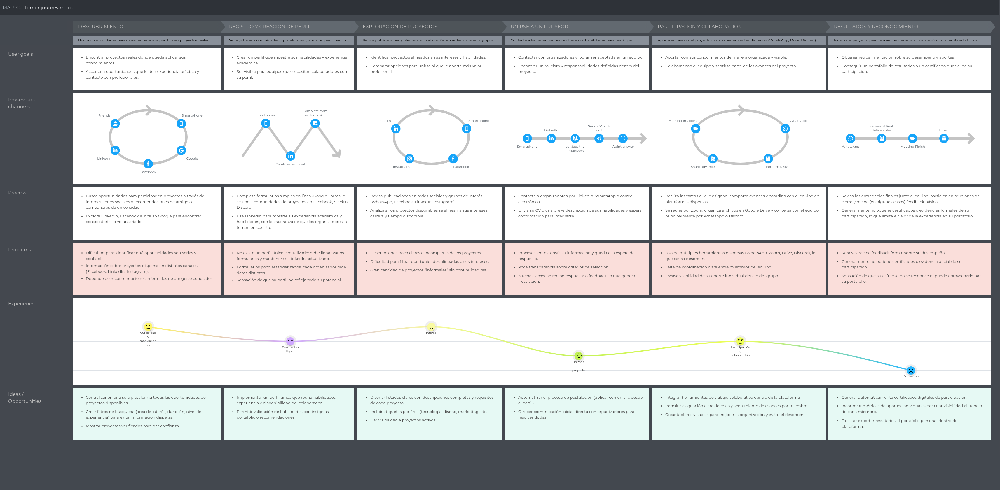

# Capítulo II: Requirements Elicitation & Analysis
## 2.1. Competidores
### 2.1.1. Análisis competitivo
### 2.1.2. Estrategias y tácticas frente a competidores
## 2.2. Entrevistas
### 2.2.1. Diseño de entrevistas
### 2.2.2. Registro de entrevistas
### 2.2.3. Análisis de entrevistas
## 2.3. Needfinding
Para crear un producto que cumpla con las necesidades específicas de un cliente, LaunchPad se dedicará a identificar los User persona, User Task Matrix, User Journey Maps y Empathy Mapping.

### 2.3.1. User Personas

Después de analizar las entrevistas de nuestro segmento objetivo, nuestra tarea es definir el perfil del usuario ideal con el que estamos tratando. Hemos elaborado los perfiles de usuario teniendo en cuenta las personalidades y cualidades identificadas en cada entrevista. A continuación, se presentan las user personas resultantes de la investigación:

**Usuario Emprededor**

Para el segmento de emprendedores se elaboró el User Persona representativo de jóvenes desarrolladores y emprendedores tecnológicos en etapa temprana interesados en lanzar sus proyectos de forma colaborativa. Para su construcción se consideraron los hallazgos obtenidos en el análisis de entrevistas realizadas a este segmento, incluyendo factores como su perfil técnico, las formas de financiamiento que utilizan, las dificultades para conformar equipos y el uso de herramientas digitales como WhatsApp, GitHub y Kickstarter.

Se tomó en cuenta que estos usuarios buscan principalmente encontrar cofundadores o socios con habilidades complementarias a las suyas, acceder a mecanismos de financiamiento accesibles desde el Perú y reducir los meses de búsqueda que implica el networking presencial tradicional. Asimismo, se identificó su alta frustración con plataformas extranjeras que no están pensadas para emprendedores en etapa cero sin comunidad previa, y su necesidad de una solución local que combine formación de equipos con financiamiento colaborativo transparente.

**Usuario Colaborador**

Para el segmento de colaboradores se elaboró el User Persona representativo de estudiantes universitarios y jóvenes profesionales interesados en participar en proyectos colaborativos. Para su construcción se consideraron los hallazgos obtenidos en el análisis de entrevistas realizadas a este segmento, incluyendo factores como su edad, formación en áreas tecnológicas, participación en proyectos académicos y uso de herramientas digitales como GitHub, WhatsApp y Google Docs.

Se tomó en cuenta que estos usuarios buscan principalmente adquirir experiencia práctica real, fortalecer su portafolio profesional y generar contactos (networking) que les permitan mejorar sus oportunidades laborales. Asimismo, se identificó su interés en participar en proyectos con impacto real, especialmente aquellos relacionados con tecnología aplicada como desarrollo de software o IoT.

### 2.3.2. User Task Matrix

La seccion User Task Matrix permite identificar y comparar las tareas más relevantes que realizan los usuarios representados en nuestras User Personas. En esta matriz se organiza cada tarea según su frecuencia (qué tan seguido la realizan) y su importancia (qué tan crítica resulta para alcanzar sus objetivos).

**Usuario Emprededor**

 

| USER TASK | Frecuencia | Importancia |
|---|---|---|
| Publicar o registrar un proyecto | Alta | Crítica |
| Buscar colaboradores por habilidades | Alta | Crítica |
| Revisar perfiles y portafolios de candidatos | Alta | Crítica |
| Seleccionar y confirmar integrantes del equipo | Media | Crítica |
| Definir roles y responsabilidades en el proyecto | Media | Alta |
| Lanzar una campaña de financiamiento | Media | Crítica |
| Establecer hitos y metas del proyecto | Media | Alta |
| Coordinar tareas y asignar responsabilidades | Alta | Importante |
| Publicar reportes o evidencias de avance | Media | Alta |
| Hacer seguimiento del progreso del proyecto | Alta | Importante |
| Recibir aportes o financiamiento por hitos | Media | Crítica |
| Recibir notificaciones de postulantes o avances | Alta | Alta |

 

Se observa que las tareas más críticas para el emprendedor se concentran en la publicación del proyecto, la búsqueda y selección de colaboradores con habilidades complementarias, y el acceso a financiamiento liberado por hitos. La comunicación interna y el seguimiento del progreso son actividades de alta frecuencia, lo que evidencia la necesidad de herramientas integradas dentro de la plataforma que eliminen la dependencia de canales informales como WhatsApp. Asimismo, la definición de roles desde el inicio y la publicación de reportes de avance resultan fundamentales para garantizar la transparencia y seriedad del proyecto ante colaboradores e inversores.

**Usuario Colaborador**

| USER TASK                              | Frecuencia | Importancia |
|----------------------------------------|------------|-------------|
| Explorar proyectos disponibles         | Alta       | Crítica     |
| Filtrar proyectos por intereses        | Alta       | Alta        |
| Revisar detalles del proyecto          | Alta       | Crítica     |
| Postular / Unirse a un proyecto        | Alta       | Crítica     |
| Definir su rol y responsabilidades     | Media      | Alta        |
| Coordinar tareas con el equipo         | Alta       | Importante  |
| Comunicarse con el equipo              | Alta       | Crítica     |
| Aportar en el proyecto (trabajo)       | Alta       | Crítica     |
| Subir evidencias de trabajo            | Media      | Alta        |
| Hacer seguimiento del progreso         | Media      | Importante  |
| Recibir notificaciones                 | Alta       | Alta        |
| Trabajar Proyectos con Iot             | Alta       | Alta        |                           

Se observa que las actividades más críticas se concentran en la exploración de proyectos, la participación activa en equipos y la contribución al desarrollo de soluciones, especialmente en proyectos relacionados con tecnologías como IoT. Asimismo, tareas como la comunicación, la coordinación y el seguimiento del progreso resultan fundamentales para garantizar una experiencia colaborativa organizada.

### 2.3.3. User Journey Mapping

**Segmento 2 - Colaborador**

El User Journey Mapping del colaborador representa el recorrido actual que experimentan los estudiantes y jóvenes profesionales al buscar, unirse y participar en proyectos colaborativos. Este mapa describe el proceso completo, desde la exploración de oportunidades hasta la obtención de resultados como experiencia y reconocimiento.

En la situación actual (As-Is), el colaborador enfrenta un proceso fragmentado y poco estructurado: busca proyectos en múltiples plataformas (redes sociales, recomendaciones, grupos), evalúa información incompleta, y se integra a equipos donde la comunicación y organización dependen de herramientas dispersas como WhatsApp, Google Drive o Discord. Esto genera desorden, falta de claridad en roles y dificultades para hacer seguimiento al progreso.

El journey permite identificar los principales puntos críticos de su experiencia, incluyendo la falta de filtros adecuados para encontrar proyectos relevantes, la escasa transparencia en los procesos de selección, la desorganización en la colaboración y la ausencia de mecanismos formales de reconocimiento del trabajo realizado.

Este análisis evidencia oportunidades de mejora en cada etapa del proceso (Descubrimiento, Registro, Exploración, Postulación, Colaboración y Resultados), y sirve como base para diseñar una solución como Foundly, que centralice la gestión de proyectos, mejore la comunicación, proporcione visibilidad del progreso y permita validar las contribuciones del colaborador mediante sistemas de reputación.

### 2.3.4. Empathy Mapping

Para la elaboración de los Empathy Maps, el equipo partió del conocimiento y observaciones recolectadas durante el análisis de los User Persona. Se colocó al centro de cada mapa al usuario correspondiente y se respondieron las preguntas claves sobre su entorno, emociones, comportamientos y necesidades.

**Segmento 2 - Colaborador**

 

El Empathy Mapping del usuario colaborador (Jesli Bautista) permite comprender de manera integral su experiencia, considerando lo que piensa, siente, ve, escucha, dice y hace dentro del contexto de participación en proyectos colaborativos.

A partir del análisis, se identifica que Jesli es una estudiante motivada por adquirir experiencia práctica y construir un portafolio profesional, pero enfrenta múltiples dificultades debido a la desorganización de los equipos, la falta de claridad en roles y la dispersión de herramientas de comunicación. Estas condiciones generan frustración, incertidumbre y una percepción de poco reconocimiento hacia su trabajo.

El mapa evidencia que, aunque existe una alta motivación por participar en proyectos reales, los principales dolores del usuario están relacionados con la falta de estructura, comunicación ineficiente y dificultad para encontrar oportunidades adecuadas. Asimismo, resalta la necesidad de una plataforma centralizada que facilite la colaboración, el seguimiento de tareas y el reconocimiento de aportes individuales.

Este análisis permite identificar oportunidades clave de mejora enfocadas en la organización de proyectos, la claridad en la asignación de roles, la integración de herramientas y la generación de mecanismos de reputación, los cuales son fundamentales para diseñar una solución centrada en el usuario colaborador.

## 2.4. Big Picture Event Storming
## 2.5. Ubiquitous Language
