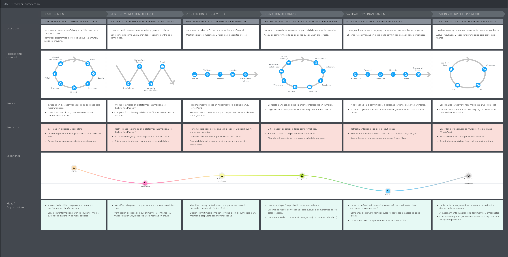
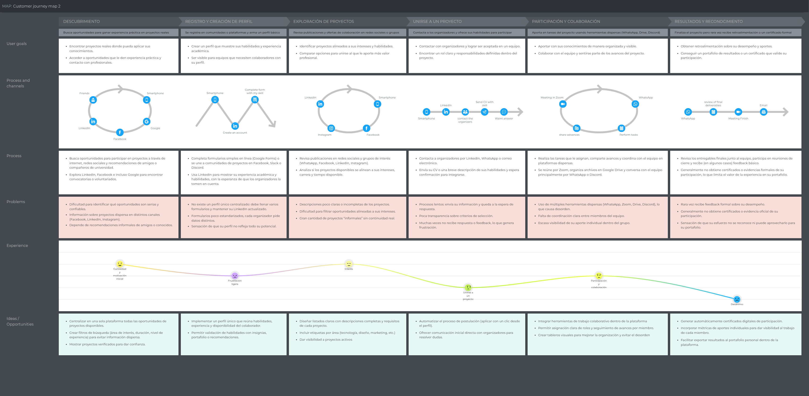
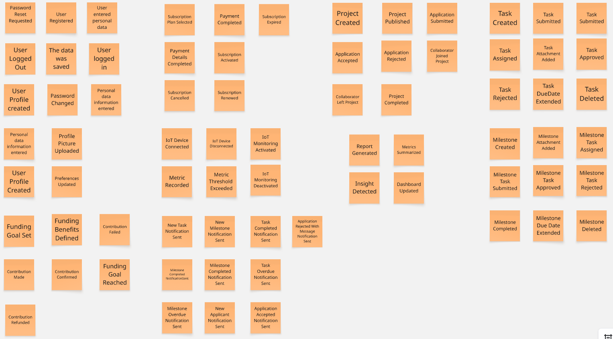
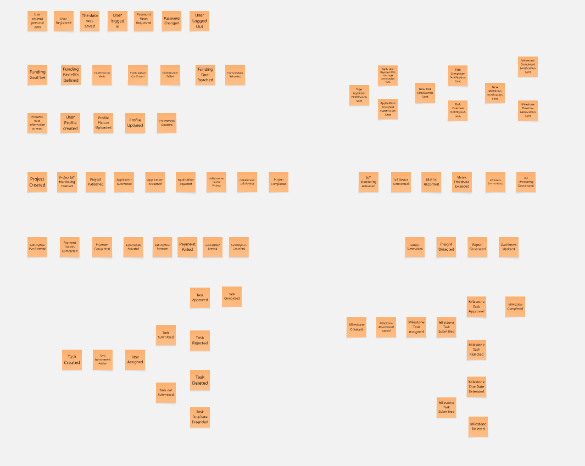

# Capítulo II: Requirements Elicitation & Analysis
## 2.1. Competidores
### 2.1.1. Análisis competitivo

En esta sección se realizará el análisis competitivo de los competidores identificados en la sección inicial con el objetivo de tener una idea más clara sobre nuestro producto frente a los competidores y aprender para mejorar nuestro producto.

<table>
<thead>
  <tr>
    <th colspan="6">Competitive Analysis Landscape</th>
  </tr>
</thead>
<tbody>
  <tr>
    <td colspan="2">¿Por qué llevar a cabo este análisis?</td>
    <td colspan="4">Este análisis se lleva a cabo para poder investigar, analizar y comparar el comportamiento de los competidores directos o indirectos en el mercado</td>
  </tr>
  <tr>
    <td colspan="2">
Nombre
</td>
    <td>
Foundly
</td>
    <td>
Kickstarter
</td>
    <td>
Indiegogo
</td>
    <td>
GoFundMe
</td>
  </tr>
  <tr>
    <td colspan="2">
Logo
</td>
    <td>

</td>
    <td>

</td>
    <td>

</td>
    <td>

</td>
  </tr>
  <tr>
    <td rowspan="2">Perfil</td>
    <td>Overview</td>
    <td>Foundly es una plataforma de crowdfunding colaborativo diseñada para que las personas puedan crear grupos o unirse a comunidades que buscan resolver problemas, desarrollar startups o impulsar proyectos sociales. Se enfoca en Perú y Latinoamérica, donde el crowdfunding aún tiene gran potencial de crecimiento. Además, incorpora un <strong>módulo de monitoreo de impacto ambiental con integración IoT</strong> que permite a proyectos con enfoque sostenible visualizar métricas en tiempo real como calidad del aire y humedad, diferenciándose de cualquier plataforma de crowdfunding existente en la región.</td>
    <td>Kickstarter es una de las plataformas de crowdfunding más grandes del mundo, fundada en 2009 en Estados Unidos. Su objetivo principal es ayudar a creadores, emprendedores y startups creativas a lanzar proyectos innovadores en áreas como tecnología, arte, música, cine, diseño y videojuegos, brindándoles visibilidad y exposición ante una comunidad interesada en nuevas ideas.</td>
    <td>Indiegogo es una plataforma global fundada en 2008 en Estados Unidos, considerada una de las principales alternativas a Kickstarter. Se caracteriza por su flexibilidad en la publicación de proyectos y por abarcar iniciativas relacionadas con tecnología, diseño, salud, causas sociales y estilo de vida, permitiendo a los emprendedores dar mayor visibilidad a sus ideas.</td>
    <td>GoFundMe, fundada en 2010 en Estados Unidos, es una de las plataformas de crowdfunding personal y solidario más grandes del mundo. A diferencia de Kickstarter o Indiegogo, se centra en causas personales, sociales y humanitarias (salud, emergencias, educación, funerales, desastres naturales, etc.) en lugar de proyectos creativos o startups.</td>
  </tr>
  <tr>
    <td>Ventaja Competitiva ¿Qué valor ofrece a los clientes?</td>
    <td>
     <ul>
    <li><strong>Colaboración integral:</strong> Conecta personas con ideas, habilidades y tiempo, permitiendo formar equipos de trabajo multidisciplinarios alrededor de cada proyecto.</li>
    <li><strong>Módulo IoT de impacto ambiental:</strong> Única plataforma colaborativa que integra monitoreo de métricas ambientales en tiempo real (calidad del aire, humedad y participación), permitiendo que proyectos sostenibles evidencien su impacto de manera concreta.</li>
    <li><strong>Accesibilidad y bajo costo de entrada:</strong> Con el modelo freemium (5 proyectos gratuitos antes de pagar), cualquier persona puede iniciar proyectos sin necesidad de grandes recursos económicos.</li>
    <li><strong>Plataforma enfocada en comunidad:</strong> Permite que los usuarios formen grupos organizados con roles, tareas y objetivos compartidos, fortaleciendo el trabajo colaborativo.</li>
    <li><strong>Impulso al emprendimiento local y social:</strong> Brinda un espacio para que emprendedores y comunidades desarrollen ideas y proyectos de impacto dentro de un entorno colaborativo.</li>
    <li><strong>Transparencia y confianza:</strong> Permite visualizar el progreso del proyecto, verificar perfiles de los integrantes y dar seguimiento a las responsabilidades asignadas, generando mayor confianza dentro del equipo.</li>
</ul>
    </td>
    <td>
      <ul>
    <li><strong>Exposición global:</strong> conecta a emprendedores con una comunidad internacional interesada en proyectos innovadores y creativos.</li>
    <li><strong>Validación de ideas:</strong> permite que los creadores evalúen si su proyecto genera interés real antes de desarrollarlo completamente.</li>
    <li><strong>Presentación estructurada de proyectos:</strong> brinda herramientas para mostrar objetivos, avances y características de cada proyecto de forma clara y atractiva.</li>
    <li><strong>Confianza y marca reconocida:</strong> Kickstarter es una plataforma reconocida mundialmente, lo que brinda mayor visibilidad y credibilidad a los proyectos publicados.</li>
    <li><strong>Comunidad activa de innovación:</strong> reúne usuarios interesados en nuevas ideas, generando oportunidades de interacción y networking entre creadores.</li>
</ul>
    </td>
    <td>
<ul>
    <li><strong>Flexibilidad en la publicación de proyectos:</strong> permite que los creadores presenten proyectos en diferentes etapas de desarrollo según sus objetivos.</li>
    <li><strong>Apoyo post-lanzamiento:</strong> con el programa InDemand, los creadores pueden seguir dando visibilidad a sus proyectos incluso después de finalizar su etapa inicial.</li>
    <li><strong>Enfoque en innovación temprana:</strong> permite a los emprendedores mostrar productos en etapas iniciales, atrayendo usuarios interesados en nuevas ideas.</li>
    <li><strong>Servicios adicionales:</strong> ofrece apoyo en marketing, logística y distribución mediante alianzas con empresas.</li>
    <li><strong>Mayor diversidad de categorías:</strong> incluye proyectos de tecnología, diseño, salud, estilo de vida y proyectos sociales.</li>
</ul>
    </td>
    <td>
      <ul>
        <li>Acceso inmediato a financiamiento solidario: cualquier persona puede abrir una campaña en minutos, sin requisitos complejos ni planes de negocio.</li>
        <li>Enfoque en causas personales y sociales: ideal para emergencias médicas, desastres naturales, educación o apoyo comunitario.</li>
        <li>Alto nivel de confianza: es la plataforma de donaciones más reconocida a nivel mundial.</li>
        <li>Facilidad de uso y viralización: integración con redes sociales que permite compartir campañas y llegar a más donantes.</li>
        <li>Modelo sin tarifas de plataforma en muchos países: aumenta el monto que llega directamente al beneficiario.</li>
      </ul>
    </td>
  </tr>
  <tr>
    <td rowspan="2">Perfiles de Marketing</td>
    <td>Mercado Objetivo</td>
    <td>
      <ul>
    <li><strong>Emprendedores y startups en etapa temprana:</strong> estudiantes y jóvenes profesionales (18–25 años) en Perú con proyección a LATAM, que buscan validar ideas, formar equipos multidisciplinarios y desarrollar proyectos innovadores.</li>
    <li><strong>Profesionales y estudiantes con habilidades:</strong> desarrolladores, diseñadores, especialistas en marketing y gestores de proyectos que desean aportar su talento y conocimientos en proyectos reales mientras adquieren experiencia colaborativa.</li>
    <li><strong>Proyectos con enfoque sostenible:</strong> equipos o emprendedores que buscan medir y evidenciar el impacto ambiental de sus iniciativas mediante tecnología IoT.</li>
</ul>
    </td>
    <td>
  <ul>
    <li><strong>Creadores de proyectos creativos e innovadores:</strong> artistas, músicos, cineastas, diseñadores, escritores y emprendedores tecnológicos que buscan dar visibilidad a ideas como gadgets, aplicaciones o productos innovadores.</li>
    <li><strong>Comunidad interesada en innovación:</strong> personas que buscan descubrir nuevas ideas y participar en comunidades relacionadas con tecnología, videojuegos, cine, diseño y entretenimiento.</li>
  </ul>
</td>
    <td>
  <ul>
    <li><strong>Creadores y emprendedores:</strong> emprendedores de sectores como salud, bienestar, estilo de vida y sostenibilidad, así como empresas en etapa temprana que buscan dar visibilidad internacional a sus proyectos.</li>
    <li><strong>Usuarios interesados en innovación:</strong> personas interesadas en conocer productos innovadores antes de su lanzamiento al mercado y proyectos con impacto social o ambiental.</li>
  </ul>
</td>
    <td>
      <ul>
        <li>Creadores de campañas (beneficiarios): personas que atraviesan emergencias médicas, familias afectadas por desastres naturales, comunidades y ONGs que buscan financiamiento para causas sociales.</li>
        <li>Donantes (aportantes solidarios): individuos que desean ayudar a personas en situaciones difíciles.</li>
      </ul>
    </td>
  </tr>
  <tr>
    <td>Estrategias de marketing</td>
    <td>
      <ul>
        <li><strong>Marketing Digital y Redes Sociales:</strong> campañas en Facebook, Instagram, TikTok y LinkedIn para captar tanto emprendedores como colaboradores.</li>
        <li><strong>Marketing de Contenidos:</strong> blog con artículos sobre emprendimiento, innovación y economía colaborativa.</li>
        <li><strong>Alianzas estratégicas:</strong> convenios con universidades para que estudiantes publiquen proyectos académicos o de investigación.</li>
      </ul>
    </td>
    <td>
      <ul>
        <li>Viralización digital con fuerte presencia en redes sociales (Facebook, Instagram, Twitter y Youtube).</li>
        <li>Alianzas con medios y sectores creativos para visibilidad.</li>
      </ul>
    </td>
    <td>
  <ul>
    <li>Flexibilidad en la publicación de proyectos en distintas etapas de desarrollo.</li>
    <li>Programa InDemand para mantener la visibilidad de los proyectos después de su lanzamiento inicial.</li>
    <li>Alianzas con aceleradoras, empresas de logística y distribución para apoyar la llegada de productos al mercado.</li>
    <li>Promoción de casos de éxito tecnológicos como estrategia para fortalecer la credibilidad de la plataforma.</li>
  </ul>
</td>
    <td>
      <ul>
        <li>Marketing emocional con imágenes, videos y testimonios de impacto.</li>
        <li>Colaboración con influencers y celebridades en campañas solidarias.</li>
        <li>Viralización masiva en redes sociales (Facebook, Twitter, Instagram).</li>
      </ul>
    </td>
  </tr>
  <tr>
    <td rowspan="3">Perfil de Producto</td>
    <td>Productos &amp; Servicios</td>
    <td>
		<ul>
    <li><strong>Productos:</strong> proyectos colaborativos creados por los usuarios.</li>
    <li><strong>Servicios:</strong> ecosistema digital seguro, accesible y colaborativo, con herramientas para la creación de equipos, gestión de tareas, seguimiento de avances y un módulo IoT de monitoreo de impacto ambiental en tiempo real.</li>
</ul>
    </td>
    <td>
      <ul>
    <li><strong>Productos:</strong> proyectos creativos e innovadores publicados por los creadores en distintas categorías como tecnología, arte, diseño y entretenimiento.</li>
    <li><strong>Servicios:</strong> plataforma digital que brinda herramientas de gestión, visibilidad y comunidad para impulsar proyectos innovadores.</li>
</ul>
    </td>
    <td>
      <ul>
        <li><strong>Productos:</strong> innovaciones tecnológicas y de estilo de vida.</li>
        <li><strong>Servicios:</strong> acompañamiento post-campaña (InDemand), marketing y apoyo logístico.</li>
      </ul>
    </td>
    <td>
      <ul>
        <li><strong>Productos:</strong> campañas solidarias personales y comunitarias.</li>
        <li><strong>Servicios:</strong> plataforma segura, simple y viralizable para conectar donantes con causas sociales y personales en todo el mundo.</li>
      </ul>
    </td>
  </tr>
  <tr>
    <td>Precios y Costos</td>
    <td>
      <ul>
        <li><strong>Plan Freemium:</strong> hasta 5 proyectos creados/postulados.</li>
        <li><strong>Plan Premium (Mensual/Anual):</strong> proyectos ilimitados + mayor visibilidad en el buscador.</li>
      </ul>
    </td>
    <td>
      <ul>
        <li>Comisión fija del 5% + tarifas de procesamiento de pagos entre el 3% y el 5% dependiendo de la región, moneda e impuestos aplicables.</li>
        <li>Costos logísticos y de producción corren a cargo del creador.</li>
      </ul>
    </td>
    <td>
      <ul>
        <li>5% de comisión de plataforma sobre lo recaudado. 3% + tarifa fija por procesamiento de pagos.</li>
        <li>Tarifas de transferencia bancaria adicionales según ubicación.</li>
        <li>En campañas InDemand no originadas en Indiegogo, se aplican comisiones más altas (8% + 15%).</li>
      </ul>
    </td>
    <td>
      <ul>
        <li>No cobra tarifa de creación ni de gestión de campañas.</li>
        <li>Sistema de aportaciones voluntarias de los donantes a la plataforma ("tips"), nunca obligatorias.</li>
        <li>Comisión por cada donación: 2.9% + $0.30 USD.</li>
        <li>Para ONGs ofrece GoFundMe Pro, con precios personalizados y herramientas avanzadas.</li>
      </ul>
    </td>
  </tr>
  <tr>
    <td>Canales de Distribución (Web y/o Móvil)</td>
    <td>Web</td>
    <td>Web y App</td>
    <td>Web</td>
    <td>Web y App (solo para algunos países)</td>
  </tr>
  <tr>
    <td rowspan="4">Análisis SWOT</td>
    <td>Fortalezas</td>
    <td>
      <ul>
        <li>Los usuarios no solo aportan dinero, sino también habilidades, tiempo e ideas, formando equipos de trabajo.</li>
        <li>Con el modelo freemium (5 proyectos gratis), cualquier persona puede iniciar sin necesidad de gran capital.</li>
        <li>Llena un vacío de mercado en regiones donde las grandes plataformas globales no tienen presencia oficial.</li>
        <li>Único diferenciador tecnológico en el mercado regional: módulo IoT que permite a proyectos ambientales medir y evidenciar su impacto en tiempo real, algo que ningún competidor directo ofrece.</li>
      </ul>
    </td>
    <td>
      <ul>
        <li>Marca reconocida globalmente como referente en crowdfunding creativo.</li>
        <li>Seguridad en transacciones y prestigio cultural en sectores creativos.</li>
        <li>Modelo transparente que genera confianza en los aportantes.</li>
        <li>Gran base de usuarios y comunidad activa de backers en más de 200 países.</li>
      </ul>
    </td>
    <td>
      <ul>
        <li>Programa InDemand que permite seguir recaudando tras la campaña inicial.</li>
        <li>Amplia variedad de categorías (tecnología, salud, estilo de vida, causas sociales).</li>
        <li>Servicios adicionales de marketing, logística y distribución.</li>
        <li>Alianzas con aceleradoras y empresas para llevar productos al mercado.</li>
      </ul>
    </td>
    <td>
      <ul>
        <li>Plataforma líder en crowdfunding solidario y personal.</li>
        <li>Marca reconocida globalmente, asociada a confianza y solidaridad.</li>
        <li>Facilidad de uso: crear una campaña es rápido y sencillo.</li>
        <li>Red global de donantes y fuerte integración con redes sociales.</li>
      </ul>
    </td>
  </tr>
  <tr>
    <td>Debilidades</td>
    <td>
      <ul>
        <li>Al ser un proyecto nuevo, necesitará mucho esfuerzo en marketing para generar confianza frente a un público poco familiarizado con el crowdfunding.</li>
        <li>Aunque se implementen medidas de verificación, siempre existe el riesgo de que un proyecto no cumpla lo prometido, afectando la reputación.</li>
        <li>En Perú y gran parte de Latinoamérica, el concepto de crowdfunding aún no es masivo, por lo que será necesario invertir en educación y sensibilización del público.</li>
        <li>Sin integración con pasarelas de pago internacionales consolidadas, a diferencia de sus competidores globales.</li>
      </ul>
    </td>
    <td>
      <ul>
        <li>Limitado a países autorizados (no disponible en Perú ni gran parte de Sudamérica).</li>
        <li>Riesgo de incumplimiento de proyectos, afectando la confianza en la plataforma.</li>
        <li>Proceso de revisión de proyectos que retrasa los lanzamientos (1–3 días hábiles).</li>
        <li>Comisiones relativamente altas (5% + tarifas de pago).</li>
      </ul>
    </td>
    <td>
      <ul>
        <li>Menor visibilidad y tráfico que Kickstarter.</li>
        <li>Reputación afectada por proyectos fallidos o retrasados en entregas.</li>
        <li>Altas tarifas de procesamiento y transferencia en algunos países.</li>
        <li>Competencia con Amazon Launchpad y otros marketplaces post-campaña.</li>
      </ul>
    </td>
    <td>
      <ul>
        <li>Dependencia de la viralización en redes sociales para el éxito de las campañas.</li>
        <li>Riesgo de fraudes y campañas engañosas, que afectan su credibilidad.</li>
        <li>Limitada diversificación de servicios (no ofrece logística ni acompañamiento post-campaña).</li>
        <li>Menor atractivo para donantes en mercados emergentes con baja capacidad adquisitiva.</li>
      </ul>
    </td>
  </tr>
  <tr>
    <td>Oportunidades</td>
    <td>
      <ul>
        <li>Plataformas globales como Kickstarter no tienen presencia oficial en Perú ni en la mayoría de Sudamérica, lo que deja espacio para una propuesta local.</li>
        <li>Posibilidad de crear convenios institucionales para impulsar proyectos estudiantiles, comunitarios o de innovación social.</li>
        <li>Una vez consolidado en Perú, puede expandirse a otros países de Latinoamérica con características de mercado similares.</li>
        <li>Creciente interés global en sostenibilidad abre un nicho para proyectos que usen el módulo IoT como herramienta de transparencia ambiental.</li>
      </ul>
    </td>
    <td>
      <ul>
        <li>Expandirse a mercados emergentes como Latinoamérica, donde no tiene presencia.</li>
        <li>Alianzas con universidades, incubadoras y gobiernos para fomentar el emprendimiento.</li>
        <li>Colaboraciones con grandes marcas que validen productos vía crowdfunding.</li>
      </ul>
    </td>
    <td>
      <ul>
        <li>Expansión en mercados emergentes (Latinoamérica, África, Asia).</li>
        <li>Posicionarse como líder en innovación tecnológica temprana.</li>
        <li>Colaborar con grandes marcas tecnológicas como canal de validación de productos.</li>
      </ul>
    </td>
    <td>
      <ul>
        <li>Expansión en mercados emergentes (Latinoamérica, África, Asia).</li>
        <li>Alianzas con ONGs, fundaciones y gobiernos para campañas humanitarias.</li>
        <li>Mayor presencia en emergencias globales (desastres naturales, pandemias, guerras).</li>
        <li>Crecer con donaciones recurrentes y servicios premium para ONGs (GoFundMe Pro).</li>
      </ul>
    </td>
  </tr>
  <tr>
    <td>Amenazas</td>
    <td>
      <ul>
        <li>Plataformas como Kickstarter, Indiegogo y GoFundMe pueden expandirse a Latinoamérica y captar rápidamente usuarios gracias a su marca.</li>
        <li>Nuevas startups regionales podrían lanzar plataformas similares adaptadas cultural y económicamente al público local.</li>
        <li>Casos de fraude o incumplimiento de proyectos pueden afectar la reputación del crowdfunding en general, desincentivando a potenciales usuarios.</li>
        <li>La ausencia de leyes claras sobre crowdfunding en Perú y Latinoamérica puede derivar en futuras regulaciones estrictas que limiten su operación.</li>
      </ul>
    </td>
    <td>
      <ul>
        <li>Riesgo de fraudes y proyectos incumplidos que dañan la reputación.</li>
        <li>Cambios regulatorios que pueden limitar el crowdfunding en distintos países.</li>
        <li>La limitación geográfica actual deja espacio a plataformas locales en Sudamérica.</li>
      </ul>
    </td>
    <td>
      <ul>
        <li>Riesgo de pérdida de confianza por incumplimientos de proyectos.</li>
        <li>Regulaciones en crowdfunding que pueden restringir operaciones internacionales.</li>
        <li>Saturación del mercado de crowdfunding con nuevos competidores regionales.</li>
      </ul>
    </td>
    <td>
      <ul>
        <li>Desconfianza pública derivada de casos de fraude o uso indebido de fondos.</li>
        <li>Crisis económicas globales que reducen la disposición de donar.</li>
      </ul>
    </td>
  </tr>
</tbody>
</table>

### 2.1.2. Estrategias y tácticas frente a competidores

En esta sección se presentan las estrategias y tácticas preliminares que aplicará Foundly para afrontar las fortalezas de la competencia, aprovechar sus debilidades, capitalizar las oportunidades del entorno y mitigar las amenazas identificadas en el análisis FODA.

---

##### Estrategias para aprovechar las debilidades de los competidores

Los principales competidores identificados Kickstarter, Indiegogo y GoFundMe presentan debilidades concretas que Foundly puede explotar de manera directa:

- **Kickstarter e Indiegogo no tienen presencia oficial en Perú ni en gran parte de Sudamérica.** Foundly aprovechará este vacío posicionándose como la primera plataforma de crowdfunding colaborativo adaptada al contexto latinoamericano, con soporte en español, métodos de pago locales y una propuesta de valor orientada a las necesidades del emprendedor peruano.

- **Kickstarter aplica un proceso de revisión de proyectos de 1 a 3 días hábiles**, lo que retrasa el lanzamiento de campañas. Foundly ofrecerá publicación inmediata de proyectos, reduciendo la fricción de entrada y permitiendo que los emprendedores actúen con mayor agilidad.

- **Kickstarter e Indiegogo cobran comisiones de entre 5% y 8% más tarifas de procesamiento**, lo que encarece el crowdfunding para proyectos pequeños. El modelo freemium de Foundly con hasta 5 proyectos gratuitos representa una alternativa de menor costo de entrada, especialmente atractiva para emprendedores en etapas tempranas.

- **Ningún competidor integra formación de equipos multidisciplinarios ni monitoreo de impacto ambiental con IoT.** Foundly se diferencia al ofrecer ambas funcionalidades en un solo ecosistema, cubriendo necesidades que las plataformas globales ignoran por completo.

- **Táctica:** Campañas de comunicación directa destacando las ventajas comparativas frente a la competencia, usando mensajes como "sin listas de espera", "sin comisiones al inicio" y "el equipo también importa", dirigidas a emprendedores que ya conocen Kickstarter o Indiegogo pero no pueden acceder a ellas desde Perú.

---

##### Estrategias para afrontar las fortalezas de los competidores

Kickstarter, Indiegogo y GoFundMe cuentan con marcas globalmente reconocidas, grandes bases de usuarios y modelos consolidados de confianza. Para afrontar estas fortalezas:

- **Estrategia de Diferenciación:** Foundly no compite en el mismo terreno que los competidores globales, sino que construye una categoría propia: el crowdfunding colaborativo con formación de equipos. A diferencia de las plataformas tradicionales donde el usuario solo aporta dinero, Foundly permite aportar habilidades, tiempo e ideas, generando valor más allá del financiamiento económico.

- **Módulo IoT como diferenciador tecnológico único:** Foundly incorpora un módulo de monitoreo de impacto ambiental con integración IoT que permite a proyectos sostenibles visualizar métricas en tiempo real como calidad del aire, humedad y participación ciudadana. Ningún competidor directo ofrece esta funcionalidad, lo que refuerza la propuesta de valor frente a un mercado con creciente interés en la sostenibilidad.

- **Táctica:** Implementar un sistema de verificación de usuarios y proyectos, junto con seguimiento de hitos y un sistema de reputación, para construir confianza progresiva entre los usuarios y compensar la menor trayectoria de marca frente a competidores consolidados.

---

##### Estrategias para capitalizar las oportunidades del entorno

- **Estrategia de Entrada al Mercado Local (Perú – LATAM):** Foundly iniciará operaciones en Perú como mercado piloto, aprovechando la ausencia de competidores globales con presencia oficial en la región. Una vez validado el modelo, se escalará progresivamente hacia otros países de Latinoamérica con características de mercado similares.

- **Táctica:** En la fase inicial se ejecutará una campaña de educación y sensibilización sobre qué es la colaboración estructurada en proyectos y cómo funciona, mediante talleres, webinars gratuitos y alianzas con universidades, incubadoras de negocios, coworkings y ONGs locales. El objetivo es posicionar a Foundly como pionera en colaboración de proyectos adaptada al contexto latinoamericano antes de que los competidores globales decidan expandirse.

- **Estrategia de Marketing Digital Segmentado:** Se implementarán campañas diferenciadas en Facebook, Instagram, TikTok y LinkedIn, segmentadas por edad, intereses y afinidad con el emprendimiento o causas sociales, orientadas a los dos segmentos objetivos: emprendedores y colaboradores.

- **Táctica:** Contenido visual y narrativo videos cortos, reels, historias y testimonios de usuarios reales que muestren casos de proyectos financiados exitosamente, tutoriales sobre cómo crear una campaña y el funcionamiento del módulo IoT para proyectos ambientales.

---

##### Estrategias para mitigar las amenazas del entorno

- **Amenaza: expansión de competidores globales a Latinoamérica.** Si Kickstarter o Indiegogo deciden ingresar a la región, Foundly ya contará con una base de usuarios establecida, alianzas institucionales y una propuesta de valor que va más allá del crowdfunding tradicional. La velocidad de entrada al mercado es la principal defensa.

  - **Táctica:** Acelerar la captación de usuarios y la generación de alianzas con universidades e incubadoras durante los primeros 12 meses, creando barreras de fidelización antes de que los competidores globales puedan reaccionar.

- **Amenaza: casos de fraude que afectan la reputación del crowdfunding en general.** El ecosistema de crowdfunding a nivel global enfrenta desconfianza derivada de proyectos incumplidos o campañas fraudulentas, lo que puede afectar a Foundly aunque no sea directamente responsable.

  - **Táctica:** Implementar desde el lanzamiento un sistema de verificación de identidad, validación de proyectos y seguimiento obligatorio de hitos con evidencias. El módulo de reputación permitirá que los usuarios evalúen proyectos y equipos, generando transparencia y disuadiendo comportamientos fraudulentos.

- **Amenaza: ausencia de regulación clara sobre crowdfunding en Perú.** La falta de un marco legal específico puede derivar en regulaciones futuras que limiten la operación de plataformas de financiamiento colectivo.

- **Táctica:** Desde el inicio, Foundly operará bajo estándares de transparencia y cumplimiento normativo general, documentando todos los procesos y manteniendo comunicación con asociaciones de emprendimiento y organismos regulatorios, de modo que la plataforma esté preparada para adaptarse a cualquier cambio regulatorio sin interrupciones.

## 2.2. Entrevistas

En esta sección se abordará la investigación en base a la información que se obtendrá de los segmentos entrevistados con el objetivo de conocer mejor a nuestros segmentos objetivos y aprender de ellos y sus procesos.

### 2.2.1. Diseño de entrevistas
 
---
 
#### Segmento 1: Emprendedores y Startups en Etapa Temprana
 
**Introducción:**
Buenos días/tardes, mi nombre es [nombre del entrevistador] y el día de hoy estaremos realizando una breve entrevista para conocer más sobre cómo los emprendedores gestionan actualmente sus proyectos, las dificultades que enfrentan al momento de formar equipos de trabajo y cómo organizan sus actividades.
El objetivo de esta entrevista es recopilar información que nos ayude a comprender mejor sus necesidades y problemas dentro de proyectos colaborativos. 

1. ¿Cómo organizas actualmente tus proyectos o ideas?
2. ¿Qué dificultades tienes para encontrar personas con habilidades complementarias para tu proyecto?
3. ¿Has trabajado anteriormente con equipos multidisciplinarios? ¿Cómo fue tu experiencia?
4. ¿Qué herramientas utilizas actualmente para comunicarte y organizar tareas dentro de tu equipo?
5. ¿Qué problemas encuentras al gestionar responsabilidades dentro de tu equipo?
6. ¿Qué información necesitas conocer antes de aceptar a alguien en tu proyecto?
7. ¿Qué características consideras importantes en una plataforma para encontrar colaboradores?
8. ¿Qué aspectos te generarían mayor confianza al trabajar con personas desconocidas?
9. ¿Cómo haces seguimiento al progreso de tu proyecto actualmente?
10 Si pudieras mejorar la forma en la que trabajas actualmente con tu equipo, ¿qué cambiarías o agregarías?
 
**Cierre:**
Muchas gracias por compartir su experiencia y perspectivas. Su opinión es muy valiosa para diseñar una herramienta que apoye de verdad a los emprendedores en etapa temprana.
 
---
 
#### Segmento 2: Estudiantes Universitarios y Profesionales Jóvenes
 
**Introducción:**
Buenos días/tardes, mi nombre es [nombre del entrevistador] y el día de hoy estaremos realizando una breve entrevista para conocer más sobre la experiencia de estudiantes universitarios y jóvenes profesionales al participar en proyectos colaborativos.
Buscamos entender qué los motiva a unirse a nuevos proyectos, qué dificultades enfrentan al trabajar en equipo y cómo organizan actualmente sus actividades dentro de estos proyectos.

1. ¿Has participado en proyectos fuera de la universidad o trabajo formal?
2. ¿Qué te motiva a unirte a nuevos proyectos?
3. ¿Qué dificultades tienes para encontrar proyectos interesantes?
4. ¿Qué herramientas utilizas actualmente para colaborar con otros equipos?
5. ¿Qué problemas has tenido trabajando en equipo?
6. ¿Qué información te gustaría conocer antes de unirte a un proyecto?
7. ¿Qué te haría confiar en un proyecto publicado por otra persona?
8. ¿Cómo te gustaría que reconozcan tu trabajo dentro de un equipo?
9. ¿Qué beneficios buscas al participar en proyectos colaborativos?
10. Si pudieras mejorar la forma en la que colaboras actualmente en proyectos, ¿qué cambiarías?

**Cierre:**
Muchas gracias por su tiempo y comentarios. Su aporte nos ayudará a crear una plataforma más útil y atractiva para jóvenes con interés en colaborar y aprender de proyectos reales.

### 2.2.2. Registro de entrevistas
En esta sección presentamos los registros de las entrevistas que hicimos para cada segmento objetivo de nuestra aplicación.

**Segmento 1:**

<table>
<colgroup>
</colgroup>
<thead>
  <tr>
    <th colspan="2">Entrevista #1 </th>
  </tr>
</thead>
<tbody>
  <tr>
    <td>Nombre</td>
    <td>/td>
  </tr>
  <tr>
    <td>Apellidos</td>
    <td></td>
  </tr>
  <tr>
    <td>Edad</td>
    <td></td>
  </tr>
  <tr>
    <td>Distrito</td>
    <td></td>
  </tr>
  <tr>
    <td>Aplicaciones Usadas</td>
    <td>Microsoft Stream</td>
  </tr>
  <tr>
    <td>Motivacion</td>
    <td></td></td>
  </tr>
  <tr>
    <td>Frustracion</td>
    <td></td></td>
  </tr>
  <tr>
    <td>Evidencia</td>
    <td>
</td>
  </tr>
  <tr>
    <td>Link</td>
    <td>
<a target="_blank"  href="" title="Title">Microsoft Stream
</td>
  </tr>
  <tr>
    <td>Duracion </td>
    <td>0:00 min - 10:18 min</td>
  </tr>
  <tr>
    <td>Resumen</td>
    <td>
</td>
  </tr>
</tbody>
</table>

<table>
<colgroup>
</colgroup>
<thead>
  <tr>
    <th colspan="2">Entrevista #2 </th>
  </tr>
</thead>
<tbody>
  <tr>
    <td>Nombre</td>
    <td></td>
  </tr>
  <tr>
    <td>Apellidos</td>
    <td></td>
  </tr>
  <tr>
    <td>Edad</td>
    <td></td>
  </tr>
  <tr>
    <td>Distrito</td>
    <td></td>
  </tr>
  <tr>
    <td></td>
    <td></td>
  </tr>
  <tr>
    <td>Motivacion</td>
    <td></td>
  </tr>
  <tr>
    <td>Frustracion</td>
    <td></td>
  </tr>
  <tr>
    <td>Evidencia</td>
    <td>
</td>
  </tr>
  <tr>
    <td>Link</td>
    <td>
		
<a target="_blank"  href="" title="Title">Microsoft Stream

	</td>
  </tr>
  <tr>
    <td>Duracion </td>
    <td></td>
  </tr>
  <tr>
    <td>Resumen</td>
    <td>
		
</td>
  </tr>
</tbody>
</table>

<table>
<colgroup>
</colgroup>
<thead>
  <tr>
    <th colspan="3">br></th>
  </tr>
</thead>
<tbody>
  <tr>
    <td>Nombre</td>
    <td>Gonzalo</td>
  </tr>
  <tr>
    <td>Apellidos</td>
    <td></td>
  </tr>
  <tr>
    <td>Edad</td>
    <td></td>
  </tr>
  <tr>
    <td>Distrito</td>
    <td></td>
  </tr>
  <tr>
    <td>Aplicaciones Usadas</td>
    <td></td>
  </tr>
  <tr>
    <td>Motivacion</td>
    <td></td>
  </tr>
  <tr>
    <td>Frustracion</td>
    <td></td>
  </tr>
  <tr>
    <td>Evidencia</td>
    <td>
</td>
  </tr>
  <tr>
    <td>Link</td>
    <td>
		
<a target="_blank"  href="" title="Title">

	</td>
  </tr>
  <tr>
    <td>Duracion </td>
    <td></td>
  </tr>
  <tr>
    <td>Resumen</td>
    <td>
</td>
  </tr>
</tbody>
</table>

**Segmento 2:**

<table>
<colgroup>
</colgroup>
<thead>
  <tr>
    <th colspan="2">Entrevista #1 </th>
  </tr>
</thead>
<tbody>
  <tr>
    <td>Nombre</td>
    <td></td>
  </tr>
  <tr>
    <td>Apellidos</td>
    <td></td>
  </tr>
  <tr>
    <td>Edad</td>
    <td></td>
  </tr>
  <tr>
    <td>Distrito</td>
    <td></td>
  </tr>
  <tr>
    <td>Aplicaciones Usadas</td>
    <td></td>
  </tr>
  <tr>
    <td>Motivacion</td>
    <td></td>
  </tr>
  <tr>
    <td>Frustracion</td>
    <td></td>
  </tr>
  <tr>
    <td>Evidencia</td>
    <td>

</td>
  </tr>
  <tr>
    <td>Link</td>
    <td>
		
<a target="_blank"  href="" title="Title">

	</td>
  </tr>
  <tr>
    <td>Duracion </td>
    <td>
	</td>
  </tr>
  <tr>
    <td>Resumen</td>
    <td>
</td>
  </tr>
</tbody>
</table>

<table>
<colgroup>
</colgroup>
<thead>
  <tr>
    <th colspan="2">Entrevista #2 </th>
  </tr>
</thead>
<tbody>
  <tr>
    <td>Nombre</td>
    <td></td>
  </tr>
  <tr>
    <td>Apellidos</td>
    <td></td>
  </tr>
  <tr>
    <td>Edad</td>
    <td></td>
  </tr>
  <tr>
    <td>Distrito</td>
    <td></td>
  </tr>
  <tr>
    <td>Aplicaciones Usadas</td>
    <td></td>
  </tr>
  <tr>
    <td>Motivacion</td>
    <td></td>
  </tr>
  <tr>
    <td>Frustracion</td>
    <td></td>
  </tr>
  <tr>
    <td>Evidencia</td>
    <td>

</td>
  </tr>
  <tr>
    <td>Link</td>
    <td>
		
<a target="_blank"  href="" title="Title">

	</td>
  </tr>
  <tr>
    <td>Duracion </td>
    <td>
	</td>
  </tr>
  <tr>
    <td>Resumen</td>
    <td>
</td>
  </tr>
</tbody>
</table>

<table>
<colgroup>
</colgroup>
<thead>
  <tr>
    <th colspan="2">Entrevista #3 </th>
  </tr>
</thead>
<tbody>
  <tr>
    <td>Nombre</td>
    <td></td>
  </tr>
  <tr>
    <td>Apellidos</td>
    <td></td>
  </tr>
  <tr>
    <td>Edad</td>
    <td></td>
  </tr>
  <tr>
    <td>Distrito</td>
    <td></td>
  </tr>
  <tr>
    <td>Aplicaciones Usadas</td>
    <td></td>
  </tr>
  <tr>
    <td>Motivacion</td>
    <td></td>
  </tr>
  <tr>
    <td>Frustracion</td>
    <td>.</td>
  </tr>
  <tr>
    <td>Evidencia</td>
    <td>

</td>
  </tr>
  <tr>
    <td>Link</td>
    <td>
		
<a target="_blank"  href="" title="Title">

	</td>
  </tr>
  <tr>
    <td>Duracion </td>
    <td>
	</td>
  </tr>
  <tr>
    <td>Resumen</td>
    <td>
</td>
  </tr>
</tbody>
</table>
			
### 2.2.3. Análisis de entrevistas

## 2.3. Needfinding

### 2.3.1. User Personas

Tras analizar las entrevistas realizadas a cada segmento objetivo, el equipo definió los perfiles de usuario ideal que representan a los actores principales del modelo de negocio de Foundly. Los User Personas fueron construidos considerando las personalidades, motivaciones, frustraciones y comportamientos identificados durante el proceso de investigación, con el objetivo de mantener al usuario como centro de las decisiones de diseño y desarrollo.

---

#### Segmento 1: Emprendedor

Para el segmento de emprendedores se elaboró el User Persona representativo de jóvenes desarrolladores y emprendedores tecnológicos en etapa temprana interesados en lanzar sus proyectos de forma colaborativa. Su construcción consideró los hallazgos obtenidos en el análisis de entrevistas realizadas a este segmento, incluyendo factores como:

- **Perfil técnico:** Usuarios con conocimientos en desarrollo de software o tecnología que desean llevar una idea de negocio a su primera versión funcional.
- **Financiamiento:** Dificultad para acceder a mecanismos de financiamiento accesibles y confiables desde el contexto peruano.
- **Formación de equipos:** Alta frustración por los meses que implica el networking presencial tradicional para encontrar cofundadores con habilidades complementarias.
- **Herramientas actuales:** Uso de herramientas informales como WhatsApp, GitHub y plataformas internacionales como Kickstarter, que no están adaptadas al contexto local ni a proyectos en etapa cero.

Este perfil evidencia la necesidad de una solución local que combine formación de equipos con financiamiento colaborativo transparente, eliminando las barreras de entrada que enfrentan los emprendedores sin comunidad previa.

---

#### Segmento 2: Colaborador

Para el segmento de colaboradores se elaboró el User Persona representativo de estudiantes universitarios y jóvenes profesionales interesados en participar en proyectos colaborativos. Su construcción consideró los hallazgos obtenidos en el análisis de entrevistas realizadas a este segmento, incluyendo factores como:

- **Perfil académico y profesional:** Usuarios en formación en áreas tecnológicas —desarrollo de software, diseño UX, marketing digital— con experiencia en proyectos académicos y trabajos grupales.
- **Motivaciones principales:** Adquirir experiencia práctica real, fortalecer su portafolio profesional y ampliar su red de contactos para mejorar sus oportunidades laborales futuras.
- **Interés en tecnología aplicada:** Preferencia por proyectos con impacto real, especialmente aquellos relacionados con desarrollo de software, IoT y emprendimiento tecnológico.
- **Herramientas actuales:** Uso de GitHub, WhatsApp y Google Docs como herramientas principales de colaboración, lo que genera dispersión y dificultad para hacer seguimiento estructurado del trabajo.

Este perfil evidencia la necesidad de una plataforma que centralice la búsqueda de proyectos, estructure la colaboración y proporcione mecanismos formales de reconocimiento que validen el aporte de cada colaborador.

### 2.3.2. User Task Matrix

La seccion User Task Matrix permite identificar y comparar las tareas más relevantes que realizan los usuarios representados en nuestras User Personas. En esta matriz se organiza cada tarea según su frecuencia (qué tan seguido la realizan) y su importancia (qué tan crítica resulta para alcanzar sus objetivos).

**Usuario Emprededor**

 

| USER TASK | Frecuencia | Importancia |
|---|---|---|
| Publicar o registrar un proyecto | Alta | Crítica |
| Buscar colaboradores por habilidades | Alta | Crítica |
| Revisar perfiles y portafolios de candidatos | Alta | Crítica |
| Seleccionar y confirmar integrantes del equipo | Media | Crítica |
| Definir roles y responsabilidades en el proyecto | Media | Alta |
| Lanzar una campaña de financiamiento | Media | Crítica |
| Establecer hitos y metas del proyecto | Media | Alta |
| Coordinar tareas y asignar responsabilidades | Alta | Importante |
| Publicar reportes o evidencias de avance | Media | Alta |
| Hacer seguimiento del progreso del proyecto | Alta | Importante |
| Recibir aportes o financiamiento por hitos | Media | Crítica |
| Recibir notificaciones de postulantes o avances | Alta | Alta |

 

Se observa que las tareas más críticas para el emprendedor se concentran en la publicación del proyecto, la búsqueda y selección de colaboradores con habilidades complementarias, y el acceso a financiamiento liberado por hitos. La comunicación interna y el seguimiento del progreso son actividades de alta frecuencia, lo que evidencia la necesidad de herramientas integradas dentro de la plataforma que eliminen la dependencia de canales informales como WhatsApp. Asimismo, la definición de roles desde el inicio y la publicación de reportes de avance resultan fundamentales para garantizar la transparencia y seriedad del proyecto ante colaboradores e inversores.

**Usuario Colaborador**

| USER TASK                              | Frecuencia | Importancia |
|----------------------------------------|------------|-------------|
| Explorar proyectos disponibles         | Alta       | Crítica     |
| Filtrar proyectos por intereses        | Alta       | Alta        |
| Revisar detalles del proyecto          | Alta       | Crítica     |
| Postular / Unirse a un proyecto        | Alta       | Crítica     |
| Definir su rol y responsabilidades     | Media      | Alta        |
| Coordinar tareas con el equipo         | Alta       | Importante  |
| Comunicarse con el equipo              | Alta       | Crítica     |
| Aportar en el proyecto (trabajo)       | Alta       | Crítica     |
| Subir evidencias de trabajo            | Media      | Alta        |
| Hacer seguimiento del progreso         | Media      | Importante  |
| Recibir notificaciones                 | Alta       | Alta        |
| Trabajar Proyectos con Iot             | Alta       | Alta        |                           

Se observa que las actividades más críticas se concentran en la exploración de proyectos, la participación activa en equipos y la contribución al desarrollo de soluciones, especialmente en proyectos relacionados con tecnologías como IoT. Asimismo, tareas como la comunicación, la coordinación y el seguimiento del progreso resultan fundamentales para garantizar una experiencia colaborativa organizada.

### 2.3.3. User Journey Mapping

El User Journey Mapping permite visualizar el recorrido completo que experimenta cada segmento objetivo al interactuar con el problema que Foundly busca resolver. Los mapas elaborados corresponden a la situación actual (*As-Is*), identificando las etapas, acciones, emociones y puntos críticos que enfrentan los usuarios antes de contar con la solución propuesta.

---

#### Segmento 1: Emprendedor

El mapa del emprendedor representa el recorrido que experimentan los jóvenes emprendedores tecnológicos al intentar dar forma a sus ideas de negocio, conformar un equipo multidisciplinario y acceder a financiamiento. El proceso abarca desde la búsqueda inicial de referencias y plataformas hasta la gestión y cierre del proyecto con resultados concretos.

En la situación actual (*As-Is*), el emprendedor enfrenta un proceso fragmentado y lleno de fricciones:

- Busca información en múltiples canales dispersos (redes sociales, conocidos, motores de búsqueda), sin encontrar una fuente confiable y centralizada.
- Intenta registrarse en plataformas internacionales que no están adaptadas al contexto peruano en términos de moneda, idioma ni regulación.
- Publica su proyecto con herramientas de baja visibilidad y escasa estructura profesional.
- Conforma su equipo contactando a personas de su entorno cercano, sin garantías de compromiso ni mecanismos formales de seguimiento.

Estos factores generan desorden, pérdida de tiempo y una sensación creciente de inseguridad conforme avanza el proceso. Los principales puntos críticos identificados son:

- Dificultad para encontrar plataformas confiables y accesibles desde Perú.
- Escasa visibilidad de sus proyectos frente a un alto volumen de contenido competidor.
- Ausencia de herramientas integradas para la gestión de equipos y comunicación interna.
- Desconfianza en los mecanismos de financiamiento informales, que lo limitan a su círculo más cercano.

Este análisis evidencia oportunidades de mejora en cada etapa del proceso —Descubrimiento, Registro, Publicación del Proyecto, Formación de Equipo, Validación y Financiamiento, y Gestión y Cierre— y sienta las bases para el diseño de Foundly como solución que centraliza la búsqueda de colaboradores por habilidades, simplifica el registro adaptado al contexto local, ofrece plantillas profesionales para presentar ideas, integra herramientas de coordinación dentro de la plataforma y garantiza transparencia en el financiamiento mediante reportes de avance y liberación de fondos por hitos cumplidos.

---

#### Segmento 2: Colaborador

El mapa del colaborador representa el recorrido que experimentan los estudiantes y jóvenes profesionales al buscar, unirse y participar en proyectos colaborativos. El proceso abarca desde la exploración de oportunidades hasta la obtención de resultados concretos como experiencia práctica y reconocimiento dentro de la comunidad.

En la situación actual (*As-Is*), el colaborador enfrenta un proceso poco estructurado y fragmentado:

- Busca proyectos en múltiples plataformas (redes sociales, recomendaciones de terceros, grupos de mensajería), sin filtros adecuados para encontrar oportunidades relevantes a su perfil.
- Evalúa información incompleta o desactualizada sobre los proyectos disponibles, lo que dificulta la toma de decisiones.
- Se integra a equipos donde la comunicación y organización dependen de herramientas dispersas como WhatsApp, Google Drive o Discord, generando desorden y falta de claridad en roles.
  
Los principales puntos críticos identificados son:

- Falta de filtros adecuados para encontrar proyectos alineados a sus habilidades e intereses.
- Escasa transparencia en los procesos de selección y aceptación por parte de los creadores.
- Desorganización en la colaboración interna y dificultad para hacer seguimiento al progreso del proyecto.
- Ausencia de mecanismos formales de reconocimiento del trabajo realizado.

Este análisis evidencia oportunidades de mejora en cada etapa del proceso —Descubrimiento, Registro, Exploración, Postulación, Colaboración y Resultados— y sienta las bases para el diseño de Foundly como solución que centraliza la gestión de proyectos, mejora la comunicación interna, proporciona visibilidad del progreso mediante hitos y tareas, y permite validar las contribuciones del colaborador a través de un sistema de reputación basado en evidencias.

### 2.3.4. Empathy Mapping

Para la elaboración de los Empathy Maps, el equipo partió del conocimiento y las observaciones recolectadas durante el análisis de los User Personas. Se colocó al centro de cada mapa al usuario correspondiente y se respondieron las preguntas clave sobre su entorno, emociones, comportamientos y necesidades, con el objetivo de comprender en profundidad su experiencia actual antes de diseñar la solución.

---

#### Segmento 1: Emprendedor

El Empathy Map del emprendedor (Juan Fernández) permite comprender de manera integral su experiencia al intentar lanzar una idea de negocio en etapa temprana sin los recursos ni el equipo adecuados, considerando lo que piensa, siente, ve, escucha, dice y hace en ese contexto.

A partir del análisis se identifican los siguientes hallazgos principales:

- **Motivaciones:** Juan está impulsado por el deseo de convertir su idea en un negocio escalable y de generar impacto real en su entorno. Valora la autonomía y la posibilidad de liderar su propio proyecto.
- **Principales dolores:** Enfrenta dificultades concretas para encontrar socios comprometidos, carece de plataformas de financiamiento adaptadas al contexto peruano y sufre la desorganización que genera coordinar equipos a través de herramientas informales como WhatsApp o correo electrónico.
- **Estado emocional:** Estas condiciones generan frustración, inseguridad y una sensación de estancamiento que frena el avance de sus proyectos y erosiona su confianza en el proceso emprendedor.

Este análisis permite identificar oportunidades clave de mejora enfocadas en la formación estructurada de equipos, la simplificación del registro y publicación de proyectos adaptada a la realidad local, y la integración de herramientas de comunicación y seguimiento dentro de una sola plataforma, elementos fundamentales para diseñar una solución verdaderamente centrada en el usuario emprendedor.

---

#### Segmento 2: Colaborador

El Empathy Map del colaborador (Jesli Bautista) permite comprender de manera integral su experiencia al participar en proyectos colaborativos, considerando lo que piensa, siente, ve, escucha, dice y hace dentro de ese contexto.

A partir del análisis se identifican los siguientes hallazgos principales:

- **Motivaciones:** Jesli está impulsada por el deseo de adquirir experiencia práctica, construir un portafolio profesional sólido y establecer conexiones con personas y proyectos de su área de interés.
- **Principales dolores:** Enfrenta desorganización dentro de los equipos en los que participa, falta de claridad en la asignación de roles y dispersión de herramientas de comunicación que dificultan el seguimiento del trabajo realizado.
- **Estado emocional:** Estas condiciones generan frustración, incertidumbre y una percepción de escaso reconocimiento hacia sus aportes, lo que reduce su motivación para continuar participando activamente.

El mapa evidencia que, si bien existe una alta motivación intrínseca por colaborar en proyectos reales, los principales dolores del usuario están relacionados con la falta de estructura, la comunicación ineficiente y la dificultad para encontrar oportunidades adecuadas a su perfil. Asimismo, resalta la necesidad de una plataforma centralizada que facilite la colaboración, el seguimiento de tareas y el reconocimiento formal de los aportes individuales.

Este análisis permite identificar oportunidades clave de mejora enfocadas en la organización de proyectos, la claridad en la asignación de roles, la integración de herramientas y la implementación de mecanismos de reputación, elementos fundamentales para diseñar una solución centrada en el usuario colaborador.

## 2.4. Big Picture Event Storming

**Step 1 – Free Exploration**

En esta primera etapa, el equipo realizó una sesión de lluvia de ideas para capturar todos los eventos relevantes dentro del dominio, sin preocuparse por el orden o la jerarquía. El objetivo principal fue representar los acontecimientos reales del negocio, de manera independiente a cualquier función técnica o relacionada con un sistema.

**Step 2 – Structured Organization**

Después de listar los eventos, el equipo los organizó en flujos de negocio lógicos que reflejan las principales etapas en la creacion, colaboracion, gestion de los proyectos. Esta estructura ayudó a identificar los procesos clave y las áreas de mejora que posteriormente podrían abordarse mediante soluciones digitales o de gestión.

## 2.5. Ubiquitous Language

En esta sección se establece un glosario de términos clave del dominio de negocio, construido bajo el enfoque de Domain-Driven Design (DDD) propuesto por Eric Evans. El propósito de este glosario es garantizar un lenguaje común y compartido entre todos los miembros del equipo, evitando ambigüedades y facilitando una comunicación clara y consistente durante el desarrollo del proyecto.

| Termino | Definición |
|--------|-----------|
| Project (Proyecto) | Iniciativa colaborativa creada dentro de la plataforma con el objetivo de generar impacto ambiental o social. Incluye descripción, objetivos, actividades y métricas de impacto, y puede requerir colaboradores. |
| Entrepreneur (Organizador) | Usuario que crea y gestiona un proyecto dentro de la plataforma, coordinando actividades, atrayendo participantes y generando impacto medible. |
| Collaborator (Colaborador) | Usuario que se une a un proyecto existente aportando habilidades, conocimientos o tiempo para participar activamente en el desarrollo y cumplimiento de los objetivos del proyecto. |
| Team (Equipo) | Grupo de usuarios (organizadores y colaboradores) que trabajan en un proyecto de manera estructurada, con roles definidos, responsabilidades y objetivos compartidos. |
| Reputation (Reputación) | Indicador del nivel de participación y confiabilidad de un usuario dentro de la plataforma, basado en su actividad, cumplimiento de tareas y desempeño dentro de los proyectos. |
| Metrics (Métricas) | Indicadores que muestran el progreso de un proyecto y el impacto generado, incluyendo participación, cumplimiento de tareas y datos ambientales. |
| Subscription (Subscripción) | Modelo de acceso a la plataforma mediante un pago recurrente que otorga beneficios adicionales y funcionalidades avanzadas. |
| Milestone (Hito) | Punto de control dentro de un proyecto que representa un objetivo grupal. Agrupa tareas individuales y permite medir el avance del proyecto. |
| Task (Tarea) | Actividad individual asignada a un usuario dentro de un hito, con estado, responsable y seguimiento de progreso. |
| Sensor Data (Datos de sensores) | Información capturada desde dispositivos IoT (simulados), como temperatura, humedad y calidad del aire, asociada a un proyecto o actividad. |
| Environmental Metric (Métrica ambiental) | Indicador que representa condiciones del entorno físico, como calidad del aire o humedad del suelo, utilizado para evaluar el impacto. |
| Impact Data (Datos de impacto) | Datos procesados a partir de la participación de usuarios y métricas ambientales, que permiten evidenciar el impacto de un proyecto. |
| Real-time Monitoring (Monitoreo en tiempo real) | Capacidad del sistema para visualizar datos ambientales de manera continua, permitiendo observar cambios en el entorno durante la ejecución de proyectos. |
