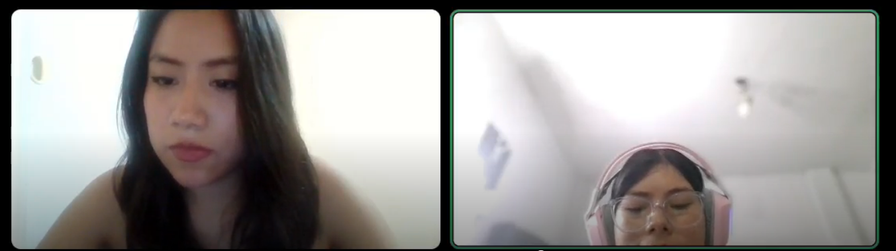
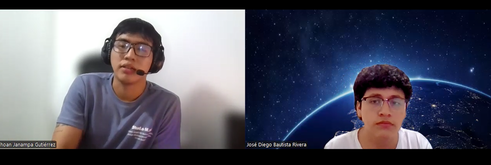
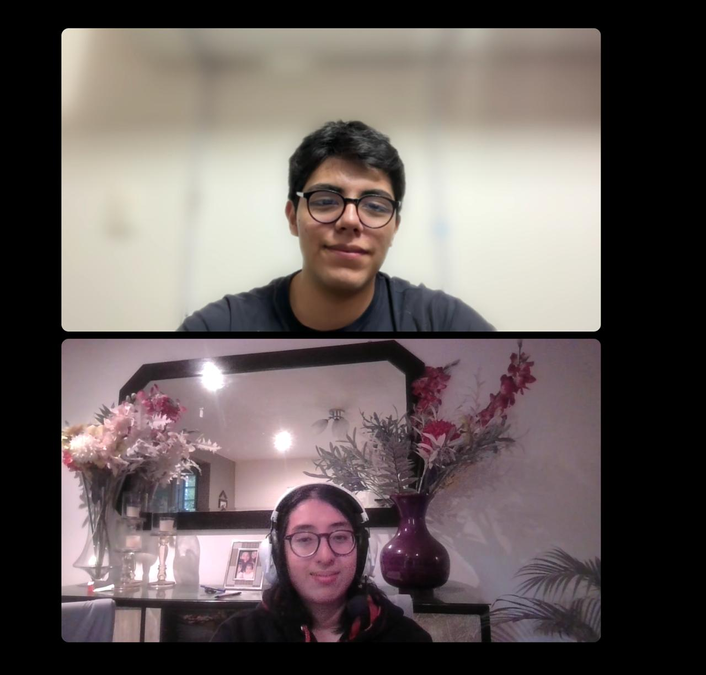
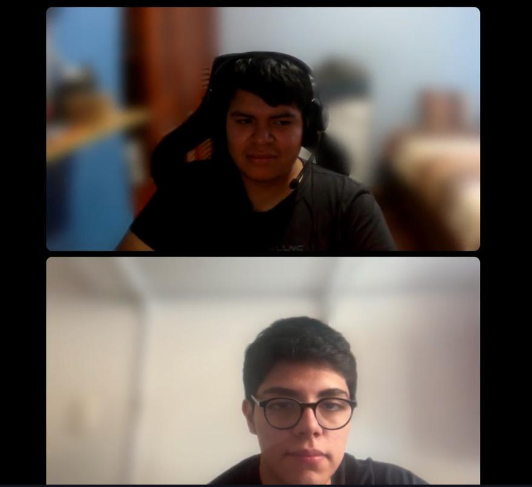
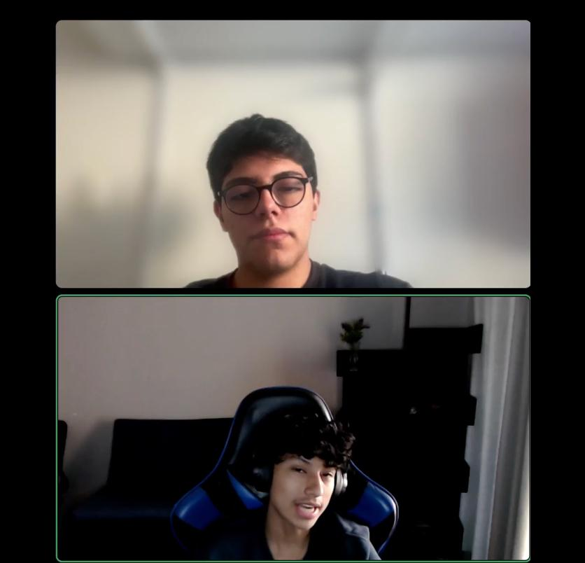

# Capítulo II: Requirements Elicitation & Analysis
## 2.1. Competidores
### 2.1.1. Análisis competitivo

En esta sección se realizará el análisis competitivo de los competidores identificados en la sección inicial con el objetivo de tener una idea más clara sobre nuestro producto frente a los competidores y aprender para mejorar nuestro producto.

<table>
<thead>
  <tr>
    <th colspan="6">Competitive Analysis Landscape</th>
  </tr>
</thead>
<tbody>
  <tr>
    <td colspan="2">¿Por qué llevar a cabo este análisis?</td>
    <td colspan="4">Este análisis se lleva a cabo para poder investigar, analizar y comparar el comportamiento de los competidores directos o indirectos en el mercado</td>
  </tr>
  <tr>
    <td colspan="2">
Nombre
</td>
    <td>
Foundly
</td>
    <td>
Kickstarter
</td>
    <td>
Indiegogo
</td>
    <td>
GoFundMe
</td>
  </tr>
  <tr>
    <td colspan="2">
Logo
</td>
    <td>

</td>
    <td>

</td>
    <td>

</td>
    <td>

</td>
  </tr>
  <tr>
    <td rowspan="2">Perfil</td>
    <td>Overview</td>
    <td>Foundly es una plataforma de crowdfunding colaborativo diseñada para que las personas puedan crear grupos o unirse a comunidades que buscan resolver problemas, desarrollar startups o impulsar proyectos sociales. Se enfoca en Perú y Latinoamérica, donde el crowdfunding aún tiene gran potencial de crecimiento. Además, incorpora un <strong>módulo de monitoreo de impacto ambiental con integración IoT</strong> que permite a proyectos con enfoque sostenible visualizar métricas en tiempo real como calidad del aire y humedad, diferenciándose de cualquier plataforma de crowdfunding existente en la región.</td>
    <td>Kickstarter es una de las plataformas de crowdfunding más grandes del mundo, fundada en 2009 en Estados Unidos. Su objetivo principal es ayudar a creadores, emprendedores y startups creativas a lanzar proyectos innovadores en áreas como tecnología, arte, música, cine, diseño y videojuegos, brindándoles visibilidad y exposición ante una comunidad interesada en nuevas ideas.</td>
    <td>Indiegogo es una plataforma global fundada en 2008 en Estados Unidos, considerada una de las principales alternativas a Kickstarter. Se caracteriza por su flexibilidad en la publicación de proyectos y por abarcar iniciativas relacionadas con tecnología, diseño, salud, causas sociales y estilo de vida, permitiendo a los emprendedores dar mayor visibilidad a sus ideas.</td>
    <td>GoFundMe, fundada en 2010 en Estados Unidos, es una de las plataformas de crowdfunding personal y solidario más grandes del mundo. A diferencia de Kickstarter o Indiegogo, se centra en causas personales, sociales y humanitarias (salud, emergencias, educación, funerales, desastres naturales, etc.) en lugar de proyectos creativos o startups.</td>
  </tr>
  <tr>
    <td>Ventaja Competitiva ¿Qué valor ofrece a los clientes?</td>
    <td>
     <ul>
    <li><strong>Colaboración integral:</strong> Conecta personas con ideas, habilidades y tiempo, permitiendo formar equipos de trabajo multidisciplinarios alrededor de cada proyecto.</li>
    <li><strong>Módulo IoT de impacto ambiental:</strong> Única plataforma colaborativa que integra monitoreo de métricas ambientales en tiempo real (calidad del aire, humedad y participación), permitiendo que proyectos sostenibles evidencien su impacto de manera concreta.</li>
    <li><strong>Accesibilidad y bajo costo de entrada:</strong> Con el modelo freemium (5 proyectos gratuitos antes de pagar), cualquier persona puede iniciar proyectos sin necesidad de grandes recursos económicos.</li>
    <li><strong>Plataforma enfocada en comunidad:</strong> Permite que los usuarios formen grupos organizados con roles, tareas y objetivos compartidos, fortaleciendo el trabajo colaborativo.</li>
    <li><strong>Impulso al emprendimiento local y social:</strong> Brinda un espacio para que emprendedores y comunidades desarrollen ideas y proyectos de impacto dentro de un entorno colaborativo.</li>
    <li><strong>Transparencia y confianza:</strong> Permite visualizar el progreso del proyecto, verificar perfiles de los integrantes y dar seguimiento a las responsabilidades asignadas, generando mayor confianza dentro del equipo.</li>
</ul>
    </td>
    <td>
      <ul>
    <li><strong>Exposición global:</strong> conecta a emprendedores con una comunidad internacional interesada en proyectos innovadores y creativos.</li>
    <li><strong>Validación de ideas:</strong> permite que los creadores evalúen si su proyecto genera interés real antes de desarrollarlo completamente.</li>
    <li><strong>Presentación estructurada de proyectos:</strong> brinda herramientas para mostrar objetivos, avances y características de cada proyecto de forma clara y atractiva.</li>
    <li><strong>Confianza y marca reconocida:</strong> Kickstarter es una plataforma reconocida mundialmente, lo que brinda mayor visibilidad y credibilidad a los proyectos publicados.</li>
    <li><strong>Comunidad activa de innovación:</strong> reúne usuarios interesados en nuevas ideas, generando oportunidades de interacción y networking entre creadores.</li>
</ul>
    </td>
    <td>
<ul>
    <li><strong>Flexibilidad en la publicación de proyectos:</strong> permite que los creadores presenten proyectos en diferentes etapas de desarrollo según sus objetivos.</li>
    <li><strong>Apoyo post-lanzamiento:</strong> con el programa InDemand, los creadores pueden seguir dando visibilidad a sus proyectos incluso después de finalizar su etapa inicial.</li>
    <li><strong>Enfoque en innovación temprana:</strong> permite a los emprendedores mostrar productos en etapas iniciales, atrayendo usuarios interesados en nuevas ideas.</li>
    <li><strong>Servicios adicionales:</strong> ofrece apoyo en marketing, logística y distribución mediante alianzas con empresas.</li>
    <li><strong>Mayor diversidad de categorías:</strong> incluye proyectos de tecnología, diseño, salud, estilo de vida y proyectos sociales.</li>
</ul>
    </td>
    <td>
      <ul>
        <li>Acceso inmediato a financiamiento solidario: cualquier persona puede abrir una campaña en minutos, sin requisitos complejos ni planes de negocio.</li>
        <li>Enfoque en causas personales y sociales: ideal para emergencias médicas, desastres naturales, educación o apoyo comunitario.</li>
        <li>Alto nivel de confianza: es la plataforma de donaciones más reconocida a nivel mundial.</li>
        <li>Facilidad de uso y viralización: integración con redes sociales que permite compartir campañas y llegar a más donantes.</li>
        <li>Modelo sin tarifas de plataforma en muchos países: aumenta el monto que llega directamente al beneficiario.</li>
      </ul>
    </td>
  </tr>
  <tr>
    <td rowspan="2">Perfiles de Marketing</td>
    <td>Mercado Objetivo</td>
    <td>
      <ul>
    <li><strong>Emprendedores y startups en etapa temprana:</strong> estudiantes y jóvenes profesionales (18–25 años) en Perú con proyección a LATAM, que buscan validar ideas, formar equipos multidisciplinarios y desarrollar proyectos innovadores.</li>
    <li><strong>Profesionales y estudiantes con habilidades:</strong> desarrolladores, diseñadores, especialistas en marketing y gestores de proyectos que desean aportar su talento y conocimientos en proyectos reales mientras adquieren experiencia colaborativa.</li>
    <li><strong>Proyectos con enfoque sostenible:</strong> equipos o emprendedores que buscan medir y evidenciar el impacto ambiental de sus iniciativas mediante tecnología IoT.</li>
</ul>
    </td>
    <td>
  <ul>
    <li><strong>Creadores de proyectos creativos e innovadores:</strong> artistas, músicos, cineastas, diseñadores, escritores y emprendedores tecnológicos que buscan dar visibilidad a ideas como gadgets, aplicaciones o productos innovadores.</li>
    <li><strong>Comunidad interesada en innovación:</strong> personas que buscan descubrir nuevas ideas y participar en comunidades relacionadas con tecnología, videojuegos, cine, diseño y entretenimiento.</li>
  </ul>
</td>
    <td>
  <ul>
    <li><strong>Creadores y emprendedores:</strong> emprendedores de sectores como salud, bienestar, estilo de vida y sostenibilidad, así como empresas en etapa temprana que buscan dar visibilidad internacional a sus proyectos.</li>
    <li><strong>Usuarios interesados en innovación:</strong> personas interesadas en conocer productos innovadores antes de su lanzamiento al mercado y proyectos con impacto social o ambiental.</li>
  </ul>
</td>
    <td>
      <ul>
        <li>Creadores de campañas (beneficiarios): personas que atraviesan emergencias médicas, familias afectadas por desastres naturales, comunidades y ONGs que buscan financiamiento para causas sociales.</li>
        <li>Donantes (aportantes solidarios): individuos que desean ayudar a personas en situaciones difíciles.</li>
      </ul>
    </td>
  </tr>
  <tr>
    <td>Estrategias de marketing</td>
    <td>
      <ul>
        <li><strong>Marketing Digital y Redes Sociales:</strong> campañas en Facebook, Instagram, TikTok y LinkedIn para captar tanto emprendedores como colaboradores.</li>
        <li><strong>Marketing de Contenidos:</strong> blog con artículos sobre emprendimiento, innovación y economía colaborativa.</li>
        <li><strong>Alianzas estratégicas:</strong> convenios con universidades para que estudiantes publiquen proyectos académicos o de investigación.</li>
      </ul>
    </td>
    <td>
      <ul>
        <li>Viralización digital con fuerte presencia en redes sociales (Facebook, Instagram, Twitter y Youtube).</li>
        <li>Alianzas con medios y sectores creativos para visibilidad.</li>
      </ul>
    </td>
    <td>
  <ul>
    <li>Flexibilidad en la publicación de proyectos en distintas etapas de desarrollo.</li>
    <li>Programa InDemand para mantener la visibilidad de los proyectos después de su lanzamiento inicial.</li>
    <li>Alianzas con aceleradoras, empresas de logística y distribución para apoyar la llegada de productos al mercado.</li>
    <li>Promoción de casos de éxito tecnológicos como estrategia para fortalecer la credibilidad de la plataforma.</li>
  </ul>
</td>
    <td>
      <ul>
        <li>Marketing emocional con imágenes, videos y testimonios de impacto.</li>
        <li>Colaboración con influencers y celebridades en campañas solidarias.</li>
        <li>Viralización masiva en redes sociales (Facebook, Twitter, Instagram).</li>
      </ul>
    </td>
  </tr>
  <tr>
    <td rowspan="3">Perfil de Producto</td>
    <td>Productos &amp; Servicios</td>
    <td>
		<ul>
    <li><strong>Productos:</strong> proyectos colaborativos creados por los usuarios.</li>
    <li><strong>Servicios:</strong> ecosistema digital seguro, accesible y colaborativo, con herramientas para la creación de equipos, gestión de tareas, seguimiento de avances y un módulo IoT de monitoreo de impacto ambiental en tiempo real.</li>
</ul>
    </td>
    <td>
      <ul>
    <li><strong>Productos:</strong> proyectos creativos e innovadores publicados por los creadores en distintas categorías como tecnología, arte, diseño y entretenimiento.</li>
    <li><strong>Servicios:</strong> plataforma digital que brinda herramientas de gestión, visibilidad y comunidad para impulsar proyectos innovadores.</li>
</ul>
    </td>
    <td>
      <ul>
        <li><strong>Productos:</strong> innovaciones tecnológicas y de estilo de vida.</li>
        <li><strong>Servicios:</strong> acompañamiento post-campaña (InDemand), marketing y apoyo logístico.</li>
      </ul>
    </td>
    <td>
      <ul>
        <li><strong>Productos:</strong> campañas solidarias personales y comunitarias.</li>
        <li><strong>Servicios:</strong> plataforma segura, simple y viralizable para conectar donantes con causas sociales y personales en todo el mundo.</li>
      </ul>
    </td>
  </tr>
  <tr>
    <td>Precios y Costos</td>
    <td>
      <ul>
        <li><strong>Plan Freemium:</strong> hasta 5 proyectos creados/postulados.</li>
        <li><strong>Plan Premium (Mensual/Anual):</strong> proyectos ilimitados + mayor visibilidad en el buscador.</li>
      </ul>
    </td>
    <td>
      <ul>
        <li>Comisión fija del 5% + tarifas de procesamiento de pagos entre el 3% y el 5% dependiendo de la región, moneda e impuestos aplicables.</li>
        <li>Costos logísticos y de producción corren a cargo del creador.</li>
      </ul>
    </td>
    <td>
      <ul>
        <li>5% de comisión de plataforma sobre lo recaudado. 3% + tarifa fija por procesamiento de pagos.</li>
        <li>Tarifas de transferencia bancaria adicionales según ubicación.</li>
        <li>En campañas InDemand no originadas en Indiegogo, se aplican comisiones más altas (8% + 15%).</li>
      </ul>
    </td>
    <td>
      <ul>
        <li>No cobra tarifa de creación ni de gestión de campañas.</li>
        <li>Sistema de aportaciones voluntarias de los donantes a la plataforma ("tips"), nunca obligatorias.</li>
        <li>Comisión por cada donación: 2.9% + $0.30 USD.</li>
        <li>Para ONGs ofrece GoFundMe Pro, con precios personalizados y herramientas avanzadas.</li>
      </ul>
    </td>
  </tr>
  <tr>
    <td>Canales de Distribución (Web y/o Móvil)</td>
    <td>Web</td>
    <td>Web y App</td>
    <td>Web</td>
    <td>Web y App (solo para algunos países)</td>
  </tr>
  <tr>
    <td rowspan="4">Análisis SWOT</td>
    <td>Fortalezas</td>
    <td>
      <ul>
        <li>Los usuarios no solo aportan dinero, sino también habilidades, tiempo e ideas, formando equipos de trabajo.</li>
        <li>Con el modelo freemium (5 proyectos gratis), cualquier persona puede iniciar sin necesidad de gran capital.</li>
        <li>Llena un vacío de mercado en regiones donde las grandes plataformas globales no tienen presencia oficial.</li>
        <li>Único diferenciador tecnológico en el mercado regional: módulo IoT que permite a proyectos ambientales medir y evidenciar su impacto en tiempo real, algo que ningún competidor directo ofrece.</li>
      </ul>
    </td>
    <td>
      <ul>
        <li>Marca reconocida globalmente como referente en crowdfunding creativo.</li>
        <li>Seguridad en transacciones y prestigio cultural en sectores creativos.</li>
        <li>Modelo transparente que genera confianza en los aportantes.</li>
        <li>Gran base de usuarios y comunidad activa de backers en más de 200 países.</li>
      </ul>
    </td>
    <td>
      <ul>
        <li>Programa InDemand que permite seguir recaudando tras la campaña inicial.</li>
        <li>Amplia variedad de categorías (tecnología, salud, estilo de vida, causas sociales).</li>
        <li>Servicios adicionales de marketing, logística y distribución.</li>
        <li>Alianzas con aceleradoras y empresas para llevar productos al mercado.</li>
      </ul>
    </td>
    <td>
      <ul>
        <li>Plataforma líder en crowdfunding solidario y personal.</li>
        <li>Marca reconocida globalmente, asociada a confianza y solidaridad.</li>
        <li>Facilidad de uso: crear una campaña es rápido y sencillo.</li>
        <li>Red global de donantes y fuerte integración con redes sociales.</li>
      </ul>
    </td>
  </tr>
  <tr>
    <td>Debilidades</td>
    <td>
      <ul>
        <li>Al ser un proyecto nuevo, necesitará mucho esfuerzo en marketing para generar confianza frente a un público poco familiarizado con el crowdfunding.</li>
        <li>Aunque se implementen medidas de verificación, siempre existe el riesgo de que un proyecto no cumpla lo prometido, afectando la reputación.</li>
        <li>En Perú y gran parte de Latinoamérica, el concepto de crowdfunding aún no es masivo, por lo que será necesario invertir en educación y sensibilización del público.</li>
        <li>Sin integración con pasarelas de pago internacionales consolidadas, a diferencia de sus competidores globales.</li>
      </ul>
    </td>
    <td>
      <ul>
        <li>Limitado a países autorizados (no disponible en Perú ni gran parte de Sudamérica).</li>
        <li>Riesgo de incumplimiento de proyectos, afectando la confianza en la plataforma.</li>
        <li>Proceso de revisión de proyectos que retrasa los lanzamientos (1–3 días hábiles).</li>
        <li>Comisiones relativamente altas (5% + tarifas de pago).</li>
      </ul>
    </td>
    <td>
      <ul>
        <li>Menor visibilidad y tráfico que Kickstarter.</li>
        <li>Reputación afectada por proyectos fallidos o retrasados en entregas.</li>
        <li>Altas tarifas de procesamiento y transferencia en algunos países.</li>
        <li>Competencia con Amazon Launchpad y otros marketplaces post-campaña.</li>
      </ul>
    </td>
    <td>
      <ul>
        <li>Dependencia de la viralización en redes sociales para el éxito de las campañas.</li>
        <li>Riesgo de fraudes y campañas engañosas, que afectan su credibilidad.</li>
        <li>Limitada diversificación de servicios (no ofrece logística ni acompañamiento post-campaña).</li>
        <li>Menor atractivo para donantes en mercados emergentes con baja capacidad adquisitiva.</li>
      </ul>
    </td>
  </tr>
  <tr>
    <td>Oportunidades</td>
    <td>
      <ul>
        <li>Plataformas globales como Kickstarter no tienen presencia oficial en Perú ni en la mayoría de Sudamérica, lo que deja espacio para una propuesta local.</li>
        <li>Posibilidad de crear convenios institucionales para impulsar proyectos estudiantiles, comunitarios o de innovación social.</li>
        <li>Una vez consolidado en Perú, puede expandirse a otros países de Latinoamérica con características de mercado similares.</li>
        <li>Creciente interés global en sostenibilidad abre un nicho para proyectos que usen el módulo IoT como herramienta de transparencia ambiental.</li>
      </ul>
    </td>
    <td>
      <ul>
        <li>Expandirse a mercados emergentes como Latinoamérica, donde no tiene presencia.</li>
        <li>Alianzas con universidades, incubadoras y gobiernos para fomentar el emprendimiento.</li>
        <li>Colaboraciones con grandes marcas que validen productos vía crowdfunding.</li>
      </ul>
    </td>
    <td>
      <ul>
        <li>Expansión en mercados emergentes (Latinoamérica, África, Asia).</li>
        <li>Posicionarse como líder en innovación tecnológica temprana.</li>
        <li>Colaborar con grandes marcas tecnológicas como canal de validación de productos.</li>
      </ul>
    </td>
    <td>
      <ul>
        <li>Expansión en mercados emergentes (Latinoamérica, África, Asia).</li>
        <li>Alianzas con ONGs, fundaciones y gobiernos para campañas humanitarias.</li>
        <li>Mayor presencia en emergencias globales (desastres naturales, pandemias, guerras).</li>
        <li>Crecer con donaciones recurrentes y servicios premium para ONGs (GoFundMe Pro).</li>
      </ul>
    </td>
  </tr>
  <tr>
    <td>Amenazas</td>
    <td>
      <ul>
        <li>Plataformas como Kickstarter, Indiegogo y GoFundMe pueden expandirse a Latinoamérica y captar rápidamente usuarios gracias a su marca.</li>
        <li>Nuevas startups regionales podrían lanzar plataformas similares adaptadas cultural y económicamente al público local.</li>
        <li>Casos de fraude o incumplimiento de proyectos pueden afectar la reputación del crowdfunding en general, desincentivando a potenciales usuarios.</li>
        <li>La ausencia de leyes claras sobre crowdfunding en Perú y Latinoamérica puede derivar en futuras regulaciones estrictas que limiten su operación.</li>
      </ul>
    </td>
    <td>
      <ul>
        <li>Riesgo de fraudes y proyectos incumplidos que dañan la reputación.</li>
        <li>Cambios regulatorios que pueden limitar el crowdfunding en distintos países.</li>
        <li>La limitación geográfica actual deja espacio a plataformas locales en Sudamérica.</li>
      </ul>
    </td>
    <td>
      <ul>
        <li>Riesgo de pérdida de confianza por incumplimientos de proyectos.</li>
        <li>Regulaciones en crowdfunding que pueden restringir operaciones internacionales.</li>
        <li>Saturación del mercado de crowdfunding con nuevos competidores regionales.</li>
      </ul>
    </td>
    <td>
      <ul>
        <li>Desconfianza pública derivada de casos de fraude o uso indebido de fondos.</li>
        <li>Crisis económicas globales que reducen la disposición de donar.</li>
      </ul>
    </td>
  </tr>
</tbody>
</table>

### 2.1.2. Estrategias y tácticas frente a competidores

En esta sección se presentan las estrategias y tácticas preliminares que aplicará Foundly para afrontar las fortalezas de la competencia, aprovechar sus debilidades, capitalizar las oportunidades del entorno y mitigar las amenazas identificadas en el análisis FODA.

---

##### Estrategias para aprovechar las debilidades de los competidores

Los principales competidores identificados Kickstarter, Indiegogo y GoFundMe presentan debilidades concretas que Foundly puede explotar de manera directa:

- **Kickstarter e Indiegogo no tienen presencia oficial en Perú ni en gran parte de Sudamérica.** Foundly aprovechará este vacío posicionándose como la primera plataforma de crowdfunding colaborativo adaptada al contexto latinoamericano, con soporte en español, métodos de pago locales y una propuesta de valor orientada a las necesidades del emprendedor peruano.

- **Kickstarter aplica un proceso de revisión de proyectos de 1 a 3 días hábiles**, lo que retrasa el lanzamiento de campañas. Foundly ofrecerá publicación inmediata de proyectos, reduciendo la fricción de entrada y permitiendo que los emprendedores actúen con mayor agilidad.

- **Kickstarter e Indiegogo cobran comisiones de entre 5% y 8% más tarifas de procesamiento**, lo que encarece el crowdfunding para proyectos pequeños. El modelo freemium de Foundly con hasta 5 proyectos gratuitos representa una alternativa de menor costo de entrada, especialmente atractiva para emprendedores en etapas tempranas.

- **Ningún competidor integra formación de equipos multidisciplinarios ni monitoreo de impacto ambiental con IoT.** Foundly se diferencia al ofrecer ambas funcionalidades en un solo ecosistema, cubriendo necesidades que las plataformas globales ignoran por completo.

- **Táctica:** Campañas de comunicación directa destacando las ventajas comparativas frente a la competencia, usando mensajes como "sin listas de espera", "sin comisiones al inicio" y "el equipo también importa", dirigidas a emprendedores que ya conocen Kickstarter o Indiegogo pero no pueden acceder a ellas desde Perú.

---

##### Estrategias para afrontar las fortalezas de los competidores

Kickstarter, Indiegogo y GoFundMe cuentan con marcas globalmente reconocidas, grandes bases de usuarios y modelos consolidados de confianza. Para afrontar estas fortalezas:

- **Estrategia de Diferenciación:** Foundly no compite en el mismo terreno que los competidores globales, sino que construye una categoría propia basada en colaboración, formación de equipos, gestión de proyectos e integración de monitoreo ambiental mediante tecnología IoT. A diferencia de las plataformas tradicionales donde los usuarios principalmente buscan visibilidad para sus proyectos, Foundly conecta personas que aportan habilidades, tiempo e ideas, mientras permite gestionar tareas y visualizar métricas ambientales en proyectos sostenibles de manera estructurada.

- **Módulo IoT como diferenciador tecnológico único:** Foundly incorpora un módulo de monitoreo de impacto ambiental con integración IoT que permite a proyectos sostenibles visualizar métricas en tiempo real como calidad del aire, humedad y participación ciudadana. Ningún competidor directo ofrece esta funcionalidad, lo que refuerza la propuesta de valor frente a un mercado con creciente interés en la sostenibilidad.

- **Táctica:** Implementar un sistema de verificación de usuarios y proyectos, junto con seguimiento de hitos y un sistema de reputación, para construir confianza progresiva entre los usuarios y compensar la menor trayectoria de marca frente a competidores consolidados.

---

##### Estrategias para capitalizar las oportunidades del entorno

- **Estrategia de Entrada al Mercado Local (Perú – LATAM):** Foundly iniciará operaciones en Perú como mercado piloto, aprovechando la ausencia de competidores globales con presencia oficial en la región. Una vez validado el modelo, se escalará progresivamente hacia otros países de Latinoamérica con características de mercado similares.

- **Táctica:** En la fase inicial se ejecutará una campaña de educación y sensibilización sobre qué es la colaboración estructurada en proyectos y cómo funciona, mediante talleres, webinars gratuitos y alianzas con universidades, incubadoras de negocios, coworkings y ONGs locales. El objetivo es posicionar a Foundly como pionera en colaboración de proyectos adaptada al contexto latinoamericano antes de que los competidores globales decidan expandirse.

- **Estrategia de Marketing Digital Segmentado:** Se implementarán campañas diferenciadas en Facebook, Instagram, TikTok y LinkedIn, segmentadas por edad, intereses y afinidad con el emprendimiento o causas sociales, orientadas a los dos segmentos objetivos: emprendedores y colaboradores.

- **Táctica:** Se desarrollará contenido visual y narrativo como videos cortos, reels, historias y testimonios de usuarios reales que muestren casos de proyectos desarrollados exitosamente, tutoriales sobre cómo crear y gestionar proyectos colaborativos y demostraciones del funcionamiento del módulo IoT para proyectos ambientales.

---

##### Estrategias para mitigar las amenazas del entorno

- **Amenaza: expansión de competidores globales a Latinoamérica.** Si Kickstarter o Indiegogo deciden ingresar a la región, Foundly ya contará con una base de usuarios establecida, alianzas institucionales y una propuesta de valor que va más allá del crowdfunding tradicional. La velocidad de entrada al mercado es la principal defensa.

  - **Táctica:** Acelerar la captación de usuarios y la generación de alianzas con universidades e incubadoras durante los primeros 12 meses, creando barreras de fidelización antes de que los competidores globales puedan reaccionar.

- **Amenaza: casos de fraude que afectan la reputación del crowdfunding en general.** El ecosistema de crowdfunding a nivel global enfrenta desconfianza derivada de proyectos incumplidos o campañas fraudulentas, lo que puede afectar a Foundly aunque no sea directamente responsable.

  - **Táctica:** Implementar desde el lanzamiento un sistema de verificación de identidad, validación de proyectos y seguimiento obligatorio de hitos con evidencias. El módulo de reputación permitirá que los usuarios evalúen proyectos y equipos, generando transparencia y disuadiendo comportamientos fraudulentos.

- **Amenaza: baja adopción inicial de nuevas plataformas colaborativas en Perú** Al ser una propuesta innovadora, Foundly podría enfrentar resistencia inicial por parte de usuarios acostumbrados a utilizar herramientas tradicionales o plataformas internacionales para gestionar sus proyectos.

- **Táctica:** Desde el inicio, Foundly impulsará estrategias de educación digital, alianzas con universidades, incubadoras y comunidades tecnológicas para incentivar la adopción temprana de la plataforma y fortalecer su posicionamiento en el mercado local.

## 2.2. Entrevistas

En esta sección se abordará la investigación en base a la información que se obtendrá de los segmentos entrevistados con el objetivo de conocer mejor a nuestros segmentos objetivos y aprender de ellos y sus procesos.

### 2.2.1. Diseño de entrevistas
 
---
 
#### Segmento 1: Emprendedores y Startups en Etapa Temprana
 
**Introducción:**
Buenos días/tardes, mi nombre es [nombre del entrevistador] y el día de hoy estaremos realizando una breve entrevista para conocer más sobre cómo los emprendedores gestionan actualmente sus proyectos, las dificultades que enfrentan al momento de formar equipos de trabajo y cómo organizan sus actividades.
El objetivo de esta entrevista es recopilar información que nos ayude a comprender mejor sus necesidades y problemas dentro de proyectos colaborativos. 

1. ¿Cómo organizas actualmente tus proyectos o ideas?
2. ¿Qué dificultades tienes para encontrar personas con habilidades complementarias para tu proyecto?
3. ¿Has trabajado anteriormente con equipos multidisciplinarios? ¿Cómo fue tu experiencia?
4. ¿Qué herramientas utilizas actualmente para comunicarte y organizar tareas dentro de tu equipo?
5. ¿Qué problemas encuentras al gestionar responsabilidades dentro de tu equipo?
6. ¿Qué información necesitas conocer antes de aceptar a alguien en tu proyecto?
7. ¿Qué características consideras importantes en una plataforma para encontrar colaboradores?
8. ¿Qué aspectos te generarían mayor confianza al trabajar con personas desconocidas?
9. ¿Cómo haces seguimiento al progreso de tu proyecto actualmente?
10 Si pudieras mejorar la forma en la que trabajas actualmente con tu equipo, ¿qué cambiarías o agregarías?
 
**Cierre:**
Muchas gracias por compartir su experiencia y perspectivas. Su opinión es muy valiosa para diseñar una herramienta que apoye de verdad a los emprendedores en etapa temprana.
 
---
 
#### Segmento 2: Estudiantes Universitarios y Profesionales Jóvenes
 
**Introducción:**
Buenos días/tardes, mi nombre es [nombre del entrevistador] y el día de hoy estaremos realizando una breve entrevista para conocer más sobre la experiencia de estudiantes universitarios y jóvenes profesionales al participar en proyectos colaborativos.
Buscamos entender qué los motiva a unirse a nuevos proyectos, qué dificultades enfrentan al trabajar en equipo y cómo organizan actualmente sus actividades dentro de estos proyectos.

1. ¿Has participado en proyectos fuera de la universidad o trabajo formal?
2. ¿Qué te motiva a unirte a nuevos proyectos?
3. ¿Qué dificultades tienes para encontrar proyectos interesantes?
4. ¿Qué herramientas utilizas actualmente para colaborar con otros equipos?
5. ¿Qué problemas has tenido trabajando en equipo?
6. ¿Qué información te gustaría conocer antes de unirte a un proyecto?
7. ¿Qué te haría confiar en un proyecto publicado por otra persona?
8. ¿Cómo te gustaría que reconozcan tu trabajo dentro de un equipo?
9. ¿Qué beneficios buscas al participar en proyectos colaborativos?
10. Si pudieras mejorar la forma en la que colaboras actualmente en proyectos, ¿qué cambiarías?

**Cierre:**
Muchas gracias por su tiempo y comentarios. Su aporte nos ayudará a crear una plataforma más útil y atractiva para jóvenes con interés en colaborar y aprender de proyectos reales.

### 2.2.2. Registro de entrevistas
En esta sección presentamos los registros de las entrevistas que hicimos para cada segmento objetivo de nuestra aplicación.

**Segmento 1: Emprendedores y Startups en Etapa Temprana**

<table>
<thead>
  <tr>
    <th colspan="2">Entrevista #1</th>
  </tr>
</thead>
<tbody>
  <tr>
    <td>Nombre</td>
    <td>Damaly</td>
  </tr>
  <tr>
    <td>Apellidos</td>
    <td>Almerco Rojas</td>
  </tr>
  <tr>
    <td>Edad</td>
    <td>21 años</td>
  </tr>
  <tr>
    <td>Distrito</td>
    <td>San Isidro</td>
  </tr>
  <tr>
    <td>Aplicaciones Usadas</td>
    <td>WhatsApp, Google Drive, Google Meet, Microsoft Stream</td>
  </tr>
  <tr>
    <td>Motivacion</td>
    <td>Conseguir colaboradores con habilidades complementarias (diseño, marketing) y tener todo organizado en un solo lugar.</td>
  </tr>
  <tr>
    <td>Frustracion</td>
    <td>Dificultad para encontrar colaboradores comprometidos y confiables; herramientas dispersas que generan desorden; falta de claridad sobre responsabilidades de cada integrante.</td>
  </tr>
  <tr>
    <td>Evidencia</td>
    <td>

</td>
  </tr>
  <tr>
    <td>Link</td>
    <td>
<a target="_blank"  href="https://upcedupe-my.sharepoint.com/:v:/g/personal/u20231c426_upc_edu_pe/IQAtlpdvvdHRSrBCkWDfX2oOAU381turmdbK_48ER5JT7YI?nav=eyJyZWZlcnJhbEluZm8iOnsicmVmZXJyYWxBcHAiOiJTdHJlYW1XZWJBcHAiLCJyZWZlcnJhbFZpZXciOiJTaGFyZURpYWxvZy1MaW5rIiwicmVmZXJyYWxBcHBQbGF0Zm9ybSI6IldlYiIsInJlZmVycmFsTW9kZSI6InZpZXcifX0%3D&e=WPDG5B" title="Title">Microsoft Stream
</td>
  </tr>
  <tr>
    <td>Duracion</td>
    <td>0:00 min - 03:53 min</td>
  </tr>
  <tr>
    <td>Resumen</td>
    <td> Damaly es una joven emprendedora de 20 años que gestiona sus proyectos con WhatsApp, Google Drive y Meet. Señala que la mayor dificultad es encontrar personas comprometidas: identifica colaboradores con habilidades de diseño o marketing, pero muchos abandonan el proyecto por falta de tiempo. Además, la ausencia de un sistema claro de seguimiento genera confusión sobre quién es responsable de cada tarea. Desea una plataforma centralizada donde pueda buscar colaboradores por habilidades, ver perfiles verificados con referencias, y hacer seguimiento del avance sin depender de múltiples herramientas.</td>
  </tr>
</tbody>
</table>

---
 
<table>
<thead>
  <tr>
    <th colspan="2">Entrevista #2</th>
  </tr>
</thead>
<tbody>
  <tr>
    <td>Nombre</td>
    <td>Gonzalo</td>
  </tr>
  <tr>
    <td>Apellidos</td>
    <td>Quintilla Pozo</td>
  </tr>
  <tr>
    <td>Edad</td>
    <td>20 años</td>
  </tr>
  <tr>
    <td>Distrito</td>
    <td>San Juan De Miraflores</td>
  </tr>
  <tr>
    <td>Aplicaciones Usadas</td>
    <td>Trello, WhatsApp, Discord, Google Meet, Microsoft Stream</td>
  </tr>
  <tr>
    <td>Motivacion</td>
    <td>Encontrar colaboradores comprometidos con habilidades complementarias (programación, diseño, marketing) y centralizar la gestión del proyecto en una sola herramienta.</td>
  </tr>
  <tr>
    <td>Frustracion</td>
    <td>Colaboradores que abandonan el proyecto cuando aumenta la carga de trabajo; tareas que no se completan en fecha, generando retrasos en cadena; necesidad de usar múltiples plataformas separadas.</td>
  </tr>
  <tr>
    <td>Evidencia</td>
    <td>

</td>
  </tr>
  <tr>
    <td>Link</td>
	  <td>
	
<a target="_blank" href="https://upcedupe-my.sharepoint.com/:v:/g/personal/u20231c426_upc_edu_pe/IQAtlpdvvdHRSrBCkWDfX2oOAU381turmdbK_48ER5JT7YI?nav=eyJyZWZlcnJhbEluZm8iOnsicmVmZXJyYWxBcHAiOiJTdHJlYW1XZWJBcHAiLCJyZWZlcnJhbFZpZXciOiJTaGFyZURpYWxvZy1MaW5rIiwicmVmZXJyYWxBcHBQbGF0Zm9ybSI6IldlYiIsInJlZmVycmFsTW9kZSI6InZpZXcifX0%3D&e=WPDG5B" title="Title"> Microsoft Stream
</td>	
  </tr>
  <tr>
    <td>Duracion</td>
    <td>03:53 min - 7:01 min</td>
  </tr>
  <tr>
    <td>Resumen</td>
    <td>Gonzalo es un emprendedor que ya utiliza Trello para organizar tareas, pero combina múltiples herramientas (WhatsApp, Discord, Meet) lo que genera desorden. Su principal frustración es la falta de compromiso de los colaboradores: personas con buenas habilidades que desaparecen cuando el proyecto demanda más tiempo. También señala que los incumplimientos de fechas generan retrasos en cadena porque los demás integrantes dependen de esos avances. Busca una plataforma con sistema de reputación y perfiles verificados para filtrar colaboradores según habilidades, disponibilidad y experiencia previa, y gestionar todo desde un solo lugar.</td>
  </tr>
</tbody>
</table>

---
 
<table>
<thead>
  <tr>
    <th colspan="2">Entrevista #3</th>
  </tr>
</thead>
<tbody>
  <tr>
    <td>Nombre</td>
    <td>Jhoan</td>
  </tr>
  <tr>
    <td>Apellidos</td>
    <td>Janampa Gutierrez</td>
  </tr>
  <tr>
    <td>Edad</td>
    <td>20</td>
  </tr>
  <tr>
    <td>Distrito</td>
    <td>Chorrillos</td>
  </tr>
  <tr>
    <td>Aplicaciones Usadas</td>
    <td>WhatsApp, Excel, Google Meet, Microsoft Stream</td>
  </tr>
  <tr>
    <td>Motivacion</td>
    <td>Encontrar personas de áreas que no domina (marketing, ventas, diseño) y contar con una herramienta que permita asignar tareas y visualizar el progreso del proyecto de forma clara.</td>
  </tr>
  <tr>
    <td>Frustracion</td>
    <td>Dificultad para completar el equipo en áreas no técnicas; gestión manual con WhatsApp y Excel que dispersa la información; falta de seguimiento claro que genera retrasos y descoordinación.</td>
  </tr>
  <tr>
    <td>Evidencia</td>
    <td>

</td>
  </tr>
  <tr>
    <td>Link</td>
	  <td>
		
<a target="_blank"  href="https://upcedupe-my.sharepoint.com/:v:/g/personal/u20231c426_upc_edu_pe/IQAtlpdvvdHRSrBCkWDfX2oOAU381turmdbK_48ER5JT7YI?nav=eyJyZWZlcnJhbEluZm8iOnsicmVmZXJyYWxBcHAiOiJTdHJlYW1XZWJBcHAiLCJyZWZlcnJhbFZpZXciOiJTaGFyZURpYWxvZy1MaW5rIiwicmVmZXJyYWxBcHBQbGF0Zm9ybSI6IldlYiIsInJlZmVycmFsTW9kZSI6InZpZXcifX0%3D&e=WPDG5B" title="Title">Microsoft Stream

	</td>
  </tr>
  <tr>
    <td>Duracion</td>
    <td>7:01 min - 11:02 min</td>
  </tr>
  <tr>
    <td>Resumen</td>
    <td>"Nombre" es un emprendedor con perfil técnico que gestiona sus proyectos de forma muy manual usando WhatsApp y Excel. Su principal dificultad es conseguir colaboradores fuera de su área: encuentra programadores fácilmente, pero completar el equipo con perfiles de marketing, ventas o diseño es complicado. Además, la falta de un sistema de seguimiento hace que cada integrante avance por su cuenta sin coordinación, generando retrasos. Requiere validación de identidad, referencias de usuarios y una herramienta unificada para encontrar colaboradores, asignar responsabilidades y visualizar el avance del proyecto.</td>
  </tr>
</tbody>
</table>

---
 

**Segmento 2: Estudiantes Universitarios y Profesionales Jóvenes**

<table>
<thead>
  <tr>
    <th colspan="2">Entrevista #1</th>
  </tr>
</thead>
<tbody>
  <tr>
    <td>Nombre</td>
    <td>Diana Carolina</td>
  </tr>
  <tr>
    <td>Apellidos</td>
    <td>Li Gayoso</td>
  </tr>
  <tr>
    <td>Edad</td>
    <td>19 años</td>
  </tr>
  <tr>
    <td>Distrito</td>
    <td>Chorrillos</td>
  </tr>
  <tr>
    <td>Aplicaciones Usadas</td>
    <td>GitHub, Discord, Google Meet, Microsoft Stream</td>
  </tr>
  <tr>
    <td>Motivacion</td>
    <td>Participar en proyectos innovadores con objetivos claros, aprender nuevas tecnologías y ganar experiencia real colaborando con personas comprometidas.</td>
  </tr>
  <tr>
    <td>Frustracion</td>
    <td>Proyectos sin estructura clara ni objetivos definidos; falta de comunicación e incumplimiento de tareas por parte de algunos integrantes.</td>
  </tr>
  <tr>
    <td>Evidencia</td>
    <td>

</td>
  </tr>
  <tr>
    <td>Link</td>
     <td>
		
<a target="_blank"  href="https://upcedupe-my.sharepoint.com/:v:/g/personal/u202417423_upc_edu_pe/IQBtwzJ-vkMuTohKltSQUItBAa_3kKJsKa8MkqAcCGHzsNA?nav=eyJyZWZlcnJhbEluZm8iOnsicmVmZXJyYWxBcHAiOiJTdHJlYW1XZWJBcHAiLCJyZWZlcnJhbFZpZXciOiJTaGFyZURpYWxvZy1MaW5rIiwicmVmZXJyYWxBcHBQbGF0Zm9ybSI6IldlYiIsInJlZmVycmFsTW9kZSI6InZpZXcifX0%3D&e=gAE5fd" title="Title">Microsoft Stream

	</td>
  </tr>
  <tr>
    <td>Duracion</td>
    <td>0:00 min - 4:10 min</td>
  </tr>
  <tr>
    <td>Resumen</td>
    <td>Diana es un estudiante con experiencia en hackathons y proyectos de software que se une a proyectos cuando le generan aprendizaje real. Su frustración principal es encontrar proyectos que aparentan ser interesantes pero carecen de estructura o dirección clara. También señala problemas de comunicación: integrantes que no responden o no cumplen con lo asignado. Antes de unirse a un proyecto, desea conocer los objetivos, su rol y el tiempo de dedicación requerido. Valora que se reconozca quién cumplió sus responsabilidades y busca una mejor organización de tareas y comunicación entre integrantes.</td>
  </tr>
</tbody>
</table>

---
 
<table>
<thead>
  <tr>
    <th colspan="2">Entrevista #2</th>
  </tr>
</thead>
<tbody>
  <tr>
    <td>Nombre</td>
    <td>Diego Alonso</td>
  </tr>
  <tr>
    <td>Apellidos</td>
    <td>Esquicha Alcántara</td>
  </tr>
  <tr>
    <td>Edad</td>
    <td>19 años</td>
  </tr>
  <tr>
    <td>Distrito</td>
    <td>Surco</td>
  </tr>
  <tr>
    <td>Aplicaciones Usadas</td>
    <td>WhatsApp, Google Meet, documentos compartidos, Microsoft Stream</td>
  </tr>
  <tr>
    <td>Motivacion</td>
    <td>Desarrollar soluciones tecnológicas con impacto real, trabajar con personas de ideas innovadoras y ganar aprendizaje práctico colaborando con perfiles de distintas áreas.</td>
  </tr>
  <tr>
    <td>Frustracion</td>
    <td>Proyectos que no definen bien sus objetivos ni lo que buscan del colaborador; roles mal definidos que provocan duplicación de tareas o responsabilidades sin atender.</td>
  </tr>
  <tr>
    <td>Evidencia</td>
    <td>

</td>
  </tr>
  <tr>
    <td>Link</td>
   <td>
		
<a target="_blank"  href="https://upcedupe-my.sharepoint.com/:v:/g/personal/u202417423_upc_edu_pe/IQDITBwWV_QmQ4-fDyGUORN5ASkmGv08Ea6KxiP8uAskDdU?nav=eyJyZWZlcnJhbEluZm8iOnsicmVmZXJyYWxBcHAiOiJTdHJlYW1XZWJBcHAiLCJyZWZlcnJhbFZpZXciOiJTaGFyZURpYWxvZy1MaW5rIiwicmVmZXJyYWxBcHBQbGF0Zm9ybSI6IldlYiIsInJlZmVycmFsTW9kZSI6InZpZXcifX0%3D&e=ahetMd" title="Title">Microsoft Stream

	</td>
  </tr>
  <tr>
    <td>Duracion</td>
   <td>
		0:00 min - 4:43 min
	</td>
  </tr>
  <tr>
    <td>Resumen</td>
    <td>Diego es un estudiante con experiencia en proyectos académicos y voluntariados tecnológicos motivado por el impacto real. Su frustración principal es la falta de organización en los equipos: roles no definidos que generan que algunas tareas se dupliquen mientras otras quedan sin atender. Antes de unirse quiere conocer objetivos, liderazgo, tiempo requerido y sus responsabilidades. Le daría más confianza ver información del creador, referencias y avances reales del proyecto. Busca retroalimentación sobre su aporte y mejorar la comunicación y seguimiento de tareas como puntos clave de mejora.</td>
  </tr>
</tbody>
</table>

---
 
<table>
<thead>
  <tr>
    <th colspan="2">Entrevista #3</th>
  </tr>
</thead>
<tbody>
  <tr>
    <td>Nombre</td>
    <td>Alvaro</td>
  </tr>
  <tr>
    <td>Apellidos</td>
    <td>Rocha Cotrina<</td>
  </tr>
  <tr>
    <td>Edad</td>
    <td>19 años</td>
  </tr>
  <tr>
    <td>Distrito</td>
    <td>Chorrillos</td>
  </tr>
  <tr>
    <td>Aplicaciones Usadas</td>
    <td>Trello, GitHub, reuniones virtuales, Microsoft Stream</td>
  </tr>
  <tr>
    <td>Motivacion</td>
    <td>Aplicar conocimientos técnicos en proyectos reales con objetivos claros, aprender nuevas formas de trabajo en equipo y ganar experiencia colaborando con personas de distintas áreas.</td>
  </tr>
  <tr>
    <td>Frustracion</td>
    <td>Proyectos sin estructura ni descripción clara del perfil que buscan; falta de compromiso de algunos integrantes; desorganización cuando no hay seguimiento al avance de las tareas.</td>
  </tr>
  <tr>
    <td>Evidencia</td>
    <td>

</td>
  </tr>
  <tr>
    <td>Link</td>
    <td>
<a target="_blank" href="https://upcedupe-my.sharepoint.com/:v:/g/personal/u202417423_upc_edu_pe/IQBb7Rm9oGyPR5-GlcLYL9KeASc3_CDY-26bdr2dJ6vb_EU?nav=eyJyZWZlcnJhbEluZm8iOnsicmVmZXJyYWxBcHAiOiJTdHJlYW1XZWJBcHAiLCJyZWZlcnJhbFZpZXciOiJTaGFyZURpYWxvZy1MaW5rIiwicmVmZXJyYWxBcHBQbGF0Zm9ybSI6IldlYiIsInJlZmVycmFsTW9kZSI6InZpZXcifX0%3D&e=Ga0SMi" title="Microsoft Stream">Microsoft Stream</a>
</td>
  </tr>
  <tr>
    <td>Duracion</td>
    <td>0:00 min - 04:09 min</td>
  </tr>
  <tr>
    <td>Resumen</td>
    <td> Alvaro es un estudiante con experiencia en proyectos universitarios y de desarrollo de software que participa para aplicar lo aprendido en situaciones reales. Su frustración principal es la falta de compromiso de ciertos integrantes y la desorganización cuando no existe alguien que haga seguimiento de tareas. Antes de unirse a un proyecto necesita conocer objetivos, roles, responsabilidades y tiempo de participación esperado. Confiaría más viendo perfiles verificados, referencias y avances concretos del proyecto. Busca transparencia sobre quién cumple sus tareas y una mejora en organización, comunicación y seguimiento dentro del equipo.</td>
  </tr>
</tbody>
</table>

			
### 2.2.3. Análisis de entrevistas

En esta sección se presenta el análisis consolidado de las entrevistas realizadas a cada segmento objetivo, con el fin de obtener información concisa y accionable que sirva como base para la definición de las características más relevantes del producto.

---

#### Segmento 1: Emprendedores y Startups en Etapa Temprana

Este segmento estuvo conformado por emprendedores en etapa temprana que gestionan actualmente proyectos colaborativos, buscando construir equipos multidisciplinarios para llevarlos adelante. Las entrevistas permitieron identificar con claridad los patrones de comportamiento, las herramientas que utilizan, sus principales dolores y las necesidades que una plataforma colaborativa debería cubrir.

##### Herramientas utilizadas actualmente

Los emprendedores entrevistados coinciden en gestionar sus proyectos mediante una combinación de herramientas genéricas no especializadas para el trabajo colaborativo. Las más recurrentes fueron:

- **WhatsApp:** canal principal de comunicación con el equipo, usado de forma cotidiana para coordinar avances y compartir información.
- **Google Drive / Google Meet:** utilizados para almacenar documentos, compartir archivos y realizar reuniones virtuales periódicas.
- **Trello:** empleado por algunos emprendedores para organizar tareas y visualizar responsabilidades dentro del equipo.
- **Excel:** usado de forma manual para el registro de tareas, presupuestos e ideas generales del proyecto.
- **Discord:** empleado como alternativa a Meet para reuniones o cuando se requiere compartir pantalla.

El patrón común es la dependencia de múltiples herramientas desconectadas entre sí, lo que genera dispersión de la información, duplicación de esfuerzos y dificultad para hacer un seguimiento centralizado del avance del proyecto.

##### Patrones de comportamiento comunes

A partir del análisis cruzado de las tres entrevistas se identificaron los siguientes patrones recurrentes:

**a) Gestión fragmentada del trabajo**

Ningún emprendedor cuenta con una herramienta única que integre comunicación, asignación de tareas y seguimiento. Todos combinan al menos dos o tres plataformas distintas, lo que genera desorden, pérdida de información y falta de trazabilidad sobre el avance real de los proyectos.

**b) Dificultad para encontrar colaboradores comprometidos**

El principal dolor que comparten es la dificultad de encontrar personas con habilidades complementarias que mantengan el compromiso a lo largo del proyecto. Es frecuente que colaboradores interesados en etapas iniciales abandonen cuando aumenta la carga de trabajo o no cuentan con el tiempo suficiente para sostener su participación.

**c) Ambigüedad en la asignación de responsabilidades**

En los tres casos se identificó que la falta de claridad sobre quién es responsable de cada tarea genera retrasos en cadena: cuando un integrante no cumple en fecha, los demás no pueden avanzar en sus propias actividades. Esta situación se agrava porque no existe un sistema formal de seguimiento ni de rendición de cuentas dentro del equipo.

**d) Equipos con desequilibrio de perfiles**

Los emprendedores tienden a tener un perfil técnico o de su área de expertise, pero encuentran serias dificultades para completar el equipo con perfiles complementarios como diseño, marketing o ventas. Esta brecha limita el crecimiento y desarrollo integral del proyecto.

##### Necesidades identificadas

Del análisis de las respuestas se desprenden las siguientes necesidades concretas que los emprendedores demandan de una solución digital:

- **Búsqueda de colaboradores por habilidades específicas:** poder filtrar y encontrar personas según el perfil técnico que el proyecto necesita, con información clara sobre su experiencia y disponibilidad de tiempo.
- **Sistema de verificación y reputación:** mecanismos que permitan validar la identidad de los colaboradores y consultar referencias de otras personas que hayan trabajado previamente con ellos, generando confianza antes de integrarlos al equipo.
- **Centralización de la gestión del proyecto:** una plataforma única que integre comunicación, asignación de tareas, seguimiento de avances y almacenamiento de información, eliminando la dependencia de múltiples herramientas.
- **Seguimiento visual del progreso:** visualizar en tiempo real el estado de cada tarea, quién la tiene asignada y en qué etapa se encuentra, sin necesidad de preguntar constantemente por mensajes o convocar reuniones para obtener un estado de avance.
- **Transparencia en roles y responsabilidades:** definir formalmente desde el inicio el rol de cada integrante, sus responsabilidades y los plazos esperados, reduciendo la ambigüedad que actualmente genera conflictos y retrasos.

##### Insights clave

Los hallazgos más relevantes para el diseño de Foundly a partir de este segmento son:

- El problema central no es la falta de ideas, sino la dificultad de ejecutarlas con el equipo adecuado. Los emprendedores tienen proyectos definidos, pero carecen de una vía confiable para conectar con colaboradores comprometidos y calificados.
- La informalidad en la gestión es la norma, no la excepción. El uso de WhatsApp y Excel como principales herramientas de gestión refleja que no existen alternativas accesibles y adaptadas al emprendedor en etapa temprana en el mercado local.
- La confianza es un factor determinante. Antes de aceptar a un colaborador desconocido, los emprendedores necesitan información verificable sobre su trayectoria, perfiles con evidencias y referencias de terceros que respalden su compromiso.
- El seguimiento manual agota al líder del proyecto. La carga de tener que preguntar constantemente por el avance de las tareas vía mensajes o reuniones consume tiempo y energía que podría destinarse al desarrollo del proyecto.
- Existe una oportunidad clara de consolidación: una plataforma que unifique búsqueda de talento, gestión de tareas y comunicación respondería directamente al principal dolor de este segmento, que hoy resuelve con múltiples herramientas desconectadas.

---

#### Segmento 2: Colaboradores  Estudiantes y Jóvenes Profesionales

Este segmento estuvo conformado por estudiantes universitarios y jóvenes profesionales con experiencia en proyectos colaborativos, hackathons y voluntariados tecnológicos. Su perspectiva como colaboradores no como líderes de proyecto permitió identificar un conjunto de necesidades y frustraciones complementarias a las del Segmento 1, revelando los dos lados del mismo ecosistema de colaboración.

##### Herramientas utilizadas actualmente

Los colaboradores entrevistados utilizan herramientas con un perfil más técnico que los emprendedores del Segmento 1, aunque también recurren a plataformas genéricas para la coordinación:

- **GitHub:** herramienta principal para el trabajo colaborativo en proyectos de desarrollo de software, control de versiones y revisión de código.
- **Trello:** utilizado para la organización de tareas y visualización del estado de avance dentro del equipo.
- **Discord:** empleado como canal de comunicación en tiempo real, especialmente en proyectos técnicos y hackathons.
- **WhatsApp / Google Meet:** canales de comunicación informal y reuniones virtuales, presentes en todos los proyectos independientemente de su nivel de formalidad.
- **Documentos compartidos (Google Docs/Drive):** para organizar información colectiva y mantener registros del proyecto.

A diferencia del Segmento 1, los colaboradores muestran mayor apertura hacia herramientas especializadas, aunque su adopción depende del nivel de formalidad del proyecto y del perfil del equipo al que se integran.

##### Patrones de comportamiento comunes

**a) Participación selectiva y motivada por el aprendizaje**

Los colaboradores no se unen a cualquier proyecto: evalúan si el proyecto les ofrece aprendizaje real, tecnologías nuevas o la posibilidad de trabajar con personas de otras áreas. La motivación intrínseca por crecer profesionalmente es el principal motor de participación, por encima de cualquier beneficio económico.

**b) Desconfianza ante proyectos sin estructura clara**

Un patrón recurrente es la desconfianza hacia proyectos que no explican bien sus objetivos, no definen roles o no muestran avances concretos. Los colaboradores han tenido experiencias previas con proyectos que parecían serios al inicio pero terminaron abandonados, lo que los hace más cautelosos antes de comprometerse.

**c) Desorganización interna como principal frustración**

Al igual que en el Segmento 1, la falta de organización dentro de los equipos es la frustración más repetida: roles mal definidos que generan duplicación de tareas, responsabilidades sin atender, y falta de comunicación entre integrantes. Esta desorganización desmotiva la participación activa y reduce la calidad del trabajo colaborativo.

**d) Falta de reconocimiento del trabajo realizado**

Los colaboradores expresan la necesidad de que su aporte sea visible y reconocido dentro del equipo. La ausencia de mecanismos formales de reconocimiento genera percepción de que el esfuerzo realizado no tiene valor, lo que reduce su motivación para continuar participando o recomendar el proyecto a otros.

##### Necesidades identificadas

- **Información clara del proyecto antes de unirse:** conocer los objetivos del proyecto, el rol disponible, las responsabilidades esperadas y el tiempo de dedicación requerido es indispensable para tomar una decisión informada de participación.
- **Verificación del líder y del proyecto:** acceder a información sobre quién lidera el proyecto, su experiencia previa y referencias de personas que ya hayan trabajado con él, así como poder ver avances reales que confirmen que el proyecto es serio y tiene continuidad.
- **Claridad en la asignación de roles y tareas:** contar con una estructura formal que defina desde el inicio quién hace qué, evitando la ambigüedad que genera duplicación de esfuerzos o responsabilidades descuidadas.
- **Mecanismos de reconocimiento y reputación:** un sistema que deje constancia de quién cumplió con sus tareas, que permita recibir retroalimentación del equipo y que construya un historial de participación visible para futuros proyectos.
- **Seguimiento del avance del equipo:** herramientas que permitan visualizar el progreso colectivo sin depender de reuniones constantes o mensajes de seguimiento, facilitando la coordinación y reduciendo la fricción de comunicación.

##### Insights clave

- La motivación es frágil y condicional. Los colaboradores se unen con entusiasmo, pero la desorganización, la falta de reconocimiento y el incumplimiento de expectativas los hacen abandonar. Retener a los colaboradores requiere ofrecer estructura, claridad y reconocimiento desde el primer día.
- La transparencia del proyecto es un filtro de calidad. Antes de comprometerse, los colaboradores buscan señales de seriedad: objetivos claros, liderazgo verificable y avances concretos. Una plataforma que facilite esta visibilidad actúa como filtro natural que atrae colaboradores más comprometidos y ahuyenta proyectos sin sustento.
- El reconocimiento formal cambia el comportamiento. Si los colaboradores saben que su trabajo quedará registrado, que será evaluado por el equipo y que contribuirá a construir su reputación dentro de la plataforma, tienen más incentivos para cumplir con sus responsabilidades y mantener un alto nivel de compromiso.
- Los colaboradores son también embajadores potenciales. Cuando la experiencia dentro de un proyecto es positiva organización clara, reconocimiento del aporte y aprendizaje real los colaboradores recomiendan la plataforma activamente a su red, actuando como canal de crecimiento orgánico.
- Existe complementariedad directa con el Segmento 1. Las necesidades del colaborador responden punto a punto a los dolores del emprendedor: donde el emprendedor necesita encontrar talento comprometido, el colaborador necesita encontrar proyectos serios; donde el emprendedor necesita seguimiento de tareas, el colaborador necesita claridad de roles. Foundly puede resolver ambos lados de esta ecuación desde una misma plataforma.

---

#### Conclusiones del Análisis

El análisis de ambos segmentos confirma que existe una brecha clara en el ecosistema de emprendimiento colaborativo en Perú: los emprendedores no cuentan con una forma confiable y estructurada de encontrar colaboradores comprometidos, y los colaboradores no disponen de un espacio centralizado donde identificar proyectos serios, conocer sus roles y recibir reconocimiento por su trabajo.

Los principales puntos de convergencia entre ambos segmentos son:

- **La ausencia de herramientas especializadas para la colaboración en proyectos:** tanto emprendedores como colaboradores resuelven sus necesidades con herramientas genéricas y desconectadas.
- **La confianza como factor crítico:** ambos segmentos necesitan mecanismos de verificación, reputación y transparencia para comprometerse con personas que no conocen previamente.
- **La necesidad de centralización:** la gestión fragmentada en múltiples plataformas es un dolor compartido que afecta tanto la productividad del emprendedor como la experiencia del colaborador.
- **El reconocimiento y la visibilidad del aporte individual:** los colaboradores lo demandan explícitamente; los emprendedores lo necesitan para retener a sus equipos.

Estos hallazgos validan la propuesta de valor de Foundly como plataforma colaborativa que conecta emprendedores con colaboradores, centraliza la gestión de proyectos, garantiza transparencia mediante un sistema de reputación y permite evidenciar el impacto generado a través del módulo IoT de monitoreo ambiental.

## 2.3. Needfinding

### 2.3.1. User Personas

Tras analizar las entrevistas realizadas a cada segmento objetivo, el equipo definió los perfiles de usuario ideal que representan a los actores principales del modelo de negocio de Foundly. Los User Personas fueron construidos considerando las personalidades, motivaciones, frustraciones y comportamientos identificados durante el proceso de investigación, con el objetivo de mantener al usuario como centro de las decisiones de diseño y desarrollo.

---

#### Segmento 1: Emprendedor

Para el segmento de emprendedores se elaboró el User Persona representativo de jóvenes desarrolladores y emprendedores tecnológicos en etapa temprana interesados en desarrollar sus ideas de manera estructurada y colaborativa. Su construcción consideró los hallazgos obtenidos en el análisis de entrevistas realizadas a este segmento, identificando factores clave como:

Perfil técnico: Usuarios con conocimientos en desarrollo de software, tecnología o innovación que buscan transformar una idea en un proyecto real y funcional.
Formación de equipos: Presentan dificultades para encontrar colaboradores comprometidos con habilidades complementarias como diseño, marketing o ventas.
Gestión de proyectos: Utilizan herramientas dispersas como WhatsApp, Google Drive, Trello o Excel, generando desorganización y falta de seguimiento claro.
Seguimiento de avances: Necesitan visualizar responsabilidades, tareas pendientes y progreso del proyecto sin depender de reuniones constantes o procesos manuales.
Confianza y compromiso: Buscan trabajar con personas responsables, con perfiles verificados y referencias previas que generen mayor seguridad dentro del equipo.

Este perfil evidencia la necesidad de una solución que centralice la búsqueda de colaboradores, la gestión de tareas y el seguimiento de proyectos en una sola plataforma, reduciendo la desorganización y facilitando el crecimiento de proyectos innovadores en etapas tempranas.

#### Segmento 2: Colaborador

Para el segmento de colaboradores se elaboró el User Persona representativo de estudiantes universitarios y jóvenes profesionales interesados en participar en proyectos colaborativos para adquirir experiencia práctica y trabajar en iniciativas reales. Su construcción consideró los hallazgos obtenidos en el análisis de entrevistas realizadas a este segmento, identificando factores clave como:

Perfil académico y profesional: Usuarios entre 18 y 26 años con conocimientos en áreas como desarrollo, diseño, marketing u otras disciplinas complementarias, que buscan aplicar sus habilidades en proyectos reales fuera del entorno académico.
Búsqueda de experiencia práctica: Desean participar en proyectos que les permitan aprender nuevas tecnologías, metodologías de trabajo y adquirir experiencia colaborando con personas de distintas áreas.
Necesidad de proyectos estructurados: Buscan proyectos con objetivos claros, roles definidos y líderes comprometidos que realicen seguimiento constante al progreso del equipo.
Reconocimiento del trabajo: Valoran que su esfuerzo y participación sean visibles dentro del proyecto, evitando escenarios donde su trabajo no sea reconocido o quede sin registro.
Herramientas actuales limitadas: Actualmente utilizan herramientas dispersas como WhatsApp, Trello, Discord y Google Meet, lo que muchas veces genera desorganización en la colaboración.

Este perfil evidencia la necesidad de una plataforma que permita encontrar proyectos confiables, visualizar avances reales, mejorar la organización del trabajo y generar mayor reconocimiento para los colaboradores dentro de cada proyecto.

### 2.3.2. User Task Matrix

**Usuario Emprededor**

| USER TASK                                                | Frecuencia | Importancia |
| -------------------------------------------------------- | ---------- | ----------- |
| Publicar o registrar un proyecto                         | Alta       | Crítica     |
| Buscar colaboradores por habilidades                     | Alta       | Crítica     |
| Revisar perfiles y experiencia de candidatos             | Alta       | Crítica     |
| Seleccionar y confirmar integrantes del equipo           | Media      | Crítica     |
| Definir roles y responsabilidades en el proyecto         | Media      | Alta        |
| Establecer hitos y metas del proyecto                    | Media      | Alta        |
| Coordinar tareas y asignar responsabilidades             | Alta       | Importante  |
| Publicar reportes o evidencias de avance                 | Media      | Alta        |
| Hacer seguimiento del progreso del proyecto              | Alta       | Importante  |
| Gestionar postulaciones de nuevos colaboradores          | Media      | Alta        |
| Recibir notificaciones de postulantes o avances          | Alta       | Alta        |
| Supervisar métricas del proyecto sostenible mediante IoT | Media      | Importante  |

Se observa que las tareas más críticas para el emprendedor se concentran en la publicación del proyecto, la búsqueda y selección de colaboradores con habilidades complementarias y la correcta organización del equipo de trabajo. La comunicación interna y el seguimiento del progreso son actividades de alta frecuencia, lo que evidencia la necesidad de herramientas integradas dentro de la plataforma que eliminen la dependencia de canales informales como WhatsApp. Asimismo, la definición de roles desde el inicio, la publicación de evidencias de avance y el monitoreo de métricas ambientales en proyectos sostenibles resultan fundamentales para garantizar una mejor organización y transparencia dentro del equipo.

**Usuario Colaborador**

| USER TASK                              | Frecuencia | Importancia |
|----------------------------------------|------------|-------------|
| Explorar proyectos disponibles         | Alta       | Crítica     |
| Filtrar proyectos por intereses        | Alta       | Alta        |
| Revisar detalles del proyecto          | Alta       | Crítica     |
| Postular / Unirse a un proyecto        | Alta       | Crítica     |
| Definir su rol y responsabilidades     | Media      | Alta        |
| Coordinar tareas con el equipo         | Alta       | Importante  |
| Comunicarse con el equipo              | Alta       | Crítica     |
| Aportar en el proyecto (trabajo)       | Alta       | Crítica     |
| Subir evidencias de trabajo            | Media      | Alta        |
| Hacer seguimiento del progreso         | Media      | Importante  |
| Recibir notificaciones                 | Alta       | Alta        |
| Trabajar Proyectos con Iot             | Alta       | Alta        |                           

Se observa que las actividades más críticas se concentran en la exploración de proyectos, la participación activa en equipos y la contribución al desarrollo de soluciones, especialmente en proyectos relacionados con tecnologías como IoT. Asimismo, tareas como la comunicación, la coordinación y el seguimiento del progreso resultan fundamentales para garantizar una experiencia colaborativa organizada.

### 2.3.3. User Journey Mapping

El User Journey Mapping permite visualizar el recorrido completo que experimenta cada segmento objetivo al interactuar con el problema que Foundly busca resolver. Los mapas elaborados corresponden a la situación actual (*As-Is*), identificando las etapas, acciones, emociones y puntos críticos que enfrentan los usuarios antes de contar con la solución propuesta.

---

#### Segmento Emprededor

El Customer Journey Map del segmento emprendedor permitió identificar el recorrido actual que experimentan los usuarios desde que detectan la necesidad de buscar apoyo para su proyecto hasta la evaluación final del trabajo realizado por su equipo. A través de este análisis se evidenció que los emprendedores atraviesan múltiples etapas marcadas por procesos manuales, herramientas dispersas y dificultades para mantener una colaboración estructurada.

En la etapa de descubrimiento de la necesidad, el emprendedor reconoce que no puede desarrollar completamente su proyecto por sí solo debido a la falta de habilidades complementarias en áreas como diseño, marketing o ventas. Esto genera la necesidad de buscar apoyo externo para continuar con el desarrollo de su idea.

Durante la fase de búsqueda de colaboradores, se identificó que los emprendedores recurren principalmente a herramientas informales como grupos de WhatsApp, foros universitarios o LinkedIn para encontrar personas interesadas. Sin embargo, este proceso resulta poco eficiente debido a la dificultad de validar habilidades, experiencia real y nivel de compromiso de los candidatos.

En la etapa de formación del equipo, el emprendedor suele asignar roles de manera informal mediante reuniones virtuales o mensajes, generando falta de claridad sobre responsabilidades y expectativas desde el inicio del proyecto.

Posteriormente, en la fase de organización y gestión, los usuarios utilizan múltiples herramientas como Trello, Google Drive y WhatsApp, lo que provoca dispersión de información, dificultades para centralizar tareas y una mayor carga operativa para el líder del proyecto.

En la etapa de seguimiento del progreso, se observa uno de los mayores puntos de frustración, ya que el emprendedor debe realizar seguimiento manual mediante mensajes constantes y reuniones recurrentes para conocer el estado de las tareas, generando retrasos y desorganización.

Finalmente, en la fase de evaluación y continuidad, se identificó la ausencia de registros claros sobre el desempeño individual de cada integrante, dificultando reconocer aportes, detectar incumplimientos y tomar decisiones sobre la continuidad del equipo.

A nivel emocional, el mapa evidencia cómo el emprendedor inicia con motivación y expectativa positiva, pero conforme avanza el proyecto experimenta inseguridad, estrés y frustración debido a la falta de herramientas integradas para gestionar eficientemente su equipo.

En conclusión, este Customer Journey Map permitió validar que existe una oportunidad clara para Foundly, al centralizar la búsqueda de colaboradores, la asignación de roles, la gestión de tareas, el seguimiento del progreso y la evaluación del desempeño dentro de una sola plataforma. Esto reduciría significativamente la fricción operativa que actualmente enfrentan los emprendedores en etapas tempranas.

---

#### Segmento Colaborador

El Customer Journey Map del segmento colaborador permitió analizar el recorrido que experimentan estudiantes universitarios y jóvenes profesionales desde que buscan oportunidades para participar en proyectos hasta la evaluación final de su experiencia dentro del equipo. A través de este análisis se identificaron múltiples fricciones relacionadas con la falta de información clara, desorganización en el trabajo colaborativo y ausencia de reconocimiento formal del aporte realizado.

En la etapa de búsqueda de oportunidades, el colaborador intenta encontrar proyectos alineados con sus habilidades e intereses mediante grupos de Discord, WhatsApp, foros universitarios o LinkedIn. Sin embargo, muchas veces encuentra publicaciones poco claras que no especifican roles, responsabilidades o el tipo de perfil requerido.

Durante la fase de evaluación del proyecto, el colaborador busca validar si el proyecto realmente es serio, quién lidera el equipo y cuáles son los objetivos planteados. La falta de información sobre avances previos, roles disponibles y nivel de compromiso del equipo genera incertidumbre antes de decidir postular.

En la etapa de postulación e incorporación, se observa que el proceso suele ser informal y poco estructurado. Generalmente los roles son comunicados verbalmente durante reuniones virtuales, sin documentación clara sobre responsabilidades, tiempos de dedicación o expectativas.

Posteriormente, en la fase de colaboración y trabajo en equipo, los colaboradores enfrentan problemas de coordinación debido al uso de múltiples herramientas como WhatsApp, Trello y Google Drive. Esto genera duplicación de tareas, falta de claridad y dificultades para trabajar de manera organizada.

En la etapa de seguimiento del aporte, uno de los principales problemas identificados es la falta de retroalimentación por parte del líder del proyecto. Los colaboradores muchas veces no saben si su trabajo está siendo valorado o si realmente están cumpliendo con las expectativas del equipo.

Finalmente, en la fase de resultados y continuidad, se evidencia la ausencia de mecanismos formales para reconocer el trabajo realizado. Cuando los proyectos terminan o se abandonan, los colaboradores no cuentan con un historial verificable de participación que les permita demostrar su experiencia en futuros proyectos.

A nivel emocional, el journey evidencia cómo el colaborador inicia con motivación y expectativas positivas, pero progresivamente experimenta inseguridad, frustración, desmotivación y decepción debido a la falta de organización y reconocimiento dentro de los proyectos.

En conclusión, este Customer Journey Map valida la necesidad de una plataforma como Foundly que permita a los colaboradores encontrar proyectos confiables, conocer información clara antes de postular, trabajar de manera organizada y contar con un historial verificable de participación dentro de cada proyecto.

### 2.3.4. As - Is Scemario Mapping

**Segmento Emprededor**

A partir del As-Is Scenario Map del emprendedor se identificó que el principal problema no radica en generar ideas de negocio, sino en ejecutar los proyectos de manera organizada. El análisis evidencia que actualmente los emprendedores dependen de herramientas dispersas como WhatsApp, Google Drive y Trello para buscar colaboradores, coordinar tareas y hacer seguimiento, lo que genera desorden operativo.

Asimismo, se identificaron problemas recurrentes como la dificultad para encontrar colaboradores confiables, la falta de claridad en roles y responsabilidades, el seguimiento manual de tareas y la ausencia de registros formales sobre el desempeño de cada integrante.

**Segmento Colaborador**

A partir del As-Is Scenario Map del colaborador se identificó que el principal problema no está en la falta de interés por participar en proyectos, sino en la ausencia de procesos claros antes y durante la colaboración. Los usuarios actualmente buscan oportunidades en espacios dispersos como Discord, WhatsApp y LinkedIn, donde muchas veces no encuentran información suficiente sobre los proyectos, roles o nivel de compromiso del equipo.

Asimismo, se identificaron problemas como procesos de incorporación informales, roles poco definidos, falta de coordinación en el trabajo y ausencia de mecanismos que permitan visualizar si su aporte está siendo valorado dentro del proyecto.

### 2.3.5. Empathy Mapping

<h4>Segmento Emprededor</h4>

A partir del Empathy Map del segmento emprendedor se identificó que su principal necesidad no es desarrollar la idea del proyecto, sino encontrar personas confiables y organizar el trabajo de manera eficiente. El análisis evidencia que actualmente enfrenta dificultades para encontrar colaboradores comprometidos, definir responsabilidades claras y realizar seguimiento del progreso sin depender de múltiples herramientas externas como WhatsApp, Google Drive y Trello.

Asimismo, se identificó que uno de sus mayores dolores es la falta de compromiso de algunos colaboradores y la ausencia de trazabilidad sobre las tareas realizadas. Esto genera frustración, estrés y desconfianza durante el desarrollo del proyecto.

En conjunto, el mapa permitió validar que el emprendedor necesita una plataforma centralizada que facilite la búsqueda de talento, la organización del equipo y el seguimiento estructurado del proyecto.

<h4>Segmento Colaborador</h4>

A partir del Empathy Map del segmento colaborador se identificó que su principal necesidad no es únicamente encontrar proyectos donde participar, sino asegurarse de que estos sean proyectos serios, organizados y con objetivos claros. El análisis evidencia que actualmente los colaboradores enfrentan incertidumbre antes de unirse a un proyecto debido a la falta de información sobre roles, responsabilidades y nivel de compromiso del equipo.

Asimismo, se identificó que uno de sus principales dolores es que su esfuerzo muchas veces no queda registrado ni reconocido formalmente, además de enfrentar problemas de desorganización, duplicación de tareas y falta de seguimiento dentro del equipo.

## 2.4. Big Picture Event Storming

**Step 1 – Free Exploration**

En esta primera etapa, el equipo realizó una sesión de lluvia de ideas para capturar todos los eventos relevantes dentro del dominio, sin preocuparse por el orden o la jerarquía. El objetivo principal fue representar los acontecimientos reales del negocio, de manera independiente a cualquier función técnica o relacionada con un sistema.

**Step 2 – Structured Organization**

Después de listar los eventos, el equipo los organizó en flujos de negocio lógicos que reflejan las principales etapas en la creacion, colaboracion, gestion de los proyectos. Esta estructura ayudó a identificar los procesos clave y las áreas de mejora que posteriormente podrían abordarse mediante soluciones digitales o de gestión.

## 2.5. Ubiquitous Language

En esta sección se establece un glosario de términos clave del dominio de negocio, construido bajo el enfoque de Domain-Driven Design (DDD) propuesto por Eric Evans. El propósito de este glosario es garantizar un lenguaje común y compartido entre todos los miembros del equipo, evitando ambigüedades y facilitando una comunicación clara y consistente durante el desarrollo del proyecto.

| Termino | Definición |
|--------|-----------|
| Project (Proyecto) | Iniciativa colaborativa creada dentro de la plataforma con el objetivo de generar impacto ambiental o social. Incluye descripción, objetivos, actividades y métricas de impacto, y puede requerir colaboradores. |
| Entrepreneur (Organizador) | Usuario que crea y gestiona un proyecto dentro de la plataforma, coordinando actividades, atrayendo participantes y generando impacto medible. |
| Collaborator (Colaborador) | Usuario que se une a un proyecto existente aportando habilidades, conocimientos o tiempo para participar activamente en el desarrollo y cumplimiento de los objetivos del proyecto. |
| Team (Equipo) | Grupo de usuarios (organizadores y colaboradores) que trabajan en un proyecto de manera estructurada, con roles definidos, responsabilidades y objetivos compartidos. |
| Reputation (Reputación) | Indicador del nivel de participación y confiabilidad de un usuario dentro de la plataforma, basado en su actividad, cumplimiento de tareas y desempeño dentro de los proyectos. |
| Metrics (Métricas) | Indicadores que muestran el progreso de un proyecto y el impacto generado, incluyendo participación, cumplimiento de tareas y datos ambientales. |
| Subscription (Subscripción) | Modelo de acceso a la plataforma mediante un pago recurrente que otorga beneficios adicionales y funcionalidades avanzadas. |
| Milestone (Hito) | Punto de control dentro de un proyecto que representa un objetivo grupal. Agrupa tareas individuales y permite medir el avance del proyecto. |
| Task (Tarea) | Actividad individual asignada a un usuario dentro de un hito, con estado, responsable y seguimiento de progreso. |
| Sensor Data (Datos de sensores) | Información capturada desde dispositivos IoT (simulados), como temperatura, humedad y calidad del aire, asociada a un proyecto o actividad. |
| Environmental Metric (Métrica ambiental) | Indicador que representa condiciones del entorno físico, como calidad del aire o humedad del suelo, utilizado para evaluar el impacto. |
| Impact Data (Datos de impacto) | Datos procesados a partir de la participación de usuarios y métricas ambientales, que permiten evidenciar el impacto de un proyecto. |
| Real-time Monitoring (Monitoreo en tiempo real) | Capacidad del sistema para visualizar datos ambientales de manera continua, permitiendo observar cambios en el entorno durante la ejecución de proyectos. |
