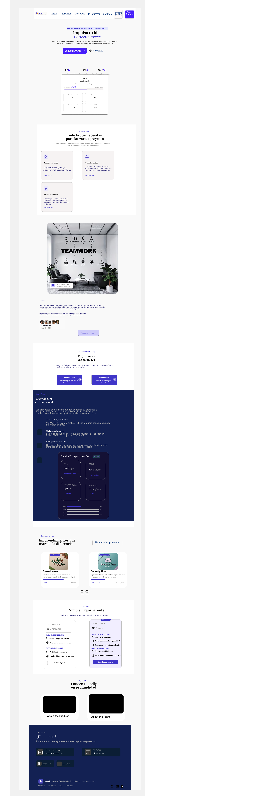

# Capítulo IV: Product Design
## 4.1. Style Guidelines
### 4.1.1. General Style Guidelines
### 4.1.2. Web Style Guidelines
## 4.2. Information Architecture
### 4.2.1. Organization Systems
### 4.2.2. Labeling Systems
### 4.2.3. SEO Tags and Meta Tags
### 4.2.4. Searching Systems
### 4.2.5. Navigation Systems
## 4.3. Landing Page UI Design
### 4.3.1. Landing Page Wireframe

Para elaborar nuestro prototipo de baja fidelidad, hemos utilizado la plataforma Figma, que nos permite crear, representar y exportar nuestros prototipos. Gracias a esta herramienta, podemos presentar un Wireframe de una buena calidad de una manera sencilla.

**Landing Page Desktop**

**Landing Page Movil**

### 4.3.2. Landing Page Mock-up

Hemos finalizado con éxito el mock-up de la página de inicio, aplicando los principios y elementos de diseño clave. Gracias a estas directrices, la experiencia para los usuarios de nuestra plataforma será mucho más sencilla e intuitiva.

**Landing Page Desktop**

## 4.4. Web Applications UX/UI Design
### 4.4.1. Web Applications Wireframes

### 4.4.2. Web Applications Wireflow Diagrams

### 4.4.3. Web Applications Mock-ups

### 4.4.4. Web Applications User Flow Diagrams
## 4.5. Web Applications Prototyping
## 4.6. Domain-Driven Software Architecture
### 4.6.1. Design-Level Event Storming
### 4.6.2. Software Architecture Context Diagram
### 4.6.3. Software Architecture Container Diagrams
### 4.6.4. Software Architecture Components Diagrams
## 4.7. Software Object-Oriented Design
### 4.7.1. Class Diagrams
## 4.8. Database Design
### 4.8.1. Database Diagram
