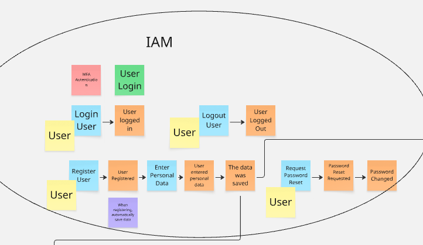
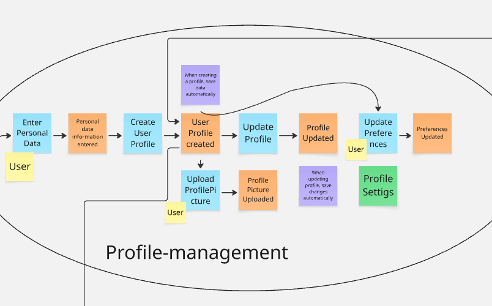
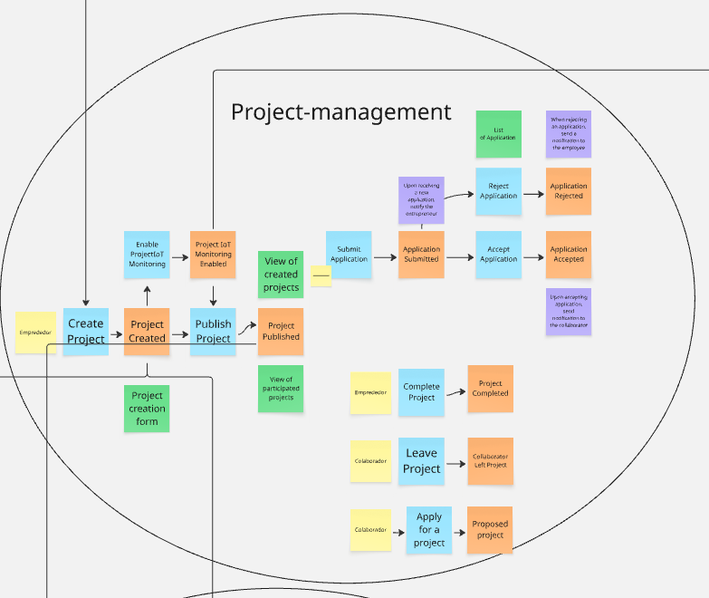
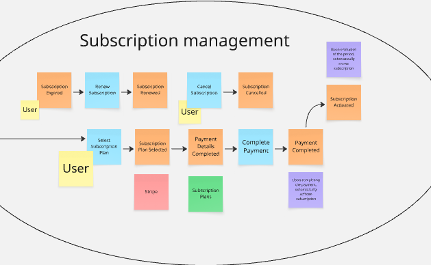
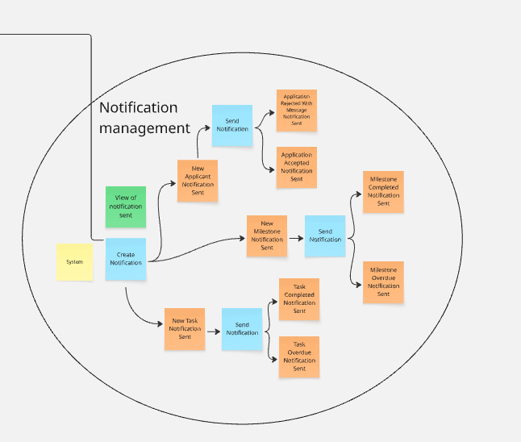
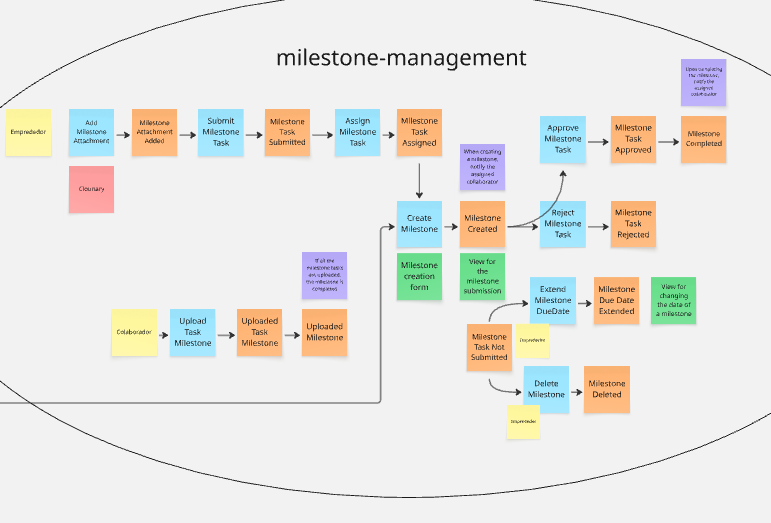
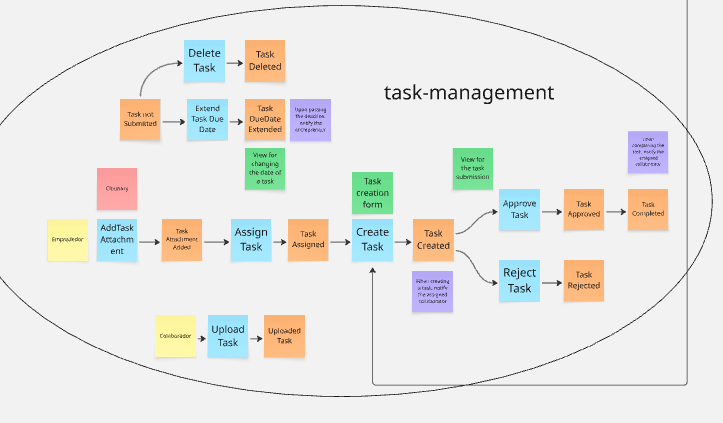
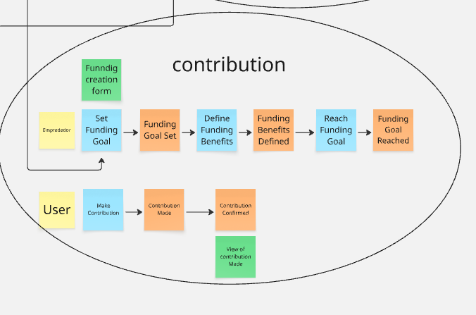
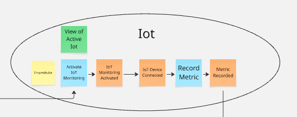
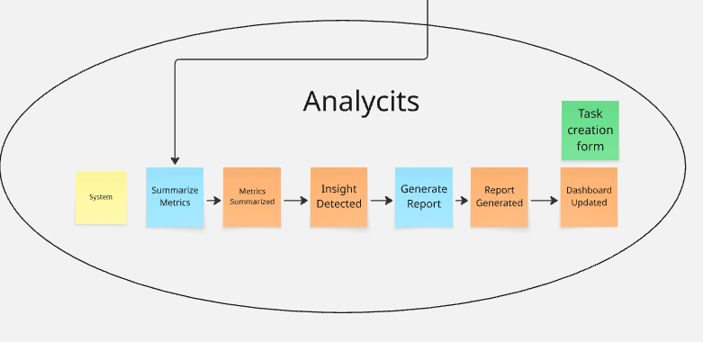

# Capítulo IV: Product Design
## 4.1. Style Guidelines
En esta sección, se presentan las guías de estilos para nuestro landing page y aplicación web de nuestro startup. Estas guías permiten establecer estilos previo al
desarrollo de nuestra página web. Además, los estilos seleccionados permitirán al usuario navegar por la página de manera sencilla, comoda y que atraiga
visualmente, junto con recursos visuales que muestran nuestra propuesta de solución a la problemática.
### 4.1.1. General Style Guidelines
A continuación, se presentan las pautas generales de las guias de estilo que permitirán la atracción visual a los usuarios.

Colors
Se ha seleccionado una paleta de colores que representará nuestro startup Foundly. Los colores fueron elegidos para lograr un atractivo visual equilibrado sin afectar la facilidad de navegación en la página web. Los cinco colores definidos son:

Violeta (#5147B7), el cual transmite creatividad, innovación y un enfoque moderno;
Morado (#8176DC), que complementa al violeta aportando armonía y una sensación de sofisticación;
Naranja (#EE9D32), que añade dinamismo, energía y llama la atención en puntos clave de la interfaz;
Gris (#91908C), utilizado para mantener un balance visual, aportando neutralidad y elegancia;
Blanco (#FFFFFF), que brinda claridad, limpieza y permite que los demás colores destaquen, mejorando la experiencia del usuario.

Branding
El branding permite crear la identidad a nuestra marca, la cual se llama Foundly. Nuestra finalidad es permitir la sencilla colaboración entre personas, las cuales
tienen como fin desarrollar una idea de emprendimiento. Con nuestro logo, queremos demostrar lo rapido y sencillo que es colaborar con otras personas, y que
estos emprendimientos crezcan, tengan progresos y logren sus metas.

## Typography

Nuestra elección para la tipografía que se utilizará en nuestro landing page es **Raleway**. Raleway es una tipografía elegante y versátil, con un diseño moderno y que transmite innovación. La tipografía transmitirá al segmento objetivo de emprendedores que somos una plataforma seria y transparente. Por el otro lado, la tipografía demuestra un tono dinámico y fresco, el cual nos ayudará a tener cercanía con el segmento de estudiantes universitarios y profesionales. El tamaño y el peso de la tipografía varía dependiendo del segmento de página y del tipo del dispositivo utilizado al entrar a la página web:

- **Encabezados principales (H1):** Peso ExtraBold (800) | Tamaño: 48–60 px  
- **Subtítulos (H2, H3):** Peso SemiBold (600) | Tamaño: 28–36 px  
- **Texto destacado:** Peso Bold (700) | Tamaño: 18–20 px  
- **Texto de párrafo / cuerpo (Body):** Peso Regular (400) | Tamaño: 16–18 px  
- **Texto secundario:** Peso Light (300) | Tamaño: 14–15 px  

### Botones

- **Botón principal:** Texto Raleway Bold 18px  
- **Botón secundario (links o acciones menores):** Texto Raleway Medium 16px 

### Spacing

El espaciado es importante para lograr una armonía visual y legibilidad sin incomodar al usuario. Se mantendrá una consistencia en los espaciados para mantener ordenado todas las secciones de la página web, esto se aplica utilizando un espaciado que sea un múltiplo de 8 (8px, 16px, 24px, etc.).

- **Secciones principales:** Entre 80–100 px de separación vertical. Para móviles será de 60–80 px.  
- **Elementos dentro de una sección:** Incluye títulos, párrafos y botones. Entre 24–40 px de separación vertical u horizontal. Para móviles entre 16–24 px.  
- **Galerías de imágenes:** Entre 16–24 px de separación horizontal entre cada imagen.  
- **Entre imagen y texto:** Entre 24–40 px de espaciado horizontal o vertical. Para móviles será de 16–24 px.  

### Dimensions

En esta sección, se presentarán los tonos de comunicación para los dos posibles usuarios planteados previamente. Los tonos de comunicación son importantes para empatizar y comunicar nuestras ideas de manera que los usuarios comprendan lo que ofrecemos y se sientan identificados con nuestra marca.

- **Emprendedores y Startups en Etapa Temprana (Emprendedores):**  
  Utilizamos un lenguaje inspirador, destacando que sus proyectos actuales y futuros pueden cumplir todas las metas planteadas. Nuestra plataforma se presenta como un impulso para "llegar lejos". El tono será profesional, pero también amigable y cercano, transmitiendo confianza. Además, se enfatiza la colaboración y la facilidad de encontrar personas que apoyen sus startups.

- **Estudiantes Universitarios y Profesionales (Colaboradores):**  
  Empleamos un lenguaje inspiracional y motivador, mostrando que pueden crecer profesionalmente utilizando nuestra plataforma. El tono será dinámico, resaltando oportunidades y beneficios, así como la posibilidad de colaborar en distintos emprendimientos.
### 4.1.2. Web Style Guidelines
Para las pautas de estilo web, se aplicarán diversos principios del diseño del landing page para adaptar la lectura de la página a las necesidades del usuario. Se mencionarán los principios utilizados:

- **Diseño Responsivo:**  
  Ofreceremos adaptabilidad a dispositivos de diferentes resoluciones, desde un móvil pequeño hasta pantallas grandes de computadoras. Esto garantiza que los usuarios puedan disfrutar de la experiencia de navegar en nuestra página web sin tener que visualizarla desde otro dispositivo.

- **Consistencia Visual:**  
  La consistencia visual de nuestra landing page se logrará mediante el uso de colores atractivos, tipografía elegante y dinámica, así como un espaciado adecuado para la correcta visualización de secciones y elementos. También se incluirán elementos visuales que representen nuestro logo y los objetivos de la startup. Esto ayuda a reforzar nuestra identidad de marca y facilita la navegación.

- **Accesibilidad:**  
  Buscamos garantizar la inclusividad en nuestra página web, especialmente para personas con discapacidad visual. Se incluirán descripciones alternativas en las imágenes y se mantendrá un contraste adecuado entre textos y fondos para asegurar una correcta legibilidad.
## 4.2. Information Architecture
### 4.2.1. Organization Systems
### 4.2.2. Labeling Systems
### 4.2.3. SEO Tags and Meta Tags
### 4.2.4. Searching Systems
### 4.2.5. Navigation Systems
## 4.3. Landing Page UI Design
### 4.3.1. Landing Page Wireframe
### 4.3.2. Landing Page Mock-up
## 4.4. Web Applications UX/UI Design
### 4.4.1. Web Applications Wireframes
### 4.4.2. Web Applications Wireflow Diagrams
### 4.4.3. Web Applications Mock-ups
### 4.4.4. Web Applications User Flow Diagrams
## 4.5. Web Applications Prototyping
## 4.6. Domain-Driven Software Architecture

La arquitectura de software de Foundly se construye a partir de los resultados obtenidos en el Big Picture Event Storming, que permitió comprender en profundidad los flujos clave del dominio de atención residencial y las interacciones entre colaboradores y emprededores. A partir de este análisis inicial, se desarrolló una visión más estructurada del dominio utilizando los principios de Domain-Driven Design (DDD).

En las siguientes secciones se presenta cada nivel del modelo, explicando la estructura, responsabilidades y comunicación entre los elementos que conforman la arquitectura de Foundly.

### 4.6.1. Design-Level Event Storming

Para identificar los eventos de dominio, es recomendable realizar una sesión de Event Storming. Esta técnica permite visualizar y comprender el flujo de eventos dentro del dominio, facilitando la identificación de los Bounded Context.

El desarrollo del proceso del Domain-Driven Design se realizó en la aplicación Miro: 

<a target="_blank"  href="https://miro.com/welcomeonboard/cHVMcFFueFZFQjcyVWkrMUNzNWVjSGZYSDhFaEpXSUlRV0FZYnF3QTAzczloRXhSTFlFbkVIcThvM044OWZBWjYxNTlQSFRFbk1TbzRUSkpJNG9YOFBmdzQ3QVkzWmFoalVhN1FnMGw5YWlnYVpwYUllM1N0TTdtanFXTytoaE5zVXVvMm53MW9OWFg5bkJoVXZxdFhRPT0hdjE=?share_link_id=425540868454" title="Title">Miro
</td>

**IAM (Identify Acces Management):**

El bounded context IAM (Identity and Access Management) es responsable de la gestión de la identidad de los usuarios dentro de la plataforma Foundly, asegurando procesos seguros de autenticación y acceso al sistema.

Este contexto administra funcionalidades clave como el registro de nuevos usuarios, inicio y cierre de sesión, gestión de credenciales, recuperación y restablecimiento de contraseñas, así como la actualización de datos personales. Además, valida la información ingresada por los usuarios y garantiza la correcta persistencia de los datos.

El IAM permite identificar y autenticar a los usuarios dentro de la plataforma, estableciendo una base segura para su interacción con las funcionalidades de Foundly, como la creación de proyectos, participación en equipos y gestión de contribuciones.

Su propósito principal es garantizar un acceso confiable, seguro y controlado, protegiendo la información del sistema y asegurando que únicamente usuarios autorizados puedan acceder a los recursos de la plataforma.

**Profile Management:**

El bounded context Profile Management se encarga de la gestión de la información personal y configuración de los usuarios dentro de la plataforma Foundly, permitiendo construir y mantener su identidad digital.

Este contexto administra procesos como la creación del perfil de usuario, el registro y actualización de datos personales, la carga de imagen de perfil y la gestión de preferencias. Asimismo, permite que los cambios realizados por el usuario se almacenen automáticamente, garantizando la consistencia de la información.

El Profile Management facilita la personalización de la experiencia dentro de la plataforma, permitiendo que los usuarios definan sus intereses, preferencias y datos relevantes que influyen en su interacción con proyectos, equipos y oportunidades.

Su propósito principal es proporcionar un perfil completo, actualizado y configurable que represente al usuario dentro del ecosistema de Foundly, mejorando la experiencia de uso y la conexión con otros participantes.

**Project Management:**

El bounded context Project Management se encarga de la gestión completa del ciclo de vida de los proyectos dentro de la plataforma Foundly, desde su creación hasta su finalización.

Este contexto permite a los emprendedores crear proyectos mediante formularios estructurados, definir sus objetivos y publicarlos para que estén disponibles a otros usuarios. Asimismo, gestiona la visualización de proyectos, tanto creados como participados, facilitando la exploración y el acceso a oportunidades de colaboración.

El sistema administra el proceso de postulación de colaboradores, incluyendo el envío de solicitudes, su evaluación y la decisión de aceptación o rechazo por parte del emprendedor. Además, maneja eventos como la incorporación de nuevos miembros al proyecto o su salida voluntaria.

Adicionalmente, este contexto permite habilitar el monitoreo del proyecto, gestionar su estado (creado, publicado, en progreso o completado) y dar seguimiento a su evolución hasta su finalización.

Su propósito principal es organizar y controlar la gestión de proyectos colaborativos dentro de Foundly, facilitando la interacción entre emprendedores y colaboradores, y asegurando un flujo estructurado desde la creación hasta la culminación del proyecto.

**Subscription Management:**

El bounded context Subscription Management se encarga de la gestión de los planes de suscripción dentro de la plataforma Foundly, permitiendo a los usuarios acceder a funcionalidades adicionales mediante un modelo de pago recurrente.

Este contexto administra procesos como la selección de planes de suscripción, el registro y validación de los datos de pago, y la ejecución de transacciones mediante servicios externos como Stripe. Asimismo, gestiona el ciclo de vida de la suscripción, incluyendo su activación, renovación automática, expiración y cancelación.

**Notification Management:**

El bounded context Notification Management se encarga de la generación y envío de notificaciones dentro de la plataforma Foundly, permitiendo mantener informados a los usuarios sobre eventos relevantes relacionados con su actividad.

Este contexto administra la creación de notificaciones a partir de distintos eventos del sistema, como nuevas postulaciones a proyectos, aceptación o rechazo de solicitudes, asignación y finalización de tareas, así como el progreso de hitos (milestones). Además, gestiona el envío de estas notificaciones hacia los usuarios correspondientes y permite visualizar el historial de notificaciones generadas.

El sistema asegura que cada usuario reciba información oportuna sobre cambios en los proyectos en los que participa, facilitando la coordinación, el seguimiento de actividades y la toma de decisiones dentro del entorno colaborativo.

**Milestone Management:**

El bounded context Milestone Management se encarga de la gestión de hitos dentro de los proyectos en la plataforma Foundly, permitiendo organizar el trabajo a nivel grupal y controlar el cumplimiento de objetivos intermedios.

Este contexto permite a los emprendedores crear hitos mediante formularios estructurados, definir tareas asociadas y asignarlas a los colaboradores del equipo. Asimismo, gestiona el ciclo de vida de los hitos, incluyendo su creación, asignación, envío de tareas, revisión y aprobación o rechazo de las actividades realizadas.

El sistema también permite a los colaboradores subir evidencias del trabajo realizado dentro de un hito, las cuales pueden ser evaluadas por el emprendedor antes de ser aprobadas. Además, se contemplan funcionalidades como la extensión de fechas límite, eliminación de hitos y visualización del estado de avance.

**Task Management:**

El bounded context Task Management se encarga de la gestión de tareas individuales dentro de los proyectos en la plataforma Foundly, permitiendo organizar, asignar y dar seguimiento al trabajo de cada colaborador.

Este contexto permite a los emprendedores crear tareas específicas mediante formularios estructurados, asignarlas a los miembros del equipo y definir sus fechas de entrega. Asimismo, los colaboradores pueden subir el trabajo realizado como evidencia, el cual es evaluado posteriormente.

El sistema gestiona el ciclo de vida de las tareas, incluyendo su creación, asignación, envío, revisión y decisión de aprobación o rechazo. Además, contempla funcionalidades como la extensión de fechas límite, eliminación de tareas y visualización del estado actualizado de cada actividad.

**Contribution Management:**

El bounded context Contribution Management se encarga de la gestión de las contribuciones realizadas por los usuarios dentro de la plataforma Foundly, permitiendo apoyar el desarrollo de los proyectos mediante aportes.

Este contexto permite a los emprendedores definir objetivos de financiamiento (funding goals) y establecer beneficios asociados a las contribuciones. Asimismo, gestiona el proceso mediante el cual los usuarios pueden realizar aportes a los proyectos, registrando cada contribución y confirmando su ejecución.

El sistema controla el progreso del financiamiento, permitiendo visualizar el avance hacia la meta establecida y notificando cuando el objetivo ha sido alcanzado. Además, facilita la consulta de las contribuciones realizadas por los usuarios, promoviendo la transparencia y confianza dentro de la plataforma.

Su propósito principal es facilitar el apoyo a los proyectos mediante contribuciones estructuradas, asegurando el seguimiento del financiamiento y promoviendo la participación activa de la comunidad.

**IOT:**

El bounded context IoT (Environmental Monitoring) se encarga de la integración y gestión de dispositivos IoT dentro de la plataforma Foundly, permitiendo el monitoreo de datos del entorno físico asociados a los proyectos.

Este contexto permite activar el monitoreo IoT en los proyectos, gestionar la conexión de dispositivos y registrar datos capturados como métricas ambientales. Asimismo, procesa la información obtenida, almacenando indicadores relevantes que pueden ser utilizados para evaluar el impacto del proyecto.

**Analytics:**

El bounded context Analytics se encarga del procesamiento y análisis de los datos generados dentro de la plataforma Foundly, permitiendo transformar información en indicadores útiles para la toma de decisiones.

El sistema permite resumir métricas, detectar información significativa y generar reportes que son reflejados en dashboards actualizados, facilitando la visualización del rendimiento de los proyectos y el impacto generado.

Su propósito principal es proporcionar una visión clara y basada en datos del comportamiento del sistema, permitiendo a los usuarios y organizadores evaluar el progreso, optimizar decisiones y evidenciar resultados de manera efectiva.

### 4.6.2. Software Architecture Context Diagram

En este nivel se presenta una vista de alto nivel de la arquitectura del sistema, donde el foco está en **Foundly** como una “caja negra” y en las interacciones que mantiene con sus usuarios y sistemas externos.

El *context diagram* muestra a **Foundly Software System** como el núcleo de la solución, rodeado por los principales actores y servicios externos con los que se comunica:

- **Emprendedor (Entrepreneur):** usuario que crea, publica y gestiona proyectos dentro de la plataforma. Utiliza Foundly para definir objetivos, formar equipos de trabajo y activar mecanismos de financiamiento.

- **Colaborador (Collaborator):** usuario que participa en proyectos aportando habilidades y tiempo. Interactúa con Foundly para postular, ejecutar tareas y contribuir al progreso del proyecto.

- **Payment System (Stripe):** sistema externo encargado de procesar pagos relacionados con contribuciones y suscripciones, garantizando transacciones seguras dentro de la plataforma.

- **Cloud Storage Service (Cloudinary):** servicio externo utilizado para almacenar y gestionar archivos multimedia, como imágenes de perfil, evidencias de tareas y recursos asociados a proyectos.

- **Authentication Service (Auth0):** servicio externo responsable de la autenticación de usuarios, gestionando el registro, inicio de sesión y seguridad mediante mecanismos como tokens.

- **IoT Devices:** dispositivos físicos externos que envían métricas en tiempo real (temperatura, humedad, calidad del aire, entre otros) hacia la plataforma, permitiendo monitorear el impacto de los proyectos.

En el diagrama se representan las relaciones entre estos elementos, destacando que tanto los emprendedores como los colaboradores interactúan directamente con Foundly, mientras que el sistema se encarga de orquestar la comunicación con servicios externos como pagos, almacenamiento, autenticación e IoT.

Esta vista permite comprender el alcance del sistema, sus límites de responsabilidad y el ecosistema tecnológico en el que se integra Foundly, antes de profundizar en niveles más detallados de la arquitectura.

### 4.6.3. Software Architecture Container Diagrams

En el nivel de contenedores, la atención se desplaza desde “quién usa el sistema” hacia “cómo se organiza internamente Foundly en aplicaciones y fuentes de datos”. El *container diagram* muestra los elementos principales de la arquitectura, sus responsabilidades y la forma en que se comunican entre sí y con sistemas externos.

La arquitectura lógica de Foundly se estructura en los siguientes contenedores:

- **Landing Page:** aplicación web estática que presenta la propuesta de valor de Foundly, guía a los usuarios y actúa como punto de entrada al sistema. Está desarrollada con tecnologías web estándar (HTML, CSS y JavaScript).

- **Single Page Application (SPA):** aplicación web principal implementada en **Angular**, donde interactúan los emprendedores y colaboradores. Este contenedor gestiona la experiencia de usuario, vistas, navegación y comunicación con el backend.

- **API Application:** backend monolítico desarrollado en **Spring Boot (Java)**, que expone una API REST y encapsula la lógica de negocio del sistema. Está organizado por módulos alineados a los bounded contexts, como IAM, Profile, Project, Task, Milestone, Contribution, Subscription, Notification, IoT, Analytics y Shared.

- **Database:** base de datos relacional **MySQL**, donde se persiste la información estructurada del sistema, incluyendo usuarios, proyectos, tareas, hitos, contribuciones, métricas IoT, reportes y notificaciones.

En el diagrama se observa que:

- Los usuarios (emprendedores y colaboradores) acceden inicialmente a la **Landing Page**, desde donde son redirigidos a la **SPA** mediante acciones de autenticación o registro.

- La **SPA** se comunica exclusivamente con la **API Application** mediante peticiones HTTP/HTTPS utilizando mensajes en formato JSON bajo un estilo arquitectónico REST.

- La **API Application** gestiona la lógica del sistema y realiza operaciones de lectura y escritura en la **Database**, asegurando la persistencia de los datos.

- La **API Application** se integra con sistemas externos como:
  - **Stripe**, para el procesamiento de pagos y contribuciones.
  - **Cloudinary**, para el almacenamiento de imágenes y archivos.
  - **Auth0**, para la autenticación y gestión de identidad de usuarios.
  - **IoT Devices**, que envían métricas en tiempo real para el monitoreo de proyectos.

Esta vista permite entender cómo se distribuyen las responsabilidades entre la capa de presentación (Landing Page y SPA), la capa de lógica de negocio (API Application) y la capa de persistencia (Database), así como las integraciones externas que enriquecen la funcionalidad de Foundly.

### 4.6.4. Software Architecture Components Diagrams

En el nivel de componentes se detalla la descomposición interna de los contenedores, mostrando los bloques estructurales que los conforman y las relaciones entre ellos. En esta sección se pone especial énfasis en el contenedor **API Application**, ya que es donde reside la mayor parte de la lógica de negocio del sistema Foundly.

El *component diagram* de la API Application organiza la arquitectura interna siguiendo los **bounded contexts definidos en el dominio**, donde cada módulo backend representa un componente principal dentro del sistema:

- **IAM Module:** se encarga de la autenticación y gestión de usuarios, incluyendo registro, inicio de sesión, roles, generación de tokens y seguridad del acceso al sistema.

- **Profile Module:** gestiona la información personal de los usuarios, permitiendo la actualización de perfiles, biografías e imágenes.

- **Project Module:** administra la creación, publicación y gestión de proyectos, incluyendo la participación de colaboradores y el ciclo de vida del proyecto.

- **Task Module:** maneja las tareas individuales asociadas a los proyectos, permitiendo su asignación, seguimiento y validación.

- **Milestone Module:** gestiona los hitos del proyecto y sus tareas grupales (**MilestoneTask**), representando etapas clave del progreso del proyecto.

- **Contribution Module:** gestiona los aportes económicos realizados por los usuarios a los proyectos, incluyendo la integración con el sistema de pagos.

- **Subscription Module:** administra los planes y suscripciones de los usuarios, controlando el acceso a funcionalidades premium del sistema.

- **Notification Module:** gestiona el envío de notificaciones a los usuarios, informando sobre eventos relevantes como tareas, hitos o cambios en proyectos.

- **IoT Module:** se encarga de la recepción y gestión de métricas provenientes de dispositivos IoT, permitiendo el monitoreo en tiempo real de los proyectos.

- **Analytics Module:** procesa las métricas obtenidas del módulo IoT para generar reportes e insights que apoyan la toma de decisiones.

- **Shared Module:** proporciona componentes compartidos, utilidades, clases base y servicios transversales utilizados por los demás módulos, promoviendo la reutilización y consistencia del sistema.

En el diagrama se refleja cómo:

- La **SPA** consume los servicios expuestos por la API Application mediante endpoints REST organizados por cada módulo del sistema.

- Cada módulo backend encapsula su propia lógica de negocio y accede a la **Database** para persistir y consultar la información correspondiente a su contexto.

- Algunos módulos se integran con sistemas externos:
  - **IAM Module** con el servicio de autenticación (Auth0).
  - **Contribution y Subscription Module** con el sistema de pagos (Stripe).
  - **Notification Module** con servicios de mensajería o correo electrónico.
  - **IoT Module** con dispositivos físicos que envían métricas en tiempo real.

- El **Analytics Module** consume datos del IoT Module para generar reportes e insights, estableciendo una relación directa entre captura de datos y análisis.

- Todos los módulos backend reutilizan funcionalidades comunes proporcionadas por el **Shared Module**, lo que mejora la cohesión del sistema y reduce la duplicación de código.

De esta manera, el component diagram permite visualizar cómo la API Application se descompone en módulos alineados al dominio, mostrando claramente las responsabilidades de cada uno y la forma en que colaboran para implementar la funcionalidad completa de Foundly.

## 4.7. Software Object-Oriented Design
### 4.7.1. Class Diagrams

**Shared**

### Shared Module – Class Diagram Description

El diagrama de clases del módulo **Shared** representa el conjunto de componentes transversales reutilizables dentro del sistema Foundly. Este módulo concentra elementos comunes del dominio que son utilizados por múltiples bounded contexts, promoviendo la consistencia, reutilización y desacoplamiento en la arquitectura.

El diseño sigue principios de **Domain-Driven Design (DDD)**, proporcionando clases base, value objects, utilidades y eventos de dominio.

#### Componentes principales

- **BaseEntity:** clase base para todas las entidades del sistema. Contiene atributos comunes como `id`, `createdAt` y `updatedAt`, permitiendo estandarizar el manejo de entidades en todos los contextos.

- **AggregateRoot:** representa la raíz de agregado en DDD. Todas las entidades principales del dominio (como User, Project, etc.) heredan de esta clase, asegurando control sobre las invariantes del agregado.

#### Value Objects

- **Email:** encapsula el valor del correo electrónico y su validación mediante el método `validate()`, garantizando consistencia en el dominio.

- **Password:** representa la contraseña del usuario en su forma segura (hash). Incluye lógica para comparar contraseñas mediante `matches()`.

- **UserId y ProjectId:** identificadores tipados que encapsulan valores primitivos (Long), evitando el uso directo de tipos básicos y reduciendo errores en el dominio.

- **Money:** representa valores monetarios incluyendo monto y moneda, facilitando el manejo de transacciones en el sistema.

- **DateRange:** encapsula un rango de fechas (`startDate`, `endDate`), útil para representar periodos en diferentes contextos como suscripciones o hitos.

#### Eventos de dominio

- **DomainEvent:** clase base para eventos del dominio, incluyendo la fecha de ocurrencia (`occurredOn`).

- **UserRegisteredEvent:** evento que se dispara cuando un usuario se registra en el sistema.

- **ProjectCreatedEvent:** evento que representa la creación de un proyecto.

- **ContributionMadeEvent:** evento generado cuando un usuario realiza una contribución económica.

Estos eventos permiten implementar arquitecturas reactivas o basadas en eventos, facilitando la integración entre módulos.

#### Manejo de excepciones

- **DomainException:** clase base para excepciones del dominio.

- **ValidationException:** representa errores relacionados con validaciones de reglas de negocio.

Estas clases permiten manejar errores de manera estructurada y coherente en todo el sistema.

#### Utilidades

- **UUIDGenerator:** proporciona la generación de identificadores únicos.

- **DateUtils:** ofrece funciones relacionadas con fechas, como la obtención de la fecha actual.

#### Importancia del módulo Shared

El módulo Shared cumple un rol fundamental en la arquitectura, ya que:

- Evita la duplicación de código entre bounded contexts.
- Centraliza reglas comunes del dominio.
- Mejora la consistencia en la modelación del sistema.
- Facilita la mantenibilidad y escalabilidad de la solución.

De esta manera, el Shared Module actúa como la base sobre la cual se construyen los demás módulos del sistema Foundly, asegurando cohesión y estandarización en toda la arquitectura.

**IAM (Identify Acces Management):**

El diagrama de clases del módulo **IAM (Identity and Access Management)** representa la estructura interna encargada de la autenticación, gestión de usuarios y control de acceso dentro del sistema Foundly.

Este módulo sigue los principios de **Domain-Driven Design (DDD)** y una separación clara entre comandos (*commands*), consultas (*queries*), servicios de aplicación y lógica de dominio.

#### Componentes principales

- **IAMController:** actúa como punto de entrada del sistema, exponiendo endpoints REST para operaciones como registro (`register()`), inicio de sesión (`login()`) y recuperación de contraseña (`resetPassword()`). Este componente recibe las solicitudes del cliente (SPA) y las delega al facade correspondiente.

- **IAMFacade:** funciona como una capa de orquestación que simplifica la interacción entre el controlador y los servicios de aplicación. Centraliza las operaciones principales del módulo como `register()` y `login()`.

#### Manejo de comandos (Command Side)

- **RegisterUserCommand:** encapsula los datos necesarios para registrar un usuario (email y password).
- **ResetPasswordCommand:** contiene la información requerida para actualizar la contraseña del usuario.

- **IAMCommandService:** ejecuta la lógica asociada a los comandos, como el registro de usuarios y el cambio de contraseña. Este servicio interactúa con:
  - **UserRepository:** para persistir los datos del usuario.
  - **PasswordHasher:** para asegurar el almacenamiento seguro de contraseñas mediante hashing.

#### Manejo de consultas (Query Side)

- **LoginUserQuery:** representa la solicitud de autenticación del usuario.
- **GetUserByEmailQuery:** permite recuperar información del usuario a partir de su correo electrónico.

- **IAMQueryService:** maneja las operaciones de lectura, incluyendo:
  - Validación de credenciales.
  - Obtención de usuarios.
  - Generación de tokens mediante el **TokenService**.

#### Dominio

- **User (Aggregate Root):** entidad principal del módulo, que encapsula los atributos del usuario (id, email, password, rol y fecha de creación) y comportamientos como `register()` y `changePassword()`. Representa la raíz de agregado del contexto IAM.

- **PasswordHasher:** componente encargado de generar y verificar hashes de contraseñas, garantizando seguridad en el almacenamiento.

- **TokenService:** responsable de generar tokens de autenticación (por ejemplo, JWT), los cuales permiten la gestión de sesiones seguras.

#### Persistencia

- **UserRepository:** interfaz que define las operaciones de acceso a datos para la entidad User, como guardar un usuario o buscarlo por email. Permite desacoplar la lógica de dominio de la infraestructura.

#### Flujo general

1. El usuario envía una solicitud (registro o login) a través del **IAMController**.
2. El controlador delega la operación al **IAMFacade**.
3. Dependiendo del caso:
   - Para comandos → se utiliza el **IAMCommandService**.
   - Para consultas → se utiliza el **IAMQueryService**.
4. Los servicios interactúan con el **UserRepository** para persistencia y recuperación de datos.
5. En el caso de autenticación, el **TokenService** genera un token seguro para el usuario.
6. Las contraseñas son gestionadas de forma segura mediante el **PasswordHasher**.

Este diseño permite una clara separación de responsabilidades, facilita la mantenibilidad del sistema y asegura la escalabilidad del módulo IAM dentro de la arquitectura de Foundly.

**Profile Management:**

El diagrama de clases del módulo **Profile** representa la estructura encargada de la gestión de la información personal de los usuarios dentro del sistema Foundly.

Este módulo sigue los principios de **Domain-Driven Design (DDD)** y aplica una separación clara entre comandos (*commands*) y consultas (*queries*), permitiendo una mejor organización y escalabilidad del sistema.

#### Componentes principales

- **ProfileController:** actúa como punto de entrada del módulo, exponiendo endpoints REST para la gestión del perfil del usuario. Recibe las solicitudes desde la SPA y las delega al facade correspondiente.

- **ProfileFacade:** funciona como una capa de orquestación que simplifica la interacción entre el controlador y los servicios del dominio. Coordina las operaciones de actualización y consulta del perfil.

#### Dominio

- **Profile (Aggregate Root):** entidad principal del módulo que representa la información del perfil del usuario. Contiene atributos como `id`, `userId`, `name`, `bio` e `imageUrl`, así como el comportamiento `updateProfile()`. Esta entidad actúa como la raíz del agregado, garantizando la consistencia de los datos del perfil.

- **ProfileId:** value object que encapsula el identificador del perfil, evitando el uso directo de tipos primitivos y mejorando la seguridad del dominio.

#### Manejo de comandos (Command Side)

- **UpdateProfileCommand:** encapsula los datos necesarios para actualizar el perfil del usuario (userId, nombre y biografía).

- **ProfileCommandService:** ejecuta la lógica de modificación del perfil, aplicando las reglas de negocio necesarias y persistiendo los cambios mediante el repositorio.

#### Manejo de consultas (Query Side)

- **GetProfileQuery:** representa la solicitud para obtener la información del perfil de un usuario.

- **ProfileQueryService:** se encarga de las operaciones de lectura, recuperando la información del perfil desde la capa de persistencia.

#### Persistencia

- **ProfileRepository:** interfaz que define las operaciones de acceso a datos para el perfil, como guardar (`save`) y buscar por usuario (`findByUser`). Permite desacoplar la lógica del dominio de la infraestructura.

#### Flujo general

1. El usuario realiza una solicitud desde la **SPA** hacia el **ProfileController**.
2. El controlador delega la operación al **ProfileFacade**.
3. Dependiendo del tipo de operación:
   - Para actualización → se utiliza el **ProfileCommandService**.
   - Para consulta → se utiliza el **ProfileQueryService**.
4. Los servicios interactúan con el **ProfileRepository** para persistir o recuperar información.
5. La entidad **Profile** asegura la consistencia del dominio mediante su comportamiento interno.

Este diseño permite una clara separación de responsabilidades, facilita la mantenibilidad del sistema y asegura que la gestión de perfiles se mantenga desacoplada de otros módulos del sistema.

**Project Management:**

El diagrama de clases del módulo **Project** representa la estructura encargada de la creación, gestión y ciclo de vida de los proyectos dentro de la plataforma Foundly.

Este módulo sigue los principios de **Domain-Driven Design (DDD)**, donde la entidad **Project** actúa como *Aggregate Root*, y se aplica el patrón **CQRS (Command Query Responsibility Segregation)** para separar las operaciones de escritura y lectura.

#### Componentes principales

- **ProjectController:** actúa como punto de entrada del módulo, exponiendo endpoints REST para operaciones como creación de proyectos, postulación, aceptación de miembros, activación de monitoreo IoT y finalización del proyecto.

- **ProjectFacade:** capa de orquestación que coordina la interacción entre el controlador y los servicios de aplicación, simplificando el acceso a las funcionalidades del módulo.

#### Dominio

- **Project (Aggregate Root):** entidad principal del módulo que encapsula la información y comportamiento del proyecto. Incluye atributos como `id`, `name`, `description`, `status`, `ownerId` y `members`.  
  Además, define comportamientos clave como:
  - `create()`
  - `addMember()`
  - `removeMember()`
  - `activateIoT()`
  - `complete()`

- **ProjectId:** value object que representa el identificador del proyecto.

- **ProjectName:** value object que encapsula el nombre del proyecto.

- **ProjectStatus (enum):** define los estados posibles del proyecto:
  - `DRAFT`
  - `ACTIVE`
  - `COMPLETED`

#### Manejo de comandos (Command Side)

- **CreateProjectCommand:** contiene los datos necesarios para crear un proyecto (nombre, descripción y propietario).

- **ApplyToProjectCommand:** permite que un usuario solicite unirse a un proyecto.

- **AcceptMemberCommand:** representa la aceptación de un colaborador dentro del proyecto.

- **ActivateIoTCommand:** activa el monitoreo IoT asociado al proyecto.

- **CompleteProjectCommand:** marca el proyecto como finalizado.

- **ProjectCommandService:** ejecuta la lógica de negocio relacionada con la modificación del estado del proyecto, gestionando el flujo completo del ciclo de vida.

#### Manejo de consultas (Query Side)

- **GetProjectByIdQuery:** permite obtener un proyecto específico.

- **GetProjectsByUserQuery:** permite listar los proyectos asociados a un usuario.

- **GetAllProjectsQuery:** permite obtener todos los proyectos disponibles.

- **ProjectQueryService:** gestiona las operaciones de lectura del sistema, accediendo a la información persistida sin modificar el estado del dominio.

#### Persistencia

- **ProjectRepository:** interfaz que define las operaciones de acceso a datos del agregado Project, incluyendo:
  - `save(project)`
  - `findById(projectId)`
  - `findByUser(userId)`

Este repositorio desacopla la lógica de dominio de la infraestructura de persistencia.

#### Flujo general

1. El usuario interactúa desde la **SPA** enviando una solicitud al **ProjectController**.
2. El controlador delega la operación al **ProjectFacade**.
3. Dependiendo de la operación:
   - Para cambios de estado → se utiliza el **ProjectCommandService**.
   - Para consultas → se utiliza el **ProjectQueryService**.
4. El **ProjectCommandService** aplica las reglas de negocio sobre el agregado **Project**.
5. El **ProjectRepository** persiste o recupera la información desde la base de datos.
6. Las transiciones de estado del proyecto (DRAFT → ACTIVE → COMPLETED) son controladas por el dominio.

Este diseño permite encapsular toda la lógica del ciclo de vida del proyecto dentro de un único agregado, asegurando consistencia, mantenibilidad y alineación con los principios de arquitectura basada en dominios.

**Subscription Management:**

El diagrama de clases del módulo **Subscription** representa la estructura encargada de la gestión de planes y suscripciones de los usuarios dentro de la plataforma Foundly.

Este módulo sigue los principios de **Domain-Driven Design (DDD)** y aplica el patrón **CQRS (Command Query Responsibility Segregation)**, separando claramente las operaciones de escritura y lectura.

#### Componentes principales

- **SubscriptionController:** actúa como punto de entrada del módulo, exponiendo endpoints REST para operaciones como crear suscripciones, cancelarlas, renovarlas y consultar el estado de la suscripción de un usuario.

- **SubscriptionFacade:** capa de orquestación que centraliza las operaciones principales del módulo, delegando la lógica a los servicios correspondientes.

#### Dominio

- **Subscription (Aggregate Root):** entidad principal que representa la suscripción de un usuario. Contiene atributos como `id`, `userId`, `plan`, `status`, `startDate` y `endDate`.  
  Además, encapsula comportamientos clave:
  - `activate()`
  - `cancel()`
  - `expire()`

- **SubscriptionId:** value object que encapsula el identificador de la suscripción.

- **PlanType (enum):** define los tipos de planes disponibles:
  - `FREE`
  - `PREMIUM`

- **SubscriptionStatus (enum):** define los estados de la suscripción:
  - `ACTIVE`
  - `CANCELED`
  - `EXPIRED`

#### Manejo de comandos (Command Side)

- **CreateSubscriptionCommand:** contiene la información necesaria para crear una suscripción (usuario y tipo de plan).

- **CancelSubscriptionCommand:** representa la cancelación de una suscripción existente.

- **RenewSubscriptionCommand:** permite renovar una suscripción activa o expirada.

- **SubscriptionCommandService:** ejecuta la lógica de negocio relacionada con la creación, cancelación y renovación de suscripciones.  
  Este servicio interactúa con:
  - **SubscriptionRepository:** para persistencia.
  - **BillingGateway:** para procesar pagos.

#### Manejo de consultas (Query Side)

- **GetSubscriptionQuery:** permite obtener la suscripción asociada a un usuario.

- **SubscriptionQueryService:** se encarga de recuperar la información de suscripciones desde la base de datos.

#### Persistencia

- **SubscriptionRepository:** interfaz que define las operaciones de acceso a datos para la entidad Subscription, como:
  - `save(subscription)`
  - `findByUser(userId)`
  - `findById(subscriptionId)`

#### Integración con sistemas externos

- **BillingGateway:** interfaz que define la operación de cobro (`charge`), desacoplando la lógica del dominio del proveedor de pagos.

- **StripeBillingService:** implementación concreta del gateway que integra el sistema con **Stripe** para procesar pagos de suscripciones.

#### Flujo general

1. El usuario realiza una acción desde la **SPA** (crear, cancelar o renovar suscripción).
2. La solicitud llega al **SubscriptionController**.
3. El controlador delega la operación al **SubscriptionFacade**.
4. Dependiendo de la operación:
   - Para cambios → se utiliza el **SubscriptionCommandService**.
   - Para consultas → se utiliza el **SubscriptionQueryService**.
5. El **SubscriptionCommandService** interactúa con el **BillingGateway** para procesar pagos cuando es necesario.
6. Los datos se persisten mediante el **SubscriptionRepository**.
7. El agregado **Subscription** garantiza la consistencia del estado de la suscripción.

Este diseño permite desacoplar la lógica de negocio del proveedor de pagos, facilitar la escalabilidad del sistema y mantener un control claro sobre el ciclo de vida de las suscripciones dentro de Foundly.

**Notification Management:**

El diagrama de clases del módulo **Notification** representa la estructura encargada de la gestión y envío de notificaciones dentro del sistema Foundly, permitiendo informar a los usuarios sobre eventos relevantes como tareas, hitos, postulaciones y estados de proyectos.

Este módulo sigue los principios de **Domain-Driven Design (DDD)** y aplica el patrón **CQRS**, separando las operaciones de escritura (envío y actualización) de las operaciones de lectura (consulta de notificaciones).

#### Componentes principales

- **NotificationController:** actúa como punto de entrada del módulo, exponiendo endpoints REST para:
  - Enviar notificaciones (`send()`)
  - Obtener notificaciones de un usuario (`getByUser()`)
  - Marcar notificaciones como leídas (`markAsRead()`)

- **NotificationFacade:** capa de orquestación que centraliza las operaciones del módulo, delegando las acciones a los servicios de comandos y consultas.

#### Dominio

- **Notification (Aggregate Root):** entidad principal que representa una notificación. Contiene atributos como `id`, `userId`, `message`, `type` e `isRead`.  
  Incluye comportamiento como:
  - `markAsRead()`

- **NotificationId:** value object que encapsula el identificador de la notificación.

- **NotificationType (enum):** define los tipos de eventos que generan notificaciones:
  - `TASK_NEW`
  - `TASK_COMPLETED`
  - `MILESTONE_NEW`
  - `MILESTONE_COMPLETED`
  - `TASK_OVERDUE`
  - `MILESTONE_OVERDUE`
  - `NEW_APPLICANT`
  - `APPLICANT_ACCEPTED`
  - `APPLICANT_REJECTED`

Este enum permite categorizar las notificaciones y facilitar su procesamiento.

#### Manejo de comandos (Command Side)

- **SendNotificationCommand:** encapsula la información necesaria para enviar una notificación (usuario, mensaje y tipo).

- **MarkAsReadCommand:** representa la acción de marcar una notificación como leída.

- **NotificationCommandService:** ejecuta la lógica de envío y actualización de notificaciones.  
  Este servicio interactúa con:
  - **NotificationRepository:** para persistencia.
  - **NotificationSender:** para el envío real de la notificación.

#### Manejo de consultas (Query Side)

- **GetNotificationsQuery:** permite obtener las notificaciones asociadas a un usuario.

- **NotificationQueryService:** se encarga de recuperar las notificaciones desde la base de datos.

#### Persistencia

- **NotificationRepository:** interfaz que define las operaciones de acceso a datos, incluyendo:
  - `save(notification)`
  - `findByUser(userId)`
  - `findById(notificationId)`

#### Integración con servicios externos

- **NotificationSender:** interfaz que define el contrato para el envío de notificaciones.

- **EmailService:** implementación concreta que permite enviar notificaciones mediante correo electrónico.

Este diseño permite extender fácilmente el sistema para soportar otros canales como SMS o notificaciones push.

#### Flujo general

1. Un evento del sistema (por ejemplo, una tarea completada) genera una solicitud de notificación.
2. La solicitud llega al **NotificationController**.
3. El controlador delega la operación al **NotificationFacade**.
4. Para el envío:
   - Se utiliza el **NotificationCommandService**.
   - Se persiste la notificación en el **NotificationRepository**.
   - Se envía mediante el **NotificationSender**.
5. Para consultas:
   - Se utiliza el **NotificationQueryService**.
6. El usuario puede marcar notificaciones como leídas, actualizando su estado en el dominio.

Este diseño permite desacoplar el envío de notificaciones de su almacenamiento, facilita la extensibilidad del sistema y asegura una gestión eficiente de eventos relevantes dentro de Foundly.

**Milestone Management:**

El diagrama de clases del módulo **Milestone** representa la estructura encargada de la gestión de los hitos dentro de los proyectos en la plataforma Foundly. Los hitos representan etapas clave del progreso de un proyecto y agrupan tareas colaborativas denominadas **MilestoneTask**.

Este módulo sigue los principios de **Domain-Driven Design (DDD)** y aplica el patrón **CQRS**, separando las operaciones de modificación del estado (commands) de las operaciones de consulta (queries).

#### Componentes principales

- **MilestoneController:** actúa como punto de entrada del módulo, exponiendo endpoints REST para:
  - Crear hitos (`create()`)
  - Agregar tareas al hito (`addTask()`)
  - Completar hitos (`complete()`)
  - Extender fechas límite (`extendDeadline()`)

- **MilestoneFacade:** capa de orquestación que centraliza las operaciones del módulo, delegando la lógica a los servicios correspondientes.

#### Dominio

- **Milestone (Aggregate Root):** entidad principal que representa un hito dentro de un proyecto. Contiene atributos como `id`, `projectId`, `title`, `description`, `status` y `dueDate`.  
  Además, mantiene una colección de tareas grupales:
  - `milestoneTasks: List<MilestoneTask>`

  Incluye comportamientos clave:
  - `create()`
  - `complete()`
  - `extendDeadline()`

- **MilestoneTask:** entidad que representa tareas colaborativas dentro de un hito. A diferencia del módulo Task, estas tareas pertenecen exclusivamente al contexto del hito.  
  Incluye atributos como título, descripción, asignado, estado, progreso y evidencia, así como comportamientos:
  - `updateProgress()`
  - `markAsCompleted()`
  - `addChecklistItem()`
  - `addAttachment()`

- **MilestoneId:** value object que encapsula el identificador del hito.

- **Deadline:** value object que representa la fecha límite del hito.

- **MilestoneStatus (enum):** define los estados del hito:
  - `PENDING`
  - `IN_PROGRESS`
  - `COMPLETED`

#### Manejo de comandos (Command Side)

- **CreateMilestoneCommand:** encapsula los datos necesarios para crear un hito.

- **AddTaskToMilestoneCommand:** permite agregar tareas grupales al hito.

- **CompleteMilestoneCommand:** marca un hito como completado.

- **ExtendMilestoneDeadlineCommand:** permite modificar la fecha límite del hito.

- **MilestoneCommandService:** ejecuta la lógica de negocio relacionada con la gestión de hitos y sus tareas internas.

#### Manejo de consultas (Query Side)

- **GetMilestonesByProjectQuery:** permite obtener todos los hitos de un proyecto.

- **GetMilestoneByIdQuery:** permite obtener un hito específico.

- **MilestoneQueryService:** gestiona las operaciones de lectura del módulo.

#### Persistencia

- **MilestoneRepository:** interfaz que define las operaciones de acceso a datos, incluyendo:
  - `save(milestone)`
  - `findByProject(projectId)`
  - `findById(milestoneId)`

#### Relación con otros módulos

- El módulo **Milestone** está directamente relacionado con el módulo **Project**, ya que cada hito pertenece a un proyecto (`projectId`).

- Las **MilestoneTask** son independientes del módulo **Task**, ya que representan trabajo grupal dentro de un hito y no tareas individuales del proyecto.

#### Flujo general

1. El usuario interactúa desde la **SPA** enviando solicitudes al **MilestoneController**.
2. El controlador delega las operaciones al **MilestoneFacade**.
3. Dependiendo del tipo de operación:
   - Para modificaciones → se utiliza el **MilestoneCommandService**.
   - Para consultas → se utiliza el **MilestoneQueryService**.
4. El **MilestoneCommandService** aplica las reglas de negocio sobre el agregado **Milestone**.
5. El **MilestoneRepository** gestiona la persistencia de los datos.
6. Las tareas grupales (**MilestoneTask**) se gestionan dentro del agregado, asegurando consistencia.

Este diseño permite modelar correctamente el trabajo colaborativo dentro de los proyectos, diferenciándolo de las tareas individuales y garantizando una gestión estructurada del progreso mediante hitos.

**Task Management:**

El diagrama de clases del módulo **Task** representa la estructura encargada de la gestión de tareas individuales dentro de la plataforma Foundly. Estas tareas corresponden a actividades personales asignadas a usuarios dentro de un proyecto y son independientes de los hitos (Milestones), los cuales gestionan tareas grupales en un contexto diferente.

Este módulo sigue los principios de **Domain-Driven Design (DDD)** y aplica el patrón **CQRS (Command Query Responsibility Segregation)** para separar operaciones de escritura y lectura.

#### Componentes principales

- **TaskController:** actúa como punto de entrada del módulo, exponiendo endpoints REST para la creación, asignación, envío de evidencias, aprobación y rechazo de tareas.

- **TaskFacade:** capa de orquestación que coordina la interacción entre el controlador y los servicios del dominio.

#### Dominio

- **Task (Aggregate Root):** entidad principal del módulo que representa una tarea individual. Contiene atributos como `id`, `assignedTo`, `title`, `description`, `status`, `dueDate` y `evidence`.  
  Define comportamientos clave:
  - `create()`
  - `assign()`
  - `submitEvidence()`
  - `approve()`
  - `reject()`
  - `extendDeadline()`

- **TaskId:** value object que encapsula el identificador de la tarea.

- **Evidence:** value object que representa la evidencia asociada a la tarea (por ejemplo, una URL de archivo o imagen).

- **TaskStatus (enum):** define los estados de la tarea:
  - `PENDING`
  - `IN_PROGRESS`
  - `SUBMITTED`
  - `APPROVED`
  - `REJECTED`

#### Manejo de comandos (Command Side)

- **CreateTaskCommand:** encapsula los datos necesarios para crear una tarea (título, descripción y usuario asignado).

- **SubmitTaskCommand:** permite que el usuario envíe evidencia de la tarea realizada.

- **ApproveTaskCommand:** representa la aprobación de la tarea.

- **RejectTaskCommand:** representa el rechazo de la tarea.

- **TaskCommandService:** ejecuta la lógica de negocio relacionada con la gestión del ciclo de vida de la tarea.

#### Manejo de consultas (Query Side)

- **GetTasksByIdQuery:** permite obtener información de una tarea específica o listar tareas por usuario.

- **TaskQueryService:** se encarga de recuperar información de tareas desde la base de datos.

#### Persistencia

- **TaskRepository:** interfaz que define las operaciones de acceso a datos, incluyendo:
  - `save(task)`
  - `findById(taskId)`
  - `findByUser(userId)`

#### Relación con otros módulos

- El módulo **Task** está relacionado con el módulo **Project**, ya que las tareas pertenecen a un proyecto y se asignan a usuarios participantes.

- A diferencia del módulo **Milestone**, las tareas aquí definidas son **individuales**, mientras que las tareas grupales se gestionan mediante la entidad **MilestoneTask** dentro del módulo Milestone.

#### Flujo general

1. El usuario interactúa desde la **SPA** enviando solicitudes al **TaskController**.
2. El controlador delega la operación al **TaskFacade**.
3. Dependiendo del tipo de operación:
   - Para modificaciones → se utiliza el **TaskCommandService**.
   - Para consultas → se utiliza el **TaskQueryService**.
4. El **TaskCommandService** aplica las reglas de negocio sobre el agregado **Task**.
5. El **TaskRepository** gestiona la persistencia de los datos.
6. El estado de la tarea evoluciona a lo largo de su ciclo de vida (PENDING → IN_PROGRESS → SUBMITTED → APPROVED/REJECTED).

Este diseño permite modelar correctamente la gestión de tareas individuales dentro del sistema, diferenciándolas claramente del trabajo colaborativo gestionado en los hitos, asegurando una arquitectura coherente y alineada con el dominio.

**Contribution Management:**

El diagrama de clases del módulo **Contribution** representa la estructura encargada de la gestión de aportes económicos realizados por los usuarios hacia los proyectos dentro de la plataforma Foundly.

Este módulo modela el flujo completo de una contribución, desde su creación hasta la confirmación o fallo del pago, siguiendo principios de **Domain-Driven Design (DDD)** y aplicando el patrón **CQRS** para separar operaciones de escritura y lectura.

#### Componentes principales

- **ContributionController:** actúa como punto de entrada del módulo, exponiendo endpoints REST para:
  - Crear contribuciones (`create()`)
  - Confirmar pagos (`confirm()`)
  - Consultar contribuciones por proyecto (`getByProject()`)

- **ContributionFacade:** capa de orquestación que centraliza las operaciones del módulo, delegando la lógica a los servicios correspondientes.

#### Dominio

- **Contribution (Aggregate Root):** entidad principal que representa un aporte económico realizado por un usuario. Contiene atributos como `id`, `projectId`, `userId`, `amount`, `status` y `createdAt`.  
  Define comportamientos clave:
  - `create()`
  - `confirmPayment()`
  - `failPayment()`

- **ContributionId:** value object que encapsula el identificador de la contribución.

- **Money:** value object que representa el monto y la moneda de la contribución, asegurando consistencia en operaciones financieras.

- **ContributionStatus (enum):** define los estados de la contribución:
  - `PENDING`
  - `CONFIRMED`
  - `FAILED`

Estos estados permiten modelar el ciclo de vida del pago.

#### Manejo de comandos (Command Side)

- **CreateContributionCommand:** encapsula los datos necesarios para crear una contribución (proyecto, usuario y monto).

- **ConfirmPaymentCommand:** representa la confirmación exitosa de un pago.

- **FailPaymentCommand:** representa un fallo en el proceso de pago.

- **ContributionCommandService:** ejecuta la lógica de negocio relacionada con el procesamiento de contribuciones.  
  Este servicio interactúa con:
  - **ContributionRepository:** para persistencia.
  - **PaymentGateway:** para procesar pagos externos.

#### Manejo de consultas (Query Side)

- **GetContributionsByProjectQuery:** permite obtener las contribuciones asociadas a un proyecto.

- **GetContributionsByUserQuery:** permite obtener las contribuciones realizadas por un usuario.

- **ContributionQueryService:** gestiona las operaciones de lectura del módulo.

#### Persistencia

- **ContributionRepository:** interfaz que define las operaciones de acceso a datos, incluyendo:
  - `save(contribution)`
  - `findByProject(projectId)`
  - `findByUser(userId)`

#### Integración con sistemas externos

- **PaymentGateway:** interfaz que define el contrato para el procesamiento de pagos (`processPayment`), desacoplando la lógica del dominio del proveedor externo.

- **StripeService:** implementación concreta del gateway que integra el sistema con **Stripe** para ejecutar los pagos.

Este enfoque permite cambiar el proveedor de pagos sin afectar la lógica del dominio.

#### Relación con otros módulos

- El módulo **Contribution** está directamente relacionado con el módulo **Project**, ya que cada contribución está asociada a un proyecto específico.

- También se relaciona con el módulo **User (IAM)** a través del `userId`, representando al usuario que realiza el aporte.

#### Flujo general

1. El usuario realiza una contribución desde la **SPA**.
2. La solicitud llega al **ContributionController**.
3. El controlador delega la operación al **ContributionFacade**.
4. El **ContributionCommandService**:
   - Crea la contribución en estado `PENDING`.
   - Invoca al **PaymentGateway** para procesar el pago.
5. Dependiendo del resultado:
   - Si el pago es exitoso → `CONFIRMED`.
   - Si falla → `FAILED`.
6. La información se persiste mediante el **ContributionRepository**.
7. Las consultas se realizan mediante el **ContributionQueryService**.

Este diseño permite modelar correctamente el flujo de pagos dentro del sistema, desacoplar la lógica del proveedor externo y garantizar consistencia en las transacciones financieras de Foundly.

**IOT:**

El diagrama de clases del módulo **IoT** representa la estructura encargada de la captura, gestión y consulta de métricas provenientes de dispositivos IoT dentro de la plataforma Foundly.

Este módulo permite integrar datos del mundo físico (sensores) con el sistema digital, facilitando el monitoreo en tiempo real de variables como temperatura, humedad, calidad del aire y ruido en los proyectos.

El diseño sigue principios de **Domain-Driven Design (DDD)** y aplica el patrón **CQRS**, separando las operaciones de escritura (registro de métricas) de las operaciones de lectura (consulta de datos).

#### Componentes principales

- **IoTController:** actúa como punto de entrada del módulo, exponiendo endpoints REST para:
  - Recepción de métricas (`receiveMetric()`)
  - Consulta de métricas (`getMetrics()`)

- **IoTFacade:** capa de orquestación que centraliza las operaciones del módulo, delegando la lógica a los servicios correspondientes.

#### Dominio

- **IoTMetric (Aggregate Root):** entidad principal que representa una métrica capturada desde un dispositivo IoT.  
  Contiene atributos como:
  - `id`
  - `projectId`
  - `deviceId`
  - `type`
  - `value`
  - `timestamp`

  Incluye comportamiento:
  - `record()`

- **IoTMetricId:** value object que encapsula el identificador de la métrica.

- **DeviceId:** value object que representa el identificador del dispositivo IoT.

- **MetricType (enum):** define los tipos de métricas capturadas:
  - `TEMPERATURE`
  - `HUMIDITY`
  - `AIR_QUALITY`
  - `NOISE`

- **MetricValue:** value object que representa el valor numérico de la métrica.

- **Timestamp:** value object que representa el momento en que se registra la métrica.

#### Manejo de comandos (Command Side)

- **RecordMetricCommand:** encapsula la información necesaria para registrar una métrica (proyecto, dispositivo, tipo y valor).

- **ActivateMonitoringCommand:** permite activar el monitoreo IoT para un proyecto específico.

- **IoTCommandService:** ejecuta la lógica de negocio relacionada con la recepción y registro de métricas.

#### Manejo de consultas (Query Side)

- **GetMetricsByProjectQuery:** permite obtener métricas asociadas a un proyecto.

- **GetMetricsByTypeQuery:** permite filtrar métricas según su tipo.

- **IoTQueryService:** gestiona las operaciones de lectura de métricas.

#### Persistencia

- **IoTRepository:** interfaz que define las operaciones de acceso a datos, incluyendo:
  - `save(metric)`
  - `findByProject(projectId)`
  - `findByType(type)`

#### Integración con dispositivos externos

- **IoTDeviceGateway:** interfaz que define el contrato para la recepción de datos provenientes de dispositivos físicos.

Este componente desacopla la lógica del dominio de la fuente de datos IoT, permitiendo integrar diferentes tipos de dispositivos o protocolos.

#### Relación con otros módulos

- El módulo **IoT** está directamente relacionado con el módulo **Project**, ya que las métricas se registran en el contexto de un proyecto (`projectId`).

- El módulo **Analytics** consume los datos generados por IoT para procesar información, generar reportes e identificar patrones o insights.

#### Flujo general

1. Un dispositivo IoT envía datos al sistema.
2. La solicitud es recibida por el **IoTController**.
3. El controlador delega la operación al **IoTFacade**.
4. El **IoTCommandService** registra la métrica mediante el agregado **IoTMetric**.
5. La información se persiste a través del **IoTRepository**.
6. Las consultas de métricas se realizan mediante el **IoTQueryService**.
7. Los datos pueden ser consumidos por el módulo **Analytics** para su procesamiento.

Este diseño permite integrar dispositivos IoT de manera desacoplada, manejar grandes volúmenes de datos en tiempo real y proporcionar una base sólida para análisis avanzados dentro de Foundly.

**Analytics:**

El diagrama de clases del módulo **Analytics** representa la estructura encargada del procesamiento, análisis e interpretación de datos dentro de la plataforma Foundly.

Este módulo tiene como objetivo transformar datos crudos (principalmente provenientes del módulo IoT) en información útil mediante la generación de reportes y la detección de insights que apoyan la toma de decisiones.

El diseño sigue principios de **Domain-Driven Design (DDD)** y aplica el patrón **CQRS**, separando claramente la generación de datos analíticos de su consulta.

#### Componentes principales

- **AnalyticsController:** actúa como punto de entrada del módulo, exponiendo endpoints REST para:
  - Generación de reportes (`generateReport()`)
  - Consulta de reportes (`getReport()`)
  - Consulta de insights (`getInsights()`)

- **AnalyticsFacade:** capa de orquestación que centraliza las operaciones del módulo, delegando la lógica a los servicios del dominio.

#### Dominio

- **AnalyticsReport (Aggregate Root):** entidad que representa un reporte analítico generado para un proyecto.  
  Contiene:
  - `id`
  - `projectId`
  - `generatedAt`
  - `metrics` (lista de resúmenes)

  Comportamiento:
  - `generate()`

- **Insight (Aggregate Root):** entidad que representa un hallazgo relevante detectado a partir del análisis de datos.  
  Contiene:
  - `id`
  - `projectId`
  - `description`
  - `createdAt`

  Comportamiento:
  - `detect()`

- **ReportId / InsightId:** value objects que encapsulan los identificadores.

- **MetricSummary:** value object que representa un resumen estadístico de métricas, incluyendo:
  - `type`
  - `average`
  - `max`
  - `min`

#### Manejo de comandos (Command Side)

- **GenerateReportCommand:** encapsula la solicitud para generar un reporte analítico de un proyecto.

- **DetectInsightCommand:** permite ejecutar procesos de detección de patrones o anomalías.

- **AnalyticsCommandService:** ejecuta la lógica de negocio del análisis, incluyendo:
  - Agregación de métricas
  - Generación de reportes
  - Detección de insights

#### Manejo de consultas (Query Side)

- **GetReportByProjectQuery:** permite obtener el reporte analítico de un proyecto.

- **GetInsightsByProjectQuery:** permite obtener los insights generados.

- **AnalyticsQueryService:** gestiona las operaciones de lectura del módulo.

#### Persistencia

- **AnalyticsRepository:** interfaz que define las operaciones de acceso a datos:
  - `saveReport(report)`
  - `saveInsight(insight)`
  - `findReportsByProject(projectId)`
  - `findInsightsByProject(projectId)`

#### Integración con otros módulos

- **IoTDataProvider:** interfaz que permite obtener métricas desde el módulo IoT (`getMetrics(projectId)`).

Esta integración desacopla el módulo Analytics del origen de los datos, permitiendo flexibilidad en futuras integraciones.

#### Relación con otros módulos

- El módulo **Analytics** depende directamente del módulo **IoT**, ya que utiliza las métricas recolectadas para generar reportes e insights.

- También está relacionado con el módulo **Project**, ya que el análisis se realiza en el contexto de un proyecto específico.

#### Flujo general

1. Se solicita la generación de un reporte desde la **SPA**.
2. La solicitud llega al **AnalyticsController**.
3. El controlador delega la operación al **AnalyticsFacade**.
4. El **AnalyticsCommandService**:
   - Obtiene datos mediante el **IoTDataProvider**.
   - Procesa las métricas.
   - Genera un **AnalyticsReport**.
   - Detecta posibles **Insights**.
5. Los resultados se almacenan mediante el **AnalyticsRepository**.
6. Las consultas posteriores se realizan mediante el **AnalyticsQueryService**.

Este diseño permite transformar datos crudos en información valiosa, facilitando la toma de decisiones basada en datos y aportando inteligencia al sistema Foundly.

## 4.8. Database Design
### 4.8.1. Database Diagram

Nuestro diagrama de base de datos representa cómo se organiza toda la información dentro de la plataforma **Foundly**.

En el centro del sistema se encuentran los **usuarios**, quienes pueden crear proyectos, participar en ellos y realizar contribuciones. Cada usuario cuenta con un perfil y un rol dentro de la plataforma.

Los **proyectos** son el núcleo del sistema. A partir de ellos se conectan múltiples funcionalidades:
- Los usuarios pueden unirse como miembros.
- Se pueden realizar **contribuciones económicas** para financiarlos.
- Se gestionan **tareas individuales**.
- También existen **hitos (milestones)** que agrupan trabajo colaborativo.

Además, el sistema incorpora un componente innovador: el módulo **IoT**, donde se registran datos provenientes de dispositivos como sensores. Esta información es utilizada por el módulo de **Analytics**, el cual genera reportes e insights que ayudan a comprender mejor el comportamiento de los proyectos.

También se incluyen funcionalidades complementarias como:
- **Suscripciones**, para gestionar los planes de los usuarios.
- **Notificaciones**, que mantienen informados a los usuarios sobre eventos importantes dentro de la plataforma.

En conjunto, este diseño permite que toda la información esté conectada de manera ordenada, facilitando la interacción entre usuarios, proyectos y datos, y asegurando que el sistema sea escalable y fácil de mantener.

**Diagrama de Base de datos Completo:**

<h3><strong>Diagrama de base de datos dividido por contextos:</strong></h3>

A continuación, se presenta la organización de la base de datos segmentada por **bounded contexts**, siguiendo los principios de **Domain-Driven Design (DDD)**.

En lugar de manejar una única estructura monolítica, el diseño de la base de datos se divide en diferentes contextos, donde cada uno representa una parte específica del dominio del sistema Foundly. Esto permite una mejor organización, separación de responsabilidades y mayor claridad en la gestión de la información.

Cada bounded context agrupa sus propias tablas, las cuales están directamente relacionadas con sus funcionalidades dentro del sistema. Por ejemplo, existen contextos dedicados a la gestión de usuarios, proyectos, contribuciones, tareas, IoT y analytics, entre otros.

Esta segmentación facilita:
- La comprensión del sistema.
- La mantenibilidad del código y la base de datos.
- La escalabilidad del sistema a futuro.
- La independencia entre módulos.

En las siguientes secciones se detallan los diagramas de base de datos correspondientes a cada bounded context, mostrando sus tablas, atributos y relaciones principales.

<h4>IAM</h4>

El bounded context **IAM (Identity and Access Management)** es el encargado de gestionar la identidad de los usuarios dentro de la plataforma Foundly, incluyendo su registro, autenticación y control de acceso.

En este contexto se definen las siguientes tablas principales:

- **users:** almacena la información básica de los usuarios del sistema, como su correo electrónico, contraseña y fecha de creación. Esta tabla representa a todos los usuarios que interactúan con la plataforma.

- **roles:** contiene los diferentes roles que pueden tener los usuarios dentro del sistema, permitiendo definir distintos niveles de acceso y responsabilidades.

La relación entre estas tablas permite asignar un rol a cada usuario, lo que facilita la gestión de permisos y el control de acceso a las funcionalidades del sistema.

Este diseño asegura que la autenticación y autorización estén centralizadas, proporcionando una base sólida para la seguridad de la plataforma.

<h4>Profile</h4>

El bounded context **Profile** es el encargado de gestionar la información personal y pública de los usuarios dentro de la plataforma Foundly.

En este contexto se define la siguiente tabla:

- **profiles:** almacena los datos del perfil de cada usuario, como su nombre, biografía e imagen. Esta información complementa los datos básicos almacenados en el módulo IAM, permitiendo una mejor representación del usuario dentro de la plataforma.

Cada perfil está asociado a un usuario mediante el campo `user_id`, lo que establece una relación directa entre la identidad del usuario y su información personal.

Este diseño permite separar claramente la gestión de autenticación (IAM) de la información del perfil, facilitando la organización del sistema y permitiendo una mayor flexibilidad en la evolución de cada módulo.

<h4>Subscription</h4>

El bounded context **Subscription** es el encargado de gestionar los planes y suscripciones de los usuarios dentro de la plataforma Foundly.

En este contexto se definen las siguientes tablas:

- **plans:** almacena los tipos de planes disponibles en la plataforma, como por ejemplo *Free* y *Premium*. Cada plan incluye información como su nombre, precio y descripción.

- **subscriptions:** registra las suscripciones activas o históricas de los usuarios. Contiene información sobre el usuario, el plan seleccionado, el estado de la suscripción y sus fechas de inicio y fin.

La relación entre estas tablas permite que un usuario esté asociado a un plan específico a través de una suscripción.

Este diseño facilita la gestión de modelos de negocio basados en suscripciones, permitiendo controlar el acceso a funcionalidades según el plan contratado y mantener un historial claro del estado de cada suscripción.

<h4>Project</h4>

El bounded context **Project** es el encargado de gestionar los proyectos dentro de la plataforma Foundly, los cuales representan la unidad central donde se desarrollan ideas, colaboraciones y financiamiento.

En este contexto se definen las siguientes tablas:

- **projects:** almacena la información principal de cada proyecto, incluyendo su nombre, descripción, estado, el usuario creador (`owner_id`) y la fecha de creación.

- **project_members:** permite gestionar la participación de usuarios dentro de los proyectos. Esta tabla establece una relación entre usuarios y proyectos, indicando qué usuarios forman parte de cada proyecto.

La relación entre ambas tablas permite que un proyecto tenga múltiples miembros y que un usuario pueda participar en varios proyectos, representando una relación de muchos a muchos.

Este diseño facilita la colaboración dentro de la plataforma, permitiendo organizar equipos de trabajo y gestionar la participación de los usuarios en los distintos proyectos.

<h4>Milestone</h4>

El bounded context **Milestone** es el encargado de gestionar el trabajo colaborativo dentro de los proyectos, organizándolo en hitos y tareas asociadas a dichos hitos.

En este contexto se definen las siguientes tablas:

- **milestones:** representa los hitos de un proyecto. Cada hito agrupa un conjunto de actividades que deben completarse para alcanzar un objetivo específico dentro del proyecto. Contiene información como título, descripción, estado y fecha límite.

- **milestone_tasks:** almacena las tareas asociadas a cada hito. Estas tareas representan el trabajo específico que deben realizar los colaboradores para cumplir con el hito. Incluyen información como el usuario asignado, estado, progreso, comentarios y fechas.

La relación entre ambas tablas permite que un hito tenga múltiples tareas asociadas, facilitando la organización del trabajo en equipo y el seguimiento del avance.

Este diseño separa claramente las tareas colaborativas (milestone_tasks) de las tareas individuales del sistema, permitiendo una mejor gestión del trabajo grupal dentro de los proyectos.

<h4>Task</h4>

El bounded context **Task** es el encargado de gestionar las tareas individuales dentro de los proyectos en la plataforma Foundly.

En este contexto se define la siguiente tabla:

- **tasks:** almacena las tareas asignadas a usuarios dentro de un proyecto. Cada tarea contiene información como el proyecto al que pertenece (`project_id`), el usuario asignado (`assigned_to`), el título, descripción, estado, fecha límite y evidencia asociada.

Estas tareas representan actividades individuales que cada usuario debe completar de manera independiente, a diferencia de las tareas colaborativas gestionadas en el módulo de Milestones.

La relación con la tabla **projects** permite organizar las tareas dentro del contexto de un proyecto específico, mientras que el campo `assigned_to` vincula la tarea con el usuario responsable.

Este diseño permite gestionar de forma clara y estructurada el trabajo individual dentro de los proyectos, facilitando el seguimiento del progreso y la asignación de responsabilidades.

<h4>Notification</h4>

El bounded context **Notification** es el encargado de gestionar las notificaciones dentro de la plataforma Foundly, permitiendo mantener informados a los usuarios sobre eventos relevantes.

En este contexto se definen las siguientes tablas:

- **notification_types:** almacena los diferentes tipos de notificaciones que existen en el sistema, como por ejemplo tareas nuevas, tareas completadas, hitos o actualizaciones importantes. Cada tipo incluye un nombre y una descripción.

- **notifications:** registra las notificaciones enviadas a los usuarios. Contiene información como el usuario destinatario (`user_id`), el tipo de notificación (`type_id`), el mensaje, su estado de lectura (`is_read`) y la fecha de creación.

La relación entre ambas tablas permite clasificar cada notificación según su tipo, facilitando la organización y el manejo de distintos eventos dentro del sistema.

Este diseño permite gestionar de manera eficiente la comunicación con los usuarios, asegurando que reciban información relevante sobre lo que ocurre en sus proyectos y actividades.

<h4>Contribution</h4>

El bounded context **Contribution** es el encargado de gestionar los aportes económicos realizados por los usuarios hacia los proyectos dentro de la plataforma Foundly.

En este contexto se define la siguiente tabla:

- **contributions:** almacena la información de cada aporte realizado. Incluye el proyecto al que pertenece (`project_id`), el usuario que realiza la contribución (`user_id`), el monto, la moneda, el estado del pago y la fecha de creación.

Cada contribución representa una transacción dentro del sistema, permitiendo financiar proyectos y apoyar su desarrollo.

La relación con **projects** permite asociar cada aporte a un proyecto específico, mientras que la relación con **users** identifica al usuario que realizó la contribución.

Este diseño facilita el seguimiento de los aportes, el control del estado de los pagos y la gestión del financiamiento dentro de la plataforma.

<h4>Iot</h4>

 

El bounded context **IoT** es el encargado de gestionar la información proveniente de dispositivos físicos conectados a la plataforma Foundly, permitiendo el monitoreo de variables en tiempo real dentro de los proyectos.

En este contexto se definen las siguientes tablas:

- **devices:** almacena los dispositivos IoT registrados en el sistema. Cada dispositivo está asociado a un proyecto (`project_id`) y contiene información como su nombre, ubicación, estado e instalación.

- **iot_metrics:** registra las métricas capturadas por los dispositivos. Incluye el proyecto, el dispositivo, el tipo de métrica (`type_id`), el valor registrado y el momento en que fue capturada.

- **iot_metric_types:** define los diferentes tipos de métricas que pueden ser registradas, como temperatura, humedad, calidad del aire, entre otros, incluyendo su unidad de medida y descripción.

La relación entre estas tablas permite que un dispositivo genere múltiples métricas, y que cada métrica esté clasificada según su tipo.

Este diseño permite integrar datos del mundo físico dentro del sistema, facilitando el monitoreo de condiciones en los proyectos y proporcionando información clave para su posterior análisis en el módulo de Analytics.
 
<h4>Analytics</h4>

El bounded context **Analytics** es el encargado de procesar y analizar la información generada dentro de la plataforma Foundly, especialmente los datos provenientes del módulo IoT, con el objetivo de generar conocimiento útil para la toma de decisiones.

En este contexto se definen las siguientes tablas:

- **analytics_reports:** almacena los reportes generados para cada proyecto. Cada reporte incluye el proyecto asociado (`project_id`) y la fecha en la que fue generado.

- **metric_summaries:** contiene los resúmenes estadísticos de las métricas analizadas en cada reporte. Incluye información como el tipo de métrica, el promedio, el valor máximo y el mínimo.

- **insights:** registra los hallazgos o conclusiones obtenidas a partir del análisis de los datos. Cada insight está asociado a un proyecto e incluye una descripción y su fecha de creación.

La relación entre estas tablas permite que un reporte tenga múltiples resúmenes de métricas, mientras que los insights representan información clave derivada del análisis.

Este diseño permite transformar datos en información valiosa, facilitando la comprensión del comportamiento de los proyectos y apoyando la toma de decisiones basada en datos dentro de la plataforma.

