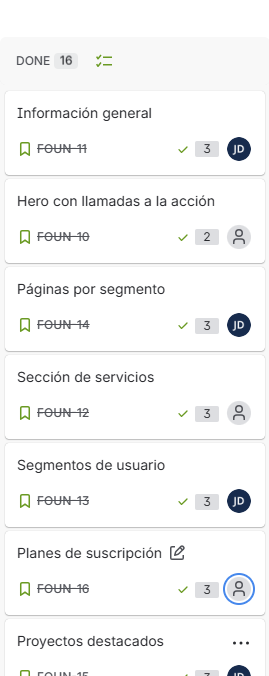
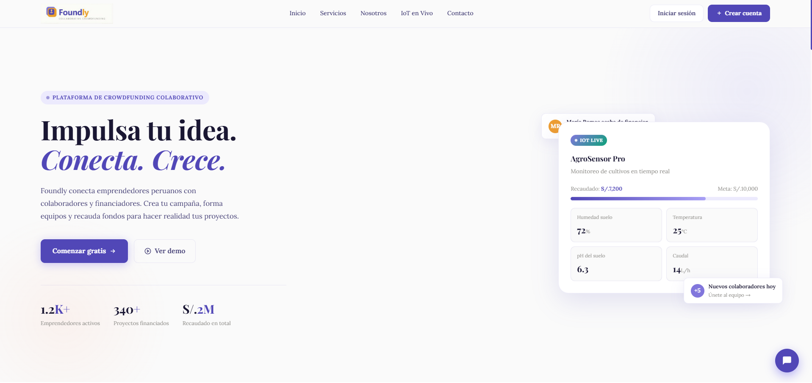
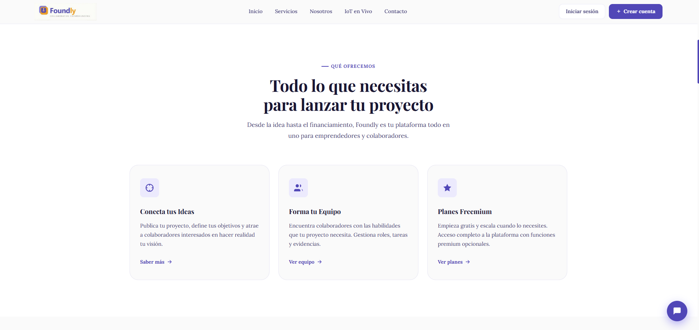
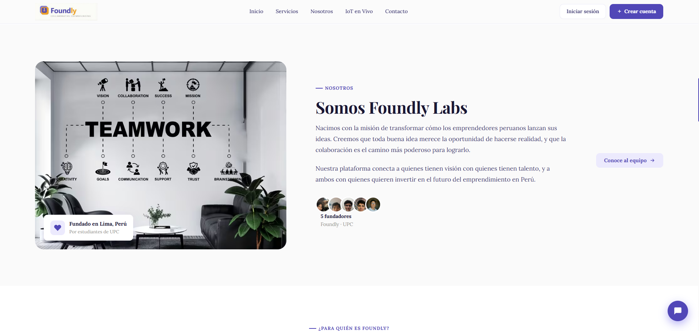
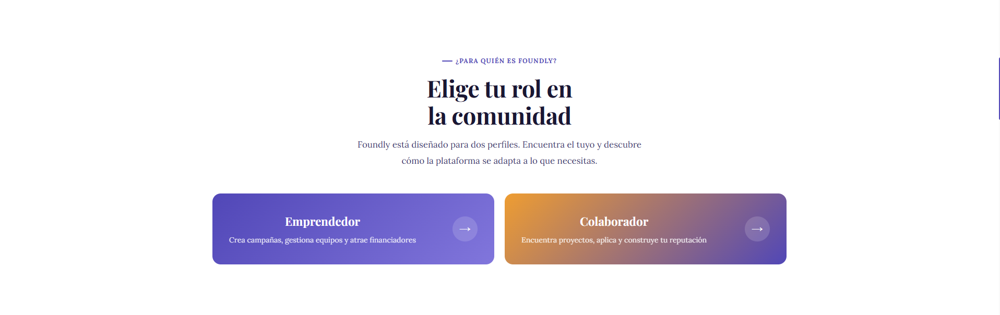
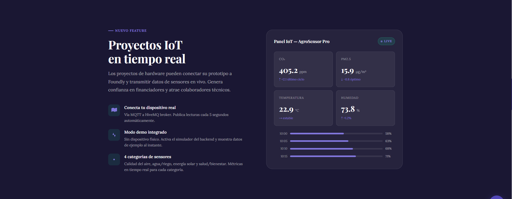
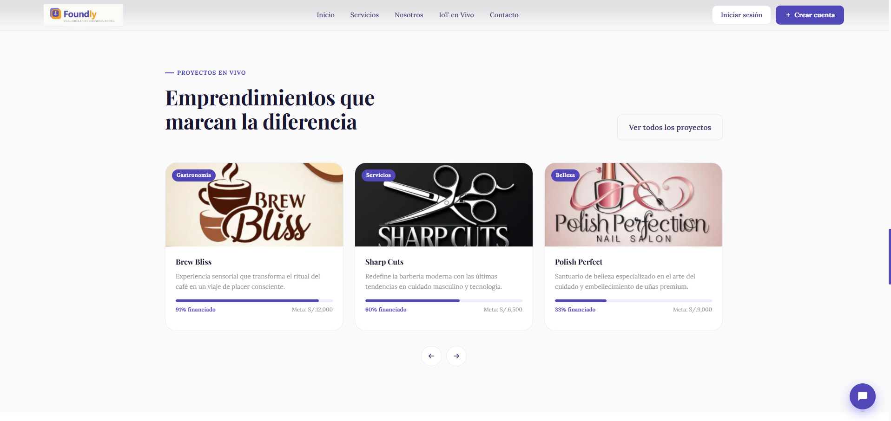
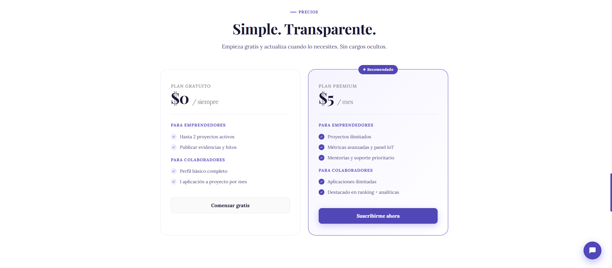
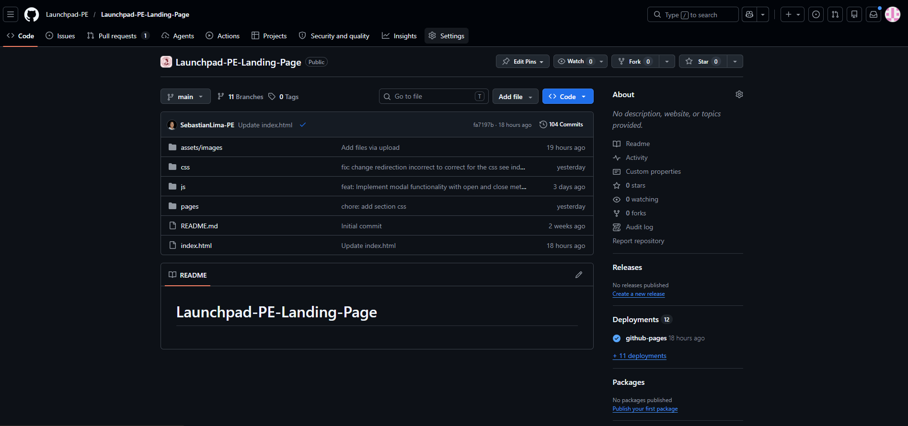
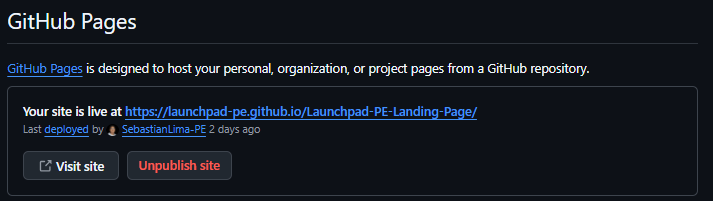

# Capítulo V: Product Implementation, Validation & Deployment
## 5.1. Software Configuration Management
### 5.1.1. Software Development Environment Configuration
### 5.1.2. Source Code Management
### 5.1.3. Source Code Style Guide & Conventions
### 5.1.4. Software Deployment Configuration
## 5.2. Landing Page, Services & Applications Implementation
### 5.2.1. Sprint 1
En esta sección, documentaremos y explicaremos el progreso del Sprint 1 en términos de desarrollo del producto y colaboración del equipo. Abordaremos
varios aspectos clave, incluyendo la planificación del sprint, el backlog del sprint, la evidencia de desarrollo para la Revisión del Sprint. Además, se destacarán los aspectos relacionados con la documentación de servicios, la evidencia de despliegue de software y las perspectivas de colaboración del equipo durante el sprint. Este análisis detallado nos permitirá evaluar el progreso del proyecto y realizar ajustes necesarios para futuros sprints.

#### 5.2.1.1. Sprint Planning 1
En esta sección, nos sumergiremos en los detalles del Sprint Planning Meeting 1.

| **Sprint #** |                 **Sprint 1**              |
|--------------|-------------------------------------------|
|**Sprint Planning Background**                            |
| Date         | 06-04-2026                                |
| Time         | 2:00 PM                                   |
| Location     | Reunión virtual mediante Discord          |
| Prepared By  | Jose Diego Bautista Rivera                |
| Attendees    | Almandroz Carbajal Pierina, Baca Camargo Vitaly, Pariacchi Limahuaya Sebastian, Teran Zavala Mauricio                 |
| Sprint n-1 Review Summary | No aplica                    |
| Sprint n-1 Retrospective Summary | No aplica             |
| **Sprint Goal & User Stories**                           |
|**Sprint 1**  | El sprint tiene como objetivo publicar la landing page inicial de Foundly. Esta primera entrega se incluyen secciones principales: el hero con los botones de registro e inicio de sesión, los servicios con sus respectivos modales e integrantes, el modal de plan gratuito o premium, así como las páginas específicas para emprendedor y colaborador, También se implementó el carrusel de empresas, video introductorio, la sección de la app y un footer muy completo con contacto, redes sociales y documentación legal. Se añade además un asistente virtual y se asegura el diseño responsive tanto para móviles como escritorio. El criterio de aceptación es que todos los enlaces y modales funcionen correctamente, la navegación fluida y adaptable en diversos dispositivos y la página quede desplegada en el hosting.La métrica de éxito es lograr al menos 10 visitas únicas y 20 clics en los botones principales durante este sprint.                   |
| Sprint 1 Velocity   | 20 Story Points                    |
| Sum of Story Points | 43 Story Points                    |

#### 5.2.1.2. Aspect Leaders and Collaborators
En esta sección se incluye la elaboración de el artefacto Leadership-andCollaboration Matrix (LACX), el cual elegirenos quién es el líder y quiénes son los
colaboradores para este Sprint 1 

|Team Members (Last Name, First Name)|     GitHub Username     |   Landing Page   |
|------------------------------------|-------------------------|------------------|
| Almandroz Carbajal, Pierina Marysabel |    pierinaaa29       |        C         |
| Baca Camargo, Vitaly Arturo        |      Mr-Code-star       |        L         |
| Bautista Rivera, Jose Diego        |        Gogotes17        |        C         |
| Pariachi Limahuaya, Sebastian Ubaldo |   SebastianLima-PE    |        C         |
| Teran Zavala, Mauricio Alejandro   |         mau-tz          |        C         |

#### 5.2.1.3. Sprint Backlog 1
El Sprint Backlog es el artefacto que recoge el conjunto de User Stories seleccionadas para el Sprint y las descompone en tareas o work-items concretos que el
equipo de desarrollo debe realizar. A diferencia del Product Backlog, que contiene todas las funcionalidades priorizadas del producto, el Sprint Backlog se centra
únicamente en los elementos comprometidos para un Sprint específico.

En este caso, el Sprint Backlog 1 está orientado al desarrollo de la Landing Page de la plataforma Foundly, incluyendo la implementación del hero, secciones de
servicios, modales, páginas de rol, footer, asistente virtual y ajustes de responsividad.

Enlace: [Enlace Sprint 1](https://upc-team-tohi2bk.atlassian.net/jira/software/projects/FOUN/boards/67/backlog?epics=visible&selectedIssue=FOUN-14&atlOrigin=eyJpIjoiMzI4YjgzNDU5OWYyNDI1MWEwN2U0ZGRhMDliZGRhNjYiLCJwIjoiaiJ9) 

  

| User Story |  | Work-Item / Task |  |  |  |  |  |
|------------|--|------------------|--|--|--|--|--|
| Id | Title | Id | Title | Description | Estimation (Hours) | Assigned to | Status |
| US040 | Hero con llamadas a la acción | WI-01 | Implementar sección Hero | Crear la sección principal con título, descripción y botones de "Registrarse" e "Iniciar sesión", incluyendo redirecciones | 4 | Sebastian Pariachi | Done |
| US012 | Información general | WI-02 | Implementar sección información general | Crear sección con descripción de la plataforma, funcionalidades principales y propuesta de valor | 3 | Vitaly Baca | Done |
| US041 | Sección de servicios | WI-03 | Implementar sección de servicios | Mostrar los servicios de la plataforma con cards informativas y opción de expandir detalles | 4 | Jose Bautista | Done |
| US014 | Segmentos de usuario | WI-04 | Implementar sección de segmentos | Crear sección para emprendedor, colaborador e inversionista con navegación dinámica sin recarga | 5 | Jose Bautista / Mauricio Teran | Done |
| US044 | Páginas por segmento | WI-05 | Implementar páginas por segmento | Crear páginas independientes para emprendedor y colaborador con beneficios, pasos y FAQs | 6 | Jose Bautista / Mauricio Teran | Done |
| US013 | Proyectos destacados | WI-05 | Implementar sección de proyectos destacados | Mostrar lista de proyectos con título, descripción y estado; manejar caso sin datos | 5 | Vitaly Baca | Done |
| US043 | Planes de suscripción | WI-06 | Implementar sección de planes | Mostrar plan gratuito y premium con características y botón de acción | 4 | Vitaly Baca | Done |
| US046 | Video introductorio | WI-07 | Implementar sección de video | Integrar video embebido y manejo de error si no carga | 3 | Pierina Almandroz | Done |
| US042 | Equipo del proyecto | WI-08 | Implementar sección equipo | Mostrar perfiles con nombre, rol, foto y descripción | 4 | Pierina Almandroz | Done |
| US045 | Empresas asociadas | WI-09 | Implementar sección de empresas | Mostrar logos en carrusel navegable | 3 | Mauricio Teran | Done |
| US015 | Contacto | WI-10 | Implementar formulario de contacto | Crear formulario con validaciones y mensaje de confirmación | 5 | Sebastian Pariachi | Done |
| US047 | Acceso al prototipo | WI-11 | Implementar acceso a prototipo | Botón que abre el prototipo en nueva pestaña y manejo de error | 2 | Mauricio Teran | Done |
| US048 | Footer | WI-12 | Implementar footer | Agregar redes sociales, contacto y enlaces legales | 3 | Sebastian Pariachi | Done |
| US049 | Asistente virtual | WI-13 | Implementar asistente FAQ | Crear componente con preguntas frecuentes y respuestas predefinidas | 4 | Jose Bautista | Done |
| US050 | Responsividad | WI-14 | Adaptar diseño responsive | Ajustar toda la landing para móvil, tablet y desktop | 6 | Jose Bautista | Done |
| US055 | Sección IoT en vivo | WI-15 | Implementar demo IoT | Simular datos en tiempo real con sensores y mostrar panel dinámico | 6 | Jose Bautista | Done |

#### 5.2.1.4. Development Evidence for Sprint Review
A continuación presentaremos los commits realizados en el repositorio de nuestra Landing Page, todos estos commits se han hecho en la rama “main” durante
el desarrollo de nuestro Sprint 1.

| Repository | Branch | Commit Id | Commit Message | Commit Message Body | Committed On (Date) |
|------------|--------|-----------|----------------|---------------------|---------------------|
| Launchpad-PE-Landing-Page | main | 3393a90 | Initial commit | First commit of the repository | Apr 9, 2026 |
| Launchpad-PE-Landing-Page | main | d172b47 | chore: add html and css file | Initial HTML and CSS files for the project structure | Apr 14, 2026 |
| Launchpad-PE-Landing-Page | main | 5e32bd5 | chore: add Images like members team, Logo of the project and Projects | Added team member photos, project logo, and project images | Apr 14, 2026 |
| Launchpad-PE-Landing-Page | main | 32268ce | chore: add header with logo and the navigation with Inicio, Servicios, Nosotros, loT and Contactos | Adds the main navigation header with logo and nav links | Apr 14, 2026 |
| Launchpad-PE-Landing-Page | main | 44af72e | chore: add configuration in head title, description and put relationship with style.css | Sets up HTML head meta tags and links stylesheet | Apr 14, 2026 |
| Launchpad-PE-Landing-Page | main | 0bc3dcd | feat: add file css to defined colors variables | CSS file with global color custom properties/variables | Apr 14, 2026 |
| Launchpad-PE-Landing-Page | main | 97d8ae0 | feat: add main.css with import with type nomenclature and file locals css | Main CSS entry point with organized imports | Apr 14, 2026 |
| Launchpad-PE-Landing-Page | main | 553fbb3 | feat: add file css to responsive the page main | Responsive stylesheet for main page layout | Apr 14, 2026 |
| Launchpad-PE-Landing-Page | main | 1486461 | feat: add script with javascript main | Main JavaScript file for landing page interactions | Apr 14, 2026 |
| Launchpad-PE-Landing-Page | main | f5d15d5 | feat: add collaborator.html for collaborator page structure | Adds collaborator page | Apr 17, 2026 |
| Launchpad-PE-Landing-Page | main | 927cc2c | feat: add benefits section with detailed collaborator advantages in collaborator.html | Adds benefits section to collaborator page | Apr 17, 2026 |
| Launchpad-PE-Landing-Page | main | c565110 | feat: add steps section detailing collaboration process in collaborator.html | Adds steps section to collaborator page | Apr 17, 2026 |
| Launchpad-PE-Landing-Page | main | 20d6a30 | feat: add IoT section with real-time campaign data and metrics visualization | IoT section with real-time data and metrics | Apr 17, 2026 |
| Launchpad-PE-Landing-Page | main | 29cd613 | feat: add FAQ section with common questions and answers for collaborators | FAQ section with Q&A content for collaborators | Apr 17, 2026 |
| Launchpad-PE-Landing-Page | main | 9f56dd5 | feat: Add modal and drawer functionality with chat integration | Added modal and drawer components with chat integration | Apr 17, 2026 |
| Launchpad-PE-Landing-Page | main | c8defe8 | feat: Implement carousel functionality for project cards | Carousel component for displaying project cards | Apr 17, 2026 |
| Launchpad-PE-Landing-Page | main | 18f4c2b | feat: Add chatbot functionality with interactive responses | Chatbot with interactive responses | Apr 17, 2026 |
| Launchpad-PE-Landing-Page | main | f95b515 | feat(landing): add services section with idea, team and freemium plan cards | Services section with three feature cards | Apr 17, 2026 |
| Launchpad-PE-Landing-Page | main | d2a4392 | feat(landing): add floating chat assistant with FAQ quick-reply options | Floating chat assistant with quick-reply FAQ buttons | Apr 17, 2026 |
| Launchpad-PE-Landing-Page | main | 3c15d64 | feat: add index different sections | Added index for different sections | Apr 18, 2026 |
| Launchpad-PE-Landing-Page | main | 3a99cd6 | feat: add entrepreneur page skeleton | Initial HTML structure for entrepreneur page | Apr 18, 2026 |
| Launchpad-PE-Landing-Page | main | 5121ec4 | feat: add benefits section and card styles entrepreneur | Benefits section and card styles for entrepreneur page | Apr 18, 2026 |
| Launchpad-PE-Landing-Page | main | 1a0aaae | feat: add iot showcase section and styles | IoT showcase section with styles | Apr 18, 2026 |
| Launchpad-PE-Landing-Page | main | 7f8762d | feat: add responsive media queries to entrepreneur.css | Responsive media queries for entrepreneur page | Apr 18, 2026 |
| Launchpad-PE-Landing-Page | main | 831eef6 | feat: implement functional JavaScript scripts | Implemented functional JavaScript for interactive elements | Apr 18, 2026 |
| Launchpad-PE-Landing-Page | main | 570d160 | chore: add components to index.html like navbar, hero, section and footer | Added components to index.html | Apr 18, 2026 |
| Launchpad-PE-Landing-Page | main | a991a79 | feat: add modal styles for enhanced user interaction and layout | Modal CSS styles for improved user experience | Apr 18, 2026 |
| Launchpad-PE-Landing-Page | main | 0b40867 | feat: add styles for services section to enhance layout and user interaction | Services section styles for improved layout and user interaction | Apr 19, 2026 |
| Launchpad-PE-Landing-Page | main | b40cebe | feat: add styles for App and Roles sections to enhance layout and user interaction | App and Roles section styles for improved layout and user interaction | Apr 19, 2026 |
| Launchpad-PE-Landing-Page | main | ac369b5 | feat: Implement styles components css | Styles for various components | Apr 19, 2026 |

#### 5.2.1.5. Execution Evidence for Sprint Review
Lo que se logró en el Sprint 1 es desplegar una primera versión de la landing page. En esta logramos desarrollar la barra navegadora, las secciones establecidas
de la Landing Page y el formulario de contacto. También se adoptó exitosamente la metodología GitFlow, trabajando en la branch principal “main”.

#### 5.2.1.6. Services Documentation Evidence for Sprint Review
Durante el desarrollo del Sprint 1, logramos avances significativos en la creación y configuración del repositorio del proyecto destinado a la Landing Page. Contar con esta base desde el inicio facilitó la organización del trabajo y la estructuración de las ideas del equipo.

En la siguiente etapa, optamos por aprovechar las herramientas colaborativas de GitHub, lo que permitió mejorar la coordinación entre los integrantes. Gracias a esto, se consiguió una implementación fluida y ordenada. Asimismo, al brindar acceso al repositorio a todo el equipo y centralizar el trabajo en la rama principal, los commits se realizaron de manera rápida y sin inconvenientes, permitiendo que cada miembro pudiera visualizar los cambios y el progreso de forma constante.

#### 5.2.1.7. Software Deployment Evidence for Sprint Review
A continuación, detallaremos los procesos realizados a lo largo del Sprint 1: Lo primero que realizamos fue crear dos repositorios en GitHub, uno para nuestro
Landing Page.

Finalmente configuramos GitHub Pages para obtener un enlace directo a la Landing Page, facilitando la revisión continua de los cambios realizados.
Link: https://launchpad-pe.github.io/Launchpad-PE-Landing-Page/ 

#### 5.2.1.8. Team Collaboration Insights during Sprint