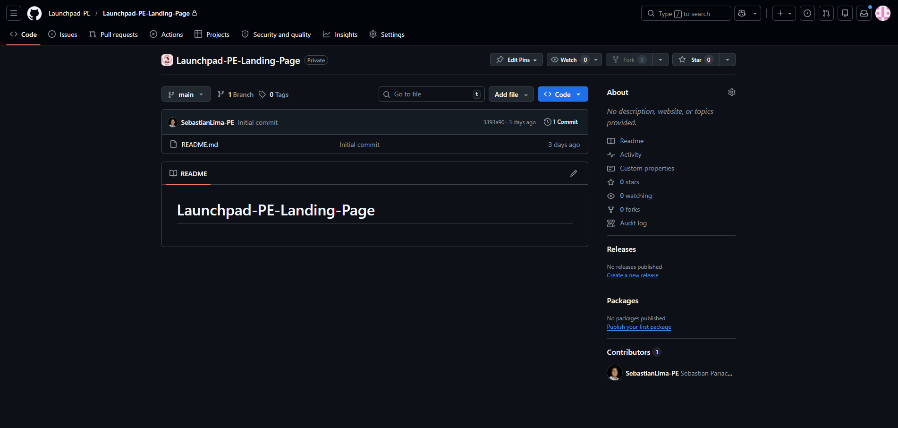

# Capítulo V: Product Implementation, Validation & Deployment
A continuación, se presentará un repositorio central y organizado que servirá como guía para el desarrollo enfocado y consistente de nuestra solución.
## 5.1. Software Configuration Management
A continuación, se presentará un repositorio central y organizado que servirá como guía para el desarrollo enfocado y consistente de nuestra solución.
### 5.1.1. Software Development Environment Configuration
En esta sección se incluye los links de las aplicaciones, productos de software realizadas durante el ciclo del proyecto en los programas que se utilizaron.

* **Product UX/UI Design** Este aspecto se enfoca en el diseño de la experiencia del usuario (UX) y la interfaz de usuario (UI) del producto de software. UX se centra en comprender y mejorar la experiencia general del usuario al interactuar con el software, mientras que UI se refiere al diseño visual y la usabilidad de la interfaz de usuario. El diseño UX/UI busca crear una experiencia intuitiva, atractiva y eficiente para los usuarios. En este caso realizar un modelo de sitio web para computadoras y celulares.

```
  - Figma: Es una herramienta de prototipo web y editor de gráficos vectorial, que, a diferencia de las otras herramientas, se aloja en la web, permitiendo establecer los modelos para versión en Web Browser y Mobile Browser.
```
https://www.figma.com/design/
```
- UXPressia: Es una herramienta en línea para el mapeo de la trayectoria del cliente que crea mapas de impacto y personas. Sus herramientas nos permitieron establecer las bases del modelado de User Persona, Empathy Map y Journey Map.
```
https://uxpressia.com/
```
- MIRO: Es una pizarra digital colaborativa en línea, que puede ser usada para la investigación, la ideación, mapas mentales, as-is, to-be y una variedad de otras actividades colaborativas.
```
https://miro.com/app/dashboard/
```
- Lucid Chart: Es una herramienta de diagramación basada en la web, que permite a los usuarios colaborar y trabajar juntos en tiempo real, creando diseños UML, mapas mentales, prototipos de software y muchos otros tipos de diagrama.
```
https://lucid.app/documents#/dashboard
```
- Structurizr: Es una herramienta de diseño que soporta el modelo C4, para visualizar la arquitectura de software de nuestra solución.
```
https://structurizr.com/

- **Software Development** Es el proceso de crear, diseñar, programar, probar y mantener el software. Incluye la implementación de los requisitos definidos en el proceso de desarrollo de software, utilizando diferentes lenguajes de programación, herramientas y tecnologías. El objetivo es construir un producto de software funcional y de alta calidad que cumpla con los requisitos y expectativas del cliente.
```
- GitHub: Es un repositorio comunitario cuya función es almacenar los avances de un proyecto elaborado por un grupo de personas.
```
https://github.com/Launchpad-PE
```
- Visual Studio Code: Es un editor potente que brinda extensiones que nos permiten personalizar y agregar funcionalidades para que la función del desarrollador sea más eficiente.
```
https://code.visualstudio.com/
```
- HTML: Es el lenguaje estándar para crear y diseñar sitios web. Utiliza etiquetas para estructurar el contenido, como texto, imágenes y enlaces. Junto con CSS y JavaScript, HTML forma la base de la web moderna. Este lenguaje será utilizado en el presente proyecto para implementar la documentación de la página web.
```
https://www.jetbrains.com/help/webstorm/editing-html-files.html
```
- CSS: Es un lenguaje de estilo utilizado para controlar el diseño y la presentación de páginas web. Permite establecer colores, fuentes, márgenes y otros aspectos visuales para mejorar la apariencia de un sitio web. Este lenguaje se utilizará para la implementación del diseño de nuestra plataforma web.
```
https://www.jetbrains.com/help/webstorm/style-sheets.html#ws_css_completion
```
- JavaScript: Es un lenguaje de programación de alto nivel que se utiliza principalmente para agregar interactividad y dinamismo a los sitios web. Permite realizar acciones como validar formularios, animar elementos y actualizar contenido sin recargar la página. Se utilizará para la elaboración de las dinámicas de la plataforma web.
```
https://www.jetbrains.com/help/webstorm/javascript-specific-guidelines.html
```
- Java: Es un lenguaje de programación de propósito general, orientado a objetos y concurrente. Es ampliamente utilizado para el desarrollo de aplicaciones empresariales, móviles y web debido a su robustez, seguridad y portabilidad, permitiendo que el código se ejecute en cualquier plataforma que soporte una Máquina Virtual de Java (JVM).
```
https://dev.java/
```
- Angular: Es un framework y plataforma de desarrollo de código abierto basado en TypeScript, creado por Google. Está diseñado para facilitar la creación de aplicaciones web de una sola página (SPA) robustas y escalables, ofreciendo una estructura clara basada en componentes y una amplia gama de herramientas integradas.
```
https://angular.dev/

- **Software Deployment** Es el proceso de implementar y poner en funcionamiento el software en un entorno de producción o en los dispositivos de los usuarios finales. Incluye actividades como la instalación, configuración, migración de datos y puesta en marcha del software. El objetivo es garantizar una implementación exitosa y sin problemas del software en el entorno de producción.
```
- GitHub Pages: Servicio de Github que nos permitió alojar nuestra Landing page y nos permitirá alojar nuestro web applications.
```
https://pages.github.com/

- **Software Documentation** Se refiere a la creación y mantenimiento de documentos que describen el software, incluyendo su arquitectura, diseño, funcionamiento, instalación, configuración, uso y mantenimiento. La documentación proporciona información útil y detallada sobre el software para desarrolladores, usuarios finales, administradores de sistemas y otras partes interesadas.
```
- Markdown: Es un lenguaje de marcado ligero que permite escribir texto con un formato fácil de leer y escribir, que luego puede ser convertido a HTML u otros formatos de presentación. Es ampliamente utilizado para documentar proyectos de software debido a su simplicidad y versatilidad. Markdown permite agregar formato básico como encabezados, listas, enlaces e imágenes utilizando una sintaxis sencilla y fácil de recordar.
```
https://www.markdownguide.org/getting-started/
### 5.1.2. Source Code Management
Para administrar el progreso del código, optamos por una estrategia más simple en lugar de implementar todo el flujo de Git Flow. En nuestro caso, trabajamos
directamente con una sola rama principal (main), la cual contiene la versión estable y a la vez en desarrollo de nuestro proyecto.
De esta manera, todas las nuevas funcionalidades y correcciones fueron integradas directamente en la rama main, sin necesidad de crear ramas adicionales para
desarrollo o características específicas. Aunque este enfoque es menos modular que Git Flow, resultó práctico para el alcance actual del proyecto, ya que
permitió un control más directo del avance y evitó la sobrecarga de gestionar múltiples ramas.
Además, utilizamos GitHub como repositorio central, aprovechando su función GitHub Pages para la visualización de nuestro trabajo. Esto nos permitió
desplegar los archivos .html y obtener un enlace web funcional de manera rápida y sencilla.
En resumen, trabajar únicamente con la rama main nos permitió avanzar con agilidad en el desarrollo de la página de destino y mantener una versión estable y
actualizada del proyecto sin complicaciones adicionales en la gestión de ramas.

Enlace de la Landing Page en GitHub Pages: https://github.com/Launchpad-PE/Launchpad-PE-Landing-Page


Repositorio Github de la Landing Page: https://github.com/Launchpad-PE/Launchpad-PE-Landing-Page

### 5.1.3. Source Code Style Guide & Conventions
En esta sección, estableceremos las convenciones y reglas para el estilo del código y convenciones de programación que usaremos para la creación de nuestra
aplicación web. Aplicamos estas prácticas con el fin de garantizar la coherencia, legibilidad y calidad del código durante el desarrollo de la aplicación. Como
consecuencia, facilitaran el mantenimiento y la escalabilidad a lo largo del ciclo de vida del proyecto.
En este proyecto, se emplearan HTML, CSS y JavaScript para desarrollar la aplicación web, por el otro lado, utilizaremos Gherkin para los casos de prueba del
proyecto. Como se detalla a continuación, se presentarán y explicarna las reglas y convenciones utilizadas para todos los lenguajes mencionados.

**Uso de minúsculas y nomenclatura en inglés**

Los nombres asignados a las variables, objetos, funciones y elementos se definiran en idioma inglés, procurando que tengan relación con el propósito o función
que cumplen. Se evitara el uso de mayúsculas junto a minúsculas, ya que la mezcla de mayúsculas con minúsculas puede disminuir la claridad del código, tal
como recomienda Google. Por ello, se priorizará el uso de minúsculas de manera uniforme, con el fin de mantener la legibilidad y consistencia del código.

Ejemplo:
```
.clr {
} /*Mala practica, el nombre es ambiguo*/
.text-color {
} /*Buena practica, el nombre de esta clase nos dice que representa al color del texto*/
```
**Sangría y identación**

La identación ayuda a delimitar visualmente bloques y estructuras en el código del programa. La sangría permite que el código sea mas fácil de entender y
mantener, ya que ayuda con la identificación y relación entre bloques de código.
Google recomienda utilizar dos bloques de espacio para la sangría en lugar de la tecla de tabulación. Esta convención se aplicará en el proyecto para mantener
la legibilidad y un estilo uniforme.

Ejemplo:

**EN HTML**
```
<ul>
<li>Chorrillos</li>
<li>Miraflores</li>
<li>Barranco</li>
</ul>
```
**EN CSS**
```
body {
background: #fff;
color: #404;
}
```
**EN JavaScript**
```
function sum(num_a, num_b) {
return num_a + num_b;
}
```
Seguidamente, se presentarán y detallarán las reglas especificas para cada lenguaje que utilizaremos:

**HTML**

Utilizaremos HTML5 para nuestro proyecto, siendo el estandar mas reciente de HTML que ofrece todas las funcionalidades necesarias para desarrollar una página web. A continuación, mostraremos las características y pautas que seguiremos para el desarrollo:
- **Document Type**

Para nuestro proyecto, empleamos la declaración del tipo documento (DOCTYPE) específica para HTML5, que se define como `<!DOCTYPE html>`. Esta declaración sigue las mejores prácticas recomendadas por Google.
- **Semantics**

Se utilizarán las etiquetas semánticas correctas de HTML5 cuando sean necesarias. Google recomienda utilizar las etiquetas semánticas adecuadas en lugar de depender solo de etiquetas generales, asi logrando una mayor legibilidad en el código.

Ejemplo:
```
<!-- Cuando queremos realizar una cabezera en HTML -->
<div>Mi Blog</div>
<!--Uso incorrecto porque existe una mejor etiqueta semántica para la cabezera.-->
<header>Mi Blog</header>
<!--Uso correcto al utilizar la etiqueta semántica adecuada.-->
```
- **Blank Lines**

W3School recomienda agregar lineas en blanco para la separación de grandes bloques de código. Esto permite una mejor visualización del código en secciones más manejables, facilitando la visualización de la estructura del código en el programa.

Ejemplo:
```
<body>
  <h1>Ciudades Famosas</h1>

  <h2>Lima</h2>
    <p>
      Lima es la capital del Perú, ubicada en la costa central del país, y es su ciudad más poblada.
   </p>
  <h2>Buenos Aires</h2>
    <p>
      Buenos Aires es la capital de Argentina, reconocida por su arquitectura y su intensa vida cultural.
    </p>
  <h2>Madrid</h2>
    <p>
      Madrid es la capital de España, conocida por su historia, gastronomía y vida nocturna.
    </p>
</body> 
```
- **HTML Quotation Marks**

Como recomienda Google, para citar los valores de atributos en HTML, se deben utilizar comillas dobles ("") en lugar de comillas simples (''). Esto permite una
mejor consistencia en el uso de las comillas en HTML.

Ejemplo:
```
<!-- No recomendado -->


<!-- Recomendado -->

```
- **Multimedia Fallback**

Google recomienda proporcionar contenido alternativo a elementos multimedia como imagenes, videos o audio. La adición de contenido alternativo a estos
elementos permite una mejor accesibilidad y rendimiento en la página web.

Ejemplo:
```
<!-- Ejemplo correcto de contenido alternativo -->

```
**CSS**

Utilizaremos CSS3 para nuestro proyecto, siendo el estandar mas reciente de CSS que ofrece todas las funcionalidades necesarias para agregar estilos a una
página web. A continuación, mostraremos las características y pautas que seguiremos para el desarrollo:
- **Property Name Stops**

Para mantener la consistencia en el código CSS, se sugiere colocar un espacio después de los dos puntos que acompañan al nombre de la propiedad. Asimismo,
es recomendable mantener únicamente un espacio entre la propiedad y el valor que se le asigna, siguiendo las recomendaciones de Google.

Ejemplo:
```
/* No recomendado */
p {
  color: blue;
}

/* Recomendado */
p {
  color: blue;
}
```
- **Declaration Stops**

Siguiendo las recomendaciones de Google, se debe utilizar un punto y coma al final de cada declaración de propiedad en CSS. Esto mantiene la consistencia y evita errores de interpretación de código.

Ejemplo:
```
/* Incorrecto */
p {
  color: blue   /* Falta ; aquí */
  font-size: 16px;
}

/* Correcto */
p {
  color: blue;
  font-size: 16px;
}
```
- **CSS Quotation Marks**

Google recomienda utilizar comillas simples ('') en vez de comillas dobles ("") para selectores de atributos y valores de propiedades. Además, no se debe utilizar
comillas para URLs en CSS. Para la regla "css @charset", se debe utilizar obligatoriamente comillas dobles ("").

Ejemplo:
```
/* No recomendado */
@import url("https://www.google.com/css/maia.css"); /* Usa comillas dobles en un URL */

html {
  font-family: "open sans", arial, sans-serif; /* Usa comillas dobles en valores de propiedades */
}

/* Recomendado */
@import url("https://www.google.com/css/maia.css"); /* No usa comillas */

html {
  font-family: "open sans", arial, sans-serif; /* Usa comillas simples */
}
```
- **Declaration Block Separation**

Según recomendaciones de Google, debe haber un espacio entre el bloque de separación y el selector. Además, no deben haber saltos de linea entre el selector
y el bloque de separación. Estas pautas permiten un mayor orden al declarar estilos y los bloques de separación.

Ejemplo:
```
/* No recomendado: Falta de espacio */
.video {
  margin-top: 1em;
}

/* No recomendado: Salto de linea innecesario */
.video {
  margin-top: 1em;
}

/* Recomendado */
.video {
  margin-top: 1em;
}
```
**JavaScript**

Utilizaremos el lenguaje de programación JavaScript, un lenguage fundamental para el desarrollo web, en nuestro proyecto. Se utiliza para agregar
interactividad y lógica en la página web.A continuación, mostraremos las características y pautas que seguiremos para el desarrollo:
- **Spaces Around Operations**

W3Schools recomienda colocar espacios alreredor de operadores (+,-,*,/,=) y después de las comas al escribir código en JavaScript. Esto ayuda a la legibilidad y
organización del código, facilitando el mantenimiento y comprensión del mismo.

Ejemplo:
```
let a = b + c;
const Distritos = ["Chorrillos", "Miraflores", "Breña"];
```
- **End of Simple Declaration**

Según W3Schools, se recomienda terminar cada declaración de código simple con un punto y coma al escribir código en JavaScript. Incluye la declaración de variables, de objetos y asignaciones.

Ejemplo:
```
const nombres = ["Diego", "Mauricio", "Pierina", "Vitaly", "Sebastian"];
```
- **General Rules for Complex Statements**

Según W3Schools, las declaraciones complejas deben seguir el siguiente orden:
Colocar la llave de apertura al final de la primera linea. Utilizar un espacio antes de la llave de apertura. Colocar la llave de cierre en una nueva línea, sin espacios
previos. No terminar una declaración compleja con un punto y coma.

Ejemplo:
```
for (let i = 0; i < 5; i++) {
  x += i;
}
```
**Gherkin**

Gherkin es un lenguaje específico de dominio (DSL), diseñado para resolver problemas específicos, permitiendo la comunicación entre el perfil de negocio y
perfiles técnicos. Este lenguaje es utilizado para crear escenarios de prueba en texto plano, utilizando una sintaxis sencilla y legible.

Las pautas que se tendran en cuenta son las siguientes:
- **Discernible Given-When-Then Blocks**

Keiblinger sugiere que, para facilitar la comprensión de los escenarios en Gherkin, se recomienda utilizar la palabra "And" despues de un "Given", "When" o
"Then" para indicar un paso adicional en el bloque. Esto permite la identificación del inicio y fin de cada bloque, mejorando la organización de la escritura.

Ejemplo:
```
Scenario: Usuario inicia sesión con credenciales válidas
Given que el usuario está en la página de login
And ha ingresado un correo válido
And ha ingresado una contraseña válida
When presiona el botón "Iniciar sesión"
Then debería ser redirigido al panel principal
And debería ver un mensaje de bienvenida
```
- **Steps with Tables**
Segun las sugerencias de Keiblinger, debemos de utilizar los dos puntos después de un paso que requiere utilizar una tabla como referencia. Los dos puntos sirven para indicar que el paso necesita de una tabla, mejorando la organización de la escritura.

Ejemplo:
```
Scenario: Ver productos en el carrito
Given que el carrito contiene los siguientes productos:
| producto     | cantidad |
| Laptop       | 1        |
| Smartphone   | 2        |
| Auriculares  | 3        |
```
- **Reducing Noise**
Sophie Keiblinger recomienda utilizar valores predeterminados en los campos donde el sistema lo requiere, pero no son relevantes para el escenario. Tiene el fin de mejorar la claridad del escenario, al eliminar valores innecesarios y cambiarlos por valores predeterminados.

Ejemplo:
```
Scenario: Login exitoso
Given que el usuario está en la página de login
And ha ingresado credenciales válidas
When presiona el botón "Iniciar sesión"
Then debería ver el panel principal
And debería ver un mensaje de bienvenida
```
- **Newlines between scenarios and separator comments**
Keiblinger menciona que, al tener varios escenarios en un mismo archivo Gherkin, es recomendable separar cada escenario con dos lineas en blanco entre cada escenario. Esto permite distinguir de manera clara cada escenario y sus bloques. Ademas, recomienda agregar un comentario separador para brindar una guia visible y facilitar la navegación.

Ejemplo:
```
#------- Escenario de login exitoso -------
Scenario: Usuario inicia sesión correctamente
Given que el usuario está en la página de login
When ingresa un correo y contraseña válidos
Then debería ver el panel principal
And debería ver un mensaje de bienvenida

#------- Escenario de login fallido -------
Scenario: Usuario intenta login con contraseña incorrecta
Given que el usuario está en la página de login
When ingresa un correo válido y una contraseña incorrecta
Then debería ver un mensaje de error "Credenciales incorrectas"
```

### 5.1.4. Software Deployment Configuration
## 5.2. Landing Page, Services & Applications Implementation
### 5.2.1. Sprint 1
#### 5.2.1.1. Sprint Planning 1
#### 5.2.1.2. Aspect Leaders and Collaborators
#### 5.2.1.3. Sprint Backlog 1
#### 5.2.1.4. Development Evidence for Sprint Review
#### 5.2.1.5. Execution Evidence for Sprint Review
#### 5.2.1.6. Services Documentation Evidence for Sprint Review
#### 5.2.1.7. Software Deployment Evidence for Sprint Review
#### 5.2.1.8. Team Collaboration Insights during Sprint
