# Capítulo V: Product Implementation, Validation & Deployment
A continuación, se presentará un repositorio central y organizado que servirá como guía para el desarrollo enfocado y consistente de nuestra solución.
## 5.1. Software Configuration Management
A continuación, se presentará un repositorio central y organizado que servirá como guía para el desarrollo enfocado y consistente de nuestra solución.
### 5.1.1. Software Development Environment Configuration
En esta sección se incluye los links de las aplicaciones, productos de software realizadas durante el ciclo del proyecto en los programas que se utilizaron.

* **Product UX/UI Design** Este aspecto se enfoca en el diseño de la experiencia del usuario (UX) y la interfaz de usuario (UI) del producto de software. UX se centra en comprender y mejorar la experiencia general del usuario al interactuar con el software, mientras que UI se refiere al diseño visual y la usabilidad de la interfaz de usuario. El diseño UX/UI busca crear una experiencia intuitiva, atractiva y eficiente para los usuarios. En este caso realizar un modelo de sitio web para computadoras y celulares.

```
  - Figma: Es una herramienta de prototipo web y editor de gráficos vectorial, que, a diferencia de las otras herramientas, se aloja en la web, permitiendo establecer los modelos para versión en Web Browser y Mobile Browser.
```
https://www.figma.com/design/
```
- UXPressia: Es una herramienta en línea para el mapeo de la trayectoria del cliente que crea mapas de impacto y personas. Sus herramientas nos permitieron establecer las bases del modelado de User Persona, Empathy Map y Journey Map.
```
https://uxpressia.com/
```
- MIRO: Es una pizarra digital colaborativa en línea, que puede ser usada para la investigación, la ideación, mapas mentales, as-is, to-be y una variedad de otras actividades colaborativas.
```
https://miro.com/app/dashboard/
```
- Lucid Chart: Es una herramienta de diagramación basada en la web, que permite a los usuarios colaborar y trabajar juntos en tiempo real, creando diseños UML, mapas mentales, prototipos de software y muchos otros tipos de diagrama.
```
https://lucid.app/documents#/dashboard
```
- Structurizr: Es una herramienta de diseño que soporta el modelo C4, para visualizar la arquitectura de software de nuestra solución.
```
https://structurizr.com/

- **Software Development** Es el proceso de crear, diseñar, programar, probar y mantener el software. Incluye la implementación de los requisitos definidos en el proceso de desarrollo de software, utilizando diferentes lenguajes de programación, herramientas y tecnologías. El objetivo es construir un producto de software funcional y de alta calidad que cumpla con los requisitos y expectativas del cliente.
```
- GitHub: Es un repositorio comunitario cuya función es almacenar los avances de un proyecto elaborado por un grupo de personas.
```
https://github.com/Launchpad-PE
```
- Visual Studio Code: Es un editor potente que brinda extensiones que nos permiten personalizar y agregar funcionalidades para que la función del desarrollador sea más eficiente.
```
https://code.visualstudio.com/
```
- HTML: Es el lenguaje estándar para crear y diseñar sitios web. Utiliza etiquetas para estructurar el contenido, como texto, imágenes y enlaces. Junto con CSS y JavaScript, HTML forma la base de la web moderna. Este lenguaje será utilizado en el presente proyecto para implementar la documentación de la página web.
```
https://www.jetbrains.com/help/webstorm/editing-html-files.html
```
- CSS: Es un lenguaje de estilo utilizado para controlar el diseño y la presentación de páginas web. Permite establecer colores, fuentes, márgenes y otros aspectos visuales para mejorar la apariencia de un sitio web. Este lenguaje se utilizará para la implementación del diseño de nuestra plataforma web.
```
https://www.jetbrains.com/help/webstorm/style-sheets.html#ws_css_completion
```
- JavaScript: Es un lenguaje de programación de alto nivel que se utiliza principalmente para agregar interactividad y dinamismo a los sitios web. Permite realizar acciones como validar formularios, animar elementos y actualizar contenido sin recargar la página. Se utilizará para la elaboración de las dinámicas de la plataforma web.
```
https://www.jetbrains.com/help/webstorm/javascript-specific-guidelines.html
```
- Java: Es un lenguaje de programación de propósito general, orientado a objetos y concurrente. Es ampliamente utilizado para el desarrollo de aplicaciones empresariales, móviles y web debido a su robustez, seguridad y portabilidad, permitiendo que el código se ejecute en cualquier plataforma que soporte una Máquina Virtual de Java (JVM).
```
https://dev.java/
```
- Angular: Es un framework y plataforma de desarrollo de código abierto basado en TypeScript, creado por Google. Está diseñado para facilitar la creación de aplicaciones web de una sola página (SPA) robustas y escalables, ofreciendo una estructura clara basada en componentes y una amplia gama de herramientas integradas.
```
https://angular.dev/

- **Software Deployment** Es el proceso de implementar y poner en funcionamiento el software en un entorno de producción o en los dispositivos de los usuarios finales. Incluye actividades como la instalación, configuración, migración de datos y puesta en marcha del software. El objetivo es garantizar una implementación exitosa y sin problemas del software en el entorno de producción.
```
- GitHub Pages: Servicio de Github que nos permitió alojar nuestra Landing page y nos permitirá alojar nuestro web applications.
```
https://pages.github.com/

- **Software Documentation** Se refiere a la creación y mantenimiento de documentos que describen el software, incluyendo su arquitectura, diseño, funcionamiento, instalación, configuración, uso y mantenimiento. La documentación proporciona información útil y detallada sobre el software para desarrolladores, usuarios finales, administradores de sistemas y otras partes interesadas.
```
- Markdown: Es un lenguaje de marcado ligero que permite escribir texto con un formato fácil de leer y escribir, que luego puede ser convertido a HTML u otros formatos de presentación. Es ampliamente utilizado para documentar proyectos de software debido a su simplicidad y versatilidad. Markdown permite agregar formato básico como encabezados, listas, enlaces e imágenes utilizando una sintaxis sencilla y fácil de recordar.
```
https://www.markdownguide.org/getting-started/

### 5.1.2. Source Code Management

Para administrar el progreso del código, el equipo optó por una estrategia simplificada en lugar de implementar el flujo completo de Git Flow. Se trabajó directamente con una sola rama principal (`main`), la cual contiene la versión estable y en desarrollo del proyecto.

Todas las nuevas funcionalidades y correcciones fueron integradas directamente en la rama `main`, sin necesidad de crear ramas adicionales para desarrollo o características específicas. Aunque este enfoque es menos modular que Git Flow, resultó práctico para el alcance actual del proyecto, ya que permitió un control más directo del avance y evitó la sobrecarga de gestionar múltiples ramas en paralelo.

Adicionalmente, se utilizó GitHub como repositorio central, aprovechando la funcionalidad de GitHub Pages para la visualización del trabajo desplegado. Esto permitió publicar los archivos `.html` y obtener un enlace web funcional de manera rápida y sencilla.

En resumen, trabajar únicamente con la rama `main` permitió avanzar con agilidad en el desarrollo del Landing Page y mantener una versión estable y actualizada del proyecto sin complejidad adicional en la gestión de ramas.

---

**Landing Page — GitHub Pages**

Enlace de despliegue: https://launchpad-pe.github.io/Launchpad-PE-Landing-Page/


**Landing Page — Repositorio GitHub**

Enlace del repositorio: https://github.com/Launchpad-PE/Launchpad-PE-Landing-Page


### 5.1.3. Source Code Style Guide & Conventions
En esta sección se establecen las convenciones y reglas de estilo de código que el equipo aplicará durante el desarrollo de la aplicación web de Foundly. Estas prácticas garantizan la coherencia, legibilidad y calidad del código a lo largo del ciclo de vida del proyecto, facilitando su mantenimiento y escalabilidad.

Los lenguajes empleados en el desarrollo son **HTML**, **CSS** y **JavaScript** para la aplicación web, y **Gherkin** para la especificación de los casos de prueba. A continuación se detallan las reglas y convenciones definidas para cada uno de ellos.

---

#### Nomenclatura en inglés y uso de minúsculas

Los nombres asignados a variables, objetos, funciones y elementos HTML se definirán en idioma inglés, procurando que reflejen con claridad el propósito o la función que cumplen dentro del sistema.

Se evitará la mezcla de mayúsculas y minúsculas en los identificadores, ya que reduce la legibilidad del código. En su lugar, se priorizará el uso uniforme de minúsculas, siguiendo las recomendaciones de la Guía de Estilo de Google. Esta convención aplica de forma consistente a todos los archivos y lenguajes del proyecto.

Ejemplo:
```
.clr {
} /*Mala practica, el nombre es ambiguo*/
.text-color {
} /*Buena practica, el nombre de esta clase nos dice que representa al color del texto*/
```
**Sangría y identación**

La identación ayuda a delimitar visualmente bloques y estructuras en el código del programa. La sangría permite que el código sea mas fácil de entender y
mantener, ya que ayuda con la identificación y relación entre bloques de código.
Google recomienda utilizar dos bloques de espacio para la sangría en lugar de la tecla de tabulación. Esta convención se aplicará en el proyecto para mantener
la legibilidad y un estilo uniforme.

Ejemplo:

**EN HTML**
```
<ul>
<li>Chorrillos</li>
<li>Miraflores</li>
<li>Barranco</li>
</ul>
```
**EN CSS**
```
body {
background: #fff;
color: #404;
}
```
**EN JavaScript**
```
function sum(num_a, num_b) {
return num_a + num_b;
}
```
Seguidamente, se presentarán y detallarán las reglas especificas para cada lenguaje que utilizaremos:

**HTML**

Utilizaremos HTML5 para nuestro proyecto, siendo el estandar mas reciente de HTML que ofrece todas las funcionalidades necesarias para desarrollar una página web. A continuación, mostraremos las características y pautas que seguiremos para el desarrollo:
- **Document Type**

Para nuestro proyecto, empleamos la declaración del tipo documento (DOCTYPE) específica para HTML5, que se define como `<!DOCTYPE html>`. Esta declaración sigue las mejores prácticas recomendadas por Google.
- **Semantics**

Se utilizarán las etiquetas semánticas correctas de HTML5 cuando sean necesarias. Google recomienda utilizar las etiquetas semánticas adecuadas en lugar de depender solo de etiquetas generales, asi logrando una mayor legibilidad en el código.

Ejemplo:
```
<!-- Cuando queremos realizar una cabezera en HTML -->
<div>Mi Blog</div>
<!--Uso incorrecto porque existe una mejor etiqueta semántica para la cabezera.-->
<header>Mi Blog</header>
<!--Uso correcto al utilizar la etiqueta semántica adecuada.-->
```
- **Blank Lines**

W3School recomienda agregar lineas en blanco para la separación de grandes bloques de código. Esto permite una mejor visualización del código en secciones más manejables, facilitando la visualización de la estructura del código en el programa.

Ejemplo:
```
<body>
  <h1>Ciudades Famosas</h1>

  <h2>Lima</h2>
    <p>
      Lima es la capital del Perú, ubicada en la costa central del país, y es su ciudad más poblada.
   </p>
  <h2>Buenos Aires</h2>
    <p>
      Buenos Aires es la capital de Argentina, reconocida por su arquitectura y su intensa vida cultural.
    </p>
  <h2>Madrid</h2>
    <p>
      Madrid es la capital de España, conocida por su historia, gastronomía y vida nocturna.
    </p>
</body> 
```
- **HTML Quotation Marks**

Como recomienda Google, para citar los valores de atributos en HTML, se deben utilizar comillas dobles ("") en lugar de comillas simples (''). Esto permite una
mejor consistencia en el uso de las comillas en HTML.

Ejemplo:
```
<!-- No recomendado -->


<!-- Recomendado -->

```
- **Multimedia Fallback**

Google recomienda proporcionar contenido alternativo a elementos multimedia como imagenes, videos o audio. La adición de contenido alternativo a estos
elementos permite una mejor accesibilidad y rendimiento en la página web.

Ejemplo:
```
<!-- Ejemplo correcto de contenido alternativo -->

```
**CSS**

Utilizaremos CSS3 para nuestro proyecto, siendo el estandar mas reciente de CSS que ofrece todas las funcionalidades necesarias para agregar estilos a una
página web. A continuación, mostraremos las características y pautas que seguiremos para el desarrollo:
- **Property Name Stops**

Para mantener la consistencia en el código CSS, se sugiere colocar un espacio después de los dos puntos que acompañan al nombre de la propiedad. Asimismo,
es recomendable mantener únicamente un espacio entre la propiedad y el valor que se le asigna, siguiendo las recomendaciones de Google.

Ejemplo:
```
/* No recomendado */
p {
  color: blue;
}

/* Recomendado */
p {
  color: blue;
}
```
- **Declaration Stops**

Siguiendo las recomendaciones de Google, se debe utilizar un punto y coma al final de cada declaración de propiedad en CSS. Esto mantiene la consistencia y evita errores de interpretación de código.

Ejemplo:
```
/* Incorrecto */
p {
  color: blue   /* Falta ; aquí */
  font-size: 16px;
}

/* Correcto */
p {
  color: blue;
  font-size: 16px;
}
```
- **CSS Quotation Marks**

Google recomienda utilizar comillas simples ('') en vez de comillas dobles ("") para selectores de atributos y valores de propiedades. Además, no se debe utilizar
comillas para URLs en CSS. Para la regla "css @charset", se debe utilizar obligatoriamente comillas dobles ("").

Ejemplo:
```
/* No recomendado */
@import url("https://www.google.com/css/maia.css"); /* Usa comillas dobles en un URL */

html {
  font-family: "open sans", arial, sans-serif; /* Usa comillas dobles en valores de propiedades */
}

/* Recomendado */
@import url("https://www.google.com/css/maia.css"); /* No usa comillas */

html {
  font-family: "open sans", arial, sans-serif; /* Usa comillas simples */
}
```
- **Declaration Block Separation**

Según recomendaciones de Google, debe haber un espacio entre el bloque de separación y el selector. Además, no deben haber saltos de linea entre el selector
y el bloque de separación. Estas pautas permiten un mayor orden al declarar estilos y los bloques de separación.

Ejemplo:
```
/* No recomendado: Falta de espacio */
.video {
  margin-top: 1em;
}

/* No recomendado: Salto de linea innecesario */
.video {
  margin-top: 1em;
}

/* Recomendado */
.video {
  margin-top: 1em;
}
```
**JavaScript**

Utilizaremos el lenguaje de programación JavaScript, un lenguage fundamental para el desarrollo web, en nuestro proyecto. Se utiliza para agregar
interactividad y lógica en la página web.A continuación, mostraremos las características y pautas que seguiremos para el desarrollo:
- **Spaces Around Operations**

W3Schools recomienda colocar espacios alreredor de operadores (+,-,*,/,=) y después de las comas al escribir código en JavaScript. Esto ayuda a la legibilidad y
organización del código, facilitando el mantenimiento y comprensión del mismo.

Ejemplo:
```
let a = b + c;
const Distritos = ["Chorrillos", "Miraflores", "Breña"];
```
- **End of Simple Declaration**

Según W3Schools, se recomienda terminar cada declaración de código simple con un punto y coma al escribir código en JavaScript. Incluye la declaración de variables, de objetos y asignaciones.

Ejemplo:
```
const nombres = ["Diego", "Mauricio", "Pierina", "Vitaly", "Sebastian"];
```
- **General Rules for Complex Statements**

Según W3Schools, las declaraciones complejas deben seguir el siguiente orden:
Colocar la llave de apertura al final de la primera linea. Utilizar un espacio antes de la llave de apertura. Colocar la llave de cierre en una nueva línea, sin espacios
previos. No terminar una declaración compleja con un punto y coma.

Ejemplo:
```
for (let i = 0; i < 5; i++) {
  x += i;
}
```
**Gherkin**

Gherkin es un lenguaje específico de dominio (DSL), diseñado para resolver problemas específicos, permitiendo la comunicación entre el perfil de negocio y
perfiles técnicos. Este lenguaje es utilizado para crear escenarios de prueba en texto plano, utilizando una sintaxis sencilla y legible.

Las pautas que se tendran en cuenta son las siguientes:
- **Discernible Given-When-Then Blocks**

Keiblinger sugiere que, para facilitar la comprensión de los escenarios en Gherkin, se recomienda utilizar la palabra "And" despues de un "Given", "When" o
"Then" para indicar un paso adicional en el bloque. Esto permite la identificación del inicio y fin de cada bloque, mejorando la organización de la escritura.

Ejemplo:
```
Scenario: Usuario inicia sesión con credenciales válidas
Given que el usuario está en la página de login
And ha ingresado un correo válido
And ha ingresado una contraseña válida
When presiona el botón "Iniciar sesión"
Then debería ser redirigido al panel principal
And debería ver un mensaje de bienvenida
```
- **Steps with Tables**
Segun las sugerencias de Keiblinger, debemos de utilizar los dos puntos después de un paso que requiere utilizar una tabla como referencia. Los dos puntos sirven para indicar que el paso necesita de una tabla, mejorando la organización de la escritura.

Ejemplo:
```
Scenario: Ver productos en el carrito
Given que el carrito contiene los siguientes productos:
| producto     | cantidad |
| Laptop       | 1        |
| Smartphone   | 2        |
| Auriculares  | 3        |
```
- **Reducing Noise**
Sophie Keiblinger recomienda utilizar valores predeterminados en los campos donde el sistema lo requiere, pero no son relevantes para el escenario. Tiene el fin de mejorar la claridad del escenario, al eliminar valores innecesarios y cambiarlos por valores predeterminados.

Ejemplo:
```
Scenario: Login exitoso
Given que el usuario está en la página de login
And ha ingresado credenciales válidas
When presiona el botón "Iniciar sesión"
Then debería ver el panel principal
And debería ver un mensaje de bienvenida
```
- **Newlines between scenarios and separator comments**
Keiblinger menciona que, al tener varios escenarios en un mismo archivo Gherkin, es recomendable separar cada escenario con dos lineas en blanco entre cada escenario. Esto permite distinguir de manera clara cada escenario y sus bloques. Ademas, recomienda agregar un comentario separador para brindar una guia visible y facilitar la navegación.

Ejemplo:
```
#------- Escenario de login exitoso -------
Scenario: Usuario inicia sesión correctamente
Given que el usuario está en la página de login
When ingresa un correo y contraseña válidos
Then debería ver el panel principal
And debería ver un mensaje de bienvenida

#------- Escenario de login fallido -------
Scenario: Usuario intenta login con contraseña incorrecta
Given que el usuario está en la página de login
When ingresa un correo válido y una contraseña incorrecta
Then debería ver un mensaje de error "Credenciales incorrectas"
```

### 5.1.4. Software Deployment Configuration

Para desplegar nuestro landing page hemos optado por usar Github Pages el cual brinda la posibilidad de alojar sitios web estáticos sin costo alguno.

1. Ingresamos al repositorio de nuestra landing page


2. Ingresamos al repositorio de nuestra landing page

 

3. Ingresamos a la sección de "Settings" del repositorio


4. En la sección de "Pages", seleccionamos la rama "main" y la carpeta raíz (root) para desplegar nuestro sitio web.


## 5.2. Landing Page, Services & Applications Implementation
### 5.2.1. Sprint 1
En esta sección, documentaremos y explicaremos el progreso del Sprint 1 en términos de desarrollo del producto y colaboración del equipo. Abordaremos
varios aspectos clave, incluyendo la planificación del sprint, el backlog del sprint, la evidencia de desarrollo para la Revisión del Sprint. Además, se destacarán los aspectos relacionados con la documentación de servicios, la evidencia de despliegue de software y las perspectivas de colaboración del equipo durante el sprint. Este análisis detallado nos permitirá evaluar el progreso del proyecto y realizar ajustes necesarios para futuros sprints.

#### 5.2.1.1. Sprint Planning 1
En esta sección, nos sumergiremos en los detalles del Sprint Planning Meeting 1.


| **Sprint #** |                 **Sprint 1**              |
|--------------|-------------------------------------------|
|**Sprint Planning Background**                            |
| Date         | 06-04-2026                                |
| Time         | 2:00 PM                                   |
| Location     | Reunión virtual mediante Discord          |
| Prepared By  | Jose Diego Bautista Rivera                |
| Attendees    | Almandroz Carbajal Pierina, Baca Camargo Vitaly, Pariacchi Limahuaya Sebastian, Teran Zavala Mauricio                 |
| Sprint n-1 Review Summary | No aplica                    |
| Sprint n-1 Retrospective Summary | No aplica             |
| **Sprint Goal & User Stories**                           |
|**Sprint 1**  | El sprint tiene como objetivo publicar la landing page inicial de Foundly. Esta primera entrega se incluyen secciones principales: el hero con los botones de registro e inicio de sesión, los servicios con sus respectivos modales e integrantes, el modal de plan gratuito o premium, así como las páginas específicas para emprendedor y colaborador, También se implementó el carrusel de empresas, video introductorio, la sección de la app y un footer muy completo con contacto, redes sociales y documentación legal. Se añade además un asistente virtual y se asegura el diseño responsive tanto para móviles como escritorio. El criterio de aceptación es que todos los enlaces y modales funcionen correctamente, la navegación fluida y adaptable en diversos dispositivos y la página quede desplegada en el hosting.La métrica de éxito es lograr al menos 10 visitas únicas y 20 clics en los botones principales durante este sprint.                   |
| Sprint 1 Velocity   | 20 Story Points                    |
| Sum of Story Points | 43 Story Points                    |


#### 5.2.1.2. Aspect Leaders and Collaborators
En esta sección se incluye la elaboración de el artefacto Leadership-andCollaboration Matrix (LACX), el cual elegirenos quién es el líder y quiénes son los
colaboradores para este Sprint 1 

|Team Members (Last Name, First Name)|     GitHub Username     |   Landing Page   |
|------------------------------------|-------------------------|------------------|
| Almandroz Carbajal, Pierina Marysabel |    pierinaaa29       |        C         |
| Baca Camargo, Vitaly Arturo        |      Mr-Code-star       |        L         |
| Bautista Rivera, Jose Diego        |        Gogotes17        |        C         |
| Pariachi Limahuaya, Sebastian Ubaldo |   SebastianLima-PE    |        C         |
| Teran Zavala, Mauricio Alejandro   |         mau-tz          |        C         |

#### 5.2.1.3. Sprint Backlog 1
El Sprint Backlog es el artefacto que recoge el conjunto de User Stories seleccionadas para el Sprint y las descompone en tareas o work-items concretos que el
equipo de desarrollo debe realizar. A diferencia del Product Backlog, que contiene todas las funcionalidades priorizadas del producto, el Sprint Backlog se centra
únicamente en los elementos comprometidos para un Sprint específico.

En este caso, el Sprint Backlog 1 está orientado al desarrollo de la Landing Page de la plataforma Foundly, incluyendo la implementación del hero, secciones de
servicios, modales, páginas de rol, footer, asistente virtual y ajustes de responsividad.

Enlace: [Enlace Sprint 1](https://upc-team-tohi2bk.atlassian.net/jira/software/projects/FOUN/boards/67/backlog?epics=visible&selectedIssue=FOUN-14&atlOrigin=eyJpIjoiMzI4YjgzNDU5OWYyNDI1MWEwN2U0ZGRhMDliZGRhNjYiLCJwIjoiaiJ9) 

<p align="center">
  
</p>


| User Story |  | Work-Item / Task |  |  |  |  |  |
|------------|--|------------------|--|--|--|--|--|
| Id | Title | Id | Title | Description | Estimation (Hours) | Assigned to | Status |
| US040 | Hero con llamadas a la acción | WI-01 | Implementar sección Hero | Crear la sección principal con título, descripción y botones de "Registrarse" e "Iniciar sesión", incluyendo redirecciones | 4 | Sebastian Pariachi | Done |
| US012 | Información general | WI-02 | Implementar sección información general | Crear sección con descripción de la plataforma, funcionalidades principales y propuesta de valor | 3 | Vitaly Baca | Done |
| US041 | Sección de servicios | WI-03 | Implementar sección de servicios | Mostrar los servicios de la plataforma con cards informativas y opción de expandir detalles | 4 | Jose Bautista | Done |
| US014 | Segmentos de usuario | WI-04 | Implementar sección de segmentos | Crear sección para emprendedor, colaborador e inversionista con navegación dinámica sin recarga | 5 | Jose Bautista / Mauricio Teran | Done |
| US044 | Páginas por segmento | WI-05 | Implementar páginas por segmento | Crear páginas independientes para emprendedor y colaborador con beneficios, pasos y FAQs | 6 | Jose Bautista / Mauricio Teran | Done |
| US013 | Proyectos destacados | WI-05 | Implementar sección de proyectos destacados | Mostrar lista de proyectos con título, descripción y estado; manejar caso sin datos | 5 | Vitaly Baca | Done |
| US043 | Planes de suscripción | WI-06 | Implementar sección de planes | Mostrar plan gratuito y premium con características y botón de acción | 4 | Vitaly Baca | Done |
| US046 | Video introductorio | WI-07 | Implementar sección de video | Integrar video embebido y manejo de error si no carga | 3 | Pierina Almandroz | Done |
| US042 | Equipo del proyecto | WI-08 | Implementar sección equipo | Mostrar perfiles con nombre, rol, foto y descripción | 4 | Pierina Almandroz | Done |
| US045 | Empresas asociadas | WI-09 | Implementar sección de empresas | Mostrar logos en carrusel navegable | 3 | Mauricio Teran | Done |
| US015 | Contacto | WI-10 | Implementar formulario de contacto | Crear formulario con validaciones y mensaje de confirmación | 5 | Sebastian Pariachi | Done |
| US047 | Acceso al prototipo | WI-11 | Implementar acceso a prototipo | Botón que abre el prototipo en nueva pestaña y manejo de error | 2 | Mauricio Teran | Done |
| US048 | Footer | WI-12 | Implementar footer | Agregar redes sociales, contacto y enlaces legales | 3 | Sebastian Pariachi | Done |
| US049 | Asistente virtual | WI-13 | Implementar asistente FAQ | Crear componente con preguntas frecuentes y respuestas predefinidas | 4 | Jose Bautista | Done |
| US050 | Responsividad | WI-14 | Adaptar diseño responsive | Ajustar toda la landing para móvil, tablet y desktop | 6 | Jose Bautista | Done |
| US055 | Sección IoT en vivo | WI-15 | Implementar demo IoT | Simular datos en tiempo real con sensores y mostrar panel dinámico | 6 | Jose Bautista | Done |

#### 5.2.1.4. Development Evidence for Sprint Review
A continuación presentaremos los commits realizados en el repositorio de nuestra Landing Page, todos estos commits se han hecho en la rama “main” durante
el desarrollo de nuestro Sprint 1.

| Repository | Branch | Commit Id | Commit Message | Commit Message Body | Committed On (Date) |
|------------|--------|-----------|----------------|---------------------|---------------------|
| Launchpad-PE-Landing-Page | main | 3393a90 | Initial commit | First commit of the repository | Apr 9, 2026 |
| Launchpad-PE-Landing-Page | main | d172b47 | chore: add html and css file | Initial HTML and CSS files for the project structure | Apr 14, 2026 |
| Launchpad-PE-Landing-Page | main | 5e32bd5 | chore: add Images like members team, Logo of the project and Projects | Added team member photos, project logo, and project images | Apr 14, 2026 |
| Launchpad-PE-Landing-Page | main | 32268ce | chore: add header with logo and the navigation with Inicio, Servicios, Nosotros, loT and Contactos | Adds the main navigation header with logo and nav links | Apr 14, 2026 |
| Launchpad-PE-Landing-Page | main | 44af72e | chore: add configuration in head title, description and put relationship with style.css | Sets up HTML head meta tags and links stylesheet | Apr 14, 2026 |
| Launchpad-PE-Landing-Page | main | 0bc3dcd | feat: add file css to defined colors variables | CSS file with global color custom properties/variables | Apr 14, 2026 |
| Launchpad-PE-Landing-Page | main | 97d8ae0 | feat: add main.css with import with type nomenclature and file locals css | Main CSS entry point with organized imports | Apr 14, 2026 |
| Launchpad-PE-Landing-Page | main | 553fbb3 | feat: add file css to responsive the page main | Responsive stylesheet for main page layout | Apr 14, 2026 |
| Launchpad-PE-Landing-Page | main | 1486461 | feat: add script with javascript main | Main JavaScript file for landing page interactions | Apr 14, 2026 |
| Launchpad-PE-Landing-Page | main | f5d15d5 | feat: add collaborator.html for collaborator page structure | Adds collaborator page | Apr 17, 2026 |
| Launchpad-PE-Landing-Page | main | 927cc2c | feat: add benefits section with detailed collaborator advantages in collaborator.html | Adds benefits section to collaborator page | Apr 17, 2026 |
| Launchpad-PE-Landing-Page | main | c565110 | feat: add steps section detailing collaboration process in collaborator.html | Adds steps section to collaborator page | Apr 17, 2026 |
| Launchpad-PE-Landing-Page | main | 20d6a30 | feat: add IoT section with real-time campaign data and metrics visualization | IoT section with real-time data and metrics | Apr 17, 2026 |
| Launchpad-PE-Landing-Page | main | 29cd613 | feat: add FAQ section with common questions and answers for collaborators | FAQ section with Q&A content for collaborators | Apr 17, 2026 |
| Launchpad-PE-Landing-Page | main | 9f56dd5 | feat: Add modal and drawer functionality with chat integration | Added modal and drawer components with chat integration | Apr 17, 2026 |
| Launchpad-PE-Landing-Page | main | c8defe8 | feat: Implement carousel functionality for project cards | Carousel component for displaying project cards | Apr 17, 2026 |
| Launchpad-PE-Landing-Page | main | 18f4c2b | feat: Add chatbot functionality with interactive responses | Chatbot with interactive responses | Apr 17, 2026 |
| Launchpad-PE-Landing-Page | main | f95b515 | feat(landing): add services section with idea, team and freemium plan cards | Services section with three feature cards | Apr 17, 2026 |
| Launchpad-PE-Landing-Page | main | d2a4392 | feat(landing): add floating chat assistant with FAQ quick-reply options | Floating chat assistant with quick-reply FAQ buttons | Apr 17, 2026 |
| Launchpad-PE-Landing-Page | main | 3c15d64 | feat: add index different sections | Added index for different sections | Apr 18, 2026 |
| Launchpad-PE-Landing-Page | main | 3a99cd6 | feat: add entrepreneur page skeleton | Initial HTML structure for entrepreneur page | Apr 18, 2026 |
| Launchpad-PE-Landing-Page | main | 5121ec4 | feat: add benefits section and card styles entrepreneur | Benefits section and card styles for entrepreneur page | Apr 18, 2026 |
| Launchpad-PE-Landing-Page | main | 1a0aaae | feat: add iot showcase section and styles | IoT showcase section with styles | Apr 18, 2026 |
| Launchpad-PE-Landing-Page | main | 7f8762d | feat: add responsive media queries to entrepreneur.css | Responsive media queries for entrepreneur page | Apr 18, 2026 |
| Launchpad-PE-Landing-Page | main | 831eef6 | feat: implement functional JavaScript scripts | Implemented functional JavaScript for interactive elements | Apr 18, 2026 |
| Launchpad-PE-Landing-Page | main | 570d160 | chore: add components to index.html like navbar, hero, section and footer | Added components to index.html | Apr 18, 2026 |
| Launchpad-PE-Landing-Page | main | a991a79 | feat: add modal styles for enhanced user interaction and layout | Modal CSS styles for improved user experience | Apr 18, 2026 |
| Launchpad-PE-Landing-Page | main | 0b40867 | feat: add styles for services section to enhance layout and user interaction | Services section styles for improved layout and user interaction | Apr 19, 2026 |
| Launchpad-PE-Landing-Page | main | b40cebe | feat: add styles for App and Roles sections to enhance layout and user interaction | App and Roles section styles for improved layout and user interaction | Apr 19, 2026 |
| Launchpad-PE-Landing-Page | main | ac369b5 | feat: Implement styles components css | Styles for various components | Apr 19, 2026 |

#### 5.2.1.5. Execution Evidence for Sprint Review
Lo que se logró en el Sprint 1 es desplegar una primera versión de la landing page. En esta logramos desarrollar la barra navegadora, las secciones establecidas
de la Landing Page y el formulario de contacto. También se adoptó exitosamente la metodología GitFlow, trabajando en la branch principal “main”.


#### 5.2.1.6. Services Documentation Evidence for Sprint Review
Durante el desarrollo del Sprint 1, logramos avances significativos en la creación y configuración del repositorio del proyecto destinado a la Landing Page. Contar con esta base desde el inicio facilitó la organización del trabajo y la estructuración de las ideas del equipo.

En la siguiente etapa, optamos por aprovechar las herramientas colaborativas de GitHub, lo que permitió mejorar la coordinación entre los integrantes. Gracias a esto, se consiguió una implementación fluida y ordenada. Asimismo, al brindar acceso al repositorio a todo el equipo y centralizar el trabajo en la rama principal, los commits se realizaron de manera rápida y sin inconvenientes, permitiendo que cada miembro pudiera visualizar los cambios y el progreso de forma constante.

#### 5.2.1.7. Software Deployment Evidence for Sprint Review
A continuación, detallaremos los procesos realizados a lo largo del Sprint 1: Lo primero que realizamos fue crear dos repositorios en GitHub, uno para nuestro
Landing Page.


Finalmente configuramos GitHub Pages para obtener un enlace directo a la Landing Page, facilitando la revisión continua de los cambios realizados.
Link: https://launchpad-pe.github.io/Launchpad-PE-Landing-Page/ 


#### 5.2.1.8. Team Collaboration Insights during Sprint
Mediante la sección de Insights de GitHub, se presenta a continuación la evidencia de colaboración del repositorio del Landing Page, mostrando la contribución de cada miembro del equipo durante el desarrollo del Sprint 1.

---

#### Analíticos de GitHub — Report


 #### Analíticos de GitHub — Landing Page
 
<p align="center">
  
</p>

Las imágenes evidencian la participación de los cinco integrantes del equipo en el desarrollo y despliegue del Landing Page durante el Sprint 1. La distribución de commits refleja una colaboración activa y equitativa entre todos los miembros:

| Integrante | Usuario GitHub | Commits |
|---|---|---|
| Bautista Rivera, Jose Diego | `Gogotes17` | 24 |
| Pariachi Limahuaya, Sebastián Ubaldo | `SebastianLima-PE` | 19 |
| Teran Zavala, Mauricio Alejandro | `mau-tz` | 18 |
| Baca Camargo, Vitaly Arturo | `Mr-Code-star` | 17 |
| Almandroz Carbajal, Pierina Marysabelh | `pierinaaa29` | 16 |

La distribución de commits confirma que todos los integrantes tuvieron participación activa en el Sprint 1, con una diferencia máxima de 8 commits entre el miembro más activo y el menos activo, lo que evidencia un trabajo colaborativo equilibrado a lo largo del sprint.


## 5.2.2. Sprint 2

En esta sección se registra y explica el avance del equipo durante el Sprint 2 
de Foundly, correspondiente al desarrollo de la primera versión funcional del 
Frontend Web Application. A diferencia del Sprint 1, enfocado en el diseño y 
despliegue de la Landing Page, este sprint estuvo orientado a implementar las 
vistas principales de la aplicación web para ambos segmentos objetivo: 
emprendedores y colaboradores.

### 5.2.2.1. Sprint Planning 2

En esta sección se presentan los detalles del Sprint Planning Meeting 2, en el cual 
el equipo definió el objetivo, la capacidad y las User Stories a incluir en esta 
iteración, enfocada en el desarrollo del Frontend Web Application de Foundly.

| Sprint # | Sprint 2 |
|---|---|
| **Sprint Planning Background** | |
| Date | 2026-04-29 |
| Time | 5:00 PM |
| Location | Reunión virtual mediante Discord |
| Prepared By | Baca Camargo, Vitaly Arturo |
| Attendees (to planning meeting) | Baca Camargo, Vitaly Arturo / Bautista Rivera, Jose Diego / Pariachi Limahuaya, Sebastian Ubaldo / Teran Zavala, Mauricio Alejandro |
| Sprint 1 Review Summary | Durante el Sprint 1 se logró implementar y desplegar en su totalidad la Landing Page de Foundly, cubriendo todas las secciones planificadas: hero con llamadas a la acción, servicios con modales, planes de suscripción, páginas específicas por segmento (emprendedor y colaborador), carrusel de empresas asociadas, video introductorio, sección de la aplicación, asistente virtual y footer completo con contacto, redes sociales y documentación legal. Se aseguró el diseño responsivo para dispositivos móviles y de escritorio, y la página quedó correctamente desplegada en el hosting. Todos los enlaces, modales y navegación funcionan correctamente. |
| Sprint 1 Retrospective Summary | El equipo logró completar el Sprint 1 de forma coordinada y dentro de los plazos establecidos. Cada integrante cumplió con las secciones asignadas, lo que permitió integrar la landing page sin inconvenientes. Como oportunidad de mejora, el equipo acordó mantener revisiones periódicas en Discord para detectar bloqueos tempranos y mejorar la comunicación continua durante el Sprint 2, especialmente dado el mayor volumen de trabajo que implica el desarrollo del frontend de la Web Application. |
| **Sprint Goal & User Stories** | |
| Sprint 2 Goal | Nuestro enfoque está en entregar la primera versión funcional del Frontend Web Application de Foundly, integrada con una Fake API mediante db.json. Creemos que esto proporciona una experiencia navegable e interactiva tanto para emprendedores como para colaboradores, permitiéndoles explorar las funcionalidades principales de la plataforma. Esto se confirmará cuando los usuarios autenticados puedan registrarse, iniciar sesión, crear y explorar proyectos, gestionar su perfil, visualizar el panel IoT y navegar por las vistas del colaborador sin errores. |
| Sprint 2 Velocity | 35 |
| Sum of Story Points | 68 |

---

### 5.2.2.2. Aspect Leaders and Collaborators

Durante el Sprint 2, el equipo organizó el trabajo en torno al desarrollo del 
Frontend Web Application de Foundly, estructurado en cinco aspectos principales: 
autenticación e IAM, gestión de proyectos, vistas del colaborador, panel IoT y 
gestión del perfil de usuario. Con el fin de mantener una coordinación efectiva, 
se estructuró la matriz de liderazgo y colaboración (LACX), donde se asignó un 
líder (L) por cada aspecto y colaboradores (C) que brindan apoyo en su 
implementación.

| Team Member | GitHub Username | IAM & Auth | Gestión de proyectos | Vistas colaborador | Panel IoT | Perfil de usuario |
|---|---|---|---|---|---|---|
| Almandroz Carbajal, Pierina Marysabel | pierinaaa29 | C | C | C | C | C |
| Baca Camargo, Vitaly Arturo | Mr-Code-star | C | L | C | C | C |
| Bautista Rivera, Jose Diego | Gogotes17 | L | C | C | C | C |
| Pariachi Limahuaya, Sebastian Ubaldo | SebastianLima-PE | C | C | C | L | C |
| Teran Zavala, Mauricio Alejandro | mau-tz | C | C | L | C | L |

---

### 5.2.2.3. Sprint Backlog 2

El objetivo principal del Sprint 2 es implementar el Frontend Web Application de Foundly integrado con una Fake API mediante db.json, cubriendo los flujos 
principales de la plataforma para ambos segmentos objetivo. A continuación se 
presenta el tablero de control del sprint:

**URL del Sprint Board:**  https://upc-team-tohi2bk.atlassian.net/jira/software/projects/FOUN/boards/67

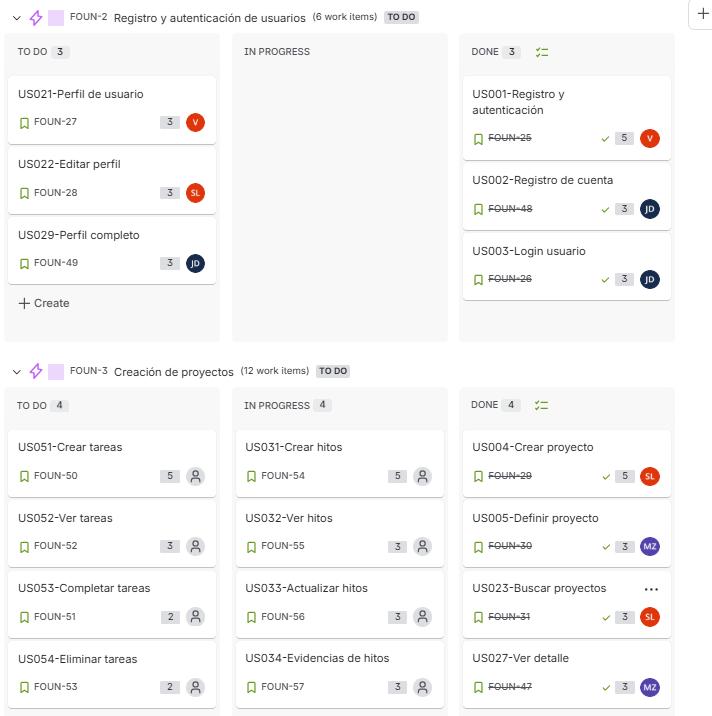

| User Story ID | User Story Title | Task ID | Task Title | Description | Estimation (Hours) | Assigned To | Status |
| :--- | :--- | :--- | :--- | :--- | :--- | :--- | :--- |
| US001 | Registro y autenticación | FOUN-25 | Vista de registro | Implementar la vista de registro con validación de campos obligatorios integrada con fake API. | 5 | Bautista Rivera, Jose Diego | Done |
| US002 | Registro de cuenta | FOUN-48 | Vista de login | Implementar la vista de inicio de sesión con autenticación simulada mediante db.json. | 3 | Bautista Rivera, Jose Diego | Done |
| US003 | Login usuario | FOUN-26 | Funcionalidad logout | Implementar el cierre de sesión con invalidación del estado de autenticación en el frontend. | 3 | Bautista Rivera, Jose Diego | Done |
| US004 | Crear proyecto | FOUN-29 | Vista creación de proyecto | Desarrollar la vista de creación de proyecto con formulario y validación integrada con fake API. | 5 | Baca Camargo, Vitaly Arturo | Done |
| US005 | Definir proyecto | FOUN-30 | Funcionalidad publicar proyecto | Implementar la acción de publicación de proyecto con cambio de estado en db.json. | 3 | Baca Camargo, Vitaly Arturo | Done |
| US006 | Unirse a proyecto | FOUN-33 | Funcionalidad unirse | Implementar lógica para unirse a proyectos existentes mediante el ID del proyecto. | 5 | No Asignado | To Do |
| US007 | Postulación a proyecto | FOUN-34 | Gestión de postulaciones | Desarrollar el sistema de envío de postulaciones a proyectos específicos. | 3 | No Asignado | To Do |
| US021 | Perfil de usuario | FOUN-27 | Vista perfil | Crear la vista de visualización de perfil de usuario con datos dinámicos. | 3 | No Asignado | To Do |
| US022 | Editar perfil | FOUN-28 | Formulario edición | Implementar formulario para la actualización de datos personales y profesionales. | 3 | No Asignado | To Do |
| US023 | Buscar proyectos | FOUN-31 | Filtros de búsqueda | Implementar buscador con filtros por categoría y tecnología. | 3 | Baca Camargo, Vitaly Arturo | Done |
| US027 | Ver detalle | FOUN-47 | Vista detalles | Desarrollar la vista detallada de un proyecto seleccionado. | 3 | Baca Camargo, Vitaly Arturo | Done |
| US029 | Perfil completo | FOUN-49 | Integración de datos | Asegurar que toda la información del usuario se visualice correctamente en el perfil extendido. | 5 | No Asignado | To Do |
| US031 | Crear hitos | FOUN-54 | Módulo de hitos | Permitir la creación de hitos temporales dentro de un proyecto. | 5 | Baca Camargo, Vitaly Arturo | In Progress |
| US032 | Ver hitos | FOUN-55| Listado de hitos | Visualización de la línea de tiempo o lista de hitos del proyecto. | 3 | Baca Camargo, Vitaly Arturo | In Progress |
| US033 | Actualizar hitos | FOUN-56 | Edición de hitos | Funcionalidad para modificar fechas o nombres de hitos existentes. | 3 | Baca Camargo, Vitaly Arturo | In Progress |
| US034 | Evidencias de hitos | FOUN-57 | Carga de archivos | Implementar la subida de evidencias para el cumplimiento de hitos. | 3 | Baca Camargo, Vitaly Arturo | In Progress |
| US051 | Crear tareas | FOUN-50 | Gestor de tareas | Desarrollar el formulario para asignar tareas a miembros del equipo. | 5 | No Asignado | To Do |
| US052 | Ver tareas | FOUN-52 | Tablero de tareas | Visualización de tareas pendientes y realizadas en el panel del proyecto. | 3 | No Asignado | To Do |
| US053 | Completar tareas | FOUN-51 | Cambio de estado | Implementar la lógica de transición de tareas a estado completado. | 2 | No Asignado | To Do |
| US054 | Eliminar tareas | FOUN-53 | Borrado lógico | Implementar la eliminación de tareas creadas por error. | 2 | No Asignado | To Do |

---

### 5.2.2.4. Development Evidence for Sprint Review

En esta sección se presentan los commits realizados en el repositorio del 
Frontend Web Application durante el Sprint 2, evidenciando los aportes de cada 
miembro del equipo en la implementación de las vistas y funcionalidades.

| Repository | Branch | Commit ID | Commit Message | Commit Message Body | Committed on (Date) |
|---|---|---|---|---|---|
| VitalyBaca/foundly-frontend | feat/vitaly | c274d71| Inital commit | Add/ cofigure json files and readme | 2026-05-09 |
| JoseDiegoBautista/foundly-frontend | feat/iam | d587767 | feat(iam): define user domain model and validation rules | Implements user domain structure and validation rules | 2026-05-09 |
| JoseDiegoBautista/foundly-frontend | feat/iam | da05c7e | implement api services and data assemblers | Implements registration form with field validation | 2026-05-09 |
| JoseDiegoBautista/foundly-frontend | feat/iam | d09eece | feat(iam): add authentication and user state management| Implements user authentication and state management | 2026-05-09 |
| JoseDiegoBautista/foundly-frontend | feat/iam | ca1f3fa | feat(iam): create reusable presentation components| Implements resuable components for presentation such as Description-step, profile-step and modal-forget-password| 2026-05-09 |
| JoseDiegoBautista/foundly-frontend | feat/iam | 408d91a | feat(iam): implementation of identity and access management bounded context| Implements identity and access management for users| 2026-05-09 |
| VitalyBaca/foundly-frontend |feat/vitaly | 54ecc18 | feat(onboarding): implement onboarding steps with profile, role, and description components| Implements components for profile, role, and description components | 2026-05-09 |
| VitalyBaca/foundly-frontend | feat/vitaly | 6c22c1b | feat(profile): implement profile management with entities, API endpoints, and validation| Implements entities, API endpoints and validations for profile management | 2026-05-10 |
| VitalyBaca/foundly-frontend | feat/vitaly | e2ab0df | Feat/profile-management | Implements project management | 2026-05-10 |
| VitalyBaca/foundly-frontend | feat/vitaly | 584b651| feat(onboarding): implement onboarding process with profile configuration, skills, and role selection components| Implements onboarding process | 2026-05-10 |
| VitalyBaca/foundly-frontend | feat/vitaly | 8e8e441 | feat(onboarding): implement onboarding process with profile configura…| Implements onboarding process with profile, role-form and skills configuration| 2026-05-10 |
| VitalyBaca/foundly-frontend | feat/vitaly | 567870b | feat(collaborator-card): add collaborator card component with styles and tests| Implements collaborator card components with styles | 2026-05-10 |
| VitalyBaca/foundly-frontend | feat/vitaly | 6d64e76 | feat(home): implement home component with layout, styles, and basic functionality| Implements home components for the web view | 2026-05-10 |
| SebastianLima-PE/foundly-frontend | feat/sebas| d370d19 | feat(home): update branding and enhance layout with new search functionality | Implements/update layout with new searching functionalities | 2026-05-10 |
| VitalyBaca/foundly-frontend | feat/vitaly | 6f1fb7c | feat(project): add create project route and update project components| Implements project route with updated components| 2026-05-10 |
| VitalyBaca/foundly-frontend | feat/vitaly | 83a7e47 | feat(create-project): implement create project view with multi-step form and styling| Implements project view with steps and styles | 2026-05-10 |
| SebastianLima-PE/foundly-frontend | feat/sebas | b80be55 | feat(project-detail): add project detail view with routing and empty states | Implements project view details | 2026-05-12 |
| mau-tz/foundly-frontend | feat/collaborator | 1be1103 | feat: add collaborators view with filters | Implements a view for collaborators with filters | 2026-05-10 |
| mau-tz/foundly-frontend | feat/collaborator | 3d1e1d2 | refactor: collaborators view | Fix design for collaborators view| 2026-05-10 |
| mau-tz/foundly-frontend | feat/collaborator | 78946a9 | feat: add routes for collaborators view
| Implements routes for collaborators view| 2026-05-11 |
---

### 5.2.2.5. Execution Evidence for Sprint Review

Durante el Sprint 2 se implementó la primera versión funcional del Frontend 
Web Application de Foundly, integrada con una Fake API mediante db.json. 
A continuación se presentan capturas de las principales vistas implementadas:

**Vista principal (Home)**

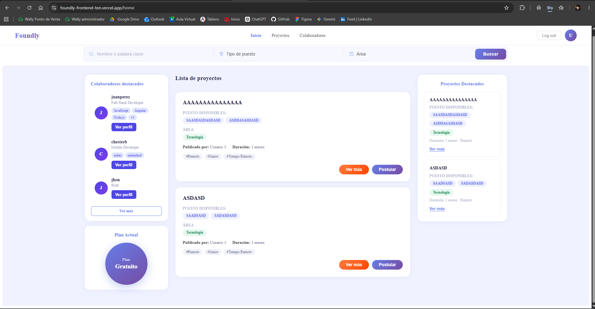

**Vista de inicio de sesión**

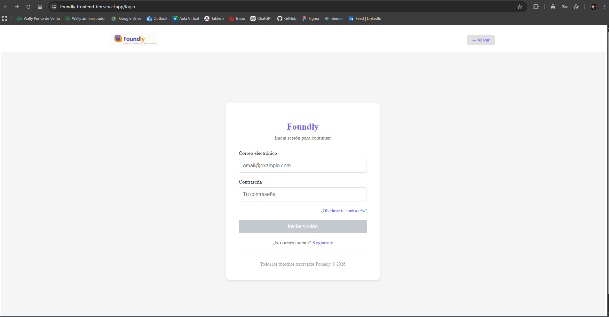

**Vista de proyectos**

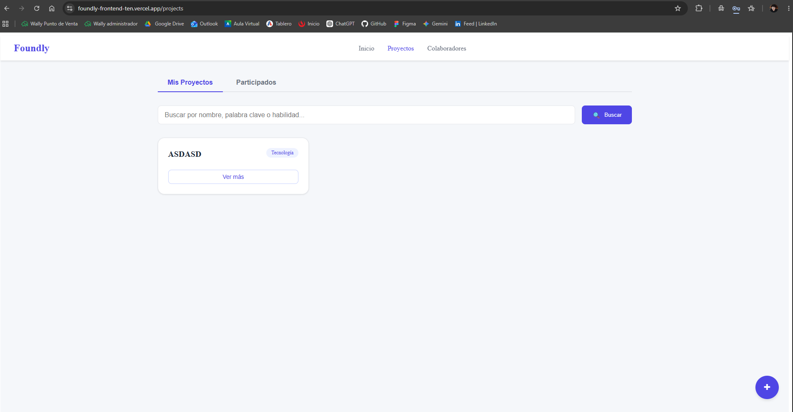

**Creación de proyecto - Paso 1**


**Creación de proyecto - Paso 2**


**Creación de proyecto - Paso 3**


**Creación de proyecto - Paso 4**


**Vista del colaborador**

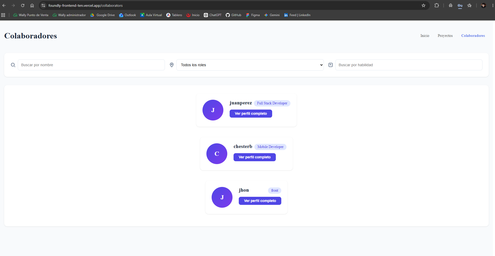

**URL del video de navegación del Sprint 2:**
https://upcedupe-my.sharepoint.com/:v:/g/personal/u202310949_upc_edu_pe/IQBhHhpVWD5VQKEVKpGqPtUSAdbO1SYBecYiSlmOpTTCq0o?e=bbQDze&nav=eyJyZWZlcnJhbEluZm8iOnsicmVmZXJyYWxBcHAiOiJTdHJlYW1XZWJBcHAiLCJyZWZlcnJhbFZpZXciOiJTaGFyZURpYWxvZy1MaW5rIiwicmVmZXJyYWxBcHBQbGF0Zm9ybSI6IldlYiIsInJlZmVycmFsTW9kZSI6InZpZXcifX0%3D

---

### 5.2.2.6. Services Documentation Evidence for Sprint Review

Durante el Sprint 2, el backend no fue implementado con servicios reales. 
El equipo utilizó una Fake API mediante db.json integrada con JSON Server 
para simular los endpoints del RESTful API durante el desarrollo del frontend. 
La documentación completa de los endpoints reales será incluida en el Sprint 3, 
una vez que el backend con Spring Boot esté desplegado.

| Endpoint simulado | Verbo HTTP | Descripción | URL local |
|---|---|---|---|
| /projects | GET | Lista todos los proyectos | http://localhost:3000/projects |
| /projects | POST | Crea un nuevo proyecto | http://localhost:3000/projects |
| /projects/:id | GET | Obtiene detalle de un proyecto | http://localhost:3000/projects/:id |
| /users | GET | Lista todos los usuarios | http://localhost:3000/users |
| /users/:id | GET | Obtiene perfil de un usuario | http://localhost:3000/users/:id |
| /applications | GET | Lista postulaciones | http://localhost:3000/applications |
| /applications | POST | Registra una postulación | http://localhost:3000/applications |
| /milestones | GET | Lista hitos de un proyecto | http://localhost:3000/milestones |
| /milestones | POST | Crea un hito | http://localhost:3000/milestones |
| /notifications | GET | Lista notificaciones del usuario | http://localhost:3000/notifications |

---

### 5.2.2.7. Software Deployment Evidence for Sprint Review

Durante el Sprint 2 se realizó el despliegue del db.json utilizando Render como plataforma de hosting y el Frontend Web Application de Foundly utilizando Vercel como plataforma de hosting. El proceso incluyó la conexión del repositorio, configuración del proyecto con detección automática del framework Angular, configuración de la rama de producción y verificación del despliegue exitoso.

- **Despliegue de db.json en Render**

**Paso 1: Conexión del Repositorio:**

Selección del repositorio json-server desde GitHub dentro del panel de Render para iniciar la creación del servicio web.

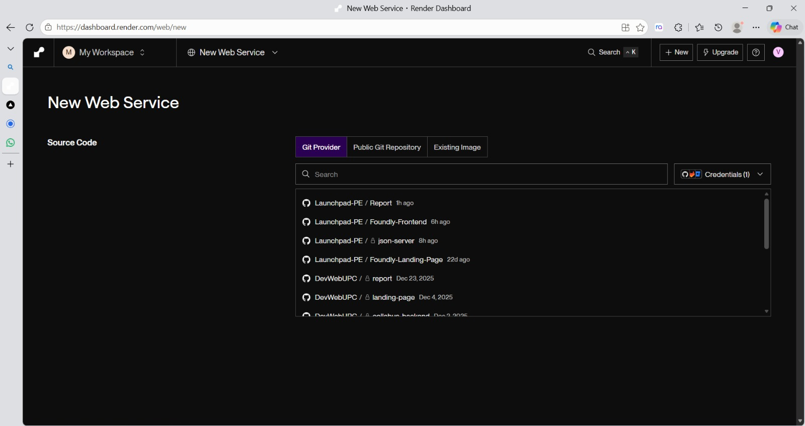

**Paso 2: Estado del Despliegue (Build & Deploy):**

Monitorización del primer despliegue. Se confirma que el servicio está "Live" y que el proceso de compilación de Node.js finalizó correctamente bajo el plan "Free".

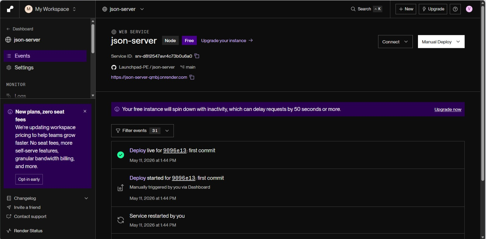

**Paso 3: Página de Inicio del Servidor:**

Acceso a la URL pública json-server-qmbj.onrender.com. Se visualizan los recursos (Resources) disponibles: /users, /profiles y /projects.

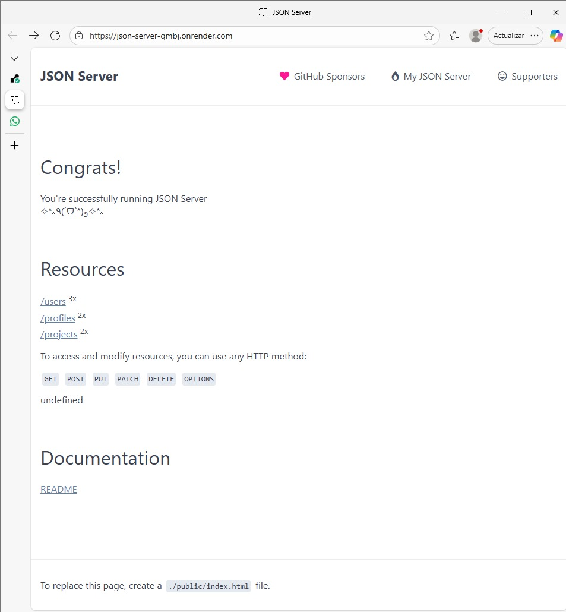

**Paso 4: Verificación de Endpoint de Usuarios:**

Verificación de la ruta /users, mostrando la estructura de los objetos de usuario creados.

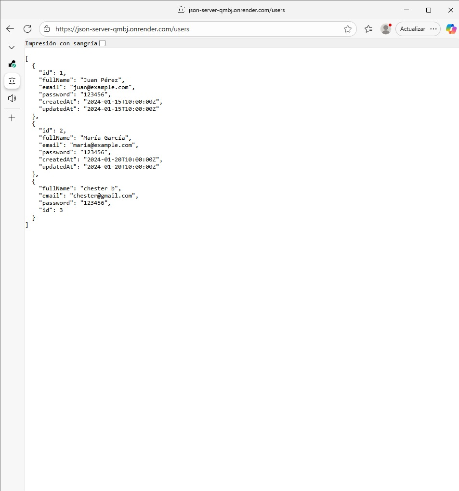

**Paso 5: Verificación de Endpoint de Perfiles:**

Validación de la ruta /profiles, confirmando que los datos de habilidades (skills) y roles están disponibles.

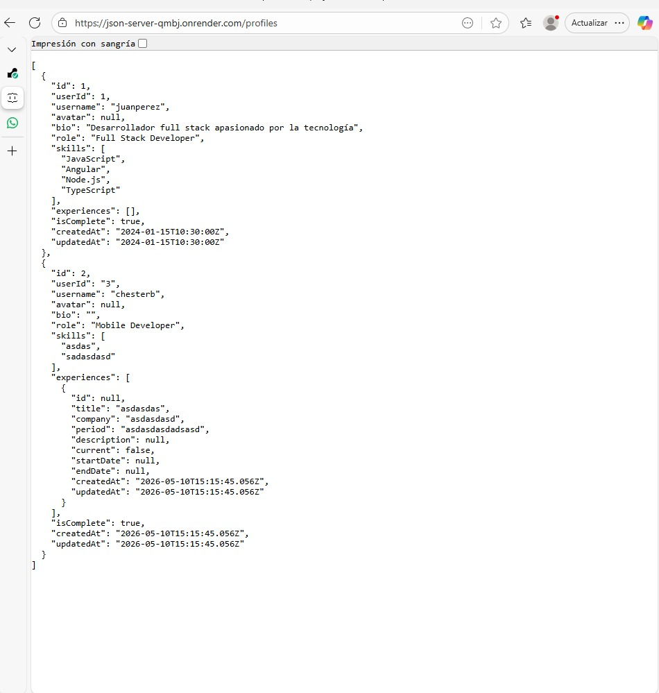

**Paso 6: Verificación de Endpoint de Proyectos:**

Validación de la ruta /projects, mostrando los proyectos con sus atributos (id, title, description, status).

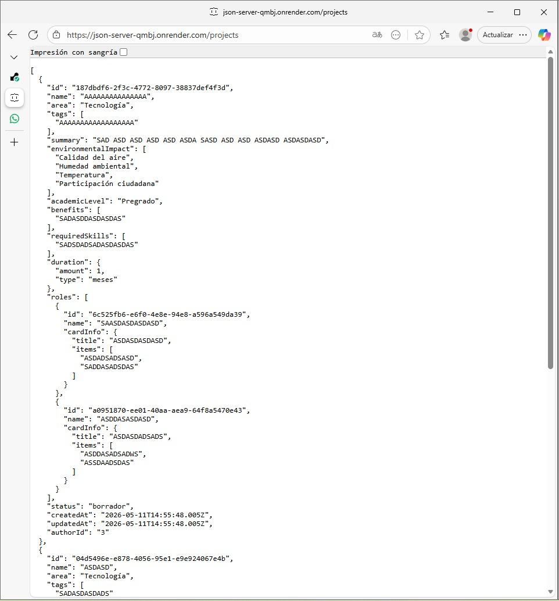

---

- **Despliegue del Frontend Web Application en Vercel**

**Paso 1: Importar repositorio en Vercel**

Se accedió a la plataforma Vercel y se seleccionó el repositorio 
Foundly-Frontend para iniciar el proceso de despliegue.


**Paso 2: Configuración del proyecto**

Vercel detectó automáticamente el framework Angular y configuró los comandos 
de build correspondientes.


**Paso 3: Configuración de la rama de producción**

En Settings > Git se configuró la rama de producción como FirstDeploy para 
asegurar que los despliegues reflejen el estado correcto del repositorio.


**Paso 4: Build Logs**

Se verificó el proceso de build en la consola de Vercel, confirmando la 
ejecución exitosa de `npm run build` y la finalización del proceso de 
compilación.


**Paso 5: Overview del proyecto desplegado**

El tablero de Vercel muestra el estado "Ready" del proyecto, la miniatura 
del sitio y la URL oficial asignada.

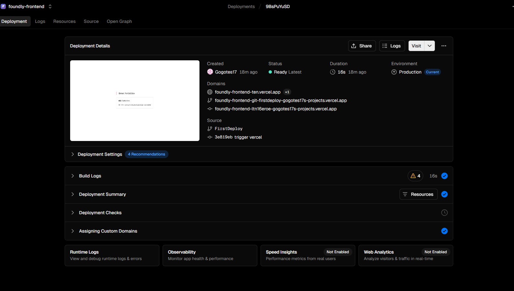

**Paso 6: Sitio en producción**

El Frontend Web Application de Foundly quedó correctamente desplegado y 
accesible mediante HTTPS en el dominio de Vercel.


---

### 5.2.2.8. Team Collaboration Insights during Sprint

Durante el Sprint 2, el equipo colaboró activamente en el repositorio del 
Frontend Web Application de Foundly. A continuación se presentan los 
analíticos de colaboración y commits realizados por los miembros del equipo 
en GitHub durante este sprint.

**Project Report Collaboration Insights**

#### Resumen de Actividad
- **Periodo:** 2 de mayo - 11 de mayo de 2026.
- **Commits Totales:** 50

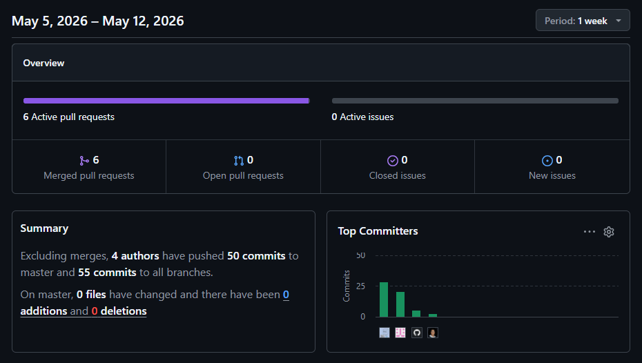

#### Análisis de Colaboración
* **Frecuencia de Integración:** Se registró una participación constante de los miembros, con **Gogotes17** liderando la frecuencia de integración con 19 commits, asegurando un flujo continuo de actualizaciones.
* **Volumen de Desarrollo:** El usuario **Mr-Code-star** realizó el mayor aporte en volumen de código (11,811 adiciones), lo cual se asocia a la implementación de módulos de datos y estructuras base de la aplicación.
* **Refactorización y Mantenimiento:** El balance entre adiciones y eliminaciones de **mau-tz** (3,446 vs 2,566) evidencia una labor significativa en la limpieza de código y optimización de componentes existentes, mejorando la mantenibilidad del frontend.
* **Colaboración Específica:** **SebastianLima-PE** contribuyó con integraciones clave en puntos específicos del desarrollo, manteniendo un ratio positivo de crecimiento del proyecto.

---

**Contributors**

El desarrollo de este proyecto fue posible gracias a la colaboración y el esfuerzo técnico de los siguientes integrantes:

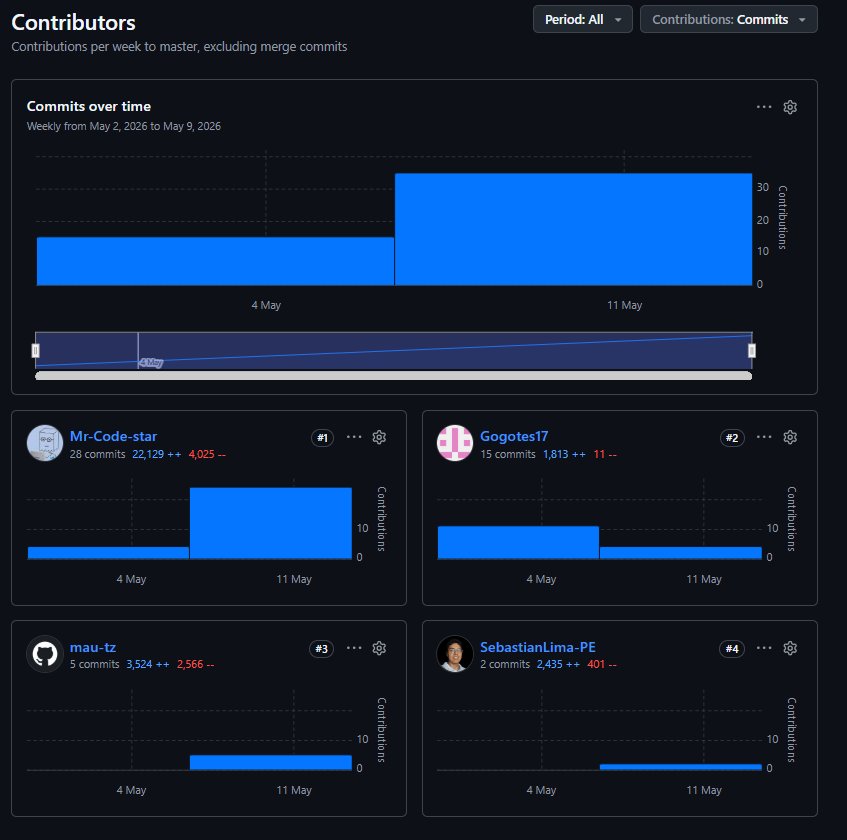

**URL del repositorio del Frontend Web Application:**
https://github.com/Launchpad-PE/Foundly-Frontend

## 5.2.3. Sprint 3

En esta sección se registra y explica el avance del equipo durante el Sprint 3 de Foundly. Durante esta iteración se completó el desarrollo del Frontend Web Application, culminando los módulos que se encontraban pendientes: **Applications**, que permite a los colaboradores postular a proyectos; **Milestone Management**, orientado a la gestión colaborativa de las actividades del equipo; y **Task Management**, encargado de la administración de tareas individuales. Asimismo, se finalizó la integración del frontend con la Fake API, permitiendo simular las principales funcionalidades de la plataforma. De manera paralela, se desarrolló la primera versión del backend aplicando la arquitectura **Domain-Driven Design (DDD)**, estableciendo la estructura base y la organización de los principales bounded contexts del proyecto.

### 5.2.3.1. Sprint Planning 3

En esta sección se presentan los detalles del Sprint Planning Meeting 3, en el cual el equipo definió el objetivo, la capacidad y las User Stories a incluir en esta iteración, enfocada en completar los módulos pendientes del Frontend Web Application e iniciar el desarrollo del backend basado en Domain-Driven Design (DDD).

| Sprint #                        | Sprint 3                                                                                                                                                                                                                                                                                                                                                                                                                                                                                                                                                                                                                                 |
| ------------------------------- | ---------------------------------------------------------------------------------------------------------------------------------------------------------------------------------------------------------------------------------------------------------------------------------------------------------------------------------------------------------------------------------------------------------------------------------------------------------------------------------------------------------------------------------------------------------------------------------------------------------------------------------------- |
| **Sprint Planning Background**  |                                                                                                                                                                                                                                                                                                                                                                                                                                                                                                                                                                                                                                          |
| Date                            | 2026-05-20                                                                                                                                                                                                                                                                                                                                                                                                                                                                                                                                                                                                                               |
| Time                            | 5:00 PM                                                                                                                                                                                                                                                                                                                                                                                                                                                                                                                                                                                                                                  |
| Location                        | Reunión virtual mediante Discord                                                                                                                                                                                                                                                                                                                                                                                                                                                                                                                                                                                                         |
| Prepared By                     | Baca Camargo, Vitaly Arturo                                                                                                                                                                                                                                                                                                                                                                                                                                                                                                                                                                                                              |
| Attendees (to planning meeting) | Baca Camargo, Vitaly Arturo / Bautista Rivera, Jose Diego / Pariachi Limahuaya, Sebastian Ubaldo / Taipe Sangama Jorge Francisco / Teran Zavala, Mauricio Alejandro                                                                                                                                                                                                                                                                                                                                                                                                                                                                                                      |
| Sprint 2 Review Summary         | Durante el Sprint 2 se logró implementar la primera versión funcional del Frontend Web Application de Foundly. Se desarrollaron las principales vistas para emprendedores y colaboradores, incluyendo autenticación, gestión de perfiles, exploración y creación de proyectos, panel IoT y navegación general de la plataforma. Asimismo, se completó la integración inicial con una Fake API mediante db.json, permitiendo validar los principales flujos de usuario.                                                                                                                                                                   |
| Sprint 2 Retrospective Summary  | El equipo logró cumplir con los objetivos planteados y mejorar la coordinación mediante reuniones periódicas en Discord. La utilización de una Fake API permitió avanzar de manera independiente en el desarrollo del frontend. Como siguiente paso, el equipo acordó completar los módulos pendientes de Applications, Milestone Management y Task Management, además de iniciar el desarrollo del backend bajo una arquitectura Domain-Driven Design (DDD) para facilitar la futura integración del sistema.                                                                                                                           |
| **Sprint Goal & User Stories**  |                                                                                                                                                                                                                                                                                                                                                                                                                                                                                                                                                                                                                                          |
| Sprint 3 Goal                   | Nuestro enfoque está en completar el desarrollo del Frontend Web Application de Foundly, culminando los módulos de Applications, Milestone Management y Task Management, así como finalizar la integración con la Fake API. Paralelamente, se desarrollará la primera versión funcional del Backend utilizando la arquitectura Domain-Driven Design (DDD), definiendo la estructura base de los bounded contexts principales del sistema. Esto se confirmará cuando los nuevos módulos del frontend estén completamente operativos y la estructura inicial del backend se encuentre implementada y preparada para su futura integración. |
| Sprint 3 Velocity               | 40                                                                                                                                                                                                                                                                                                                                                                                                                                                                                                                                                                                                                                       |
| Sum of Story Points             | 72                                                                                                                                                                                                                                                                                                                                                                                                                                                                                                                                                                                                                                       |

---

### 5.2.3.2. Aspect Leaders and Collaborators

Durante el Sprint 3, el equipo organizó el trabajo en torno a la culminación del Frontend Web Application y al inicio del desarrollo del backend de Foundly. En el frontend, los principales aspectos abordados fueron los módulos de Applications, Milestone Management y Task Management, además de la integración completa con la Fake API. En paralelo, se inició la implementación de la arquitectura del backend basada en Domain-Driven Design (DDD). Con el fin de mantener una coordinación efectiva, se estructuró la matriz de liderazgo y colaboración (LACX), donde se asignó un líder (L) por cada aspecto y colaboradores (C) que brindan apoyo en su implementación.

| Team Member | GitHub Username | IAM & Auth | Profile Management | Project Management| Comments | Milestone Management | Task Management |
|---|---|---|---|---|---|---|---|
| Almandroz Carbajal, Pierina Marysabel | pierinaaa29 | C | C | C | C | C | L |
| Baca Camargo, Vitaly Arturo | Mr-Code-star | C | L | C | C | C | C |
| Bautista Rivera, Jose Diego | Gogotes17 | C | C | C | C | L | C |
| Pariachi Limahuaya, Sebastian Ubaldo | SebastianLima-PE | C | C | C | L | C | C |
| Taipe Sangama Jorge Francisco | Camotin-Furious | C | L | C | C | C | C |
| Teran Zavala, Mauricio Alejandro | mau-tz | L | C | C | C | C | C |

---

### 5.2.3.3. Sprint Backlog 3
El objetivo principal del Sprint 3 es implementar en su totalidad el Frontend Web Application de Foundly integrado con una Fake API mediante db.json, cubriendo los flujos 
principales de la plataforma para ambos segmentos objetivo. De la misma manera se implementó la primera versión funcional del Backend de Foundly utilizando la arquitectura Domain-Driven Design (DDD).A continuación se 
presenta el tablero de control del sprint:

**URL del Sprint Board:** 


| User Story ID | User Story Title | Task ID | Task Title | Description | Estimation (Hours) | Assigned To | Status |
| :--- | :--- | :--- | :--- | :--- | :--- | :--- | :--- |
| US006 | Unirse a proyecto | FOUN-33-1 | Logic: Validación de ID | Desarrollar el validador técnico de disponibilidad del ID del proyecto. | 4 | Baca Camargo, Vitaly Arturo | Finalizada |
| | | FOUN-33-2 | UI: Botón aplicar | Diseñar el componente interactivo para realizar la solicitud de ingreso. | 5 | Baca Camargo, Vitaly Arturo | Finalizada |
| US007 | Postulación a proyecto | FOUN-34-1 | Mock: Colección postulaciones | Estructurar en db.json la entidad relacional de postulaciones por estudiante. | 4 | Bautista Rivera, Jose Diego | Finalizada |
| | | FOUN-34-2 | UI: Formulario de aplicación | Diseñar la pequeña sección para adjuntar carta de motivos o rol propuesto. | 4 | Bautista Rivera, Jose Diego | Finalizada |
| US021 | Perfil de usuario | FOUN-27-1 | UI: Layout de perfil | Diseñar las secciones del dashboard (datos, habilidades, proyectos). | 5 | Baca Camargo, Vitaly Arturo | Finalizada |
| | | FOUN-27-2 | Integration: GET Usuario | Desarrollar la consulta GET para pintar de forma dinámica los datos del estudiante. | 4 | Baca Camargo, Vitaly Arturo | Finalizada |
| US022 | Editar perfil | FOUN-28-1 | UI: Vista edición | Diseñar campos mutables precargados con la información del usuario actual. | 4 | Limahuaya Pariachi, Sebastian | Finalizada |
|  | | FOUN-28-2 | Integration: Petición PUT | Desarrollar la lógica de actualización asíncrona hacia la persistencia simulada. | 4 | Limahuaya Pariachi, Sebastian | Finalizada|
| US029 | Perfil completo | FOUN-49-1 | UI: Componentes extendidos | Incorporar secciones adicionales de portafolio y redes profesionales al perfil. | 4 | Bautista Rivera, Jose Diego | Finalizada |
| | | FOUN-49-2 | Data: Mapeo de historial | Unificar las diferentes colecciones del JSON para la vista global del usuario. | 4 | Bautista Rivera, Jose Diego | Finalizada |
| US031 | Crear hitos | FOUN-54-1 | UI: Modulo creador | Diseñar formulario modal para definir hitos con nombre y fecha límite. | 5 | Bautista Rivera, Jose Diego |Finalizada |
| | | FOUN-54-2 | Mock: Entidad hitos | Configurar la relación lógica en db.json para anidar hitos dentro de un proyecto. | 4 | Bautista Rivera, Jose Diego| Finalizada |
| US032 | Ver hitos | FOUN-55-1 | UI: Línea de tiempo | Implementar un componente visual cronológico de hitos del proyecto. | 5 | Bautista Rivera, Jose Diego | To-Do |
| | | FOUN-55-2 | Integration: Carga de hitos | Desarrollar lógica de extracción exclusiva de los hitos asociados al proyecto activo. | 4 | Bautista Rivera, Jose Diego | Finalizada |
| US033 | Actualizar hitos | FOUN-56-1 | UI: Panel de edición | Diseñar controles interactivos para alterar fechas o estados de hitos vigentes. | 4 | Bautista Rivera, Jose Diego | Finalizada |
| | | FOUN-56-2 | Integration: Petición PATCH | Desarrollar la persistencia de los cambios realizados sobre el hito seleccionado. | 4 | Bautista Rivera, Jose Diego | Finalizada |
| US034 | Evidencias de hitos | FOUN-57-1 | UI: Input de archivos | Crear la zona interactiva (drag & drop) para adjuntar enlaces/documentos. | 5 | Bautista Rivera, Jose Diego | Finalizada |
| | | FOUN-57-2 | Logic: Estado de entrega | Desarrollar la lógica que cambia automáticamente el hito a estado "Revisión". | 4 | Bautista Rivera, Jose Diego | Finzalizada |
| US052 | Ver tareas | FOUN-52-1 | UI: Tablero de control | Diseñar las columnas de estado para la distribución de actividades internas. | 5 | Almandroz Carbajal, Pierina Marysabel | Finalizada |
| | | FOUN-52-2 | Integration: Render dinámico | Programar el mapeo dinámico de tareas según su estado actual (To Do, In Process). | 4 | Almandroz Carbajal, Pierina Marysabel | To-Do |
| US053 | Completar tareas | FOUN-51-1 | UI: Interacción de arrastre | Añadir soporte para interactuar con las tarjetas del tablero mediante arrastre. | 5 | Almandroz Carbajal, Pierina Marysabel | Finalizada |
| | | FOUN-51-2 | Logic: Cambio de estado | Codificar la mutación del campo estado en el backend al soltar una tarjeta. | 4 | Almandroz Carbajal, Pierina Marysabel | Finalizada |
| US054 | Eliminar tareas | FOUN-53-1 | UI: Dialogo confirmación | Añadir opción de descarte sobre las tarjetas con ventana emergente preventiva. | 4 | Almandroz Carbajal, Pierina Marysabel | Finalizada |
| | | FOUN-53-2 | Logic: Acción DELETE | Programar la remoción o inactivación física de la tarea en la persistencia local. | 4 | Almandroz Carbajal, Pierina Marysabel | Finalizada |
| US010 | Autenticación y Registro IAM | FOUN-60-1 | DDD: Implementar User Aggregate y Value Objects | Desarrollar la raíz agregada de usuario junto con Value Objects de validación para credenciales. | 5 | Teran Zavala, Mauricio Alejandro | Finalizada |
| | | FOUN-60-2 | Infra: Configurar JWT y Security Filter Chain | Implementar el middleware de seguridad para la emisión y validación de tokens de acceso. | 6 | Teran Zavala, Mauricio Alejandro | Finalizada |
| US011 | Control de Roles de Usuario | FOUN-61-1 | Domain: Entidades y Reglas de Negocio IAM | Definir entidades de Roles y Permisos asegurando consistencia con el dominio compartido. | 4 | Teran Zavala, Mauricio Alejandro | Finalizada |
| | | FOUN-61-2 | CQRS: Commands para asignación de roles | Desarrollar los comandos y controladores REST para modificar privilegios de usuario. | 4 | Teran Zavala, Mauricio Alejandro | Finalizada |
| US012 | Gestión de Perfiles Básicos | FOUN-65-1 | Domain: Profile Aggregate Root | Modelar la raíz agregada de Profile con Value Objects asociados a datos personales. | 5 | Taipe Sangama, Jorge Francisco | Finalizada |
|  | | FOUN-65-2 | API: Endpoints para obtención de perfiles | Desarrollar Queries para recuperar información pública de perfiles a través del API REST. | 4 | Taipe Sangama, Jorge Francisco | Finalizada |
| US013 | Actualización de Hoja de Vida | FOUN-66-1 | Domain: Value Objects de Perfil Avanzado | Diseñar estructuras de validación interna para habilidades académicas y enlaces externos. | 4 | Taipe Sangama, Jorge Francisco | Finalizada |
|  |  | FOUN-66-2 | CQRS: Command de edición de perfil | Implementar el bus de comandos para persistir actualizaciones parciales sobre el agregador. | 5 | Taipe Sangama, Jorge Francisco | Finalizada |
| US014 | Creación de Proyectos | FOUN-70-1 | Domain: Project Aggregate Root y Value Objects | Desarrollar el agregado base del proyecto gestionando sus atributos críticos iniciales. | 6 | Baca Camargo, Vitaly Arturo | Finalizada |
|  |  | FOUN-70-2 | CQRS: Command para persistencia de proyectos | Diseñar el Command Record y el caso de uso para guardar nuevos proyectos en la base de datos. | 5 | Baca Camargo, Vitaly Arturo | Finalizada |
| US015 | Búsqueda y Filtrado de Proyectos | FOUN-71-1 | CQRS: Query Records para listado de proyectos | Desarrollar consultas optimizadas para recuperar proyectos publicados bajo paginación técnica. | 5 | Baca Camargo, Vitaly Arturo | Finalizada |
|  |  | FOUN-71-2 | API: Filtros avanzados por área y autor | Implementar especificaciones de filtrado dinámico en los controladores REST de proyectos. | 4 | Baca Camargo, Vitaly Arturo | Finalizada |
| US016 | Control de Tareas del Proyecto | FOUN-75-1 | Domain: Task Entity y estados de ciclo de vida | Modelar la entidad Task con validaciones para estados (To Do, In Progress, Done). | 5 | Baca Camargo, Vitaly Arturo | Finalizada |
|  | | FOUN-75-2 | CQRS: Command para asignación de tareas | Desarrollar la lógica técnica para adjuntar y persistir una tarea dirigida a un miembro específico. | 4 | Baca Camargo, Vitaly Arturo | Finalizada |
| US018 | Publicación de Comentarios | FOUN-80-1 | Domain: Comment Value Objects y Relaciones | Estructurar el modelo de comentarios enlazándolo jerárquicamente al ID de proyectos. | 4 | Limahuaya Pariachi, Sebastian | Finalizada |
|  | | FOUN-80-2 | CQRS: Command para inserción de comentarios | Desarrollar el controlador y handler técnico para publicar aportes en el muro del proyecto. | 4 | Limahuaya Pariachi, Sebastian | Finalizada |
| US019 | Moderación de Hilos de Discusión | FOUN-81-1 | CQRS: Query para hilos de conversación | Desarrollar consultas anidadas eficientes para traer comentarios ordenados por fecha. | 5 | Limahuaya Pariachi, Sebastian | Finalizada |
| | | FOUN-81-2 | API: Endpoint seguro para borrado lógico | Crear el comando y endpoint protegido por roles para deshabilitar comentarios no deseados. | 4 | Limahuaya Pariachi, Sebastian | Finalizada |

### 5.2.3.4. Development Evidence for Sprint Review

En esta sección se presentan los commits realizados en los repositorios del Frontend Web Application y del Backend Web Service durante el Sprint 3, evidenciando los aportes de cada integrante del equipo.

En el Frontend Web Application, los commits reflejan el desarrollo e integración de las funcionalidades principales del sistema, incluyendo la implementación de los módulos de gestión de postulaciones, gestión de tareas, hitos (milestones), perfil de usuario, colaboradores, componentes reutilizables, navegación, almacenamiento de estado, integración con servicios REST y mejoras en la experiencia de usuario.

Por otro lado, en el Backend Web Service, los commits corresponden a la primera versión funcional del sistema, incluyendo la implementación de los bounded contexts de IAM (Identity and Access Management), Projects, Profiles y Comments, junto con sus entidades de dominio, value objects, servicios de aplicación, repositorios, persistencia mediante JPA, endpoints REST y componentes de infraestructura. Asimismo, se desarrollaron recursos para el dashboard, módulos de entorno y tareas de configuración necesarias para la integración con el Frontend Web Application.

#### Frontend Web Application

| Repository | Branch | Commit ID | Commit Message | Commit Message Body | Committed on (Date) |
|------------|---------|-----------|----------------|---------------------|---------------------|
| pierinaaa29/foundly-frontend | feat/pierina | 4397213 | chore(server): add applications and tasks collections | Configures db.json collections, server scripts and endpoint paths for applications and tasks modules | 2026-06-01 |
| pierinaaa29/foundly-frontend | feat/pierina | c1da09a | feat(applications/domain): implement application domain model | Implements value objects, entities and cross-context objects for application management | 2026-06-01 |
| pierinaaa29/foundly-frontend | feat/pierina | 944afd9 | feat(applications/infrastructure): implement infrastructure layer | Adds API resources, assemblers, API endpoints and facade for application management | 2026-06-01 |
| pierinaaa29/foundly-frontend | feat/pierina | 824a36f | feat(applications/application): implement application store | Implements application state management and business logic | 2026-06-01 |
| pierinaaa29/foundly-frontend | feat/pierina | 6b85906 | feat(applications/presentation): implement application views | Adds project form, postulation list and postulation detail components | 2026-06-01 |
| pierinaaa29/foundly-frontend | feat/pierina | 7bed656 | feat(task-management/domain): implement task domain model | Implements task entities, value objects, enums and cross-context integration | 2026-06-01 |
| pierinaaa29/foundly-frontend | feat/pierina | 0def0f7 | feat(task-management/infrastructure): implement task infrastructure | Adds task resources, assemblers, API endpoints and facade | 2026-06-01 |
| pierinaaa29/foundly-frontend | feat/pierina | 1c8abf7 | feat(task-management/application): implement task store | Implements state management for task operations | 2026-06-01 |
| pierinaaa29/foundly-frontend | feat/pierina | eb896f4 | feat(task-management/presentation): implement task UI | Adds task form modal, task list, widgets and participating project views | 2026-06-01 |
| pierinaaa29/foundly-frontend | feat/pierina | 6e9cb72 | feat(routes): register new application and task routes | Integrates all new routes into the application | 2026-06-01 |
| pierinaaa29/foundly-frontend | feat/pierina | edb959c | feat(task-management): improve task workflow | Adds filters, dashboard, delivery form and navigation improvements | 2026-06-03 |
| pierinaaa29/foundly-frontend | feat/pierina | feb56d5 | feat(task-management): enhance task interactions | Replaces prompts with modals for delete and reschedule actions | 2026-06-03 |
| SebastianLima-PE/foundly-frontend | feat/profile | f96e2a1 | feat(profile): improve profile navigation | Adds footer component and profile routing with navigation support | 2026-06-01 |
| Mr-Code-star/foundly-frontend | feat/onboarding | 0dc4ad8 | feat: complete onboarding biography flow | Implements onboarding navigation and biography step integration | 2026-06-01 |
| SebastianLima-PE/foundly-frontend | feat/collaborators | f0ff9c4 | feat(collaborators): implement ranking feature | Adds collaborator ranking functionality and related enhancements | 2026-06-01 |
| Mr-Code-star/foundly-frontend | feat/milestone | da9fcc0 | feat(milestone): implement milestone domain | Adds milestone entities, value objects and status enums | 2026-06-02 |
| Mr-Code-star/foundly-frontend | feat/milestone | 43f7f3c | feat(milestone/infrastructure): implement infrastructure layer | Implements API endpoints, assemblers and response models | 2026-06-02 |
| Mr-Code-star/foundly-frontend | feat/milestone | c9670f3 | feat(milestone): implement milestone UI components | Adds milestone components, task components and routing integration | 2026-06-02 |
| Mr-Code-star/foundly-frontend | feat/milestone | cbec9ee | feat(milestone-modal): implement milestone modal | Adds validation, required fields and milestone creation workflow | 2026-06-02 |
| Mr-Code-star/foundly-frontend | feat/milestone | fb66c72 | feat(milestone-detail): implement milestone detail view | Implements detailed milestone page with loading and navigation support | 2026-06-02 |
| Gogotes17/foundly-frontend | feat/profile | 95ae364 | feat(profile): add favorites support | Adds favorite projects to profile entity and API resources | 2026-06-02 |
| Gogotes17/foundly-frontend | feat/profile | 3dbae18 | feat(profile): implement edit mode | Adds avatar, username, role, bio, skills and experiences editing | 2026-06-02 |
| Gogotes17/foundly-frontend | feat/project | f5c6e46 | feat(project): add favorite toggle | Implements project favorite button in project detail view | 2026-06-02 |
| Mr-Code-star/foundly-frontend | feat/milestone | 77156da | feat(milestone): improve milestone management | Adds delete and reschedule modals and due date handling | 2026-06-10 |
| Mr-Code-star/foundly-frontend | feat(milestone) | b3debaf | feat(milestone): improve milestone tracking | Adds progress tracking, event emission and status synchronization | 2026-06-10 |
| Mr-Code-star/foundly-frontend | feat/dashboard | 1f7eb17 | feat(dashboard): implement milestone dashboard | Adds milestone dashboard and database integration | 2026-06-10 |
| Gogotes17/foundly-frontend | feat(environment) | f414f95 | feat(environment): update production configuration | Updates API base URL for production deployment | 2026-06-10 |
| Gogotes17/foundly-frontend | feat(angular) | bbae548 | feat(angular): update component style limits | Increases maximum size limits for Angular component styles | 2026-06-10 |
| CamotinFurious/foundly-frontend | feat(environment) | fa574cd | feat(environment): update API endpoint paths | Updates API resources for user and milestone modules | 2026-06-11 |
| CamotinFurious/foundly-frontend | feat(profile) | edf9381 | feat(profile): refactor profile integration | Refactors getByUserId method and updates profile assembler | 2026-06-11 |
| CamotinFurious/foundly-frontend | feat(auth) | 537fde8 | feat(auth): implement HTTP interceptor | Adds authorization token management through interceptor | 2026-06-11 |
| CamotinFurious/foundly-frontend | feat(users) | 9395d1b | feat(users): simplify API endpoint configuration | Cleans duplicated endpoint definitions | 2026-06-11 |
| Mr-Code-star/foundly-frontend | feat(value-objects) | ef59747 | feat(value-objects): implement milestone value objects | Adds milestone, attachment, checklist and project related value objects | 2026-06-11 |
| Mr-Code-star/foundly-frontend | feat(entity) | c29a914 | feat(entity): implement milestone entities | Adds CreateMilestoneProps and CreateMilestoneTaskProps | 2026-06-11 |
| Mr-Code-star/foundly-frontend | feat(store) | eb2a725 | feat(store): implement milestone store | Adds milestone state management | 2026-06-11 |

#### Backend Web Service

| Repository | Branch | Commit ID | Commit Message | Commit Message Body | Committed on (Date) |
|------------|---------|-----------|----------------|---------------------|---------------------|
| mau-tz/foundly-backend | feat/iam | c14430c | feat(iam): implement IAM bounded context | Implements domain, application, infrastructure and interface layers for identity and access management | 2026-06-01 |
| mau-tz/foundly-backend | feat/iam | 591cdfc | feat(iam): add get user by email endpoint | Adds user retrieval by email and improves IAM integration | 2026-06-01 |
| Mr-Code-star/foundly-backend | feat/project | d537627 | feat(project): implement project domain model | Adds value objects, aggregate root and domain entities for project management | 2026-06-12 |
| Mr-Code-star/foundly-backend | feat/project | 5f5df68 | feat(project): implement command and query architecture | Adds command records, query records and application service interfaces | 2026-06-12 |
| Mr-Code-star/foundly-backend | feat/project | 2f4a4e1 | feat(project): implement project services | Implements ProjectCommandService and ProjectQueryService | 2026-06-12 |
| Mr-Code-star/foundly-backend | feat/project | 62cfeb3 | feat(project): implement persistence layer | Adds JPA entities and persistence management for projects and roles | 2026-06-12 |
| Mr-Code-star/foundly-backend | feat/project | 9d2ad63 | feat(project): implement repositories | Implements JpaRepository and RepositoryImpl for project data access | 2026-06-12 |
| Mr-Code-star/foundly-backend | feat/project | 387726f | feat(project): implement REST resources | Adds resources, assemblers and controllers for project endpoints | 2026-06-12 |
| Mr-Code-star/foundly-backend | feat/dashboard | e80dff4 | feat(dashboard): implement dashboard resources | Adds alert, dashboard, metric card and trend resources | 2026-06-13 |
| Mr-Code-star/foundly-backend | feat/environment | ae61992 | feat(environment): implement environmental module | Adds environmental controller, query service and mock data | 2026-06-13 |
| CamotinFurious/foundly-backend | feat/profiles | fa143d6 | feat(profiles): implement profile domain | Adds profile aggregate, experience entity and value objects | 2026-06-03 |
| CamotinFurious/foundly-backend | feat/profiles | 2c54fb9 | feat(profiles): implement profile services | Implements profile query service and business logic | 2026-06-03 |
| CamotinFurious/foundly-backend | feat/profiles | 83cb665 | feat(profiles): implement CRUD endpoints | Implements profile bounded context with CRUD operations | 2026-06-07 |
| SebastianLima-PE/foundly-backend | feat/comments | 947b08c | feat(comments): implement comments module | Adds create and retrieve operations for project comments | 2026-06-14 |
| CamotinFurious/foundly-backend | feat/configuration | e6fc499 | feat(configuration): update backend configuration | Improves CORS configuration and backend integration settings | 2026-06-11 |
| CamotinFurious/foundly-backend | feat/configuration | 2d7f144 | fix(configuration): database and authentication fixes | Fixes password SQL configuration and backend errors | 2026-06-11 |

### 5.2.3.5. Execution Evidence for Sprint Review

Durante el Sprint 3 se desarrolló la primera versión funcional del Backend Web Service de Foundly, siguiendo los principios de Domain-Driven Design (DDD) para garantizar una arquitectura modular, mantenible y alineada con los requerimientos del negocio. Como parte de la implementación, se desarrollaron los bounded contexts de Identity and Access Management (IAM), Projects, Profiles, Comments y Environmental Monitoring, junto con sus respectivos servicios de aplicación, repositorios, entidades de dominio y endpoints REST. Asimismo, se implementó la documentación interactiva de la API mediante Swagger/OpenAPI, se configuró la contenerización utilizando Docker y se realizó el despliegue del servicio en Railway, permitiendo su integración con el Frontend Web Application y la validación de las funcionalidades desarrolladas durante el sprint


**Endpoints para la gestión y consulta de usuarios del sistema**

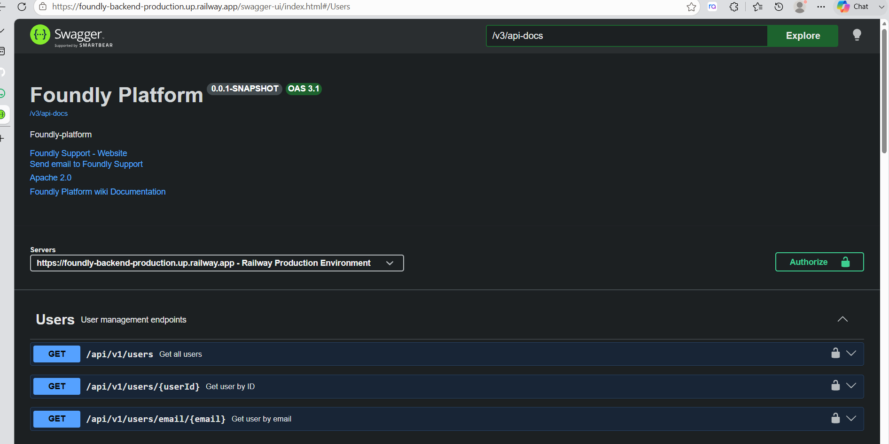


**Endpoints para registro e inicio de sesión de usuarios**

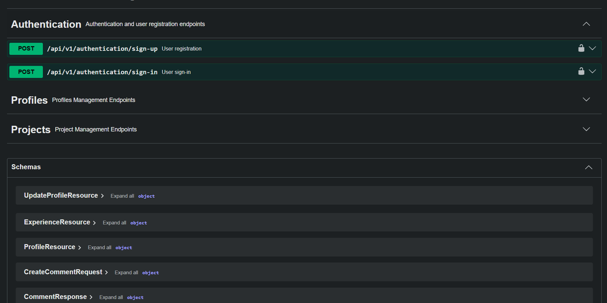


**Endpoints para la gestión y consulta de comentarios de perfiles**


**Endpoints para la consulta de métricas ambientales y dashboard IoT**

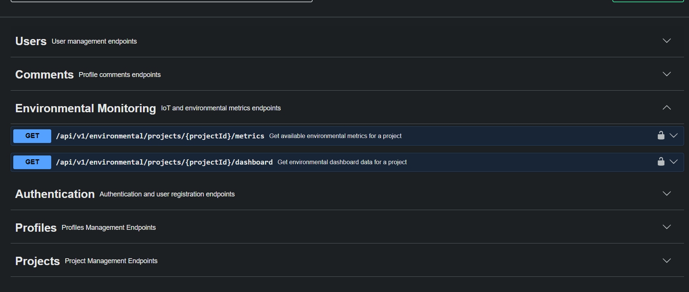


**Endpoints para la administración de perfiles de usuario.**


**Endpoints para la gestión, publicación y administración de proyectos.**

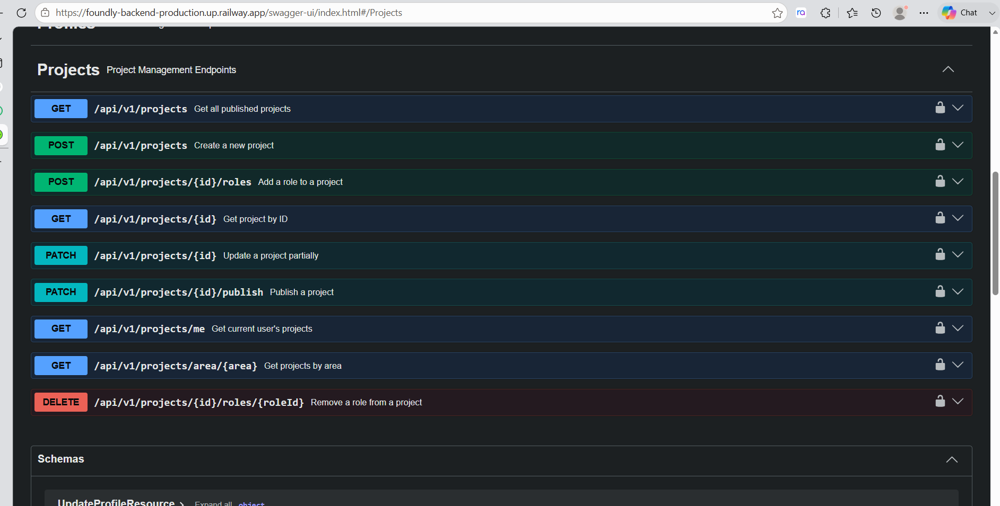


### 5.2.3.6. Services Documentation Evidence for Sprint Review

Durante el Sprint 3 se implementó la primera versión funcional del Backend Web Service de Foundly utilizando Spring Boot y siguiendo los principios de Domain-Driven Design (DDD). La documentación de los servicios fue generada mediante Swagger/OpenAPI, permitiendo visualizar y probar los endpoints disponibles para los distintos bounded contexts del sistema.

Asimismo, el servicio fue desplegado en Railway, proporcionando un entorno accesible para la integración y validación de las funcionalidades desarrolladas durante el sprint. A continuación, se presenta la documentación de los principales endpoints implementados.


| Endpoint                                               | Verbo HTTP | Descripción                                    |
| ------------------------------------------------------ | ---------- | ---------------------------------------------- |
| `/api/v1/authentication/sign-up`                       | POST       | Registro de usuarios en la plataforma          |
| `/api/v1/authentication/sign-in`                       | POST       | Autenticación e inicio de sesión               |
| `/api/v1/users`                                        | GET        | Obtiene la lista de usuarios registrados       |
| `/api/v1/users/{userId}`                               | GET        | Obtiene un usuario por identificador           |
| `/api/v1/users/email/{email}`                          | GET        | Obtiene un usuario mediante correo electrónico |
| `/api/v1/profiles`                                     | GET        | Lista todos los perfiles registrados           |
| `/api/v1/profiles`                                     | POST       | Crea un nuevo perfil                           |
| `/api/v1/profiles/{id}`                                | GET        | Obtiene un perfil por identificador            |
| `/api/v1/profiles/{id}`                                | PUT        | Actualiza completamente un perfil              |
| `/api/v1/profiles/{id}`                                | PATCH      | Actualiza parcialmente un perfil               |
| `/api/v1/profiles/{id}`                                | DELETE     | Elimina un perfil                              |
| `/api/v1/projects`                                     | GET        | Obtiene los proyectos publicados               |
| `/api/v1/projects`                                     | POST       | Crea un nuevo proyecto                         |
| `/api/v1/projects/{id}`                                | GET        | Obtiene un proyecto por identificador          |
| `/api/v1/projects/{id}`                                | PATCH      | Actualiza parcialmente un proyecto             |
| `/api/v1/projects/{id}/publish`                        | PATCH      | Publica un proyecto                            |
| `/api/v1/projects/{id}/roles`                          | POST       | Agrega un rol a un proyecto                    |
| `/api/v1/projects/{id}/roles/{roleId}`                 | DELETE     | Elimina un rol de un proyecto                  |
| `/api/v1/users/{userId}/comments`                      | GET        | Lista los comentarios asociados a un usuario   |
| `/api/v1/users/{userId}/comments`                      | POST       | Registra un comentario en un perfil            |
| `/api/v1/environmental/projects/{projectId}/metrics`   | GET        | Obtiene métricas ambientales de un proyecto    |
| `/api/v1/environmental/projects/{projectId}/dashboard` | GET        | Obtiene información del dashboard ambiental    |


### 5.2.3.7. Software Deployment Evidence for Sprint Review

Durante el Sprint 3 se realizó el despliegue del Backend Web Service de Foundly utilizando Railway como plataforma de hosting y Docker para la contenerización de la aplicación. El backend fue desarrollado con Spring Boot siguiendo los principios de Domain-Driven Design (DDD), permitiendo una arquitectura modular basada en bounded contexts. El proceso de despliegue incluyó la configuración del repositorio GitHub, la creación de una base de datos MySQL administrada por Railway, la configuración de variables de entorno, la construcción automática de la imagen Docker y la publicación del servicio en un entorno productivo. Finalmente, se verificó el correcto funcionamiento de la API mediante la documentación interactiva generada con Swagger/OpenAPI.

**Paso 1: Configuración de la documentación OpenAPI y Swagger**

Configuración de OpenAPI para exponer la documentación de la API y registrar los entornos de desarrollo y producción utilizados por el sistema.

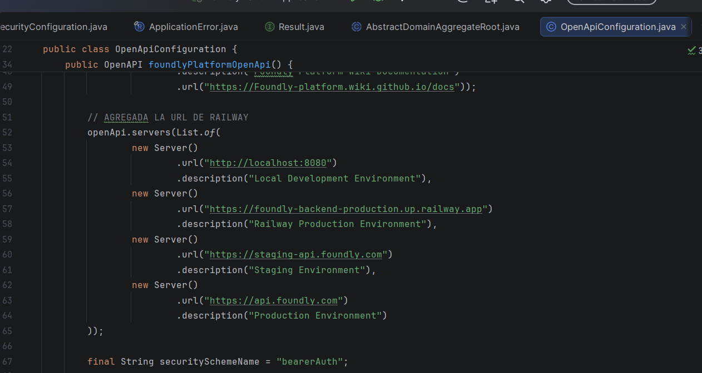

**Paso 2: Configuración de seguridad y acceso a Swagger**

Implementación de la configuración de seguridad mediante Spring Security, permitiendo el acceso a los endpoints de autenticación y a la documentación Swagger.


**Paso 3: Creación del Dockerfile para despliegue**

Definición del Dockerfile encargado de construir y ejecutar la aplicación Spring Boot dentro de un contenedor Docker para facilitar su despliegue en Railway.


**Paso 4: Configuración de propiedades para producción**

Configuración de la conexión a la base de datos MySQL, variables de entorno, JWT y parámetros necesarios para la ejecución en producción.

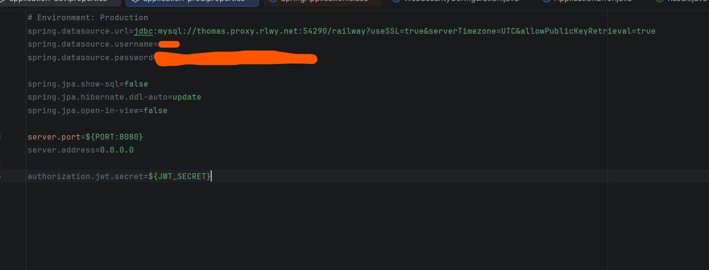

**Paso 5: Preparación de la rama de despliegue**

Creación y configuración de la rama dedicada al despliegue en Railway, incluyendo la incorporación del Dockerfile y los ajustes necesarios para producción.

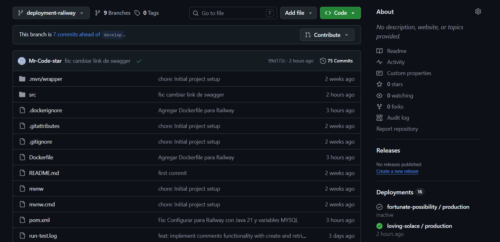

**Paso 6: Conexión del repositorio GitHub**

Selección y vinculación del repositorio Foundly-Backend desde GitHub para habilitar el despliegue continuo.


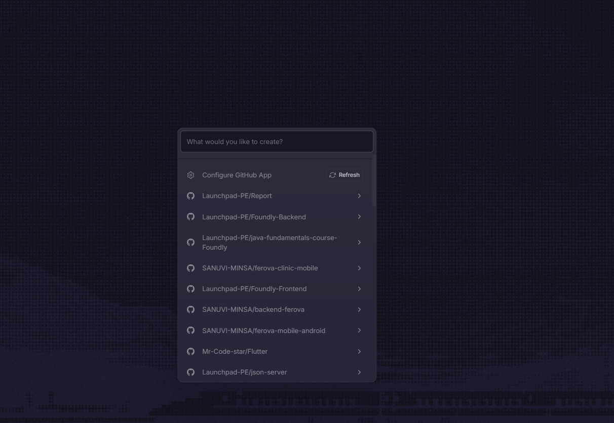

**Paso 7: Aprovisionamiento de la base de datos MySQL**

Creación de una instancia administrada de MySQL para almacenar la información persistente del sistema.

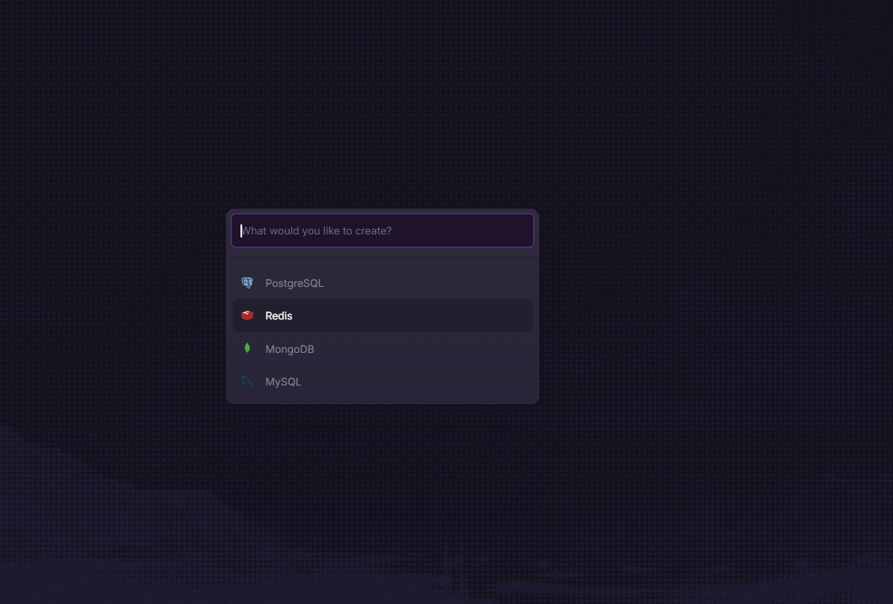


**Paso 8: Configuración de variables de entorno**

Registro de variables de entorno requeridas por la aplicación, incluyendo JWT_SECRET, PORT y SPRING_PROFILES_ACTIVE.

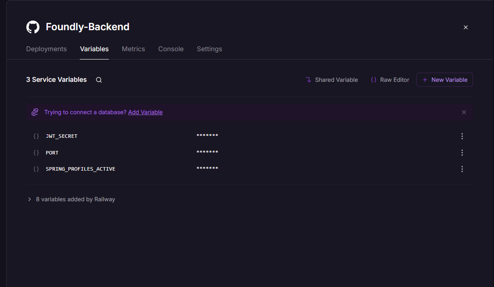

**Paso 9: Configuración del despliegue automático**

Configuración de Railway para desplegar automáticamente los cambios enviados a la rama deployment-railway del repositorio.

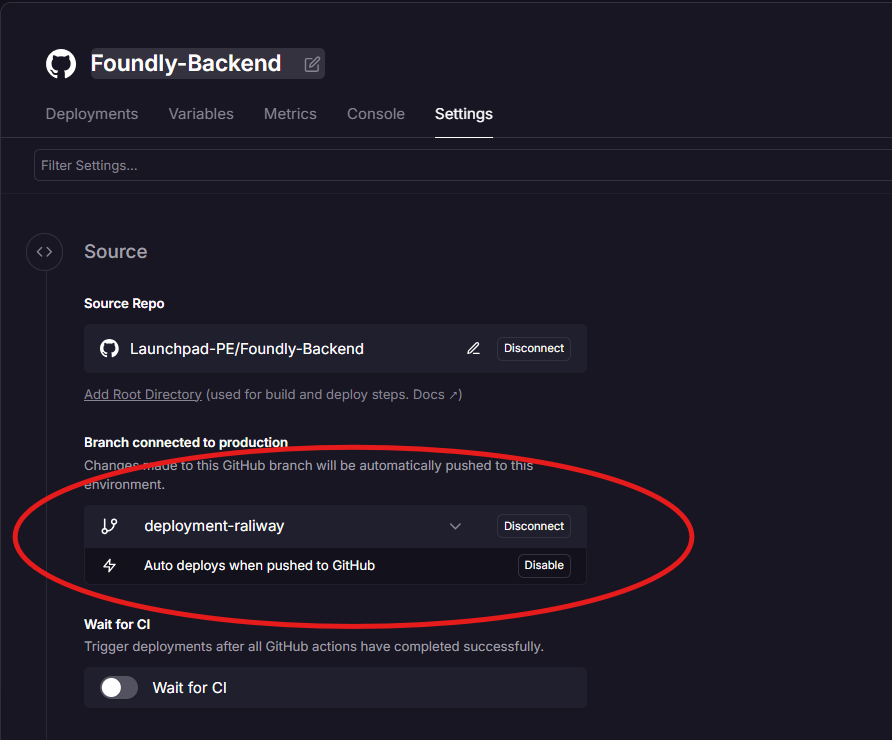


**Paso 10: Configuración del constructor Docker**

Definición del Dockerfile como mecanismo de construcción de la aplicación dentro del entorno de Railway.

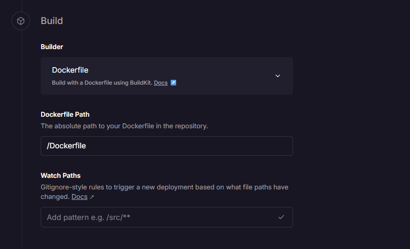


**Paso 11: Verificación del despliegue exitoso**

Validación del estado operativo del backend y revisión de los registros generados por Spring Boot durante el inicio del servicio.

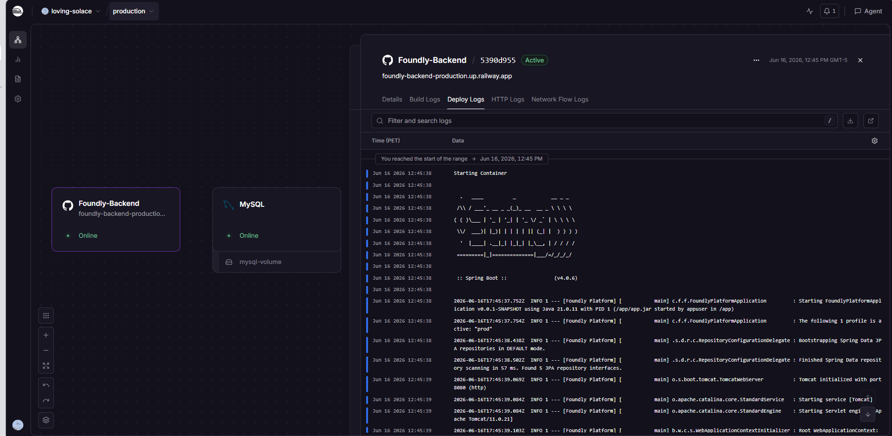

**Paso 12: Verificación de la base de datos**

Comprobación de las tablas generadas automáticamente por JPA/Hibernate en la base de datos MySQL desplegada en Railway.

<div align="center">
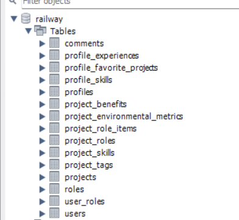
</div>

**Paso 13: Verificación de la documentación y endpoints desplegados**

Validación del correcto funcionamiento de la documentación Swagger/OpenAPI y de los endpoints implementados en los bounded contexts IAM, Projects, Profiles, Comments y Environmental Monitoring.

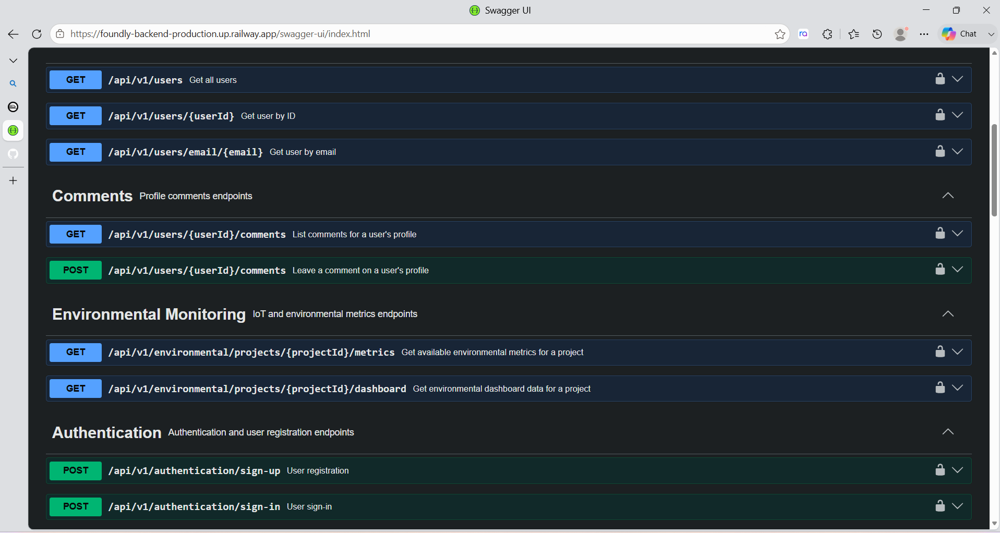


### 5.2.3.8. Team Collaboration Insights during Sprint

Durante el Sprint 3, el equipo colaboró activamente en el desarrollo del Frontend Web Application de Foundly, integrando nuevas funcionalidades y mejorando los módulos existentes. A través del repositorio de GitHub se gestionó el trabajo colaborativo, permitiendo una integración continua de cambios y una adecuada coordinación entre los miembros del equipo.

A continuación, se presentan las métricas de colaboración y los principales indicadores de participación registrados durante este sprint.

**Project Report Collaboration Insights**

**Resumen de Actividad**

- Período: 15 de mayo – 15 de junio de 2026.
- Autores Activos: 6.
- Commits Totales: 136 commits sobre la rama develop.
- Commits Totales en todas las ramas: 155.

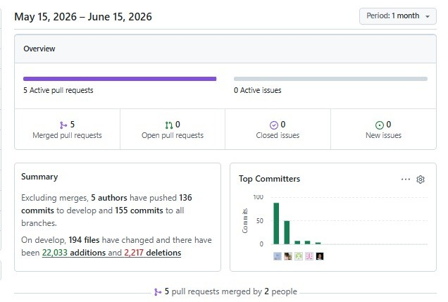

**Análisis de Colaboración**
- Frecuencia de Integración: El equipo mantuvo una integración continua durante el Sprint 3, alcanzando un total de 136 commits en la rama principal de desarrollo, lo que permitió una evolución constante del proyecto.

- Desarrollo de Funcionalidades Principales: El integrante Mr-Code-star lideró el volumen de contribuciones con 98 commits, enfocándose principalmente en la implementación de los módulos de Milestones, mejoras en la arquitectura del sistema y funcionalidades de gestión de proyectos.

- Implementación de Nuevos Módulos: pierinaaa29 realizó 50 commits, participando activamente en el desarrollo de los módulos de Applications y Task Management, incluyendo componentes de interfaz, integración con APIs y gestión del estado de la aplicación.

- Desarrollo del Perfil de Usuario: Gogotes17 contribuyó con 22 commits, implementando funcionalidades relacionadas con el perfil de usuario, favoritos y mejoras en la experiencia de usuario.
  
- Integración de Servicios y Configuración: CamotinFurious participó con 7 commits, orientados a la integración de servicios, configuración del entorno y mejoras en la comunicación con el backend.

- Mantenimiento y Optimización: mau-tz realizó aportes relacionados con tareas de mantenimiento y soporte técnico del proyecto, contribuyendo a la estabilidad de la aplicación.

- Funcionalidades Específicas: SebastianLima-PE colaboró con la implementación de características puntuales y mejoras funcionales que fortalecieron el desarrollo del sprint.

---

**Contributors**

El desarrollo del Frontend Web Application durante el Sprint 3 fue posible gracias a la colaboración de los siguientes integrantes:

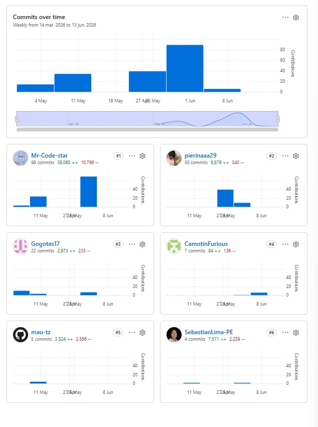

---

Durante el Sprint 3, el equipo colaboró activamente en el desarrollo del Backend Web Service de Foundly. A través del repositorio de GitHub se gestionó la implementación de nuevos bounded contexts, servicios de aplicación, persistencia de datos y endpoints REST, permitiendo una integración continua de las funcionalidades requeridas por el Frontend Web Application.

A continuación, se presentan las métricas de colaboración y los principales indicadores de participación registrados durante este sprint.

**Project Report Collaboration Insights**

**Resumen de Actividad**

- Período: 15 de mayo – 15 de junio de 2026.
- Autores Activos: 5.
- Commits Totales: 62 commits sobre la rama develop.
- Commits Totales en todas las ramas: 67.

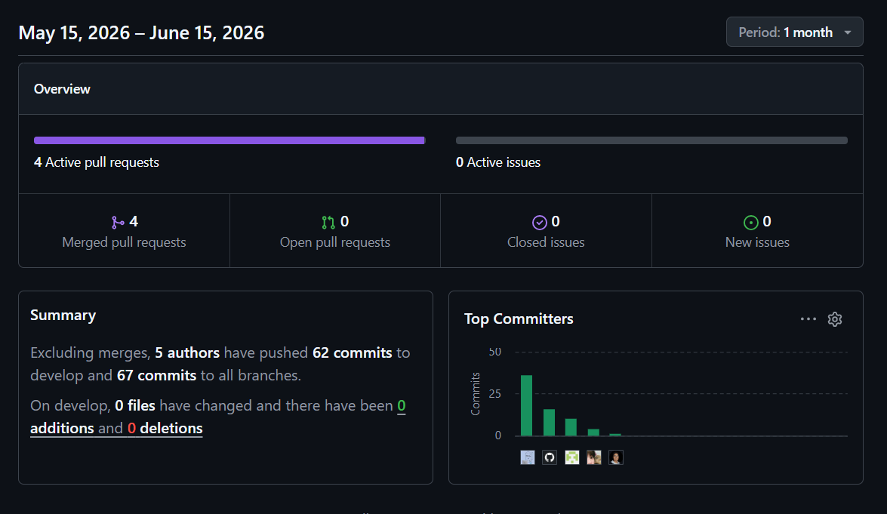

**Análisis de Colaboración**

- Frecuencia de Integración: Durante el Sprint 3 se registró una integración continua del código, alcanzando un total de 62 commits en la rama principal de desarrollo, lo que permitió consolidar la primera versión funcional del Backend Web Service.

- Desarrollo de la Arquitectura Base: Mr-Code-star lideró el desarrollo con 36 commits, participando principalmente en la implementación de los bounded contexts de Projects y Milestones, así como en la creación de servicios, repositorios y componentes de persistencia.

- Implementación del Módulo IAM: mau-tz realizó 15 commits, enfocados en el desarrollo del bounded context de Identity and Access Management (IAM), incluyendo la gestión de usuarios, roles y mecanismos de autenticación.

- Desarrollo del Módulo de Perfiles: CamotinFurious contribuyó con 10 commits, implementando el bounded context de Profiles, sus servicios de aplicación y endpoints CRUD para la gestión de perfiles de usuario.

- Implementación de Funcionalidades Complementarias: SebastianLima-PE participó en el desarrollo de funcionalidades específicas, como la implementación del módulo de comentarios y mejoras de integración entre los diferentes servicios del backend.

---

**Contributors**

El desarrollo del Backend Web Service durante el Sprint 3 fue posible gracias a la colaboración de los siguientes integrantes:

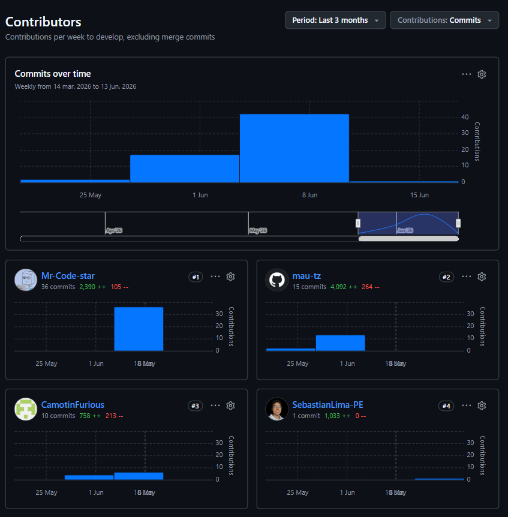

---

## 5.3. Validation Interviews. 
En esta sección, se registran y explican las actividades que abarcan las entrevistas de validación durante el desarrollo de nuestro proyecto. El objetivo principal de realizar estas entrevistas de validación es obtener retroalimentación, comprender las necesidades y expectativas de los usuarios, así como validar o refutar las hipótesis sobre el producto. Para lograr esto, haremos que nuestros entrevistados de ambos segmentos interactúen con la landing page y la aplicación web.


### 5.3.1. Diseño de Entrevistas.

**Preguntas Generales**

- ¿Qué fue lo primero que pensaste al ver la landing page y la aplicación web de Foundly?

- ¿Te quedó claro de qué trata la herramienta y cuál es su propósito principal?

- ¿Hubo algo que te generó confusión o que no entendiste del todo? ¿Cuál parte?

- ¿Cómo describirías la facilidad de navegación dentro de la plataforma?

- ¿Consideras que el diseño visual está equilibrado o cambiarías algo?

- ¿Qué tan útil te parece esta plataforma en función de tus objetivos personales o profesionales?

- ¿Notas alguna funcionalidad o sección que crees que falta o que debería mejorarse?

- ¿Sientes que la plataforma transmite confianza y profesionalismo?

**Preguntas para el Segmento 1 — Emprendedores y Startups en Etapa Temprana**

- ¿Qué tan fácil te resultó crear un proyecto y publicarlo en la plataforma?

- ¿El proceso de agregar roles o colaboradores a tu proyecto te pareció claro?

- ¿Cómo percibes la opción de recibir postulaciones de colaboradores? ¿Te parece útil?

- ¿Sientes que la información que se muestra sobre los colaboradores es suficiente para decidir a quién aceptar?

- ¿El flujo de creación de tareas e hitos te pareció práctico para organizar tu equipo?

- ¿Sientes que la interfaz refleja bien la identidad y visión de tu proyecto?

- ¿Agregarías alguna funcionalidad adicional que te facilite la gestión o visibilidad de tu proyecto?

- ¿Crees que usarías Foundly para publicar tus próximos proyectos reales? ¿Por qué sí o por qué no?


**Preguntas para el Segmento 2 — Estudiantes Universitarios y Profesionales Jovenes (Colaboradores)**

- ¿Qué tan fácil fue encontrar proyectos en los que quisieras postular?

- ¿El formulario o proceso de postulación te pareció claro y rápido?

- ¿La información mostrada por los emprendedores (duración, roles, área, recompensas) te ayudó a decidir postular?

- ¿Qué tan útil te parece que los proyectos indiquen sus beneficios o recompensas para los colaboradores?

- ¿Sientes que la plataforma transmite confianza y transparencia entre los miembros del equipo?

- ¿Qué opinas sobre el diseño y estructura de las tarjetas de proyectos (información, etiquetas, botones)?

- ¿Qué funcionalidad te gustaría que se agregue para facilitar la comunicación o el seguimiento del proyecto?

- ¿Te gustaría seguir usando la plataforma para participar en más proyectos o recomendarla a otros?


### 5.3.2. Registro de Entrevistas. 
### 5.3.3.  Evaluaciones según heurísticas.  

# Anexo D. Formato para Evaluación de User Experience según Heurísticas

## UX Heuristics & Principles Evaluation

**Usability – Inclusive Design – Information Architecture**

| Campo | Detalle |
|---|---|
| **CARRERA** | Ingeniería de Software |
| **CURSO** | Desarrollo de Aplicaciones Open Source |
| **SECCIÓN** | 10177 |
| **PROFESOR** | Mori Paiva, Hugo Allan |
| **AUDITOR** | Launchpad-PE |
| **CLIENTE(S)** | (Nombres de las personas que participan en la sesión) |

**SITE o APP A EVALUAR:** Foundly

---

### TAREAS A EVALUAR

El alcance de esta evaluación incluye la revisión de la usabilidad de las siguientes tareas:

1. Registro de un usuario nuevo
2. Inicio de sesión
3. Edición del perfil de usuario
4. Creación de un proyecto / campaña de crowdfunding
5. Búsqueda y filtrado de proyectos
6. Postulación a un equipo de proyecto
7. Realización de un aporte económico a una campaña
8. Visualización del módulo de monitoreo de impacto ambiental (IoT)

No están incluidas en esta versión de la evaluación las siguientes tareas:

1. Gestión de planes premium (suscripción freemium)
2. Sistema de reputación de equipos
3. Recomendaciones personalizadas según habilidades
4. Configuración avanzada de notificaciones

---

### ESCALA DE SEVERIDAD

Los errores serán puntuados tomando en cuenta la siguiente escala de severidad:

| Nivel | Descripción |
|---|---|
| 1 | Problema superficial: puede ser fácilmente superado por el usuario u ocurre con muy poca frecuencia. No necesita ser arreglado a menos que exista disponibilidad de tiempo. |
| 2 | Problema menor: puede ocurrir un poco más frecuentemente o es un poco más difícil de superar para el usuario. Se le debería asignar una prioridad baja resolverlo de cara al siguiente release. |
| 3 | Problema mayor: ocurre frecuentemente o los usuarios no son capaces de resolverlo. Es importante que sea corregido y se le debe asignar una prioridad alta. |
| 4 | Problema muy grave: un error de gran impacto que impide al usuario continuar con el uso de la herramienta. Es imperativo que sea corregido antes del lanzamiento. |

---

### TABLA RESUMEN

| # | Problema | Escala de severidad | Heurística/Principio violada(o) |
|---|---|---|---|
| 1 | Al editar el perfil del usuario, los campos no validan correctamente los formatos (por ejemplo, correo sin "@"), lo que permite guardar información incorrecta. | 3 | Usability: Prevención de errores |
| 2 | Al filtrar proyectos por palabras clave, los resultados no muestran coincidencias parciales, obligando al usuario a escribir el título exacto para encontrar un proyecto. | 2 | Usability: Flexibilidad y eficiencia de uso |

---

### DESCRIPCIÓN DE PROBLEMAS

**PROBLEMA #1:** Al editar el perfil del usuario, los campos no validan correctamente los formatos (por ejemplo, correo sin "@"), lo que permite guardar información incorrecta.

**Severidad:** 3

**Heurística violada:** Usability – Prevención de errores

**Problema:**
Durante el proceso de edición del perfil, el sistema permite ingresar datos inválidos como correos electrónicos sin el símbolo "@" o números de teléfono con letras. Esto puede generar registros erróneos en la base de datos y confundir al usuario, quien podría pensar que la información fue verificada correctamente. Además, no se muestra ningún mensaje de advertencia ni confirmación visual al guardar los cambios, lo que afecta la confianza del usuario en la funcionalidad.

*(Incluir captura de pantalla ilustrando el problema.)*

**Recomendación:**
Implementar validaciones en tiempo real para los campos de entrada (correo, teléfono, contraseña, etc.), mostrando mensajes claros de error y confirmación visual al guardar los cambios. Esto aumentará la confianza del usuario y evitará errores en la base de datos.

---

**PROBLEMA #2:** Al filtrar proyectos por palabras clave, los resultados no muestran coincidencias parciales, obligando al usuario a escribir el título exacto para encontrar un proyecto.

**Severidad:** 2

**Heurística violada:** Usability – Flexibilidad y eficiencia de uso

**Problema:**
Cuando el usuario realiza una búsqueda de proyectos, el sistema solo devuelve resultados si la palabra escrita coincide exactamente con el título del proyecto. Si el usuario introduce una variación mínima (como sinónimos, mayúsculas o solo una parte del nombre), no se muestran resultados. Esto limita la eficiencia de la búsqueda, incrementa la frustración y reduce la percepción de accesibilidad de la aplicación, especialmente para nuevos usuarios que no recuerdan los nombres completos de los proyectos.

*(Incluir captura de pantalla ilustrando el problema.)*

**Recomendación:**
Optimizar el motor de búsqueda para que acepte coincidencias parciales, ignore diferencias entre mayúsculas y minúsculas, y reconozca sinónimos o términos relacionados. Esto hará la experiencia de búsqueda más rápida, flexible y accesible.

---

A través de todo el proceso de realización del proyecto hemos conseguido validar las heurísticas relacionadas a nuestra landing page y aplicación web, ya que los problemas identificados durante las sesiones de validación fueron levantados y corregidos en las versiones desplegadas de los productos digitales.

## 5.4. Video About-the-Product. 

El video "About the Product" presenta de manera clara y atractiva la propuesta de valor de Foundly, los problemas que resuelve y cómo funciona la solución para ambos segmentos objetivo.

| Título del Video      | Foundly Product              | 
|-----------------------|------------------------------|
| Duración              | 2 minutos                    |  
| Fecha de Grabación    | 17/06/2026                   | 
| URL YouTube           | https://youtu.be/cxnxvIj8iWE | 
| URL Microsoft Stream  | https://shorturl.at/8xypo    | 

Screenshot del video "About the Product" :


## 5.5. Video About Team


