# Capítulo V: Product Implementation, Validation & Deployment
A continuación, se presentará un repositorio central y organizado que servirá como guía para el desarrollo enfocado y consistente de nuestra solución.
## 5.1. Software Configuration Management
A continuación, se presentará un repositorio central y organizado que servirá como guía para el desarrollo enfocado y consistente de nuestra solución.
### 5.1.1. Software Development Environment Configuration
En esta sección se incluye los links de las aplicaciones, productos de software realizadas durante el ciclo del proyecto en los programas que se utilizaron.

* **Product UX/UI Design** Este aspecto se enfoca en el diseño de la experiencia del usuario (UX) y la interfaz de usuario (UI) del producto de software. UX se centra en comprender y mejorar la experiencia general del usuario al interactuar con el software, mientras que UI se refiere al diseño visual y la usabilidad de la interfaz de usuario. El diseño UX/UI busca crear una experiencia intuitiva, atractiva y eficiente para los usuarios. En este caso realizar un modelo de sitio web para computadoras y celulares.

```
  - Figma: Es una herramienta de prototipo web y editor de gráficos vectorial, que, a diferencia de las otras herramientas, se aloja en la web, permitiendo establecer los modelos para versión en Web Browser y Mobile Browser.
```
https://www.figma.com/design/
```
- UXPressia: Es una herramienta en línea para el mapeo de la trayectoria del cliente que crea mapas de impacto y personas. Sus herramientas nos permitieron establecer las bases del modelado de User Persona, Empathy Map y Journey Map.
```
https://uxpressia.com/
```
- MIRO: Es una pizarra digital colaborativa en línea, que puede ser usada para la investigación, la ideación, mapas mentales, as-is, to-be y una variedad de otras actividades colaborativas.
```
https://miro.com/app/dashboard/
```
- Lucid Chart: Es una herramienta de diagramación basada en la web, que permite a los usuarios colaborar y trabajar juntos en tiempo real, creando diseños UML, mapas mentales, prototipos de software y muchos otros tipos de diagrama.
```
https://lucid.app/documents#/dashboard
```
- Structurizr: Es una herramienta de diseño que soporta el modelo C4, para visualizar la arquitectura de software de nuestra solución.
```
https://structurizr.com/

- **Software Development** Es el proceso de crear, diseñar, programar, probar y mantener el software. Incluye la implementación de los requisitos definidos en el proceso de desarrollo de software, utilizando diferentes lenguajes de programación, herramientas y tecnologías. El objetivo es construir un producto de software funcional y de alta calidad que cumpla con los requisitos y expectativas del cliente.
```
- GitHub: Es un repositorio comunitario cuya función es almacenar los avances de un proyecto elaborado por un grupo de personas.
```
https://github.com/Launchpad-PE
```
- Visual Studio Code: Es un editor potente que brinda extensiones que nos permiten personalizar y agregar funcionalidades para que la función del desarrollador sea más eficiente.
```
https://code.visualstudio.com/
```
- HTML: Es el lenguaje estándar para crear y diseñar sitios web. Utiliza etiquetas para estructurar el contenido, como texto, imágenes y enlaces. Junto con CSS y JavaScript, HTML forma la base de la web moderna. Este lenguaje será utilizado en el presente proyecto para implementar la documentación de la página web.
```
https://www.jetbrains.com/help/webstorm/editing-html-files.html
```
- CSS: Es un lenguaje de estilo utilizado para controlar el diseño y la presentación de páginas web. Permite establecer colores, fuentes, márgenes y otros aspectos visuales para mejorar la apariencia de un sitio web. Este lenguaje se utilizará para la implementación del diseño de nuestra plataforma web.
```
https://www.jetbrains.com/help/webstorm/style-sheets.html#ws_css_completion
```
- JavaScript: Es un lenguaje de programación de alto nivel que se utiliza principalmente para agregar interactividad y dinamismo a los sitios web. Permite realizar acciones como validar formularios, animar elementos y actualizar contenido sin recargar la página. Se utilizará para la elaboración de las dinámicas de la plataforma web.
```
https://www.jetbrains.com/help/webstorm/javascript-specific-guidelines.html
```
- Java: Es un lenguaje de programación de propósito general, orientado a objetos y concurrente. Es ampliamente utilizado para el desarrollo de aplicaciones empresariales, móviles y web debido a su robustez, seguridad y portabilidad, permitiendo que el código se ejecute en cualquier plataforma que soporte una Máquina Virtual de Java (JVM).
```
https://dev.java/
```
- Angular: Es un framework y plataforma de desarrollo de código abierto basado en TypeScript, creado por Google. Está diseñado para facilitar la creación de aplicaciones web de una sola página (SPA) robustas y escalables, ofreciendo una estructura clara basada en componentes y una amplia gama de herramientas integradas.
```
https://angular.dev/

- **Software Deployment** Es el proceso de implementar y poner en funcionamiento el software en un entorno de producción o en los dispositivos de los usuarios finales. Incluye actividades como la instalación, configuración, migración de datos y puesta en marcha del software. El objetivo es garantizar una implementación exitosa y sin problemas del software en el entorno de producción.
```
- GitHub Pages: Servicio de Github que nos permitió alojar nuestra Landing page y nos permitirá alojar nuestro web applications.
```
https://pages.github.com/

- **Software Documentation** Se refiere a la creación y mantenimiento de documentos que describen el software, incluyendo su arquitectura, diseño, funcionamiento, instalación, configuración, uso y mantenimiento. La documentación proporciona información útil y detallada sobre el software para desarrolladores, usuarios finales, administradores de sistemas y otras partes interesadas.
```
- Markdown: Es un lenguaje de marcado ligero que permite escribir texto con un formato fácil de leer y escribir, que luego puede ser convertido a HTML u otros formatos de presentación. Es ampliamente utilizado para documentar proyectos de software debido a su simplicidad y versatilidad. Markdown permite agregar formato básico como encabezados, listas, enlaces e imágenes utilizando una sintaxis sencilla y fácil de recordar.
```
https://www.markdownguide.org/getting-started/

### 5.1.2. Source Code Management

Para administrar el progreso del código, el equipo optó por una estrategia simplificada en lugar de implementar el flujo completo de Git Flow. Se trabajó directamente con una sola rama principal (`main`), la cual contiene la versión estable y en desarrollo del proyecto.

Todas las nuevas funcionalidades y correcciones fueron integradas directamente en la rama `main`, sin necesidad de crear ramas adicionales para desarrollo o características específicas. Aunque este enfoque es menos modular que Git Flow, resultó práctico para el alcance actual del proyecto, ya que permitió un control más directo del avance y evitó la sobrecarga de gestionar múltiples ramas en paralelo.

Adicionalmente, se utilizó GitHub como repositorio central, aprovechando la funcionalidad de GitHub Pages para la visualización del trabajo desplegado. Esto permitió publicar los archivos `.html` y obtener un enlace web funcional de manera rápida y sencilla.

En resumen, trabajar únicamente con la rama `main` permitió avanzar con agilidad en el desarrollo del Landing Page y mantener una versión estable y actualizada del proyecto sin complejidad adicional en la gestión de ramas.

---

**Landing Page — GitHub Pages**

Enlace de despliegue: https://launchpad-pe.github.io/Launchpad-PE-Landing-Page/

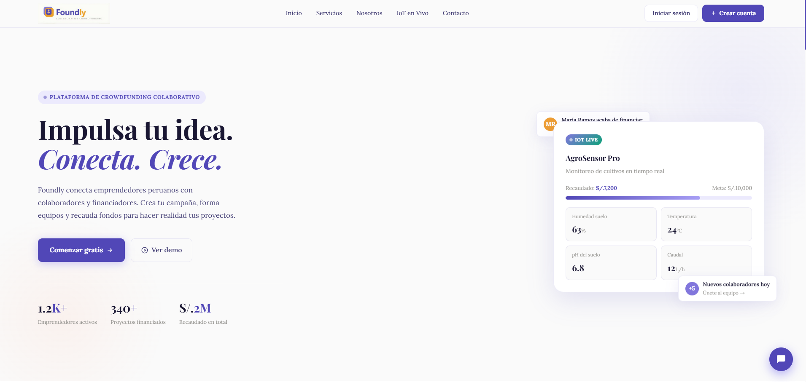

**Landing Page — Repositorio GitHub**

Enlace del repositorio: https://github.com/Launchpad-PE/Launchpad-PE-Landing-Page

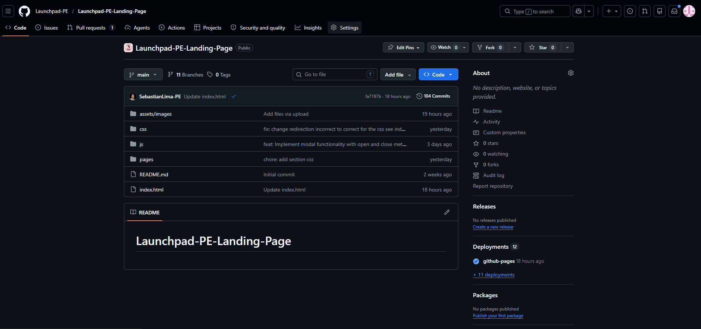

### 5.1.3. Source Code Style Guide & Conventions
En esta sección se establecen las convenciones y reglas de estilo de código que el equipo aplicará durante el desarrollo de la aplicación web de Foundly. Estas prácticas garantizan la coherencia, legibilidad y calidad del código a lo largo del ciclo de vida del proyecto, facilitando su mantenimiento y escalabilidad.

Los lenguajes empleados en el desarrollo son **HTML**, **CSS** y **JavaScript** para la aplicación web, y **Gherkin** para la especificación de los casos de prueba. A continuación se detallan las reglas y convenciones definidas para cada uno de ellos.

---

#### Nomenclatura en inglés y uso de minúsculas

Los nombres asignados a variables, objetos, funciones y elementos HTML se definirán en idioma inglés, procurando que reflejen con claridad el propósito o la función que cumplen dentro del sistema.

Se evitará la mezcla de mayúsculas y minúsculas en los identificadores, ya que reduce la legibilidad del código. En su lugar, se priorizará el uso uniforme de minúsculas, siguiendo las recomendaciones de la Guía de Estilo de Google. Esta convención aplica de forma consistente a todos los archivos y lenguajes del proyecto.

Ejemplo:
```
.clr {
} /*Mala practica, el nombre es ambiguo*/
.text-color {
} /*Buena practica, el nombre de esta clase nos dice que representa al color del texto*/
```
**Sangría y identación**

La identación ayuda a delimitar visualmente bloques y estructuras en el código del programa. La sangría permite que el código sea mas fácil de entender y
mantener, ya que ayuda con la identificación y relación entre bloques de código.
Google recomienda utilizar dos bloques de espacio para la sangría en lugar de la tecla de tabulación. Esta convención se aplicará en el proyecto para mantener
la legibilidad y un estilo uniforme.

Ejemplo:

**EN HTML**
```
<ul>
<li>Chorrillos</li>
<li>Miraflores</li>
<li>Barranco</li>
</ul>
```
**EN CSS**
```
body {
background: #fff;
color: #404;
}
```
**EN JavaScript**
```
function sum(num_a, num_b) {
return num_a + num_b;
}
```
Seguidamente, se presentarán y detallarán las reglas especificas para cada lenguaje que utilizaremos:

**HTML**

Utilizaremos HTML5 para nuestro proyecto, siendo el estandar mas reciente de HTML que ofrece todas las funcionalidades necesarias para desarrollar una página web. A continuación, mostraremos las características y pautas que seguiremos para el desarrollo:
- **Document Type**

Para nuestro proyecto, empleamos la declaración del tipo documento (DOCTYPE) específica para HTML5, que se define como `<!DOCTYPE html>`. Esta declaración sigue las mejores prácticas recomendadas por Google.
- **Semantics**

Se utilizarán las etiquetas semánticas correctas de HTML5 cuando sean necesarias. Google recomienda utilizar las etiquetas semánticas adecuadas en lugar de depender solo de etiquetas generales, asi logrando una mayor legibilidad en el código.

Ejemplo:
```
<!-- Cuando queremos realizar una cabezera en HTML -->
<div>Mi Blog</div>
<!--Uso incorrecto porque existe una mejor etiqueta semántica para la cabezera.-->
<header>Mi Blog</header>
<!--Uso correcto al utilizar la etiqueta semántica adecuada.-->
```
- **Blank Lines**

W3School recomienda agregar lineas en blanco para la separación de grandes bloques de código. Esto permite una mejor visualización del código en secciones más manejables, facilitando la visualización de la estructura del código en el programa.

Ejemplo:
```
<body>
  <h1>Ciudades Famosas</h1>

  <h2>Lima</h2>
    <p>
      Lima es la capital del Perú, ubicada en la costa central del país, y es su ciudad más poblada.
   </p>
  <h2>Buenos Aires</h2>
    <p>
      Buenos Aires es la capital de Argentina, reconocida por su arquitectura y su intensa vida cultural.
    </p>
  <h2>Madrid</h2>
    <p>
      Madrid es la capital de España, conocida por su historia, gastronomía y vida nocturna.
    </p>
</body> 
```
- **HTML Quotation Marks**

Como recomienda Google, para citar los valores de atributos en HTML, se deben utilizar comillas dobles ("") en lugar de comillas simples (''). Esto permite una
mejor consistencia en el uso de las comillas en HTML.

Ejemplo:
```
<!-- No recomendado -->


<!-- Recomendado -->

```
- **Multimedia Fallback**

Google recomienda proporcionar contenido alternativo a elementos multimedia como imagenes, videos o audio. La adición de contenido alternativo a estos
elementos permite una mejor accesibilidad y rendimiento en la página web.

Ejemplo:
```
<!-- Ejemplo correcto de contenido alternativo -->

```
**CSS**

Utilizaremos CSS3 para nuestro proyecto, siendo el estandar mas reciente de CSS que ofrece todas las funcionalidades necesarias para agregar estilos a una
página web. A continuación, mostraremos las características y pautas que seguiremos para el desarrollo:
- **Property Name Stops**

Para mantener la consistencia en el código CSS, se sugiere colocar un espacio después de los dos puntos que acompañan al nombre de la propiedad. Asimismo,
es recomendable mantener únicamente un espacio entre la propiedad y el valor que se le asigna, siguiendo las recomendaciones de Google.

Ejemplo:
```
/* No recomendado */
p {
  color: blue;
}

/* Recomendado */
p {
  color: blue;
}
```
- **Declaration Stops**

Siguiendo las recomendaciones de Google, se debe utilizar un punto y coma al final de cada declaración de propiedad en CSS. Esto mantiene la consistencia y evita errores de interpretación de código.

Ejemplo:
```
/* Incorrecto */
p {
  color: blue   /* Falta ; aquí */
  font-size: 16px;
}

/* Correcto */
p {
  color: blue;
  font-size: 16px;
}
```
- **CSS Quotation Marks**

Google recomienda utilizar comillas simples ('') en vez de comillas dobles ("") para selectores de atributos y valores de propiedades. Además, no se debe utilizar
comillas para URLs en CSS. Para la regla "css @charset", se debe utilizar obligatoriamente comillas dobles ("").

Ejemplo:
```
/* No recomendado */
@import url("https://www.google.com/css/maia.css"); /* Usa comillas dobles en un URL */

html {
  font-family: "open sans", arial, sans-serif; /* Usa comillas dobles en valores de propiedades */
}

/* Recomendado */
@import url("https://www.google.com/css/maia.css"); /* No usa comillas */

html {
  font-family: "open sans", arial, sans-serif; /* Usa comillas simples */
}
```
- **Declaration Block Separation**

Según recomendaciones de Google, debe haber un espacio entre el bloque de separación y el selector. Además, no deben haber saltos de linea entre el selector
y el bloque de separación. Estas pautas permiten un mayor orden al declarar estilos y los bloques de separación.

Ejemplo:
```
/* No recomendado: Falta de espacio */
.video {
  margin-top: 1em;
}

/* No recomendado: Salto de linea innecesario */
.video {
  margin-top: 1em;
}

/* Recomendado */
.video {
  margin-top: 1em;
}
```
**JavaScript**

Utilizaremos el lenguaje de programación JavaScript, un lenguage fundamental para el desarrollo web, en nuestro proyecto. Se utiliza para agregar
interactividad y lógica en la página web.A continuación, mostraremos las características y pautas que seguiremos para el desarrollo:
- **Spaces Around Operations**

W3Schools recomienda colocar espacios alreredor de operadores (+,-,*,/,=) y después de las comas al escribir código en JavaScript. Esto ayuda a la legibilidad y
organización del código, facilitando el mantenimiento y comprensión del mismo.

Ejemplo:
```
let a = b + c;
const Distritos = ["Chorrillos", "Miraflores", "Breña"];
```
- **End of Simple Declaration**

Según W3Schools, se recomienda terminar cada declaración de código simple con un punto y coma al escribir código en JavaScript. Incluye la declaración de variables, de objetos y asignaciones.

Ejemplo:
```
const nombres = ["Diego", "Mauricio", "Pierina", "Vitaly", "Sebastian"];
```
- **General Rules for Complex Statements**

Según W3Schools, las declaraciones complejas deben seguir el siguiente orden:
Colocar la llave de apertura al final de la primera linea. Utilizar un espacio antes de la llave de apertura. Colocar la llave de cierre en una nueva línea, sin espacios
previos. No terminar una declaración compleja con un punto y coma.

Ejemplo:
```
for (let i = 0; i < 5; i++) {
  x += i;
}
```
**Gherkin**

Gherkin es un lenguaje específico de dominio (DSL), diseñado para resolver problemas específicos, permitiendo la comunicación entre el perfil de negocio y
perfiles técnicos. Este lenguaje es utilizado para crear escenarios de prueba en texto plano, utilizando una sintaxis sencilla y legible.

Las pautas que se tendran en cuenta son las siguientes:
- **Discernible Given-When-Then Blocks**

Keiblinger sugiere que, para facilitar la comprensión de los escenarios en Gherkin, se recomienda utilizar la palabra "And" despues de un "Given", "When" o
"Then" para indicar un paso adicional en el bloque. Esto permite la identificación del inicio y fin de cada bloque, mejorando la organización de la escritura.

Ejemplo:
```
Scenario: Usuario inicia sesión con credenciales válidas
Given que el usuario está en la página de login
And ha ingresado un correo válido
And ha ingresado una contraseña válida
When presiona el botón "Iniciar sesión"
Then debería ser redirigido al panel principal
And debería ver un mensaje de bienvenida
```
- **Steps with Tables**
Segun las sugerencias de Keiblinger, debemos de utilizar los dos puntos después de un paso que requiere utilizar una tabla como referencia. Los dos puntos sirven para indicar que el paso necesita de una tabla, mejorando la organización de la escritura.

Ejemplo:
```
Scenario: Ver productos en el carrito
Given que el carrito contiene los siguientes productos:
| producto     | cantidad |
| Laptop       | 1        |
| Smartphone   | 2        |
| Auriculares  | 3        |
```
- **Reducing Noise**
Sophie Keiblinger recomienda utilizar valores predeterminados en los campos donde el sistema lo requiere, pero no son relevantes para el escenario. Tiene el fin de mejorar la claridad del escenario, al eliminar valores innecesarios y cambiarlos por valores predeterminados.

Ejemplo:
```
Scenario: Login exitoso
Given que el usuario está en la página de login
And ha ingresado credenciales válidas
When presiona el botón "Iniciar sesión"
Then debería ver el panel principal
And debería ver un mensaje de bienvenida
```
- **Newlines between scenarios and separator comments**
Keiblinger menciona que, al tener varios escenarios en un mismo archivo Gherkin, es recomendable separar cada escenario con dos lineas en blanco entre cada escenario. Esto permite distinguir de manera clara cada escenario y sus bloques. Ademas, recomienda agregar un comentario separador para brindar una guia visible y facilitar la navegación.

Ejemplo:
```
#------- Escenario de login exitoso -------
Scenario: Usuario inicia sesión correctamente
Given que el usuario está en la página de login
When ingresa un correo y contraseña válidos
Then debería ver el panel principal
And debería ver un mensaje de bienvenida

#------- Escenario de login fallido -------
Scenario: Usuario intenta login con contraseña incorrecta
Given que el usuario está en la página de login
When ingresa un correo válido y una contraseña incorrecta
Then debería ver un mensaje de error "Credenciales incorrectas"
```

### 5.1.4. Software Deployment Configuration

Para desplegar nuestro landing page hemos optado por usar Github Pages el cual brinda la posibilidad de alojar sitios web estáticos sin costo alguno.

1. Ingresamos al repositorio de nuestra landing page

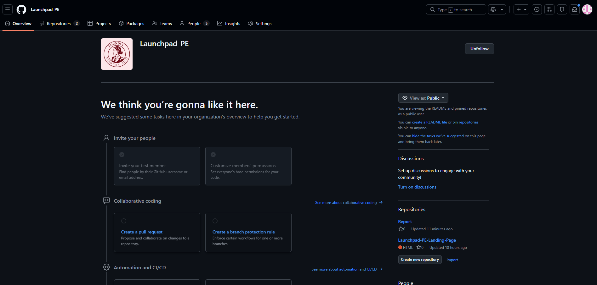

2. Ingresamos al repositorio de nuestra landing page

 

3. Ingresamos a la sección de "Settings" del repositorio

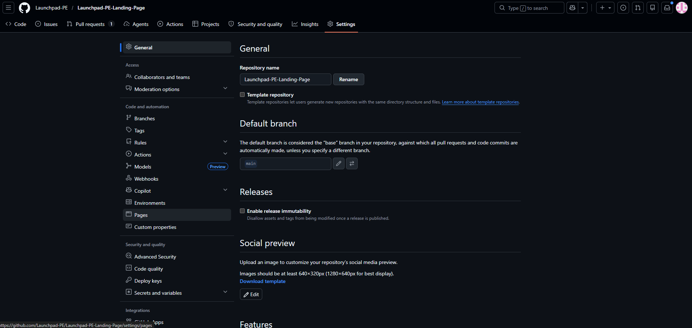

4. En la sección de "Pages", seleccionamos la rama "main" y la carpeta raíz (root) para desplegar nuestro sitio web.

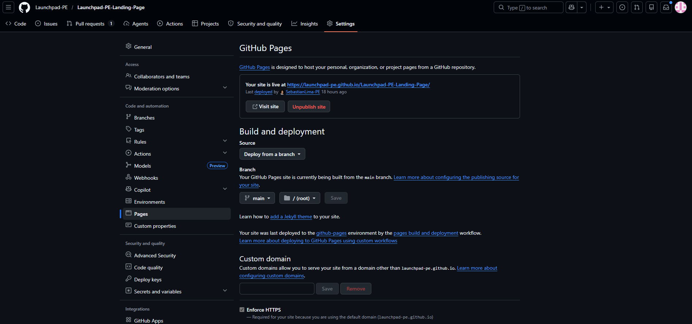
## 5.2. Landing Page, Services & Applications Implementation
### 5.2.1. Sprint 1
En esta sección, documentaremos y explicaremos el progreso del Sprint 1 en términos de desarrollo del producto y colaboración del equipo. Abordaremos
varios aspectos clave, incluyendo la planificación del sprint, el backlog del sprint, la evidencia de desarrollo para la Revisión del Sprint. Además, se destacarán los aspectos relacionados con la documentación de servicios, la evidencia de despliegue de software y las perspectivas de colaboración del equipo durante el sprint. Este análisis detallado nos permitirá evaluar el progreso del proyecto y realizar ajustes necesarios para futuros sprints.

#### 5.2.1.1. Sprint Planning 1
En esta sección, nos sumergiremos en los detalles del Sprint Planning Meeting 1.


| **Sprint #** |                 **Sprint 1**              |
|--------------|-------------------------------------------|
|**Sprint Planning Background**                            |
| Date         | 06-04-2026                                |
| Time         | 2:00 PM                                   |
| Location     | Reunión virtual mediante Discord          |
| Prepared By  | Jose Diego Bautista Rivera                |
| Attendees    | Almandroz Carbajal Pierina, Baca Camargo Vitaly, Pariacchi Limahuaya Sebastian, Teran Zavala Mauricio                 |
| Sprint n-1 Review Summary | No aplica                    |
| Sprint n-1 Retrospective Summary | No aplica             |
| **Sprint Goal & User Stories**                           |
|**Sprint 1**  | El sprint tiene como objetivo publicar la landing page inicial de Foundly. Esta primera entrega se incluyen secciones principales: el hero con los botones de registro e inicio de sesión, los servicios con sus respectivos modales e integrantes, el modal de plan gratuito o premium, así como las páginas específicas para emprendedor y colaborador, También se implementó el carrusel de empresas, video introductorio, la sección de la app y un footer muy completo con contacto, redes sociales y documentación legal. Se añade además un asistente virtual y se asegura el diseño responsive tanto para móviles como escritorio. El criterio de aceptación es que todos los enlaces y modales funcionen correctamente, la navegación fluida y adaptable en diversos dispositivos y la página quede desplegada en el hosting.La métrica de éxito es lograr al menos 10 visitas únicas y 20 clics en los botones principales durante este sprint.                   |
| Sprint 1 Velocity   | 20 Story Points                    |
| Sum of Story Points | 43 Story Points                    |


#### 5.2.1.2. Aspect Leaders and Collaborators
En esta sección se incluye la elaboración de el artefacto Leadership-andCollaboration Matrix (LACX), el cual elegirenos quién es el líder y quiénes son los
colaboradores para este Sprint 1 

|Team Members (Last Name, First Name)|     GitHub Username     |   Landing Page   |
|------------------------------------|-------------------------|------------------|
| Almandroz Carbajal, Pierina Marysabel |    pierinaaa29       |        C         |
| Baca Camargo, Vitaly Arturo        |      Mr-Code-star       |        L         |
| Bautista Rivera, Jose Diego        |        Gogotes17        |        C         |
| Pariachi Limahuaya, Sebastian Ubaldo |   SebastianLima-PE    |        C         |
| Teran Zavala, Mauricio Alejandro   |         mau-tz          |        C         |

#### 5.2.1.3. Sprint Backlog 1
El Sprint Backlog es el artefacto que recoge el conjunto de User Stories seleccionadas para el Sprint y las descompone en tareas o work-items concretos que el
equipo de desarrollo debe realizar. A diferencia del Product Backlog, que contiene todas las funcionalidades priorizadas del producto, el Sprint Backlog se centra
únicamente en los elementos comprometidos para un Sprint específico.

En este caso, el Sprint Backlog 1 está orientado al desarrollo de la Landing Page de la plataforma Foundly, incluyendo la implementación del hero, secciones de
servicios, modales, páginas de rol, footer, asistente virtual y ajustes de responsividad.

Enlace: [Enlace Sprint 1](https://upc-team-tohi2bk.atlassian.net/jira/software/projects/FOUN/boards/67/backlog?epics=visible&selectedIssue=FOUN-14&atlOrigin=eyJpIjoiMzI4YjgzNDU5OWYyNDI1MWEwN2U0ZGRhMDliZGRhNjYiLCJwIjoiaiJ9) 

<p align="center">
  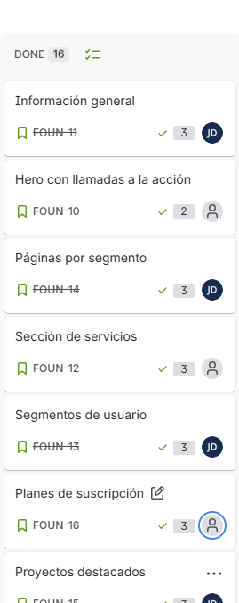
</p>


| User Story |  | Work-Item / Task |  |  |  |  |  |
|------------|--|------------------|--|--|--|--|--|
| Id | Title | Id | Title | Description | Estimation (Hours) | Assigned to | Status |
| US040 | Hero con llamadas a la acción | WI-01 | Implementar sección Hero | Crear la sección principal con título, descripción y botones de "Registrarse" e "Iniciar sesión", incluyendo redirecciones | 4 | Sebastian Pariachi | Done |
| US012 | Información general | WI-02 | Implementar sección información general | Crear sección con descripción de la plataforma, funcionalidades principales y propuesta de valor | 3 | Vitaly Baca | Done |
| US041 | Sección de servicios | WI-03 | Implementar sección de servicios | Mostrar los servicios de la plataforma con cards informativas y opción de expandir detalles | 4 | Jose Bautista | Done |
| US014 | Segmentos de usuario | WI-04 | Implementar sección de segmentos | Crear sección para emprendedor, colaborador e inversionista con navegación dinámica sin recarga | 5 | Jose Bautista / Mauricio Teran | Done |
| US044 | Páginas por segmento | WI-05 | Implementar páginas por segmento | Crear páginas independientes para emprendedor y colaborador con beneficios, pasos y FAQs | 6 | Jose Bautista / Mauricio Teran | Done |
| US013 | Proyectos destacados | WI-05 | Implementar sección de proyectos destacados | Mostrar lista de proyectos con título, descripción y estado; manejar caso sin datos | 5 | Vitaly Baca | Done |
| US043 | Planes de suscripción | WI-06 | Implementar sección de planes | Mostrar plan gratuito y premium con características y botón de acción | 4 | Vitaly Baca | Done |
| US046 | Video introductorio | WI-07 | Implementar sección de video | Integrar video embebido y manejo de error si no carga | 3 | Pierina Almandroz | Done |
| US042 | Equipo del proyecto | WI-08 | Implementar sección equipo | Mostrar perfiles con nombre, rol, foto y descripción | 4 | Pierina Almandroz | Done |
| US045 | Empresas asociadas | WI-09 | Implementar sección de empresas | Mostrar logos en carrusel navegable | 3 | Mauricio Teran | Done |
| US015 | Contacto | WI-10 | Implementar formulario de contacto | Crear formulario con validaciones y mensaje de confirmación | 5 | Sebastian Pariachi | Done |
| US047 | Acceso al prototipo | WI-11 | Implementar acceso a prototipo | Botón que abre el prototipo en nueva pestaña y manejo de error | 2 | Mauricio Teran | Done |
| US048 | Footer | WI-12 | Implementar footer | Agregar redes sociales, contacto y enlaces legales | 3 | Sebastian Pariachi | Done |
| US049 | Asistente virtual | WI-13 | Implementar asistente FAQ | Crear componente con preguntas frecuentes y respuestas predefinidas | 4 | Jose Bautista | Done |
| US050 | Responsividad | WI-14 | Adaptar diseño responsive | Ajustar toda la landing para móvil, tablet y desktop | 6 | Jose Bautista | Done |
| US055 | Sección IoT en vivo | WI-15 | Implementar demo IoT | Simular datos en tiempo real con sensores y mostrar panel dinámico | 6 | Jose Bautista | Done |

#### 5.2.1.4. Development Evidence for Sprint Review
A continuación presentaremos los commits realizados en el repositorio de nuestra Landing Page, todos estos commits se han hecho en la rama “main” durante
el desarrollo de nuestro Sprint 1.

| Repository | Branch | Commit Id | Commit Message | Commit Message Body | Committed On (Date) |
|------------|--------|-----------|----------------|---------------------|---------------------|
| Launchpad-PE-Landing-Page | main | 3393a90 | Initial commit | First commit of the repository | Apr 9, 2026 |
| Launchpad-PE-Landing-Page | main | d172b47 | chore: add html and css file | Initial HTML and CSS files for the project structure | Apr 14, 2026 |
| Launchpad-PE-Landing-Page | main | 5e32bd5 | chore: add Images like members team, Logo of the project and Projects | Added team member photos, project logo, and project images | Apr 14, 2026 |
| Launchpad-PE-Landing-Page | main | 32268ce | chore: add header with logo and the navigation with Inicio, Servicios, Nosotros, loT and Contactos | Adds the main navigation header with logo and nav links | Apr 14, 2026 |
| Launchpad-PE-Landing-Page | main | 44af72e | chore: add configuration in head title, description and put relationship with style.css | Sets up HTML head meta tags and links stylesheet | Apr 14, 2026 |
| Launchpad-PE-Landing-Page | main | 0bc3dcd | feat: add file css to defined colors variables | CSS file with global color custom properties/variables | Apr 14, 2026 |
| Launchpad-PE-Landing-Page | main | 97d8ae0 | feat: add main.css with import with type nomenclature and file locals css | Main CSS entry point with organized imports | Apr 14, 2026 |
| Launchpad-PE-Landing-Page | main | 553fbb3 | feat: add file css to responsive the page main | Responsive stylesheet for main page layout | Apr 14, 2026 |
| Launchpad-PE-Landing-Page | main | 1486461 | feat: add script with javascript main | Main JavaScript file for landing page interactions | Apr 14, 2026 |
| Launchpad-PE-Landing-Page | main | f5d15d5 | feat: add collaborator.html for collaborator page structure | Adds collaborator page | Apr 17, 2026 |
| Launchpad-PE-Landing-Page | main | 927cc2c | feat: add benefits section with detailed collaborator advantages in collaborator.html | Adds benefits section to collaborator page | Apr 17, 2026 |
| Launchpad-PE-Landing-Page | main | c565110 | feat: add steps section detailing collaboration process in collaborator.html | Adds steps section to collaborator page | Apr 17, 2026 |
| Launchpad-PE-Landing-Page | main | 20d6a30 | feat: add IoT section with real-time campaign data and metrics visualization | IoT section with real-time data and metrics | Apr 17, 2026 |
| Launchpad-PE-Landing-Page | main | 29cd613 | feat: add FAQ section with common questions and answers for collaborators | FAQ section with Q&A content for collaborators | Apr 17, 2026 |
| Launchpad-PE-Landing-Page | main | 9f56dd5 | feat: Add modal and drawer functionality with chat integration | Added modal and drawer components with chat integration | Apr 17, 2026 |
| Launchpad-PE-Landing-Page | main | c8defe8 | feat: Implement carousel functionality for project cards | Carousel component for displaying project cards | Apr 17, 2026 |
| Launchpad-PE-Landing-Page | main | 18f4c2b | feat: Add chatbot functionality with interactive responses | Chatbot with interactive responses | Apr 17, 2026 |
| Launchpad-PE-Landing-Page | main | f95b515 | feat(landing): add services section with idea, team and freemium plan cards | Services section with three feature cards | Apr 17, 2026 |
| Launchpad-PE-Landing-Page | main | d2a4392 | feat(landing): add floating chat assistant with FAQ quick-reply options | Floating chat assistant with quick-reply FAQ buttons | Apr 17, 2026 |
| Launchpad-PE-Landing-Page | main | 3c15d64 | feat: add index different sections | Added index for different sections | Apr 18, 2026 |
| Launchpad-PE-Landing-Page | main | 3a99cd6 | feat: add entrepreneur page skeleton | Initial HTML structure for entrepreneur page | Apr 18, 2026 |
| Launchpad-PE-Landing-Page | main | 5121ec4 | feat: add benefits section and card styles entrepreneur | Benefits section and card styles for entrepreneur page | Apr 18, 2026 |
| Launchpad-PE-Landing-Page | main | 1a0aaae | feat: add iot showcase section and styles | IoT showcase section with styles | Apr 18, 2026 |
| Launchpad-PE-Landing-Page | main | 7f8762d | feat: add responsive media queries to entrepreneur.css | Responsive media queries for entrepreneur page | Apr 18, 2026 |
| Launchpad-PE-Landing-Page | main | 831eef6 | feat: implement functional JavaScript scripts | Implemented functional JavaScript for interactive elements | Apr 18, 2026 |
| Launchpad-PE-Landing-Page | main | 570d160 | chore: add components to index.html like navbar, hero, section and footer | Added components to index.html | Apr 18, 2026 |
| Launchpad-PE-Landing-Page | main | a991a79 | feat: add modal styles for enhanced user interaction and layout | Modal CSS styles for improved user experience | Apr 18, 2026 |
| Launchpad-PE-Landing-Page | main | 0b40867 | feat: add styles for services section to enhance layout and user interaction | Services section styles for improved layout and user interaction | Apr 19, 2026 |
| Launchpad-PE-Landing-Page | main | b40cebe | feat: add styles for App and Roles sections to enhance layout and user interaction | App and Roles section styles for improved layout and user interaction | Apr 19, 2026 |
| Launchpad-PE-Landing-Page | main | ac369b5 | feat: Implement styles components css | Styles for various components | Apr 19, 2026 |

#### 5.2.1.5. Execution Evidence for Sprint Review
Lo que se logró en el Sprint 1 es desplegar una primera versión de la landing page. En esta logramos desarrollar la barra navegadora, las secciones establecidas
de la Landing Page y el formulario de contacto. También se adoptó exitosamente la metodología GitFlow, trabajando en la branch principal “main”.


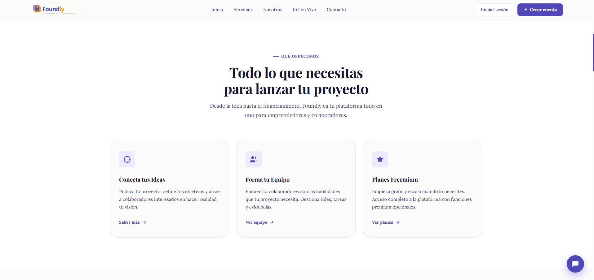
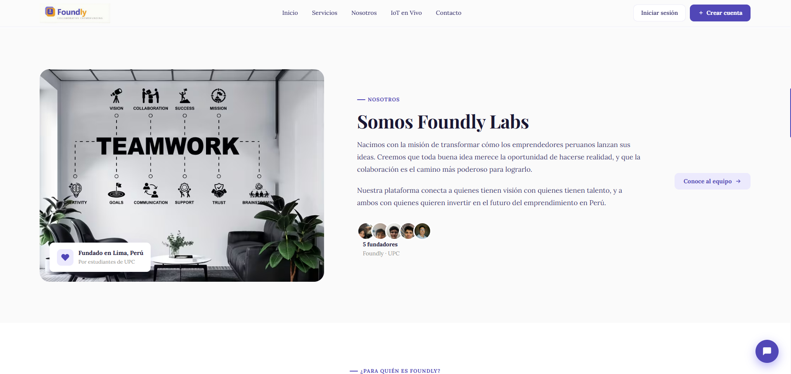
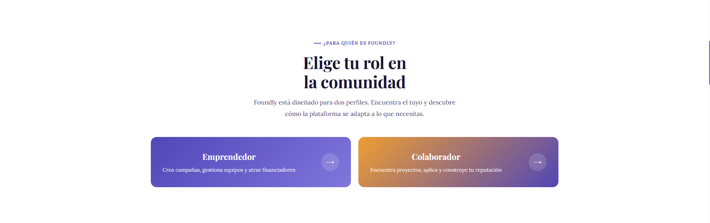
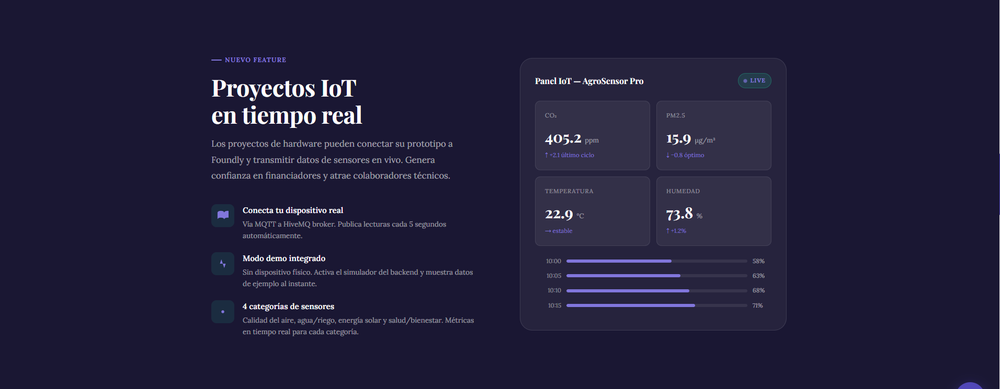
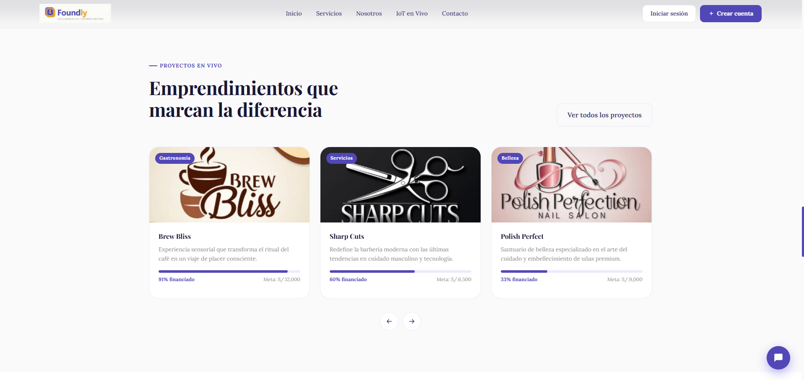
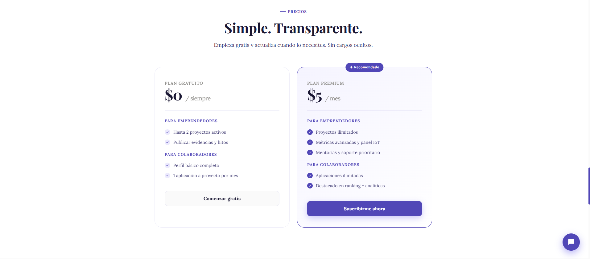

#### 5.2.1.6. Services Documentation Evidence for Sprint Review
Durante el desarrollo del Sprint 1, logramos avances significativos en la creación y configuración del repositorio del proyecto destinado a la Landing Page. Contar con esta base desde el inicio facilitó la organización del trabajo y la estructuración de las ideas del equipo.

En la siguiente etapa, optamos por aprovechar las herramientas colaborativas de GitHub, lo que permitió mejorar la coordinación entre los integrantes. Gracias a esto, se consiguió una implementación fluida y ordenada. Asimismo, al brindar acceso al repositorio a todo el equipo y centralizar el trabajo en la rama principal, los commits se realizaron de manera rápida y sin inconvenientes, permitiendo que cada miembro pudiera visualizar los cambios y el progreso de forma constante.

#### 5.2.1.7. Software Deployment Evidence for Sprint Review
A continuación, detallaremos los procesos realizados a lo largo del Sprint 1: Lo primero que realizamos fue crear dos repositorios en GitHub, uno para nuestro
Landing Page.


Finalmente configuramos GitHub Pages para obtener un enlace directo a la Landing Page, facilitando la revisión continua de los cambios realizados.
Link: https://launchpad-pe.github.io/Launchpad-PE-Landing-Page/ 
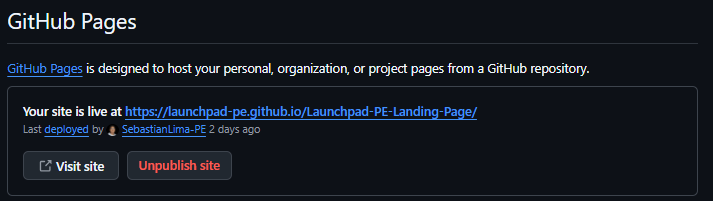

#### 5.2.1.8. Team Collaboration Insights during Sprint
Mediante la sección de Insights de GitHub, se presenta a continuación la evidencia de colaboración del repositorio del Landing Page, mostrando la contribución de cada miembro del equipo durante el desarrollo del Sprint 1.

---

#### Analíticos de GitHub — Report

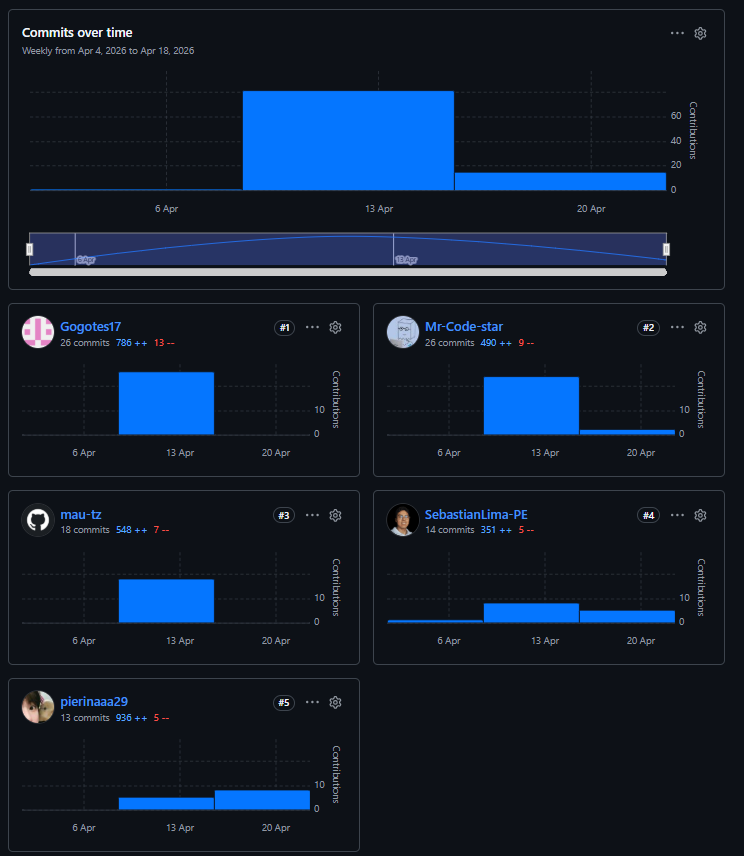

 #### Analíticos de GitHub — Landing Page
 
<p align="center">
  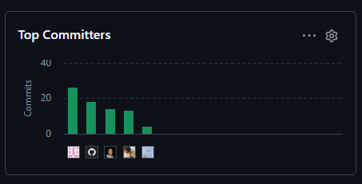
</p>

Las imágenes evidencian la participación de los cinco integrantes del equipo en el desarrollo y despliegue del Landing Page durante el Sprint 1. La distribución de commits refleja una colaboración activa y equitativa entre todos los miembros:

| Integrante | Usuario GitHub | Commits |
|---|---|---|
| Bautista Rivera, Jose Diego | `Gogotes17` | 24 |
| Pariachi Limahuaya, Sebastián Ubaldo | `SebastianLima-PE` | 19 |
| Teran Zavala, Mauricio Alejandro | `mau-tz` | 18 |
| Baca Camargo, Vitaly Arturo | `Mr-Code-star` | 17 |
| Almandroz Carbajal, Pierina Marysabelh | `pierinaaa29` | 16 |

La distribución de commits confirma que todos los integrantes tuvieron participación activa en el Sprint 1, con una diferencia máxima de 8 commits entre el miembro más activo y el menos activo, lo que evidencia un trabajo colaborativo equilibrado a lo largo del sprint.


## 5.2.2. Sprint 2

En esta sección se registra y explica el avance del equipo durante el Sprint 2 
de Foundly, correspondiente al desarrollo de la primera versión funcional del 
Frontend Web Application. A diferencia del Sprint 1, enfocado en el diseño y 
despliegue de la Landing Page, este sprint estuvo orientado a implementar las 
vistas principales de la aplicación web para ambos segmentos objetivo: 
emprendedores y colaboradores.

### 5.2.2.1. Sprint Planning 2

En esta sección se presentan los detalles del Sprint Planning Meeting 2, en el cual 
el equipo definió el objetivo, la capacidad y las User Stories a incluir en esta 
iteración, enfocada en el desarrollo del Frontend Web Application de Foundly.

| Sprint # | Sprint 2 |
|---|---|
| **Sprint Planning Background** | |
| Date | 2026-05-05 |
| Time | 5:00 PM |
| Location | Reunión virtual mediante Discord |
| Prepared By | Baca Camargo, Vitaly Arturo |
| Attendees (to planning meeting) | Almandroz Carbajal, Pierina Marysabel / Baca Camargo, Vitaly Arturo / Bautista Rivera, Jose Diego / Pariachi Limahuaya, Sebastian Ubaldo / Teran Zavala, Mauricio Alejandro |
| Sprint 1 Review Summary | Durante el Sprint 1 se logró implementar y desplegar en su totalidad la Landing Page de Foundly, cubriendo todas las secciones planificadas: hero con llamadas a la acción, servicios con modales, planes de suscripción, páginas específicas por segmento (emprendedor y colaborador), carrusel de empresas asociadas, video introductorio, sección de la aplicación, asistente virtual y footer completo con contacto, redes sociales y documentación legal. Se aseguró el diseño responsivo para dispositivos móviles y de escritorio, y la página quedó correctamente desplegada en el hosting. Todos los enlaces, modales y navegación funcionan correctamente. |
| Sprint 1 Retrospective Summary | El equipo logró completar el Sprint 1 de forma coordinada y dentro de los plazos establecidos. Cada integrante cumplió con las secciones asignadas, lo que permitió integrar la landing page sin inconvenientes. Como oportunidad de mejora, el equipo acordó mantener revisiones periódicas en Discord para detectar bloqueos tempranos y mejorar la comunicación continua durante el Sprint 2, especialmente dado el mayor volumen de trabajo que implica el desarrollo del frontend de la Web Application. |
| **Sprint Goal & User Stories** | |
| Sprint 2 Goal | Nuestro enfoque está en entregar la primera versión funcional del Frontend Web Application de Foundly, integrada con una Fake API mediante db.json. Creemos que esto proporciona una experiencia navegable e interactiva tanto para emprendedores como para colaboradores, permitiéndoles explorar las funcionalidades principales de la plataforma. Esto se confirmará cuando los usuarios autenticados puedan registrarse, iniciar sesión, crear y explorar proyectos, gestionar su perfil, visualizar el panel IoT y navegar por las vistas del colaborador sin errores. |
| Sprint 2 Velocity | 40 |
| Sum of Story Points | 38 |

---

### 5.2.2.2. Aspect Leaders and Collaborators

Durante el Sprint 2, el equipo organizó el trabajo en torno al desarrollo del 
Frontend Web Application de Foundly, estructurado en cinco aspectos principales: 
autenticación e IAM, gestión de proyectos, vistas del colaborador, panel IoT y 
gestión del perfil de usuario. Con el fin de mantener una coordinación efectiva, 
se estructuró la matriz de liderazgo y colaboración (LACX), donde se asignó un 
líder (L) por cada aspecto y colaboradores (C) que brindan apoyo en su 
implementación.

| Team Member | GitHub Username | IAM & Auth | Gestión de proyectos | Vistas colaborador | Panel IoT | Perfil de usuario |
|---|---|---|---|---|---|---|
| Almandroz Carbajal, Pierina Marysabel | pierinaaa29 | C | C | C | C | C |
| Baca Camargo, Vitaly Arturo | VitalyBaca | C | L | C | C | C |
| Bautista Rivera, Jose Diego | JoseDiegoBautista | L | C | C | C | C |
| Pariachi Limahuaya, Sebastian Ubaldo | SebastianLima-PE | C | C | C | L | C |
| Teran Zavala, Mauricio Alejandro | mau-tz | C | C | L | C | L |

---

### 5.2.2.3. Sprint Backlog 2

El objetivo principal del Sprint 2 es implementar el Frontend Web Application de 
Foundly integrado con una Fake API mediante db.json, cubriendo los flujos 
principales de la plataforma para ambos segmentos objetivo. A continuación se 
presenta el tablero de control del sprint:

**URL del Sprint Board:** https://trello.com/b/XXXXXXXX/foundly-product-backlog


| User Story ID | User Story Title | Task ID | Task Title | Description | Estimation (Hours) | Assigned To | Status |
|---|---|---|---|---|---|---|---|
| US001 | Registro de usuario | T011 | Vista de registro | Implementar la vista de registro con validación de campos obligatorios integrada con fake API. | 5 | Bautista Rivera, Jose Diego | Done |
| US002 | Inicio de sesión | T012 | Vista de login | Implementar la vista de inicio de sesión con autenticación simulada mediante db.json. | 5 | Bautista Rivera, Jose Diego | Done |
| US003 | Cierre de sesión | T013 | Funcionalidad logout | Implementar el cierre de sesión con invalidación del estado de autenticación en el frontend. | 4 | Bautista Rivera, Jose Diego | Done |
| US004 | Crear proyecto | T014 | Vista creación de proyecto | Desarrollar la vista de creación de proyecto con formulario y validación integrada con fake API. | 6 | Baca Camargo, Vitaly Arturo | Done |
| US005 | Publicar proyecto | T015 | Funcionalidad publicar proyecto | Implementar la acción de publicación de proyecto con cambio de estado en db.json. | 5 | Baca Camargo, Vitaly Arturo | Done |
| US006 | Buscar proyectos | T016 | Vista explorar proyectos | Desarrollar la vista de exploración de proyectos con listado obtenido desde fake API. | 5 | Baca Camargo, Vitaly Arturo | Done |
| US007 | Postularse a proyecto | T017 | Funcionalidad postulación | Implementar la acción de postulación a un proyecto con registro en db.json. | 5 | Teran Zavala, Mauricio Alejandro | Done |
| US008 | Gestionar postulaciones | T018 | Vista gestión de postulaciones | Desarrollar la vista de revisión, aceptación y rechazo de postulaciones para el emprendedor. | 5 | Teran Zavala, Mauricio Alejandro | Done |
| US021 | Perfil de usuario | T019 | Vista de perfil | Implementar la vista de perfil con información personal, proyectos activos y colaboraciones. | 5 | Teran Zavala, Mauricio Alejandro | Done |
| US022 | Edición de perfil | T020 | Funcionalidad editar perfil | Desarrollar la funcionalidad de edición de perfil con actualización en fake API. | 4 | Teran Zavala, Mauricio Alejandro | Done |
| US055 | Landing Page – IoT en vivo | T021 | Panel IoT demo | Implementar la vista del panel IoT con datos simulados actualizándose en tiempo real. | 6 | Pariachi Limahuaya, Sebastian Ubaldo | Done |
| US009 | Gestionar hitos | T022 | Vista gestión de hitos | Desarrollar la vista de creación y administración de hitos con integración a fake API. | 5 | Pariachi Limahuaya, Sebastian Ubaldo | Done |
| US023 | Buscar proyectos con filtros | T023 | Filtros de búsqueda | Implementar filtros de búsqueda por categoría, habilidades y duración en la vista de proyectos. | 4 | Baca Camargo, Vitaly Arturo | Done |
| US024 | Notificaciones | T024 | Vista de notificaciones | Implementar la vista de notificaciones con listado obtenido desde fake API. | 4 | Bautista Rivera, Jose Diego | Done |

---

### 5.2.2.4. Development Evidence for Sprint Review

En esta sección se presentan los commits realizados en el repositorio del 
Frontend Web Application durante el Sprint 2, evidenciando los aportes de cada 
miembro del equipo en la implementación de las vistas y funcionalidades.

| Repository | Branch | Commit ID | Commit Message | Commit Message Body | Committed on (Date) |
|---|---|---|---|---|---|
| VitalyBaca/foundly-frontend | feature/project-management | a1b2c3d | feat: add project creation view | Implements project creation form with fake API integration | 2026-05-06 |
| VitalyBaca/foundly-frontend | feature/project-management | e4f5g6h | feat: add project listing view | Implements project exploration view with filtering | 2026-05-08 |
| JoseDiegoBautista/foundly-frontend | feature/iam | i7j8k9l | feat: add login view | Implements login view with simulated authentication | 2026-05-07 |
| JoseDiegoBautista/foundly-frontend | feature/iam | m1n2o3p | feat: add register view | Implements registration form with field validation | 2026-05-09 |
| SebastianLima-PE/foundly-frontend | feature/iot-panel | q4r5s6t | feat: add IoT panel view | Implements IoT panel with simulated real-time sensor data | 2026-05-10 |
| SebastianLima-PE/foundly-frontend | feature/iot-panel | u7v8w9x | feat: add milestone management view | Implements milestone creation and tracking view | 2026-05-12 |
| mau-tz/foundly-frontend | feature/collaborator-views | y1z2a3b | feat: add collaborator profile view | Implements collaborator profile with reputation score | 2026-05-11 |
| mau-tz/foundly-frontend | feature/collaborator-views | c4d5e6f | feat: add application management view | Implements accept/reject application flow for entrepreneurs | 2026-05-13 |

> **Nota:** Reemplazar los Commit IDs con los reales obtenidos del repositorio de GitHub.

---

### 5.2.2.5. Execution Evidence for Sprint Review

Durante el Sprint 2 se logró implementar la primera versión funcional del 
Frontend Web Application de Foundly, integrado con una Fake API mediante 
db.json. Las principales vistas implementadas incluyen el registro e inicio de 
sesión, la exploración y creación de proyectos, la gestión de postulaciones, 
el perfil de usuario, el panel IoT con datos simulados y la gestión de hitos.

A continuación se presentan las capturas de las principales vistas implementadas:


**URL del video de navegación del Sprint 2:**
[https://microsoft-stream-url/sprint2-navigation](https://microsoft-stream-url)

---

### 5.2.2.6. Services Documentation Evidence for Sprint Review

Durante el Sprint 2, el backend no fue implementado con servicios reales. 
El equipo utilizó una Fake API mediante db.json integrada con JSON Server 
para simular los endpoints del RESTful API durante el desarrollo del frontend. 
La documentación completa de los endpoints reales será incluida en el Sprint 3, 
una vez que el backend con Spring Boot esté desplegado.

| Endpoint simulado | Verbo HTTP | Descripción | URL local |
|---|---|---|---|
| /projects | GET | Lista todos los proyectos | http://localhost:3000/projects |
| /projects | POST | Crea un nuevo proyecto | http://localhost:3000/projects |
| /projects/:id | GET | Obtiene detalle de un proyecto | http://localhost:3000/projects/:id |
| /users | GET | Lista todos los usuarios | http://localhost:3000/users |
| /users/:id | GET | Obtiene perfil de un usuario | http://localhost:3000/users/:id |
| /applications | GET | Lista postulaciones | http://localhost:3000/applications |
| /applications | POST | Registra una postulación | http://localhost:3000/applications |
| /milestones | GET | Lista hitos de un proyecto | http://localhost:3000/milestones |
| /milestones | POST | Crea un hito | http://localhost:3000/milestones |
| /notifications | GET | Lista notificaciones del usuario | http://localhost:3000/notifications |

---

### 5.2.2.7. Software Deployment Evidence for Sprint Review

Durante el Sprint 2 se realizó el despliegue de la primera versión del 
Frontend Web Application de Foundly. El proceso incluyó la configuración 
del entorno de despliegue y la publicación de la aplicación en la plataforma 
indicada.

A continuación se presentan las capturas del proceso de despliegue:


**URL del Frontend Web Application desplegado:**
https://foundly-app.netlify.app (reemplazar con URL real)

---

### 5.2.2.8. Team Collaboration Insights during Sprint

Durante el Sprint 2, el equipo colaboró activamente en el repositorio del 
Frontend Web Application de Foundly. A continuación se presentan los 
analíticos de colaboración y commits realizados por los miembros del equipo 
en GitHub durante este sprint.


**URL del repositorio del Frontend Web Application:**
https://github.com/org-foundly/foundly-frontend (reemplazar con URL real)
