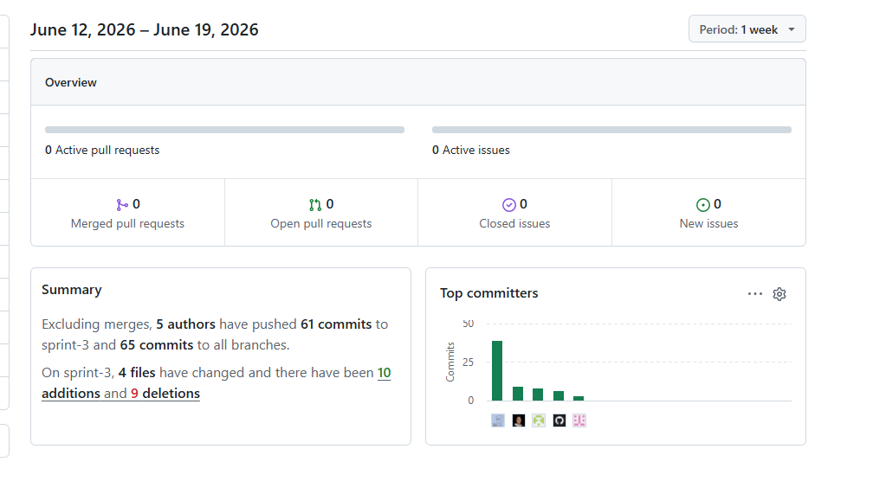

**Universidad Peruana de Ciencias Aplicadas** 
**Carrera de Ingeniería de Software**

**1ASI0729** 
**Desarrollo de Aplicaciones Open Source** 
NRC 
**10177** 
**Informe del Trabajo Final** 
Docente 
**Mori Paiva, Hugo Allan** 
Equipo 
**Launchpad-PE**

Proyecto 
**Foundly**

 **Integrantes**
|Código| Apellidos y Nombres                      |  
|----------| ------------------------------------ |
|u202316845| Almandroz Carbajal, Pierina Marysabel| 
|u20231C426| Baca Camargo, Vitaly Arturo          |
|u202310949| Bautista Rivera, Jose Diego          |
|u202314115| Pariachi Limahuaya, Sebastian Ubaldo |
|u202417423| Teran Zavala, Mauricio Alejandro     | 
|u202313458| Taipe Sangama Jorge Francisco        |

**Período 202610**  

**Junio 2026**

# Registro de Versiones del Informe

| Versión | Fecha | Autores | Descripción de modificación |
|---|---|---|---|
| AV1 | 15/03/2026 | Almandroz Carbajal, Pierina Marysabel Baca Camargo, Vitaly Arturo Bautista Rivera, Jose Diego Pariachi Limahuaya, Sebastián Ubaldo Teran Zavala, Mauricio Alejandro | Para la AV1 se creó la estructura completa del informe incluyendo carátula, registro de versiones, tabla de contenidos y Student Outcomes.  **Capítulo I — Introducción:** Se redactó el Startup Profile, Solution Profile, Lean UX Process y segmentos objetivo.  **Capítulo II — Requirements Elicitation & Analysis:** Se elaboró el análisis de competidores, diseño y registro de entrevistas, needfinding (User Personas, Task Matrix, Journey Mapping, Empathy Mapping), Big Picture Event Storming y Ubiquitous Language.  **Capítulo III — Requirements Specification:** Se desarrollaron las User Stories, Impact Mapping y Product Backlog.  **Capítulo IV — Product Design:** Se completaron las Style Guidelines, Information Architecture, Landing Page UI Design, Web Applications UX/UI Design, Web Prototyping, Domain-Driven Software Architecture, Software Object-Oriented Design y Database Design.  **Capítulo V — Product Implementation:** Se realizó el Software Configuration Management y la evidencia del Sprint 1, incluyendo planning, backlog, development evidence, execution evidence, services documentation, deployment evidence y collaboration insights.  Finalmente, se añadieron conclusiones preliminares, bibliografía y anexos. |
| TB1 | 12/05/2026 | Baca Camargo, Vitaly Arturo Bautista Rivera, Jose Diego Pariachi Limahuaya, Sebastián Ubaldo Teran Zavala, Mauricio Alejandro | Para la AV2 el enfoque principal fue el desarrollo frontend de la aplicación web utilizando Angular como framework y JSON Server como API simulada para el consumo de datos.  Capítulo V — Product Implementation, Validation & Deployment: Se llevó a cabo el Sprint Planning 2, donde se definieron los objetivos y se distribuyeron las tareas del equipo para este ciclo. A partir de ello se elaboró el Sprint Backlog 2 con las historias de usuario priorizadas para esta entrega.  En cuanto al desarrollo, se implementaron las siguientes secciones de la aplicación web: Login y Register (autenticación de usuarios con formularios reactivos), Dashboard principal (vista general del sistema con acceso a las funcionalidades clave), Perfil de usuario (visualización y edición de datos personales) y Creación de proyectos (módulo para registrar y configurar nuevos proyectos dentro de la plataforma).  Se estableció la conexión con JSON Server mediante servicios HTTP en Angular, implementando operaciones GET, POST, PUT y DELETE para la gestión de datos en cada módulo. Asimismo, se aplicaron criterios de Responsive Design para garantizar una experiencia de usuario adaptada a distintos tamaños de pantalla.  Finalmente, se documentó la evidencia de desarrollo, evidencia de ejecución, documentación de servicios, evidencia de despliegue y los collaboration insights del equipo durante el sprint. |
| AV2 | 19/06/2026 | Baca Camargo, Vitaly Arturo Bautista Rivera, Jose Diego Pariachi Limahuaya, Sebastián Ubaldo Teran Zavala, Mauricio Alejandro | Para la AV2 el enfoque principal fue el desarrollo del Backend Web Service de Foundly utilizando Spring Boot, aplicando los principios de Domain-Driven Design (DDD), arquitectura por capas y persistencia de datos mediante MySQL.  **Capítulo V — Product Implementation, Validation & Deployment:** Se llevó a cabo el Sprint Planning 3, donde se definieron los objetivos técnicos del backend y la distribución de responsabilidades del equipo. A partir de ello se elaboró el Sprint Backlog 3 con las historias de usuario priorizadas para la implementación de los servicios backend.  Durante este sprint se desarrollaron e integraron los bounded contexts de **Identity and Access Management (IAM), Projects, Profiles, Comments y Environmental Monitoring**, implementando entidades de dominio, repositorios, servicios de aplicación, controladores REST y persistencia de datos mediante Spring Data JPA y MySQL.  Asimismo, se implementó la autenticación y autorización basada en **JWT y Spring Security**, permitiendo el registro e inicio de sesión seguro de usuarios. También se desarrolló la documentación de servicios mediante **OpenAPI/Swagger**, facilitando la validación y prueba de los endpoints REST del sistema.  Como parte de las actividades de despliegue, se configuró la contenerización del proyecto utilizando **Docker**, la gestión de variables de entorno para producción y el despliegue automático del backend en **Railway**, incluyendo la integración con una base de datos MySQL en la nube.  Finalmente, se documentó la evidencia de desarrollo, evidencia de ejecución, documentación de servicios, evidencia de despliegue, entrevistas de validación con usuarios y los collaboration insights del equipo durante el Sprint 3, verificando el correcto funcionamiento de la arquitectura backend y los servicios implementados. |
| TB2 | 05/07/2026 | Almandroz Carbajal, Pierina Marysabel Baca Camargo, Vitaly Arturo Bautista Rivera, Jose Diego Pariachi Limahuaya, Sebastián Ubaldo Teran Zavala, Mauricio Alejandro Taipe Sangama, Jorge Francisco | Para la TB2, el equipo completó la culminación de los Bounded Contexts pendientes del Backend Web Service y continuó con la integración y refinamiento del Frontend Web Application de Foundly.  **Capítulo V — Product Implementation, Validation & Deployment:** Se llevó a cabo el Sprint Planning 4, completando la arquitectura completa del backend. Durante este sprint se implementaron y finalizaron los bounded contexts de **Applications (postulaciones a proyectos), Milestones (gestión de hitos), Tasks (gestión de tareas) y Messaging (chat en tiempo real)**.  Se aplicaron rigurosos principios de **Domain-Driven Design (DDD)** y el patrón **CQRS (Command Query Responsibility Segregation)** para garantizar una separación clara entre comandos y consultas. Se completaron todas las capas arquitectónicas: dominio (agregados, value objects, comandos y queries), aplicación (servicios de comando y consulta), infraestructura (entidades JPA, assemblers, repositorios) e interfaces (controladores REST y resources).  **Frontend Web Application:** Se resolvió la deuda técnica del Sprint 3 mediante la implementación de componentes de Timeline para hitos, renderizado dinámico de tareas por estado, integración mejorada de APIs y refinamiento de componentes de usuario (perfiles, favoritos, postulaciones).  **Messaging Bounded Context:** Se implementó un nuevo módulo de mensajería que permite comunicación en tiempo real entre usuarios mediante **WebSocket (STOMP)** y endpoints REST, incluyendo capa de persistencia y anti-corruption layer (ACL) para integración con IAM.  **Mejoras de Seguridad:** Se refactorizaron identificadores de tipo Long a String basados en **UUID**, se mejoró el control de acceso restringiendo operaciones al creador de tareas (emprendedor), se agregaron endpoints de reprogramación y completitud de tareas.  **Configuración e Internacionalización:** Se implementaron mensajes de validación internacionalizados (en/es) mediante messages.properties, optimización de CORS y configuración final para despliegue en Railway.  Se documentó completamente la evidencia de desarrollo, ejecución, documentación de servicios, despliegue en Railway, entrevistas de validación y los collaboration insights del equipo durante el Sprint 4, consolidando una plataforma completa, modular y lista para producción. | |

# Project Report Collaboration Insights

Para el desarrollo del **Project Report**, el equipo utiliza un repositorio dentro de la organización en GitHub. A continuación, se presenta la evidencia de colaboración correspondiente al **TB1**, en coherencia con el **Registro de Versiones del Informe**.

**Repositorio del informe del proyecto:** https://github.com/Launchpad-PE/Report

- **Total de commits:** 257
- **Autores contribuyentes:**
  - Vitaly Arturo Baca Camargo ( `Mr-Code-star` )
  - Bautista Rivera, Jose Diego ( `Gogotes17` )
  - Sebastián Ubaldo Pariachi Limahuaya ( `SebastianLima-PE` )
  - Ariana Lizeth Ramírez Carrasco ( `pierinaaa29` )
  - Mauricio Alejandro Teran Zavala ( `mau-tz` )
- La actividad se distribuyó en ramas temáticas por secciones del informe, asegurando revisiones cruzadas mediante *pull requests*.

---

## AV1 — Informe inicial (Semana 4)

Durante esta fase, el equipo elaboró el **informe inicial**, que incluyó los siguientes aspectos:

- **Carátula** con información institucional y de la startup.
- **Registro de Versiones del Informe**, documentando los cambios realizados.
- **Contenido preliminar** con tabla de contenidos, *Student Outcomes* y Capítulo I (*Introducción*).
- **Capítulo II** con los primeros avances en *Requirements Elicitation & Analysis*.
- **Capítulo III** con la especificación de requisitos, User Stories y Product Backlog.
- **Capítulo IV** con los avances en *Product Design*, incluyendo Style Guidelines, wireframes y mockups.
- **Capítulo V** con los avances del Product Implementation, Validation & Deployment.
- *\*Conclusiones preliminares, bibliografía y anexos.*

A continuación se presenta la captura de los analíticos de colaboración y commits en GitHub para este entregable:

.png)

| Integrante | Usuario GitHub | Commits | Adiciones | Eliminaciones |
|---|---|---|---|---|
| Vitaly Arturo Baca Camargo | `Mr-Code-star` | 189 | 4872 | 419 |
| Bautista Rivera, Jose Diego | `Gogotes17` | 34 | 630 | 20 |
| Sebastián Ubaldo Pariachi Limahuaya | `SebastianLima-PE` | 23 | 382 | 75 |
| Almandroz Carbajal, Pierina Marysabel | `pierinaaa29` | 6 | 247 | 49 |
| Mauricio Alejandro Teran Zavala | `mau-tz` | 5 | 127 | 4 |

La colaboración fue activa y equitativa, con aportes sustanciales de todos los integrantes en la redacción y organización del informe.

---

## TB1 — Informe Parcial (Semana 7)

Durante esta fase, el equipo elaboró el **informe Parcial**, que incluyó los siguientes aspectos:

- **Registro de Versiones del Informe**, documentando los cambios realizados.
- **Contenido preliminar** con tabla de contenidos y *Student Outcomes*.
- **Capítulo III** con corrección de nomenclatura y estructura correcta para User Stories y Product Backlog.
- **Capítulo V** con las actualizaciones del Sprint 2 Product Implementation, Validation & Deployment.
- *\*Conclusiones preliminares, bibliografía y anexos.*

A continuación se presenta la captura de los analíticos de colaboración y commits en GitHub para este entregable:

.png)

| Integrante | Usuario GitHub | Commits | Adiciones | Eliminaciones |
|---|---|---|---|---|
| Vitaly Arturo Baca Camargo | `Mr-Code-star` | 28 | 22129 | 4025 |
| Jose Diego Bautista Rivera | `Gogotes17` | 15 | 1813 | 11 |
| Sebastián Ubaldo Pariachi Limahuaya | `SebastianLima-PE` | 2 | 2435 | 401 |
| Mauricio Alejandro Teran Zavala | `mau-tz` | 5 | 3524 | 2566 |

La colaboración fue activa para los 4 integrantes mencionados, con aportes sustanciales de todos los integrantes en la redacción y organización del informe.

---

## AV2 — (Semana 12)

Durante esta fase, el equipo desarrolló y consolidó la primera versión funcional de la plataforma Foundly, incluyendo avances en análisis, diseño, implementación, validación y despliegue del producto. Los principales aspectos desarrollados fueron:

- Definición y planificación de las actividades correspondientes al Sprint 3.
- Asignación de responsabilidades mediante Aspect Leaders y colaboradores del equipo.
- Elaboración y seguimiento del Sprint Backlog.
- Implementación de la primera versión funcional del Frontend Web Application de Foundly.
- Desarrollo del Backend Web Service utilizando Spring Boot y una arquitectura basada en Domain-Driven Design (DDD).
- Implementación de los bounded contexts de Identity and Access Management (IAM), Projects, Profiles, Comments y Environmental Monitoring.
- Documentación de servicios REST mediante Swagger/OpenAPI.
- Despliegue del Backend en Railway utilizando Docker y base de datos MySQL.
- Realización de entrevistas de validación con usuarios pertenecientes al segmento objetivo.
- Ejecución de evaluaciones heurísticas para identificar oportunidades de mejora en la experiencia de usuario.
- Elaboración del Video About-the-Product mostrando las funcionalidades implementadas.
- Elaboración del Video About-the-Team presentando la organización y contribuciones de los integrantes.

A continuación, se presenta la captura de los analíticos de colaboración y commits en GitHub correspondientes a este entregable.

| Integrante                          | Usuario GitHub   | Commits |
| ----------------------------------- | ---------------- | ------- |
| Vitaly Arturo Baca Camargo          | Mr-Code-star     | 38      |
| Mauricio Alejandro Teran Zavala     | mau-tz           | 9       |
| Ariana Lizeth Ramírez Carrasco      | pierinaaa29      | 8       |
| Sebastián Ubaldo Paricchi Limahuaya | SebastianLima-PE | 7       |
| Bautista Rivera Jose Diego          | Gogotes17        | 3       |

La colaboración del equipo durante el Sprint 3 fue constante y efectiva, permitiendo completar la implementación de los principales componentes del sistema. Los avances abarcaron el desarrollo del frontend, backend, documentación de servicios, despliegue en la nube, validación con usuarios y actividades de aseguramiento de calidad, contribuyendo significativamente al progreso del producto.

---

## TB2 — Informe Final (Semana 15)

Durante esta fase, el equipo completó la culminación de los Bounded Contexts pendientes del Backend Web Service y continuó con la integración del Frontend Web Application. Los principales aspectos desarrollados fueron:

- Definición y planificación de las actividades correspondientes al Sprint 4.
- Asignación de responsabilidades mediante Aspect Leaders y colaboradores del equipo.
- Elaboración y seguimiento del Sprint Backlog con historias de usuario de alta prioridad.
- **Implementación del Bounded Context de Applications:** Gestión de postulaciones a proyectos con agregados, servicios CQRS, repositorios y endpoints REST.
- **Implementación del Bounded Context de Milestones:** Gestión completa de hitos de proyectos con validaciones de dominio, transiciones de estado y endpoints para creación, actualización, eliminación y reschedule.
- **Refinamiento del Bounded Context de Tasks:** Mejoras en seguridad, control de acceso restringido al creador, endpoints PATCH para reprogramación y POST para marcar entregas completadas.
- **Implementación del Bounded Context de Messaging:** Nuevo módulo de chat en tiempo real mediante WebSocket (STOMP), endpoints REST, persistencia de mensajes y anti-corruption layer (ACL) para integración con IAM.
- **Refactorización de Identificadores:** Migración de IDs de Long a String basados en UUID en Applications, Tasks y Milestones.
- **Internacionalización y Configuración:** Implementación de mensajes de validación internacionalizados (en/es), optimización de CORS y configuración final para despliegue en Railway.
- **Frontend Web Application:** Resolución de deuda técnica del Sprint 3, implementación de componentes visuales (Timeline de hitos), renderizado dinámico de tareas, integración de APIs mejorada.
- **Documentación de Servicios:** Actualización completa de la documentación OpenAPI/Swagger con todos los nuevos endpoints de los bounded contexts finales.
- **Despliegue en Producción:** Continuidad del despliegue del Backend en Railway con base de datos MySQL y optimización de variables de entorno.
- **Evidencia de Validación:** Realización de entrevistas de validación con usuarios pertenecientes a ambos segmentos objetivo.
- **Ejecución de Evaluaciones Heurísticas:** Identificación de oportunidades de mejora en la experiencia de usuario basadas en principios UX.
- **Elaboración de Videos de Demostración:** Videos técnicos mostrando funcionalidades de Sprint 4, videos de presentación del equipo y demostración del producto completo.

A continuación, se presenta la captura de los analíticos de colaboración y commits en GitHub correspondientes a este entregable.

### Frontend Web Application - Project Report Collaboration Insights (Sprint 4)

| Integrante                          | Usuario GitHub   | Commits | Rol Principal                                |
| ----------------------------------- | ---------------- | ------- | -------------------------------------------- |
| Vitaly Arturo Baca Camargo          | Mr-Code-star     | ~45     | Arquitecto Frontend, Milestones módulo       |
| Almandroz Carbajal, Pierina Marysabel | pierinaaa29    | ~40     | Desarrollo de Applications y Task Management |
| Bautista Rivera Jose Diego          | Gogotes17        | ~25     | UI Timeline de Hitos, Integración Frontend   |
| Taipe Sangama, Jorge Francisco      | CamotinFurious   | ~20     | Integración de Servicios, Configuración      |
| Sebastián Ubaldo Pariachi Limahuaya | SebastianLima-PE | ~8      | Características Puntuales, Mejoras           |
| Mauricio Alejandro Teran Zavala     | mau-tz           | ~4      | Soporte Técnico, Mantenimiento              |

**Resumen de Actividad Frontend:**
- **Total de commits:** ~142 commits en rama develop
- **Commits totales en todas las ramas:** ~168
- **Período:** 28 de junio – 5 de julio de 2026
- **Enfoque:** Completar deuda técnica de Sprint 3, integración de APIs del backend finalizado, componentes visuales avanzados.

La colaboración fue constante y efectiva, permitiendo completar todas las funcionalidades pendientes del frontend y su integración total con el backend finalizado de Foundly.

### Backend Web Service - Project Report Collaboration Insights (Sprint 4)

| Integrante                          | Usuario GitHub   | Commits | Rol Principal                          |
| ----------------------------------- | ---------------- | ------- | -------------------------------------- |
| Vitaly Arturo Baca Camargo          | Mr-Code-star     | ~12     | Bounded Context Milestones (Completo) |
| Almandroz Carbajal, Pierina Marysabel | pierinaaa29    | ~8      | Bounded Context Applications y Tasks   |
| Sebastián Ubaldo Pariachi Limahuaya | SebastianLima-PE | ~6      | Bounded Context Messaging (WebSocket) |
| Bautista Rivera Jose Diego          | Gogotes17        | ~3      | Refactorización UUID, Mejoras         |
| Taipe Sangama, Jorge Francisco      | CamotinFurious   | ~2      | Configuración, Infraestructura        |

**Resumen de Actividad Backend:**
- **Total de commits:** 31 commits en rama develop
- **Commits totales en todas las ramas:** 52
- **Período:** 28 de junio – 5 de julio de 2026
- **Enfoque:** Implementación y finalización de Bounded Contexts pendientes, consolidación de arquitectura DDD completa.

El equipo completó exitosamente la implementación de todos los Bounded Contexts del Backend Web Service, consolidando una arquitectura modular, segura y completamente funcional que soporta la totalidad de las operaciones de la plataforma Foundly.

---

# Tabla de Contenidos

## [Capítulo I: Introducción](01-Chapter-1-Introducción.md#capítulo-i-introducción)

- [1.1. Startup Profile](01-Chapter-1-Introducción.md#11-startup-profile)
  - [1.1.1. Descripción de la Startup](01-Chapter-1-Introducción.md#111-descripcion-del-startup)
  - [1.1.2. Perfiles de integrantes del equipo](01-Chapter-1-Introducción.md#112-perfiles-de-integrantes-del-equipo)
- [1.2. Solution Profile](01-Chapter-1-Introducción.md#12-solution-profile)
  - [1.2.1. Antecedentes y problemática](01-Chapter-1-Introducción.md#121-antecedentes-y-problemática)
  - [1.2.2. Lean UX Process](01-Chapter-1-Introducción.md#122-lean-ux-process)
    - [1.2.2.1. Lean UX Problem Statements](01-Chapter-1-Introducción.md#1221-lean-ux-problem-statements)
    - [1.2.2.2. Lean UX Assumptions](01-Chapter-1-Introducción.md#1222-lean-ux-assumptions)
    - [1.2.2.3. Lean UX Hypothesis Statements](01-Chapter-1-Introducción.md#1223-lean-ux-hypothesis-statements)
    - [1.2.2.4. Lean UX Canvas](01-Chapter-1-Introducción.md#1224-lean-ux-canvas)
- [1.3. Segmentos objetivo](01-Chapter-1-Introducción.md#13-segmentos-objetivos)

---

## [Capítulo II: Requirements Elicitation & Analysis](02-Chapter-2-Requirements-Elicitation-Analysis.md#capítulo-ii-requirements-elicitation--analysis)

- [2.1. Competidores](02-Chapter-2-Requirements-Elicitation-Analysis.md#21-competidores)
  - [2.1.1. Análisis competitivo](02-Chapter-2-Requirements-Elicitation-Analysis.md#211-analisis-competitivo)
  - [2.1.2. Estrategias y tácticas frente a competidores](02-Chapter-2-Requirements-Elicitation-Analysis.md#212-estrategias-y-tácticas-frente-a-competidores)
- [2.2. Entrevistas](02-Chapter-2-Requirements-Elicitation-Analysis.md#22-entrevistas)
  - [2.2.1. Diseño de entrevistas](02-Chapter-2-Requirements-Elicitation-Analysis.md#221-diseño-de-entrevistas)
  - [2.2.2. Registro de entrevistas](02-Chapter-2-Requirements-Elicitation-Analysis.md#222-registro-de-entrevistas)
  - [2.2.3. Análisis de entrevistas](02-Chapter-2-Requirements-Elicitation-Analysis.md#223-análisis-de-entrevistas)
- [2.3. Needfinding](02-Chapter-2-Requirements-Elicitation-Analysis.md#23-needfinding)
  - [2.3.1. User Personas](02-Chapter-2-Requirements-Elicitation-Analysis.md#231-user-personas)
  - [2.3.2. User Task Matrix](02-Chapter-2-Requirements-Elicitation-Analysis.md#232-user-task-matrix)
  - [2.3.3. User Journey Mapping](02-Chapter-2-Requirements-Elicitation-Analysis.md#233-user-journey-mapping)
  - [2.3.4. As-is Scenario Mapping](02-Chapter-2-Requirements-Elicitation-Analysis.md#234-as---is-scemario-mapping)
  - [2.3.5. Empathy Mapping](02-Chapter-2-Requirements-Elicitation-Analysis.md#235-empathy-mapping)
- [2.4. Big Picture Event Storming](02-Chapter-2-Requirements-Elicitation-Analysis.md#24-big-picture-EventStorming)
- [2.5. Ubiquitous Language](02-Chapter-2-Requirements-Elicitation-Analysis.md#25-ubiquitous-language)

---

## [Capítulo III: Requirements Specification](03-Chapter-3-Requirements-Specification.md#capítulo-iii-requirements-specification)

- [3.1. User Stories](03-Chapter-3-Requirements-Specification.md#31-user-stories)
- [3.2. Impact Mapping](03-Chapter-3-Requirements-Specification.md#32-impact-mapping)
- [3.3. Product Backlog](03-Chapter-3-Requirements-Specification.md#33-product-backlog)

---

## [Capítulo IV: Product Design](04-Chapter-4-Product-Design.md#capítulo-iv-product-design)

- [4.1. Style Guidelines](04-Chapter-4-Product-Design.md#41-style-guidelines)
  - [4.1.1. General Style Guidelines](04-Chapter-4-Product-Design.md#411-general-style-guidelines)
  - [4.1.2. Web Style Guidelines](04-Chapter-4-Product-Design.md#412-web-style-guidelines)
- [4.2. Information Architecture](04-Chapter-4-Product-Design.md#42-information-architecture)
  - [4.2.1. Organization Systems](04-Chapter-4-Product-Design.md#421-organization-systems)
  - [4.2.2. Labeling Systems](04-Chapter-4-Product-Design.md#422-labeling-systems)
  - [4.2.3. SEO Tags and Meta Tags](04-Chapter-4-Product-Design.md#423-seo-tags-and-meta-tags)
  - [4.2.4. Searching Systems](04-Chapter-4-Product-Design.md#424-searching-systems)
  - [4.2.5. Navigation Systems](04-Chapter-4-Product-Design.md#425-navigation-systems)
- [4.3. Landing Page UI Design](04-Chapter-4-Product-Design.md#43-landing-page-ui-design)
  - [4.3.1. Landing Page Wireframe](04-Chapter-4-Product-Design.md#431-landing-page-wireframe)
  - [4.3.2. Landing Page Mock-up](04-Chapter-4-Product-Design.md#432-landing-page-mock-up)
- [4.4. Web Applications UX/UI Design](04-Chapter-4-Product-Design.md#44-web-applications-uxui-design)
  - [4.4.1. Web Applications Wireframes](04-Chapter-4-Product-Design.md#441-web-applications-wireframes)
  - [4.4.2. Web Applications Wireflow Diagrams](04-Chapter-4-Product-Design.md#442-web-applications-wireflow-diagrams)
  - [4.4.3. Web Applications Mock-ups](04-Chapter-4-Product-Design.md#443-web-applications-mock-ups)
  - [4.4.4. Web Applications User Flow Diagrams](04-Chapter-4-Product-Design.md#444-web-applications-user-flow-diagrams)
- [4.5. Web Applications Prototyping](04-Chapter-4-Product-Design.md#45-web-applications-prototyping)
- [4.6. Domain-Driven Software Architecture](04-Chapter-4-Product-Design.md#46-domain-driven-software-architecture)
  - [4.6.1. Design-Level Event Storming.](04-Chapter-4-Product-Design.md#461-design-level-event-storming.)
  - [4.6.2. Software Architecture Context Diagram](04-Chapter-4-Product-Design.md#462-software-architecture-context-diagram)
  - [4.6.3. Software Architecture Container Diagrams](04-Chapter-4-Product-Design.md#463-software-architecture-container-diagrams)
  - [4.6.4. Software Architecture Components Diagrams](04-Chapter-4-Product-Design.md#464-software-architecture-components-diagrams)
- [4.7. Software Object-Oriented Design](04-Chapter-4-Product-Design.md#47-software-object-oriented-design)
  - [4.7.1. Class Diagrams](04-Chapter-4-Product-Design.md#471-class-diagrams)
- [4.8. Database Design](04-Chapter-4-Product-Design.md#48-database-design)
  - [4.8.1. Database Diagram](04-Chapter-4-Product-Design.md#481-database-diagram)

---

## [Capítulo V: Product Implementation, Validation & Deployment](05-Chapter-5-Product-Implementation%2C-Validation-%26-Deployment.md#capítulo-v-product-implementation-validation--deployment)

- [5.1. Software Configuration Management](05-Chapter-5-Product-Implementation%2C-Validation-%26-Deployment.md#51-software-configuration-management)
  - [5.1.1. Software Development Environment Configuration](05-Chapter-5-Product-Implementation%2C-Validation-%26-Deployment.md#511-software-development-environment-configuration)
  - [5.1.2. Source Code Management](05-Chapter-5-Product-Implementation%2C-Validation-%26-Deployment.md#512-source-code-management)
  - [5.1.3. Source Code Style Guide & Conventions](05-Chapter-5-Product-Implementation%2C-Validation-%26-Deployment.md#513-source-code-style-guide--conventions)
  - [5.1.4. Software Deployment Configuration](05-Chapter-5-Product-Implementation%2C-Validation-%26-Deployment.md#514-software-deployment-configuration)
- [5.2. Landing Page, Services & Applications Implementation](05-Chapter-5-Product-Implementation%2C-Validation-%26-Deployment.md#52-landing-page-services--applications-implementation)
  - [5.2.1. Sprint 1](05-Chapter-5-Product-Implementation%2C-Validation-%26-Deployment.md#521-sprint-1)
    - [5.2.1.1. Sprint Planning 1](05-Chapter-5-Product-Implementation%2C-Validation-%26-Deployment.md#5211-sprint-planning-1)
    - [5.2.1.2. Aspect Leaders and Collaborators](05-Chapter-5-Product-Implementation%2C-Validation-%26-Deployment.md#5212-aspect-leaders-and-collaborators)
    - [5.2.1.3. Sprint Backlog 1](05-Chapter-5-Product-Implementation%2C-Validation-%26-Deployment.md#5213-sprint-backlog-1)
    - [5.2.1.4. Development Evidence for Sprint Review](05-Chapter-5-Product-Implementation%2C-Validation-%26-Deployment.md#5214-development-evidence-for-sprint-review)
    - [5.2.1.5. Execution Evidence for Sprint Review](05-Chapter-5-Product-Implementation%2C-Validation-%26-Deployment.md#5215-execution-evidence-for-sprint-review)
    - [5.2.1.6. Services Documentation Evidence for Sprint Review](05-Chapter-5-Product-Implementation%2C-Validation-%26-Deployment.md#5216-services-documentation-evidence-for-sprint-review)
    - [5.2.1.7. Software Deployment Evidence for Sprint Review](05-Chapter-5-Product-Implementation%2C-Validation-%26-Deployment.md#5217-software-deployment-evidence-for-sprint-review)
    - [5.2.1.8. Team Collaboration Insights during Sprint](05-Chapter-5-Product-Implementation%2C-Validation-%26-Deployment.md#5218-team-collaboration-insights-during-sprint)
  - [5.2.2. Sprint 2](05-Chapter-5-Product-Implementation,-Validation-&-Deployment.md#522-sprint-2)
    - [5.2.2.1. Sprint Planning 2](05-Chapter-5-Product-Implementation,-Validation-&-Deployment.md#5221-sprint-planning-2)
    - [5.2.2.2. Aspect Leaders and Collaborators](05-Chapter-5-Product-Implementation,-Validation-&-Deployment.md#5222-aspect-leaders-and-collaborators)
    - [5.2.2.3. Sprint Backlog 2](05-Chapter-5-Product-Implementation,-Validation-&-Deployment.md#5223-sprint-backlog-2)
    - [5.2.2.4. Development Evidence for Sprint Review](05-Chapter-5-Product-Implementation,-Validation-&-Deployment.md#5224-development-evidence-for-sprint-review)
    - [5.2.2.5. Execution Evidence for Sprint Review](05-Chapter-5-Product-Implementation,-Validation-&-Deployment.md#5225-execution-evidence-for-sprint-review)
    - [5.2.2.6. Services Documentation Evidence for Sprint Review](05-Chapter-5-Product-Implementation,-Validation-&-Deployment.md#5226-services-documentation-evidence-for-sprint-review)
    - [5.2.2.7. Software Deployment Evidence for Sprint Review](05-Chapter-5-Product-Implementation,-Validation-&-Deployment.md#5227-software-deployment-evidence-for-sprint-review)
    - [5.2.2.8. Team Collaboration Insights during Sprint](05-Chapter-5-Product-Implementation,-Validation-&-Deployment.md#5228-team-collaboration-insights-during-sprint)
  - [5.2.3. Sprint 3](05-Chapter-5-Product-Implementation,-Validation-&-Deployment.md#523-sprint-3)
    - [5.2.3.1. Sprint Planning 3](05-Chapter-5-Product-Implementation,-Validation-&-Deployment.md#5231-sprint-planning-3)
    - [5.2.3.2. Aspect Leaders and Collaborators](05-Chapter-5-Product-Implementation,-Validation-&-Deployment.md#5232-aspect-leaders-and-collaborators)
    - [5.2.3.3. Sprint Backlog 3](05-Chapter-5-Product-Implementation,-Validation-&-Deployment.md#5233-sprint-backlog-3)
    - [5.2.3.4. Development Evidence for Sprint Review](05-Chapter-5-Product-Implementation,-Validation-&-Deployment.md#5234-development-evidence-for-sprint-review)
    - [5.2.3.5. Execution Evidence for Sprint Review](05-Chapter-5-Product-Implementation,-Validation-&-Deployment.md#5235-execution-evidence-for-sprint-review)
    - [5.2.3.6. Services Documentation Evidence for Sprint Review](05-Chapter-5-Product-Implementation,-Validation-&-Deployment.md#5236-services-documentation-evidence-for-sprint-review)
    - [5.2.3.7. Software Deployment Evidence for Sprint Review](05-Chapter-5-Product-Implementation,-Validation-&-Deployment.md#5237-software-deployment-evidence-for-sprint-review)
    - [5.2.3.8. Team Collaboration Insights during Sprint](05-Chapter-5-Product-Implementation,-Validation-&-Deployment.md#5238-team-collaboration-insights-during-sprint)

  - [5.2.4. Sprint 4](05-Chapter-5-Product-Implementation,-Validation-&-Deployment.md#524-sprint-4)
    - [5.2.4.1. Sprint Planning 4](05-Chapter-5-Product-Implementation,-Validation-&-Deployment.md#5241-sprint-planning-4)
    - [5.2.4.2. Aspect Leaders and Collaborators](05-Chapter-5-Product-Implementation,-Validation-&-Deployment.md#5242-aspect-leaders-and-collaborators)
    - [5.2.4.3. Sprint Backlog 4](05-Chapter-5-Product-Implementation,-Validation-&-Deployment.md#5243-sprint-backlog-4)
    - [5.2.4.4. Development Evidence for Sprint Review](05-Chapter-5-Product-Implementation,-Validation-&-Deployment.md#5244-development-evidence-for-sprint-review)
    - [5.2.4.5. Execution Evidence for Sprint Review](05-Chapter-5-Product-Implementation,-Validation-&-Deployment.md#5245-execution-evidence-for-sprint-review)
    - [5.2.4.6. Services Documentation Evidence for Sprint Review](05-Chapter-5-Product-Implementation,-Validation-&-Deployment.md#5246-services-documentation-evidence-for-sprint-review)
    - [5.2.4.7. Software Deployment Evidence for Sprint Review](05-Chapter-5-Product-Implementation,-Validation-&-Deployment.md#5247-software-deployment-evidence-for-sprint-review)
    - [5.2.4.8. Team Collaboration Insights during Sprint](05-Chapter-5-Product-Implementation,-Validation-&-Deployment.md#5248-team-collaboration-insights-during-sprint)
      
- [5.3. Validation Interviews.](05-Chapter-5-Product-Implementation%2C-Validation-%26-Deployment.md#53-validation-interviews) 
  - [5.3.1. Diseño de Entrevistas.](05-Chapter-5-Product-Implementation%2C-Validation-%26-Deployment.md#531-diseño-de-entrevistas) 
  - [5.3.2. Registro de Entrevistas.](05-Chapter-5-Product-Implementation%2C-Validation-%26-Deployment.md#532-registro-de-entrevistas) 
  - [5.3.3. Evaluaciones según heurísticas.](05-Chapter-5-Product-Implementation%2C-Validation-%26-Deployment.md#533--evaluaciones-según-heurísticas) 
- [5.4. Video About-the-Product.](05-Chapter-5-Product-Implementation%2C-Validation-%26-Deployment.md#54-video-about-the-product) 
- [5.5. Video About Team](05-Chapter-5-Product-Implementation%2C-Validation-%26-Deployment.md#55-video-about-team) 

---

## [Conclusiones](Conclusiones.md#Conclusiones)

## [Bibliografía](Bibliografia.md#bibliografia)

---

## [Anexos](Anexos.md#anexos)

 

# ABET – EAC - Student Outcome 3

**Criterio:** *Capacidad de comunicarse efectivamente con un rango de audiencias.*

En el siguiente cuadro se describe las acciones realizadas y enunciados de conclusiones por parte del grupo, que permiten sustentar el haber alcanzado el logro del ABET – EAC - Student Outcome 3.

| Criterio específico | Acciones realizadas | Conclusiones |
|---|---|---|
| **Comunica oralmente con efectividad a diferentes rangos de audiencia.** | Baca Camargo, Vitaly Arturo  **AV1** Diagram DataBase y Diagram Class: Desarrolló habilidades de modelado de datos para representar la arquitectura del sistema de forma estructurada. Definición de Bounded Context y EventStorming: Aplicó técnicas de diseño orientado al dominio para delimitar responsabilidades del sistema. Deployment Landing Page: Adquirió competencias de despliegue web para poner en producción la página del proyecto.  **TB1** Login, Register y Menú Principal: Expuso de forma clara el flujo de autenticación y navegación implementado en Angular, comunicando decisiones técnicas ante el equipo y docentes. Creación de Proyectos (feature): Presentó oralmente el funcionamiento del módulo, explicando la lógica de componentes y la conexión con JSON Server.  **AV2** Backend Deployment: Expuso el proceso completo de despliegue del Backend Web Service utilizando Docker, Railway y MySQL. Swagger/OpenAPI Documentation: Presentó la documentación de los endpoints REST implementados para pruebas e integración con el Frontend Web Application. Arquitectura Backend basada en Domain-Driven Design: Expuso la organización de los bounded contexts implementados durante el Sprint 3.  Bautista Rivera, Jose Diego  **AV1** Chapter 4 - Style Guidelines: Aprendió a definir y documentar estándares visuales y de diseño para el equipo. Chapter 5 - Software Configuration Management y Sprint 1: Aplicó metodologías de gestión de configuración y planificación ágil. Landing Page Mock-up Mobile Responsive: Desarrolló habilidades de diseño adaptable para distintos dispositivos.  **TB1** Diseño UI del frontend: Comunicó oralmente las decisiones de diseño visual adoptadas para las vistas desarrolladas en Angular, sustentando criterios estéticos y de usabilidad ante distintas audiencias.  **AV2** Profile Frontend Module: Expuso la implementación y finalización de las vistas del módulo de perfiles dentro del Frontend Web Application. Integración Frontend: Presentó la conexión de las vistas desarrolladas con los servicios definidos para la gestión de perfiles.  Pariachi Limahuaya, Sebastián Ubaldo  **AV1** Impact Mapping: Aplicó técnicas de alineación estratégica entre objetivos del negocio y funcionalidades del producto. User Stories: Adquirió habilidades para traducir necesidades del usuario en requerimientos funcionales claros. Product Backlog: Desarrolló competencias de priorización y gestión de tareas en entornos ágiles.  **TB1** Responsive Design: Expuso los criterios de adaptabilidad aplicados en la interfaz, comunicando de forma efectiva las decisiones de diseño responsivo a compañeros y docentes.  **AV2** Comments Bounded Context: Expuso la implementación del módulo Comments utilizando Spring Boot y Domain-Driven Design. REST API Validation: Comunicó las pruebas realizadas sobre los endpoints del módulo Comments.  Teran Zavala, Mauricio Alejandro  **AV1** Landing Page mock-up: Aplicó principios de diseño UI/UX para estructurar visualmente la propuesta del producto. Landing Page implementation: Adquirió habilidades de desarrollo frontend para llevar el diseño a código funcional.  **TB1** Sprint Planning 2: Lideró la exposición oral del plan del sprint, comunicando objetivos, distribución de tareas y criterios de aceptación de forma estructurada ante el equipo y evaluadores.  **AV2** IAM Users Bounded Context: Expuso la implementación de la gestión de usuarios dentro del contexto IAM. Sprint Planning 3: Presentó la planificación y seguimiento del Sprint 3.  Almandroz Carbajal, Pierina Marysabel  **AV2** Tasks Frontend Module: Presentó la implementación de las vistas y funcionalidades asociadas a la gestión de tareas dentro de la aplicación web. Applications Frontend Module: Expuso la implementación de las funcionalidades relacionadas con postulaciones de colaboradores.  Taipe Sangama, Jorge Francisco  **AV2** Profiles Bounded Context: Presentó la implementación del bounded context Profiles utilizando Spring Boot y Domain-Driven Design. REST Services Validation: Expuso las pruebas realizadas sobre los endpoints desarrollados para la gestión de perfiles. | El grupo demostró capacidad de comunicación oral efectiva al exponer los avances del proyecto ante diferentes audiencias, incluyendo docentes y compañeros. Durante el AV1, cada integrante presentó sus contribuciones de forma clara y estructurada, adaptando el nivel técnico del discurso según el contexto. En el TB1, esta competencia se fortaleció al sustentar decisiones de desarrollo frontend, diseño y planificación ágil, evidenciando mayor dominio técnico y fluidez expositiva. Durante el AV2, el equipo consolidó estas habilidades mediante la exposición de la arquitectura backend basada en Domain-Driven Design, la implementación de bounded contexts, el desarrollo de servicios REST, la documentación Swagger/OpenAPI, la validación de funcionalidades frontend y el despliegue del Backend Web Service utilizando Docker, Railway y MySQL. |
| **Comunica por escrito con efectividad a diferentes rangos de audiencia.** | **Baca Camargo, Vitaly Arturo** **AV1:** Diagram DataBase y Diagram Class; Definición de Bounded Context y EventStorming; Deployment Landing Page. **TB1:** Login, Register y Menú Principal; Creación de Proyectos (feature). **AV2:** Backend Deployment Documentation; Swagger/OpenAPI Documentation; Arquitectura Backend basada en Domain-Driven Design y documentación de bounded contexts.  **Bautista Rivera, Jose Diego** **AV1:** Chapter 4 - Style Guidelines; Chapter 5 - Software Configuration Management y Sprint 1; Landing Page Mock-up Mobile Responsive. **TB1:** Diseño UI del frontend y documentación de decisiones visuales. **AV2:** Documentación del módulo Profile Frontend; evidencias de integración frontend y validación funcional de vistas implementadas.  **Pariachi Limahuaya, Sebastián Ubaldo** **AV1:** Impact Mapping; User Stories; Product Backlog. **TB1:** Responsive Design y documentación de criterios de adaptabilidad. **AV2:** Documentación del bounded context Comments; especificación de endpoints REST y evidencias de integración backend.  **Teran Zavala, Mauricio Alejandro** **AV1:** Landing Page mock-up; Landing Page implementation. **TB1:** Sprint Planning 2 y documentación de objetivos, backlog y criterios de aceptación. **AV2:** Documentación del bounded context IAM Users; Sprint Planning 3; evidencias de desarrollo backend y seguimiento de actividades.  **Almandroz Carbajal, Pierina Marysabel** **AV2:** Documentación de los módulos Tasks y Applications del Frontend Web Application; evidencias de validación funcional y descripción de componentes implementados.  **Taipe Sangama, Jorge Francisco** **AV2:** Documentación del bounded context Profiles; especificación de servicios REST; evidencias de persistencia y repositorios implementados. | A lo largo del AV1 y TB1, el grupo elaboró documentación técnica y visual de calidad. En el AV1 se sentaron las bases documentales del proyecto mediante la elaboración de diagramas, User Stories, Product Backlog, Style Guidelines y evidencias de implementación. En el TB1 esta competencia se fortaleció mediante la documentación del desarrollo frontend, planificación ágil, diseño responsivo y evidencias funcionales. Finalmente, durante el AV2, el equipo consolidó sus habilidades de comunicación escrita mediante la elaboración de documentación técnica de la arquitectura backend basada en Domain-Driven Design, bounded contexts, servicios REST, documentación Swagger/OpenAPI, despliegue del Backend Web Service y validación de funcionalidades frontend y backend, manteniendo claridad, organización y precisión para audiencias técnicas y no técnicas. |

