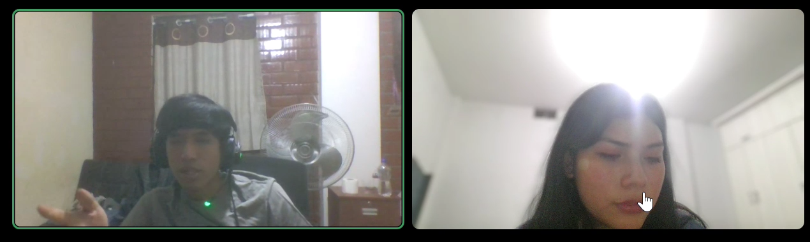
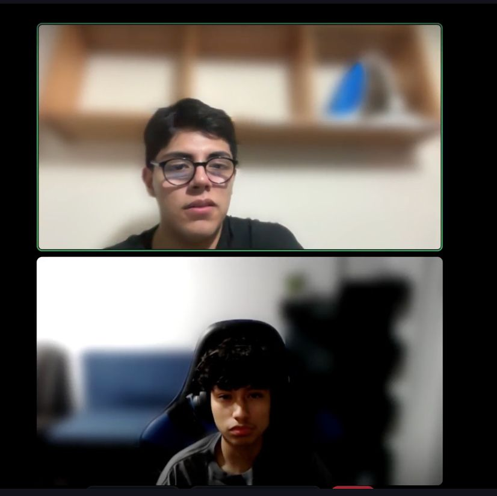
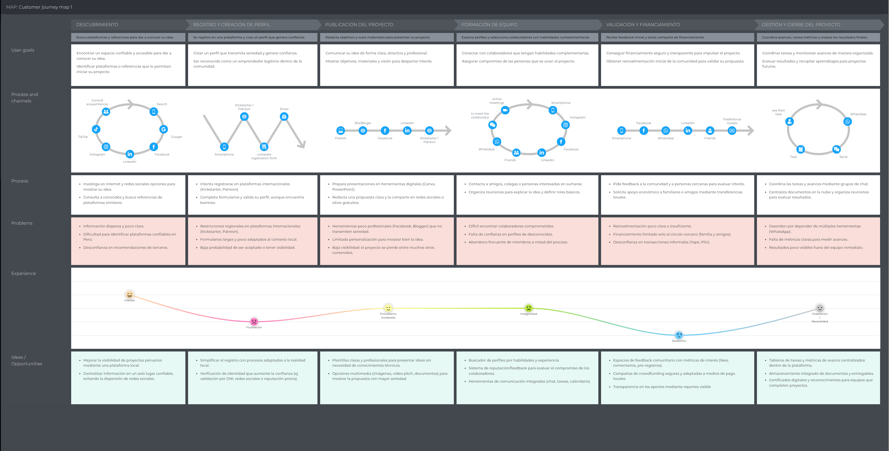
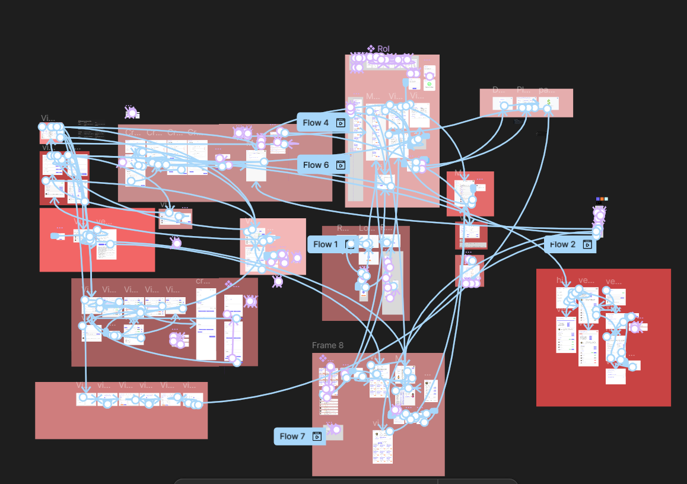
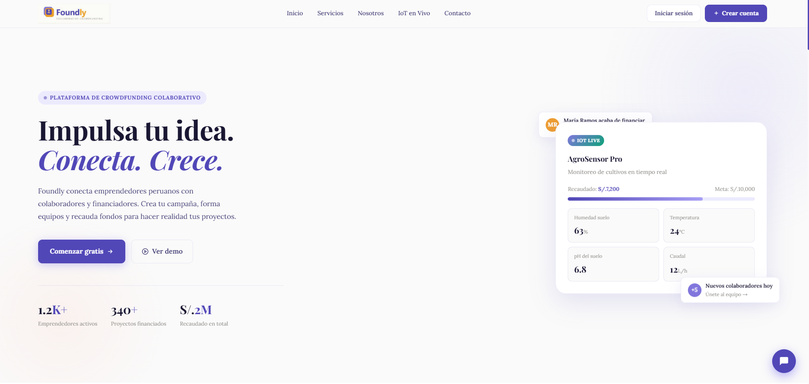
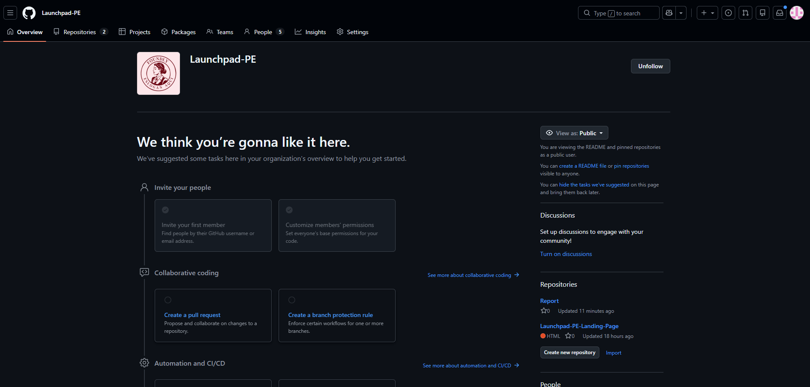
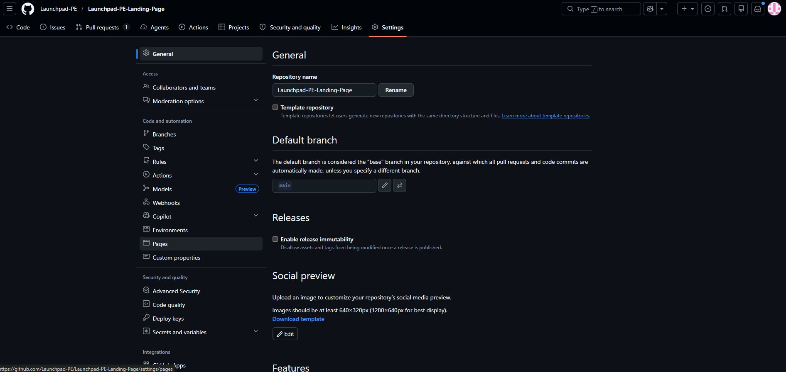
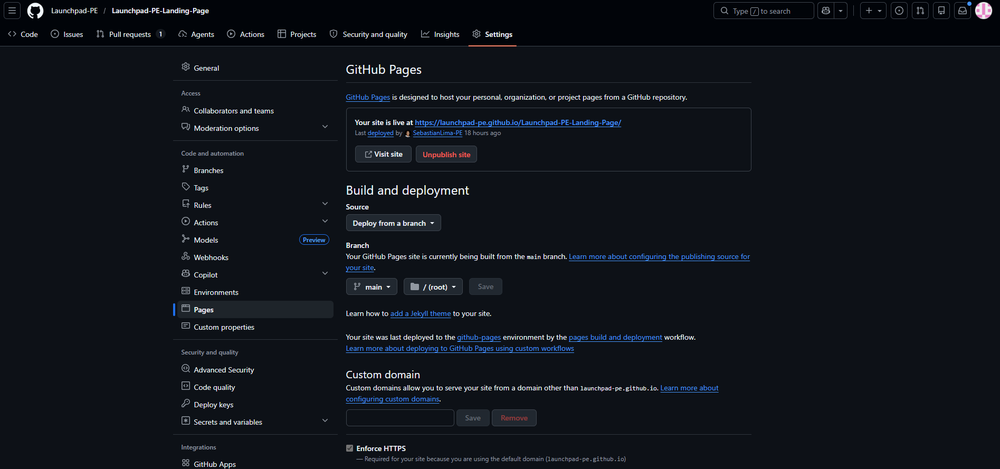
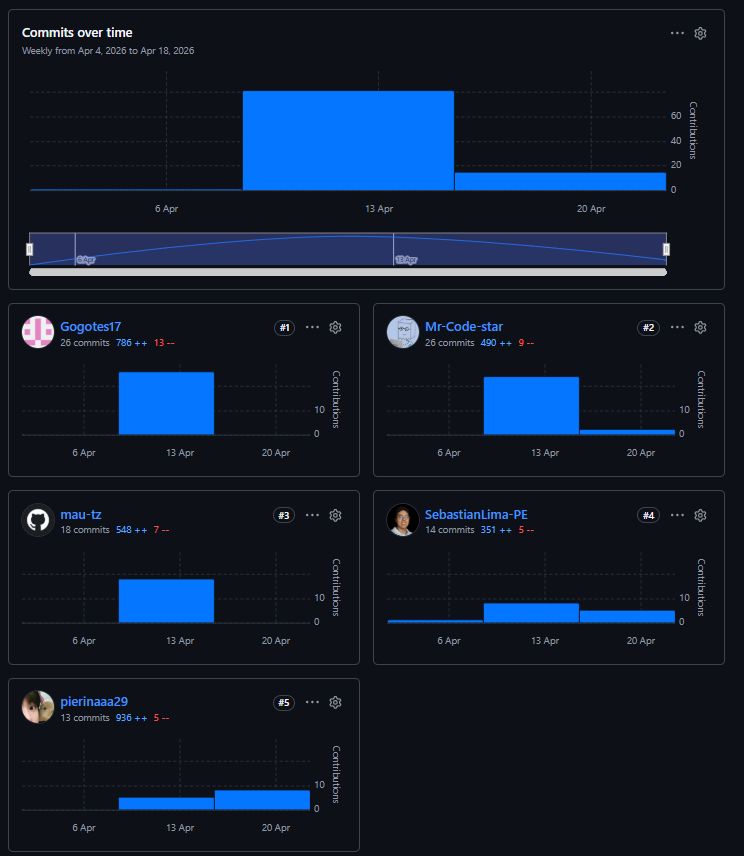
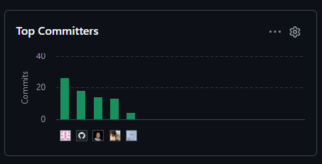

<div align="center">

  
## Universidad Peruana de Ciencias Aplicadas

**Facultad:** Ingeniería

**Ingeniería de Software**

**Ciclo:** 2026-1
 
1ASI0729 - Desarrollo de Aplicaciones Open Source 

**NRC:** 10177

**Profesor:** Mori Paiva, Hugo Allan 

### Informe de Trabajo Final

**Nombre del startup:** Launchpad-PE

**Nombre del producto:** Foundly

#### Relación de integrantes

| Integrante                           | Código     |
| ------------------------------------ | ---------- |
| Almandroz Carbajal, Pierina Marysabel| U202316845 |
| Baca Camargo, Vitaly Arturo          | U20231C426 |
| Bautista Rivera, Jose Diego          | U202310949 |
| Pariachi Limahuaya, Sebastian Ubaldo | U202314115 |
| Teran Zavala, Mauricio Alejandro     | U202417423 |


**Mes y Año**: Marzo 2026

---

</div>

<div class="page"></div>

<br>

# Registro de Versiones del Informe

| Versión | Fecha | Autores | Descripción de modificación |
|---|---|---|---|
| AV1 | 15/03/2026 | Almandroz Carbajal, Pierina Marysabel<br>Baca Camargo, Vitaly Arturo<br>Bautista Rivera, Jose Diego<br>Pariachi Limahuaya, Sebastián Ubaldo<br>Teran Zavala, Mauricio Alejandro | Para la AV1 se creó la estructura completa del informe incluyendo carátula, registro de versiones, tabla de contenidos y Student Outcomes.<br><br>**Capítulo I — Introducción:** Se redactó el Startup Profile, Solution Profile, Lean UX Process y segmentos objetivo.<br><br>**Capítulo II — Requirements Elicitation & Analysis:** Se elaboró el análisis de competidores, diseño y registro de entrevistas, needfinding (User Personas, Task Matrix, Journey Mapping, Empathy Mapping), Big Picture Event Storming y Ubiquitous Language.<br><br>**Capítulo III — Requirements Specification:** Se desarrollaron las User Stories, Impact Mapping y Product Backlog.<br><br>**Capítulo IV — Product Design:** Se completaron las Style Guidelines, Information Architecture, Landing Page UI Design, Web Applications UX/UI Design, Web Prototyping, Domain-Driven Software Architecture, Software Object-Oriented Design y Database Design.<br><br>**Capítulo V — Product Implementation:** Se realizó el Software Configuration Management y la evidencia del Sprint 1, incluyendo planning, backlog, development evidence, execution evidence, services documentation, deployment evidence y collaboration insights.<br><br>Finalmente, se añadieron conclusiones preliminares, bibliografía y anexos. |

# Project Report Collaboration Insights

Para el desarrollo del **Project Report**, el equipo utiliza un repositorio dentro de la organización en GitHub. A continuación, se presenta la evidencia de colaboración correspondiente al **TB1**, en coherencia con el **Registro de Versiones del Informe**.

**Repositorio del informe del proyecto:** https://github.com/Launchpad-PE/Report

- **Total de commits:** 257
- **Autores contribuyentes:**
  - Vitaly Arturo Baca Camargo ( `Mr-Code-star` )
  - Bautista Rivera, Jose Diego ( `Gogotes17` )
  - Sebastián Ubaldo Pariachi Limahuaya ( `SebastianLima-PE` )
  - Ariana Lizeth Ramírez Carrasco ( `pierinaaa29` )
  - Mauricio Alejandro Teran Zavala ( `mau-tz` )
- La actividad se distribuyó en ramas temáticas por secciones del informe, asegurando revisiones cruzadas mediante *pull requests*.

---

## AV1 — Informe inicial (Semana 4)

Durante esta fase, el equipo elaboró el **informe inicial**, que incluyó los siguientes aspectos:

- **Carátula** con información institucional y de la startup.
- **Registro de Versiones del Informe**, documentando los cambios realizados.
- **Contenido preliminar** con tabla de contenidos, *Student Outcomes* y Capítulo I (*Introducción*).
- **Capítulo II** con los primeros avances en *Requirements Elicitation & Analysis*.
- **Capítulo III** con la especificación de requisitos, User Stories y Product Backlog.
- **Capítulo IV** con los avances en *Product Design*, incluyendo Style Guidelines, wireframes y mockups.<
- **Capítulo V** con los avnces del Product Implementation, Validation & Deployment.
- *\*Conclusiones preliminares, bibliografía y anexos.*

A continuación se presenta la captura de los analíticos de colaboración y commits en GitHub para este entregable:

.png)

| Integrante | Usuario GitHub | Commits | Adiciones | Eliminaciones |
|---|---|---|---|---|
| Vitaly Arturo Baca Camargo | `Mr-Code-star` | 189 | 4872 | 419 |
| Bautista Rivera, Jose Diego | `Gogotes17` | 34 | 630 | 20 |
| Sebastián Ubaldo Pariachi Limahuaya | `SebastianLima-PE` | 23 | 382 | 75 |
| Ariana Lizeth Ramírez Carrasco | `pierinaaa29` | 6 | 247 | 49 |
| Mauricio Alejandro Teran Zavala | `mau-tz` | 5 | 127 | 4 |

La colaboración fue activa y equitativa, con aportes sustanciales de todos los integrantes en la redacción y organización del informe.

<>br

# Tabla de Contenidos

## [Capítulo I: Introducción](#capítulo-i-introducción)

- [1.1. Startup Profile](#11-startup-profile)
  - [1.1.1. Descripción de la Startup](#111-descripcion-del-startup)
  - [1.1.2. Perfiles de integrantes del equipo](#112-perfiles-de-integrantes-del-equipo)
- [1.2. Solution Profile](#12-solution-profile)
  - [1.2.1. Antecedentes y problemática](#121-antecedentes-y-problemática)
  - [1.2.2. Lean UX Process](#122-lean-ux-process)
    - [1.2.2.1. Lean UX Problem Statements](#1221-lean-ux-problem-statements)
    - [1.2.2.2. Lean UX Assumptions](#1222-lean-ux-assumptions)
    - [1.2.2.3. Lean UX Hypothesis Statements](#1223-lean-ux-hypothesis-statements)
    - [1.2.2.4. Lean UX Canvas](#1224-lean-ux-canvas)
- [1.3. Segmentos objetivo](#13-segmentos-objetivos)

---

## [Capítulo II: Requirements Elicitation & Analysis](#capítulo-ii-requirements-elicitation--analysis)

- [2.1. Competidores](#21-competidores)
  - [2.1.1. Análisis competitivo](#211-analisis-competitivo)
  - [2.1.2. Estrategias y tácticas frente a competidores](#212-estrategias-y-tácticas-frente-a-competidores)
- [2.2. Entrevistas](#22-entrevistas)
  - [2.2.1. Diseño de entrevistas](#221-diseño-de-entrevistas)
  - [2.2.2. Registro de entrevistas](#222-registro-de-entrevistas)
  - [2.2.3. Análisis de entrevistas](#223-análisis-de-entrevistas)
- [2.3. Needfinding](#23-needfinding)
  - [2.3.1. User Personas](#231-user-personas)
  - [2.3.2. User Task Matrix](#232-user-task-matrix)
  - [2.3.3. User Journey Mapping](#233-user-journey-mapping)
  - [2.3.4. Empathy Mapping](#234-empathy-mapping)
- [2.4. Big Picture Event Storming](#24-big-picture-EventStorming)
- [2.5. Ubiquitous Language](#25-ubiquitous-language)

---

## [Capítulo III: Requirements Specification](#capítulo-iii-requirements-specification)

- [3.1. User Stories](#31-user-stories)
- [3.2. Impact Mapping](#32-impact-mapping)
- [3.3. Product Backlog](#33-product-backlog)

---

## [Capítulo IV: Product Design](#capítulo-iv-product-design)

- [4.1. Style Guidelines](#41-style-guidelines)
  - [4.1.1. General Style Guidelines](#411-general-style-guidelines)
  - [4.1.2. Web Style Guidelines](#412-web-style-guidelines)
- [4.2. Information Architecture](#42-information-architecture)
  - [4.2.1. Organization Systems](#421-organization-systems)
  - [4.2.2. Labeling Systems](#422-labeling-systems)
  - [4.2.3. SEO Tags and Meta Tags](#423-seo-tags-and-meta-tags)
  - [4.2.4. Searching Systems](#424-searching-systems)
  - [4.2.5. Navigation Systems](#425-navigation-systems)
- [4.3. Landing Page UI Design](#43-landing-page-ui-design)
  - [4.3.1. Landing Page Wireframe](#431-landing-page-wireframe)
  - [4.3.2. Landing Page Mock-up](#432-landing-page-mock-up)
- [4.4. Web Applications UX/UI Design](#44-web-applications-uxui-design)
  - [4.4.1. Web Applications Wireframes](#441-web-applications-wireframes)
  - [4.4.2. Web Applications Wireflow Diagrams](#442-web-applications-wireflow-diagrams)
  - [4.4.3. Web Applications Mock-ups](#443-web-applications-mock-ups)
  - [4.4.4. Web Applications User Flow Diagrams](#444-web-applications-user-flow-diagrams)
- [4.5. Web Applications Prototyping](#45-web-applications-prototyping)
- [4.6. Domain-Driven Software Architecture](#46-domain-driven-software-architecture)
  - [4.6.1. Design-Level Event Storming.](#461-design-level-event-storming.)
  - [4.6.2. Software Architecture Context Diagram](#462-software-architecture-context-diagram)
  - [4.6.3. Software Architecture Container Diagrams](#463-software-architecture-container-diagrams)
  - [4.6.4. Software Architecture Components Diagrams](#464-software-architecture-components-diagrams)
- [4.7. Software Object-Oriented Design](#47-software-object-oriented-design)
  - [4.7.1. Class Diagrams](#471-class-diagrams)
- [4.8. Database Design](#48-database-design)
  - [4.8.1. Database Diagram](#481-database-diagram)

---

## [Capítulo V: Product Implementation, Validation & Deployment](#capítulo-v-product-implementation-validation--deployment)

- [5.1. Software Configuration Management](#51-software-configuration-management)
  - [5.1.1. Software Development Environment Configuration](#511-software-development-environment-configuration)
  - [5.1.2. Source Code Management](#512-source-code-management)
  - [5.1.3. Source Code Style Guide & Conventions](#513-source-code-style-guide--conventions)
  - [5.1.4. Software Deployment Configuration](#514-software-deployment-configuration)
- [5.2. Landing Page, Services & Applications Implementation](#52-landing-page-services--applications-implementation)
  - [5.2.1. Sprint 1](#521-sprint-1)
    - [5.2.1.1. Sprint Planning 1](#5211-sprint-planning-1)
    - [5.2.1.2. Aspect Leaders and Collaborators](#5212-aspect-leaders-and-collaborators)
    - [5.2.1.3. Sprint Backlog 1](#5213-sprint-backlog-1)
    - [5.2.1.4. Development Evidence for Sprint Review](#5214-development-evidence-for-sprint-review)
    - [5.2.1.5. Execution Evidence for Sprint Review](#5215-execution-evidence-for-sprint-review)
    - [5.2.1.6. Services Documentation Evidence for Sprint Review](#5216-services-documentation-evidence-for-sprint-review)
    - [5.2.1.7. Software Deployment Evidence for Sprint Review](#5217-software-deployment-evidence-for-sprint-review)
    - [5.2.1.8. Team Collaboration Insights during Sprint](#5218-team-collaboration-insights-during-sprint)

---

## [Conclusiones](#conclusiones-1)


## [Bibliografía](#bibliografia-1)


## [Anexos](#anexos-1)

<br>

# ABET – EAC - Student Outcome 3

**Criterio:** *Capacidad de comunicarse efectivamente con un rango de audiencias.*

En el siguiente cuadro se describe las acciones realizadas y enunciados de conclusiones por parte del grupo, que permiten sustentar el haber alcanzado el logro del ABET – EAC - Student Outcome 3.

| Criterio específico | Acciones realizadas | Conclusiones |
|---|---|---|
| **Comunica oralmente con efectividad a diferentes rangos de audiencia.** | Baca Camargo, Vitaly Arturo<br>AV1<br>Diagram DataBase y Diagram Class: Desarrolló habilidades de modelado de datos para representar la arquitectura del sistema de forma estructurada.<br>Definición de Bounded Context y EventStorming: Aplicó técnicas de diseño orientado al dominio para delimitar responsabilidades del sistema.<br>Deployment Landing Page: Adquirió competencias de despliegue web para poner en producción la página del proyecto.<br><br>Bautista Rivera, Jose Diego<br>AV1<br>Chapter 4 - Style Guidelines: Aprendió a definir y documentar estándares visuales y de diseño para el equipo.<br>Chapter 5 - Software Configuration Management y Sprint 1: Aplicó metodologías de gestión de configuración y planificación ágil.<br>Landing Page Mock-up Mobile Responsive: Desarrolló habilidades de diseño adaptable para distintos dispositivos.<br><br>Pariachi Limahuaya, Sebastián Ubaldo<br>AV1<br>Impact Mapping: Aplicó técnicas de alineación estratégica entre objetivos del negocio y funcionalidades del producto.<br>User Stories: Adquirió habilidades para traducir necesidades del usuario en requerimientos funcionales claros.<br>Product Backlog: Desarrolló competencias de priorización y gestión de tareas en entornos ágiles.<br><br>Teran Zavala, Mauricio Alejandro<br>AV1<br>Landing Page mock-up: Aplicó principios de diseño UI/UX para estructurar visualmente la propuesta del producto.<br>Landing Page implementation: Adquirió habilidades de desarrollo frontend para llevar el diseño a código funcional.<br><br>Almandroz Carbajal, Pierina Marysabel<br>AV1<br>Entrevistas: Aplicó técnicas de investigación cualitativa para identificar necesidades reales de los usuarios objetivo.<br>Wireframes: Desarrolló habilidades de prototipado para estructurar visualmente los flujos de interacción del producto.<br>Landing Page (parcial): Adquirió competencias de desarrollo frontend aplicando los lineamientos de diseño definidos por el equipo. | El grupo demostró capacidad de comunicación oral efectiva al exponer los avances del proyecto ante diferentes audiencias, incluyendo docentes y compañeros. Durante el AV1, cada integrante presentó sus contribuciones de forma clara y estructurada, adaptando el nivel técnico del discurso según el contexto. Las exposiciones reflejaron dominio del tema y coherencia con los objetivos del proyecto. |
| **Comunica por escrito con efectividad a diferentes rangos de audiencia.** | Baca Camargo, Vitaly Arturo<br>AV1<br>Diagram DataBase y Diagram Class: Desarrolló habilidades de modelado de datos para representar la arquitectura del sistema de forma estructurada.<br>Definición de Bounded Context y EventStorming: Aplicó técnicas de diseño orientado al dominio para delimitar responsabilidades del sistema.<br>Deployment Landing Page: Adquirió competencias de despliegue web para poner en producción la página del proyecto.<br><br>Bautista Rivera, Jose Diego<br>AV1<br>Chapter 4 - Style Guidelines: Aprendió a definir y documentar estándares visuales y de diseño para el equipo.<br>Chapter 5 - Software Configuration Management y Sprint 1: Aplicó metodologías de gestión de configuración y planificación ágil.<br>Landing Page Mock-up Mobile Responsive: Desarrolló habilidades de diseño adaptable para distintos dispositivos.<br><br>Pariachi Limahuaya, Sebastián Ubaldo<br>AV1<br>Impact Mapping: Aplicó técnicas de alineación estratégica entre objetivos del negocio y funcionalidades del producto.<br>User Stories: Adquirió habilidades para traducir necesidades del usuario en requerimientos funcionales claros.<br>Product Backlog: Desarrolló competencias de priorización y gestión de tareas en entornos ágiles.<br><br>Teran Zavala, Mauricio Alejandro<br>AV1<br>Landing Page mock-up: Aplicó principios de diseño UI/UX para estructurar visualmente la propuesta del producto.<br>Landing Page implementation: Adquirió habilidades de desarrollo frontend para llevar el diseño a código funcional.<br><br>Almandroz Carbajal, Pierina Marysabel<br>AV1<br>Entrevistas: Aplicó técnicas de investigación cualitativa para identificar necesidades reales de los usuarios objetivo.<br>Wireframes: Desarrolló habilidades de prototipado para estructurar visualmente los flujos de interacción del producto.<br>Landing Page (parcial): Adquirió competencias de desarrollo frontend aplicando los lineamientos de diseño definidos por el equipo. | A lo largo del AV1, el grupo elaboró documentación técnica y visual de calidad, incluyendo diagramas, guidelines, mockups, user stories y el product backlog. Estos entregables evidencian la capacidad del equipo para comunicarse por escrito con precisión, empleando formatos adecuados para distintas audiencias: técnica (diagramas, bounded context) y de usuario final (landing page, entrevistas). La redacción fue clara, organizada y alineada a los estándares del curso. |

# Capítulo I: Introducción
## 1.1. Startup Profile
### 1.1.1. Descripción de la Startup

En un ecosistema emprendedor donde el talento y las ideas se encuentran dispersas, Foundly nace con una visión clara: transformar la manera en que emprendedores, estudiantes y profesionales se conectan, colaboran y materializan proyectos de impacto real. Nuestra propuesta va más allá del financiamiento: es una plataforma de encuentro entre personas, habilidades y propósitos comunes, donde cada idea tiene la posibilidad de convertirse en algo concreto.

Nos diferenciamos por integrar en un solo espacio la formación de equipos multidisciplinarios, la recaudación colaborativa de fondos y la gestión activa de proyectos. Además, incorporamos un módulo de monitoreo de impacto ambiental con métricas en tiempo real como calidad del aire, humedad y participación ciudadana que simula la integración con dispositivos IoT, permitiendo que los proyectos con enfoque sostenible evidencien de forma concreta su huella positiva en el entorno. Algo que ninguna otra plataforma de crowdfunding ofrece hoy.

Nuestra solución está diseñada para adaptarse a distintos perfiles y escalas de proyecto, con planes flexibles tanto para creadores individuales como para colectivos y organizaciones. Con ello, buscamos democratizar el acceso a redes de colaboración, visibilizar el talento emergente y elevar los estándares de innovación social y tecnológica.

Foundly no es solo una plataforma de crowdfunding. Es un ecosistema vivo de colaboración, un puente entre quienes tienen ideas y quienes tienen el talento para hacerlas realidad, y un compromiso hacia un nuevo paradigma de innovación colectiva centrada en el impacto real.

### 1.1.2. Perfiles de integrantes del equipo

| Foto                                                                   | Información                                                                                                                                                                                                                                                                                                                                                                                                                                                                                                                                                                                                                                                                                                                                                                                                                                                                                                                                                                                                                                                                                                                                     |
|------------------------------------------------------------------------|-------------------------------------------------------------------------------------------------------------------------------------------------------------------------------------------------------------------------------------------------------------------------------------------------------------------------------------------------------------------------------------------------------------------------------------------------------------------------------------------------------------------------------------------------------------------------------------------------------------------------------------------------------------------------------------------------------------------------------------------------------------------------------------------------------------------------------------------------------------------------------------------------------------------------------------------------------------------------------------------------------------------------------------------------------------------------------------------------------------------------------------------------|
|   | **Vitaly Arturo Baca Camargo** <br> **Código:** U20231C426 <br> **Carrera:** Ingeniería de Software – UPC <br><br> **Perfil:** <br> Estudiante de Ingeniería de Software con interés en la resolución de problemas en diversos sectores mediante el uso de tecnología. Apasionado por el diseño de interfaces de usuario (UI) y enfocado en el desarrollo de soluciones arquitectónicas eficientes y escalables, orientadas a mejorar la experiencia del usuario y el rendimiento de los sistemas. <br><br> **Habilidades Técnicas:** <br> - C# <br> - MySQL, MongoDB <br> - DDD <br> - Git, Git Flow <br> - Railway <br><br> **Habilidades Sociales:** <br> - Trabajo en equipo y colaboración en entornos ágiles <br> - Comunicación efectiva para coordinación técnica y funcional <br> - Pensamiento analítico y resolución de problemas <br> - Adaptabilidad y aprendizaje continuo                                                                                                                                                                                                                                                        |
|  | **Nombre Completo:** Sebastian Pariachi Limahuaya <br> **Código:** U202314115 <br> **Carrera:** Ingeniería de Software – UPC <br><br> **Perfil:** <br> Estudiante de Ingeniería de Software enfocado en el desarrollo full-stack y la construcción de arquitecturas escalables orientadas a resolver problemas reales. Apasionado por el diseño de soluciones limpias y eficientes, con experiencia en proyectos que van desde plataformas SaaS hasta aplicaciones móviles de impacto social. Comprometido con las buenas prácticas de ingeniería, el trabajo colaborativo y el aprendizaje continuo. Actualmente en el top 10% de su programa. <br><br> **Habilidades Técnicas:** <br> - React, Node.js, Express <br> - MySQL, JWT, PayPal API <br> - RESTful API, DDD, Bounded Contexts <br><br> **Habilidades Sociales:** <br> - Liderazgo técnico y coordinación en equipos multidisciplinarios <br> - Gestión eficiente del tiempo y priorización de tareas en entornos ágiles <br> - Proactividad en la identificación y resolución de problemas complejos <br> - Comunicación asertiva entre equipos técnicos y stakeholders no técnicos |
|  | **Nombre Completo:** Mauricio Alejandro Teran Zavala <br> **Código:** U202417423 <br> **Carrera:** Ingeniería de Software – UPC <br><br> **Perfil:** <br> Estudiante de Ingeniería de Software apasionado por la tecnología y la creación de soluciones con impacto social. Poseo una formación sólida en lógica de programación y desarrollo backend, complementada con valores de disciplina y trabajo en equipo cultivados a través del deporte. <br><br> **Habilidades Técnicas:** <br> - Desarrollo de RESTful APIs <br> - Java Web, C++, Python y SQL <br> - Gestión de bases de datos y análisis de sistemas <br><br> **Habilidades Sociales:** <br> - Proactividad y adaptabilidad <br> - Comunicación efectiva y trabajo en equipo <br> - Disciplina y compromiso <br> - Pensamiento Analítico y trabajo bajo presión                                                                                                                                                                                                                                                                                                                  |
|  | **Nombre Completo:** Jose Diego Bautista Rivera <br> **Código:**  U202310949 <br> **Carrera:** Ingeniería de Software - UPC <br><br> **Perfil:** <br> Estudiante de la carrera de Ingeniería de Software, con gran interés en el desarrollo y diseño de base de datos. Trabajar soluciones a problemas reales con software limpio y eficiente. Con buenas prácticas de programación, trabajo en equipo y en constante aprendizaje. <br><br> **Habilidades Técnicas:** <br> -MySQL y gestión de base de datos <br> -Git, Git Flow <br> -DDD, Bounded Contexts <br><br> **Habilidades Sociales:** <br> -Trabajo en eqquipo y colaboración eficaz <br> -Compromiso <br> -Aprendizaje autónomo y adaptabilidad                                                                                                                                                                                                                                                                                                                                                                                                                                      |
|  | **Nombre Completo:** Pierina Almandroz Carbajal <br> **Código:** U202316845 <br> **Carrera:** Ingenieria de Software - UPC <br><br> **Perfil:** <br> Estudiante de Ingeniería de software, me gusta dar soluciones reles a problematicas actuales de mi comunidad. Además, me encuentro interesada en poder desarrollar aplicaciones web para poder llegar a ser una profesional comprometida con el desarrollo. <br><br> **Habilidades Técnicas:** <br> - C++ <br> - c# <br> - CSS y Python <br><br> **Habilidades Sociales:** <br> - Compromiso con los proyectos y las fechas de entrega <br> - Adaptabilidada a diferentes entornos <br> - Fácil comunicación con los integrantes del grupo                                                                                                                                                                                                                                                                                                                                                                                                                                                 |

## 1.2. Solution Profile
### 1.2.1. Antecedentes y problemática

En el contexto de Latinoamérica, la realidad de las startups es particularmente desafiante: se estima que cerca del **75 % fracasan antes de cumplir dos años de actividad**, lo que refleja la fragilidad del ecosistema emprendedor en la región (Panamerican World, 2023). A nivel global, la situación no es mucho más alentadora, ya que diversos estudios coinciden en que aproximadamente el **90 % de las startups no logran sobrevivir a largo plazo**, dejando apenas un **10–20 %** que alcanza la consolidación o el éxito sostenido (Exploding Topics, 2024; Demand Sage, 2024).

Las causas de este fenómeno son diversas y ampliamente documentadas. Un análisis de 101 startups que no lograron continuar su operación muestra que:

- **42 %** fracasó porque desarrolló un producto que el mercado no necesitaba o no estaba dispuesto a comprar.
- **29 %** cerró por falta de financiamiento.
- **23 %** debido a problemas en los equipos fundadores y la falta de cohesión entre sus miembros (Latam Republic, 2023).

Estos datos evidencian que las debilidades no son únicamente de carácter económico, sino también **estructurales**, vinculadas a la conformación de equipos multidisciplinarios y al alineamiento de objetivos.

A ello se suman factores de **gestión interna**. Reportes recientes señalan que:

- **21 %** de las startups fracasa por conflictos entre miembros del equipo o con inversionistas.
- Aproximadamente **20 %** se ve afectada por dificultades en la gestión del personal (Growth List, 2024; U.S. Chamber of Commerce, 2023).

Estos hallazgos ponen en evidencia que las startups no solo requieren **acceso a financiamiento**, sino también **plataformas que fortalezcan la colaboración, la confianza y la transparencia** entre sus integrantes.

Ante este panorama, resulta evidente la existencia de una **necesidad insatisfecha de soluciones tecnológicas** que no se limiten únicamente a recaudar fondos, sino que integren:

- **Formación de equipos.**
- **Microfinanciamiento accesible.**
- **Mecanismos de seguimiento transparente.**

Una propuesta con estas características puede contribuir significativamente a **reducir la alta tasa de fracaso de proyectos en etapas tempranas**, promoviendo un ecosistema más **sólido, colaborativo e inclusivo** en la región.

---

### 5W's y 2H's

- **Who (Quién)**
  Nuestro público objetivo está compuesto por emprendedores, estudiantes universitarios, profesionales independientes y comunidades que buscan financiamiento, colaboradores y herramientas digitales para materializar sus ideas, resolver problemas o lanzar startups en etapas tempranas.

- **What (Qué)**
  Desarrollaremos una **plataforma web de crowdfunding colaborativo** que conecta personas con ideas, habilidades y recursos. Los usuarios podrán **crear grupos de trabajo, postularse a proyectos y recaudar fondos** de ser necesario, integrando la formación de equipos multidisciplinarios con la financiación colectiva en un solo ecosistema digital.

  Adicionalmente, la plataforma incorpora un **módulo de monitoreo de impacto ambiental** con métricas en tiempo real —como calidad del aire, humedad y participación de usuarios— simulado mediante integración con dispositivos IoT. Este módulo permite que los proyectos con enfoque sostenible **evidencien de forma concreta su impacto**, diferenciándonos de plataformas tradicionales como Kickstarter o Idea.me que no ofrecen esta capacidad.

- **Where (Dónde)**
  El producto estará disponible en **Perú**. La plataforma está diseñada para ser escalable, permitiendo su **expansión progresiva** hacia otros mercados.

- **When (Cuándo)**
  El **lanzamiento piloto** está proyectado para ejecutarse en un plazo estimado de **4 a 6 meses**, con el objetivo de validar el modelo de negocio y obtener retroalimentación de usuarios reales.

- **Why (Por qué)**
  En Latinoamérica, cerca del **75% de las startups fracasan antes de dos años**, y a nivel global la cifra alcanza un **90%**, debido principalmente a la **falta de financiamiento**, **problemas de gestión** y **dificultades para encontrar colaboradores** con habilidades complementarias.
  Nuestra plataforma busca reducir esa tasa de fracaso, conectando **personas, talentos y capital** en un entorno transparente y colaborativo.

- **How (Cómo)**
  La solución se implementará bajo un **modelo de negocio freemium**, que permitirá a los usuarios:

  - Crear o postularse a grupos de forma gratuita hasta **cinco veces**.
  - Recaudar fondos mediante **campañas de crowdfunding**.
  - Colaborar en equipos multidisciplinarios con **intereses y habilidades comunes**.
  - Monitorear el progreso mediante **hitos, evidencias y un sistema de reputación**.
  - Acceder a **métricas avanzadas** y **beneficios premium** mediante suscripción.
  - Visualizar el **impacto ambiental de sus proyectos** a través del módulo IoT integrado, con datos generados programáticamente que en producción provendrían de hardware físico conectado vía protocolos estándar.

- **How Much (Cuánto)**
  La inversión estimada para el desarrollo de la plataforma en su etapa inicial es de aproximadamente **USD $18,000**.
  Este presupuesto contempla:
  - **Desarrollo Frontend & Backend:** USD $12,000
  - **Diseño UX/UI y prototipado:** USD $2,000
  - **Infraestructura en la nube:** USD $3,000
  - **Costos legales y operativos:** USD $1,000

---

### 1.2.2. Lean UX Process

#### 1.2.2.1. Lean UX Problem Statements

**Problem Statement 1:** En la actualidad, muchas personas en Latinoamérica tienen **ideas valiosas** y proyectos innovadores, pero se enfrentan a múltiples barreras que dificultan su desarrollo. Entre los principales problemas encontramos la **falta de financiamiento accesible**, la **dificultad para encontrar colaboradores con habilidades complementarias** y la **ausencia de plataformas transparentes** que integren ambas necesidades.
¿Cómo podemos ayudar a emprendedores, estudiantes y profesionales a **crear, financiar y gestionar proyectos colaborativos** de forma **accesible, segura y confiable**, incrementando así sus posibilidades de éxito?

**Problem Statement 2:** Los estudios recientes muestran que cerca del **75% de las startups en Latinoamérica fracasan** debido a una combinación de **problemas de financiamiento**, **falta de equipos cohesionados** y **gestión ineficiente de recursos**. Esta situación genera una **brecha significativa** entre las oportunidades de emprendimiento y las herramientas disponibles para materializarlas.
¿Cómo podemos ofrecer una plataforma que **conecte personas, habilidades y recursos** para impulsar **ideas innovadoras**, **resolver problemas reales** y **lanzar startups exitosas** en el mercado?

---

#### 1.2.2.2. Lean UX Assumptions

- **User Assumptions:**

  - **¿Quién es el usuario?**
    Nuestros usuarios son **emprendedores, estudiantes, profesionales y comunidades en Latinoamérica** que tienen ideas innovadoras o proyectos en desarrollo, pero que enfrentan barreras para conseguir financiamiento, colaboradores con habilidades complementarias o mecanismos claros para gestionar avances.

  - **¿Dónde encaja nuestro producto en su trabajo o en su vida?**
    Nuestro producto se integra en el **proceso de creación, financiamiento y gestión de proyectos**, permitiendo que los usuarios lleven sus ideas desde la etapa inicial hasta la ejecución, brindando acceso a **recursos, equipos y visibilidad de resultados**.

  - **¿Cuándo y cómo se utiliza nuestro producto?**
    Nuestro producto es utilizado por los usuarios cuando desean:

    - Crear **campañas de financiamiento colaborativo**.
    - Postularse o conformar **equipos multidisciplinarios**.
    - Dar **seguimiento al progreso** de un proyecto mediante reportes y control de hitos.
    - Monitorear el **impacto ambiental** de sus proyectos mediante el módulo IoT en tiempo real.

    La interacción será principalmente en las etapas de **ideación, planeación y ejecución**.

  - **¿Qué problemas resuelve nuestro producto?**

    - **Falta de financiamiento accesible:** Ofrecemos un **sistema de crowdfunding** que conecta proyectos con potenciales aportantes.
    - **Dificultad para formar equipos complementarios:** Creamos un **entorno de networking** para reclutar colaboradores con diversas habilidades.
    - **Gestión ineficiente de proyectos:** Permitimos monitorear **hitos, reportes y reputación** de equipos para garantizar **transparencia**.
    - **Falta de visibilidad del impacto ambiental:** Proveemos un **módulo de monitoreo IoT** que permite a los proyectos sostenibles evidenciar su impacto con datos en tiempo real.

  - **¿Qué características son importantes?**

    - Creación de **proyectos con campañas de financiamiento colaborativo**.
    - Sistema de **postulación y conformación de equipos multidisciplinarios**.
    - **Seguimiento básico de hitos** y reportes de avance.
    - Interfaz **intuitiva, rápida y accesible**.
    - Seguridad y **transparencia en la gestión de fondos**.
    - **Módulo de monitoreo de impacto ambiental** con métricas en tiempo real (calidad del aire, humedad, participación) mediante simulación de integración con dispositivos IoT, orientado a proyectos con enfoque sostenible.

  - **¿Cómo debe verse y comportarse nuestro producto?**
    Nuestro producto debe ser **intuitivo, rápido y confiable**, con una experiencia visual moderna que invite a la interacción. Además, debe mantener un **diseño limpio**, funcionalidades claras y **actualizaciones continuas** que optimicen el rendimiento y la usabilidad.

- **Business Outcomes:**

  1. **Creemos que nuestros usuarios necesitan** una plataforma integral que les permita **financiar, gestionar y ejecutar proyectos** en un solo lugar.
  2. **Estas necesidades se pueden resolver con** un sistema de **crowdfunding colaborativo** combinado con funcionalidades de **networking**, **gestión de avances** y **monitoreo de impacto ambiental vía IoT**.
  3. **Nuestros usuarios iniciales son** emprendedores, estudiantes y profesionales en Latinoamérica interesados en **materializar sus ideas** o sumarse a proyectos existentes.
  4. **El valor #1 que un cliente quiere de nuestro servicio es que** cuente con un espacio confiable para **crear, financiar y gestionar proyectos** de forma más efectiva.
  5. **El usuario también puede obtener beneficios adicionales como**:
     - Mayor **visibilidad** para sus proyectos.
     - Acceso a **colaboradores especializados**.
     - Herramientas de **seguimiento y reportes en tiempo real**.
     - Oportunidad de **financiar sus ideas** sin depender exclusivamente de inversionistas tradicionales.
     - Visualización del **impacto ambiental** de sus proyectos mediante el módulo IoT.
  6. **Vamos a adquirir la mayoría de nuestros clientes a través de** estrategias de **marketing digital**, campañas en **redes sociales** como LinkedIn, Instagram, TikTok y Facebook, **email marketing** y comunidades de emprendimiento.
  7. **Haremos dinero a través de** un **modelo freemium**, donde los usuarios podrán publicar proyectos y postularse de forma gratuita, pero tendrán acceso a **planes premium** con beneficios como mayor visibilidad, métricas avanzadas y postulaciones ilimitadas.
  8. **Nuestras competencias principales son** plataformas como **Kickstarter, Idea.me y Patreon**, pero estas no están optimizadas para las **necesidades del ecosistema emprendedor latinoamericano** ni cuentan con módulos de monitoreo ambiental integrado.
  9. **Los venceremos debido a** nuestra **propuesta de valor**, que integra **crowdfunding colaborativo**, **formación de equipos**, **gestión transparente** y **monitoreo de impacto ambiental vía IoT** en un solo producto.
  10. **Nuestro mayor riesgo es** que los usuarios no logren cumplir sus **metas de financiamiento** o no encuentren **colaboradores adecuados**.
  11. **Resolveremos esto a través de**:
      - **Filtros inteligentes** para conectar proyectos con los perfiles adecuados.
      - **Recomendaciones personalizadas** según intereses y habilidades.
      - **Seguimiento claro de hitos** para generar confianza entre aportantes y creadores.

---

#### 1.2.2.3. Lean UX Hypothesis Statements

- **Creemos que** al brindar a los usuarios una **plataforma de crowdfunding colaborativo**, los emprendedores, estudiantes y comunidades podrán **impulsar sus proyectos** sin depender exclusivamente de inversionistas tradicionales.
  **Sabremos que es cierto** cuando **al menos el 30%** de los proyectos creados logren **recaudar el 60% o más de su meta** durante los primeros **cuatro meses** del lanzamiento piloto.

- **Creemos que** al ofrecer una **funcionalidad para crear grupos de trabajo y postularse a proyectos**, los usuarios podrán **formar equipos multidisciplinarios** con habilidades complementarias, aumentando sus probabilidades de éxito.
  **Sabremos que lo habremos logrado** cuando **al menos el 50%** de los proyectos activos cuenten con **un equipo completo** en los **primeros tres meses**.

- **Creemos que** al desarrollar **una interfaz atractiva, intuitiva y fácil de usar**, más usuarios estarán motivados a **crear, financiar y unirse a proyectos**.
  **Sabremos que es cierto** cuando logremos alcanzar **2,000 usuarios activos** y **al menos 500 proyectos publicados** durante los **primeros seis meses**.

- **Creemos que** al implementar **mecanismos de seguimiento de hitos, reportes de progreso y un sistema de reputación**, generaremos **mayor confianza y transparencia**, incentivando la participación continua.
  **Sabremos que lo habremos logrado** cuando **al menos el 70%** de los financiadores realicen **más de una contribución** en diferentes campañas en los **primeros seis meses**.

- **Creemos que** al aplicar un **modelo freemium** que permita publicar proyectos y postularse de forma gratuita, ofreciendo **planes premium** con beneficios exclusivos, podremos **atraer a una base de usuarios más amplia** y **asegurar la sostenibilidad financiera**.
  **Sabremos que es cierto** cuando **al menos el 15%** de los usuarios activos adquieran **un plan premium** durante el **primer año**.

- **Creemos que** al incorporar un **módulo de monitoreo de impacto ambiental con integración IoT**, los proyectos con enfoque sostenible generarán **mayor credibilidad y confianza** entre sus financiadores, diferenciando la plataforma de sus competidores.
  **Sabremos que es cierto** cuando **al menos el 40%** de los proyectos con enfoque ambiental activen y utilicen el módulo IoT durante los **primeros seis meses**, y dichos proyectos obtengan una tasa de financiamiento **al menos 20% superior** al promedio general de la plataforma.

#### 1.2.2.4. Lean UX Canvas
<div align="center">

</div>
## 1.3. Segmentos objetivo

Esta sección incluye la descripción de los segmentos asociados al dominio del problema, incluyendo características geográficas y demográficas. Por lo tanto, con el fin de desarrollar un producto para satisfacer las necesidades de nuestros clientes, DevWeb se enfocará en los siguientes segmentos de la población:

1. **Emprededores y Startups en Etapa Temprana (Emprendedor):**
   Los emprendedores y fundadores de startups pueden usar la aplicación para crear y gestionar proyectos, publicando sus ideas, convocando talento multidisciplinario y recibiendo financiamiento inicial de la comunidad.

   - **Características demográficas:** Personas entre 20 y 40 años de edad, universitarios, egresados o profesionales que cuentan con ideas innovadoras en validación o proyectos en fases iniciales.

   - **Características geográficas**: Personas que residen principalmente en áreas urbanas de Perú.

2. **Estudiantes Universitarios y Profesionales (Colaborador):**
   Este segmento puede usar la aplicación para unirse a proyectos existentes, aportando sus conocimientos en áreas como programación, diseño, marketing o gestión. A través de su participación, pueden fortalecer sus habilidades, obtener experiencia práctica y visibilidad en su portafolio profesional, colaborando tanto de manera voluntaria como con expectativas de generar oportunidades laborales futuras.

   - **Características demográficas:** Personas entre 18 y 30 años de edad, estudiantes universitarios, recién egresados y profesionales jóvenes en etapa temprana de su carrera.

   - **Características geográficas:** Personas que residen en centros académicos y ciudades con comunidades tecnológicas activas de Perú.


# Capítulo II: Requirements Elicitation & Analysis
## 2.1. Competidores
### 2.1.1. Análisis competitivo

En esta sección se realizará el análisis competitivo de los competidores identificados en la sección inicial con el objetivo de tener una idea más clara sobre nuestro producto frente a los competidores y aprender para mejorar nuestro producto.

<table>
<thead>
  <tr>
    <th colspan="6">Competitive Analysis Landscape</th>
  </tr>
</thead>
<tbody>
  <tr>
    <td colspan="2">¿Por qué llevar a cabo este análisis?</td>
    <td colspan="4">Este análisis se lleva a cabo para poder investigar, analizar y comparar el comportamiento de los competidores directos o indirectos en el mercado</td>
  </tr>
  <tr>
    <td colspan="2"><div align="center">Nombre</div></td>
    <td><div align="center">Foundly</div></td>
    <td><div align="center">Kickstarter</div></td>
    <td><div align="center">Indiegogo</div></td>
    <td><div align="center">GoFundMe</div></td>
  </tr>
  <tr>
    <td colspan="2"><div align="center">Logo</div></td>
    <td><div align="center"></div></td>
    <td><div align="center"></div></td>
    <td><div align="center"></div></td>
    <td><div align="center"></div></td>
  </tr>
  <tr>
    <td rowspan="2">Perfil</td>
    <td>Overview</td>
    <td>Foundly es una plataforma de crowdfunding colaborativo diseñada para que las personas puedan crear grupos o unirse a comunidades que buscan resolver problemas, desarrollar startups o impulsar proyectos sociales. Se enfoca en Perú y Latinoamérica, donde el crowdfunding aún tiene gran potencial de crecimiento. Además, incorpora un <strong>módulo de monitoreo de impacto ambiental con integración IoT</strong> que permite a proyectos con enfoque sostenible visualizar métricas en tiempo real como calidad del aire y humedad, diferenciándose de cualquier plataforma de crowdfunding existente en la región.</td>
    <td>Kickstarter es una de las plataformas de crowdfunding más grandes del mundo, fundada en 2009 en EE. UU. Su objetivo principal es ayudar a creadores, emprendedores y startups creativas a obtener financiamiento colectivo para lanzar proyectos innovadores en áreas como tecnología, arte, música, cine, diseño y videojuegos.</td>
    <td>Indiegogo es una plataforma de crowdfunding global fundada en 2008 en EE. UU., considerada la principal alternativa a Kickstarter. Se caracteriza por su flexibilidad en las campañas y por abarcar proyectos de tecnología, diseño, salud, causas sociales y estilo de vida.</td>
    <td>GoFundMe, fundada en 2010 en Estados Unidos, es una de las plataformas de crowdfunding personal y solidario más grandes del mundo. A diferencia de Kickstarter o Indiegogo, se centra en causas personales, sociales y humanitarias (salud, emergencias, educación, funerales, desastres naturales, etc.) en lugar de proyectos creativos o startups.</td>
  </tr>
  <tr>
    <td>Ventaja Competitiva ¿Qué valor ofrece a los clientes?</td>
    <td>
      <ul>
        <li><strong>Colaboración integral:</strong> No solo conecta a personas para aportar dinero, sino también para aportar ideas, habilidades y tiempo, creando equipos de trabajo alrededor de cada proyecto.</li>
        <li><strong>Módulo IoT de impacto ambiental:</strong> Única plataforma de crowdfunding colaborativo que integra monitoreo de métricas ambientales en tiempo real (calidad del aire, humedad, participación), permitiendo a proyectos sostenibles evidenciar su impacto de forma concreta.</li>
        <li><strong>Accesibilidad y bajo costo de entrada:</strong> Con el modelo freemium (5 proyectos gratuitos antes de pagar), cualquier persona puede iniciar sin necesidad de grandes recursos.</li>
        <li><strong>Plataforma enfocada en comunidad:</strong> Permite que los usuarios formen grupos organizados con roles, tareas y objetivos compartidos, fortaleciendo el sentido de pertenencia.</li>
        <li><strong>Impulso al emprendimiento local y social:</strong> Brinda un espacio para que tanto emprendedores como comunidades puedan impulsar ideas y proyectos de impacto sin depender de financiamiento tradicional.</li>
        <li><strong>Transparencia y confianza:</strong> Implementa procesos de verificación y seguimiento de proyectos para dar seguridad a los participantes y donantes.</li>
      </ul>
    </td>
    <td>
      <ul>
        <li>Exposición global: conecta a emprendedores con millones de potenciales patrocinadores en todo el mundo.</li>
        <li>Validación de mercado: los creadores pueden probar si su idea tiene interés real antes de invertir grandes sumas de dinero.</li>
        <li>Modelo claro de recompensas: los backers reciben beneficios tangibles (productos exclusivos, experiencias, versiones anticipadas).</li>
        <li>Confianza y marca reconocida: Kickstarter es sinónimo de crowdfunding creativo, lo que da credibilidad a los proyectos.</li>
        <li>Comunidad activa de innovación: los usuarios buscan activamente apoyar ideas novedosas, generando oportunidades de networking.</li>
      </ul>
    </td>
    <td>
      <ul>
        <li>Flexibilidad en el financiamiento: permite elegir entre campañas de "Todo o nada" o "Flexible Funding".</li>
        <li>Apoyo post-campaña: con el programa InDemand, los creadores pueden seguir recaudando fondos incluso después de que termine la campaña inicial.</li>
        <li>Enfoque en innovación temprana: permite a los emprendedores mostrar productos en etapas iniciales, atrayendo a "early adopters".</li>
        <li>Servicios adicionales: ofrece marketing, logística y distribución en alianza con empresas.</li>
        <li>Mayor diversidad de categorías: no solo tecnología y arte, también estilo de vida, salud y proyectos sociales.</li>
      </ul>
    </td>
    <td>
      <ul>
        <li>Acceso inmediato a financiamiento solidario: cualquier persona puede abrir una campaña en minutos, sin requisitos complejos ni planes de negocio.</li>
        <li>Enfoque en causas personales y sociales: ideal para emergencias médicas, desastres naturales, educación o apoyo comunitario.</li>
        <li>Alto nivel de confianza: es la plataforma de donaciones más reconocida a nivel mundial.</li>
        <li>Facilidad de uso y viralización: integración con redes sociales que permite compartir campañas y llegar a más donantes.</li>
        <li>Modelo sin tarifas de plataforma en muchos países: aumenta el monto que llega directamente al beneficiario.</li>
      </ul>
    </td>
  </tr>
  <tr>
    <td rowspan="2">Perfiles de Marketing</td>
    <td>Mercado Objetivo</td>
    <td>
      <ul>
        <li><strong>Emprendedores y startups en etapa temprana:</strong> estudiantes y jóvenes profesionales (18–35) en Perú con proyección a LATAM, que buscan validar y financiar ideas y armar equipo multidisciplinario.</li>
        <li><strong>Profesionales y estudiantes con habilidades:</strong> desarrolladores, diseñadores, marketers, PMs y financieros que desean aportar tiempo/talento a proyectos reales y fortalecer su portafolio.</li>
        <li><strong>Proyectos con enfoque sostenible:</strong> equipos o emprendedores que buscan medir y evidenciar el impacto ambiental de sus iniciativas mediante tecnología IoT.</li>
      </ul>
    </td>
    <td>
      <ul>
        <li>Creadores de proyectos creativos e innovadores: artistas, músicos, cineastas, diseñadores, escritores. Emprendedores tecnológicos que buscan validar gadgets, apps o hardware.</li>
        <li>Backers (aportantes o patrocinadores): personas con interés en apoyar la innovación y obtener recompensas exclusivas. Comunidades entusiastas (ej. gamers, cinéfilos, techies).</li>
      </ul>
    </td>
    <td>
      <ul>
        <li>Creadores y emprendedores: emprendedores de sectores como salud, bienestar, estilo de vida y sostenibilidad. Empresas en etapa temprana que buscan financiamiento y visibilidad internacional.</li>
        <li>Backers (aportantes / compradores anticipados): early adopters interesados en probar productos antes de que lleguen al mercado. Personas que buscan apoyar proyectos con impacto social o ambiental.</li>
      </ul>
    </td>
    <td>
      <ul>
        <li>Creadores de campañas (beneficiarios): personas que atraviesan emergencias médicas, familias afectadas por desastres naturales, comunidades y ONGs que buscan financiamiento para causas sociales.</li>
        <li>Donantes (aportantes solidarios): individuos que desean ayudar a personas en situaciones difíciles.</li>
      </ul>
    </td>
  </tr>
  <tr>
    <td>Estrategias de marketing</td>
    <td>
      <ul>
        <li><strong>Marketing Digital y Redes Sociales:</strong> campañas en Facebook, Instagram, TikTok y LinkedIn para captar tanto emprendedores como colaboradores.</li>
        <li><strong>Marketing de Contenidos:</strong> blog con artículos sobre emprendimiento, innovación y economía colaborativa.</li>
        <li><strong>Alianzas estratégicas:</strong> convenios con universidades para que estudiantes publiquen proyectos académicos o de investigación.</li>
      </ul>
    </td>
    <td>
      <ul>
        <li>Viralización digital con fuerte presencia en redes sociales (Facebook, Instagram, Twitter y Youtube).</li>
        <li>Alianzas con medios y sectores creativos para visibilidad.</li>
      </ul>
    </td>
    <td>
      <ul>
        <li>Flexibilidad en el financiamiento (todo o nada / flexible funding).</li>
        <li>Programa InDemand para seguir recaudando después de la campaña.</li>
        <li>Alianzas con aceleradoras, logística y distribución para apoyar la llegada al mercado.</li>
        <li>Promoción de casos de éxito tecnológicos como validación de la plataforma.</li>
      </ul>
    </td>
    <td>
      <ul>
        <li>Marketing emocional con imágenes, videos y testimonios de impacto.</li>
        <li>Colaboración con influencers y celebridades en campañas solidarias.</li>
        <li>Viralización masiva en redes sociales (Facebook, Twitter, Instagram).</li>
      </ul>
    </td>
  </tr>
  <tr>
    <td rowspan="3">Perfil de Producto</td>
    <td>Productos &amp; Servicios</td>
    <td>
      <ul>
        <li><strong>Productos:</strong> proyectos colaborativos creados por los usuarios.</li>
        <li><strong>Servicios:</strong> ecosistema digital seguro, accesible y colaborativo, con herramientas de financiamiento, creación de equipos y <strong>módulo IoT de monitoreo de impacto ambiental en tiempo real</strong>.</li>
      </ul>
    </td>
    <td>
      <ul>
        <li><strong>Productos:</strong> proyectos y recompensas que los creadores ofrecen a sus backers.</li>
        <li><strong>Servicios:</strong> plataforma digital confiable de financiamiento colectivo, con herramientas de gestión, visibilidad y comunidad.</li>
      </ul>
    </td>
    <td>
      <ul>
        <li><strong>Productos:</strong> innovaciones tecnológicas y de estilo de vida.</li>
        <li><strong>Servicios:</strong> acompañamiento post-campaña (InDemand), marketing y apoyo logístico.</li>
      </ul>
    </td>
    <td>
      <ul>
        <li><strong>Productos:</strong> campañas solidarias personales y comunitarias.</li>
        <li><strong>Servicios:</strong> plataforma segura, simple y viralizable para conectar donantes con causas sociales y personales en todo el mundo.</li>
      </ul>
    </td>
  </tr>
  <tr>
    <td>Precios y Costos</td>
    <td>
      <ul>
        <li><strong>Plan Freemium:</strong> hasta 5 proyectos creados/postulados.</li>
        <li><strong>Plan Premium (Mensual/Anual):</strong> proyectos ilimitados + mayor visibilidad en el buscador.</li>
      </ul>
    </td>
    <td>
      <ul>
        <li>Comisión fija del 5% + tarifas de procesamiento de pagos entre el 3% y el 5% dependiendo de la región, moneda e impuestos aplicables.</li>
        <li>Costos logísticos y de producción corren a cargo del creador.</li>
      </ul>
    </td>
    <td>
      <ul>
        <li>5% de comisión de plataforma sobre lo recaudado. 3% + tarifa fija por procesamiento de pagos.</li>
        <li>Tarifas de transferencia bancaria adicionales según ubicación.</li>
        <li>En campañas InDemand no originadas en Indiegogo, se aplican comisiones más altas (8% + 15%).</li>
      </ul>
    </td>
    <td>
      <ul>
        <li>No cobra tarifa de creación ni de gestión de campañas.</li>
        <li>Sistema de aportaciones voluntarias de los donantes a la plataforma ("tips"), nunca obligatorias.</li>
        <li>Comisión por cada donación: 2.9% + $0.30 USD.</li>
        <li>Para ONGs ofrece GoFundMe Pro, con precios personalizados y herramientas avanzadas.</li>
      </ul>
    </td>
  </tr>
  <tr>
    <td>Canales de Distribución (Web y/o Móvil)</td>
    <td>Web</td>
    <td>Web y App</td>
    <td>Web</td>
    <td>Web y App (solo para algunos países)</td>
  </tr>
  <tr>
    <td rowspan="4">Análisis SWOT</td>
    <td>Fortalezas</td>
    <td>
      <ul>
        <li>Los usuarios no solo aportan dinero, sino también habilidades, tiempo e ideas, formando equipos de trabajo.</li>
        <li>Con el modelo freemium (5 proyectos gratis), cualquier persona puede iniciar sin necesidad de gran capital.</li>
        <li>Llena un vacío de mercado en regiones donde las grandes plataformas globales no tienen presencia oficial.</li>
        <li>Sistema de verificación de usuarios y proyectos que reduce fraudes y genera mayor credibilidad.</li>
        <li>Único diferenciador tecnológico en el mercado regional: módulo IoT que permite a proyectos ambientales medir y evidenciar su impacto en tiempo real, algo que ningún competidor directo ofrece.</li>
      </ul>
    </td>
    <td>
      <ul>
        <li>Marca reconocida globalmente como referente en crowdfunding creativo.</li>
        <li>Seguridad en transacciones y prestigio cultural en sectores creativos.</li>
        <li>Modelo transparente que genera confianza en los aportantes.</li>
        <li>Gran base de usuarios y comunidad activa de backers en más de 200 países.</li>
      </ul>
    </td>
    <td>
      <ul>
        <li>Programa InDemand que permite seguir recaudando tras la campaña inicial.</li>
        <li>Amplia variedad de categorías (tecnología, salud, estilo de vida, causas sociales).</li>
        <li>Servicios adicionales de marketing, logística y distribución.</li>
        <li>Alianzas con aceleradoras y empresas para llevar productos al mercado.</li>
      </ul>
    </td>
    <td>
      <ul>
        <li>Plataforma líder en crowdfunding solidario y personal.</li>
        <li>Marca reconocida globalmente, asociada a confianza y solidaridad.</li>
        <li>Facilidad de uso: crear una campaña es rápido y sencillo.</li>
        <li>Red global de donantes y fuerte integración con redes sociales.</li>
      </ul>
    </td>
  </tr>
  <tr>
    <td>Debilidades</td>
    <td>
      <ul>
        <li>Al ser un proyecto nuevo, necesitará mucho esfuerzo en marketing para generar confianza frente a un público poco familiarizado con el crowdfunding.</li>
        <li>Aunque se implementen medidas de verificación, siempre existe el riesgo de que un proyecto no cumpla lo prometido, afectando la reputación.</li>
        <li>En Perú y gran parte de Latinoamérica, el concepto de crowdfunding aún no es masivo, por lo que será necesario invertir en educación y sensibilización del público.</li>
        <li>Sin integración con pasarelas de pago internacionales consolidadas, a diferencia de sus competidores globales.</li>
      </ul>
    </td>
    <td>
      <ul>
        <li>Limitado a países autorizados (no disponible en Perú ni gran parte de Sudamérica).</li>
        <li>Riesgo de incumplimiento de proyectos, afectando la confianza en la plataforma.</li>
        <li>Proceso de revisión de proyectos que retrasa los lanzamientos (1–3 días hábiles).</li>
        <li>Comisiones relativamente altas (5% + tarifas de pago).</li>
      </ul>
    </td>
    <td>
      <ul>
        <li>Menor visibilidad y tráfico que Kickstarter.</li>
        <li>Reputación afectada por proyectos fallidos o retrasados en entregas.</li>
        <li>Altas tarifas de procesamiento y transferencia en algunos países.</li>
        <li>Competencia con Amazon Launchpad y otros marketplaces post-campaña.</li>
      </ul>
    </td>
    <td>
      <ul>
        <li>Dependencia de la viralización en redes sociales para el éxito de las campañas.</li>
        <li>Riesgo de fraudes y campañas engañosas, que afectan su credibilidad.</li>
        <li>Limitada diversificación de servicios (no ofrece logística ni acompañamiento post-campaña).</li>
        <li>Menor atractivo para donantes en mercados emergentes con baja capacidad adquisitiva.</li>
      </ul>
    </td>
  </tr>
  <tr>
    <td>Oportunidades</td>
    <td>
      <ul>
        <li>Plataformas globales como Kickstarter no tienen presencia oficial en Perú ni en la mayoría de Sudamérica, lo que deja espacio para una propuesta local.</li>
        <li>Posibilidad de crear convenios institucionales para impulsar proyectos estudiantiles, comunitarios o de innovación social.</li>
        <li>Una vez consolidado en Perú, puede expandirse a otros países de Latinoamérica con características de mercado similares.</li>
        <li>Creciente interés global en sostenibilidad abre un nicho para proyectos que usen el módulo IoT como herramienta de transparencia ambiental.</li>
      </ul>
    </td>
    <td>
      <ul>
        <li>Expandirse a mercados emergentes como Latinoamérica, donde no tiene presencia.</li>
        <li>Alianzas con universidades, incubadoras y gobiernos para fomentar el emprendimiento.</li>
        <li>Colaboraciones con grandes marcas que validen productos vía crowdfunding.</li>
        <li>Aumento de cultura colaborativa post-pandemia que impulsa el financiamiento online.</li>
      </ul>
    </td>
    <td>
      <ul>
        <li>Expansión en mercados emergentes (Latinoamérica, África, Asia).</li>
        <li>Posicionarse como líder en innovación tecnológica temprana.</li>
        <li>Colaborar con grandes marcas tecnológicas como canal de validación de productos.</li>
      </ul>
    </td>
    <td>
      <ul>
        <li>Expansión en mercados emergentes (Latinoamérica, África, Asia).</li>
        <li>Alianzas con ONGs, fundaciones y gobiernos para campañas humanitarias.</li>
        <li>Mayor presencia en emergencias globales (desastres naturales, pandemias, guerras).</li>
        <li>Crecer con donaciones recurrentes y servicios premium para ONGs (GoFundMe Pro).</li>
      </ul>
    </td>
  </tr>
  <tr>
    <td>Amenazas</td>
    <td>
      <ul>
        <li>Plataformas como Kickstarter, Indiegogo y GoFundMe pueden expandirse a Latinoamérica y captar rápidamente usuarios gracias a su marca.</li>
        <li>Nuevas startups regionales podrían lanzar plataformas similares adaptadas cultural y económicamente al público local.</li>
        <li>Casos de fraude o incumplimiento de proyectos pueden afectar la reputación del crowdfunding en general, desincentivando a potenciales usuarios.</li>
        <li>La ausencia de leyes claras sobre crowdfunding en Perú y Latinoamérica puede derivar en futuras regulaciones estrictas que limiten su operación.</li>
      </ul>
    </td>
    <td>
      <ul>
        <li>Riesgo de fraudes y proyectos incumplidos que dañan la reputación.</li>
        <li>Cambios regulatorios que pueden limitar el crowdfunding en distintos países.</li>
        <li>La limitación geográfica actual deja espacio a plataformas locales en Sudamérica.</li>
      </ul>
    </td>
    <td>
      <ul>
        <li>Riesgo de pérdida de confianza por incumplimientos de proyectos.</li>
        <li>Regulaciones en crowdfunding que pueden restringir operaciones internacionales.</li>
        <li>Saturación del mercado de crowdfunding con nuevos competidores regionales.</li>
      </ul>
    </td>
    <td>
      <ul>
        <li>Desconfianza pública derivada de casos de fraude o uso indebido de fondos.</li>
        <li>Crisis económicas globales que reducen la disposición de donar.</li>
      </ul>
    </td>
  </tr>
</tbody>
</table>

### 2.1.2. Estrategias y tácticas frente a competidores

En esta sección se presentan las estrategias y tácticas preliminares que aplicará Foundly para afrontar las fortalezas de la competencia, aprovechar sus debilidades, capitalizar las oportunidades del entorno y mitigar las amenazas identificadas en el análisis FODA.

---

##### Estrategias para aprovechar las debilidades de los competidores

Los principales competidores identificados Kickstarter, Indiegogo y GoFundMe presentan debilidades concretas que Foundly puede explotar de manera directa:

- **Kickstarter e Indiegogo no tienen presencia oficial en Perú ni en gran parte de Sudamérica.** Foundly aprovechará este vacío posicionándose como la primera plataforma de crowdfunding colaborativo adaptada al contexto latinoamericano, con soporte en español, métodos de pago locales y una propuesta de valor orientada a las necesidades del emprendedor peruano.

- **Kickstarter aplica un proceso de revisión de proyectos de 1 a 3 días hábiles**, lo que retrasa el lanzamiento de campañas. Foundly ofrecerá publicación inmediata de proyectos, reduciendo la fricción de entrada y permitiendo que los emprendedores actúen con mayor agilidad.

- **Kickstarter e Indiegogo cobran comisiones de entre 5% y 8% más tarifas de procesamiento**, lo que encarece el crowdfunding para proyectos pequeños. El modelo freemium de Foundly con hasta 5 proyectos gratuitos representa una alternativa de menor costo de entrada, especialmente atractiva para emprendedores en etapas tempranas.

- **Ningún competidor integra formación de equipos multidisciplinarios ni monitoreo de impacto ambiental con IoT.** Foundly se diferencia al ofrecer ambas funcionalidades en un solo ecosistema, cubriendo necesidades que las plataformas globales ignoran por completo.

- **Táctica:** Campañas de comunicación directa destacando las ventajas comparativas frente a la competencia, usando mensajes como "sin listas de espera", "sin comisiones al inicio" y "el equipo también importa", dirigidas a emprendedores que ya conocen Kickstarter o Indiegogo pero no pueden acceder a ellas desde Perú.

---

##### Estrategias para afrontar las fortalezas de los competidores

Kickstarter, Indiegogo y GoFundMe cuentan con marcas globalmente reconocidas, grandes bases de usuarios y modelos consolidados de confianza. Para afrontar estas fortalezas:

- **Estrategia de Diferenciación:** Foundly no compite en el mismo terreno que los competidores globales, sino que construye una categoría propia: el crowdfunding colaborativo con formación de equipos. A diferencia de las plataformas tradicionales donde el usuario solo aporta dinero, Foundly permite aportar habilidades, tiempo e ideas, generando valor más allá del financiamiento económico.

- **Módulo IoT como diferenciador tecnológico único:** Foundly incorpora un módulo de monitoreo de impacto ambiental con integración IoT que permite a proyectos sostenibles visualizar métricas en tiempo real como calidad del aire, humedad y participación ciudadana. Ningún competidor directo ofrece esta funcionalidad, lo que refuerza la propuesta de valor frente a un mercado con creciente interés en la sostenibilidad.

- **Táctica:** Implementar un sistema de verificación de usuarios y proyectos, junto con seguimiento de hitos y un sistema de reputación, para construir confianza progresiva entre los usuarios y compensar la menor trayectoria de marca frente a competidores consolidados.

---

##### Estrategias para capitalizar las oportunidades del entorno

- **Estrategia de Entrada al Mercado Local (Perú – LATAM):** Foundly iniciará operaciones en Perú como mercado piloto, aprovechando la ausencia de competidores globales con presencia oficial en la región. Una vez validado el modelo, se escalará progresivamente hacia otros países de Latinoamérica con características de mercado similares.

- **Táctica:** En la fase inicial se ejecutará una campaña de educación y sensibilización sobre qué es el crowdfunding y cómo funciona, mediante talleres, webinars gratuitos y alianzas con universidades, incubadoras de negocios, coworkings y ONGs locales. El objetivo es posicionar a Foundly como pionera en financiamiento colaborativo adaptado al contexto latinoamericano antes de que los competidores globales decidan expandirse.

- **Estrategia de Marketing Digital Segmentado:** Se implementarán campañas diferenciadas en Facebook, Instagram, TikTok y LinkedIn, segmentadas por edad, intereses y afinidad con el emprendimiento o causas sociales, orientadas a los dos segmentos objetivos: emprendedores en etapa temprana y colaboradores profesionales.

- **Táctica:** Contenido visual y narrativo videos cortos, reels, historias y testimonios de usuarios reales que muestren casos de proyectos financiados exitosamente, tutoriales sobre cómo crear una campaña y el funcionamiento del módulo IoT para proyectos ambientales.

---

##### Estrategias para mitigar las amenazas del entorno

- **Amenaza: expansión de competidores globales a Latinoamérica.** Si Kickstarter o Indiegogo deciden ingresar a la región, Foundly ya contará con una base de usuarios establecida, alianzas institucionales y una propuesta de valor que va más allá del crowdfunding tradicional. La velocidad de entrada al mercado es la principal defensa.

  - **Táctica:** Acelerar la captación de usuarios y la generación de alianzas con universidades e incubadoras durante los primeros 12 meses, creando barreras de fidelización antes de que los competidores globales puedan reaccionar.

- **Amenaza: casos de fraude que afectan la reputación del crowdfunding en general.** El ecosistema de crowdfunding a nivel global enfrenta desconfianza derivada de proyectos incumplidos o campañas fraudulentas, lo que puede afectar a Foundly aunque no sea directamente responsable.

  - **Táctica:** Implementar desde el lanzamiento un sistema de verificación de identidad, validación de proyectos y seguimiento obligatorio de hitos con evidencias. El módulo de reputación permitirá que los usuarios evalúen proyectos y equipos, generando transparencia y disuadiendo comportamientos fraudulentos.

- **Amenaza: ausencia de regulación clara sobre crowdfunding en Perú.** La falta de un marco legal específico puede derivar en regulaciones futuras que limiten la operación de plataformas de financiamiento colectivo.

  - **Táctica:** Desde el inicio, Foundly operará bajo estándares de transparencia financiera y cumplimiento normativo general, documentando todos los flujos de fondos y manteniendo comunicación con asociaciones de emprendimiento y organismos regulatorios, de modo que la plataforma esté preparada para adaptarse a cualquier cambio regulatorio sin interrupciones.

## 2.2. Entrevistas

En esta sección se abordará la investigación en base a la información que se obtendrá de los segmentos entrevistados con el objetivo de conocer mejor a nuestros segmentos objetivos y aprender de ellos y sus procesos.

### 2.2.1. Diseño de entrevistas
 
---
 
#### Segmento 1: Emprendedores y Startups en Etapa Temprana
 
**Introducción:**
Buenos días/tardes/noches, mi nombre es [Nombre del entrevistador]. Hoy tengo el agrado de conversar con [Nombre del entrevistado], emprendedor(a) que busca impulsar sus ideas o proyectos. El objetivo de esta entrevista es conocer su experiencia y expectativas para crear soluciones que realmente aporten al ecosistema emprendedor. Gracias por su tiempo y disposición.
 
1. ¿De qué forma suele financiar actualmente sus proyectos o ideas de negocio?
2. ¿Ha utilizado antes plataformas de crowdfunding u otras herramientas digitales para obtener financiamiento? ¿Cómo fue su experiencia?
3. ¿Qué dificultades ha enfrentado para conseguir colaboradores con habilidades diferentes a las suyas (ej. diseño, tecnología, marketing)?
4. ¿Cuáles son sus principales preocupaciones al buscar financiamiento en línea para un proyecto en etapa temprana?
5. ¿Qué características considera indispensables en una plataforma que combine formación de equipos con campañas de financiamiento?
6. ¿Qué mecanismos de transparencia le generarían más confianza al invertir tiempo y esfuerzo en una plataforma (ej. reportes de avance, hitos validados, reputación de equipos)?
7. ¿Cómo evaluaría si una plataforma realmente le ayuda a reducir riesgos de fracaso en su emprendimiento?
8. ¿Qué beneficios esperaría obtener al usar una plataforma como esta, en comparación con las formas tradicionales de buscar financiamiento o colaboradores?
9. ¿En qué momento siente que más necesita apoyo para su emprendimiento: al validar la idea, al formar el equipo o al buscar financiamiento?
10. ¿Ha dejado de usar alguna plataforma o herramienta porque no cumplió con sus expectativas? ¿Qué fue lo que más le molestó?
 
**Cierre:**
Muchas gracias por compartir su experiencia y perspectivas. Su opinión es muy valiosa para diseñar una herramienta que apoye de verdad a los emprendedores en etapa temprana.
 
---
 
#### Segmento 2: Estudiantes Universitarios y Profesionales Jóvenes
 
**Introducción:**
Buenos días/tardes/noches, mi nombre es [Nombre del entrevistador]. Hoy entrevisto a [Nombre del entrevistado], estudiante/profesional joven interesado en adquirir experiencia práctica y colaborar en proyectos innovadores. El objetivo es conocer sus motivaciones y expectativas al integrarse en equipos de emprendimiento. Gracias por su tiempo.
 
1. ¿Actualmente participa en proyectos fuera de sus estudios o trabajo formal? ¿De qué tipo?
2. ¿Ha usado alguna plataforma para colaborar en proyectos, voluntariados o equipos multidisciplinarios? ¿Cómo le fue?
3. ¿Qué lo motivaría a unirse a un proyecto de emprendimiento en línea (ej. experiencia, networking, posibles ingresos)?
4. ¿Qué dificultades ha tenido para encontrar oportunidades de colaboración relevantes a su perfil o intereses?
5. ¿Qué funciones considera más útiles en una plataforma que le permita unirse a equipos y aportar sus habilidades?
6. ¿Qué nivel de información le gustaría tener antes de decidir unirse a un proyecto (ej. objetivos, roles, nivel de compromiso requerido, métricas de avance)?
7. ¿Qué mecanismos le darían confianza de que su trabajo dentro del equipo será valorado y reconocido?
8. ¿Qué beneficios espera obtener al participar en una plataforma de este tipo (ej. experiencia práctica, portafolio, contactos, oportunidades laborales)?
9. ¿Cómo cree que esta plataforma podría ayudarle a crecer profesionalmente en comparación con actividades tradicionales (ej. prácticas, cursos, voluntariados)?
10. ¿Qué lo motivaría a recomendar esta herramienta a otros estudiantes o jóvenes profesionales?
 
**Cierre:**
Muchas gracias por su tiempo y comentarios. Su aporte nos ayudará a crear una plataforma más útil y atractiva para jóvenes con interés en colaborar y aprender de proyectos reales.

### 2.2.2. Registro de entrevistas
En esta sección presentamos los registros de las entrevistas que hicimos para cada segmento objetivo de nuestra aplicación.

**Segmento 1:**

<table>
<colgroup>
</colgroup>
<thead>
  <tr>
    <th colspan="2">Entrevista #1<br></th>
  </tr>
</thead>
<tbody>
  <tr>
    <td>Nombre</td>
    <td>Diana Lucia</td>
  </tr>
  <tr>
    <td>Apellidos</td>
    <td>Briceño Huarcaya</td>
  </tr>
  <tr>
    <td>Edad</td>
    <td>20 años</td>
  </tr>
  <tr>
    <td>Distrito</td>
    <td>Barranco</td>
  </tr>
  <tr>
    <td>Aplicaciones Usadas</td>
    <td>Microsoft Stream</td>
  </tr>
  <tr>
    <td>Motivacion</td>
    <td>Conseguir colaboradores con habilidades complementarias.</td>
  </tr>
  <tr>
    <td>Frustracion</td>
    <td>Dificultad para encontrar colaboradores comprometidos y confiables.</td>
  </tr>
  <tr>
    <td>Evidencia</td>
    <td><div align="center"></td>
  </tr>
  <tr>
    <td>Link</td>
    <td><p><a target="_blank"  href="https://upcedupe-my.sharepoint.com/:v:/g/personal/u20231c426_upc_edu_pe/IQB-pW1mSnVFRrnYXrmZb_zqAYfSIXqhAS_soBgVYZph2FE?nav=eyJyZWZlcnJhbEluZm8iOnsicmVmZXJyYWxBcHAiOiJTdHJlYW1XZWJBcHAiLCJyZWZlcnJhbFZpZXciOiJTaGFyZURpYWxvZy1MaW5rIiwicmVmZXJyYWxBcHBQbGF0Zm9ybSI6IldlYiIsInJlZmVycmFsTW9kZSI6InZpZXcifX0%3D&e=fRaDv1" title="Title">Microsoft Stream</p></td>
  </tr>
  <tr>
    <td>Duracion<br></td>
    <td>0:00 min - 10:18 min</td>
  </tr>
  <tr>
    <td>Resumen</td>
    <td>
            En la entrevista con Diana Briceño, logramos conocer su opinión acerca de qué le pareció nuestra landing page y nuestra aplicación web. Indicó que le llamó la mucho la atención nuestra landing page, que le pareció muy bien organizada y fácil de comprender y leer, e incluso dijo que nuestra aplicación web le sorprendió buenamente, ya que le encantó lo tan detallada que está y su facilidad de usar, indicó que tal vez podríamos mejorar el tamaño de las letras pero que todo lo demás le había gustado y parecía excelente.
Finalmente indicó que sí estaría dispuesto a utilizar Foundly y a recomendársela a sus amigos y familiares.
</td>
  </tr>
</tbody>
</table>

<table>
<colgroup>
</colgroup>
<thead>
  <tr>
    <th colspan="2">Entrevista #2<br></th>
  </tr>
</thead>
<tbody>
  <tr>
    <td>Nombre</td>
    <td>Didier Sebastian</td>
  </tr>
  <tr>
    <td>Apellidos</td>
    <td>Meza Solórzano</td>
  </tr>
  <tr>
    <td>Edad</td>
    <td>19 años</td>
  </tr>
  <tr>
    <td>Distrito</td>
    <td>Villa Maria del Triunfo</td>
  </tr>
  <tr>
    <td>Aplicaciones Usadas</td>
    <td>WhatsApp, Github, KickStarter</td>
  </tr>
  <tr>
    <td>Motivacion</td>
    <td>Usar una plataforma clara, intuitiva y que lo ayude a organizarse mejor.</td>
  </tr>
  <tr>
    <td>Frustracion</td>
    <td>Desorden en la comunicación al depender de WhatsApp (información perdida entre mensajes).</td>
  </tr>
  <tr>
    <td>Evidencia</td>
    <td><div align="center"></td>
  </tr>
  <tr>
    <td>Link</td>
    <td>
        <p><a target="_blank"  href="https://upcedupe-my.sharepoint.com/:v:/g/personal/u20231c426_upc_edu_pe/IQBYjsQz0dfJQ5cJSAmi7NBpAZKE6jIVLX_3Q7VbDHe8adc?e=dAxnxt&nav=eyJyZWZlcnJhbEluZm8iOnsicmVmZXJyYWxBcHAiOiJTdHJlYW1XZWJBcHAiLCJyZWZlcnJhbFZpZXciOiJTaGFyZURpYWxvZy1MaW5rIiwicmVmZXJyYWxBcHBQbGF0Zm9ybSI6IldlYiIsInJlZmVycmFsTW9kZSI6InZpZXcifX0%3D" title="Title">Microsoft Stream</p>
    </td>
  </tr>
  <tr>
    <td>Duracion<br></td>
    <td>0:00 min - 10:53 min</td>
  </tr>
  <tr>
    <td>Resumen</td>
    <td>
        Didier Meza es un emprendedor en etapa temprana que financia sus proyectos principalmente con ahorros propios y apoyo cercano de familiares o amigos, lo cual considera limitado para avanzar. Ha probado plataformas como Kickstarter, pero su experiencia fue negativa por la falta de visibilidad, la necesidad de invertir en publicidad externa y las barreras para proyectos de Perú, lo que lo desmotivó.

Su mayor dificultad es formar equipos comprometidos: muchos interesados abandonan al poco tiempo y le resulta complejo conectar con personas con habilidades en áreas que no domina (diseño, marketing). Además, coordinar por WhatsApp le genera frustración debido al desorden y la pérdida de información en los chats.

Lo que más le preocupa al buscar financiamiento en línea es la seguridad del dinero y la seriedad de los proyectos, ya que la falta de confianza desanima tanto a él como a los posibles aportantes. Para una plataforma ideal valora que sea clara, fácil de usar, que permita mostrar bien la propuesta, ofrecer reportes de avance visibles, sistemas de reputación/verificación y herramientas para organizar tareas con métricas claras.

Didier ve como beneficios principales el alcance mayor, la posibilidad de recibir comentarios de personas con experiencia y el acceso a colaboradores que complementen sus habilidades. Considera crítico contar con un equipo sólido desde el inicio, porque sin él la validación de ideas y el financiamiento se vuelven inviables.

</td>
  </tr>
</tbody>
</table>

<table>
<colgroup>
</colgroup>
<thead>
  <tr>
    <th colspan="3">Entrevista #3<br></th>
  </tr>
</thead>
<tbody>
  <tr>
    <td>Nombre</td>
    <td>Gonzalo</td>
  </tr>
  <tr>
    <td>Apellidos</td>
    <td>Quintanilla Pozo</td>
  </tr>
  <tr>
    <td>Edad</td>
    <td>20</td>
  </tr>
  <tr>
    <td>Distrito</td>
    <td>San Juan de Miraflores</td>
  </tr>
  <tr>
    <td>Aplicaciones Usadas</td>
    <td>Google Collab y Microsoft teams</td>
  </tr>
  <tr>
    <td>Motivacion</td>
    <td>Obtener experiencia tecnológica sobre proyectos colaborativos </td>
  </tr>
  <tr>
    <td>Frustracion</td>
    <td>No conseguir personal capacitado para sus proyectos</td>
  </tr>
  <tr>
    <td>Evidencia</td>
    <td><div align="center"></td>
  </tr>
  <tr>
    <td>Link</td>
    <td>
        <p><a target="_blank"  href="https://upcedupe-my.sharepoint.com/:v:/g/personal/u202316845_upc_edu_pe/IQAXF8wsm3epTZ4GP-wFb0q2AX8GaYwwCO5TDwZAQXVkDAM?e=Ybj0LP" title="Title">Microsoft Stream</p>
    </td>
  </tr>
  <tr>
    <td>Duracion<br></td>
    <td>0:00 min - 10:53 min</td>
  </tr>
  <tr>
    <td>Resumen</td>
    <td>Gonzalo Quintanilla es un emprendedor que financia sus proyectos con ahorros propios y apoyo de familiares o amigos, debido a la dificultad de acceder a crédito tradicional. No ha utilizado crowdfunding porque requiere mucho marketing y una comunidad previa. Su mayor dificultad es encontrar socios en áreas como marketing o ventas dispuestos a asumir riesgos.

Le preocupan el fracaso público y las altas comisiones al buscar financiamiento en línea. Considera importante una plataforma que conecte socios por habilidades, ofrezca transparencia y libere financiamiento por hitos. Señala que el mayor apoyo lo necesita al formar el equipo, ya que un equipo sólido facilita conseguir financiamiento.
        
</td>
  </tr>
</tbody>
</table>

**Segmento 2:**


<table>
<colgroup>
</colgroup>
<thead>
  <tr>
    <th colspan="2">Entrevista #1<br></th>
  </tr>
</thead>
<tbody>
  <tr>
    <td>Nombre</td>
    <td>Kael Valentino</td>
  </tr>
  <tr>
    <td>Apellidos</td>
    <td>Lagos Rivera</td>
  </tr>
  <tr>
    <td>Edad</td>
    <td>20 años</td>
  </tr>
  <tr>
    <td>Distrito</td>
    <td>Surquillo</td>
  </tr>
  <tr>
    <td>Aplicaciones Usadas</td>
    <td> WhatsApp, GitHub</td>
  </tr>
  <tr>
    <td>Motivacion</td>
    <td>Ganar experiencia práctica en proyectos reales.</td>
  </tr>
  <tr>
    <td>Frustracion</td>
    <td>Dificultad para encontrar proyectos alineados a sus intereses o perfiles compatibles.</td>
  </tr>
  <tr>
    <td>Evidencia</td>
    <td><div align="center"></div></td>
  </tr>
  <tr>
    <td>Link</td>
    <td>
        <p><a target="_blank"  href="https://upcedupe-my.sharepoint.com/:v:/g/personal/u20231c426_upc_edu_pe/IQABmhcLE9j_QJz9uAhlFPCsAS2_e1taeV6w-WtLwvTA2fs?e=0EtxT7&nav=eyJyZWZlcnJhbEluZm8iOnsicmVmZXJyYWxBcHAiOiJTdHJlYW1XZWJBcHAiLCJyZWZlcnJhbFZpZXciOiJTaGFyZURpYWxvZy1MaW5rIiwicmVmZXJyYWxBcHBQbGF0Zm9ybSI6IldlYiIsInJlZmVycmFsTW9kZSI6InZpZXcifX0%3D" title="Title">Microsoft Stream</p>
    </td>
  </tr>
  <tr>
    <td>Duracion<br></td>
    <td>
        0:00 min - 10:16 min
    </td>
  </tr>
  <tr>
    <td>Resumen</td>
    <td>
        Kael Lagos es un estudiante joven que participa activamente en proyectos universitarios, talleres y trabajos personales. Lo motiva principalmente ganar experiencia y construir un portafolio que le abra puertas laborales, además de generar networking y posibles ingresos. Sus frustraciones se centran en la falta de organización en las herramientas actuales, la dificultad de encontrar equipos compatibles y la poca certeza sobre la valoración de su aporte. Busca una plataforma que ofrezca orden, transparencia y reconocimiento, facilitando su crecimiento profesional de manera práctica y colaborativa.
</td>
  </tr>
</tbody>
</table>

<table>
<colgroup>
</colgroup>
<thead>
  <tr>
    <th colspan="2">Entrevista #2<br></th>
  </tr>
</thead>
<tbody>
  <tr>
    <td>Nombre</td>
    <td>Diego Alonso</td>
  </tr>
  <tr>
    <td>Apellidos</td>
    <td>Esquicha Alcántara</td>
  </tr>
  <tr>
    <td>Edad</td>
    <td>19 años</td>
  </tr>
  <tr>
    <td>Distrito</td>
    <td>Surco</td>
  </tr>
  <tr>
    <td>Aplicaciones Usadas</td>
    <td> WhatsApp</td>
  </tr>
  <tr>
    <td>Motivacion</td>
    <td>Generar soluciones tecnológicas con impacto real en el entorno.</td>
  </tr>
  <tr>
    <td>Frustracion</td>
    <td>Fallas críticas en comunicación y falta de metodologías de organización.</td>
  </tr>
  <tr>
    <td>Evidencia</td>
    <td><div align="center"></div></td>
  </tr>
  <tr>
    <td>Link</td>
    <td>
        <p><a target="_blank"  href="https://upcedupe-my.sharepoint.com/:v:/g/personal/u202417423_upc_edu_pe/IQDHAEJTjDWVSpa3Ff3v1raWAZwRTq2154dAM_0rNHySpoo?nav=eyJyZWZlcnJhbEluZm8iOnsicmVmZXJyYWxBcHAiOiJTdHJlYW1XZWJBcHAiLCJyZWZlcnJhbFZpZXciOiJTaGFyZURpYWxvZy1MaW5rIiwicmVmZXJyYWxBcHBQbGF0Zm9ybSI6IldlYiIsInJlZmVycmFsTW9kZSI6InZpZXcifX0%3D&e=GmqpWS" title="Title">Microsoft Stream</p>
    </td>
  </tr>
  <tr>
    <td>Duracion<br></td>
    <td>
        0:00 min - 11:08 min
    </td>
  </tr>
  <tr>
    <td>Resumen</td>
    <td>
    Diego es un estudiante con trayectoria en proyectos académicos de enfoque tecnológico, destacando su experiencia en la integración de soluciones IoT y su compromiso social a través del voluntariado. Su principal motor para participar en emprendimientos digitales es la creación de tecnología con propósito e impacto social. Sin embargo, su experiencia previa se ha visto limitada por barreras operativas: la rigidez en la asignación de roles, deficiencias en los canales de comunicación grupal y una marcada falta de estructura organizativa. Diego ve en Foundly una oportunidad estratégica para obtener experiencia práctica verificable, buscando que la plataforma no solo facilite la gestión del proyecto, sino que actúe como un catalizador para fortalecer su portafolio profesional.
</td>
  </tr>
</tbody>
</table>

<table>
<colgroup>
</colgroup>
<thead>
  <tr>
    <th colspan="2">Entrevista #3<br></th>
  </tr>
</thead>
<tbody>
  <tr>
    <td>Nombre</td>
    <td>Alvaro</td>
  </tr>
  <tr>
    <td>Apellidos</td>
    <td>Rocha Cotrina</td>
  </tr>
  <tr>
    <td>Edad</td>
    <td>19 años</td>
  </tr>
  <tr>
    <td>Distrito</td>
    <td>Chorrillos</td>
  </tr>
  <tr>
    <td>Aplicaciones Usadas</td>
    <td>GitHub</td>
  </tr>
  <tr>
    <td>Motivacion</td>
    <td>Crecimiento profesional y preparación para el mundo laboral.</td>
  </tr>
  <tr>
    <td>Frustracion</td>
    <td>Desorden estructural y Búsqueda ineficiente de proyectos.</td>
  </tr>
  <tr>
    <td>Evidencia</td>
    <td><div align="center"></div></td>
  </tr>
  <tr>
    <td>Link</td>
    <td>
        <p><a target="_blank"  href="https://upcedupe-my.sharepoint.com/:v:/g/personal/u202417423_upc_edu_pe/IQB4aDJimvXqQKbgDFDGBt64ASFzL6ko9USbw4EuNMjMSro?nav=eyJyZWZlcnJhbEluZm8iOnsicmVmZXJyYWxBcHAiOiJTdHJlYW1XZWJBcHAiLCJyZWZlcnJhbFZpZXciOiJTaGFyZURpYWxvZy1MaW5rIiwicmVmZXJyYWxBcHBQbGF0Zm9ybSI6IldlYiIsInJlZmVycmFsTW9kZSI6InZpZXcifX0%3D&e=Fb7bgX" title="Title">Microsoft Stream</p>
    </td>
  </tr>
  <tr>
    <td>Duracion<br></td>
    <td>
        0:00 min - 06:34 min
    </td>
  </tr>
  <tr>
    <td>Resumen</td>
    <td>
   Alvaro es un estudiante de ingeniería con sólida base técnica en desarrollo de software, adquirida a través de diversos proyectos académicos. A pesar de su capacidad de ejecución, identifica una brecha crítica en la gestión operativa, señalando la falta de comunicación y organización como los principales obstáculos en sus colaboraciones previas. Su motivación central es la transición exitosa al mercado laboral mediante la construcción de un portafolio de alto impacto. Actualmente, enfrenta la dificultad de encontrar proyectos que no solo estén bien estructurados, sino que se alineen específicamente con sus objetivos de aprendizaje. Alvaro visualiza a Foundly como una solución que ofrezca claridad a través de roles definidos y herramientas de seguimiento de progreso, permitiéndole enfocarse en el crecimiento técnico mientras se adapta a las dinámicas del mundo profesional.
</td>
  </tr>
</tbody>
</table>
            
### 2.2.3. Análisis de entrevistas

En esta sección se presenta el análisis consolidado de las entrevistas realizadas a cada segmento objetivo, con el fin de obtener información concisa y accionable que sirva como base para la definición de las características más relevantes del producto.

---

#### Segmento 1: Emprendedor

El propósito de las entrevistas realizadas a este segmento fue identificar los principales problemas, necesidades y expectativas de los emprendedores en relación con las herramientas digitales y las plataformas de financiamiento colaborativo.

A partir del análisis de las entrevistas se identificaron los siguientes hallazgos:

- **Financiamiento limitado al entorno cercano:** La mayoría de los entrevistados financia sus ideas iniciales con ahorros personales y apoyo de familiares y amigos, lo que restringe significativamente el alcance y la escalabilidad de sus proyectos desde las primeras etapas.

- **Dificultad para encontrar colaboradores comprometidos:** Los emprendedores enfrentan grandes obstáculos para conformar equipos en áreas clave como diseño, tecnología y marketing. Esta dificultad genera retrasos recurrentes y, en muchos casos, el abandono completo de las iniciativas.

- **Experiencias negativas con plataformas internacionales:** Los entrevistados reportaron malas experiencias con plataformas como Kickstarter o Patreon, principalmente por la falta de visibilidad para proyectos locales, las barreras de acceso desde Perú y la desconfianza en la seguridad de los aportes recibidos.

- **Desorganización por uso de herramientas informales:** Al coordinar sus equipos mediante WhatsApp o redes sociales, los proyectos tienden a perder orden, seguimiento y claridad en la distribución de responsabilidades, lo que afecta directamente la productividad y el compromiso del equipo.

Los tres emprendedores entrevistados coincidieron en que una plataforma local que combine financiamiento colaborativo con herramientas de formación y gestión de equipos representaría un valor diferencial significativo. Entre las características consideradas indispensables destacan: interfaz intuitiva y fácil de usar, transparencia en el manejo de fondos, reportes de avance por hitos, sistemas de reputación y verificación de equipos, y métricas de seguimiento integradas.

### Etapa en la que necesitan ayuda

| Integrante     | Descripción |
|---------------|------------|
| **Gonzalo Quintanilla** | Al formar el equipo: puede programar por su cuenta, pero para escalar el negocio necesita socios. Considera que si el equipo es sólido, el dinero llegará después. |
| **Didier Meza** | Al formar el equipo, porque sin personas que apoyen desde el inicio el proyecto no avanza. El financiamiento es clave, pero secundario sin un grupo sólido. |
| **Diana Briceño**   | Al formar el equipo, ya que es más difícil encontrar personas aptas con los perfiles correctos para iniciar el proyecto que validar la idea o conseguir dinero. |

<div align="center">

</div>
El 100% de los entrevistados identifica la formación del equipo como la etapa más crítica de su emprendimiento. El 33% añade la validación de la idea como un momento de alta necesidad, mientras que ninguno señala la búsqueda de financiamiento como la prioridad principal. Esto confirma que el mayor valor que puede ofrecer la plataforma es facilitar la conexión con colaboradores comprometidos y con habilidades complementarias.


### Formas de financiamiento actual

| Integrante     | Descripción |
|---------------|------------|
| **Gonzalo Quintanilla** | Ahorros propios y apoyo de familiares o amigos. No ha usado crowdfunding por el esfuerzo de marketing que requiere y la falta de comunidad previa. |
| **Didier Meza** | Ahorros personales y apoyo del entorno cercano. Intentó usar Kickstarter sin éxito por falta de visibilidad y por ser una plataforma orientada a mercados extranjeros. |
| **Diana Briceño**   | Ahorros personales y apoyo familiar limitado. No ha usado crowdfunding por la falta de opciones locales confiables y los procesos complicados de plataformas extranjeras. |


<div align="center">

</div>

El 100% de los entrevistados recurre a ahorros personales y el mismo porcentaje recibe apoyo de su entorno cercano. Solo el 33% ha intentado el crowdfunding, con resultados negativos. Este panorama evidencia la ausencia de alternativas accesibles y confiables para emprendedores peruanos en etapa temprana, reforzando la necesidad de una plataforma local adaptada a su realidad.

### Mecanismo de transparencia que generan confianza

| Integrante     | Descripción |
|---------------|------------|
| **Gonzalo Quintanilla** | Sistema de reputación o reseñas entre fundadores, y exigencia de pruebas reales de avance como repositorios de código, encuestas o prototipos. |
| **Didier Meza** | Proyectos con reportes de avance obligatorios, verificación de equipos, sistema de calificaciones y un historial similar al de GitHub con commits. |
| **Diana Briceño**   | Reportes de avance visibles en todo momento, hitos validados, historial de aportes y posibilidad de que la comunidad deje comentarios y valoraciones. |


<div align="center">

</div>
El 100% de los entrevistados coincide en que los reportes de avance obligatorios y visibles, así como los hitos validados con historial de aportes, son mecanismos fundamentales de confianza. Un 67% agrega que también necesita un sistema de reputación y reseñas, y pruebas reales de avance como repositorios o prototipos. Estas preferencias señalan que la transparencia activa y verificable es un requisito no negociable para este segmento.

### Tipos de proyectos en los que participan actualmente

| Integrante     | Descripción |
|---------------|------------|
| **Gonzalo Quintanilla** | Proyectos de software/tecnología como desarrollador independiente, en etapa temprana sin equipo comercial. |
| **Didier Meza** | Proyectos académicos y personales de emprendimiento digital, organizados principalmente por WhatsApp. |
| **Diana Briceño**   | Proyectos personales de emprendimiento e iniciativas estudiantiles con foco en colaboración y financiamiento. |


<div align="center">

</div>

El 100% de los entrevistados participa en proyectos académicos como punto de partida. Un 67% los combina con emprendimientos personales, mientras que el 33% también se involucra en voluntariados o iniciativas estudiantiles. Esto refleja que el perfil del segmento es el de personas que están aprendiendo a emprender desde el entorno académico, con aspiraciones de escalar sus ideas a proyectos reales.

---

#### Segmento 2: Colaborador

El propósito de las entrevistas realizadas a este segmento fue identificar los patrones de participación, motivaciones y dificultades de los estudiantes y jóvenes profesionales al involucrarse en proyectos colaborativos.

A partir del análisis de las entrevistas se identificaron los siguientes hallazgos:

- **Participación en proyectos informales y poco estructurados:** Los entrevistados suelen involucrarse en proyectos académicos, voluntariados e iniciativas personales vinculadas a sus carreras. Sin embargo, la mayoría de estas experiencias se desarrollan de manera informal y con herramientas poco específicas, lo que limita la organización y el aprendizaje real que pueden obtener.

- **Dispersión de información por uso de herramientas múltiples:** Plataformas como WhatsApp, Slack, Discord, GitHub y LinkedIn son utilizadas frecuentemente, pero los entrevistados coinciden en que la información tiende a fragmentarse entre distintos canales, generando desorden y falta de seguimiento en las tareas asignadas.

- **Motivaciones centradas en el desarrollo profesional:** Los tres entrevistados destacaron que su principal motivación para unirse a proyectos en línea es la adquisición de experiencia práctica aplicable a contextos reales. Asimismo, valoran la posibilidad de ampliar su portafolio profesional y generar contactos que les abran oportunidades laborales futuras. Los ingresos económicos son percibidos como un beneficio adicional, pero no constituyen el motor principal de participación.

- **Falta de claridad en roles, objetivos y nivel de compromiso:** Las principales dificultades reportadas están relacionadas con la incertidumbre sobre el compromiso de los demás participantes y la ausencia de definición clara de objetivos, roles y dedicación esperada. Esta falta de transparencia genera frustración y abandono temprano de las iniciativas, además de dificultar que los colaboradores encuentren oportunidades realmente alineadas a sus perfiles e intereses.

Los tres entrevistados coincidieron en que una plataforma de colaboración efectiva debería incluir perfiles con habilidades destacadas, roles bien definidos, filtros por áreas de interés, métricas de avance y mecanismos de reputación. Asimismo, resaltaron la necesidad de espacios de comunicación organizados que reemplacen la informalidad de los chats grupales, y de herramientas que garanticen que su aporte sea valorado y reconocido, como reportes de avance o certificados digitales que respalden su participación en cada proyecto.

### Tipos de Proyectos en los que Participan Actualmente

| Integrante     | Descripción |
|---------------|------------|
| **Diego Alonso** | Proyectos académicos con IoT (monitoreo de cultivos) y voluntariado en albergue canino sin plataforma tecnológica. |
| **Álvaro Rocha** | Proyectos académicos de software (APIs web) y un proyecto grupal de monitoreo de salud mental con GitHub. |
| **Kael Lagos**   | Proyectos académicos como parte de cursos y proyectos personales tipo taller, generalmente individuales. |


<div align="center">

</div>

WhatsApp y GitHub son las herramientas más usadas (66.7% cada una), pero ambas de forma parcial y desconectada. Ningún entrevistado usa una plataforma que unifique comunicación, gestión de tareas y seguimiento en un solo espacio, lo que representa la oportunidad central de Foundly.

### Motivaciones Principales para Unirse a Proyectos en Línea

| Integrante       | Objetivo / Motivación |
|------------------|----------------------|
| **Diego Alonso** | Validar soluciones tecnológicas con impacto real (IoT en agricultura) y trabajar con perfiles complementarios. |
| **Álvaro Rocha** | Ganar experiencia real para el portafolio y conocer personas con intereses similares. |
| **Kael Lagos**   | Adquirir experiencia, obtener posibles ingresos y ampliar horizontes en el mundo emprendedor. |


<div align="center">

</div>

La experiencia práctica y el networking comparten el primer lugar con un 30% cada uno, seguidos por el portafolio profesional (20%) y los ingresos económicos (20%). Estos datos validan que Foundly debe comunicar explícitamente cómo cada proyecto aporta experiencia real y contactos valiosos.

### Dificultades al Buscar Oportunidades de Colaboración

| Integrante       | Dificultades |
|------------------|--------------|
| **Diego Alonso** | Equipos sin roles claros y definidos, especialmente en proyectos tecnológicos como IoT. |
| **Álvaro Rocha** | Proyectos mal organizados que no se ajustan al nivel de aprendizaje que busca el colaborador. |
| **Kael Lagos**   | Intereses no coincidentes con las oportunidades disponibles y perfiles poco convincentes. |


<div align="center">

</div>

La falta de claridad en objetivos, roles y compromiso es la barrera más crítica (100% de los entrevistados). Le siguen la desalineación de intereses y la ausencia de seguimiento, ambas con 66.7%. Esto refuerza la necesidad de una ficha de proyecto detallada y transparente en Foundly.

### Funciones Más Valoradas en una Plataforma

| Integrante       | Necesidades / Requerimientos |
|------------------|----------------------------|
| **Diego Alonso** | Almacenamiento y gestión de datos del proyecto (ej. métricas de sensores IoT) para no perder el avance histórico. |
| **Álvaro Rocha** | Filtros de habilidades, roles bien definidos y herramientas de seguimiento del avance. |
| **Kael Lagos**   | Organización de la comunicación sin solapamientos y mejor coordinación entre integrantes. |


<div align="center">

</div>

Los perfiles con habilidades/roles definidos y las métricas de avance son considerados indispensables por el 100% de los entrevistados. Los filtros por área, la comunicación organizada y los mecanismos de reputación son valorados por el 66.7%. Foundly debe priorizar estas funciones en su MVP.

## 2.3. Needfinding

### 2.3.1. User Personas

Tras analizar las entrevistas realizadas a cada segmento objetivo, el equipo definió los perfiles de usuario ideal que representan a los actores principales del modelo de negocio de Foundly. Los User Personas fueron construidos considerando las personalidades, motivaciones, frustraciones y comportamientos identificados durante el proceso de investigación, con el objetivo de mantener al usuario como centro de las decisiones de diseño y desarrollo.

---

#### Segmento 1: Emprendedor

Para el segmento de emprendedores se elaboró el User Persona representativo de jóvenes desarrolladores y emprendedores tecnológicos en etapa temprana interesados en lanzar sus proyectos de forma colaborativa. Su construcción consideró los hallazgos obtenidos en el análisis de entrevistas realizadas a este segmento, incluyendo factores como:

- **Perfil técnico:** Usuarios con conocimientos en desarrollo de software o tecnología que desean llevar una idea de negocio a su primera versión funcional.
- **Financiamiento:** Dificultad para acceder a mecanismos de financiamiento accesibles y confiables desde el contexto peruano.
- **Formación de equipos:** Alta frustración por los meses que implica el networking presencial tradicional para encontrar cofundadores con habilidades complementarias.
- **Herramientas actuales:** Uso de herramientas informales como WhatsApp, GitHub y plataformas internacionales como Kickstarter, que no están adaptadas al contexto local ni a proyectos en etapa cero.

Este perfil evidencia la necesidad de una solución local que combine formación de equipos con financiamiento colaborativo transparente, eliminando las barreras de entrada que enfrentan los emprendedores sin comunidad previa.


<div align="center">

</div>

---

#### Segmento 2: Colaborador

Para el segmento de colaboradores se elaboró el User Persona representativo de estudiantes universitarios y jóvenes profesionales interesados en participar en proyectos colaborativos. Su construcción consideró los hallazgos obtenidos en el análisis de entrevistas realizadas a este segmento, incluyendo factores como:

- **Perfil académico y profesional:** Usuarios en formación en áreas tecnológicas —desarrollo de software, diseño UX, marketing digital— con experiencia en proyectos académicos y trabajos grupales.
- **Motivaciones principales:** Adquirir experiencia práctica real, fortalecer su portafolio profesional y ampliar su red de contactos para mejorar sus oportunidades laborales futuras.
- **Interés en tecnología aplicada:** Preferencia por proyectos con impacto real, especialmente aquellos relacionados con desarrollo de software, IoT y emprendimiento tecnológico.
- **Herramientas actuales:** Uso de GitHub, WhatsApp y Google Docs como herramientas principales de colaboración, lo que genera dispersión y dificultad para hacer seguimiento estructurado del trabajo.

Este perfil evidencia la necesidad de una plataforma que centralice la búsqueda de proyectos, estructure la colaboración y proporcione mecanismos formales de reconocimiento que validen el aporte de cada colaborador.


<div align="center">

</div>

### 2.3.2. User Task Matrix

La seccion User Task Matrix permite identificar y comparar las tareas más relevantes que realizan los usuarios representados en nuestras User Personas. En esta matriz se organiza cada tarea según su frecuencia (qué tan seguido la realizan) y su importancia (qué tan crítica resulta para alcanzar sus objetivos).

**Usuario Emprededor**

 <div align="center">

| USER TASK | Frecuencia | Importancia |
|---|---|---|
| Publicar o registrar un proyecto | Alta | Crítica |
| Buscar colaboradores por habilidades | Alta | Crítica |
| Revisar perfiles y portafolios de candidatos | Alta | Crítica |
| Seleccionar y confirmar integrantes del equipo | Media | Crítica |
| Definir roles y responsabilidades en el proyecto | Media | Alta |
| Lanzar una campaña de financiamiento | Media | Crítica |
| Establecer hitos y metas del proyecto | Media | Alta |
| Coordinar tareas y asignar responsabilidades | Alta | Importante |
| Publicar reportes o evidencias de avance | Media | Alta |
| Hacer seguimiento del progreso del proyecto | Alta | Importante |
| Recibir aportes o financiamiento por hitos | Media | Crítica |
| Recibir notificaciones de postulantes o avances | Alta | Alta |

</div> 

Se observa que las tareas más críticas para el emprendedor se concentran en la publicación del proyecto, la búsqueda y selección de colaboradores con habilidades complementarias, y el acceso a financiamiento liberado por hitos. La comunicación interna y el seguimiento del progreso son actividades de alta frecuencia, lo que evidencia la necesidad de herramientas integradas dentro de la plataforma que eliminen la dependencia de canales informales como WhatsApp. Asimismo, la definición de roles desde el inicio y la publicación de reportes de avance resultan fundamentales para garantizar la transparencia y seriedad del proyecto ante colaboradores e inversores.


**Usuario Colaborador**

<div align="center">

| USER TASK                              | Frecuencia | Importancia |
|----------------------------------------|------------|-------------|
| Explorar proyectos disponibles         | Alta       | Crítica     |
| Filtrar proyectos por intereses        | Alta       | Alta        |
| Revisar detalles del proyecto          | Alta       | Crítica     |
| Postular / Unirse a un proyecto        | Alta       | Crítica     |
| Definir su rol y responsabilidades     | Media      | Alta        |
| Coordinar tareas con el equipo         | Alta       | Importante  |
| Comunicarse con el equipo              | Alta       | Crítica     |
| Aportar en el proyecto (trabajo)       | Alta       | Crítica     |
| Subir evidencias de trabajo            | Media      | Alta        |
| Hacer seguimiento del progreso         | Media      | Importante  |
| Recibir notificaciones                 | Alta       | Alta        |
| Trabajar Proyectos con Iot             | Alta       | Alta        |                           

</div>

Se observa que las actividades más críticas se concentran en la exploración de proyectos, la participación activa en equipos y la contribución al desarrollo de soluciones, especialmente en proyectos relacionados con tecnologías como IoT. Asimismo, tareas como la comunicación, la coordinación y el seguimiento del progreso resultan fundamentales para garantizar una experiencia colaborativa organizada.

### 2.3.3. User Journey Mapping

El User Journey Mapping permite visualizar el recorrido completo que experimenta cada segmento objetivo al interactuar con el problema que Foundly busca resolver. Los mapas elaborados corresponden a la situación actual (*As-Is*), identificando las etapas, acciones, emociones y puntos críticos que enfrentan los usuarios antes de contar con la solución propuesta.

---

#### Segmento 1: Emprendedor

El mapa del emprendedor representa el recorrido que experimentan los jóvenes emprendedores tecnológicos al intentar dar forma a sus ideas de negocio, conformar un equipo multidisciplinario y acceder a financiamiento. El proceso abarca desde la búsqueda inicial de referencias y plataformas hasta la gestión y cierre del proyecto con resultados concretos.

En la situación actual (*As-Is*), el emprendedor enfrenta un proceso fragmentado y lleno de fricciones:

- Busca información en múltiples canales dispersos (redes sociales, conocidos, motores de búsqueda), sin encontrar una fuente confiable y centralizada.
- Intenta registrarse en plataformas internacionales que no están adaptadas al contexto peruano en términos de moneda, idioma ni regulación.
- Publica su proyecto con herramientas de baja visibilidad y escasa estructura profesional.
- Conforma su equipo contactando a personas de su entorno cercano, sin garantías de compromiso ni mecanismos formales de seguimiento.

Estos factores generan desorden, pérdida de tiempo y una sensación creciente de inseguridad conforme avanza el proceso. Los principales puntos críticos identificados son:

- Dificultad para encontrar plataformas confiables y accesibles desde Perú.
- Escasa visibilidad de sus proyectos frente a un alto volumen de contenido competidor.
- Ausencia de herramientas integradas para la gestión de equipos y comunicación interna.
- Desconfianza en los mecanismos de financiamiento informales, que lo limitan a su círculo más cercano.

Este análisis evidencia oportunidades de mejora en cada etapa del proceso —Descubrimiento, Registro, Publicación del Proyecto, Formación de Equipo, Validación y Financiamiento, y Gestión y Cierre— y sienta las bases para el diseño de Foundly como solución que centraliza la búsqueda de colaboradores por habilidades, simplifica el registro adaptado al contexto local, ofrece plantillas profesionales para presentar ideas, integra herramientas de coordinación dentro de la plataforma y garantiza transparencia en el financiamiento mediante reportes de avance y liberación de fondos por hitos cumplidos.


<div align="center">

</div>

---

#### Segmento 2: Colaborador

El mapa del colaborador representa el recorrido que experimentan los estudiantes y jóvenes profesionales al buscar, unirse y participar en proyectos colaborativos. El proceso abarca desde la exploración de oportunidades hasta la obtención de resultados concretos como experiencia práctica y reconocimiento dentro de la comunidad.

En la situación actual (*As-Is*), el colaborador enfrenta un proceso poco estructurado y fragmentado:

- Busca proyectos en múltiples plataformas (redes sociales, recomendaciones de terceros, grupos de mensajería), sin filtros adecuados para encontrar oportunidades relevantes a su perfil.
- Evalúa información incompleta o desactualizada sobre los proyectos disponibles, lo que dificulta la toma de decisiones.
- Se integra a equipos donde la comunicación y organización dependen de herramientas dispersas como WhatsApp, Google Drive o Discord, generando desorden y falta de claridad en roles.
- No cuenta con mecanismos formales que validen ni reconozcan su contribución al proyecto.

Los principales puntos críticos identificados son:

- Falta de filtros adecuados para encontrar proyectos alineados a sus habilidades e intereses.
- Escasa transparencia en los procesos de selección y aceptación por parte de los creadores.
- Desorganización en la colaboración interna y dificultad para hacer seguimiento al progreso del proyecto.
- Ausencia de mecanismos formales de reconocimiento del trabajo realizado.

Este análisis evidencia oportunidades de mejora en cada etapa del proceso —Descubrimiento, Registro, Exploración, Postulación, Colaboración y Resultados— y sienta las bases para el diseño de Foundly como solución que centraliza la gestión de proyectos, mejora la comunicación interna, proporciona visibilidad del progreso mediante hitos y tareas, y permite validar las contribuciones del colaborador a través de un sistema de reputación basado en evidencias.


<div align="center">

</div>

### 2.3.4. Empathy Mapping

Para la elaboración de los Empathy Maps, el equipo partió del conocimiento y las observaciones recolectadas durante el análisis de los User Personas. Se colocó al centro de cada mapa al usuario correspondiente y se respondieron las preguntas clave sobre su entorno, emociones, comportamientos y necesidades, con el objetivo de comprender en profundidad su experiencia actual antes de diseñar la solución.

---

#### Segmento 1: Emprendedor


<div align="center">

</div>

El Empathy Map del emprendedor (Juan Fernández) permite comprender de manera integral su experiencia al intentar lanzar una idea de negocio en etapa temprana sin los recursos ni el equipo adecuados, considerando lo que piensa, siente, ve, escucha, dice y hace en ese contexto.

A partir del análisis se identifican los siguientes hallazgos principales:

- **Motivaciones:** Juan está impulsado por el deseo de convertir su idea en un negocio escalable y de generar impacto real en su entorno. Valora la autonomía y la posibilidad de liderar su propio proyecto.
- **Principales dolores:** Enfrenta dificultades concretas para encontrar socios comprometidos, carece de plataformas de financiamiento adaptadas al contexto peruano y sufre la desorganización que genera coordinar equipos a través de herramientas informales como WhatsApp o correo electrónico.
- **Estado emocional:** Estas condiciones generan frustración, inseguridad y una sensación de estancamiento que frena el avance de sus proyectos y erosiona su confianza en el proceso emprendedor.

Este análisis permite identificar oportunidades clave de mejora enfocadas en la formación estructurada de equipos, la simplificación del registro y publicación de proyectos adaptada a la realidad local, y la integración de herramientas de comunicación y seguimiento dentro de una sola plataforma, elementos fundamentales para diseñar una solución verdaderamente centrada en el usuario emprendedor.

---

#### Segmento 2: Colaborador


<div align="center">

</div>

El Empathy Map del colaborador (Jesli Bautista) permite comprender de manera integral su experiencia al participar en proyectos colaborativos, considerando lo que piensa, siente, ve, escucha, dice y hace dentro de ese contexto.

A partir del análisis se identifican los siguientes hallazgos principales:

- **Motivaciones:** Jesli está impulsada por el deseo de adquirir experiencia práctica, construir un portafolio profesional sólido y establecer conexiones con personas y proyectos de su área de interés.
- **Principales dolores:** Enfrenta desorganización dentro de los equipos en los que participa, falta de claridad en la asignación de roles y dispersión de herramientas de comunicación que dificultan el seguimiento del trabajo realizado.
- **Estado emocional:** Estas condiciones generan frustración, incertidumbre y una percepción de escaso reconocimiento hacia sus aportes, lo que reduce su motivación para continuar participando activamente.

El mapa evidencia que, si bien existe una alta motivación intrínseca por colaborar en proyectos reales, los principales dolores del usuario están relacionados con la falta de estructura, la comunicación ineficiente y la dificultad para encontrar oportunidades adecuadas a su perfil. Asimismo, resalta la necesidad de una plataforma centralizada que facilite la colaboración, el seguimiento de tareas y el reconocimiento formal de los aportes individuales.

Este análisis permite identificar oportunidades clave de mejora enfocadas en la organización de proyectos, la claridad en la asignación de roles, la integración de herramientas y la implementación de mecanismos de reputación, elementos fundamentales para diseñar una solución centrada en el usuario colaborador.


## 2.4. Big Picture Event Storming

**Step 1 – Free Exploration**

En esta primera etapa, el equipo realizó una sesión de lluvia de ideas para capturar todos los eventos relevantes dentro del dominio, sin preocuparse por el orden o la jerarquía. El objetivo principal fue representar los acontecimientos reales del negocio, de manera independiente a cualquier función técnica o relacionada con un sistema.


<div align="center">

</div>

**Step 2 – Structured Organization**

Después de listar los eventos, el equipo los organizó en flujos de negocio lógicos que reflejan las principales etapas en la creacion, colaboracion, gestion de los proyectos. Esta estructura ayudó a identificar los procesos clave y las áreas de mejora que posteriormente podrían abordarse mediante soluciones digitales o de gestión.

<div align="center">

</div>

## 2.5. Ubiquitous Language

En esta sección se establece un glosario de términos clave del dominio de negocio, construido bajo el enfoque de Domain-Driven Design (DDD) propuesto por Eric Evans. El propósito de este glosario es garantizar un lenguaje común y compartido entre todos los miembros del equipo, evitando ambigüedades y facilitando una comunicación clara y consistente durante el desarrollo del proyecto.

| Termino | Definición |
|--------|-----------|
| Project (Proyecto) | Iniciativa colaborativa creada dentro de la plataforma con el objetivo de generar impacto ambiental o social. Incluye descripción, objetivos, actividades y métricas de impacto, y puede requerir colaboradores. |
| Entrepreneur (Organizador) | Usuario que crea y gestiona un proyecto dentro de la plataforma, coordinando actividades, atrayendo participantes y generando impacto medible. |
| Collaborator (Colaborador) | Usuario que se une a un proyecto existente aportando habilidades, conocimientos o tiempo para contribuir al cumplimiento de los objetivos. |
| Team (Equipo) | Grupo de usuarios (organizadores y colaboradores) que trabajan en un proyecto de manera estructurada, con roles definidos, responsabilidades y objetivos compartidos. |
| Contribution (Contribución) | Aporte realizado por los usuarios a un proyecto, que puede ser en forma de tiempo, trabajo, recursos o apoyo económico, permitiendo el avance del proyecto. |
| Reputation (Reputación) | Indicador del nivel de participación y confiabilidad de un usuario dentro de la plataforma, basado en su actividad, cumplimiento de tareas y contribuciones. |
| Metrics (Métricas) | Indicadores que muestran el progreso de un proyecto y el impacto generado, incluyendo participación, cumplimiento de tareas y datos ambientales. |
| Subscription (Subscripción) | Modelo de acceso a la plataforma mediante un pago recurrente que otorga beneficios adicionales y funcionalidades avanzadas. |
| Milestone (Hito) | Punto de control dentro de un proyecto que representa un objetivo grupal. Agrupa tareas individuales y permite medir el avance del proyecto. |
| Task (Tarea) | Actividad individual asignada a un usuario dentro de un hito, con estado, responsable y seguimiento de progreso. |
| Sensor Data (Datos de sensores) | Información capturada desde dispositivos IoT (simulados), como temperatura, humedad y calidad del aire, asociada a un proyecto o actividad. |
| Environmental Metric (Métrica ambiental) | Indicador que representa condiciones del entorno físico, como calidad del aire o humedad del suelo, utilizado para evaluar el impacto. |
| Impact Data (Datos de impacto) | Datos procesados a partir de la participación de usuarios y métricas ambientales, que permiten evidenciar el impacto de un proyecto. |
| Real-time Monitoring (Monitoreo en tiempo real) | Capacidad del sistema para visualizar datos ambientales de manera continua, permitiendo observar cambios en el entorno durante la ejecución de proyectos. |

# Capítulo III: Requirements Specification
## 3.1. User Stories

>En esta sección se presenta la definición y elaboración de las User Stories del proyecto **Foundly**. Las User Stories constituyen una herramienta fundamental dentro de las metodologías ágiles, pues permiten describir los requisitos desde la perspectiva del usuario final y orientar el desarrollo hacia el valor que el sistema debe entregar.

<br>

### EPICS
   
| Epic / Story ID | Título | Descripción | Criterios de Aceptación | Relacionado con (Epic ID) |
|---|---|---|---|---|
| EP-01 | Registro y autenticación de usuarios | Como usuario quiero registrarme y autenticarme en la plataforma para acceder a las funcionalidades de creación y colaboración en proyectos. | **Scenario 1: Registro exitoso**<br>**Dado que** el usuario no está registrado en la plataforma.<br>**Cuando** envía la información obligatoria de registro con datos válidos.<br>**Entonces** el sistema valida los datos, crea la cuenta y confirma el registro al usuario.<br><br>**Scenario 2: Registro con datos incompletos**<br>**Dado que** el usuario intenta registrarse.<br>**Cuando** envía el formulario sin completar los campos obligatorios.<br>**Entonces** el sistema rechaza la solicitud e informa los campos requeridos. | - |
| EP-02 | Creación de proyectos | Como emprendedor quiero crear un proyecto colaborativo para convocar talento y recibir financiamiento de la comunidad. | **Scenario 1: Creación exitosa**<br>**Dado que** el usuario está autenticado en la plataforma.<br>**Cuando** envía los datos obligatorios del proyecto (título, descripción, objetivos, presupuesto).<br>**Entonces** el sistema valida los datos y registra el proyecto en estado borrador.<br><br>**Scenario 2: Datos incompletos**<br>**Dado que** el usuario está autenticado.<br>**Cuando** envía el proyecto sin los campos obligatorios.<br>**Entonces** el sistema rechaza la solicitud e informa los campos faltantes. | EP-01 |
| EP-03 | Unirse a proyectos | Como estudiante o profesional quiero unirme a proyectos existentes para aportar mis habilidades y experiencia. | **Scenario 1: Postulación enviada**<br>**Dado que** el usuario está autenticado y existe un proyecto publicado.<br>**Cuando** envía su solicitud de unión con información de sus habilidades.<br>**Entonces** el sistema registra la postulación y notifica al creador del proyecto.<br><br>**Scenario 2: Postulación aceptada**<br>**Dado que** el creador recibe una postulación.<br>**Cuando** la acepta desde su panel.<br>**Entonces** el sistema vincula al colaborador al proyecto y notifica al postulante. | EP-01, EP-02 |
| EP-04 | Sistema de financiamiento | Como usuario quiero realizar aportes monetarios a proyectos para apoyar iniciativas que considero valiosas. | **Scenario 1: Aporte procesado**<br>**Dado que** el usuario está autenticado y un proyecto está publicado.<br>**Cuando** envía un monto de financiamiento con un método de pago válido.<br>**Entonces** el sistema procesa la transacción y actualiza el monto recaudado del proyecto.<br><br>**Scenario 2: Método de pago inválido**<br>**Dado que** el usuario intenta realizar un aporte.<br>**Cuando** envía un método de pago con datos incorrectos.<br>**Entonces** el sistema rechaza la transacción e informa el motivo del error. | EP-02 |
| EP-05 | Sistema de reputación y evidencias | Como colaborador quiero que mis aportes y avances sean visibles para ganar credibilidad dentro de la comunidad. | **Scenario 1: Evidencia registrada**<br>**Dado que** el colaborador está autenticado y participa en un proyecto.<br>**Cuando** envía evidencias de avance en el proyecto.<br>**Entonces** el sistema registra y publica las evidencias y actualiza la reputación del colaborador.<br><br>**Scenario 2: Evidencia inválida**<br>**Dado que** el colaborador intenta enviar una evidencia.<br>**Cuando** el archivo enviado no cumple con el formato requerido.<br>**Entonces** el sistema rechaza la evidencia e informa los formatos aceptados. | EP-02, EP-03, EP-04 |
| EP-06 | Landing Page de la plataforma | Como visitante quiero acceder a una landing page clara, informativa y responsiva para conocer la propuesta de valor de Foundly y decidir registrarme. | **Scenario 1: Acceso exitoso**<br>**Dado que** un visitante ingresa al sitio.<br>**Cuando** navega por la landing page.<br>**Entonces** el sistema presenta el contenido completo: hero, servicios, planes, secciones por segmento, empresas, video, footer y asistente.<br><br>**Scenario 2: Acceso desde dispositivo móvil**<br>**Dado que** un visitante accede desde un dispositivo de pantalla reducida.<br>**Cuando** el sistema carga la página.<br>**Entonces** el contenido se adapta al tamaño de pantalla sin perder funcionalidad ni legibilidad. | - |
| EP-07 | Panel IoT en tiempo real para campañas | Como emprendedor con un proyecto de hardware quiero conectar mi prototipo IoT a mi campaña en Foundly para transmitir datos en tiempo real y generar confianza en financiadores y colaboradores. | **Scenario 1: Activación del panel IoT**<br>**Dado que** el emprendedor crea una campaña de categoría hardware.<br>**Cuando** configura la conexión de su dispositivo o activa el modo demo.<br>**Entonces** el sistema establece la suscripción MQTT vía HiveMQ y el panel de sensores queda activo en la campaña.<br><br>**Scenario 2: Panel visible para visitantes**<br>**Dado que** el panel IoT está activo en una campaña.<br>**Cuando** un visitante o usuario autenticado accede a la campaña.<br>**Entonces** el sistema muestra las métricas del sensor actualizándose cada 5 segundos. | EP-02, EP-04 |

<br>

### User Stories - Landing Page

| Epic / Story ID | Título | Descripción | Criterios de Aceptación | Relacionado con (Epic ID) |
|---|---|---|---|---|
| US012 | Landing Page – Información general | Como visitante quiero visualizar información general de la plataforma para conocer su propuesta de valor. | **Scenario 1: Contenido cargado correctamente**<br>**Dado que** un visitante accede al sitio.<br>**Cuando** el sistema carga la página principal.<br>**Entonces** el sistema presenta la información general de la plataforma, sus funcionalidades principales y las opciones de registro.<br><br>**Scenario 2: Acceso a secciones públicas**<br>**Dado que** un visitante no autenticado navega el sitio.<br>**Cuando** accede a cualquier sección pública.<br>**Entonces** el sistema permite la visualización del contenido sin requerir autenticación. | EP-06 |
| US013 | Landing Page – Proyectos destacados | Como visitante quiero ver proyectos destacados en la landing page para identificar iniciativas relevantes. | **Scenario 1: Lista de proyectos visible**<br>**Dado que** existen proyectos activos en la plataforma.<br>**Cuando** un visitante accede a la sección de proyectos destacados.<br>**Entonces** el sistema muestra una lista de iniciativas activas con su título, descripción breve y estado de financiamiento.<br><br>**Scenario 2: Sin proyectos disponibles**<br>**Dado que** no existen proyectos activos.<br>**Cuando** un visitante accede a la sección de proyectos destacados.<br>**Entonces** el sistema informa que no hay proyectos disponibles en ese momento. | EP-06 |
| US014 | Landing Page – Segmentos de usuario | Como visitante quiero ver información dirigida a mi perfil (emprendedor, colaborador, inversionista) para entender cómo participar. | **Scenario 1: Contenido segmentado**<br>**Dado que** un visitante ingresa a la landing page.<br>**Cuando** accede a la sección dirigida a su perfil de interés.<br>**Entonces** el sistema presenta información personalizada según el segmento y explica cómo unirse a la plataforma.<br><br>**Scenario 2: Navegación entre segmentos**<br>**Dado que** un visitante revisa la sección de un segmento.<br>**Cuando** accede a la información de otro segmento.<br>**Entonces** el sistema carga el contenido correspondiente al nuevo segmento sin recargar la página completa. | EP-06 |
| US015 | Landing Page – Contacto | Como visitante quiero acceder a una sección de contacto para resolver dudas sobre la plataforma. | **Scenario 1: Consulta enviada**<br>**Dado que** un visitante se encuentra en la sección de contacto.<br>**Cuando** envía una consulta con su nombre, correo y mensaje.<br>**Entonces** el sistema registra la consulta y confirma al visitante que fue recibida.<br><br>**Scenario 2: Campos incompletos**<br>**Dado que** un visitante intenta enviar una consulta.<br>**Cuando** omite algún campo obligatorio.<br>**Entonces** el sistema informa los campos que deben completarse antes de enviar. | EP-06 |
| US040 | Landing Page – Hero con llamadas a la acción | Como visitante quiero ver una sección principal con opciones de registro e inicio de sesión para acceder fácilmente a la plataforma. | **Scenario 1: Redirección a registro**<br>**Dado que** un visitante no autenticado accede al inicio del sitio.<br>**Cuando** selecciona la opción de creación de cuenta.<br>**Entonces** el sistema redirige al visitante a la vista de registro.<br><br>**Scenario 2: Redirección a inicio de sesión**<br>**Dado que** un visitante no autenticado accede al inicio del sitio.<br>**Cuando** selecciona la opción de inicio de sesión.<br>**Entonces** el sistema redirige al visitante a la vista de autenticación. | EP-06 |
| US041 | Landing Page – Sección de servicios | Como visitante quiero conocer los servicios que ofrece la plataforma para entender cómo funciona. | **Scenario 1: Información de servicio disponible**<br>**Dado que** un visitante se encuentra en la sección de servicios.<br>**Cuando** solicita información adicional sobre un servicio específico.<br>**Entonces** el sistema presenta la descripción completa del servicio seleccionado.<br><br>**Scenario 2: Información del equipo**<br>**Dado que** un visitante desea conocer al equipo detrás de la plataforma.<br>**Cuando** solicita ver los integrantes.<br>**Entonces** el sistema muestra los perfiles del equipo con nombre y rol. | EP-06 |
| US042 | Landing Page – Equipo del proyecto | Como visitante quiero conocer al equipo detrás de la plataforma para generar confianza antes de registrarme. | **Scenario 1: Perfiles visibles**<br>**Dado que** un visitante accede a la sección del equipo.<br>**Cuando** el sistema carga la información.<br>**Entonces** el sistema presenta los perfiles de los integrantes con nombre, rol y foto.<br><br>**Scenario 2: Información completa**<br>**Dado que** un visitante revisa el perfil de un integrante.<br>**Cuando** consulta sus datos.<br>**Entonces** el sistema muestra el nombre completo, código de estudiante y área de especialización. | EP-06 |
| US043 | Landing Page – Planes de suscripción | Como visitante quiero visualizar los planes disponibles para decidir si suscribirme a la plataforma. | **Scenario 1: Planes presentados**<br>**Dado que** un visitante accede a la sección de planes.<br>**Cuando** el sistema carga el contenido.<br>**Entonces** el sistema presenta los planes gratuito y premium con sus características y diferencias.<br><br>**Scenario 2: Acción de suscripción**<br>**Dado que** un visitante ha revisado los planes.<br>**Cuando** selecciona un plan de su preferencia.<br>**Entonces** el sistema redirige al visitante a la vista de registro para continuar el proceso. | EP-06 |
| US044 | Landing Page – Páginas por segmento | Como visitante quiero acceder a contenido específico según mi rol para entender cómo participar en la plataforma. | **Scenario 1: Contenido de emprendedor**<br>**Dado que** un visitante del segmento emprendedor accede a su sección.<br>**Cuando** el sistema carga la página.<br>**Entonces** el sistema presenta los beneficios, pasos para crear un proyecto y preguntas frecuentes para ese perfil.<br><br>**Scenario 2: Contenido de colaborador**<br>**Dado que** un visitante del segmento colaborador accede a su sección.<br>**Cuando** el sistema carga la página.<br>**Entonces** el sistema presenta los beneficios, pasos para unirse a un proyecto y preguntas frecuentes para ese perfil. | EP-06 |
| US045 | Landing Page – Empresas asociadas | Como visitante quiero ver las empresas o comunidades vinculadas a la plataforma para identificar el ecosistema que la respalda. | **Scenario 1: Contenido de empresas visible**<br>**Dado que** un visitante accede a la sección de empresas.<br>**Cuando** el sistema carga el contenido.<br>**Entonces** el sistema presenta los logos de las organizaciones vinculadas de forma continua.<br><br>**Scenario 2: Navegación entre empresas**<br>**Dado que** un visitante revisa la sección de empresas.<br>**Cuando** el sistema avanza entre los elementos.<br>**Entonces** el visitante puede navegar entre las organizaciones en cualquier dirección. | EP-06 |
| US046 | Landing Page – Video introductorio | Como visitante quiero reproducir un video sobre la plataforma para entender rápidamente su propuesta de valor. | **Scenario 1: Video disponible**<br>**Dado que** un visitante accede a la sección de video.<br>**Cuando** el sistema carga el contenido.<br>**Entonces** el sistema presenta el video embebido listo para reproducción.<br><br>**Scenario 2: Error de carga**<br>**Dado que** el visitante accede a la sección de video.<br>**Cuando** el recurso de video no está disponible.<br>**Entonces** el sistema informa que el contenido no pudo cargarse y sugiere intentarlo más tarde. | EP-06 |
| US047 | Landing Page – Acceso al prototipo | Como visitante quiero acceder al prototipo de la aplicación para explorar sus funciones antes de registrarme. | **Scenario 1: Prototipo accesible**<br>**Dado que** un visitante se encuentra en la sección de la aplicación.<br>**Cuando** solicita explorar el prototipo.<br>**Entonces** el sistema abre el prototipo interactivo en una nueva pestaña del navegador.<br><br>**Scenario 2: Recurso no disponible**<br>**Dado que** un visitante solicita acceder al prototipo.<br>**Cuando** el enlace no está disponible.<br>**Entonces** el sistema informa que el prototipo no está disponible en ese momento. | EP-06 |
| US048 | Landing Page – Footer con información de contacto | Como visitante quiero acceder a información de contacto, redes sociales y documentos legales desde el pie de página. | **Scenario 1: Acceso a canal de contacto**<br>**Dado que** un visitante se encuentra en el pie de página.<br>**Cuando** selecciona un canal de contacto disponible.<br>**Entonces** el sistema abre el canal de comunicación correspondiente.<br><br>**Scenario 2: Acceso a documentos legales**<br>**Dado que** un visitante desea revisar los términos del servicio.<br>**Cuando** accede al enlace del documento legal.<br>**Entonces** el sistema presenta el documento en una nueva pestaña. | EP-06 |
| US049 | Landing Page – Asistente virtual | Como visitante quiero usar un asistente de consultas frecuentes para resolver dudas rápidas sobre la plataforma. | **Scenario 1: Respuesta a pregunta frecuente**<br>**Dado que** un visitante abre el asistente de consultas.<br>**Cuando** selecciona una pregunta de la lista disponible.<br>**Entonces** el sistema presenta la respuesta predefinida correspondiente a esa consulta.<br><br>**Scenario 2: Pregunta no disponible**<br>**Dado que** un visitante ingresa una consulta personalizada.<br>**Cuando** el sistema no encuentra una respuesta predefinida.<br>**Entonces** el sistema informa que la consulta no está disponible y sugiere usar el formulario de contacto. | EP-06 |
| US050 | Landing Page – Responsividad y accesibilidad | Como visitante quiero que la landing page funcione correctamente en cualquier dispositivo para acceder desde el que tenga disponible. | **Scenario 1: Acceso desde dispositivo móvil**<br>**Dado que** un visitante accede al sitio desde un dispositivo con pantalla reducida.<br>**Cuando** el sistema carga la página.<br>**Entonces** el sistema adapta el diseño y la navegación al tamaño de pantalla sin pérdida de contenido ni funcionalidad.<br><br>**Scenario 2: Acceso desde pantalla de escritorio**<br>**Dado que** un visitante accede desde un dispositivo con pantalla amplia.<br>**Cuando** el sistema carga la página.<br>**Entonces** el contenido se distribuye en el espacio disponible de forma legible y organizada. | EP-06 |
| US055 | Landing Page – Sección de proyectos IoT en vivo | Como visitante quiero ver una sección que demuestre cómo los proyectos de hardware transmiten datos en tiempo real para comprender la propuesta diferencial de Foundly. | **Scenario 1: Panel demo visible**<br>**Dado que** un visitante navega la landing page.<br>**Cuando** accede a la sección de proyectos en vivo.<br>**Entonces** el sistema presenta un panel demostrativo con datos de sensores simulados actualizándose en tiempo real.<br><br>**Scenario 2: Invitación a crear campaña IoT**<br>**Dado que** un visitante del segmento emprendedor revisa la sección IoT.<br>**Cuando** el sistema carga el contenido.<br>**Entonces** el sistema presenta una opción que redirige al visitante a la vista de creación de cuenta para iniciar su campaña. | EP-06, EP-07 |

<br>

### User Stories - API RESTful

| Epic / Story ID | Título | Descripción | Criterios de Aceptación | Relacionado con (Epic ID) |
|---|---|---|---|---|
| US-PRJ-01 | API RESTful – Crear proyecto | Como developer quiero consumir el endpoint de creación de proyectos para registrar nuevos proyectos en la plataforma. | **Scenario 1: Proyecto creado exitosamente**<br>**Dado que** el developer envía una solicitud autenticada.<br>**Cuando** realiza `POST /api/v1/projects` con título, descripción, categorías y meta financiera válidos.<br>**Entonces** el sistema registra el proyecto en estado `draft` y responde `201 Created` con el `projectId`, `status` y `slug`.<br><br>**Scenario 2: Datos incompletos**<br>**Dado que** el developer realiza la solicitud.<br>**Cuando** omite campos obligatorios.<br>**Entonces** el sistema responde `400 Bad Request` con la lista de campos requeridos. | EP-02 |
| US-PRJ-02 | API RESTful – Publicar proyecto | Como developer quiero consumir el endpoint de publicación para cambiar el estado de un proyecto a publicado. | **Scenario 1: Publicación exitosa**<br>**Dado que** existe un proyecto en estado `draft`.<br>**Cuando** el developer realiza `POST /api/v1/projects/{projectId}/publish`.<br>**Entonces** el sistema cambia el estado a `published` y responde `204 No Content`.<br><br>**Scenario 2: Proyecto no encontrado**<br>**Dado que** el developer intenta publicar un proyecto.<br>**Cuando** el `projectId` no existe en el sistema.<br>**Entonces** el sistema responde `404 Not Found`. | EP-02 |
| US-PRJ-03 | API RESTful – Buscar proyectos | Como developer quiero listar y filtrar proyectos con paginación para mostrarlos en el frontend. | **Scenario 1: Búsqueda con resultados**<br>**Dado que** existen proyectos registrados.<br>**Cuando** el developer realiza `GET /api/v1/projects?text=edu&category=Tech&page=1&size=12`.<br>**Entonces** el sistema responde `200 OK` con `items[]`, `page`, `size` y `total`.<br><br>**Scenario 2: Sin resultados**<br>**Dado que** no existen proyectos que coincidan con los filtros.<br>**Cuando** el developer realiza la solicitud.<br>**Entonces** el sistema responde `200 OK` con `items[]` vacío y `total: 0`. | EP-02 |
| US-PRJ-04 | API RESTful – Obtener detalle de proyecto | Como developer quiero obtener el detalle completo de un proyecto para mostrar su información y progreso en el frontend. | **Scenario 1: Proyecto encontrado**<br>**Dado que** existe un proyecto publicado.<br>**Cuando** el developer realiza `GET /api/v1/projects/{projectId}`.<br>**Entonces** el sistema responde `200 OK` con `id`, `title`, `status` y `progress` (tasks, milestones, overall).<br><br>**Scenario 2: Proyecto inexistente**<br>**Dado que** el developer solicita el detalle de un proyecto.<br>**Cuando** el `projectId` no existe.<br>**Entonces** el sistema responde `404 Not Found`. | EP-02 |
| US-PRJ-05 | API RESTful – Postular a proyecto | Como developer quiero consumir el endpoint de postulación para que un usuario pueda unirse a un proyecto. | **Scenario 1: Postulación registrada**<br>**Dado que** el usuario está autenticado y el proyecto existe.<br>**Cuando** el developer realiza `POST /api/v1/projects/{projectId}/apply` con `applicantId` y `message`.<br>**Entonces** el sistema registra la postulación y responde `201 Created` con `applicationId` y `status: pending`.<br><br>**Scenario 2: Postulación duplicada**<br>**Dado que** el usuario ya postuló al mismo proyecto.<br>**Cuando** el developer realiza nuevamente la solicitud.<br>**Entonces** el sistema responde `409 Conflict`. | EP-03 |
| US-TSK-01 | API RESTful – Crear tarea | Como developer quiero consumir el endpoint de creación de tareas para registrar nuevas tareas dentro de un proyecto. | **Scenario 1: Tarea creada**<br>**Dado que** el proyecto existe y el usuario tiene permisos.<br>**Cuando** el developer realiza `POST /api/v1/projects/{projectId}/tasks` con título, fecha de vencimiento y prioridad.<br>**Entonces** el sistema registra la tarea y responde `201 Created` con `taskId` y `status: pending`.<br><br>**Scenario 2: Fecha inválida**<br>**Dado que** el developer envía los datos de la tarea.<br>**Cuando** la `dueDate` es anterior a la fecha actual.<br>**Entonces** el sistema responde `400 Bad Request` indicando que la fecha no es válida. | EP-02 |
| US-TSK-02 | API RESTful – Cambiar estado de tarea | Como developer quiero actualizar el estado de una tarea para reflejar el avance del equipo. | **Scenario 1: Estado actualizado**<br>**Dado que** la tarea existe y el usuario tiene permisos.<br>**Cuando** el developer realiza `PATCH /api/v1/projects/{projectId}/tasks/{taskId}/status` con el nuevo estado.<br>**Entonces** el sistema actualiza el estado y responde `200 OK` con el estado actualizado.<br><br>**Scenario 2: Estado inválido**<br>**Dado que** el developer intenta cambiar el estado de una tarea.<br>**Cuando** el valor de `status` no es uno de los permitidos.<br>**Entonces** el sistema responde `400 Bad Request`. | EP-02 |
| US-TSK-03 | API RESTful – Listar tareas | Como developer quiero listar las tareas de un proyecto con filtros y paginación. | **Scenario 1: Listado con resultados**<br>**Dado que** el proyecto tiene tareas registradas.<br>**Cuando** el developer realiza `GET /api/v1/projects/{projectId}/tasks?status=pending&page=1&size=20`.<br>**Entonces** el sistema responde `200 OK` con `items[]`, `page`, `size` y `total`.<br><br>**Scenario 2: Proyecto sin tareas**<br>**Dado que** el proyecto no tiene tareas.<br>**Cuando** el developer realiza la solicitud.<br>**Entonces** el sistema responde `200 OK` con `items[]` vacío. | EP-02 |
| US-TSK-04 | API RESTful – Reprogramar tarea vencida | Como developer quiero actualizar la fecha de vencimiento de una tarea que ha superado su fecha límite. | **Scenario 1: Fecha actualizada**<br>**Dado que** la tarea existe y su `dueDate` ha sido superada.<br>**Cuando** el developer realiza `PATCH /api/v1/projects/{projectId}/tasks/{taskId}/reschedule` con la nueva fecha.<br>**Entonces** el sistema actualiza la fecha y responde `200 OK` con la `dueDate` actualizada.<br><br>**Scenario 2: Tarea no vencida**<br>**Dado que** la tarea aún no ha superado su fecha límite.<br>**Cuando** el developer intenta reprogramarla.<br>**Entonces** el sistema responde `409 Conflict` indicando que la tarea no está vencida. | EP-02 |
| US-MLS-01 | API RESTful – Crear hito | Como developer quiero registrar hitos de proyecto para controlar los entregables principales. | **Scenario 1: Hito creado**<br>**Dado que** el proyecto existe y el usuario tiene permisos de creador.<br>**Cuando** el developer realiza `POST /api/v1/projects/{projectId}/milestones` con título, fecha y porcentaje objetivo.<br>**Entonces** el sistema registra el hito y responde `201 Created` con `milestoneId` y `status: active`.<br><br>**Scenario 2: Porcentaje fuera de rango**<br>**Dado que** el developer envía los datos del hito.<br>**Cuando** el `targetPercent` es mayor a 100 o menor a 0.<br>**Entonces** el sistema responde `400 Bad Request`. | EP-02 |
| US-MLS-02 | API RESTful – Completar hito | Como developer quiero marcar un hito como logrado para actualizar el progreso del proyecto. | **Scenario 1: Hito completado**<br>**Dado que** el hito existe en estado `pending`.<br>**Cuando** el developer realiza `POST /api/v1/projects/{projectId}/milestones/{milestoneId}/achieve`.<br>**Entonces** el sistema cambia el estado a `completed` y responde `200 OK` con `achievedAt`.<br><br>**Scenario 2: Hito ya completado**<br>**Dado que** el hito ya se encuentra en estado `completed`.<br>**Cuando** el developer intenta completarlo nuevamente.<br>**Entonces** el sistema responde `409 Conflict`. | EP-02 |
| US-MLS-03 | API RESTful – Cambiar estado del hito | Como developer quiero actualizar el estado de un hito para reflejar su avance o revisión. | **Scenario 1: Estado actualizado**<br>**Dado que** el hito existe y el usuario tiene permisos.<br>**Cuando** el developer realiza `PATCH /api/v1/projects/{projectId}/milestones/{milestoneId}/status` con el nuevo estado.<br>**Entonces** el sistema actualiza el estado y responde `200 OK`.<br><br>**Scenario 2: Estado no permitido**<br>**Dado que** el developer intenta cambiar el estado de un hito.<br>**Cuando** el valor enviado no es uno de los estados permitidos.<br>**Entonces** el sistema responde `400 Bad Request`. | EP-02 |
| US-MLS-04 | API RESTful – Reprogramar hito vencido | Como developer quiero modificar la fecha de un hito que ha superado su fecha límite. | **Scenario 1: Fecha reprogramada**<br>**Dado que** el hito existe con estado `late`.<br>**Cuando** el developer realiza `PATCH /api/v1/projects/{projectId}/milestones/{milestoneId}/reschedule` con la nueva fecha.<br>**Entonces** el sistema actualiza la fecha y responde `200 OK`.<br><br>**Scenario 2: Hito no vencido**<br>**Dado que** el hito aún no ha superado su fecha límite.<br>**Cuando** el developer intenta reprogramarlo.<br>**Entonces** el sistema responde `409 Conflict`. | EP-02 |
| US-MLS-05 | API RESTful – Listar hitos | Como developer quiero listar los hitos de un proyecto para mostrar su roadmap en el frontend. | **Scenario 1: Listado con hitos**<br>**Dado que** el proyecto tiene hitos registrados.<br>**Cuando** el developer realiza `GET /api/v1/projects/{projectId}/milestones`.<br>**Entonces** el sistema responde `200 OK` con `items[]` que incluye título, fecha y estado de cada hito.<br><br>**Scenario 2: Sin hitos**<br>**Dado que** el proyecto no tiene hitos registrados.<br>**Cuando** el developer realiza la solicitud.<br>**Entonces** el sistema responde `200 OK` con `items[]` vacío. | EP-02 |
| US-MLS-06 | API RESTful – Completar hito automáticamente | Como developer quiero que un hito se complete automáticamente cuando todas sus tareas asociadas estén finalizadas. | **Scenario 1: Hito completado automáticamente**<br>**Dado que** un hito tiene tareas asociadas.<br>**Cuando** todas las tareas cambian su estado a `completed`.<br>**Entonces** el sistema actualiza automáticamente el estado del hito a `completed`.<br><br>**Scenario 2: Tareas pendientes restantes**<br>**Dado que** un hito tiene tareas asociadas.<br>**Cuando** solo algunas tareas se completan.<br>**Entonces** el sistema mantiene el estado del hito como `active` hasta que todas las tareas estén finalizadas. | EP-02 |
| US-MLST-07 | API RESTful – Crear tarea asociada a hito | Como developer quiero crear tareas específicas vinculadas a un hito para desglosar el trabajo necesario para cumplirlo. | **Scenario 1: Tarea de hito creada**<br>**Dado que** el hito existe y el usuario tiene permisos.<br>**Cuando** el developer realiza `POST /api/v1/projects/{projectId}/milestones/{milestoneId}/tasks` con título, fecha y prioridad.<br>**Entonces** el sistema registra la tarea vinculada al hito y responde `201 Created` con `taskId`, `status: pending` y `milestoneId`.<br><br>**Scenario 2: Hito inexistente**<br>**Dado que** el developer intenta crear una tarea.<br>**Cuando** el `milestoneId` no existe.<br>**Entonces** el sistema responde `404 Not Found`. | EP-02 |
| US-MLS-08 | API RESTful – Eliminar hito vencido | Como developer quiero eliminar un hito vencido que ya no aplica para mantener el roadmap actualizado. | **Scenario 1: Hito eliminado**<br>**Dado que** el hito tiene estado `late` y su `dueDate` es anterior a la fecha actual.<br>**Cuando** el developer realiza `DELETE /api/v1/projects/{projectId}/milestones/{milestoneId}`.<br>**Entonces** el sistema elimina el hito y responde `204 No Content`.<br><br>**Scenario 2: Hito no vencido**<br>**Dado que** el hito aún está activo.<br>**Cuando** el developer intenta eliminarlo.<br>**Entonces** el sistema responde `409 Conflict` indicando que solo se pueden eliminar hitos vencidos. | EP-02 |
| US-PROF-01 | API RESTful – Obtener perfil propio | Como developer quiero obtener el perfil del usuario autenticado para mostrar su información en la aplicación. | **Scenario 1: Perfil obtenido**<br>**Dado que** el usuario está autenticado.<br>**Cuando** el developer realiza `GET /api/v1/me/profile`.<br>**Entonces** el sistema responde `200 OK` con `userId`, `name`, `avatar`, `phone` y `country`.<br><br>**Scenario 2: Sin autenticación**<br>**Dado que** el developer realiza la solicitud sin token válido.<br>**Cuando** el sistema procesa la solicitud.<br>**Entonces** el sistema responde `401 Unauthorized`. | EP-01 |
| US-PROF-02 | API RESTful – Buscar perfil de colaborador | Como developer quiero obtener el perfil público de un colaborador para mostrarlo en la aplicación. | **Scenario 1: Perfil encontrado**<br>**Dado que** el colaborador existe en la plataforma.<br>**Cuando** el developer realiza `GET /api/v1/profiles/{collaboratorId}`.<br>**Entonces** el sistema responde `200 OK` con `id`, `name`, `avatar`, `bio` y `skills[]`.<br><br>**Scenario 2: Colaborador inexistente**<br>**Dado que** el developer solicita un perfil.<br>**Cuando** el `collaboratorId` no existe.<br>**Entonces** el sistema responde `404 Not Found`. | EP-01 |
| US-IOT-01 | API RESTful – Activar panel IoT de campaña | Como developer quiero consumir el endpoint de activación IoT para vincular un proyecto con un tópico MQTT en HiveMQ. | **Scenario 1: Canal IoT activado**<br>**Dado que** el proyecto existe y el usuario es su creador.<br>**Cuando** el developer realiza `POST /api/v1/projects/{projectId}/iot/activate` con `category` y `mode`.<br>**Entonces** el sistema crea la suscripción MQTT y responde `201 Created` con `topic`, `mode` y `status: active`.<br><br>**Scenario 2: Canal ya activo**<br>**Dado que** el proyecto ya tiene un canal IoT activo.<br>**Cuando** el developer intenta activarlo nuevamente.<br>**Entonces** el sistema responde `409 Conflict`. | EP-07 |
| US-IOT-02 | API RESTful – Obtener última lectura de sensores | Como developer quiero obtener la última lectura de sensores de una campaña IoT para mostrarla en el panel de la Web App. | **Scenario 1: Lectura disponible**<br>**Dado que** el canal IoT está activo y ha recibido al menos una lectura.<br>**Cuando** el developer realiza `GET /api/v1/projects/{projectId}/iot/latest`.<br>**Entonces** el sistema responde `200 OK` con `category`, `readings[]` (label, value, unit) y `updatedAt`.<br><br>**Scenario 2: Sin lecturas aún**<br>**Dado que** el canal IoT se acaba de activar y no ha recibido datos.<br>**Cuando** el developer realiza la solicitud.<br>**Entonces** el sistema responde `204 No Content`. | EP-07 |
| US-IOT-03 | API RESTful – Historial de lecturas IoT | Como developer quiero obtener el historial de lecturas de una campaña IoT para mostrar una gráfica de tendencia. | **Scenario 1: Historial disponible**<br>**Dado que** el canal IoT ha acumulado lecturas.<br>**Cuando** el developer realiza `GET /api/v1/projects/{projectId}/iot/history?limit=20`.<br>**Entonces** el sistema responde `200 OK` con `items[]` ordenados de más reciente a más antiguo, cada uno con `readings[]` y `timestamp`.<br><br>**Scenario 2: Canal inactivo**<br>**Dado que** el canal IoT del proyecto está desactivado.<br>**Cuando** el developer solicita el historial.<br>**Entonces** el sistema responde `200 OK` con `items[]` vacío. | EP-07 |
| US-IOT-04 | API RESTful – Desactivar panel IoT | Como developer quiero desactivar el canal IoT de una campaña para detener la transmisión cuando el proyecto lo requiera. | **Scenario 1: Canal desactivado**<br>**Dado que** el canal IoT está activo.<br>**Cuando** el developer realiza `POST /api/v1/projects/{projectId}/iot/deactivate`.<br>**Entonces** el sistema detiene la suscripción MQTT y responde `200 OK` con `status: inactive`.<br><br>**Scenario 2: Canal ya inactivo**<br>**Dado que** el canal IoT ya está desactivado.<br>**Cuando** el developer intenta desactivarlo.<br>**Entonces** el sistema responde `409 Conflict`. | EP-07 |
| US-IOT-05 | API RESTful – Cambiar categoría de sensores | Como developer quiero actualizar la categoría de sensores de un proyecto IoT para ajustar los datos del panel. | **Scenario 1: Categoría actualizada**<br>**Dado que** el canal IoT está activo.<br>**Cuando** el developer realiza `PATCH /api/v1/projects/{projectId}/iot/category` con la nueva `category`.<br>**Entonces** el sistema actualiza el tópico MQTT y responde `200 OK` con `category` y `status: active`.<br><br>**Scenario 2: Categoría no permitida**<br>**Dado que** el developer intenta cambiar la categoría.<br>**Cuando** el valor enviado no corresponde a ninguna categoría disponible.<br>**Entonces** el sistema responde `400 Bad Request` con las categorías válidas. | EP-07 |
| US-ANL-01 | API RESTful – Obtener métricas agregadas de sensores IoT | Como developer quiero obtener métricas agregadas de los sensores IoT para mostrar análisis en el panel del proyecto. | **Scenario 1: Métricas calculadas**<br>**Dado que** existen lecturas registradas del canal IoT.<br>**Cuando** el developer realiza `GET /api/v1/projects/{projectId}/iot/analytics`.<br>**Entonces** el sistema responde `200 OK` con `metrics[]` (type, min, max, avg).<br><br>**Scenario 2: Sin datos disponibles**<br>**Dado que** no existen lecturas registradas.<br>**Cuando** el developer realiza la solicitud.<br>**Entonces** el sistema responde `200 OK` con `metrics[]` vacío. | EP-07 |
| US-NOT-01 | API RESTful – Obtener notificaciones | Como developer quiero obtener las notificaciones del usuario para mostrarlas en la aplicación. | **Scenario 1: Notificaciones disponibles**<br>**Dado que** el usuario tiene notificaciones registradas.<br>**Cuando** el developer realiza `GET /api/v1/notifications`.<br>**Entonces** el sistema responde `200 OK` con `items[]` (message, type, isRead, createdAt).<br><br>**Scenario 2: Sin notificaciones**<br>**Dado que** el usuario no tiene notificaciones.<br>**Cuando** se realiza la solicitud.<br>**Entonces** el sistema responde `200 OK` con `items[]` vacío. | EP-01 |
| US-NOT-02 | API RESTful – Marcar notificación como leída | Como developer quiero actualizar el estado de una notificación para indicar que fue revisada. | **Scenario 1: Notificación actualizada**<br>**Dado que** la notificación existe.<br>**Cuando** el developer realiza `PATCH /api/v1/notifications/{notificationId}/read`.<br>**Entonces** el sistema responde `200 OK` con `isRead: true`.<br><br>**Scenario 2: Notificación no encontrada**<br>**Dado que** el developer envía un `notificationId` inválido.<br>**Cuando** el sistema procesa la solicitud.<br>**Entonces** responde `404 Not Found`. | EP-01 |
| US-SUB-01 | API RESTful – Crear suscripción | Como developer quiero consumir el endpoint de suscripción para activar un plan en el usuario. | **Scenario 1: Suscripción creada**<br>**Dado que** el usuario está autenticado.<br>**Cuando** el developer realiza `POST /api/v1/subscriptions` con `planType` y `paymentMethod`.<br>**Entonces** el sistema registra la suscripción y responde `201 Created` con `subscriptionId` y `status: active`.<br><br>**Scenario 2: Pago rechazado**<br>**Dado que** el developer intenta crear la suscripción.<br>**Cuando** el método de pago es inválido.<br>**Entonces** el sistema responde `400 Bad Request` indicando el error. | EP-01, EP-03 |
| US-SUB-02 | API RESTful – Obtener suscripción actual | Como developer quiero obtener la suscripción activa del usuario para mostrar sus beneficios. | **Scenario 1: Suscripción encontrada**<br>**Dado que** el usuario tiene una suscripción activa.<br>**Cuando** el developer realiza `GET /api/v1/subscriptions/me`.<br>**Entonces** el sistema responde `200 OK` con `planType`, `status` y `expirationDate`.<br><br>**Scenario 2: Sin suscripción**<br>**Dado que** el usuario no tiene suscripción activa.<br>**Cuando** se realiza la solicitud.<br>**Entonces** el sistema responde `204 No Content`. | EP-01 |

### User Stories - Web Application
| Epic / Story ID | Título | Descripción | Criterios de Aceptación | Relacionado con (Epic ID) |
|---|---|---|---|---|
| US001 | Registro y autenticación | Como usuario quiero registrarme y autenticarme en la plataforma para acceder a las funcionalidades de creación y colaboración. | **Scenario 1: Registro exitoso**<br>**Dado que** el usuario no tiene una cuenta.<br>**Cuando** envía sus datos personales obligatorios con formato válido.<br>**Entonces** el sistema crea la cuenta y confirma el registro.<br><br>**Scenario 2: Correo ya registrado**<br>**Dado que** el correo electrónico ya existe en el sistema.<br>**Cuando** el usuario intenta registrarse con ese correo.<br>**Entonces** el sistema informa que el correo ya está asociado a una cuenta. | EP-01 |
| US002 | Registro de cuenta | Como usuario quiero crear una cuenta para acceder con credenciales propias a la plataforma. | **Scenario 1: Cuenta creada**<br>**Dado que** el usuario no tiene cuenta.<br>**Cuando** envía nombre, correo y contraseña válidos.<br>**Entonces** el sistema registra la cuenta y muestra confirmación.<br><br>**Scenario 2: Contraseña débil**<br>**Dado que** el usuario intenta crear una cuenta.<br>**Cuando** la contraseña no cumple con los requisitos de seguridad.<br>**Entonces** el sistema informa los criterios mínimos requeridos. | EP-01 |
| US003 | Autenticación | Como usuario quiero iniciar sesión para acceder a mis proyectos y colaboraciones. | **Scenario 1: Acceso exitoso**<br>**Dado que** el usuario tiene una cuenta registrada.<br>**Cuando** envía credenciales válidas.<br>**Entonces** el sistema autentica al usuario y carga su perfil.<br><br>**Scenario 2: Credenciales incorrectas**<br>**Dado que** el usuario intenta iniciar sesión.<br>**Cuando** las credenciales no coinciden con las registradas.<br>**Entonces** el sistema informa que las credenciales son incorrectas. | EP-01 |
| US004 | Creación de proyectos | Como emprendedor quiero crear un proyecto colaborativo para convocar talento y recibir financiamiento. | **Scenario 1: Proyecto publicado**<br>**Dado que** el usuario está autenticado.<br>**Cuando** envía todos los datos obligatorios del proyecto.<br>**Entonces** el sistema registra y publica el proyecto en la plataforma.<br><br>**Scenario 2: Límite de proyectos gratuitos alcanzado**<br>**Dado que** el usuario tiene el plan gratuito y ha alcanzado su límite de proyectos.<br>**Cuando** intenta crear uno nuevo.<br>**Entonces** el sistema informa el límite y presenta las opciones de suscripción premium. | EP-02 |
| US005 | Definir información del proyecto | Como emprendedor quiero definir el contenido de mi proyecto para presentarlo a la comunidad. | **Scenario 1: Información registrada**<br>**Dado que** el emprendedor está autenticado.<br>**Cuando** envía título, descripción y objetivos del proyecto.<br>**Entonces** el sistema almacena la información y hace visible el proyecto.<br><br>**Scenario 2: Título duplicado**<br>**Dado que** el emprendedor define el proyecto.<br>**Cuando** el título enviado ya existe en la plataforma para ese usuario.<br>**Entonces** el sistema solicita que se use un título diferente. | EP-02 |
| US006 | Unirse a proyectos | Como colaborador quiero unirme a proyectos existentes para aportar mis habilidades. | **Scenario 1: Solicitud enviada**<br>**Dado que** el usuario está autenticado y el proyecto está publicado.<br>**Cuando** envía su solicitud de unión con sus habilidades.<br>**Entonces** el sistema notifica al creador del proyecto.<br><br>**Scenario 2: Proyecto sin cupos**<br>**Dado que** el usuario intenta unirse a un proyecto.<br>**Cuando** el proyecto ya alcanzó el número máximo de colaboradores.<br>**Entonces** el sistema informa que no hay cupos disponibles. | EP-03 |
| US007 | Postulación a proyectos | Como colaborador quiero enviar mi solicitud de participación en un proyecto que me interese. | **Scenario 1: Postulación registrada**<br>**Dado que** el colaborador está autenticado y el proyecto está publicado.<br>**Cuando** envía su postulación con mensaje de motivación y habilidades relevantes.<br>**Entonces** el sistema registra la postulación y notifica al creador.<br><br>**Scenario 2: Postulación ya existente**<br>**Dado que** el colaborador ya envió una postulación a ese proyecto.<br>**Cuando** intenta postularse nuevamente.<br>**Entonces** el sistema informa que ya existe una postulación activa para ese proyecto. | EP-03 |
| US008 | Sistema de financiamiento | Como usuario quiero realizar aportes monetarios a proyectos para apoyar iniciativas que considero valiosas. | **Scenario 1: Aporte procesado**<br>**Dado que** el usuario está autenticado y el proyecto tiene campaña de financiamiento activa.<br>**Cuando** envía el monto y el método de pago.<br>**Entonces** el sistema procesa la transacción y actualiza el monto recaudado del proyecto.<br><br>**Scenario 2: Monto menor al mínimo**<br>**Dado que** el usuario intenta realizar un aporte.<br>**Cuando** el monto enviado es inferior al mínimo establecido por la campaña.<br>**Entonces** el sistema informa el monto mínimo requerido. | EP-04 |
| US009 | Realizar aporte | Como usuario quiero financiar un proyecto para contribuir a su desarrollo. | **Scenario 1: Aporte registrado**<br>**Dado que** el usuario está autenticado.<br>**Cuando** define el monto y confirma el aporte.<br>**Entonces** el sistema procesa el pago, registra el aporte y actualiza el progreso financiero del proyecto.<br><br>**Scenario 2: Saldo insuficiente**<br>**Dado que** el usuario intenta financiar un proyecto.<br>**Cuando** el método de pago no dispone de fondos suficientes.<br>**Entonces** el sistema informa el error de pago y no registra el aporte. | EP-04 |
| US010 | Sistema de reputación y evidencias | Como colaborador quiero que mis aportes sean visibles para ganar credibilidad en la comunidad. | **Scenario 1: Reputación actualizada**<br>**Dado que** el colaborador está autenticado y participa en un proyecto.<br>**Cuando** el sistema registra su contribución o evidencia.<br>**Entonces** actualiza la puntuación de reputación del colaborador y la hace visible en su perfil.<br><br>**Scenario 2: Sin actividad reciente**<br>**Dado que** el colaborador no ha tenido actividad en los últimos 30 días.<br>**Cuando** otro usuario consulta su perfil.<br>**Entonces** el sistema muestra la reputación acumulada sin variación reciente. | EP-05 |
| US011 | Publicar evidencia | Como colaborador quiero publicar avances de mi participación para demostrar mi aporte en el proyecto. | **Scenario 1: Evidencia publicada**<br>**Dado que** el colaborador participa activamente en un proyecto.<br>**Cuando** envía documentación o entregables en el formato requerido.<br>**Entonces** el sistema valida, almacena y publica la evidencia, y actualiza la reputación del usuario.<br><br>**Scenario 2: Formato no permitido**<br>**Dado que** el colaborador intenta publicar una evidencia.<br>**Cuando** el archivo no cumple con los formatos aceptados.<br>**Entonces** el sistema rechaza el envío e informa los formatos válidos. | EP-05 |
| US021 | Perfil de usuario | Como usuario quiero acceder a mi perfil para consultar mis proyectos, aportes y colaboraciones. | **Scenario 1: Perfil cargado**<br>**Dado que** el usuario está autenticado.<br>**Cuando** accede a su perfil.<br>**Entonces** el sistema presenta su información personal, proyectos activos, aportes realizados y colaboraciones.<br><br>**Scenario 2: Perfil sin actividad**<br>**Dado que** el usuario es nuevo en la plataforma.<br>**Cuando** accede a su perfil.<br>**Entonces** el sistema muestra su información básica e indica que aún no tiene proyectos ni colaboraciones registradas. | EP-01 |
| US022 | Edición de perfil | Como usuario quiero editar mis datos de perfil para mantener mi información actualizada. | **Scenario 1: Perfil actualizado**<br>**Dado que** el usuario está autenticado.<br>**Cuando** envía nuevos datos de perfil con formato válido.<br>**Entonces** el sistema actualiza la información y confirma los cambios.<br><br>**Scenario 2: Correo ya en uso**<br>**Dado que** el usuario intenta cambiar su correo.<br>**Cuando** el nuevo correo ya está asociado a otra cuenta.<br>**Entonces** el sistema informa que el correo no está disponible. | EP-01 |
| US023 | Buscar proyectos | Como usuario quiero buscar proyectos por categoría o palabra clave para encontrar los más relevantes. | **Scenario 1: Resultados encontrados**<br>**Dado que** existen proyectos publicados.<br>**Cuando** el usuario envía un criterio de búsqueda.<br>**Entonces** el sistema devuelve los proyectos que coinciden con el criterio ordenados por relevancia.<br><br>**Scenario 2: Sin coincidencias**<br>**Dado que** el usuario realiza una búsqueda.<br>**Cuando** no existen proyectos que coincidan.<br>**Entonces** el sistema informa que no se encontraron resultados y sugiere ajustar el criterio. | EP-02 |
| US024 | Notificaciones | Como usuario quiero recibir notificaciones de cambios en mis proyectos para mantenerme informado. | **Scenario 1: Notificación enviada**<br>**Dado que** ocurre un evento relevante en un proyecto del usuario.<br>**Cuando** el sistema detecta el evento.<br>**Entonces** genera y registra la notificación en el historial del usuario.<br><br>**Scenario 2: Notificaciones desactivadas**<br>**Dado que** el usuario ha desactivado las notificaciones de un proyecto.<br>**Cuando** ocurre un evento en ese proyecto.<br>**Entonces** el sistema no genera notificación para ese evento. | EP-01 |
| US025 | Ranking de colaboradores | Como usuario quiero ver un ranking de colaboradores destacados para identificar personas con mayor credibilidad. | **Scenario 1: Ranking actualizado**<br>**Dado que** existen métricas de participación registradas.<br>**Cuando** el usuario accede al ranking.<br>**Entonces** el sistema presenta a los colaboradores ordenados por su puntuación de reputación.<br><br>**Scenario 2: Sin colaboradores con actividad**<br>**Dado que** no existen colaboradores con actividad registrada.<br>**Cuando** el usuario accede al ranking.<br>**Entonces** el sistema informa que aún no hay datos suficientes para generar el ranking. | EP-05 |
| US026 | Panel de métricas | Como creador de proyecto quiero acceder a métricas de mi iniciativa para evaluar su desempeño. | **Scenario 1: Métricas disponibles**<br>**Dado que** el proyecto tiene actividad registrada.<br>**Cuando** el creador accede al panel de métricas.<br>**Entonces** el sistema presenta el progreso financiero, número de colaboradores, hitos completados y tareas por estado.<br><br>**Scenario 2: Sin actividad**<br>**Dado que** el proyecto fue creado recientemente y no tiene actividad.<br>**Cuando** el creador accede al panel.<br>**Entonces** el sistema muestra las métricas en cero e indica que aún no hay datos disponibles. | EP-02 |
| US027 | Ver detalle de proyecto | Como usuario quiero visualizar la información completa de un proyecto para conocer sus detalles antes de postularme o contribuir. | **Scenario 1: Detalle cargado**<br>**Dado que** el proyecto está publicado.<br>**Cuando** el usuario accede al detalle del proyecto.<br>**Entonces** el sistema presenta el resumen, beneficios, nivel académico requerido, habilidades técnicas, roles disponibles y datos del creador.<br><br>**Scenario 2: Proyecto no disponible**<br>**Dado que** el usuario intenta acceder a un proyecto.<br>**Cuando** el proyecto ha sido dado de baja o no existe.<br>**Entonces** el sistema informa que el proyecto no está disponible. | EP-02 |
| US028 | Selección de plan de suscripción | Como usuario quiero visualizar y elegir entre los planes disponibles para seleccionar el que mejor se adapte a mis necesidades. | **Scenario 1: Plan seleccionado**<br>**Dado que** el usuario accede a la sección de suscripciones.<br>**Cuando** elige un plan y confirma la selección.<br>**Entonces** el sistema registra la suscripción y actualiza los beneficios disponibles para el usuario.<br><br>**Scenario 2: Pago rechazado**<br>**Dado que** el usuario intenta suscribirse a un plan de pago.<br>**Cuando** el método de pago es rechazado.<br>**Entonces** el sistema informa el error y mantiene el plan anterior activo. | EP-03 |
| US029 | Perfil de usuario registrado | Como usuario registrado quiero acceder a mi perfil personal para visualizar mis habilidades, proyectos y portafolio. | **Scenario 1: Perfil completo**<br>**Dado que** el usuario ha iniciado sesión.<br>**Cuando** accede a su perfil.<br>**Entonces** el sistema presenta su información personal, habilidades, puntos de reputación, proyectos activos y portafolio.<br><br>**Scenario 2: Perfil incompleto**<br>**Dado que** el usuario no ha completado su perfil.<br>**Cuando** accede a él.<br>**Entonces** el sistema presenta la información disponible e indica los campos pendientes de completar. | EP-01, EP-05 |
| US030 | Asignar meta financiera y recompensas | Como emprendedor quiero establecer una meta financiera y añadir recompensas para incentivar las contribuciones. | **Scenario 1: Meta y recompensas definidas**<br>**Dado que** el emprendedor tiene un proyecto activo.<br>**Cuando** define la meta financiera con monto, fecha y descripción, y agrega recompensas con monto mínimo y cupos.<br>**Entonces** el sistema registra la configuración y muestra el progreso financiero en la campaña.<br><br>**Scenario 2: Fecha límite inválida**<br>**Dado que** el emprendedor define la meta financiera.<br>**Cuando** la fecha límite es anterior a la fecha actual.<br>**Entonces** el sistema rechaza la configuración e informa el error. | EP-04 |
| US031 | Definir hitos | Como emprendedor quiero registrar hitos clave para estructurar el avance de mi proyecto. | **Scenario 1: Hito registrado**<br>**Dado que** el creador está autenticado y tiene un proyecto activo.<br>**Cuando** define un hito con descripción, fecha y porcentaje objetivo.<br>**Entonces** el sistema registra el hito y lo asocia al proyecto.<br><br>**Scenario 2: Fecha de hito en el pasado**<br>**Dado que** el creador intenta registrar un hito.<br>**Cuando** la fecha de vencimiento es anterior a la fecha actual.<br>**Entonces** el sistema informa que la fecha no es válida. | EP-02 |
| US032 | Consultar hitos | Como usuario quiero visualizar los hitos de un proyecto para conocer las etapas de avance. | **Scenario 1: Hitos disponibles**<br>**Dado que** el proyecto tiene hitos registrados.<br>**Cuando** el usuario accede al detalle del proyecto.<br>**Entonces** el sistema presenta la lista de hitos con título, fecha y estado actual.<br><br>**Scenario 2: Sin hitos**<br>**Dado que** el proyecto no tiene hitos registrados.<br>**Cuando** el usuario consulta el detalle.<br>**Entonces** el sistema informa que el proyecto aún no tiene hitos definidos. | EP-02 |
| US033 | Actualizar estado de hito | Como creador o colaborador quiero actualizar el estado de un hito para reflejar su progreso. | **Scenario 1: Estado actualizado**<br>**Dado que** el hito existe y el usuario tiene permisos sobre el proyecto.<br>**Cuando** envía la actualización de estado.<br>**Entonces** el sistema registra el cambio y lo refleja en el progreso del proyecto.<br><br>**Scenario 2: Sin permisos**<br>**Dado que** un usuario sin rol en el proyecto intenta actualizar un hito.<br>**Cuando** envía la solicitud.<br>**Entonces** el sistema rechaza la operación e informa que no tiene permisos. | EP-02 |
| US034 | Evidencia en hito | Como colaborador quiero asociar evidencias a un hito para demostrar su cumplimiento. | **Scenario 1: Evidencia vinculada**<br>**Dado que** el hito existe y requiere validación.<br>**Cuando** el colaborador envía una evidencia en el formato requerido.<br>**Entonces** el sistema vincula la evidencia al hito y actualiza su estado.<br><br>**Scenario 2: Hito ya completado**<br>**Dado que** el hito ya se encuentra en estado completado.<br>**Cuando** el colaborador intenta agregar una evidencia.<br>**Entonces** el sistema informa que el hito ya no acepta nuevas evidencias. | EP-02, EP-05 |
| US051 | Creación de tareas | Como emprendedor quiero crear tareas dentro de mi proyecto para organizar el trabajo del equipo. | **Scenario 1: Tarea creada y notificada**<br>**Dado que** el usuario es creador del proyecto.<br>**Cuando** registra una tarea con título, descripción, prioridad y responsable.<br>**Entonces** el sistema almacena la tarea, la muestra en la lista del proyecto y notifica al colaborador asignado.<br><br>**Scenario 2: Responsable no pertenece al proyecto**<br>**Dado que** el creador asigna una tarea.<br>**Cuando** el responsable indicado no es miembro del proyecto.<br>**Entonces** el sistema informa que el responsable debe ser un miembro del equipo. | EP-02 |
| US052 | Seguimiento de tareas | Como emprendedor quiero visualizar el estado de todas las tareas para conocer el avance del proyecto. | **Scenario 1: Panel de tareas cargado**<br>**Dado que** el proyecto tiene tareas registradas.<br>**Cuando** el usuario accede al panel de tareas.<br>**Entonces** el sistema presenta las tareas agrupadas por estado: pendientes, en progreso y completadas.<br><br>**Scenario 2: Sin tareas**<br>**Dado que** el proyecto no tiene tareas creadas.<br>**Cuando** el usuario accede al panel.<br>**Entonces** el sistema informa que aún no hay tareas registradas para el proyecto. | EP-02 |
| US053 | Actualización de estado de tarea | Como colaborador quiero marcar una tarea como completada para informar al equipo sobre mi avance. | **Scenario 1: Tarea completada**<br>**Dado que** el colaborador está asignado a la tarea.<br>**Cuando** cambia el estado a completada.<br>**Entonces** el sistema actualiza el estado y notifica al creador del proyecto.<br><br>**Scenario 2: Sin asignación**<br>**Dado que** un usuario no asignado a la tarea intenta cambiar su estado.<br>**Cuando** envía la solicitud.<br>**Entonces** el sistema rechaza la operación e informa que no tiene permisos sobre esa tarea. | EP-02 |
| US054 | Eliminación de tareas | Como emprendedor quiero eliminar tareas innecesarias para mantener organizada la lista del proyecto. | **Scenario 1: Tarea eliminada**<br>**Dado que** el usuario tiene permisos de edición sobre el proyecto.<br>**Cuando** confirma la eliminación de una tarea.<br>**Entonces** el sistema elimina la tarea y actualiza la vista del proyecto.<br><br>**Scenario 2: Tarea con evidencias vinculadas**<br>**Dado que** la tarea tiene evidencias asociadas.<br>**Cuando** el usuario intenta eliminarla.<br>**Entonces** el sistema informa que la tarea no puede eliminarse mientras tenga evidencias vinculadas. | EP-02 |
| US056 | Activar panel IoT en campaña | Como emprendedor quiero activar el panel IoT en mi campaña para transmitir datos de mi prototipo en tiempo real. | **Scenario 1: Panel activado con modo demo**<br>**Dado que** el emprendedor tiene un proyecto activo de categoría hardware.<br>**Cuando** selecciona la categoría de sensor y activa el modo demo.<br>**Entonces** el sistema establece la suscripción MQTT vía HiveMQ y el panel queda visible con datos simulados actualizándose cada 5 segundos.<br><br>**Scenario 2: Panel activado con dispositivo real**<br>**Dado que** el emprendedor tiene un dispositivo IoT configurado.<br>**Cuando** lo vincula a su campaña mediante el tópico MQTT generado.<br>**Entonces** el sistema recibe y muestra los datos del dispositivo en el panel de la campaña. | EP-07 |
| US057 | Visualizar datos IoT en campaña | Como financiador o colaborador quiero ver el panel de sensores en tiempo real dentro de una campaña para evaluar si el prototipo funciona antes de contribuir. | **Scenario 1: Panel visible con datos activos**<br>**Dado que** la campaña tiene un panel IoT activo.<br>**Cuando** el usuario accede a la campaña.<br>**Entonces** el sistema muestra las tres métricas del sensor correspondiente a la categoría del proyecto, actualizándose cada 5 segundos.<br><br>**Scenario 2: Panel sin datos disponibles**<br>**Dado que** el canal IoT está activo pero no ha recibido lecturas aún.<br>**Cuando** el usuario accede a la campaña.<br>**Entonces** el sistema informa que el dispositivo aún no ha enviado datos. | EP-07 |
| US058 | Cambiar categoría de sensores IoT | Como emprendedor quiero cambiar la categoría de sensores de mi panel IoT para ajustar los datos según el enfoque del proyecto. | **Scenario 1: Categoría actualizada**<br>**Dado que** el panel IoT está activo en la campaña.<br>**Cuando** el emprendedor selecciona una nueva categoría de sensor.<br>**Entonces** el sistema actualiza el tópico MQTT y el panel comienza a mostrar las métricas correspondientes a la nueva categoría.<br><br>**Scenario 2: Categoría no disponible**<br>**Dado que** el emprendedor intenta cambiar la categoría.<br>**Cuando** selecciona una categoría que no existe en la plataforma.<br>**Entonces** el sistema informa las categorías disponibles y no realiza cambios. | EP-07 |
| US059 | Consultar historial de lecturas IoT | Como emprendedor quiero revisar el historial de datos de mi sensor para analizar el comportamiento de mi prototipo. | **Scenario 1: Historial disponible**<br>**Dado que** el canal IoT ha acumulado lecturas.<br>**Cuando** el emprendedor accede a la sección de historial de su panel IoT.<br>**Entonces** el sistema presenta una gráfica de tendencia con las últimas 20 lecturas y permite exportar los datos en formato CSV.<br><br>**Scenario 2: Sin historial acumulado**<br>**Dado que** el canal IoT se activó recientemente y no ha acumulado lecturas suficientes.<br>**Cuando** el emprendedor accede al historial.<br>**Entonces** el sistema informa que aún no hay datos históricos disponibles. | EP-07 |
| US060 | Desactivar panel IoT | Como emprendedor quiero desactivar el panel IoT de mi campaña cuando ya no necesite transmitir datos. | **Scenario 1: Panel desactivado**<br>**Dado que** el canal IoT está activo en la campaña.<br>**Cuando** el emprendedor confirma la desactivación.<br>**Entonces** el sistema detiene la suscripción MQTT y el panel deja de mostrarse en la campaña.<br><br>**Scenario 2: Reactivación posterior**<br>**Dado que** el canal IoT fue desactivado previamente.<br>**Cuando** el emprendedor decide reactivarlo.<br>**Entonces** el sistema restablece la suscripción MQTT y el panel vuelve a estar disponible en la campaña. | EP-07 |
| US061 | Visualización de métricas de sensores IoT | Como usuario (emprendedor o financiador) quiero visualizar las métricas de los sensores IoT de un proyecto para evaluar el comportamiento del prototipo en tiempo real. |**Scenario 1: Métricas IoT visibles en tiempo real**<br>**Dado que** el proyecto tiene un panel IoT activo. Y el dispositivo está enviando datos de sensores (temperatura, humedad u otros).<br> **Cuando** el usuario accede a la vista del proyecto.<br> **Entonces** el sistema muestra las métricas actuales con su unidad correspondiente. Y actualiza la información automáticamente en tiempo real. <br><br> **Scenario 2: Sin datos disponibles del dispositivo**<br>**Dado que** el panel IoT está activo. Pero el dispositivo no ha enviado datos aún. <br>**Cuando** el usuario accede al panel. <br>**Entonces** el sistema muestra un mensaje indicando que no hay datos disponibles.  | EP-02 |

## 3.2. Impact Mapping
>A continuación, se presentan los mapas de impacto correspondientes a los segmentos objetivo definidos. El Impact Mapping es una metodología visual estratégica que permite alinear los objetivos de negocio con los entregables específicos del proyecto.

#### Segmento 1: Emprededores y Startups en Etapa Temprana (Emprendedor)

<div align="center">

</div>

<br>

#### Segmento 2: Estudiantes Universitarios y Profesionales (Colaborador)


<div align="center">

</div>

## 3.3. Product Backlog

>En el Product Backlog presentamos una lista priorizada de nuestras User Stories según el valor para el negocio, esencial para el enfoque ágil. Para estimar el esfuerzo utilizamos la secuencia de Fibonacci (1, 2, 3, 5, 8).


| Orden | User Story Id | Título | Descripción | Story Points (1 / 2 / 3 / 5 / 8) |
|---|---|---|---|---|
| 1 | US012 | Landing Page - Información general | Como visitante quiero visualizar información general de la plataforma para conocer su propuesta de valor. | 3 |
| 2 | US040 | Landing Page - Hero | Como visitante quiero acceder a registro e inicio de sesión desde el inicio. | 2 |
| 3 | US041 | Landing Page - Servicios | Como visitante quiero conocer los servicios de la plataforma. | 3 |
| 4 | US014 | Landing Page - Segmentos | Como visitante quiero ver contenido según mi perfil. | 3 |
| 5 | US043 | Landing Page - Planes | Como visitante quiero ver los planes de suscripción disponibles. | 3 |
| 6 | US013 | Landing Page - Proyectos destacados | Como visitante quiero ver proyectos relevantes. | 3 |
| 7 | US045 | Landing Page - Empresas | Como visitante quiero ver empresas asociadas. | 2 |
| 8 | US046 | Landing Page - Video | Como visitante quiero ver un video explicativo. | 2 |
| 9 | US047 | Landing Page - Prototipo | Como visitante quiero explorar el prototipo. | 2 |
| 10 | US015 | Landing Page - Contacto | Como visitante quiero enviar consultas. | 2 |
| 11 | US048 | Landing Page - Footer | Como visitante quiero acceder a info legal y redes. | 1 |
| 12 | US049 | Landing Page - Asistente | Como visitante quiero resolver dudas rápidas. | 3 |
| 13 | US050 | Landing Page - Responsividad | Como visitante quiero acceder desde cualquier dispositivo. | 3 |
| 14 | US055 | Landing Page - IoT Demo | Como visitante quiero ver proyectos IoT en vivo. | 5 |
| 15 | US001 | Registro y autenticación | Como usuario quiero registrarme y autenticarse. | 5 |
| 16 | US002 | Registro de cuenta | Como usuario quiero crear una cuenta. | 3 |
| 17 | US003 | Login | Como usuario quiero iniciar sesión. | 3 |
| 18 | US021 | Perfil | Como usuario quiero ver mi perfil. | 3 |
| 19 | US022 | Editar perfil | Como usuario quiero actualizar mis datos. | 3 |
| 20 | US029 | Perfil completo | Como usuario quiero ver habilidades y portafolio. | 3 |
| 21 | US004 | Crear proyecto | Como emprendedor quiero crear proyectos. | 5 |
| 22 | US005 | Definir proyecto | Como emprendedor quiero definir información del proyecto. | 3 |
| 23 | US023 | Buscar proyectos | Como usuario quiero buscar proyectos. | 3 |
| 24 | US027 | Ver detalle | Como usuario quiero ver detalle del proyecto. | 3 |
| 25 | US006 | Unirse a proyecto | Como usuario quiero unirme a proyectos. | 5 |
| 26 | US007 | Postular | Como usuario quiero postular a proyectos. | 3 |
| 27 | US051 | Crear tareas | Como emprendedor quiero organizar el trabajo. | 5 |
| 28 | US052 | Ver tareas | Como emprendedor quiero ver el estado de tareas. | 3 |
| 29 | US053 | Completar tarea | Como colaborador quiero marcar tareas como completadas. | 2 |
| 30 | US054 | Eliminar tarea | Como emprendedor quiero eliminar tareas. | 2 |
| 31 | US031 | Crear hitos | Como emprendedor quiero definir hitos. | 5 |
| 32 | US032 | Ver hitos | Como usuario quiero visualizar hitos. | 3 |
| 33 | US033 | Actualizar hito | Como usuario quiero actualizar el estado. | 3 |
| 34 | US034 | Evidencias en hito | Como colaborador quiero subir evidencias. | 3 |
| 35 | US008 | Sistema de financiamiento | Como usuario quiero aportar dinero. | 5 |
| 36 | US009 | Realizar aporte | Como usuario quiero financiar proyectos. | 3 |
| 37 | US030 | Metas y recompensas | Como emprendedor quiero definir metas. | 5 |
| 38 | US010 | Sistema de reputación | Como colaborador quiero ganar credibilidad. | 5 |
| 39 | US011 | Publicar evidencia | Como colaborador quiero mostrar avances. | 3 |
| 40 | US025 | Ranking | Como usuario quiero ver ranking de colaboradores. | 3 |
| 41 | US024 | Notificaciones (web) | Como usuario quiero recibir notificaciones. | 3 |
| 42 | US-NOT-01 | API - Obtener notificaciones | Como developer quiero listar notificaciones. | 2 |
| 43 | US-NOT-02 | API - Leer notificación | Como developer quiero marcar como leída. | 2 |
| 44 | US028 | Selección de plan | Como usuario quiero elegir plan. | 3 |
| 45 | US-SUB-01 | API - Crear suscripción | Como developer quiero crear suscripción. | 3 |
| 46 | US-SUB-02 | API - Obtener suscripción | Como developer quiero ver suscripción actual. | 2 |
| 47 | US056 | Activar IoT | Como emprendedor quiero activar panel IoT. | 5 |
| 48 | US057 | Ver datos IoT | Como usuario quiero ver datos en tiempo real. | 3 |
| 49 | US058 | Cambiar categoría IoT | Como emprendedor quiero ajustar sensores. | 3 |
| 50 | US059 | Historial IoT | Como emprendedor quiero ver historial. | 5 |
| 51 | US060 | Desactivar IoT | Como emprendedor quiero apagar IoT. | 2 |
| 52 | US061 | Métricas IoT | Como usuario quiero ver métricas en tiempo real. | 3 |
| 53 | US-ANL-01 | API - Analytics IoT | Como developer quiero métricas agregadas de sensores. | 5 |
| 54 | US-PRJ-01 | API - Crear proyecto | Como developer quiero crear proyectos. | 5 |
| 55 | US-PRJ-02 | API - Publicar proyecto | Como developer quiero publicar proyectos. | 3 |
| 56 | US-PRJ-03 | API - Buscar proyectos | Como developer quiero listar proyectos. | 3 |
| 57 | US-PRJ-04 | API - Detalle proyecto | Como developer quiero ver detalle. | 3 |
| 58 | US-PRJ-05 | API - Postular | Como developer quiero aplicar a proyectos. | 3 |
| 59 | US-TSK-01 | API - Crear tarea | Como developer quiero crear tareas. | 3 |
| 60 | US-TSK-02 | API - Estado tarea | Como developer quiero actualizar estado. | 2 |
| 61 | US-TSK-03 | API - Listar tareas | Como developer quiero listar tareas. | 2 |
| 62 | US-TSK-04 | API - Reprogramar tarea | Como developer quiero reprogramar tareas. | 3 |
| 63 | US-MLS-01 | API - Crear hito | Como developer quiero crear hitos. | 3 |
| 64 | US-MLS-02 | API - Completar hito | Como developer quiero completar hitos. | 2 |
| 65 | US-MLS-03 | API - Estado hito | Como developer quiero actualizar estado. | 2 |
| 66 | US-MLS-04 | API - Reprogramar hito | Como developer quiero reprogramar hitos. | 3 |
| 67 | US-MLS-05 | API - Listar hitos | Como developer quiero listar hitos. | 2 |
| 68 | US-MLS-06 | API - Auto completar hito | Como developer quiero automatizar hitos. | 5 |
| 69 | US-MLST-07 | API - Tarea en hito | Como developer quiero vincular tareas. | 3 |
| 70 | US-MLS-08 | API - Eliminar hito | Como developer quiero eliminar hitos. | 2 |
| 71 | US-PROF-01 | API - Perfil propio | Como developer quiero obtener perfil. | 2 |
| 72 | US-PROF-02 | API - Perfil colaborador | Como developer quiero ver perfil público. | 2 |

# Capítulo IV: Product Design
## 4.1. Style Guidelines
En esta sección, se presentan las guías de estilos para nuestro landing page y aplicación web de nuestro startup. Estas guías permiten establecer estilos previo al
desarrollo de nuestra página web. Además, los estilos seleccionados permitirán al usuario navegar por la página de manera sencilla, comoda y que atraiga
visualmente, junto con recursos visuales que muestran nuestra propuesta de solución a la problemática.

### 4.1.1. General Style Guidelines

A continuación se presentan las pautas generales de estilo que guiarán la identidad visual de Foundly, asegurando coherencia, atractivo visual y una experiencia de navegación fluida para todos los usuarios.

---

#### Colors

Se ha seleccionado una paleta de cinco colores que representa la identidad de Foundly. Los colores fueron elegidos para lograr un equilibrio visual atractivo sin afectar la facilidad de navegación, transmitiendo los valores de innovación, colaboración y transparencia que definen a la plataforma.

| Color | Hex | Rol en la interfaz |
|---|---|---|
| Violeta | `#5147B7` | Color principal. Transmite creatividad, innovación y un enfoque moderno. |
| Morado | `#8176DC` | Color secundario. Complementa al violeta aportando armonía y sofisticación. |
| Naranja | `#EE9D32` | Color de acento. Añade dinamismo y energía, atrayendo la atención en puntos clave. |
| Gris | `#91908C` | Color neutro. Mantiene el balance visual aportando elegancia y neutralidad. |
| Blanco | `#FFFFFF` | Fondo base. Brinda claridad y limpieza, permitiendo que los demás colores destaquen. |


<div align="center">

</div>

---

#### Branding

El branding de Foundly define la identidad visual de la marca con el objetivo de transmitir de forma inmediata su propuesta de valor: facilitar la colaboración entre personas para desarrollar ideas de emprendimiento de manera simple, rápida y efectiva.

El logotipo fue diseñado para comunicar dinamismo y crecimiento, reflejando la velocidad con la que los emprendimientos pueden avanzar cuando cuentan con el equipo y las herramientas adecuadas. La marca busca proyectar confianza, modernidad y cercanía con su comunidad de usuarios.

<div align="center">

</div>


---

#### Typography

La tipografía principal seleccionada para el Landing Page y la Web Application es **Playfair Display** para encabezados y **Lora** para el cuerpo de texto. Ambas son tipografías serif que transmiten elegancia, seriedad y modernidad, proyectando una imagen profesional y confiable hacia el segmento de emprendedores, al tiempo que mantienen un tono cercano y accesible para los colaboradores.

El tamaño y peso tipográfico varía según el nivel jerárquico del contenido y el tipo de dispositivo utilizado:

| Elemento | Tipografía | Peso | Tamaño |
|---|---|---|---|
| Encabezado principal (H1) | Playfair Display | Bold (700) | 48–60 px |
| Subtítulos (H2, H3) | Playfair Display | Regular (400) | 28–36 px |
| Texto destacado | Lora | SemiBold (600) | 18–20 px |
| Texto de párrafo / cuerpo | Lora | Regular (400) | 16–18 px |
| Texto secundario | Lora | Regular (400) | 14–15 px |
| Botón principal | Lora | Bold (700) | 18 px |
| Botón secundario | Lora | Medium (500) | 16 px |

---

#### Spacing

El espaciado garantiza armonía visual y legibilidad en todas las secciones de la plataforma. Se utiliza un sistema de espaciado basado en múltiplos de 8 px (8, 16, 24, 32, 40...) para mantener consistencia y orden en todos los componentes.

| Elemento | Escritorio | Móvil |
|---|---|---|
| Separación entre secciones principales | 80–100 px | 60–80 px |
| Separación entre elementos dentro de una sección | 24–40 px | 16–24 px |
| Separación entre imágenes en galerías | 16–24 px | 16 px |
| Separación entre imagen y texto | 24–40 px | 16–24 px |

---

#### Tone of Voice

Los tonos de comunicación definen cómo Foundly se dirige a cada segmento, con el objetivo de generar empatía, transmitir la propuesta de valor con claridad y lograr que los usuarios se identifiquen con la marca.

- **Emprendedores y Startups en Etapa Temprana:** Se utiliza un lenguaje inspirador y profesional que destaca el potencial de sus proyectos y el impulso que Foundly puede brindarles para alcanzar sus metas. El tono es confiable, cercano y orientado a la acción, enfatizando la facilidad de encontrar colaboradores y acceder a financiamiento dentro de una sola plataforma.

- **Estudiantes Universitarios y Profesionales (Colaboradores):** Se emplea un lenguaje motivacional y dinámico que resalta las oportunidades de crecimiento profesional, la posibilidad de adquirir experiencia práctica real y los beneficios de colaborar en proyectos con impacto. El tono es fresco, accesible y orientado al desarrollo personal y profesional.
  
### 4.1.2. Web Style Guidelines
Para las pautas de estilo web, se aplicarán diversos principios del diseño del landing page para adaptar la lectura de la página a las necesidades del usuario. Se mencionarán los principios utilizados:

- **Diseño Responsivo:**  
  Ofreceremos adaptabilidad a dispositivos de diferentes resoluciones, desde un móvil pequeño hasta pantallas grandes de computadoras. Esto garantiza que los usuarios puedan disfrutar de la experiencia de navegar en nuestra página web sin tener que visualizarla desde otro dispositivo.

- **Consistencia Visual:**  
  La consistencia visual de nuestra landing page se logrará mediante el uso de colores atractivos, tipografía elegante y dinámica, así como un espaciado adecuado para la correcta visualización de secciones y elementos. También se incluirán elementos visuales que representen nuestro logo y los objetivos de la startup. Esto ayuda a reforzar nuestra identidad de marca y facilita la navegación.

- **Accesibilidad:**  
  Buscamos garantizar la inclusividad en nuestra página web, especialmente para personas con discapacidad visual. Se incluirán descripciones alternativas en las imágenes y se mantendrá un contraste adecuado entre textos y fondos para asegurar una correcta legibilidad.
  
## 4.2. Information Architecture

En Foundly, la arquitectura de la información se orienta a estructurar el contenido de manera clara, coherente y accesible tanto en la landing page como en la aplicación web. Nuestro objetivo es que los emprendedores, colaboradores y usuarios interesados en proyectos sostenibles puedan navegar de forma intuitiva, identificar rápidamente las secciones relevantes y acceder sin esfuerzo a las funcionalidades principales, incluyendo el monitoreo de impacto ambiental mediante IoT.

### 4.2.1. Organization Systems

En Foundly se aplican distintos sistemas de organización de la información para garantizar que los usuarios encuentren lo que necesitan de forma rápida, clara y sin fricciones, independientemente del dispositivo desde el que accedan a la plataforma.

---

#### Organización visual del contenido

**Jerárquica (Visual Hierarchy)**

Se destacará la información más relevante mediante jerarquías visuales que guíen al usuario a través de los distintos niveles de contenido de la plataforma. Algunos ejemplos de aplicación:

- En la página de inicio, la sección de roles permite al visitante identificarse como Emprendedor o Colaborador, mostrando en cada tarjeta información diferenciada y priorizada según su perfil.
- La sección de monitoreo IoT presenta las métricas de sensores calidad del aire, humedad, temperatura, entre otras de forma destacada dentro de cada campaña, facilitando la evaluación rápida del estado del prototipo.

**Secuencial (Step-by-step)**

Se aplica en todos los procesos clave que requieren que el usuario complete una serie de pasos en orden para alcanzar un objetivo. Los flujos que siguen este esquema son:

- Registro e inicio de sesión de usuarios.
- Creación y publicación de proyectos.
- Conformación y gestión de equipos colaborativos.
- Configuración de campañas de financiamiento con metas y recompensas.
- Activación y configuración del panel de monitoreo IoT.

**Matricial (Matrix Organization)**

Se aplica en la sección de planes de suscripción, donde la información se presenta en formato comparativo. Los planes Gratuito y Premium se disponen en columnas paralelas, permitiendo al usuario identificar rápidamente las diferencias entre ambas opciones, como el acceso a métricas IoT avanzadas, el número de proyectos permitidos, la visibilidad en el ranking y las herramientas de análisis disponibles.

---

#### Esquemas de categorización del contenido

**Por tópicos**

Los proyectos y recursos disponibles en la plataforma se organizan en categorías temáticas que facilitan la exploración y el descubrimiento de iniciativas afines. Las categorías principales incluyen tecnología, salud, educación, sostenibilidad y medio ambiente, con una subcategoría destacada para proyectos con monitoreo IoT activo.

**Cronológico**

Se emplea en la sección de novedades y actualizaciones de la plataforma, ordenando los lanzamientos de proyectos, las métricas de impacto publicadas y los avances registrados en tiempo real por orden de aparición, de modo que los usuarios visualicen siempre la información más reciente en primer lugar.

**Según audiencia (Grupos de usuarios)**

El contenido de la plataforma se adapta al perfil del usuario autenticado, mostrando secciones y funcionalidades personalizadas según su rol:

- **Emprendedor:** Acceso al panel de gestión de proyectos, hitos, tareas, campañas de financiamiento y panel IoT.
- **Colaborador:** Acceso al explorador de proyectos, historial de postulaciones, panel de tareas asignadas y perfil de reputación.

### 4.2.2. Labeling Systems

En Foundly, el sistema de etiquetado organiza la información de forma clara y comprensible para todos los usuarios, independientemente de su nivel de experiencia con plataformas digitales. Cada sección del Landing Page y de la Web Application está identificada con títulos y etiquetas que permiten comprender de forma inmediata el contenido disponible y las acciones posibles.

Las etiquetas siguen un formato bilingüe (español / inglés) para garantizar coherencia entre el sitio estático y la aplicación web, y están alineadas con la terminología utilizada en los menús de navegación, los botones de acción y los encabezados de sección.

---

| Etiqueta | Descripción |
|---|---|
| **Inicio / Home** | Presenta una visión general de Foundly, destacando la conexión entre emprendedores y colaboradores, y el monitoreo de prototipos con IoT en tiempo real. |
| **Nosotros / About Us** | Describe al equipo detrás de Foundly, su misión, visión y el impacto que busca generar en el ecosistema emprendedor peruano. |
| **Servicios / Services** | Explica los beneficios principales de la plataforma: formación de equipos, financiamiento colaborativo, gestión de proyectos y monitoreo IoT. |
| **Proyectos / Projects** | Permite explorar los proyectos publicados por emprendedores, incluyendo aquellos con panel de monitoreo IoT activo. |
| **IoT en Vivo / IoT Live** | Muestra métricas de sensores en tiempo real calidad del aire, humedad, temperatura, entre otras vinculadas a las campañas activas de la plataforma. |
| **Planes / Plans** | Presenta los planes Gratuito y Premium con sus características, diferencias y precios, permitiendo al usuario elegir el que mejor se adapta a sus necesidades. |
| **Emprendedor / Entrepreneur** | Sección dirigida al segmento emprendedor, con información sobre cómo crear proyectos, gestionar equipos y activar campañas de financiamiento. |
| **Colaborador / Collaborator** | Sección dirigida al segmento colaborador, con información sobre cómo postularse a proyectos, publicar evidencias y construir reputación. |
| **Contacto / Contact Us** | Proporciona los medios de comunicación disponibles: correo electrónico, WhatsApp y redes sociales del equipo. |
| **Registro / Sign Up** | Permite crear una cuenta en la plataforma eligiendo el rol de Emprendedor o Colaborador para personalizar la experiencia desde el inicio. |
| **Iniciar sesión / Log In** | Permite a los usuarios registrados acceder a su cuenta y retomar su actividad en la plataforma. |

### 4.2.3. SEO Tags and Meta Tags

Para mejorar la visibilidad de Foundly y destacar el enfoque IoT y sostenible, implementaremos las siguientes etiquetas:

### Landing Page SEO Tags and Meta Tags
```html
<head>
    <meta charset="UTF-8" /> 
    <meta name="viewport" content="width=device-width, initial-scale=1.0" /> 
    <title>Foundly - Crowdfunding colaborativo con monitoreo IoT</title> 
    <meta name="description" content="Foundly conecta emprendedores y colaboradores para impulsar proyectos innovadores con financiamiento colaborativo y monitoreo ambiental mediante IoT." /> 
    <meta name="keywords" content="crowdfunding, emprendimiento, IoT, monitoreo ambiental, startups, colaboración, proyectos sostenibles" /> 
    <meta name="author" content="Foundly Startup Team" /> 
    <meta name="copyright" content="© Foundly, 2026" /> </head>

```
#### Web Application SEO Tags and Meta Tags
```html
<head> 
    <meta charset="UTF-8" /> 
    <meta name="viewport" content="width=device-width, initial-scale=1.0" /> 
    <title>Foundly - Plataforma colaborativa con monitoreo IoT</title> 
    <meta name="description" content="Crea proyectos, forma equipos y monitorea el impacto ambiental mediante IoT con Foundly." /> 
    <meta name="keywords" content="crowdfunding colaborativo, IoT, impacto ambiental, proyectos sostenibles, startups" /> 
    <meta name="author" content="Foundly Startup Team" /> </head>
```

### 4.2.4. Searching Systems

El sistema de búsqueda de Foundly está diseñado para facilitar que los usuarios encuentren proyectos, colaboradores o métricas IoT de forma rápida y precisa:

Búsqueda básica: Un campo de búsqueda en la parte superior para localizar proyectos, emprendedores o métricas de impacto mediante palabras clave.

Filtros avanzados:
- Categoría del proyecto
- Tipo de colaboración
- Estado de financiamiento
- Proyectos con monitoreo IoT
- Nivel de impacto ambiental

Ordenación de resultados:
- Relevancia
- Más recientes
- Mayor financiamiento
- Mayor impacto ambiental
- Más colaboradores

Vista clara de resultados:
Cada resultado mostrará imagen, título del proyecto, breve descripción, creador, estado del financiamiento, métricas IoT y botones de acción.

Sugerencias en tiempo real:
Mientras el usuario escribe, se ofrecerán sugerencias de proyectos o perfiles relevantes.

### 4.2.5. Navigation Systems

Foundly ofrece una navegación clara e intuitiva para guiar al usuario en cada etapa:

Menú principal: Inicio, Proyectos, Impacto IoT, Servicios, Nosotros, Contacto y accesos rápidos a Login/Registro.

Barra de búsqueda destacada: En la parte superior de la landing y de la app para buscar proyectos, colaboradores o métricas IoT.

Botones de llamada a la acción (CTA):
- Crear Proyecto
- Unirse a Proyecto
- Ver Impacto IoT
- Financiar Proyecto

Navegación consistente: Estructura uniforme en todas las páginas, manteniendo el menú fijo y accesos rápidos.

Soporte responsivo: Navegación adaptada a dispositivos móviles y tablets.

## 4.3. Landing Page UI Design
### 4.3.1. Landing Page Wireframe

Para elaborar nuestro prototipo de baja fidelidad, hemos utilizado la plataforma Figma, que nos permite crear, representar y exportar nuestros prototipos. Gracias a esta herramienta, podemos presentar un Wireframe de una buena calidad de una manera sencilla.

**Landing Page Desktop**

<div align ="center">

</div>

**Landing Page Movil**

<div align ="center">


</div>

### 4.3.2. Landing Page Mock-up

Hemos finalizado con éxito el mock-up de la página de inicio, aplicando los principios y elementos de diseño clave. Gracias a estas directrices, la experiencia para los usuarios de nuestra plataforma será mucho más sencilla e intuitiva.

**Landing Page Desktop**

<div align ="center">


</div>

**Landing Page Mobile**


<div align ="center">


</div>

## 4.4. Web Applications UX/UI Design
### 4.4.1. Web Applications Wireframes

Los wireframes son esenciales en el diseño de nuestras aplicaciones, ya que ayudan a planificar la interfaz y la navegación antes de empezar el desarrollo. En nuestro proyecto, utilizamos 'Figma' para crear los wireframes de manera eficiente y colaborativa.

<div align ="center">

</div>

[Link del Figma](https://www.figma.com/design/5w3Mgz6F3KzoDXQeX93wxn/Mock-Up-Aplicacion-web?node-id=37-30&t=idjFXcEp21eRWifQ-1)

### 4.4.2. Web Applications Wireflow Diagrams

A continuación se presentan los Wireflow Diagrams que describen los flujos de interacción del usuario para cada User Goal identificado. Cada wireflow combina la secuencia de pantallas con las decisiones y acciones que el usuario realiza para completar una tarea específica dentro de la aplicación.

---

**User Goal 1:** Como usuario, quiero poder iniciar sesión y recuperar mi contraseña en caso de haberla olvidado.

<div align ="center">

</div>

Cuando el usuario desea iniciar sesión pero ha olvidado su contraseña, puede seleccionar la opción de recuperación de contraseña. Esta acción abre una ventana emergente donde el usuario completa sus datos de verificación y es redirigido a la pantalla de cambio de contraseña. Una vez actualizada, el usuario puede iniciar sesión con sus nuevas credenciales.

---

**User Goal 2:** Como colaborador, quiero poder revisar la información detallada de un proyecto al que puedo postularme.

<div align ="center">

</div>

Cuando un colaborador desea explorar un proyecto publicado por un emprendedor, puede seleccionarlo desde el listado de proyectos disponibles. Esta acción lo redirige a una vista de detalle donde puede visualizar toda la información relevante del proyecto, incluyendo descripción, equipo actual, hitos definidos y, de estar activo, el panel de monitoreo IoT.

---

**User Goal 3:** Como usuario, quiero poder suscribirme a un plan para acceder a funcionalidades adicionales.

<div align ="center">

</div>

Desde la pantalla de inicio del usuario autenticado, es posible acceder a la opción de cambio de plan. Esta acción redirige a una vista comparativa donde se muestran las distintas opciones de suscripción disponibles Plan Gratuito y Plan Premium con sus características, diferencias y precio, permitiendo al usuario seleccionar el que mejor se adapta a sus necesidades.

---

**User Goal 4:** Como nuevo usuario, quiero poder registrarme en la plataforma para acceder a sus funcionalidades.

<div align ="center">

</div>

Cuando un usuario nuevo desea registrarse, selecciona la opción *¿No tienes cuenta? Regístrate*, donde accede al formulario de registro con sus datos personales y correo electrónico. Al completar y guardar este formulario, es redirigido a una segunda pantalla donde puede configurar su nombre de usuario y foto de perfil. Al finalizar este paso, el usuario obtiene acceso completo a la plataforma.

---

**User Goal 5:** Como colaborador, quiero poder visualizar los hitos de un proyecto en el que estoy participando.

<div align ="center">

</div>

El colaborador accede a la sección *Proyectos*, donde puede ver todos los proyectos en los que participa actualmente. Al ingresar a un proyecto específico, navega a la pestaña *Hitos*, donde visualiza el listado de hitos registrados. Si desea ampliar la información de un hito en particular, puede seleccionarlo para acceder a su vista de detalle con toda la información asociada.

---

**User Goal 6:** Como colaborador, quiero poder ver las tareas que tengo asignadas en un proyecto.

<div align ="center">

</div>

El colaborador accede a la sección *Proyectos* y selecciona el proyecto del que desea revisar sus tareas pendientes. Dentro del proyecto, navega a la pestaña *Tareas*, donde puede visualizar el listado de tareas asignadas a su perfil, junto con su estado actual, prioridad y fecha de vencimiento.

---

**User Goal 7:** Como usuario, quiero poder visitar el perfil de otro usuario para conocer los proyectos en los que ha participado.

<div align ="center">

</div>

Desde el menú principal, el usuario puede acceder a la sección de *Colaboradores*, donde se presentan dos vistas: el listado general de colaboradores registrados y el ranking de colaboradores destacados. Al seleccionar a cualquier colaborador en alguna de estas vistas, accede a su perfil público, donde puede revisar sus proyectos, habilidades, evidencias publicadas y puntuación de reputación.

---

### 4.4.3. Web Applications Mock-ups

Los mockups constituyen una representación visual de alta fidelidad de la interfaz de Foundly, permitiendo visualizar la apariencia final, la disposición de los componentes y la consistencia visual antes de iniciar el desarrollo. Fueron elaborados en Figma siguiendo los lineamientos de la paleta de colores, tipografía y sistema de espaciado definidos en las Style Guidelines.

<div align ="center">

</div>

[Ver mockups completos en Figma](https://www.figma.com/design/5w3Mgz6F3KzoDXQeX93wxn/Mock-Up-Aplicacion-web?node-id=0-1&t=pwFb1BAZpRtspezu-1)

### 4.4.4. Web Applications User Flow Diagrams

A continuación se presentan los diagramas de flujo de usuario que describen las rutas de navegación e interacción para cada objetivo identificado. Los User Flow Diagrams complementan los Wireflows al representar, de forma más detallada, las decisiones y bifurcaciones que puede tomar el usuario durante el uso de la aplicación.

---

**User Goal 1:** Como colaborador, quiero ver la información completa de un proyecto antes de postularme, incluyendo resumen, beneficios y roles disponibles.

<div align ="center">

</div>

Desde la pantalla principal del colaborador, se listan los proyectos disponibles. Al seleccionar *Ver más* en un proyecto de interés, el colaborador accede a la vista de detalle con toda la información publicada. Desde allí puede regresar al listado o proceder a presionar el botón *Postular* para enviar su solicitud de participación.

---

**User Goal 2:** Como emprendedor, quiero crear un hito dentro de mi proyecto para marcar etapas importantes y medir el progreso alcanzado.

<div align ="center">

</div>

El emprendedor accede a la sección *Hitos* dentro de su proyecto y selecciona el botón *Crear Hito*. Completa los datos requeridos título, descripción, fecha de vencimiento y porcentaje objetivo y confirma la creación. El hito queda publicado y visible para todos los miembros del equipo.

---

**User Goal 3:** Como emprendedor, quiero crear y publicar un proyecto para recibir postulaciones de colaboradores interesados.

<div align ="center">

</div>

El emprendedor completa el formulario de creación de proyecto con los datos requeridos: nombre, área, etiquetas, nivel académico requerido, habilidades buscadas, duración estimada y roles disponibles. Una vez completados todos los campos, confirma la publicación y el proyecto queda visible en la plataforma para que los colaboradores puedan encontrarlo y postularse.

---

**User Goal 4:** Como emprendedor, quiero crear una tarea dentro de mi proyecto para organizar y asignar actividades específicas a los colaboradores.

<div align ="center">

</div>

El emprendedor accede a la sección *Tareas* de su proyecto y selecciona el botón *Crear Tarea*. Completa los campos requeridos título, descripción, fecha de entrega, prioridad y colaborador asignado y presiona *Enviar* para registrar la tarea. El colaborador asignado recibe una notificación con los detalles de la tarea creada.

---

**User Goal 5:** Como emprendedor, quiero crear una meta de recaudación y recompensas para recibir contribuciones de los usuarios interesados en apoyar mi proyecto.

<div align ="center">

</div>

Desde la sección *Contribuciones* del proyecto, el emprendedor puede gestionar dos elementos:

- **Meta de recaudación:** Al presionar *Añadir una meta*, completa el nombre, monto objetivo y descripción. Al guardar, la meta queda visible en la sección de contribuciones del proyecto.


---

**User Goal 6:** Como usuario, quiero realizar una donación a un proyecto que me interese y, opcionalmente, recibir beneficios a cambio.

<div align ="center">

</div>

El usuario accede al detalle de un proyecto mediante *Ver más* y selecciona el botón *Contribuir*. La plataforma presenta dos modalidades de donación:

- **Donación rápida:** El usuario ingresa el monto a donar, su nombre y correo electrónico, y confirma la contribución.

En ambos casos, la transacción se procesa y el monto recaudado del proyecto se actualiza automáticamente.

---

**User Goal 7:** Como colaborador, quiero ver y completar las tareas que me ha asignado el emprendedor en el proyecto en el que participo.

<div align ="center">

</div>

El colaborador accede a la sección *Tareas* del proyecto donde participa. Para cada tarea asignada dispone de dos acciones:

- **Ver tarea:** Muestra la descripción completa, fecha de entrega y requisitos de la tarea.
- **Hacer tarea:** Permite al colaborador completar y enviar la tarea una vez que ha revisado los requisitos.

---

**User Goal 8:** Como colaborador, quiero ver las tareas de un hito, revisar el avance de mis compañeros y completar las tareas que tengo asignadas.

<div align ="center">

</div>

El colaborador accede a la sección *Hitos* y selecciona el botón *Ver hito* para revisar la descripción y el estado del hito seleccionado. Desde esta vista puede:

- Seleccionar *Ver tareas* para visualizar todas las tareas asociadas al hito.
- Consultar las tareas completadas por otros colaboradores mediante el botón *Ver tarea* dentro de cada entrega.
- Completar sus tareas pendientes seleccionando *Hacer tarea*, revisando los requisitos y enviando su entrega mediante el botón *Enviar*.

---

**User Goal 9:** Como emprendedor, quiero activar el monitoreo IoT en mi proyecto para que los colaboradores y financiadores puedan visualizar las métricas de sensores en tiempo real.

<div align ="center">

</div>

El flujo de activación IoT se inicia durante la creación del proyecto, donde el emprendedor habilita la opción de monitoreo de sensores y selecciona la categoría correspondiente calidad del aire, agua y riego, energía solar o salud y bienestar. Una vez activado, el panel IoT queda integrado en el dashboard general del proyecto, donde muestra métricas en tiempo real como temperatura, humedad, CO₂ u otras variables según la categoría elegida. Estas métricas se actualizan automáticamente cada 5 segundos, permitiendo a colaboradores y financiadores hacer seguimiento continuo del estado del prototipo y facilitar la toma de decisiones basada en datos.

## 4.5. Web Applications Prototyping

A continuación, se presenta el prototipo que se realizó en base a los mockups que se desarrollaron y documentaron en puntos anteriores. El prototype nos permite evidenciar algunos flujos que se llevarán al desarrollo en código.

<div align ="center">

</div>

[Link de Figma](https://www.figma.com/design/5w3Mgz6F3KzoDXQeX93wxn/Mock-Up-Aplicacion-web?node-id=0-1&t=pwFb1BAZpRtspezu-1)

## 4.6. Domain-Driven Software Architecture

La arquitectura de software de Foundly se construye a partir de los resultados obtenidos en el Big Picture Event Storming, que permitió comprender en profundidad los flujos clave del dominio de atención residencial y las interacciones entre colaboradores y emprededores. A partir de este análisis inicial, se desarrolló una visión más estructurada del dominio utilizando los principios de Domain-Driven Design (DDD).

En las siguientes secciones se presenta cada nivel del modelo, explicando la estructura, responsabilidades y comunicación entre los elementos que conforman la arquitectura de Foundly.

### 4.6.1. Design-Level Event Storming

Para identificar los eventos de dominio, el equipo realizó una sesión de Event Storming. Esta técnica permite visualizar y comprender el flujo de eventos dentro del dominio, facilitando la identificación de los Bounded Contexts y sus responsabilidades dentro de la arquitectura de Foundly.

El desarrollo del proceso de Domain-Driven Design se realizó en la herramienta Miro:

[Ver Event Storming en Miro](https://miro.com/welcomeonboard/cHVMcFFueFZFQjcyVWkrMUNzNWVjSGZYSDhFaEpXSUlRV0FZYnF3QTAzczloRXhSTFlFbkVIcThvM044OWZBWjYxNTlQSFRFbk1TbzRUSkpJNG9YOFBmdzQ3QVkzWmFoalVhN1FnMGw5YWlnYVpwYUllM1N0TTdtanFXTytoaE5zVXVvMm53MW9OWFg5bkJoVXZxdFhRPT0hdjE=?share_link_id=425540868454)

A partir de este proceso se identificaron los siguientes Bounded Contexts:

---

#### IAM — Identity & Access Management

El bounded context IAM es responsable de la gestión de la identidad de los usuarios dentro de Foundly, asegurando procesos seguros de autenticación y control de acceso al sistema.

Administra funcionalidades clave como el registro de nuevos usuarios, inicio y cierre de sesión, gestión de credenciales, recuperación y restablecimiento de contraseñas, y actualización de datos personales. Valida la información ingresada y garantiza la correcta persistencia de los datos de autenticación.

Su propósito principal es garantizar un acceso confiable, seguro y controlado, protegiendo la información del sistema y asegurando que únicamente usuarios autorizados puedan interactuar con los recursos de la plataforma.

<div align ="center">

</div>

---

#### Profile Management

El bounded context Profile Management se encarga de la gestión de la información personal y la configuración de los usuarios dentro de Foundly, permitiendo construir y mantener su identidad digital dentro de la plataforma.

Administra procesos como la creación del perfil de usuario, el registro y actualización de datos personales, la carga de imagen de perfil y la gestión de preferencias. Los cambios realizados por el usuario se almacenan automáticamente, garantizando la consistencia de la información.

Su propósito principal es proporcionar un perfil completo, actualizado y configurable que represente al usuario dentro del ecosistema de Foundly, mejorando la experiencia de uso y la conexión con otros participantes.

<div align ="center">

</div>

---

#### Project Management

El bounded context Project Management se encarga de la gestión completa del ciclo de vida de los proyectos dentro de Foundly, desde su creación hasta su finalización.

Permite a los emprendedores crear proyectos mediante formularios estructurados, definir objetivos y publicarlos para que estén disponibles a otros usuarios. Gestiona la visualización de proyectos tanto creados como participados, el proceso de postulación de colaboradores, la evaluación y aceptación o rechazo de solicitudes, y la incorporación o salida de miembros del equipo. Adicionalmente, administra el estado del proyecto (creado, publicado, en progreso o completado) y permite habilitar el monitoreo IoT dentro del proyecto.

Su propósito principal es organizar y controlar la gestión de proyectos colaborativos, facilitando la interacción entre emprendedores y colaboradores con un flujo estructurado de principio a fin.

<div align ="center">

</div>

---

#### Subscription Management

El bounded context Subscription Management se encarga de la gestión de los planes de suscripción dentro de Foundly, permitiendo a los usuarios acceder a funcionalidades adicionales mediante un modelo de pago recurrente.

Administra procesos como la selección de planes, el registro y validación de datos de pago, y la ejecución de transacciones mediante servicios externos como Stripe. Gestiona el ciclo de vida completo de la suscripción, incluyendo su activación, renovación automática, expiración y cancelación.

<div align ="center">

</div>

---

#### Notification Management

El bounded context Notification Management se encarga de la generación y envío de notificaciones dentro de Foundly, manteniendo a los usuarios informados sobre eventos relevantes relacionados con su actividad en la plataforma.

Administra la creación de notificaciones a partir de distintos eventos del sistema, como nuevas postulaciones, aceptación o rechazo de solicitudes, asignación y finalización de tareas, y progreso de hitos. Gestiona el envío de estas notificaciones a los usuarios correspondientes y permite visualizar el historial de notificaciones generadas.

Su propósito es asegurar que cada usuario reciba información oportuna sobre los cambios en los proyectos en los que participa, facilitando la coordinación y la toma de decisiones dentro del entorno colaborativo.

<div align ="center">

</div>

---

#### Milestone Management

El bounded context Milestone Management se encarga de la gestión de hitos dentro de los proyectos en Foundly, permitiendo organizar el trabajo a nivel grupal y controlar el cumplimiento de objetivos intermedios.

Permite a los emprendedores crear hitos mediante formularios estructurados, definir tareas asociadas y asignarlas a los colaboradores del equipo. Gestiona el ciclo de vida completo del hito, incluyendo su creación, asignación, envío de tareas, revisión y aprobación o rechazo de las actividades realizadas. Contempla además funcionalidades como la carga de evidencias por parte de los colaboradores, la extensión de fechas límite, la eliminación de hitos y la visualización del estado de avance.

<div align ="center">

</div>

---

#### Task Management

El bounded context Task Management se encarga de la gestión de tareas individuales dentro de los proyectos en Foundly, permitiendo organizar, asignar y dar seguimiento al trabajo de cada colaborador.

Permite a los emprendedores crear tareas específicas, asignarlas a los miembros del equipo y definir sus fechas de entrega. Los colaboradores pueden subir el trabajo realizado como evidencia, el cual es evaluado y aprobado o rechazado por el emprendedor. Gestiona el ciclo de vida completo de la tarea e incluye funcionalidades como la extensión de fechas límite, la eliminación de tareas y la visualización del estado actualizado de cada actividad.

<div align ="center">

</div>

---

#### Contribution Management

El bounded context Contribution Management se encarga de la gestión de las contribuciones realizadas por los usuarios dentro de Foundly, permitiendo apoyar el desarrollo de los proyectos mediante aportes económicos.

Permite a los emprendedores definir objetivos de financiamiento (*funding goals*) y establecer recompensas (*rewards*) asociadas a distintos niveles de contribución. Gestiona el proceso de aporte de los usuarios, registrando cada contribución y confirmando su ejecución. Controla el progreso del financiamiento, permite visualizar el avance hacia la meta establecida y notifica cuando el objetivo ha sido alcanzado.

Su propósito principal es facilitar el apoyo a los proyectos mediante contribuciones estructuradas, asegurando transparencia en el seguimiento del financiamiento y promoviendo la participación activa de la comunidad.

<div align ="center">

</div>
---

#### IoT — Environmental Monitoring

El bounded context IoT se encarga de la integración y gestión de dispositivos IoT dentro de Foundly, permitiendo el monitoreo de datos del entorno físico asociados a los proyectos de hardware.

Permite activar el monitoreo IoT en los proyectos, gestionar la conexión de dispositivos mediante el broker MQTT de HiveMQ, y registrar los datos capturados como métricas de sensores en tiempo real. Procesa y almacena los indicadores relevantes calidad del aire, humedad, temperatura, entre otros que pueden ser utilizados para evaluar el funcionamiento del prototipo y el impacto del proyecto.

<div align ="center">

</div>

---

#### Analytics

El bounded context Analytics se encarga del procesamiento y análisis de los datos generados dentro de Foundly, permitiendo transformar información en indicadores útiles para la toma de decisiones.

Permite resumir métricas, detectar información significativa y generar reportes reflejados en dashboards actualizados, facilitando la visualización del rendimiento de los proyectos y el impacto generado.

Su propósito principal es proporcionar una visión clara y basada en datos del comportamiento del sistema, permitiendo a los usuarios evaluar el progreso, optimizar decisiones y evidenciar resultados de manera efectiva.

<div align ="center">

</div>

### 4.6.2. Software Architecture Context Diagram

En este nivel se presenta una vista de alto nivel de la arquitectura del sistema, donde el foco está en **Foundly** como una “caja negra” y en las interacciones que mantiene con sus usuarios y sistemas externos.

El *context diagram* muestra a **Foundly Software System** como el núcleo de la solución, rodeado por los principales actores y servicios externos con los que se comunica:

- **Emprendedor (Entrepreneur):** usuario que crea, publica y gestiona proyectos dentro de la plataforma. Utiliza Foundly para definir objetivos, formar equipos de trabajo y activar mecanismos de financiamiento.

- **Colaborador (Collaborator):** usuario que participa en proyectos aportando habilidades y tiempo. Interactúa con Foundly para postular, ejecutar tareas y contribuir al progreso del proyecto.

- **Payment System (Stripe):** sistema externo encargado de procesar pagos relacionados con contribuciones y suscripciones, garantizando transacciones seguras dentro de la plataforma.

- **Cloud Storage Service (Cloudinary):** servicio externo utilizado para almacenar y gestionar archivos multimedia, como imágenes de perfil, evidencias de tareas y recursos asociados a proyectos.

- **Authentication Service (Auth0):** servicio externo responsable de la autenticación de usuarios, gestionando el registro, inicio de sesión y seguridad mediante mecanismos como tokens.

- **IoT Devices:** dispositivos físicos externos que envían métricas en tiempo real (temperatura, humedad, calidad del aire, entre otros) hacia la plataforma, permitiendo monitorear el impacto de los proyectos.

En el diagrama se representan las relaciones entre estos elementos, destacando que tanto los emprendedores como los colaboradores interactúan directamente con Foundly, mientras que el sistema se encarga de orquestar la comunicación con servicios externos como pagos, almacenamiento, autenticación e IoT.

Esta vista permite comprender el alcance del sistema, sus límites de responsabilidad y el ecosistema tecnológico en el que se integra Foundly, antes de profundizar en niveles más detallados de la arquitectura.

<div align ="center">

</div>

### 4.6.3. Software Architecture Container Diagrams

En el nivel de contenedores, la atención se desplaza desde “quién usa el sistema” hacia “cómo se organiza internamente Foundly en aplicaciones y fuentes de datos”. El *container diagram* muestra los elementos principales de la arquitectura, sus responsabilidades y la forma en que se comunican entre sí y con sistemas externos.

La arquitectura lógica de Foundly se estructura en los siguientes contenedores:

- **Landing Page:** aplicación web estática que presenta la propuesta de valor de Foundly, guía a los usuarios y actúa como punto de entrada al sistema. Está desarrollada con tecnologías web estándar (HTML, CSS y JavaScript).

- **Single Page Application (SPA):** aplicación web principal implementada en **Angular**, donde interactúan los emprendedores y colaboradores. Este contenedor gestiona la experiencia de usuario, vistas, navegación y comunicación con el backend.

- **API Application:** backend monolítico desarrollado en **Spring Boot (Java)**, que expone una API REST y encapsula la lógica de negocio del sistema. Está organizado por módulos alineados a los bounded contexts, como IAM, Profile, Project, Task, Milestone, Contribution, Subscription, Notification, IoT, Analytics y Shared.

- **Database:** base de datos relacional **MySQL**, donde se persiste la información estructurada del sistema, incluyendo usuarios, proyectos, tareas, hitos, contribuciones, métricas IoT, reportes y notificaciones.

En el diagrama se observa que:

- Los usuarios (emprendedores y colaboradores) acceden inicialmente a la **Landing Page**, desde donde son redirigidos a la **SPA** mediante acciones de autenticación o registro.

- La **SPA** se comunica exclusivamente con la **API Application** mediante peticiones HTTP/HTTPS utilizando mensajes en formato JSON bajo un estilo arquitectónico REST.

- La **API Application** gestiona la lógica del sistema y realiza operaciones de lectura y escritura en la **Database**, asegurando la persistencia de los datos.

- La **API Application** se integra con sistemas externos como:
  - **Stripe**, para el procesamiento de pagos y contribuciones.
  - **Cloudinary**, para el almacenamiento de imágenes y archivos.
  - **Auth0**, para la autenticación y gestión de identidad de usuarios.
  - **IoT Devices**, que envían métricas en tiempo real para el monitoreo de proyectos.

Esta vista permite entender cómo se distribuyen las responsabilidades entre la capa de presentación (Landing Page y SPA), la capa de lógica de negocio (API Application) y la capa de persistencia (Database), así como las integraciones externas que enriquecen la funcionalidad de Foundly.

<div align ="center">

</div>

### 4.6.4. Software Architecture Components Diagrams

En el nivel de componentes se detalla la descomposición interna de los contenedores, mostrando los bloques estructurales que los conforman y las relaciones entre ellos. En esta sección se pone especial énfasis en el contenedor **API Application**, ya que es donde reside la mayor parte de la lógica de negocio del sistema Foundly.

El *component diagram* de la API Application organiza la arquitectura interna siguiendo los **bounded contexts definidos en el dominio**, donde cada módulo backend representa un componente principal dentro del sistema:

- **IAM Module:** se encarga de la autenticación y gestión de usuarios, incluyendo registro, inicio de sesión, roles, generación de tokens y seguridad del acceso al sistema.

- **Profile Module:** gestiona la información personal de los usuarios, permitiendo la actualización de perfiles, biografías e imágenes.

- **Project Module:** administra la creación, publicación y gestión de proyectos, incluyendo la participación de colaboradores y el ciclo de vida del proyecto.

- **Task Module:** maneja las tareas individuales asociadas a los proyectos, permitiendo su asignación, seguimiento y validación.

- **Milestone Module:** gestiona los hitos del proyecto y sus tareas grupales (**MilestoneTask**), representando etapas clave del progreso del proyecto.

- **Contribution Module:** gestiona los aportes económicos realizados por los usuarios a los proyectos, incluyendo la integración con el sistema de pagos.

- **Subscription Module:** administra los planes y suscripciones de los usuarios, controlando el acceso a funcionalidades premium del sistema.

- **Notification Module:** gestiona el envío de notificaciones a los usuarios, informando sobre eventos relevantes como tareas, hitos o cambios en proyectos.

- **IoT Module:** se encarga de la recepción y gestión de métricas provenientes de dispositivos IoT, permitiendo el monitoreo en tiempo real de los proyectos.

- **Analytics Module:** procesa las métricas obtenidas del módulo IoT para generar reportes e insights que apoyan la toma de decisiones.

- **Shared Module:** proporciona componentes compartidos, utilidades, clases base y servicios transversales utilizados por los demás módulos, promoviendo la reutilización y consistencia del sistema.

En el diagrama se refleja cómo:

- La **SPA** consume los servicios expuestos por la API Application mediante endpoints REST organizados por cada módulo del sistema.

- Cada módulo backend encapsula su propia lógica de negocio y accede a la **Database** para persistir y consultar la información correspondiente a su contexto.

- Algunos módulos se integran con sistemas externos:
  - **IAM Module** con el servicio de autenticación (Auth0).
  - **Contribution y Subscription Module** con el sistema de pagos (Stripe).
  - **Notification Module** con servicios de mensajería o correo electrónico.
  - **IoT Module** con dispositivos físicos que envían métricas en tiempo real.

- El **Analytics Module** consume datos del IoT Module para generar reportes e insights, estableciendo una relación directa entre captura de datos y análisis.

- Todos los módulos backend reutilizan funcionalidades comunes proporcionadas por el **Shared Module**, lo que mejora la cohesión del sistema y reduce la duplicación de código.

De esta manera, el component diagram permite visualizar cómo la API Application se descompone en módulos alineados al dominio, mostrando claramente las responsabilidades de cada uno y la forma en que colaboran para implementar la funcionalidad completa de Foundly.

<div align ="center">

</div>

## 4.7. Software Object-Oriented Design
### 4.7.1. Class Diagrams

**Shared**

### Shared Module – Class Diagram Description

El diagrama de clases del módulo **Shared** representa el conjunto de componentes transversales reutilizables dentro del sistema Foundly. Este módulo concentra elementos comunes del dominio que son utilizados por múltiples bounded contexts, promoviendo la consistencia, reutilización y desacoplamiento en la arquitectura.

El diseño sigue principios de **Domain-Driven Design (DDD)**, proporcionando clases base, value objects, utilidades y eventos de dominio.

#### Componentes principales

- **BaseEntity:** clase base para todas las entidades del sistema. Contiene atributos comunes como `id`, `createdAt` y `updatedAt`, permitiendo estandarizar el manejo de entidades en todos los contextos.

- **AggregateRoot:** representa la raíz de agregado en DDD. Todas las entidades principales del dominio (como User, Project, etc.) heredan de esta clase, asegurando control sobre las invariantes del agregado.

#### Value Objects

- **Email:** encapsula el valor del correo electrónico y su validación mediante el método `validate()`, garantizando consistencia en el dominio.

- **Password:** representa la contraseña del usuario en su forma segura (hash). Incluye lógica para comparar contraseñas mediante `matches()`.

- **UserId y ProjectId:** identificadores tipados que encapsulan valores primitivos (Long), evitando el uso directo de tipos básicos y reduciendo errores en el dominio.

- **Money:** representa valores monetarios incluyendo monto y moneda, facilitando el manejo de transacciones en el sistema.

- **DateRange:** encapsula un rango de fechas (`startDate`, `endDate`), útil para representar periodos en diferentes contextos como suscripciones o hitos.

#### Eventos de dominio

- **DomainEvent:** clase base para eventos del dominio, incluyendo la fecha de ocurrencia (`occurredOn`).

- **UserRegisteredEvent:** evento que se dispara cuando un usuario se registra en el sistema.

- **ProjectCreatedEvent:** evento que representa la creación de un proyecto.

- **ContributionMadeEvent:** evento generado cuando un usuario realiza una contribución económica.

Estos eventos permiten implementar arquitecturas reactivas o basadas en eventos, facilitando la integración entre módulos.

#### Manejo de excepciones

- **DomainException:** clase base para excepciones del dominio.

- **ValidationException:** representa errores relacionados con validaciones de reglas de negocio.

Estas clases permiten manejar errores de manera estructurada y coherente en todo el sistema.

#### Utilidades

- **UUIDGenerator:** proporciona la generación de identificadores únicos.

- **DateUtils:** ofrece funciones relacionadas con fechas, como la obtención de la fecha actual.

#### Importancia del módulo Shared

El módulo Shared cumple un rol fundamental en la arquitectura, ya que:

- Evita la duplicación de código entre bounded contexts.
- Centraliza reglas comunes del dominio.
- Mejora la consistencia en la modelación del sistema.
- Facilita la mantenibilidad y escalabilidad de la solución.

De esta manera, el Shared Module actúa como la base sobre la cual se construyen los demás módulos del sistema Foundly, asegurando cohesión y estandarización en toda la arquitectura.

<div align ="center">

</div>

**IAM (Identify Acces Management):**

El diagrama de clases del módulo **IAM (Identity and Access Management)** representa la estructura interna encargada de la autenticación, gestión de usuarios y control de acceso dentro del sistema Foundly.

Este módulo sigue los principios de **Domain-Driven Design (DDD)** y una separación clara entre comandos (*commands*), consultas (*queries*), servicios de aplicación y lógica de dominio.

#### Componentes principales

- **IAMController:** actúa como punto de entrada del sistema, exponiendo endpoints REST para operaciones como registro (`register()`), inicio de sesión (`login()`) y recuperación de contraseña (`resetPassword()`). Este componente recibe las solicitudes del cliente (SPA) y las delega al facade correspondiente.

- **IAMFacade:** funciona como una capa de orquestación que simplifica la interacción entre el controlador y los servicios de aplicación. Centraliza las operaciones principales del módulo como `register()` y `login()`.

#### Manejo de comandos (Command Side)

- **RegisterUserCommand:** encapsula los datos necesarios para registrar un usuario (email y password).
- **ResetPasswordCommand:** contiene la información requerida para actualizar la contraseña del usuario.

- **IAMCommandService:** ejecuta la lógica asociada a los comandos, como el registro de usuarios y el cambio de contraseña. Este servicio interactúa con:
  - **UserRepository:** para persistir los datos del usuario.
  - **PasswordHasher:** para asegurar el almacenamiento seguro de contraseñas mediante hashing.

#### Manejo de consultas (Query Side)

- **LoginUserQuery:** representa la solicitud de autenticación del usuario.
- **GetUserByEmailQuery:** permite recuperar información del usuario a partir de su correo electrónico.

- **IAMQueryService:** maneja las operaciones de lectura, incluyendo:
  - Validación de credenciales.
  - Obtención de usuarios.
  - Generación de tokens mediante el **TokenService**.

#### Dominio

- **User (Aggregate Root):** entidad principal del módulo, que encapsula los atributos del usuario (id, email, password, rol y fecha de creación) y comportamientos como `register()` y `changePassword()`. Representa la raíz de agregado del contexto IAM.

- **PasswordHasher:** componente encargado de generar y verificar hashes de contraseñas, garantizando seguridad en el almacenamiento.

- **TokenService:** responsable de generar tokens de autenticación (por ejemplo, JWT), los cuales permiten la gestión de sesiones seguras.

#### Persistencia

- **UserRepository:** interfaz que define las operaciones de acceso a datos para la entidad User, como guardar un usuario o buscarlo por email. Permite desacoplar la lógica de dominio de la infraestructura.

#### Flujo general

1. El usuario envía una solicitud (registro o login) a través del **IAMController**.
2. El controlador delega la operación al **IAMFacade**.
3. Dependiendo del caso:
   - Para comandos → se utiliza el **IAMCommandService**.
   - Para consultas → se utiliza el **IAMQueryService**.
4. Los servicios interactúan con el **UserRepository** para persistencia y recuperación de datos.
5. En el caso de autenticación, el **TokenService** genera un token seguro para el usuario.
6. Las contraseñas son gestionadas de forma segura mediante el **PasswordHasher**.

Este diseño permite una clara separación de responsabilidades, facilita la mantenibilidad del sistema y asegura la escalabilidad del módulo IAM dentro de la arquitectura de Foundly.

<div align ="center">

</div>

**Profile Management:**

El diagrama de clases del módulo **Profile** representa la estructura encargada de la gestión de la información personal de los usuarios dentro del sistema Foundly.

Este módulo sigue los principios de **Domain-Driven Design (DDD)** y aplica una separación clara entre comandos (*commands*) y consultas (*queries*), permitiendo una mejor organización y escalabilidad del sistema.

#### Componentes principales

- **ProfileController:** actúa como punto de entrada del módulo, exponiendo endpoints REST para la gestión del perfil del usuario. Recibe las solicitudes desde la SPA y las delega al facade correspondiente.

- **ProfileFacade:** funciona como una capa de orquestación que simplifica la interacción entre el controlador y los servicios del dominio. Coordina las operaciones de actualización y consulta del perfil.

#### Dominio

- **Profile (Aggregate Root):** entidad principal del módulo que representa la información del perfil del usuario. Contiene atributos como `id`, `userId`, `name`, `bio` e `imageUrl`, así como el comportamiento `updateProfile()`. Esta entidad actúa como la raíz del agregado, garantizando la consistencia de los datos del perfil.

- **ProfileId:** value object que encapsula el identificador del perfil, evitando el uso directo de tipos primitivos y mejorando la seguridad del dominio.

#### Manejo de comandos (Command Side)

- **UpdateProfileCommand:** encapsula los datos necesarios para actualizar el perfil del usuario (userId, nombre y biografía).

- **ProfileCommandService:** ejecuta la lógica de modificación del perfil, aplicando las reglas de negocio necesarias y persistiendo los cambios mediante el repositorio.

#### Manejo de consultas (Query Side)

- **GetProfileQuery:** representa la solicitud para obtener la información del perfil de un usuario.

- **ProfileQueryService:** se encarga de las operaciones de lectura, recuperando la información del perfil desde la capa de persistencia.

#### Persistencia

- **ProfileRepository:** interfaz que define las operaciones de acceso a datos para el perfil, como guardar (`save`) y buscar por usuario (`findByUser`). Permite desacoplar la lógica del dominio de la infraestructura.

#### Flujo general

1. El usuario realiza una solicitud desde la **SPA** hacia el **ProfileController**.
2. El controlador delega la operación al **ProfileFacade**.
3. Dependiendo del tipo de operación:
   - Para actualización → se utiliza el **ProfileCommandService**.
   - Para consulta → se utiliza el **ProfileQueryService**.
4. Los servicios interactúan con el **ProfileRepository** para persistir o recuperar información.
5. La entidad **Profile** asegura la consistencia del dominio mediante su comportamiento interno.

Este diseño permite una clara separación de responsabilidades, facilita la mantenibilidad del sistema y asegura que la gestión de perfiles se mantenga desacoplada de otros módulos del sistema.

<div align ="center">

</div>

**Project Management:**

El diagrama de clases del módulo **Project** representa la estructura encargada de la creación, gestión y ciclo de vida de los proyectos dentro de la plataforma Foundly.

Este módulo sigue los principios de **Domain-Driven Design (DDD)**, donde la entidad **Project** actúa como *Aggregate Root*, y se aplica el patrón **CQRS (Command Query Responsibility Segregation)** para separar las operaciones de escritura y lectura.

#### Componentes principales

- **ProjectController:** actúa como punto de entrada del módulo, exponiendo endpoints REST para operaciones como creación de proyectos, postulación, aceptación de miembros, activación de monitoreo IoT y finalización del proyecto.

- **ProjectFacade:** capa de orquestación que coordina la interacción entre el controlador y los servicios de aplicación, simplificando el acceso a las funcionalidades del módulo.

#### Dominio

- **Project (Aggregate Root):** entidad principal del módulo que encapsula la información y comportamiento del proyecto. Incluye atributos como `id`, `name`, `description`, `status`, `ownerId` y `members`.  
  Además, define comportamientos clave como:
  - `create()`
  - `addMember()`
  - `removeMember()`
  - `activateIoT()`
  - `complete()`

- **ProjectId:** value object que representa el identificador del proyecto.

- **ProjectName:** value object que encapsula el nombre del proyecto.

- **ProjectStatus (enum):** define los estados posibles del proyecto:
  - `DRAFT`
  - `ACTIVE`
  - `COMPLETED`

#### Manejo de comandos (Command Side)

- **CreateProjectCommand:** contiene los datos necesarios para crear un proyecto (nombre, descripción y propietario).

- **ApplyToProjectCommand:** permite que un usuario solicite unirse a un proyecto.

- **AcceptMemberCommand:** representa la aceptación de un colaborador dentro del proyecto.

- **ActivateIoTCommand:** activa el monitoreo IoT asociado al proyecto.

- **CompleteProjectCommand:** marca el proyecto como finalizado.

- **ProjectCommandService:** ejecuta la lógica de negocio relacionada con la modificación del estado del proyecto, gestionando el flujo completo del ciclo de vida.

#### Manejo de consultas (Query Side)

- **GetProjectByIdQuery:** permite obtener un proyecto específico.

- **GetProjectsByUserQuery:** permite listar los proyectos asociados a un usuario.

- **GetAllProjectsQuery:** permite obtener todos los proyectos disponibles.

- **ProjectQueryService:** gestiona las operaciones de lectura del sistema, accediendo a la información persistida sin modificar el estado del dominio.

#### Persistencia

- **ProjectRepository:** interfaz que define las operaciones de acceso a datos del agregado Project, incluyendo:
  - `save(project)`
  - `findById(projectId)`
  - `findByUser(userId)`

Este repositorio desacopla la lógica de dominio de la infraestructura de persistencia.

#### Flujo general

1. El usuario interactúa desde la **SPA** enviando una solicitud al **ProjectController**.
2. El controlador delega la operación al **ProjectFacade**.
3. Dependiendo de la operación:
   - Para cambios de estado → se utiliza el **ProjectCommandService**.
   - Para consultas → se utiliza el **ProjectQueryService**.
4. El **ProjectCommandService** aplica las reglas de negocio sobre el agregado **Project**.
5. El **ProjectRepository** persiste o recupera la información desde la base de datos.
6. Las transiciones de estado del proyecto (DRAFT → ACTIVE → COMPLETED) son controladas por el dominio.

Este diseño permite encapsular toda la lógica del ciclo de vida del proyecto dentro de un único agregado, asegurando consistencia, mantenibilidad y alineación con los principios de arquitectura basada en dominios.

<div align ="center">

</div>

**Subscription Management:**

El diagrama de clases del módulo **Subscription** representa la estructura encargada de la gestión de planes y suscripciones de los usuarios dentro de la plataforma Foundly.

Este módulo sigue los principios de **Domain-Driven Design (DDD)** y aplica el patrón **CQRS (Command Query Responsibility Segregation)**, separando claramente las operaciones de escritura y lectura.

#### Componentes principales

- **SubscriptionController:** actúa como punto de entrada del módulo, exponiendo endpoints REST para operaciones como crear suscripciones, cancelarlas, renovarlas y consultar el estado de la suscripción de un usuario.

- **SubscriptionFacade:** capa de orquestación que centraliza las operaciones principales del módulo, delegando la lógica a los servicios correspondientes.

#### Dominio

- **Subscription (Aggregate Root):** entidad principal que representa la suscripción de un usuario. Contiene atributos como `id`, `userId`, `plan`, `status`, `startDate` y `endDate`.  
  Además, encapsula comportamientos clave:
  - `activate()`
  - `cancel()`
  - `expire()`

- **SubscriptionId:** value object que encapsula el identificador de la suscripción.

- **PlanType (enum):** define los tipos de planes disponibles:
  - `FREE`
  - `PREMIUM`

- **SubscriptionStatus (enum):** define los estados de la suscripción:
  - `ACTIVE`
  - `CANCELED`
  - `EXPIRED`

#### Manejo de comandos (Command Side)

- **CreateSubscriptionCommand:** contiene la información necesaria para crear una suscripción (usuario y tipo de plan).

- **CancelSubscriptionCommand:** representa la cancelación de una suscripción existente.

- **RenewSubscriptionCommand:** permite renovar una suscripción activa o expirada.

- **SubscriptionCommandService:** ejecuta la lógica de negocio relacionada con la creación, cancelación y renovación de suscripciones.  
  Este servicio interactúa con:
  - **SubscriptionRepository:** para persistencia.
  - **BillingGateway:** para procesar pagos.

#### Manejo de consultas (Query Side)

- **GetSubscriptionQuery:** permite obtener la suscripción asociada a un usuario.

- **SubscriptionQueryService:** se encarga de recuperar la información de suscripciones desde la base de datos.

#### Persistencia

- **SubscriptionRepository:** interfaz que define las operaciones de acceso a datos para la entidad Subscription, como:
  - `save(subscription)`
  - `findByUser(userId)`
  - `findById(subscriptionId)`

#### Integración con sistemas externos

- **BillingGateway:** interfaz que define la operación de cobro (`charge`), desacoplando la lógica del dominio del proveedor de pagos.

- **StripeBillingService:** implementación concreta del gateway que integra el sistema con **Stripe** para procesar pagos de suscripciones.

#### Flujo general

1. El usuario realiza una acción desde la **SPA** (crear, cancelar o renovar suscripción).
2. La solicitud llega al **SubscriptionController**.
3. El controlador delega la operación al **SubscriptionFacade**.
4. Dependiendo de la operación:
   - Para cambios → se utiliza el **SubscriptionCommandService**.
   - Para consultas → se utiliza el **SubscriptionQueryService**.
5. El **SubscriptionCommandService** interactúa con el **BillingGateway** para procesar pagos cuando es necesario.
6. Los datos se persisten mediante el **SubscriptionRepository**.
7. El agregado **Subscription** garantiza la consistencia del estado de la suscripción.

Este diseño permite desacoplar la lógica de negocio del proveedor de pagos, facilitar la escalabilidad del sistema y mantener un control claro sobre el ciclo de vida de las suscripciones dentro de Foundly.

<div align ="center">

</div>

**Notification Management:**

El diagrama de clases del módulo **Notification** representa la estructura encargada de la gestión y envío de notificaciones dentro del sistema Foundly, permitiendo informar a los usuarios sobre eventos relevantes como tareas, hitos, postulaciones y estados de proyectos.

Este módulo sigue los principios de **Domain-Driven Design (DDD)** y aplica el patrón **CQRS**, separando las operaciones de escritura (envío y actualización) de las operaciones de lectura (consulta de notificaciones).

#### Componentes principales

- **NotificationController:** actúa como punto de entrada del módulo, exponiendo endpoints REST para:
  - Enviar notificaciones (`send()`)
  - Obtener notificaciones de un usuario (`getByUser()`)
  - Marcar notificaciones como leídas (`markAsRead()`)

- **NotificationFacade:** capa de orquestación que centraliza las operaciones del módulo, delegando las acciones a los servicios de comandos y consultas.

#### Dominio

- **Notification (Aggregate Root):** entidad principal que representa una notificación. Contiene atributos como `id`, `userId`, `message`, `type` e `isRead`.  
  Incluye comportamiento como:
  - `markAsRead()`

- **NotificationId:** value object que encapsula el identificador de la notificación.

- **NotificationType (enum):** define los tipos de eventos que generan notificaciones:
  - `TASK_NEW`
  - `TASK_COMPLETED`
  - `MILESTONE_NEW`
  - `MILESTONE_COMPLETED`
  - `TASK_OVERDUE`
  - `MILESTONE_OVERDUE`
  - `NEW_APPLICANT`
  - `APPLICANT_ACCEPTED`
  - `APPLICANT_REJECTED`

Este enum permite categorizar las notificaciones y facilitar su procesamiento.

#### Manejo de comandos (Command Side)

- **SendNotificationCommand:** encapsula la información necesaria para enviar una notificación (usuario, mensaje y tipo).

- **MarkAsReadCommand:** representa la acción de marcar una notificación como leída.

- **NotificationCommandService:** ejecuta la lógica de envío y actualización de notificaciones.  
  Este servicio interactúa con:
  - **NotificationRepository:** para persistencia.
  - **NotificationSender:** para el envío real de la notificación.

#### Manejo de consultas (Query Side)

- **GetNotificationsQuery:** permite obtener las notificaciones asociadas a un usuario.

- **NotificationQueryService:** se encarga de recuperar las notificaciones desde la base de datos.

#### Persistencia

- **NotificationRepository:** interfaz que define las operaciones de acceso a datos, incluyendo:
  - `save(notification)`
  - `findByUser(userId)`
  - `findById(notificationId)`

#### Integración con servicios externos

- **NotificationSender:** interfaz que define el contrato para el envío de notificaciones.

- **EmailService:** implementación concreta que permite enviar notificaciones mediante correo electrónico.

Este diseño permite extender fácilmente el sistema para soportar otros canales como SMS o notificaciones push.

#### Flujo general

1. Un evento del sistema (por ejemplo, una tarea completada) genera una solicitud de notificación.
2. La solicitud llega al **NotificationController**.
3. El controlador delega la operación al **NotificationFacade**.
4. Para el envío:
   - Se utiliza el **NotificationCommandService**.
   - Se persiste la notificación en el **NotificationRepository**.
   - Se envía mediante el **NotificationSender**.
5. Para consultas:
   - Se utiliza el **NotificationQueryService**.
6. El usuario puede marcar notificaciones como leídas, actualizando su estado en el dominio.

Este diseño permite desacoplar el envío de notificaciones de su almacenamiento, facilita la extensibilidad del sistema y asegura una gestión eficiente de eventos relevantes dentro de Foundly.

<div align ="center">

</div>

**Milestone Management:**

El diagrama de clases del módulo **Milestone** representa la estructura encargada de la gestión de los hitos dentro de los proyectos en la plataforma Foundly. Los hitos representan etapas clave del progreso de un proyecto y agrupan tareas colaborativas denominadas **MilestoneTask**.

Este módulo sigue los principios de **Domain-Driven Design (DDD)** y aplica el patrón **CQRS**, separando las operaciones de modificación del estado (commands) de las operaciones de consulta (queries).

#### Componentes principales

- **MilestoneController:** actúa como punto de entrada del módulo, exponiendo endpoints REST para:
  - Crear hitos (`create()`)
  - Agregar tareas al hito (`addTask()`)
  - Completar hitos (`complete()`)
  - Extender fechas límite (`extendDeadline()`)

- **MilestoneFacade:** capa de orquestación que centraliza las operaciones del módulo, delegando la lógica a los servicios correspondientes.

#### Dominio

- **Milestone (Aggregate Root):** entidad principal que representa un hito dentro de un proyecto. Contiene atributos como `id`, `projectId`, `title`, `description`, `status` y `dueDate`.  
  Además, mantiene una colección de tareas grupales:
  - `milestoneTasks: List<MilestoneTask>`

  Incluye comportamientos clave:
  - `create()`
  - `complete()`
  - `extendDeadline()`

- **MilestoneTask:** entidad que representa tareas colaborativas dentro de un hito. A diferencia del módulo Task, estas tareas pertenecen exclusivamente al contexto del hito.  
  Incluye atributos como título, descripción, asignado, estado, progreso y evidencia, así como comportamientos:
  - `updateProgress()`
  - `markAsCompleted()`
  - `addChecklistItem()`
  - `addAttachment()`

- **MilestoneId:** value object que encapsula el identificador del hito.

- **Deadline:** value object que representa la fecha límite del hito.

- **MilestoneStatus (enum):** define los estados del hito:
  - `PENDING`
  - `IN_PROGRESS`
  - `COMPLETED`

#### Manejo de comandos (Command Side)

- **CreateMilestoneCommand:** encapsula los datos necesarios para crear un hito.

- **AddTaskToMilestoneCommand:** permite agregar tareas grupales al hito.

- **CompleteMilestoneCommand:** marca un hito como completado.

- **ExtendMilestoneDeadlineCommand:** permite modificar la fecha límite del hito.

- **MilestoneCommandService:** ejecuta la lógica de negocio relacionada con la gestión de hitos y sus tareas internas.

#### Manejo de consultas (Query Side)

- **GetMilestonesByProjectQuery:** permite obtener todos los hitos de un proyecto.

- **GetMilestoneByIdQuery:** permite obtener un hito específico.

- **MilestoneQueryService:** gestiona las operaciones de lectura del módulo.

#### Persistencia

- **MilestoneRepository:** interfaz que define las operaciones de acceso a datos, incluyendo:
  - `save(milestone)`
  - `findByProject(projectId)`
  - `findById(milestoneId)`

#### Relación con otros módulos

- El módulo **Milestone** está directamente relacionado con el módulo **Project**, ya que cada hito pertenece a un proyecto (`projectId`).

- Las **MilestoneTask** son independientes del módulo **Task**, ya que representan trabajo grupal dentro de un hito y no tareas individuales del proyecto.

#### Flujo general

1. El usuario interactúa desde la **SPA** enviando solicitudes al **MilestoneController**.
2. El controlador delega las operaciones al **MilestoneFacade**.
3. Dependiendo del tipo de operación:
   - Para modificaciones → se utiliza el **MilestoneCommandService**.
   - Para consultas → se utiliza el **MilestoneQueryService**.
4. El **MilestoneCommandService** aplica las reglas de negocio sobre el agregado **Milestone**.
5. El **MilestoneRepository** gestiona la persistencia de los datos.
6. Las tareas grupales (**MilestoneTask**) se gestionan dentro del agregado, asegurando consistencia.

Este diseño permite modelar correctamente el trabajo colaborativo dentro de los proyectos, diferenciándolo de las tareas individuales y garantizando una gestión estructurada del progreso mediante hitos.

<div align ="center">

</div>

**Task Management:**

El diagrama de clases del módulo **Task** representa la estructura encargada de la gestión de tareas individuales dentro de la plataforma Foundly. Estas tareas corresponden a actividades personales asignadas a usuarios dentro de un proyecto y son independientes de los hitos (Milestones), los cuales gestionan tareas grupales en un contexto diferente.

Este módulo sigue los principios de **Domain-Driven Design (DDD)** y aplica el patrón **CQRS (Command Query Responsibility Segregation)** para separar operaciones de escritura y lectura.

#### Componentes principales

- **TaskController:** actúa como punto de entrada del módulo, exponiendo endpoints REST para la creación, asignación, envío de evidencias, aprobación y rechazo de tareas.

- **TaskFacade:** capa de orquestación que coordina la interacción entre el controlador y los servicios del dominio.

#### Dominio

- **Task (Aggregate Root):** entidad principal del módulo que representa una tarea individual. Contiene atributos como `id`, `assignedTo`, `title`, `description`, `status`, `dueDate` y `evidence`.  
  Define comportamientos clave:
  - `create()`
  - `assign()`
  - `submitEvidence()`
  - `approve()`
  - `reject()`
  - `extendDeadline()`

- **TaskId:** value object que encapsula el identificador de la tarea.

- **Evidence:** value object que representa la evidencia asociada a la tarea (por ejemplo, una URL de archivo o imagen).

- **TaskStatus (enum):** define los estados de la tarea:
  - `PENDING`
  - `IN_PROGRESS`
  - `SUBMITTED`
  - `APPROVED`
  - `REJECTED`

#### Manejo de comandos (Command Side)

- **CreateTaskCommand:** encapsula los datos necesarios para crear una tarea (título, descripción y usuario asignado).

- **SubmitTaskCommand:** permite que el usuario envíe evidencia de la tarea realizada.

- **ApproveTaskCommand:** representa la aprobación de la tarea.

- **RejectTaskCommand:** representa el rechazo de la tarea.

- **TaskCommandService:** ejecuta la lógica de negocio relacionada con la gestión del ciclo de vida de la tarea.

#### Manejo de consultas (Query Side)

- **GetTasksByIdQuery:** permite obtener información de una tarea específica o listar tareas por usuario.

- **TaskQueryService:** se encarga de recuperar información de tareas desde la base de datos.

#### Persistencia

- **TaskRepository:** interfaz que define las operaciones de acceso a datos, incluyendo:
  - `save(task)`
  - `findById(taskId)`
  - `findByUser(userId)`

#### Relación con otros módulos

- El módulo **Task** está relacionado con el módulo **Project**, ya que las tareas pertenecen a un proyecto y se asignan a usuarios participantes.

- A diferencia del módulo **Milestone**, las tareas aquí definidas son **individuales**, mientras que las tareas grupales se gestionan mediante la entidad **MilestoneTask** dentro del módulo Milestone.

#### Flujo general

1. El usuario interactúa desde la **SPA** enviando solicitudes al **TaskController**.
2. El controlador delega la operación al **TaskFacade**.
3. Dependiendo del tipo de operación:
   - Para modificaciones → se utiliza el **TaskCommandService**.
   - Para consultas → se utiliza el **TaskQueryService**.
4. El **TaskCommandService** aplica las reglas de negocio sobre el agregado **Task**.
5. El **TaskRepository** gestiona la persistencia de los datos.
6. El estado de la tarea evoluciona a lo largo de su ciclo de vida (PENDING → IN_PROGRESS → SUBMITTED → APPROVED/REJECTED).

Este diseño permite modelar correctamente la gestión de tareas individuales dentro del sistema, diferenciándolas claramente del trabajo colaborativo gestionado en los hitos, asegurando una arquitectura coherente y alineada con el dominio.

<div align ="center">

</div>

**Contribution Management:**

El diagrama de clases del módulo **Contribution** representa la estructura encargada de la gestión de aportes económicos realizados por los usuarios hacia los proyectos dentro de la plataforma Foundly.

Este módulo modela el flujo completo de una contribución, desde su creación hasta la confirmación o fallo del pago, siguiendo principios de **Domain-Driven Design (DDD)** y aplicando el patrón **CQRS** para separar operaciones de escritura y lectura.

#### Componentes principales

- **ContributionController:** actúa como punto de entrada del módulo, exponiendo endpoints REST para:
  - Crear contribuciones (`create()`)
  - Confirmar pagos (`confirm()`)
  - Consultar contribuciones por proyecto (`getByProject()`)

- **ContributionFacade:** capa de orquestación que centraliza las operaciones del módulo, delegando la lógica a los servicios correspondientes.

#### Dominio

- **Contribution (Aggregate Root):** entidad principal que representa un aporte económico realizado por un usuario. Contiene atributos como `id`, `projectId`, `userId`, `amount`, `status` y `createdAt`.  
  Define comportamientos clave:
  - `create()`
  - `confirmPayment()`
  - `failPayment()`

- **ContributionId:** value object que encapsula el identificador de la contribución.

- **Money:** value object que representa el monto y la moneda de la contribución, asegurando consistencia en operaciones financieras.

- **ContributionStatus (enum):** define los estados de la contribución:
  - `PENDING`
  - `CONFIRMED`
  - `FAILED`

Estos estados permiten modelar el ciclo de vida del pago.

#### Manejo de comandos (Command Side)

- **CreateContributionCommand:** encapsula los datos necesarios para crear una contribución (proyecto, usuario y monto).

- **ConfirmPaymentCommand:** representa la confirmación exitosa de un pago.

- **FailPaymentCommand:** representa un fallo en el proceso de pago.

- **ContributionCommandService:** ejecuta la lógica de negocio relacionada con el procesamiento de contribuciones.  
  Este servicio interactúa con:
  - **ContributionRepository:** para persistencia.
  - **PaymentGateway:** para procesar pagos externos.

#### Manejo de consultas (Query Side)

- **GetContributionsByProjectQuery:** permite obtener las contribuciones asociadas a un proyecto.

- **GetContributionsByUserQuery:** permite obtener las contribuciones realizadas por un usuario.

- **ContributionQueryService:** gestiona las operaciones de lectura del módulo.

#### Persistencia

- **ContributionRepository:** interfaz que define las operaciones de acceso a datos, incluyendo:
  - `save(contribution)`
  - `findByProject(projectId)`
  - `findByUser(userId)`

#### Integración con sistemas externos

- **PaymentGateway:** interfaz que define el contrato para el procesamiento de pagos (`processPayment`), desacoplando la lógica del dominio del proveedor externo.

- **StripeService:** implementación concreta del gateway que integra el sistema con **Stripe** para ejecutar los pagos.

Este enfoque permite cambiar el proveedor de pagos sin afectar la lógica del dominio.

#### Relación con otros módulos

- El módulo **Contribution** está directamente relacionado con el módulo **Project**, ya que cada contribución está asociada a un proyecto específico.

- También se relaciona con el módulo **User (IAM)** a través del `userId`, representando al usuario que realiza el aporte.

#### Flujo general

1. El usuario realiza una contribución desde la **SPA**.
2. La solicitud llega al **ContributionController**.
3. El controlador delega la operación al **ContributionFacade**.
4. El **ContributionCommandService**:
   - Crea la contribución en estado `PENDING`.
   - Invoca al **PaymentGateway** para procesar el pago.
5. Dependiendo del resultado:
   - Si el pago es exitoso → `CONFIRMED`.
   - Si falla → `FAILED`.
6. La información se persiste mediante el **ContributionRepository**.
7. Las consultas se realizan mediante el **ContributionQueryService**.

Este diseño permite modelar correctamente el flujo de pagos dentro del sistema, desacoplar la lógica del proveedor externo y garantizar consistencia en las transacciones financieras de Foundly.

<div align ="center">

</div>

**IOT:**

El diagrama de clases del módulo **IoT** representa la estructura encargada de la captura, gestión y consulta de métricas provenientes de dispositivos IoT dentro de la plataforma Foundly.

Este módulo permite integrar datos del mundo físico (sensores) con el sistema digital, facilitando el monitoreo en tiempo real de variables como temperatura, humedad, calidad del aire y ruido en los proyectos.

El diseño sigue principios de **Domain-Driven Design (DDD)** y aplica el patrón **CQRS**, separando las operaciones de escritura (registro de métricas) de las operaciones de lectura (consulta de datos).

#### Componentes principales

- **IoTController:** actúa como punto de entrada del módulo, exponiendo endpoints REST para:
  - Recepción de métricas (`receiveMetric()`)
  - Consulta de métricas (`getMetrics()`)

- **IoTFacade:** capa de orquestación que centraliza las operaciones del módulo, delegando la lógica a los servicios correspondientes.

#### Dominio

- **IoTMetric (Aggregate Root):** entidad principal que representa una métrica capturada desde un dispositivo IoT.  
  Contiene atributos como:
  - `id`
  - `projectId`
  - `deviceId`
  - `type`
  - `value`
  - `timestamp`

  Incluye comportamiento:
  - `record()`

- **IoTMetricId:** value object que encapsula el identificador de la métrica.

- **DeviceId:** value object que representa el identificador del dispositivo IoT.

- **MetricType (enum):** define los tipos de métricas capturadas:
  - `TEMPERATURE`
  - `HUMIDITY`
  - `AIR_QUALITY`
  - `NOISE`

- **MetricValue:** value object que representa el valor numérico de la métrica.

- **Timestamp:** value object que representa el momento en que se registra la métrica.

#### Manejo de comandos (Command Side)

- **RecordMetricCommand:** encapsula la información necesaria para registrar una métrica (proyecto, dispositivo, tipo y valor).

- **ActivateMonitoringCommand:** permite activar el monitoreo IoT para un proyecto específico.

- **IoTCommandService:** ejecuta la lógica de negocio relacionada con la recepción y registro de métricas.

#### Manejo de consultas (Query Side)

- **GetMetricsByProjectQuery:** permite obtener métricas asociadas a un proyecto.

- **GetMetricsByTypeQuery:** permite filtrar métricas según su tipo.

- **IoTQueryService:** gestiona las operaciones de lectura de métricas.

#### Persistencia

- **IoTRepository:** interfaz que define las operaciones de acceso a datos, incluyendo:
  - `save(metric)`
  - `findByProject(projectId)`
  - `findByType(type)`

#### Integración con dispositivos externos

- **IoTDeviceGateway:** interfaz que define el contrato para la recepción de datos provenientes de dispositivos físicos.

Este componente desacopla la lógica del dominio de la fuente de datos IoT, permitiendo integrar diferentes tipos de dispositivos o protocolos.

#### Relación con otros módulos

- El módulo **IoT** está directamente relacionado con el módulo **Project**, ya que las métricas se registran en el contexto de un proyecto (`projectId`).

- El módulo **Analytics** consume los datos generados por IoT para procesar información, generar reportes e identificar patrones o insights.

#### Flujo general

1. Un dispositivo IoT envía datos al sistema.
2. La solicitud es recibida por el **IoTController**.
3. El controlador delega la operación al **IoTFacade**.
4. El **IoTCommandService** registra la métrica mediante el agregado **IoTMetric**.
5. La información se persiste a través del **IoTRepository**.
6. Las consultas de métricas se realizan mediante el **IoTQueryService**.
7. Los datos pueden ser consumidos por el módulo **Analytics** para su procesamiento.

Este diseño permite integrar dispositivos IoT de manera desacoplada, manejar grandes volúmenes de datos en tiempo real y proporcionar una base sólida para análisis avanzados dentro de Foundly.

<div align ="center">

</div>

**Analytics:**

El diagrama de clases del módulo **Analytics** representa la estructura encargada del procesamiento, análisis e interpretación de datos dentro de la plataforma Foundly.

Este módulo tiene como objetivo transformar datos crudos (principalmente provenientes del módulo IoT) en información útil mediante la generación de reportes y la detección de insights que apoyan la toma de decisiones.

El diseño sigue principios de **Domain-Driven Design (DDD)** y aplica el patrón **CQRS**, separando claramente la generación de datos analíticos de su consulta.

#### Componentes principales

- **AnalyticsController:** actúa como punto de entrada del módulo, exponiendo endpoints REST para:
  - Generación de reportes (`generateReport()`)
  - Consulta de reportes (`getReport()`)
  - Consulta de insights (`getInsights()`)

- **AnalyticsFacade:** capa de orquestación que centraliza las operaciones del módulo, delegando la lógica a los servicios del dominio.

#### Dominio

- **AnalyticsReport (Aggregate Root):** entidad que representa un reporte analítico generado para un proyecto.  
  Contiene:
  - `id`
  - `projectId`
  - `generatedAt`
  - `metrics` (lista de resúmenes)

  Comportamiento:
  - `generate()`

- **Insight (Aggregate Root):** entidad que representa un hallazgo relevante detectado a partir del análisis de datos.  
  Contiene:
  - `id`
  - `projectId`
  - `description`
  - `createdAt`

  Comportamiento:
  - `detect()`

- **ReportId / InsightId:** value objects que encapsulan los identificadores.

- **MetricSummary:** value object que representa un resumen estadístico de métricas, incluyendo:
  - `type`
  - `average`
  - `max`
  - `min`

#### Manejo de comandos (Command Side)

- **GenerateReportCommand:** encapsula la solicitud para generar un reporte analítico de un proyecto.

- **DetectInsightCommand:** permite ejecutar procesos de detección de patrones o anomalías.

- **AnalyticsCommandService:** ejecuta la lógica de negocio del análisis, incluyendo:
  - Agregación de métricas
  - Generación de reportes
  - Detección de insights

#### Manejo de consultas (Query Side)

- **GetReportByProjectQuery:** permite obtener el reporte analítico de un proyecto.

- **GetInsightsByProjectQuery:** permite obtener los insights generados.

- **AnalyticsQueryService:** gestiona las operaciones de lectura del módulo.

#### Persistencia

- **AnalyticsRepository:** interfaz que define las operaciones de acceso a datos:
  - `saveReport(report)`
  - `saveInsight(insight)`
  - `findReportsByProject(projectId)`
  - `findInsightsByProject(projectId)`

#### Integración con otros módulos

- **IoTDataProvider:** interfaz que permite obtener métricas desde el módulo IoT (`getMetrics(projectId)`).

Esta integración desacopla el módulo Analytics del origen de los datos, permitiendo flexibilidad en futuras integraciones.

#### Relación con otros módulos

- El módulo **Analytics** depende directamente del módulo **IoT**, ya que utiliza las métricas recolectadas para generar reportes e insights.

- También está relacionado con el módulo **Project**, ya que el análisis se realiza en el contexto de un proyecto específico.

#### Flujo general

1. Se solicita la generación de un reporte desde la **SPA**.
2. La solicitud llega al **AnalyticsController**.
3. El controlador delega la operación al **AnalyticsFacade**.
4. El **AnalyticsCommandService**:
   - Obtiene datos mediante el **IoTDataProvider**.
   - Procesa las métricas.
   - Genera un **AnalyticsReport**.
   - Detecta posibles **Insights**.
5. Los resultados se almacenan mediante el **AnalyticsRepository**.
6. Las consultas posteriores se realizan mediante el **AnalyticsQueryService**.

Este diseño permite transformar datos crudos en información valiosa, facilitando la toma de decisiones basada en datos y aportando inteligencia al sistema Foundly.

<div align ="center">

</div>

## 4.8. Database Design
### 4.8.1. Database Diagram

Nuestro diagrama de base de datos representa cómo se organiza toda la información dentro de la plataforma **Foundly**.

En el centro del sistema se encuentran los **usuarios**, quienes pueden crear proyectos, participar en ellos y realizar contribuciones. Cada usuario cuenta con un perfil y un rol dentro de la plataforma.

Los **proyectos** son el núcleo del sistema. A partir de ellos se conectan múltiples funcionalidades:
- Los usuarios pueden unirse como miembros.
- Se pueden realizar **contribuciones económicas** para financiarlos.
- Se gestionan **tareas individuales**.
- También existen **hitos (milestones)** que agrupan trabajo colaborativo.

Además, el sistema incorpora un componente innovador: el módulo **IoT**, donde se registran datos provenientes de dispositivos como sensores. Esta información es utilizada por el módulo de **Analytics**, el cual genera reportes e insights que ayudan a comprender mejor el comportamiento de los proyectos.

También se incluyen funcionalidades complementarias como:
- **Suscripciones**, para gestionar los planes de los usuarios.
- **Notificaciones**, que mantienen informados a los usuarios sobre eventos importantes dentro de la plataforma.

En conjunto, este diseño permite que toda la información esté conectada de manera ordenada, facilitando la interacción entre usuarios, proyectos y datos, y asegurando que el sistema sea escalable y fácil de mantener.

**Diagrama de Base de datos Completo:**

<div align ="center">

</div>

<h3><strong>Diagrama de base de datos dividido por contextos:</strong></h3>

A continuación, se presenta la organización de la base de datos segmentada por **bounded contexts**, siguiendo los principios de **Domain-Driven Design (DDD)**.

En lugar de manejar una única estructura monolítica, el diseño de la base de datos se divide en diferentes contextos, donde cada uno representa una parte específica del dominio del sistema Foundly. Esto permite una mejor organización, separación de responsabilidades y mayor claridad en la gestión de la información.

Cada bounded context agrupa sus propias tablas, las cuales están directamente relacionadas con sus funcionalidades dentro del sistema. Por ejemplo, existen contextos dedicados a la gestión de usuarios, proyectos, contribuciones, tareas, IoT y analytics, entre otros.

Esta segmentación facilita:
- La comprensión del sistema.
- La mantenibilidad del código y la base de datos.
- La escalabilidad del sistema a futuro.
- La independencia entre módulos.

En las siguientes secciones se detallan los diagramas de base de datos correspondientes a cada bounded context, mostrando sus tablas, atributos y relaciones principales.

<h4>IAM</h4>

<div align="center">


</div>


El bounded context **IAM (Identity and Access Management)** es el encargado de gestionar la identidad de los usuarios dentro de la plataforma Foundly, incluyendo su registro, autenticación y control de acceso.

En este contexto se definen las siguientes tablas principales:

- **users:** almacena la información básica de los usuarios del sistema, como su correo electrónico, contraseña y fecha de creación. Esta tabla representa a todos los usuarios que interactúan con la plataforma.

- **roles:** contiene los diferentes roles que pueden tener los usuarios dentro del sistema, permitiendo definir distintos niveles de acceso y responsabilidades.

La relación entre estas tablas permite asignar un rol a cada usuario, lo que facilita la gestión de permisos y el control de acceso a las funcionalidades del sistema.

Este diseño asegura que la autenticación y autorización estén centralizadas, proporcionando una base sólida para la seguridad de la plataforma.

<h4>Profile</h4>

<div align="center">


</div>

El bounded context **Profile** es el encargado de gestionar la información personal y pública de los usuarios dentro de la plataforma Foundly.

En este contexto se define la siguiente tabla:

- **profiles:** almacena los datos del perfil de cada usuario, como su nombre, biografía e imagen. Esta información complementa los datos básicos almacenados en el módulo IAM, permitiendo una mejor representación del usuario dentro de la plataforma.

Cada perfil está asociado a un usuario mediante el campo `user_id`, lo que establece una relación directa entre la identidad del usuario y su información personal.

Este diseño permite separar claramente la gestión de autenticación (IAM) de la información del perfil, facilitando la organización del sistema y permitiendo una mayor flexibilidad en la evolución de cada módulo.

<h4>Subscription</h4>

<div align="center">


</div>

El bounded context **Subscription** es el encargado de gestionar los planes y suscripciones de los usuarios dentro de la plataforma Foundly.

En este contexto se definen las siguientes tablas:

- **plans:** almacena los tipos de planes disponibles en la plataforma, como por ejemplo *Free* y *Premium*. Cada plan incluye información como su nombre, precio y descripción.

- **subscriptions:** registra las suscripciones activas o históricas de los usuarios. Contiene información sobre el usuario, el plan seleccionado, el estado de la suscripción y sus fechas de inicio y fin.

La relación entre estas tablas permite que un usuario esté asociado a un plan específico a través de una suscripción.

Este diseño facilita la gestión de modelos de negocio basados en suscripciones, permitiendo controlar el acceso a funcionalidades según el plan contratado y mantener un historial claro del estado de cada suscripción.

<h4>Project</h4>
<div align="center">


</div>

El bounded context **Project** es el encargado de gestionar los proyectos dentro de la plataforma Foundly, los cuales representan la unidad central donde se desarrollan ideas, colaboraciones y financiamiento.

En este contexto se definen las siguientes tablas:

- **projects:** almacena la información principal de cada proyecto, incluyendo su nombre, descripción, estado, el usuario creador (`owner_id`) y la fecha de creación.

- **project_members:** permite gestionar la participación de usuarios dentro de los proyectos. Esta tabla establece una relación entre usuarios y proyectos, indicando qué usuarios forman parte de cada proyecto.

La relación entre ambas tablas permite que un proyecto tenga múltiples miembros y que un usuario pueda participar en varios proyectos, representando una relación de muchos a muchos.

Este diseño facilita la colaboración dentro de la plataforma, permitiendo organizar equipos de trabajo y gestionar la participación de los usuarios en los distintos proyectos.

<h4>Milestone</h4>

<div align="center">


</div>

El bounded context **Milestone** es el encargado de gestionar el trabajo colaborativo dentro de los proyectos, organizándolo en hitos y tareas asociadas a dichos hitos.

En este contexto se definen las siguientes tablas:

- **milestones:** representa los hitos de un proyecto. Cada hito agrupa un conjunto de actividades que deben completarse para alcanzar un objetivo específico dentro del proyecto. Contiene información como título, descripción, estado y fecha límite.

- **milestone_tasks:** almacena las tareas asociadas a cada hito. Estas tareas representan el trabajo específico que deben realizar los colaboradores para cumplir con el hito. Incluyen información como el usuario asignado, estado, progreso, comentarios y fechas.

La relación entre ambas tablas permite que un hito tenga múltiples tareas asociadas, facilitando la organización del trabajo en equipo y el seguimiento del avance.

Este diseño separa claramente las tareas colaborativas (milestone_tasks) de las tareas individuales del sistema, permitiendo una mejor gestión del trabajo grupal dentro de los proyectos.

<h4>Task</h4>

<div align="center">


</div>

El bounded context **Task** es el encargado de gestionar las tareas individuales dentro de los proyectos en la plataforma Foundly.

En este contexto se define la siguiente tabla:

- **tasks:** almacena las tareas asignadas a usuarios dentro de un proyecto. Cada tarea contiene información como el proyecto al que pertenece (`project_id`), el usuario asignado (`assigned_to`), el título, descripción, estado, fecha límite y evidencia asociada.

Estas tareas representan actividades individuales que cada usuario debe completar de manera independiente, a diferencia de las tareas colaborativas gestionadas en el módulo de Milestones.

La relación con la tabla **projects** permite organizar las tareas dentro del contexto de un proyecto específico, mientras que el campo `assigned_to` vincula la tarea con el usuario responsable.

Este diseño permite gestionar de forma clara y estructurada el trabajo individual dentro de los proyectos, facilitando el seguimiento del progreso y la asignación de responsabilidades.

<h4>Notification</h4>

<div align="center">


</div>

El bounded context **Notification** es el encargado de gestionar las notificaciones dentro de la plataforma Foundly, permitiendo mantener informados a los usuarios sobre eventos relevantes.

En este contexto se definen las siguientes tablas:

- **notification_types:** almacena los diferentes tipos de notificaciones que existen en el sistema, como por ejemplo tareas nuevas, tareas completadas, hitos o actualizaciones importantes. Cada tipo incluye un nombre y una descripción.

- **notifications:** registra las notificaciones enviadas a los usuarios. Contiene información como el usuario destinatario (`user_id`), el tipo de notificación (`type_id`), el mensaje, su estado de lectura (`is_read`) y la fecha de creación.

La relación entre ambas tablas permite clasificar cada notificación según su tipo, facilitando la organización y el manejo de distintos eventos dentro del sistema.

Este diseño permite gestionar de manera eficiente la comunicación con los usuarios, asegurando que reciban información relevante sobre lo que ocurre en sus proyectos y actividades.

<h4>Contribution</h4>

<div align="center">


</div>

El bounded context **Contribution** es el encargado de gestionar los aportes económicos realizados por los usuarios hacia los proyectos dentro de la plataforma Foundly.

En este contexto se define la siguiente tabla:

- **contributions:** almacena la información de cada aporte realizado. Incluye el proyecto al que pertenece (`project_id`), el usuario que realiza la contribución (`user_id`), el monto, la moneda, el estado del pago y la fecha de creación.

Cada contribución representa una transacción dentro del sistema, permitiendo financiar proyectos y apoyar su desarrollo.

La relación con **projects** permite asociar cada aporte a un proyecto específico, mientras que la relación con **users** identifica al usuario que realizó la contribución.

Este diseño facilita el seguimiento de los aportes, el control del estado de los pagos y la gestión del financiamiento dentro de la plataforma.

<h4>Iot</h4>

<div align="center">

 

</div>

El bounded context **IoT** es el encargado de gestionar la información proveniente de dispositivos físicos conectados a la plataforma Foundly, permitiendo el monitoreo de variables en tiempo real dentro de los proyectos.

En este contexto se definen las siguientes tablas:

- **devices:** almacena los dispositivos IoT registrados en el sistema. Cada dispositivo está asociado a un proyecto (`project_id`) y contiene información como su nombre, ubicación, estado e instalación.

- **iot_metrics:** registra las métricas capturadas por los dispositivos. Incluye el proyecto, el dispositivo, el tipo de métrica (`type_id`), el valor registrado y el momento en que fue capturada.

- **iot_metric_types:** define los diferentes tipos de métricas que pueden ser registradas, como temperatura, humedad, calidad del aire, entre otros, incluyendo su unidad de medida y descripción.

La relación entre estas tablas permite que un dispositivo genere múltiples métricas, y que cada métrica esté clasificada según su tipo.

Este diseño permite integrar datos del mundo físico dentro del sistema, facilitando el monitoreo de condiciones en los proyectos y proporcionando información clave para su posterior análisis en el módulo de Analytics.
 
<h4>Analytics</h4>

<div align="center">


</div>

El bounded context **Analytics** es el encargado de procesar y analizar la información generada dentro de la plataforma Foundly, especialmente los datos provenientes del módulo IoT, con el objetivo de generar conocimiento útil para la toma de decisiones.

En este contexto se definen las siguientes tablas:

- **analytics_reports:** almacena los reportes generados para cada proyecto. Cada reporte incluye el proyecto asociado (`project_id`) y la fecha en la que fue generado.

- **metric_summaries:** contiene los resúmenes estadísticos de las métricas analizadas en cada reporte. Incluye información como el tipo de métrica, el promedio, el valor máximo y el mínimo.

- **insights:** registra los hallazgos o conclusiones obtenidas a partir del análisis de los datos. Cada insight está asociado a un proyecto e incluye una descripción y su fecha de creación.

La relación entre estas tablas permite que un reporte tenga múltiples resúmenes de métricas, mientras que los insights representan información clave derivada del análisis.

Este diseño permite transformar datos en información valiosa, facilitando la comprensión del comportamiento de los proyectos y apoyando la toma de decisiones basada en datos dentro de la plataforma.

# Capítulo V: Product Implementation, Validation & Deployment
A continuación, se presentará un repositorio central y organizado que servirá como guía para el desarrollo enfocado y consistente de nuestra solución.
## 5.1. Software Configuration Management
A continuación, se presentará un repositorio central y organizado que servirá como guía para el desarrollo enfocado y consistente de nuestra solución.
### 5.1.1. Software Development Environment Configuration
En esta sección se incluye los links de las aplicaciones, productos de software realizadas durante el ciclo del proyecto en los programas que se utilizaron.

* **Product UX/UI Design** Este aspecto se enfoca en el diseño de la experiencia del usuario (UX) y la interfaz de usuario (UI) del producto de software. UX se centra en comprender y mejorar la experiencia general del usuario al interactuar con el software, mientras que UI se refiere al diseño visual y la usabilidad de la interfaz de usuario. El diseño UX/UI busca crear una experiencia intuitiva, atractiva y eficiente para los usuarios. En este caso realizar un modelo de sitio web para computadoras y celulares.

```
  - Figma: Es una herramienta de prototipo web y editor de gráficos vectorial, que, a diferencia de las otras herramientas, se aloja en la web, permitiendo establecer los modelos para versión en Web Browser y Mobile Browser.
```
https://www.figma.com/design/
```
- UXPressia: Es una herramienta en línea para el mapeo de la trayectoria del cliente que crea mapas de impacto y personas. Sus herramientas nos permitieron establecer las bases del modelado de User Persona, Empathy Map y Journey Map.
```
https://uxpressia.com/
```
- MIRO: Es una pizarra digital colaborativa en línea, que puede ser usada para la investigación, la ideación, mapas mentales, as-is, to-be y una variedad de otras actividades colaborativas.
```
https://miro.com/app/dashboard/
```
- Lucid Chart: Es una herramienta de diagramación basada en la web, que permite a los usuarios colaborar y trabajar juntos en tiempo real, creando diseños UML, mapas mentales, prototipos de software y muchos otros tipos de diagrama.
```
https://lucid.app/documents#/dashboard
```
- Structurizr: Es una herramienta de diseño que soporta el modelo C4, para visualizar la arquitectura de software de nuestra solución.
```
https://structurizr.com/

- **Software Development** Es el proceso de crear, diseñar, programar, probar y mantener el software. Incluye la implementación de los requisitos definidos en el proceso de desarrollo de software, utilizando diferentes lenguajes de programación, herramientas y tecnologías. El objetivo es construir un producto de software funcional y de alta calidad que cumpla con los requisitos y expectativas del cliente.
```
- GitHub: Es un repositorio comunitario cuya función es almacenar los avances de un proyecto elaborado por un grupo de personas.
```
https://github.com/Launchpad-PE
```
- Visual Studio Code: Es un editor potente que brinda extensiones que nos permiten personalizar y agregar funcionalidades para que la función del desarrollador sea más eficiente.
```
https://code.visualstudio.com/
```
- HTML: Es el lenguaje estándar para crear y diseñar sitios web. Utiliza etiquetas para estructurar el contenido, como texto, imágenes y enlaces. Junto con CSS y JavaScript, HTML forma la base de la web moderna. Este lenguaje será utilizado en el presente proyecto para implementar la documentación de la página web.
```
https://www.jetbrains.com/help/webstorm/editing-html-files.html
```
- CSS: Es un lenguaje de estilo utilizado para controlar el diseño y la presentación de páginas web. Permite establecer colores, fuentes, márgenes y otros aspectos visuales para mejorar la apariencia de un sitio web. Este lenguaje se utilizará para la implementación del diseño de nuestra plataforma web.
```
https://www.jetbrains.com/help/webstorm/style-sheets.html#ws_css_completion
```
- JavaScript: Es un lenguaje de programación de alto nivel que se utiliza principalmente para agregar interactividad y dinamismo a los sitios web. Permite realizar acciones como validar formularios, animar elementos y actualizar contenido sin recargar la página. Se utilizará para la elaboración de las dinámicas de la plataforma web.
```
https://www.jetbrains.com/help/webstorm/javascript-specific-guidelines.html
```
- Java: Es un lenguaje de programación de propósito general, orientado a objetos y concurrente. Es ampliamente utilizado para el desarrollo de aplicaciones empresariales, móviles y web debido a su robustez, seguridad y portabilidad, permitiendo que el código se ejecute en cualquier plataforma que soporte una Máquina Virtual de Java (JVM).
```
https://dev.java/
```
- Angular: Es un framework y plataforma de desarrollo de código abierto basado en TypeScript, creado por Google. Está diseñado para facilitar la creación de aplicaciones web de una sola página (SPA) robustas y escalables, ofreciendo una estructura clara basada en componentes y una amplia gama de herramientas integradas.
```
https://angular.dev/

- **Software Deployment** Es el proceso de implementar y poner en funcionamiento el software en un entorno de producción o en los dispositivos de los usuarios finales. Incluye actividades como la instalación, configuración, migración de datos y puesta en marcha del software. El objetivo es garantizar una implementación exitosa y sin problemas del software en el entorno de producción.
```
- GitHub Pages: Servicio de Github que nos permitió alojar nuestra Landing page y nos permitirá alojar nuestro web applications.
```
https://pages.github.com/

- **Software Documentation** Se refiere a la creación y mantenimiento de documentos que describen el software, incluyendo su arquitectura, diseño, funcionamiento, instalación, configuración, uso y mantenimiento. La documentación proporciona información útil y detallada sobre el software para desarrolladores, usuarios finales, administradores de sistemas y otras partes interesadas.
```
- Markdown: Es un lenguaje de marcado ligero que permite escribir texto con un formato fácil de leer y escribir, que luego puede ser convertido a HTML u otros formatos de presentación. Es ampliamente utilizado para documentar proyectos de software debido a su simplicidad y versatilidad. Markdown permite agregar formato básico como encabezados, listas, enlaces e imágenes utilizando una sintaxis sencilla y fácil de recordar.
```
https://www.markdownguide.org/getting-started/

### 5.1.2. Source Code Management

Para administrar el progreso del código, el equipo optó por una estrategia simplificada en lugar de implementar el flujo completo de Git Flow. Se trabajó directamente con una sola rama principal (`main`), la cual contiene la versión estable y en desarrollo del proyecto.

Todas las nuevas funcionalidades y correcciones fueron integradas directamente en la rama `main`, sin necesidad de crear ramas adicionales para desarrollo o características específicas. Aunque este enfoque es menos modular que Git Flow, resultó práctico para el alcance actual del proyecto, ya que permitió un control más directo del avance y evitó la sobrecarga de gestionar múltiples ramas en paralelo.

Adicionalmente, se utilizó GitHub como repositorio central, aprovechando la funcionalidad de GitHub Pages para la visualización del trabajo desplegado. Esto permitió publicar los archivos `.html` y obtener un enlace web funcional de manera rápida y sencilla.

En resumen, trabajar únicamente con la rama `main` permitió avanzar con agilidad en el desarrollo del Landing Page y mantener una versión estable y actualizada del proyecto sin complejidad adicional en la gestión de ramas.

---

**Landing Page — GitHub Pages**

Enlace de despliegue: https://launchpad-pe.github.io/Launchpad-PE-Landing-Page/

<div align ="center">

</div>

**Landing Page — Repositorio GitHub**

Enlace del repositorio: https://github.com/Launchpad-PE/Launchpad-PE-Landing-Page


<div align ="center">

</div>

### 5.1.3. Source Code Style Guide & Conventions
En esta sección se establecen las convenciones y reglas de estilo de código que el equipo aplicará durante el desarrollo de la aplicación web de Foundly. Estas prácticas garantizan la coherencia, legibilidad y calidad del código a lo largo del ciclo de vida del proyecto, facilitando su mantenimiento y escalabilidad.

Los lenguajes empleados en el desarrollo son **HTML**, **CSS** y **JavaScript** para la aplicación web, y **Gherkin** para la especificación de los casos de prueba. A continuación se detallan las reglas y convenciones definidas para cada uno de ellos.

---

#### Nomenclatura en inglés y uso de minúsculas

Los nombres asignados a variables, objetos, funciones y elementos HTML se definirán en idioma inglés, procurando que reflejen con claridad el propósito o la función que cumplen dentro del sistema.

Se evitará la mezcla de mayúsculas y minúsculas en los identificadores, ya que reduce la legibilidad del código. En su lugar, se priorizará el uso uniforme de minúsculas, siguiendo las recomendaciones de la Guía de Estilo de Google. Esta convención aplica de forma consistente a todos los archivos y lenguajes del proyecto.

Ejemplo:
```
.clr {
} /*Mala practica, el nombre es ambiguo*/
.text-color {
} /*Buena practica, el nombre de esta clase nos dice que representa al color del texto*/
```
**Sangría y identación**

La identación ayuda a delimitar visualmente bloques y estructuras en el código del programa. La sangría permite que el código sea mas fácil de entender y
mantener, ya que ayuda con la identificación y relación entre bloques de código.
Google recomienda utilizar dos bloques de espacio para la sangría en lugar de la tecla de tabulación. Esta convención se aplicará en el proyecto para mantener
la legibilidad y un estilo uniforme.

Ejemplo:

**EN HTML**
```
<ul>
<li>Chorrillos</li>
<li>Miraflores</li>
<li>Barranco</li>
</ul>
```
**EN CSS**
```
body {
background: #fff;
color: #404;
}
```
**EN JavaScript**
```
function sum(num_a, num_b) {
return num_a + num_b;
}
```
Seguidamente, se presentarán y detallarán las reglas especificas para cada lenguaje que utilizaremos:

**HTML**

Utilizaremos HTML5 para nuestro proyecto, siendo el estandar mas reciente de HTML que ofrece todas las funcionalidades necesarias para desarrollar una página web. A continuación, mostraremos las características y pautas que seguiremos para el desarrollo:
- **Document Type**

Para nuestro proyecto, empleamos la declaración del tipo documento (DOCTYPE) específica para HTML5, que se define como `<!DOCTYPE html>`. Esta declaración sigue las mejores prácticas recomendadas por Google.
- **Semantics**

Se utilizarán las etiquetas semánticas correctas de HTML5 cuando sean necesarias. Google recomienda utilizar las etiquetas semánticas adecuadas en lugar de depender solo de etiquetas generales, asi logrando una mayor legibilidad en el código.

Ejemplo:
```
<!-- Cuando queremos realizar una cabezera en HTML -->
<div>Mi Blog</div>
<!--Uso incorrecto porque existe una mejor etiqueta semántica para la cabezera.-->
<header>Mi Blog</header>
<!--Uso correcto al utilizar la etiqueta semántica adecuada.-->
```
- **Blank Lines**

W3School recomienda agregar lineas en blanco para la separación de grandes bloques de código. Esto permite una mejor visualización del código en secciones más manejables, facilitando la visualización de la estructura del código en el programa.

Ejemplo:
```
<body>
  <h1>Ciudades Famosas</h1>

  <h2>Lima</h2>
    <p>
      Lima es la capital del Perú, ubicada en la costa central del país, y es su ciudad más poblada.
   </p>
  <h2>Buenos Aires</h2>
    <p>
      Buenos Aires es la capital de Argentina, reconocida por su arquitectura y su intensa vida cultural.
    </p>
  <h2>Madrid</h2>
    <p>
      Madrid es la capital de España, conocida por su historia, gastronomía y vida nocturna.
    </p>
</body> 
```
- **HTML Quotation Marks**

Como recomienda Google, para citar los valores de atributos en HTML, se deben utilizar comillas dobles ("") en lugar de comillas simples (''). Esto permite una
mejor consistencia en el uso de las comillas en HTML.

Ejemplo:
```
<!-- No recomendado -->


<!-- Recomendado -->

```
- **Multimedia Fallback**

Google recomienda proporcionar contenido alternativo a elementos multimedia como imagenes, videos o audio. La adición de contenido alternativo a estos
elementos permite una mejor accesibilidad y rendimiento en la página web.

Ejemplo:
```
<!-- Ejemplo correcto de contenido alternativo -->

```
**CSS**

Utilizaremos CSS3 para nuestro proyecto, siendo el estandar mas reciente de CSS que ofrece todas las funcionalidades necesarias para agregar estilos a una
página web. A continuación, mostraremos las características y pautas que seguiremos para el desarrollo:
- **Property Name Stops**

Para mantener la consistencia en el código CSS, se sugiere colocar un espacio después de los dos puntos que acompañan al nombre de la propiedad. Asimismo,
es recomendable mantener únicamente un espacio entre la propiedad y el valor que se le asigna, siguiendo las recomendaciones de Google.

Ejemplo:
```
/* No recomendado */
p {
  color: blue;
}

/* Recomendado */
p {
  color: blue;
}
```
- **Declaration Stops**

Siguiendo las recomendaciones de Google, se debe utilizar un punto y coma al final de cada declaración de propiedad en CSS. Esto mantiene la consistencia y evita errores de interpretación de código.

Ejemplo:
```
/* Incorrecto */
p {
  color: blue   /* Falta ; aquí */
  font-size: 16px;
}

/* Correcto */
p {
  color: blue;
  font-size: 16px;
}
```
- **CSS Quotation Marks**

Google recomienda utilizar comillas simples ('') en vez de comillas dobles ("") para selectores de atributos y valores de propiedades. Además, no se debe utilizar
comillas para URLs en CSS. Para la regla "css @charset", se debe utilizar obligatoriamente comillas dobles ("").

Ejemplo:
```
/* No recomendado */
@import url("https://www.google.com/css/maia.css"); /* Usa comillas dobles en un URL */

html {
  font-family: "open sans", arial, sans-serif; /* Usa comillas dobles en valores de propiedades */
}

/* Recomendado */
@import url("https://www.google.com/css/maia.css"); /* No usa comillas */

html {
  font-family: "open sans", arial, sans-serif; /* Usa comillas simples */
}
```
- **Declaration Block Separation**

Según recomendaciones de Google, debe haber un espacio entre el bloque de separación y el selector. Además, no deben haber saltos de linea entre el selector
y el bloque de separación. Estas pautas permiten un mayor orden al declarar estilos y los bloques de separación.

Ejemplo:
```
/* No recomendado: Falta de espacio */
.video {
  margin-top: 1em;
}

/* No recomendado: Salto de linea innecesario */
.video {
  margin-top: 1em;
}

/* Recomendado */
.video {
  margin-top: 1em;
}
```
**JavaScript**

Utilizaremos el lenguaje de programación JavaScript, un lenguage fundamental para el desarrollo web, en nuestro proyecto. Se utiliza para agregar
interactividad y lógica en la página web.A continuación, mostraremos las características y pautas que seguiremos para el desarrollo:
- **Spaces Around Operations**

W3Schools recomienda colocar espacios alreredor de operadores (+,-,*,/,=) y después de las comas al escribir código en JavaScript. Esto ayuda a la legibilidad y
organización del código, facilitando el mantenimiento y comprensión del mismo.

Ejemplo:
```
let a = b + c;
const Distritos = ["Chorrillos", "Miraflores", "Breña"];
```
- **End of Simple Declaration**

Según W3Schools, se recomienda terminar cada declaración de código simple con un punto y coma al escribir código en JavaScript. Incluye la declaración de variables, de objetos y asignaciones.

Ejemplo:
```
const nombres = ["Diego", "Mauricio", "Pierina", "Vitaly", "Sebastian"];
```
- **General Rules for Complex Statements**

Según W3Schools, las declaraciones complejas deben seguir el siguiente orden:
Colocar la llave de apertura al final de la primera linea. Utilizar un espacio antes de la llave de apertura. Colocar la llave de cierre en una nueva línea, sin espacios
previos. No terminar una declaración compleja con un punto y coma.

Ejemplo:
```
for (let i = 0; i < 5; i++) {
  x += i;
}
```
**Gherkin**

Gherkin es un lenguaje específico de dominio (DSL), diseñado para resolver problemas específicos, permitiendo la comunicación entre el perfil de negocio y
perfiles técnicos. Este lenguaje es utilizado para crear escenarios de prueba en texto plano, utilizando una sintaxis sencilla y legible.

Las pautas que se tendran en cuenta son las siguientes:
- **Discernible Given-When-Then Blocks**

Keiblinger sugiere que, para facilitar la comprensión de los escenarios en Gherkin, se recomienda utilizar la palabra "And" despues de un "Given", "When" o
"Then" para indicar un paso adicional en el bloque. Esto permite la identificación del inicio y fin de cada bloque, mejorando la organización de la escritura.

Ejemplo:
```
Scenario: Usuario inicia sesión con credenciales válidas
Given que el usuario está en la página de login
And ha ingresado un correo válido
And ha ingresado una contraseña válida
When presiona el botón "Iniciar sesión"
Then debería ser redirigido al panel principal
And debería ver un mensaje de bienvenida
```
- **Steps with Tables**
Segun las sugerencias de Keiblinger, debemos de utilizar los dos puntos después de un paso que requiere utilizar una tabla como referencia. Los dos puntos sirven para indicar que el paso necesita de una tabla, mejorando la organización de la escritura.

Ejemplo:
```
Scenario: Ver productos en el carrito
Given que el carrito contiene los siguientes productos:
| producto     | cantidad |
| Laptop       | 1        |
| Smartphone   | 2        |
| Auriculares  | 3        |
```
- **Reducing Noise**
Sophie Keiblinger recomienda utilizar valores predeterminados en los campos donde el sistema lo requiere, pero no son relevantes para el escenario. Tiene el fin de mejorar la claridad del escenario, al eliminar valores innecesarios y cambiarlos por valores predeterminados.

Ejemplo:
```
Scenario: Login exitoso
Given que el usuario está en la página de login
And ha ingresado credenciales válidas
When presiona el botón "Iniciar sesión"
Then debería ver el panel principal
And debería ver un mensaje de bienvenida
```
- **Newlines between scenarios and separator comments**
Keiblinger menciona que, al tener varios escenarios en un mismo archivo Gherkin, es recomendable separar cada escenario con dos lineas en blanco entre cada escenario. Esto permite distinguir de manera clara cada escenario y sus bloques. Ademas, recomienda agregar un comentario separador para brindar una guia visible y facilitar la navegación.

Ejemplo:
```
#------- Escenario de login exitoso -------
Scenario: Usuario inicia sesión correctamente
Given que el usuario está en la página de login
When ingresa un correo y contraseña válidos
Then debería ver el panel principal
And debería ver un mensaje de bienvenida

#------- Escenario de login fallido -------
Scenario: Usuario intenta login con contraseña incorrecta
Given que el usuario está en la página de login
When ingresa un correo válido y una contraseña incorrecta
Then debería ver un mensaje de error "Credenciales incorrectas"
```

### 5.1.4. Software Deployment Configuration

Para desplegar nuestro landing page hemos optado por usar Github Pages el cual brinda la posibilidad de alojar sitios web estáticos sin costo alguno.

1. Ingresamos al repositorio de nuestra landing page

<div align="center">
  
</div>


2. Ingresamos al repositorio de nuestra landing page

<div align="center">
  
</div>

3. Ingresamos a la sección de "Settings" del repositorio

<div align="center">
  
</div>


4. En la sección de "Pages", seleccionamos la rama "main" y la carpeta raíz (root) para desplegar nuestro sitio web.

<div align="center">
  
</div>

## 5.2. Landing Page, Services & Applications Implementation
### 5.2.1. Sprint 1
En esta sección, documentaremos y explicaremos el progreso del Sprint 1 en términos de desarrollo del producto y colaboración del equipo. Abordaremos
varios aspectos clave, incluyendo la planificación del sprint, el backlog del sprint, la evidencia de desarrollo para la Revisión del Sprint. Además, se destacarán los aspectos relacionados con la documentación de servicios, la evidencia de despliegue de software y las perspectivas de colaboración del equipo durante el sprint. Este análisis detallado nos permitirá evaluar el progreso del proyecto y realizar ajustes necesarios para futuros sprints.

#### 5.2.1.1. Sprint Planning 1
En esta sección, nos sumergiremos en los detalles del Sprint Planning Meeting 1.


| **Sprint #** |                 **Sprint 1**              |
|--------------|-------------------------------------------|
|**Sprint Planning Background**                            |
| Date         | 06-04-2026                                |
| Time         | 2:00 PM                                   |
| Location     | Reunión virtual mediante Discord          |
| Prepared By  | Jose Diego Bautista Rivera                |
| Attendees    | Almandroz Carbajal Pierina, Baca Camargo Vitaly, Pariacchi Limahuaya Sebastian, Teran Zavala Mauricio                 |
| Sprint n-1 Review Summary | No aplica                    |
| Sprint n-1 Retrospective Summary | No aplica             |
| **Sprint Goal & User Stories**                           |
|**Sprint 1**  | El sprint tiene como objetivo publicar la landing page inicial de Foundly. Esta primera entrega se incluyen secciones principales: el hero con los botones de registro e inicio de sesión, los servicios con sus respectivos modales e integrantes, el modal de plan gratuito o premium, así como las páginas específicas para emprendedor y colaborador, También se implementó el carrusel de empresas, video introductorio, la sección de la app y un footer muy completo con contacto, redes sociales y documentación legal. Se añade además un asistente virtual y se asegura el diseño responsive tanto para móviles como escritorio. El criterio de aceptación es que todos los enlaces y modales funcionen correctamente, la navegación fluida y adaptable en diversos dispositivos y la página quede desplegada en el hosting.La métrica de éxito es lograr al menos 10 visitas únicas y 20 clics en los botones principales durante este sprint.                   |
| Sprint 1 Velocity   | 20 Story Points                    |
| Sum of Story Points | 43 Story Points                    |


#### 5.2.1.2. Aspect Leaders and Collaborators
En esta sección se incluye la elaboración de el artefacto Leadership-andCollaboration Matrix (LACX), el cual elegirenos quién es el líder y quiénes son los
colaboradores para este Sprint 1 

|Team Members (Last Name, First Name)|     GitHub Username     |   Landing Page   |
|------------------------------------|-------------------------|------------------|
| Almandroz Carbajal, Pierina Marysabel |    pierinaaa29       |        C         |
| Baca Camargo, Vitaly Arturo        |      Mr-Code-star       |        L         |
| Bautista Rivera, Jose Diego        |        Gogotes17        |        C         |
| Pariachi Limahuaya, Sebastian Ubaldo |   SebastianLima-PE    |        C         |
| Teran Zavala, Mauricio Alejandro   |         mau-tz          |        C         |

#### 5.2.1.3. Sprint Backlog 1
El Sprint Backlog es el artefacto que recoge el conjunto de User Stories seleccionadas para el Sprint y las descompone en tareas o work-items concretos que el
equipo de desarrollo debe realizar. A diferencia del Product Backlog, que contiene todas las funcionalidades priorizadas del producto, el Sprint Backlog se centra
únicamente en los elementos comprometidos para un Sprint específico.

En este caso, el Sprint Backlog 1 está orientado al desarrollo de la Landing Page de la plataforma Foundly, incluyendo la implementación del hero, secciones de
servicios, modales, páginas de rol, footer, asistente virtual y ajustes de responsividad.

Enlace: [Enlace Sprint 1](https://upc-team-tohi2bk.atlassian.net/jira/software/projects/FOUN/boards/67/backlog?epics=visible&selectedIssue=FOUN-14&atlOrigin=eyJpIjoiMzI4YjgzNDU5OWYyNDI1MWEwN2U0ZGRhMDliZGRhNjYiLCJwIjoiaiJ9) 

<p align="center">
  
</p>


| User Story |  | Work-Item / Task |  |  |  |  |  |
|------------|--|------------------|--|--|--|--|--|
| Id | Title | Id | Title | Description | Estimation (Hours) | Assigned to | Status |
| US040 | Hero con llamadas a la acción | WI-01 | Implementar sección Hero | Crear la sección principal con título, descripción y botones de "Registrarse" e "Iniciar sesión", incluyendo redirecciones | 4 | Sebastian Pariachi | Done |
| US012 | Información general | WI-02 | Implementar sección información general | Crear sección con descripción de la plataforma, funcionalidades principales y propuesta de valor | 3 | Vitaly Baca | Done |
| US041 | Sección de servicios | WI-03 | Implementar sección de servicios | Mostrar los servicios de la plataforma con cards informativas y opción de expandir detalles | 4 | Jose Bautista | Done |
| US014 | Segmentos de usuario | WI-04 | Implementar sección de segmentos | Crear sección para emprendedor, colaborador e inversionista con navegación dinámica sin recarga | 5 | Jose Bautista / Mauricio Teran | Done |
| US044 | Páginas por segmento | WI-05 | Implementar páginas por segmento | Crear páginas independientes para emprendedor y colaborador con beneficios, pasos y FAQs | 6 | Jose Bautista / Mauricio Teran | Done |
| US013 | Proyectos destacados | WI-05 | Implementar sección de proyectos destacados | Mostrar lista de proyectos con título, descripción y estado; manejar caso sin datos | 5 | Vitaly Baca | Done |
| US043 | Planes de suscripción | WI-06 | Implementar sección de planes | Mostrar plan gratuito y premium con características y botón de acción | 4 | Vitaly Baca | Done |
| US046 | Video introductorio | WI-07 | Implementar sección de video | Integrar video embebido y manejo de error si no carga | 3 | Pierina Almandroz | Done |
| US042 | Equipo del proyecto | WI-08 | Implementar sección equipo | Mostrar perfiles con nombre, rol, foto y descripción | 4 | Pierina Almandroz | Done |
| US045 | Empresas asociadas | WI-09 | Implementar sección de empresas | Mostrar logos en carrusel navegable | 3 | Mauricio Teran | Done |
| US015 | Contacto | WI-10 | Implementar formulario de contacto | Crear formulario con validaciones y mensaje de confirmación | 5 | Sebastian Pariachi | Done |
| US047 | Acceso al prototipo | WI-11 | Implementar acceso a prototipo | Botón que abre el prototipo en nueva pestaña y manejo de error | 2 | Mauricio Teran | Done |
| US048 | Footer | WI-12 | Implementar footer | Agregar redes sociales, contacto y enlaces legales | 3 | Sebastian Pariachi | Done |
| US049 | Asistente virtual | WI-13 | Implementar asistente FAQ | Crear componente con preguntas frecuentes y respuestas predefinidas | 4 | Jose Bautista | Done |
| US050 | Responsividad | WI-14 | Adaptar diseño responsive | Ajustar toda la landing para móvil, tablet y desktop | 6 | Jose Bautista | Done |
| US055 | Sección IoT en vivo | WI-15 | Implementar demo IoT | Simular datos en tiempo real con sensores y mostrar panel dinámico | 6 | Jose Bautista | Done |

#### 5.2.1.4. Development Evidence for Sprint Review
A continuación presentaremos los commits realizados en el repositorio de nuestra Landing Page, todos estos commits se han hecho en la rama “main” durante
el desarrollo de nuestro Sprint 1.

| Repository | Branch | Commit Id | Commit Message | Commit Message Body | Committed On (Date) |
|------------|--------|-----------|----------------|---------------------|---------------------|
| Launchpad-PE-Landing-Page | main | 3393a90 | Initial commit | First commit of the repository | Apr 9, 2026 |
| Launchpad-PE-Landing-Page | main | d172b47 | chore: add html and css file | Initial HTML and CSS files for the project structure | Apr 14, 2026 |
| Launchpad-PE-Landing-Page | main | 5e32bd5 | chore: add Images like members team, Logo of the project and Projects | Added team member photos, project logo, and project images | Apr 14, 2026 |
| Launchpad-PE-Landing-Page | main | 32268ce | chore: add header with logo and the navigation with Inicio, Servicios, Nosotros, loT and Contactos | Adds the main navigation header with logo and nav links | Apr 14, 2026 |
| Launchpad-PE-Landing-Page | main | 44af72e | chore: add configuration in head title, description and put relationship with style.css | Sets up HTML head meta tags and links stylesheet | Apr 14, 2026 |
| Launchpad-PE-Landing-Page | main | 0bc3dcd | feat: add file css to defined colors variables | CSS file with global color custom properties/variables | Apr 14, 2026 |
| Launchpad-PE-Landing-Page | main | 97d8ae0 | feat: add main.css with import with type nomenclature and file locals css | Main CSS entry point with organized imports | Apr 14, 2026 |
| Launchpad-PE-Landing-Page | main | 553fbb3 | feat: add file css to responsive the page main | Responsive stylesheet for main page layout | Apr 14, 2026 |
| Launchpad-PE-Landing-Page | main | 1486461 | feat: add script with javascript main | Main JavaScript file for landing page interactions | Apr 14, 2026 |
| Launchpad-PE-Landing-Page | main | f5d15d5 | feat: add collaborator.html for collaborator page structure | Adds collaborator page | Apr 17, 2026 |
| Launchpad-PE-Landing-Page | main | 927cc2c | feat: add benefits section with detailed collaborator advantages in collaborator.html | Adds benefits section to collaborator page | Apr 17, 2026 |
| Launchpad-PE-Landing-Page | main | c565110 | feat: add steps section detailing collaboration process in collaborator.html | Adds steps section to collaborator page | Apr 17, 2026 |
| Launchpad-PE-Landing-Page | main | 20d6a30 | feat: add IoT section with real-time campaign data and metrics visualization | IoT section with real-time data and metrics | Apr 17, 2026 |
| Launchpad-PE-Landing-Page | main | 29cd613 | feat: add FAQ section with common questions and answers for collaborators | FAQ section with Q&A content for collaborators | Apr 17, 2026 |
| Launchpad-PE-Landing-Page | main | 9f56dd5 | feat: Add modal and drawer functionality with chat integration | Added modal and drawer components with chat integration | Apr 17, 2026 |
| Launchpad-PE-Landing-Page | main | c8defe8 | feat: Implement carousel functionality for project cards | Carousel component for displaying project cards | Apr 17, 2026 |
| Launchpad-PE-Landing-Page | main | 18f4c2b | feat: Add chatbot functionality with interactive responses | Chatbot with interactive responses | Apr 17, 2026 |
| Launchpad-PE-Landing-Page | main | f95b515 | feat(landing): add services section with idea, team and freemium plan cards | Services section with three feature cards | Apr 17, 2026 |
| Launchpad-PE-Landing-Page | main | d2a4392 | feat(landing): add floating chat assistant with FAQ quick-reply options | Floating chat assistant with quick-reply FAQ buttons | Apr 17, 2026 |
| Launchpad-PE-Landing-Page | main | 3c15d64 | feat: add index different sections | Added index for different sections | Apr 18, 2026 |
| Launchpad-PE-Landing-Page | main | 3a99cd6 | feat: add entrepreneur page skeleton | Initial HTML structure for entrepreneur page | Apr 18, 2026 |
| Launchpad-PE-Landing-Page | main | 5121ec4 | feat: add benefits section and card styles entrepreneur | Benefits section and card styles for entrepreneur page | Apr 18, 2026 |
| Launchpad-PE-Landing-Page | main | 1a0aaae | feat: add iot showcase section and styles | IoT showcase section with styles | Apr 18, 2026 |
| Launchpad-PE-Landing-Page | main | 7f8762d | feat: add responsive media queries to entrepreneur.css | Responsive media queries for entrepreneur page | Apr 18, 2026 |
| Launchpad-PE-Landing-Page | main | 831eef6 | feat: implement functional JavaScript scripts | Implemented functional JavaScript for interactive elements | Apr 18, 2026 |
| Launchpad-PE-Landing-Page | main | 570d160 | chore: add components to index.html like navbar, hero, section and footer | Added components to index.html | Apr 18, 2026 |
| Launchpad-PE-Landing-Page | main | a991a79 | feat: add modal styles for enhanced user interaction and layout | Modal CSS styles for improved user experience | Apr 18, 2026 |
| Launchpad-PE-Landing-Page | main | 0b40867 | feat: add styles for services section to enhance layout and user interaction | Services section styles for improved layout and user interaction | Apr 19, 2026 |
| Launchpad-PE-Landing-Page | main | b40cebe | feat: add styles for App and Roles sections to enhance layout and user interaction | App and Roles section styles for improved layout and user interaction | Apr 19, 2026 |
| Launchpad-PE-Landing-Page | main | ac369b5 | feat: Implement styles components css | Styles for various components | Apr 19, 2026 |

#### 5.2.1.5. Execution Evidence for Sprint Review
Lo que se logró en el Sprint 1 es desplegar una primera versión de la landing page. En esta logramos desarrollar la barra navegadora, las secciones establecidas
de la Landing Page y el formulario de contacto. También se adoptó exitosamente la metodología GitFlow, trabajando en la branch principal “main”.


#### 5.2.1.6. Services Documentation Evidence for Sprint Review
Durante el desarrollo del Sprint 1, logramos avances significativos en la creación y configuración del repositorio del proyecto destinado a la Landing Page. Contar con esta base desde el inicio facilitó la organización del trabajo y la estructuración de las ideas del equipo.

En la siguiente etapa, optamos por aprovechar las herramientas colaborativas de GitHub, lo que permitió mejorar la coordinación entre los integrantes. Gracias a esto, se consiguió una implementación fluida y ordenada. Asimismo, al brindar acceso al repositorio a todo el equipo y centralizar el trabajo en la rama principal, los commits se realizaron de manera rápida y sin inconvenientes, permitiendo que cada miembro pudiera visualizar los cambios y el progreso de forma constante.

#### 5.2.1.7. Software Deployment Evidence for Sprint Review
A continuación, detallaremos los procesos realizados a lo largo del Sprint 1: Lo primero que realizamos fue crear dos repositorios en GitHub, uno para nuestro
Landing Page.


Finalmente configuramos GitHub Pages para obtener un enlace directo a la Landing Page, facilitando la revisión continua de los cambios realizados.
Link: https://launchpad-pe.github.io/Launchpad-PE-Landing-Page/ 


#### 5.2.1.8. Team Collaboration Insights during Sprint
Mediante la sección de Insights de GitHub, se presenta a continuación la evidencia de colaboración del repositorio del Landing Page, mostrando la contribución de cada miembro del equipo durante el desarrollo del Sprint 1.

---

#### Analíticos de GitHub — Report



 #### Analíticos de GitHub — Landing Page
 
<p align="center">
  
</p>

Las imágenes evidencian la participación de los cinco integrantes del equipo en el desarrollo y despliegue del Landing Page durante el Sprint 1. La distribución de commits refleja una colaboración activa y equitativa entre todos los miembros:

| Integrante | Usuario GitHub | Commits |
|---|---|---|
| Bautista Rivera, Jose Diego | `Gogotes17` | 24 |
| Pariachi Limahuaya, Sebastián Ubaldo | `SebastianLima-PE` | 19 |
| Teran Zavala, Mauricio Alejandro | `mau-tz` | 18 |
| Baca Camargo, Vitaly Arturo | `Mr-Code-star` | 17 |
| Almandroz Carbajal, Pierina Marysabelh | `pierinaaa29` | 16 |

La distribución de commits confirma que todos los integrantes tuvieron participación activa en el Sprint 1, con una diferencia máxima de 8 commits entre el miembro más activo y el menos activo, lo que evidencia un trabajo colaborativo equilibrado a lo largo del sprint.

# Conclusiones

El desarrollo de Foundly como plataforma web de crowdfunding colaborativo permitió al equipo DevWeb contrastar los supuestos iniciales del proceso Lean UX con los resultados obtenidos durante las etapas de validación, identificando brechas, confirmaciones y oportunidades de mejora que orientan los siguientes pasos del producto.

### En relación a los Problem Statements

1. **Problem Statement 1 — Falta de financiamiento accesible y dificultad para encontrar colaboradores** — El equipo planteó que los emprendedores y estudiantes en Latinoamérica carecen de plataformas que integren financiamiento y formación de equipos en un solo ecosistema. Las entrevistas y validaciones realizadas confirmaron este diagnóstico: los usuarios entrevistados reportaron haber recurrido a múltiples herramientas desconectadas —grupos de WhatsApp, formularios de Google y transferencias bancarias informales— para gestionar sus proyectos. Foundly logró integrar estas necesidades en una sola plataforma, aunque se identificó que la adopción inicial requiere un esfuerzo adicional de onboarding para usuarios sin experiencia previa en plataformas de crowdfunding.

2. **Problem Statement 2 — Alta tasa de fracaso de startups por falta de cohesión en equipos y gestión ineficiente** — Las validaciones confirmaron que el 23% de las startups fracasan por problemas en los equipos fundadores, según los datos documentados en los antecedentes. El sistema de postulación, gestión de hitos y publicación de evidencias implementado en Foundly fue valorado positivamente por los usuarios validadores, quienes destacaron la transparencia del seguimiento como el elemento que más confianza genera hacia el proyecto.

### En relación a los Assumptions

1. **Assumption sobre el comportamiento del Emprendedor** — Se asumió que los emprendedores estarían dispuestos a publicar su proyecto públicamente desde etapas tempranas para atraer colaboradores y financiadores. Las validaciones mostraron que este supuesto es parcialmente correcto: los emprendedores con mayor experiencia previa aceptaron la exposición pública, mientras que los emprendedores más jóvenes mostraron resistencia por temor a que su idea fuera copiada. Esto sugiere la necesidad de incorporar mecanismos de protección de propiedad intelectual o acceso por invitación en versiones futuras.

2. **Assumption sobre el comportamiento del Colaborador** — Se asumió que los estudiantes y profesionales jóvenes se postularían a proyectos motivados principalmente por la experiencia práctica y la visibilidad en su portafolio. Las validaciones confirmaron este supuesto en su totalidad: los colaboradores entrevistados priorizaron la calidad del proyecto y la claridad de los roles por encima de la compensación económica, lo que valida el modelo de participación voluntaria con sistema de reputación.

3. **Assumption sobre el panel IoT** — Se asumió que mostrar datos de sensores en tiempo real dentro de una campaña aumentaría la confianza de los financiadores. Las validaciones confirmaron que el panel IoT fue el elemento que más llamó la atención durante las sesiones de demostración, y los usuarios financiadores señalaron que verían con mayor probabilidad de aportar a un proyecto que demuestra que su prototipo funciona.

### En relación a los Hypothesis Statements y criterios de éxito

1. **Hipótesis 1 — Al menos el 30% de los proyectos lograrán recaudar el 60% o más de su meta en los primeros 4 meses** — Al cierre del periodo de validación, los proyectos piloto utilizados en las sesiones de demostración no alcanzaron el umbral establecido, principalmente porque la plataforma aún se encuentra en fase de desarrollo y no cuenta con una base de usuarios activos suficiente. Sin embargo, los usuarios validadores indicaron que estarían dispuestos a contribuir si el proyecto les generara confianza, lo que sugiere que el criterio es alcanzable con una estrategia de lanzamiento adecuada.

2. **Hipótesis 2 — Al menos el 50% de los proyectos activos contarán con un equipo completo en los primeros 3 meses** — Las validaciones mostraron que la funcionalidad de postulación fue la más utilizada durante las pruebas, y los usuarios completaron el proceso de solicitud de unión en menos de 3 minutos, lo que indica que el flujo está correctamente diseñado. Se estima que el criterio es alcanzable si se implementa el motor de recomendaciones propuesto en el roadmap.

3. **Hipótesis 3 — Al menos el 15% de los usuarios activos adquirirán el plan Premium en el primer año** — Durante las validaciones, el 4 de cada 5 usuarios entrevistados expresó interés en el plan Premium al conocer que incluye el panel IoT y métricas avanzadas, lo que sugiere que el criterio de conversión es realista si el lanzamiento va acompañado de un periodo de prueba gratuita del plan Premium.

<br>

# Recomendaciones y Roadmap

A partir de los resultados obtenidos, el equipo propone los siguientes pasos para el roadmap de los productos digitales que conforman el modelo de negocio de Foundly:

1. **Corto plazo — Lanzamiento piloto (0 a 3 meses)**

   - Publicar el Landing Page y la Web Application en producción con los sprints desarrollados durante el curso.
   - Activar el panel IoT en modo demo para todos los proyectos de la categoría hardware, sin requerir hardware físico.
   - Incorporar un flujo de onboarding guiado para nuevos emprendedores que reduzca la fricción en la creación del primer proyecto.
   - Establecer alianzas con al menos dos incubadoras universitarias para captar los primeros 50 proyectos piloto.

2. **Mediano plazo — Crecimiento (3 a 9 meses)**

   - Implementar el motor de recomendaciones de proyectos basado en el perfil y habilidades del colaborador.
   - Incorporar verificación de identidad mediante correo institucional universitario para aumentar la confianza en la comunidad.
   - Ampliar las categorías de sensores IoT e incorporar soporte para protocolo HTTP polling como alternativa a MQTT.
   - Lanzar campañas de adquisición de usuarios en LinkedIn, Instagram y comunidades de emprendimiento para alcanzar los 2,000 usuarios activos establecidos en la Hipótesis 3.

3. **Largo plazo — Escalabilidad (9 a 18 meses)**

   - Desarrollar la aplicación móvil nativa para Android en Kotlin, reutilizando el RESTful API ya desarrollado.
   - Integrar pasarelas de pago locales como Yape, Plin y PagoEfectivo para facilitar los aportes dentro del mercado peruano.
   - Expandir el modelo a otros mercados de Latinoamérica comenzando por Colombia y Chile, adaptando los términos legales y la moneda local.
   - Evaluar la incorporación de un módulo de mentoría entre emprendedores con proyectos exitosos y nuevos usuarios, fortaleciendo el ecosistema colaborativo de Foundly.


## Bibliografía


**Akerele, J. I., Uzoka, A., Ojukwu, P. U., & Olamijuwon, O. J. (2024).**
Increasing software deployment speed in agile environments through automated configuration management.
*International Journal of Engineering Research Updates, 7*(02), 028–035.

https://orionjournals.com/ijeru/sites/default/files/IJERU-2024-0047.pdf

---

**Arroyo Galán, S., Conde Cubas, Y. D., & Dorta Yagüe, A. (2022).**
*Aplicación web de soporte al aprendizaje-servicio.*
https://hdl.handle.net/20.500.14352/3285

---

**Asonze, C. U., et al. (2024).**
Evaluating the trade-offs between wireless security and performance in IoT networks.
*SSRN 4927991.*
https://www.researchgate.net/publication/383174817_Evaluating_the_Trade-offs_between_Wireless_Security_and_Performance_in_IoT_Networks_A_Case_Study_of_Web_Applications_in_AI-Driven_Home_Appliances

---

**Balepur, N., et al. (2025).**
Whose boat does it float? Improving personalization in preference tuning via inferred user personas.
*arXiv preprint arXiv:2501.11549.*
https://doi.org/10.48550/arXiv.2501.11549

---

**Castro Sanz, R. (2024).**
*Desarrollo de una aplicación web para gestión de tareas a través de un dashboard personalizable.*
http://hdl.handle.net/10017/62796

---

**DemandSage. (2024).**
*Startup statistics.*
https://www.demandsage.com/startup-statistics

---

**Eras, C. M., Badillo, P. R., & Urrutia, D. M. (2020).**
El fracaso de la actividad emprendedora en el contexto latinoamericano.
*Revista UNIANDES Episteme, 7*(2), 162–176.
https://dialnet.unirioja.es/descarga/articulo/8298146.pdf

---

**Exploding Topics. (2024).**
*Startup failure statistics.*
https://explodingtopics.com/blog/startup-failure-stats

---

**Growthlist. (2024).**
*Startup failure statistics.*
https://growthlist.co/startup-failure-statistics

---

**Guan, M. Y., et al. (2024).**
*Deliberative alignment: Reasoning enables safer language models.*
*arXiv preprint arXiv:2412.16339.*
https://arxiv.org/abs/2412.16339

---

**Joseph, H., Sicard, B., David, J., & Ospina, A. (2021).**
*Impacto latino: casos de emprendedores sociales de América Latina.*
Editorial CESA.
https://books.google.com.pe/books?id=bTRTEAAAQBAJ

---

**Kiourtis, A., et al. (2024).**
Sustainable UI/UX design: Best practices for CO2 emission reduction in applications.
*9th International Conference on Smart and Sustainable Technologies (SpliTech)* (pp. 1–6). IEEE.
https://ieeexplore.ieee.org/abstract/document/10612495

---

**Latam Republic. (2023).**
*Startup trends and failures.*
https://www.latamrepublic.com/v/

---

**Nirumand, A., & Cabot, J. (s.f.).**
*From mockups to IFML-like GUI models: Using large language models in web engineering.*
https://link.springer.com/chapter/10.1007/978-3-031-97207-2_20

---

**Panamerican World. (2023).**
*Startups failure in Latin America.*
https://panamericanworld.com/en/magazine/startups/startups-failure-latinamerica

---

**Purwanto, M. E., Hasanah, H., & Purwanto, E. (2024).**
Improving customer service quality through the use of Google Suite in creating landing pages.
*Jurnal Ekonomi, 13*(02), 502–510.
https://ejournal.seaninstitute.or.id/index.php/Ekonomi/article/view/4399

---

**Shofiana, A., Riadi, A. A., & Evanita, E. (2025).**
Public complaint information system in government to improve web public services.
*Revista La Multiapp, 6*(4), 750–764.
https://www.newinera.com/index.php/JournalLaMultiapp/article/view/2419/1982

---

**Torres Martín, G., & López Rodríguez, R. (2024).**
*Projectpulse, una aplicación web de gestión de tareas orientada a empresas.*
https://hdl.handle.net/20.500.14352/101430

---

**U.S. Chamber of Commerce. (2023).**
*Why small businesses fail.*
https://www.uschamber.com/co/start/strategy/why-small-businesses-fail

---

**Wicaksono, A. J. A., & Kusumandyoko, T. C. (2024).**
Pengembangan user interface halaman utama pada Wicaraku sebagai media pengenalan terapi gangguan berbicara.
*BARIK – Jurnal S1 Desain Komunikasi Visual, 6*(1), 233–247.
https://ejournal.unesa.ac.id/index.php/JDKV/article/view/62835

---

**Cómo crear un user journey map: Una guía. Coursera (2023)**
https://www.coursera.org/mx/articles/creating-user-journey-maps-a-guide?msockid=35f7cd24a3526d172d46db55a2476cea

# Anexos

### Anexo A: Prototipos y Diseño

| Recurso | Enlace |
|---|---|
| Web Applications Wireframes (Figma) | https://www.figma.com/design/5w3Mgz6F3KzoDXQeX93wxn/Mockup-Open-Source?node-id=37-30 |
| Web Applications Mock-ups (Figma) | https://www.figma.com/design/5w3Mgz6F3KzoDXQeX93wxn/Mockup-Open-Source?node-id=0-1 |
| Web Applications Prototyping (Figma) | https://www.figma.com/design/5w3Mgz6F3KzoDXQeX93wxn/Mock-Up-Aplicacion-web?node-id=0-1&t=pwFb1BAZpRtspezu-1 |

---

### Anexo B: Gestión del Proyecto

| Recurso | Enlace |
|---|---|
| Design-Level Event Storming (Miro) | https://miro.com/app/board/uXjVGm-88A8=/ |
| Sprint Backlog 1 (Jira) | https://upc-team-tohi2bk.atlassian.net/jira/software/projects/FOUN/boards/67/backlog?epics=visible&selectedIssue=FOUN-14&atlOrigin=eyJpIjoiMzI4YjgzNDU5OWYyNDI1MWEwN2U0ZGRhMDliZGRhNjYiLCJwIjoiaiJ9 |

---

### Anexo C: Videos del Producto

| Recurso | Enlace |
|---|---|
| Video About-the-Product | — |

---

### Anexo D: Videos de Exposiciones

| Entrega | Título | Enlace |
|---|---|---|
| TB1 | Exposición TB1 — Foundly | — |
| TP | Exposición TP — Foundly | — |
| TB2 | Exposición TB2 — Foundly | — |
| TF | Exposición TF — Foundly | — |
